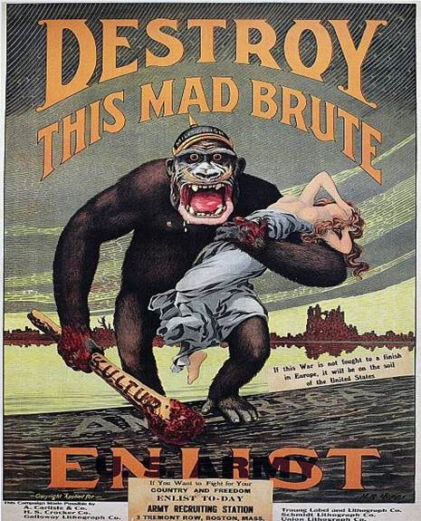
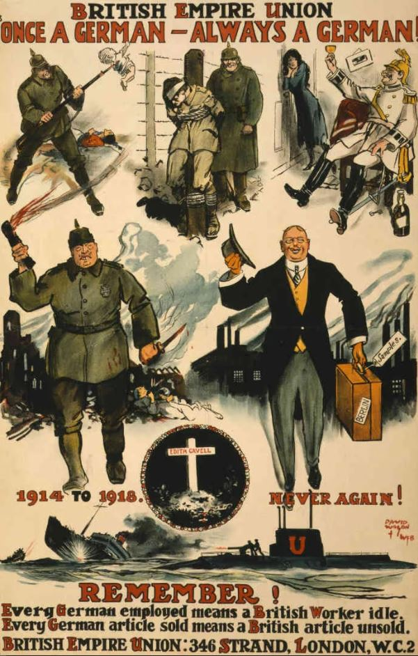
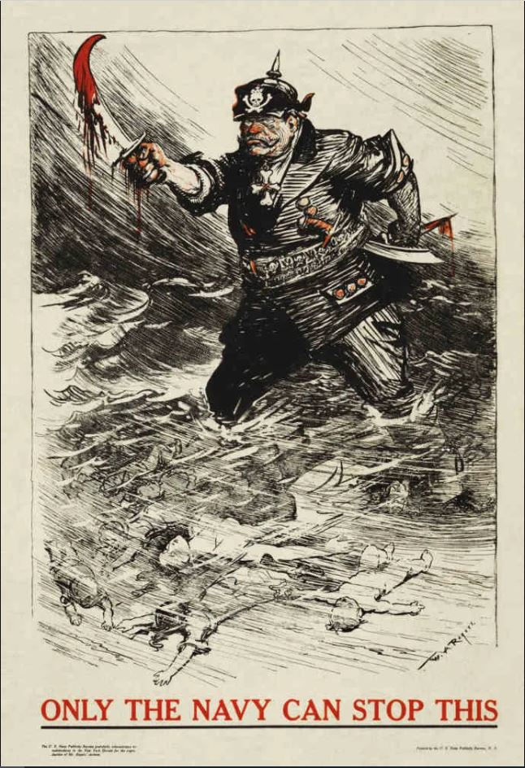

# A Brief Introduction to Economics and Capitalism for Celebrities, Blacks,  Jews, and All Fellow Homo Sapiens

## Introduction, Part I.

What's with the title? Why single out celebrities, blacks and Jews? Have you looked out the window lately given all the hoola regarding KanYE West, the never-ending Jew-Gentile problems and 'antisemitism'? Although all human beings are just fellow homo sapiens, complex cultural and historical factors have led to "identities" which causes many homo sapiens to see each other as groups and that has important ramifications for how they see the world, interact with others, and what they see as the key to prosperity. Let's say a few things about each group.

### Blacks.

Blacks, who find themselves relatively poorer and less educated, given the history of slavery at the hands of "whites", "discrimination" by a surrounding larger majority of non-blacks to various degrees, and many other complex factors, understandably find themselves in an environment where government provided services seem like a good and fair idea. This easily helps us understand why most prominent black leaders instead of supporting free market Capitalism, where the social order is managed by free entrepreneurs and private sector companies which have to innovate and learn from each other(competitors), they support some kind of Socialism where well intentioned government "experts" manage society. They understandably feel like freedom allows or tolerates racism, and leads to various forms of "exploitation", and thus we must have a powerful government of "experts" manage or influence things to various degrees. Let's quote some prominent black leaders:

Martin Luther King mentions: 

>"we are saying that something is wrong… with capitalism….There must be a better distribution of wealth and maybe America must move toward a Democratic Socialism."

Malcolm X sent a letter to then President Truman letting him know that “I have always been a communist."

South Africa’s Nelson Mandela who won the Nobel Peace Prize in 1993 was also a Socialist ideologue. In a statement at the beginning of the trial that would send him to jail for 27 years he said:

>“We all accept the need for some form of socialism to enable our people to catch up with the advanced countries of this world and to overcome their legacy of extreme poverty...I should tie myself to no particular system of society other than of socialism.”

The Black Lives Matter organization which has been taken to almost religious-like reverence by so many well-meaning white people is also understandably an economically ignorant communist-socialist-marxist organization. Black lives matter founder Patrisse Cullors mentioned that "we're trained Marxists".

The need for the Catholic Church to rule society in the past could be seen as a myth, in other words, as "a widely held by false belief" which fooled many bright and caring people into what most of us today consider unnecessary coercion and restrictions. Socialism-Communism was also a myth that fooled many bright and caring people leading to many horrible Communist regimes in the 20th century like the former Soviet Union and Nazi (National *Socialist*) Germany. The idea that racism plays a significant economic factor in the lives of blacks is also another myth which understandably misleads the thinking of many blacks and "minorities" and also the whites which want to help. Many whites, with the best of intentions, might be ashamed of the imperialist past of their ancestors or of the racism of their parents-uncles-friends-etc. or their own "shameful" preference for perhaps blue-eyed blondes and erroneously believe in the myth that such a past-racism-preference is a significant factor in the relative underachievement or problems of other groups-minorities-blacks. A well intentioned economically ignorant person can easily find some "racist CEO" who discriminates based on race and "voilà! this racism is the root of the problems!". This sort of collective sense of guilt which is so pervasive among many whites is what allows Black Lives Matter rioters to riot virtually unopposed. Economic ignorance leads both blacks and whites to increasingly see whatever racism might exist as an increasingly significant problem to fix, via massive government-monopoly-coercion of course, as can be seen by today's Democratic party's prominent focus on 'racial justice'. The level of ignorance and anti-white-male-hate that now dominates the Biden administration and American Democratic Party was nicely summarized by popular congresswoman from New York, Alexandria Ocasio-Cortez, when she mentioned in 1/14/2021:

>"The Republican Party...They don't give a damn about the law. They don't give a damn about order. They don't give a damn about safety. They give a damn about white supremacy. They care about preserving the social order and the mythology of whiteness....They lust for power more than they care about democracy."

Many whites are well aware of and resentful of the fact that since they make more money, they pay more taxes, and eventually have their wealth taken from them to sustain government programs which they dislike and black people vote for so this understandably leads to increased polarization and eventual political-social chaos. 

### Jews.

Next let's say a few things about the vital need for Jews to properly understand economics. "Antisemitism" is obviously a big deal for Jews and rightly so. Naive thinkers, sometimes quite dangerous, blame "The Jews" for all kinds of things, from killing Jesus, to "plotting" "Capitalism" as well as "Communism", for the Black Plague, you name it. Jews have understandably been the scapegoats for countless things man just did not understand in our more mythical past. Since supposedly some Jews were involved in the slave trade, to prominent black leaders like leader of the 'Nation of Islam' organization, Louis Farrakhan, that means that "The Jews", were also largely responsible for slavery. Since Jews inadvertently find themselves overtly represented in Hollywood-music-entertainment, many mistakenly see this as some nefarious conspiracy or proof that "The Jews" in general, are spreading immorality. Near the time of this writing, arguably one of the most famous black celebrities in the world Kanye West, now known as Ye, tweeted:

>"I’m a bit sleepy tonight but when I wake up I’m going death con 3 On JEWISH PEOPLE...You guys have toyed with me and tried to black ball anyone whoever opposes your agenda" 

Soon after, KanYE had dinner with Donald Trump and brought along Holocaust denier-doubter Nick Fuentes, which has caused an immense storm of criticism. Mega basketball star Kyrie Irving has also made national headlines due to having tweeted a movie ('Hebrews to Negroes') that has things many considered "antisemitic". Now what does all this have to do with economics? The world is once again dealing with erroneous Jewish conspiratorial thinking as highlighted by the above. Few object to studying Judaism and its complex co-evolution with other faiths and Western Civilization. What really turns study, comments, or even criticisms of Judaism into "antisemitism" is the monumental error of mistaking Jewish influence resulting from complex evolutionary factors, for the result of nefarious conspiracies as is sadly and understandably the characteristic mark of "antisemites". This mistake of attributing to conspiracy or human reason, what is more the result of complex evolutionary processes, is an intellectual error that is the root, not just of antisemitism, but of our socioeconomic problems and things like the rise of Socialism-Communism-Nazism during the 20th century. And more generally, why mankind is so tribalistic and economically ignorant. And their proper understanding depends on the evolutionary insights of Carl Menger and his so-called ‘Austrian School of Economics’ and men like Ludwig von Mises and 1974 Nobel Laureate in Economics F.A. Hayek. In other words, to really understand antisemitism and its numerous disastrous consequences like World War Two, the Israeli-Palestinian conflict, even the Russia-Ukraine war, and the current spiraling intellectual chaos regarding Jew-Gentile relations, we must understand how the economy works and has evolved as explained by 'The Austrian School'. If familiarity with these men's basic ideas does not reach people of influence in time homo sapiens will destroy civilization. It is that simple. This will make sense soon. 

 
### We are a part of something greater than ourselves. The Market Process and Spencer's 'Social Organism'.

Just like the human body-organism and the numerous "systems" that coordinate it like the respiratory-nervous-digestive "systems", are the result of the actions of some 70 trillion human and bacterial cells but obviously NOT the result of any conscious planning or designing by them, and thanks to the likes of Darwin and a modern understanding of genetics we can understand how 'natural selection' was the inadvertent "designer" of such systems and complex order, the modern global socioeconomic order-'Social Organism', is also coordinated by a "system", by what economists of the so-called 'Austrian School' like Ludwig von Mises and his great protégé F.A. Hayek, referred to as "The Market Process". 'The Market Process' and the "parts" it is composed of like money, prices, economic competition, interest rates, and the legal-religious-governmental frameworks that sustain it, "are indeed the result of human action, but not the execution of any human design" [(Adam Ferguson)](https://www.adamsmith.org/blog/adam-fergusons-great-insight) similar to how cells inadvertently-unconsciously act to create the systems that coordinate multicellular life. The 'market process' shares this trait with language which is also a complex mechanism that is the result of human action but was not consciously designed or invented by people-cells. It took about one billion years for natural selection to evolve the numerous complex biochemical 'systems' that allow single cells to cooperate leading to multicellular animals. Sometimes these mechanisms fail and the cells revert to their solitary ways and replicate wildly, in other words, they become cancerous-tribal or uncooperative and prematurely destroy the larger multicellular organism-order they were a part of. Similarly, it took about 50,000 years for natural selection to evolve 'the market process' which reordered tribal homo sapiens into cooperative members of the 'Social Organism'. Unfortunately, the economically ignorant tribal slightly smarter apes intuitively turn cancerous when they destroy 'the market process' via coercive central planning-Socialism because it inadvertently destroys-diminishes the freedom of individuals which is vital for the functioning of the 'Social Organism'. 
## Introduction, Part II.

Notice how all man-made calamities, from religious slaughters, to world wars, to political chaos, are always the result of large groups of homo sapiens somehow coercing each other via government. We have simply not evolved to understand the economic forces that create civilization, the vital need for freedom and privatization, and the immense harm that too much government can do. Supposedly the Dodo bird quickly went extinct because it had not evolved to recognize humans as potential dangers, we similarly just line up for ‘central planning’ and government coordinated self-destruction over and over and over and over.

Imagine you had a time machine and went back in time about 300 years to Salem, Massachusetts during the famed Salem witch trials where 19 women were hanged for witchcraft, and told people that the world could function much better if there was no slavery, that women should have the same rights and freedoms as men, that homosexuality should not be criminalized and seen as part of homo sapiens, and that six million years ago we had a common ancestor with chimpanzees. People would see you as some devilish monstrosity spreading heretical ideas and quickly “conspire” to kill you. Would this mean that the people at the time were somehow dumb or malicious? Or members of some “vast conspiracy” of “bad guys” or “special interests” intent on taking away your freedoms? Of course not. The people would be fellow homo sapiens acting based on the prevailing myths and incentive structures of the times. If by our modern standards pretty much everything about how people saw the world 300 years ago could be understood as myths, in other words, as “widely held but false beliefs or ideas”, why should we not be open to the idea that we too are likewise immersed in mythology in various areas? And if we are wise enough to consider this, shouldn't we tolerate and defend freedom so that we ensure that we never prevent the busting or correction of our current myths? 

It should be easy to realize that all homo sapiens grow up absorbing a continuously evolving culture-language-"identity"-ideas-myths which then leads them to act in ways that lead to disorder via conflict-coercion-war, or order via peace and prosperity. As Mises tells us:

>"It is ideas that group men into fighting factions, that press the weapons into their hands, and that determine against whom and for whom the weapons shall be used. It is they alone, and not arms, that, in the last analysis, turn the scales."

The centuries of slavery, religious slaughters, persecution of minorities, and all man-made calamities were obviously the result, not of "evil" or "madness", but of the ideas and myths held by homo sapiens at the time, and the mistaken alleged need to coerce each other, and as long as the public remains lost in erroneous mythology that leads to government-coordinated coercion, democracy obviously does little good. Hayek:

>"Perhaps the fact that we have seen millions voting themselves into complete dependence on a tyrant has made our generation understand that to choose one's government is not necessarily to secure freedom."

It is obvious that we should focus on the ideas instead of vilifying people and assuming sinister motives or madness as the source of our problems, yet the fact that this goes largely unnoticed as we constantly segregate ourselves along political-tribal-identity lines is further evidence that we are potentially dangerous slightly smarter apes. When a lion takes over a pride and kills the cubs so that the females will once again be ready to mate, we don’t say that the lion is “evil”, we rightly understand the complex evolutionary factors leading to such actions. It is likewise important to look at our socioeconomic disasters using an evolutionary lens that is free of "blame" and full of sympathy and understanding. Hitler, Lenin, Stalin, Mao, Churchill, Roosevelt, Fauci, etc. were not "evil", which is a linguistic construct inherited from more religious times, they were fellow homo sapiens adored by their respective masses who absorbed horrendous ideas or myths propagated by scholars arising from the complexity of the economy as in the case of Socialism (Hitler-Lenin-Mao-Roosevelt-etc.), and the biochemical order as in the case of CovidMania and resulting coercive lockdowns and damaging coerced vaccinations and more (Fauci). As Hayek tells us:

>"It is necessary to realize that the sources of many of the most harmful agents in this world are often not evil men but high-minded idealists, and that in particular the foundations of totalitarian barbarism have been laid by honourable and well-meaning scholars who never recognized the offspring they produced." (Hayek F. A., 1973, p. 70)

Hayek again:

>"Most people are still unwilling to face the most alarming lesson of modern history: that the greatest crimes of our time have been committed by governments that had the enthusiastic support of millions of people who were guided by moral impulses. It is simply not true that Hitler or Mussolini, Lenin or Stalin, appealed only to the worst instincts of their people: they also appealed to some of the feelings which also dominate contemporary democracies." (Hayek F. A., 1976, p. 134)

### KanYE and The Comming and Vital Battle Between Freedom of Speech and Hate Speech and Holocaust Denial Laws.

Again, focusing on ideas, not the interchangable bodies which hold them, antisemitism, as is widely understood, is simply an intellectual error which must be understood as such. Sadly, running around vilifying "antisemites", or worse, making criminals out of them via 'hate speech' laws as so many understandably scared Jews and their sympathetic supporteds do, is disastrous! This does nothing to overcome the fallacies and does immense harm to fellow human beings who just happen to have absorbed erroneous ideas. As will be discussed in more depth, it is especially dangerous and misguided to have 'Holocaust Denial' laws which make it a criminal act to deviate from a particular interpretation of history which I will summarize in one sentence as ‘A deliberate policy of extermination by Nazi leadership leading to about 6 million Jewish deaths with millions murdered via homicidal gas chambers.’ Consider the following, after the collapse of the Soviet Union the total number of people believed to have been killed in Auschwitz was revised from 4 million to 1.5 million and later to 1.1 million. Prior to this "official" massive "revision", someone rightly saying that the number of people killed in Auschwitz was a gross exaggeration or error or Soviet-Communist fabrication could have been sent to prison in the many countries where it is a criminal act to deviate from a certain historical narrative. Similarly, imagine Gina, a "good" person, reads literature that makes the case that mass-gassings were essentially a complex myth that never really took place as commonly believed and is persuaded by such arguments. We are suposed to be courageous and stand up for the truth as we see it, right? Gina would now be a criminal in many countries for doing what most "civilized" people consider to be her moral duty. 'Holocaust Denial' laws further aggrevate antisemitsm because they make it seem to naive thinkers that there really is some overarching nefarious conspiracy by "The Jews" to further their "control" of society, when there really isn't (at least I don't think so). A trully civilized and wise population knows that, for example, when a young black youth who grows up in a poor and gang-infested city and predicatably commits crimes in considerably higher proportion, he is obviously making numerous intellectual errors due to the ideas and incentive structure in his environment. Similarly, antisemitism and all of our problems must be likewise understood as the result of the evolution of complex ideas and fallacies, and freedom of speech must be understood to be of the most vital importance, which must include vehement opposition to "hate speech" and "holocaust denial" laws. 

In a "notorious" interview Kanye West mentioned that Hitler "...didn't kill six million Jews. That's just like factually incorrect." further shocking many, yet part of the intellectual chaos which will continue to increase is the fact that KanYE is correct! Even in the eyes of mainstream Holocaust historians like the author of the sort of "Bible" of the mainstream Holocaust narrative 'The Destruction of the European Jews', Raul Hillberg, the figure is about 5.1 million. So the tribalistic, burn-the-heritic-type reaction to KanYE by the ignorant emotion-driven masses is mistaken here regardless of other errors KanYE may be making. And finally, at least regarding our introduction here, consider the following astonishing facts. In the Nuremberg Trials held after World War Two, the Russians, in other words, Joseph Stalin, also provided evidence, which can be easily verified in the official Nuremberg Trial documents, that the evil Nazis killed people via an [atomic-bomb type device](http://www.cwporter.com/pg11.htm) and a pedal-driven brain [bashing machine](http://www.cwporter.com/pg15.htm). If those "official" claims which were taken as facts during the Nuremberg Trials were eventually discarded, debunked, or ignored, how can human beings be made criminals for believing that perhaps other aspects of the Holocaust-related atrocity narratives like the mass-gassings and purposeful exterminations, be made criminals? If the mass-gassings and purposeful extermination of Jews is the most "evil" act, don't we want to fully understand how it could have happened? And does this not include understanding the views of people who disagree? Especially when many, including Jews like David Cole, Paul Eisen and countless others, do so knowing that they can go to prison? If you are confident in your views, do you want those you disagree with made criminals? How can historians, especially Holocaust and World War Two historians, not make it a priority that at the very least people who see the mass-gassings narrative and Hitler differently not be sent to prison? When one has a proper understanding of economics and thus how freedom really works, people who are willing to risk their lives and fame like KanYE and Nick for their views, no matter how potentially erroneous they may be, should not only be free to do so, but should be praised for their courage. If their views are ultimately wrong, then obviously the arguments against erroneous views need to be improved, and there is much to learn when trying to understand how people are misled into believing falsehoods. And if they are right, it would just be another example, as with coercive Catholic or Socialist rule, where millions of smart well intentioned people fooled themselves via mythology, and prolongued the myths by outlawing freedom of speech which does two vital things homo sapiens is unaware of, 1.) It protects people from violence just for holding views, even if they are making mistakes, and 2.) leads to the emergence of the competition of ideas needed to discover superior information which includes overcoming myths. 

Could the gas-chamber doubters be right? Are men like chemist Germar Rudolf, and Massachusetts Institute of Technology graduate and Professor of electrical engineering at Northwestern University Dr. Arthur Butz correct in their interpretation of the maniacal exterminationist mass-gassing narrative as just a complex myth that kept growing due to complex factors which of course includes the lack of competition in ideas due to censorship? Did the complexity of events surrounding World War Two simply lead these men and other doubters-revisionists-deniers to make errors? Or are they really malicious towards Jews? If so, what fallacies entered their minds which may cause them to potentially dislike Jews and want to purposely mislead people? Or are they right and mainstream Holocaust historians wrong? If mainstream Holocaust historians are wrong, are they, as with Socialist economists-ideologues-bureaucrats in the former Soviet Union, fooled by a complex mixture of ideology, negligence or genuine error (as could also happen with the doubters-deniers-revisionists)? Or are they malicious? How would this affect so many Jews whose very identity is so intertwined with the gas-chamber maniacal narrative? Why doesn't Yad Vashem, the leading Holocaust organization, expose the fallacies in the literature of the "revisionists"-doubters-deniers? And thus help show their negligence, errors, or expose their "antisemitism"? Why does it treat them as some sinister irrational people? It is true that there are many people who really hate Jews and accuse them of conspiring to do all sorts of bad things. Are mainstream Holocaust historians mistaking the serious revisionists like Rudolf, Butz, and Jews Cole and Eisen, with the naive 'antisemites'? And thus 'throwing out the baby with the bathwater'? Or are they as negligent of their arguments as Catholic priests in the late 1800's were regarding Darwin and his ideas? Why did Yad Vashem eventually pressure Amazon.com and Jeff Bezos directly to the point where they banned revisionist books?

I certainly do not expect this to make sense at this point, but the real answers to the above and important ramifications and how the entire world works, ultimately depends on the insights of 'The Austrian School' economists.

### Celebrities.

Next a few things about celebrities. Celebrities for example tend to be wealthy and can easily afford the best housing, education, medical care and provide for the needs of friends and family who may fall on hard times, so generally speaking they have no need for public services which low-income americans supposedly need. Being social animals, fellow homo sapiens are our biggest assets which helps explain the evolution of altruism and compassion, as well as our biggest competitors which helps us understand our horrendous violence towards fellow men. People with a lot of wealth like celebrities are oftentimes involved in philanthropy, they understandably want to be liked and remembered for having done great things and thanks to their finances they can oftentimes hold unpopular opinions which may ultimately do a lot of good. Since celebrities are closely followed and adored by millions, their views, right or wrong, can have an immense impact. If just the following 10 celebrities, Elon Musk, KanYE West, Michael Jordan, Snoop Dogg, Madonna, Lionel Messi, Cristiano Ronaldo, Joe Rogan, Bill Gates, and Jeff Bezos came together to spread certain ideas, within a matter of weeks they would be adopted by much of the world. Many people believe that celebrities like musicians and athletes are too dumb or uninterested or unmotivated to actually understand economics and thus how the world works. This is a mistake which is also rooted in economic ignorance. Many people who come to understand free markets and real Capitalism do so via a convoluted process which took them years of study to achieve, so they undertandably believe that getting the public at large and celebrities to also understand free markets and real Capitalism is not possible or worth pursuing. But the greatest economists, like Mises, did not just explain how the world works, they also did so with examples and analogies that made it simple enough for anyone to understand and the expectation that the public at large did. So unlike the convoluted thinkers who would not even bother trying to reach the public and celebrities, "Misesians" are optimistic and adamant about reaching everyone. As Mises tells us:

>"Liberalism is rationalistic. It maintains that it is possible to convince the immense majority... It has full confidence in man's reason. It may be that this optimism is unfounded and that the liberals have erred. But then there is no hope left for mankind's future."

Again, to Mises and his intellectual disciples who are writing this book, we either believe that we can succeed in educating 'the immense majority' and thus act accordingly, or "there is no hope left for mankind's future." Fortunately the recent CovidMania self-mutilation of society, coupled with the tribalistic Russia-Ukraine war and increasing chaos all around us is making the need to catch up to Mises' wisdom and execute his educational strategy more and more obvious and urgent to an increasing number of people.

## Part I. Economics: The Wisdom of the 'Austrians'

### Production and Consumption.

Whenever a person works he uses the information in his mind to reorder matter, the trillions of atoms he is made of, to produce his labor and whatever wealth it creates thus increasing the economic pie. If you are a freelancer you produce a product-service-wealth and trade it directly with society (customers) for money, and then trade the money back with society for the wealth you consume. If you work for a company, you produce your labor and trade it for money with your “employer” who combines it with the labor of others to produce a product-service-wealth which is then traded with society for the money from which your paycheck comes. Whether you are a freelancer, employee, or company, what is commonly referred to as sales revenue (your paycheck), is an estimate of the total amount of wealth produced. Costs, like employee wages which will be used by them to consume wealth(food,energy,etc.), are an estimate of how much wealth is consumed from the economic pie. And profits, which are the difference between sales revenue (production) and costs (consumption) are an *estimate* of by how much additional wealth the economic pie has grown. Again, a profitable order is an order (cell-person-company) that produces more than it consumes and is therefore self-sustaining-alive. The global economy or ‘Social Organism’ is really a vast collection of orders-people-companies that are constantly trading with each other, nourishing each other, each trade taking each participant-order from an inferior to a superior state of well-being from its own perspective, otherwise the trade would not occur. When Carl trades a dollar for a hamburger he values the hamburger more than the dollar and the restaurant values the dollar more than the hamburger so the action of trading takes place, which like all action which is not coerced, takes each participant from an inferior to superior state of wellbeing. 

If a teenager uses a tree-trimmer to produce one mowed lawn valued at $50 in 10 hours, his 'rate of production' is $50 / 10 hours = $5/hour. If next month he uses a riding lawn mower and mows the same lawn in 1 hour, he has increased his 'rate of production' 10-fold to $50/hour. Profit-loss calculation motivates and enables all orders-people-companies to guide their actions in the most profitable and thus pie-increasing way, and, very importantly, it also prevents orders from consuming more than what they produce. Unless, of course, they are the benefactors of charity. The wealthier a person-company-order is, the more this order has produced and exchanged for all this money-wealth. Jeff Bezos is one of the world’s richest men because the social order he helped shape and successfully managed, Amazon.com , has been one of the most productive in the world. We know this is the case because millions of human beings traded their money-wealth for its products-services.

Since production is just a transformation-relocation of existing matter-wealth ("fashioning of imperishable matter into more advantageous shapes"), the production of wealth requires the consumption-use of existing wealth. For example, if 10,000 men are to spend 2 years producing an airplane factory, they must consume-use the concrete-materials-food-energy-transportation-shelter-wealth that they (as well as their dependents-family) need while they produce the factory. In other words, there can be no production if there does not already exist enough saved wealth that can be consumed while production takes place.

### Money.

More money does not equal more wealth. Imagine if everyone in the world suddenly had an extra billion dollars. Would this make society wealthier? No. The amount of REAL wealth(goods-services) has not increased by a single toothpick. It would actually lead to less wealth since many people wound stop working-producing seeing their new-found fortune. Would the 10,000 men above be able to produce the factory if instead of having real wealth to use-consume had to consume pieces of paper with dead presidents on them? Of course not.

More money leads to and enables higher prices. For example, if there are 1,000 people in an island (BlueIsle) and each has $100 for a total of $100,000 in the island, can anything sell for $200,000? Of course not, even if they all combined their money such a transaction could not happen because there isn't enough money, but what if each person had $500 so that there is now a total of $500,000? Then yes obviously, prices could go up to $500,000. So for general prices to go up there HAS to be more money. And who creates the money and is ultimately responsible for a general increase in prices? Generally speaking, today all money is created by governments via their central banks (Federal Reserve in USA) and they are thus responsible for the price increases. Let’s say you print yourself 1,000 trillion dollars and start offering people in the USA’s West coast ridiculous amounts of money for their goods-property-wealth. You buy all the wealth in California, Washington, Oregon, etc. As this is happening Americans are growing richer in terms of money but poorer in terms of what really matters, homes-property-wealth. At some point you make it to Florida, by this time it will be packed with about 300 million Americans and perhaps the 1,000 trillion dollars or more you kept offering people. The price of wealth tends to be the amount of money that is offered in exchange for it given all the other things the money could be traded for. With so much money and so little wealth left, the price of everything would be astronomical and people would be much poorer given that you are the one that possesses most of the wealth in the country. Assuming the total amount of money remains stable, if the economy-wealth is expanding, which can only happen if the rate at which goods-services-wealth is produced is faster than the rate at which it is consumed, we expect general prices to go DOWN because the money will sort of get divided among more goods-wealth so less money per item-wealth means a lower price. This last point is of vital importance, under normal-ideal circumstances, as the economy grows we should expect prices to go down and people's savings to buy them more in the future. If the amount of wealth remains stable or grows slower than the amount-supply of money, then we have more money per item, thus higher prices.

Let's go over a final and very important example. Keep your eye on how much wealth is being produced and consumed, and the relationship between the quantity of money, wealth, and thus prices. Let's say Alan prints himself another $100,000 which is enough to hire half the people in BlueIsle for 3 months while they build him a small castle. Alan thinks this is a great idea, he is paying some people more than what they were making before, there were also a few unemployed or unmotivated-to-work people before but he is offering enough money to get everyone working thus achieving "full-employment". Prior to trading their labor for Alan's paper-money, people were producing stuff that they either wanted-needed to consume themselves or could be sold-traded to others who obviously wanted-needed to consume them, they were producing "socially desired" or "order-life creating-sustaining" stuff like oranges-apples-hair-cuts-blankets-baskets-etc. The day half the population begins working on Alan's castle, the island's economic pie begins to lose half its "socially desired" stuff-wealth since half the population is no longer creating it, and begins increasing the amount of rocks, ladders, and other things for Alan's castle. These things, are NOT "socially desired" or "order creating-sustaining" wealth as judged-calculated by the inhabitants. Since the existing $100,000 will be distributed over half as many socially-desired-goods, this would eventually motivate their prices to about double. However, since Alan is further doubling the money supply as he pays people using his newly printed $100,000, on the last days of castle-building, when half the population is still working on his castle and they have also spent most of the new $100,000, prices would have nearly doubled once again making them about 4 times higher than they were before Alan came up with his idea. It should be easy to see that Alan has reordered society in an inferior way. Everyone is "working" and making more money than before, but the unavoidable reality that they are ordered in a less productive way reflects itself in the much higher prices and smaller amount of wealth on average that each can consume. Ideally people now "lose their jobs", and instead of working on the easily identifiable yet disastrous plan laid out by Alan, for a few days there appears to be "chaos" as people discover superior plans and likely transition to their old trades-jobs thus once again reordering society on a far, far more productive way. However, they are **economically ignorant**, so they tell Alan "Can you hire us again to make the castle bigger? You pay us more than what we used to make before. You are about to create massive unemployment". Alan thinks to himself "Gosh! It is a good thing that by creating money I am preventing massive unemployment and chaos. Obviously I must keep providing 'liquidity'!" So the relative suffering continues even as the local newspaper gives Alan the "Citizen of the Year" award. Carl told Alan that what he was doing was disastrous and told people that Alan should just stop creating money and let everyone lose their jobs. The mob labeled him a heartless capitalist and killed him unfortunately. Had Alan been a bad king, who instead of creating money to acquire the necessary wealth to create his castle, simply taxed people at a 50% rate, the people's living standard would have suffered similarly, but they would have easily understood the fact that their wealth was taken from them for the creation of things they didn't want or benefit from for a hopefully more obvious massive loss. 

The creation of money by governments is just a hidden tax that transfers wealth from savers and society at large to the people who get the newly created money. For example, Let's say you have saved $1,000 which can buy you 1,000 items at $1-each. The government via the central bank (Federal Reserve in US) and a convoluted process eventually creates billions of dollars which are given to the newly-created Space Force military personnel so they can trade them for the wealth they need to consume-live and because of this money-creation prices go up 5% so each item is now $1.05 and your saved(or future earned) $1,000 can only buy you about 952 instead of 1,000 items. The 48 items-wealth that you (and other taxpayers) can no longer obtain, is the wealth that the Space Force personnel got to consume. Again, money is not the same thing as wealth, when governments create money they are simply creating an additional tax or transfer of wealth from savers and the public at large to those who get the money. 

    
	

The following graph helps us understand how when the US was still on a gold standard, since gold can't be increased by adding 0s at the end of bars, this prevented the government from acquiring additional wealth-taxes by just creating the money thus prices had a slight downward trend until 1971 when the USA completely abandoned the gold standard. Up to 1971 the US would give foreign governments an ounce of gold per $35 dollars, but to acquire enough wealth from the public in order to give it to people involved in the Vietnam War, as well as grow a rapidly increasing welfare system, the US was creating more dollars than what it could honestly exchange to gold. French president Charles de Gaulle, who wanted the war to end, knew this money-debt-creation was allowing the US to dishonestly acquire the needed wealth to finance the war so he demanded many dollars to be exchanged into gold. The US had enough for France, but was running very low on gold and knew it could not meet further obligations so it just completely stopped dollar-to-gold convertibility and thus end the gold standard. Had the US government tried to obtain this wealth, not via money-creation-inflation, but by raising taxes directly, chances are Americans would not have gone along. Thus from 1971 onward the US government thanks to Fed(Central Bank) money-creation has been able to additionally tax workers-savers causing prices to rapidly increase instead of going down. If you look very carefully at the graph, you will notice two rapid increases in prices, one occurring during the American Civil War (1861-65) and another during the First World War(1914-1918). During wars, tribalistic politicians-ideologues always resort to the price-increasing  money-creation to acquire the wealth needed to feed-clothe-nourish the war effort, because if they had to get the wealth via direct taxation, the public would more easily factor the true costs of the tribalistic warmongering and likely bring an end to such slaughters. 

The graph above helps us see how thanks to technology-progress even though worker productivity has increased by 246% since 1948, compensation has only increased by 115%. Again, once the economically ignorant technocrats-politicians abandoned the gold standard in 1971 and could easily acquire additional wealth by just creating money (more debt) much of the additional production was taken away from workers via inflation-money-creation. The concept of "No taxation without representation!" is bypassed when ideologues can take all the wealth they want from the public by just creating money. This is NOT the result of some 'malicious plot' by bureaucrats, for the most part most are clueless and are only focused on spending (acquiring wealth now) to help the cause-war-welfare-etc. 

This next graph shows how from early march to mid may 2020, the Federal reserve has created about 3 trillion dollars which will be given to people and businesses so that they can exchange this money for wealth they can consume, much of this will be unemployment benefits which will motivate many to not even look for work and thus continue to be pure consumers thus overall the 3+ trillion is leading to a rapid shrinking of the economy and accelerating rise in prices. Again, this is just a transfer of wealth from workers-seniors-some to others as the economy continues to shrink and prices rise compared to what they would have otherwise been without the money-creation. 

### Trade, Money and the Division of Labor and Information.

Trade and money led to the "division of labor and information" which allowed the social order to efficiently compartmentalize information in only the brains that needed it and also accumulate a virtually limitless amount of information with which to continuously restructure itself in increasingly more productive-advanced ways. For example, Mark's brain contains knowledge of how to get coconuts and process them to create pastries. Tom's brain contains knowledge of how to find the best vines and weave them together to make baskets. Jim's of where to find rocks which when split can create sharp knives and how to sharpen them. When Mark trades his pastries for Tom's baskets and Jim's knives he is a benefactor of all the knowledge needed to creating those items yet he only had to know how to make his pastries. Unlike the tribal social order where knowledge is inefficiently repeated across every brain, trade allows for information to be efficiently stored fewer times freeing up more brains to contain more information. We can envision 1,000 men producing and trading 1,000 different types of items requiring 1,000 times more information which without trade and the 'division of information' that it enables would have been impossible to achieve in a tribal society. Also, when Mark trades his pastries for the baskets and knives he can now make less trips to gather coconuts by using the baskets and process them faster by using the knives and thus increase his 'rate of production' from 2 to 10 pastries per day. The pastry-making process has become more productive and also more complex because it was enabled by basket and knife making knowledge. We now have a never-ending cycle of increased 'rate of production' and complexity -> population growth (more brains) -> increased 'rate of production' and complexity -> more brains -> … leading to where we are today with nearly 8 billion people and the inability to fully trace the knowledge that enabled the creation of anything. In Hayek's words: 

>"the greater density of population, leading to the discovery of opportunities for specialisation, or division of
labour, led to yet further increases of population and per capita income that
made possible another increase in the population. [And so on."](https://books.google.com/books?id=YQLYAQAAQBAJ&pg=PA40&lpg=PA40&dq=%22the+greater+density+of+population,+leading+to+the+discovery+of+opportunities%22&source=bl&ots=OdrrCyyGT3&sig=ACfU3U2RrY6L_hQm8BCBOad08o-du-kPtQ&hl=en&sa=X&ved=2ahUKEwj3wOfc4q_pAhUxFjQIHe5VBigQ6AEwAHoECAcQAQ#v=onepage&q=%22the%20greater%20density%20of%20population%2C%20leading%20to%20the%20discovery%20of%20opportunities%22&f=false) (Hayek, 1988, p. 40)

For example, a web-designer can trade his services which are dependent on web-design information that resides in his brain for money, and then trade the money for any of the billions of products-services that exist in the world and are likewise dependent on information spread throughout the world. The websites he creates are also enabled by all the information that enabled the "factors of production" he used to create them, like his computer, monitor, keyboard, software, electricity, the Internet, etc., which themselves are enabled by all the information that enabled their "factors of production" like the computer's memory, processor, and so on. Everything that is produced today is the result of an interdependence of information that spans millions of minds, not just in the present, but in the past as well, because wealth that is currently being produced-consumed is dependent on tools-'factors of production'-information provided further in the past. When he upgrades to a better computer, the information that enabled these improvements also contributes to-enables the improvement of his website production process. Without money how would a heart surgeon trade his costly services for toothpicks? Without trade and money, this "division of labor and information" as well as the inter-temporal cooperation-interlocking-stacking of information just described, and the ability to do profit-loss calculation to ensure that each order guides its actions in a manner that it produces more than it consumes, would not exist and neither would our social order which depends on it.

### Creation and Spread of Information via Economic Competition and its emergence from the tradition of Private Property.

In the 'Social Organism'-economy superior information arises and spreads thanks to economic competition which emerges from the tradition of private property. Private property means that matter is under the exclusive control or ownership of a single person-mind-CPU. Each person is motivated to discover the best information with which to transform or reorder their private property in a way that increases its value or utility. Most of us transform the trillions of atoms that make up our bodies in a manner that maximizes the value-utility of the labor we produce and then trade with other people or companies. Some transform bread and beef to increase their value as hamburgers which are then traded with others, etc. From our freedom to use-transform our private property emerges the 'freedom to trade' it with anyone in the entire planet which inadvertently transforms mankind into a global supercomputer where people via the companies they create are motivated to innovate and learn from each other(competitors) thus inadvertently cooperate to discover and spread superior information and subsequent order. For example, a Honda engineer in Tokyo, Japan, may have invented power doorlocks which thanks to 'economic competition' motivated BMW in Germany, Ford in the USA, and other 'competitors' throughout the world to copy and thus spread superior information throughout the world. Why do they do this? Because people in their role as consumers have the 'freedom to trade' their life-order-sustaining wealth with the better informed auto-manufacturers(competitors), and as producers, to go into the auto manufacturing business. This in turn motivates all competitors to learn-copy each other lest they not get enough revenue-wealth with which to pay their employees a competitive wage so they use their 'freedom to trade' their labor to join the better-informed and thus more productive-efficient orders-companies. Again, this wonderful automatic mechanism of *COMPETITIVE KNOWLEDGE DISCOVERY* is "turned on" or "emerges" from the simple concept, or better said, tradition of 'private property'. Private property gives everyone in our role as consumers the 'freedom to trade' our life-order-sustaining wealth for what we calculate-think is best. This 'freedom to trade-choose' in turn motivates everyone, in our role as producers, to *discover the best information with which to order* ourselves and the matter we control in a manner that produces something society-customers value (our labor, a product-service), which we do by, once again, innovating and-or copying-learning existing ideas-information, in other words, by competing in the economic sense. Most of us simply choose to produce and then trade our labor with a company-order that knows how to further incorporate our labor in a more competitive-profitable way. Via advertising, competitors are motivated to spread the potential usefulness and superiority of their products-ideas as well as the defects-inferiority of their competitors thus accelerating the need to compete-copy-spread superior information.  

A mind-CPU anywhere in the planet that comes up with an improvement will benefit everyone in the world if they are 'free to trade' for his product-service which will also motivate all competitors in the world to likewise improve their actions-order. So we can see how just like in the Olympics we can discover the best athletes in the world due to global competition, so does having the 'freedom to trade' with everyone in the world allows the best ideas to compete and spread globally thus ensuring the best possible global order. As cost-cutting ideas emerge and inevitably spread via competition leading prices to continuously fall, new profitable ideas easily arise and once again spread via competition in an endless cycle of knowledge generation-innovation. For example, computers were once very expensive, but once the price of making them came down enough, people easily realized that every home could have them, which gave birth to our computerized world and the Internet and all the great things that flow from it. The more wealth is produced, the more wealth has to be offered in exchange for labor as companies-orders compete against each other for the labor they need which helps explain why the economic pie grows for everyone. For example, imagine that after a shipwreck you end up in an island where everyone has a machine that can turn dirt into food. Tom wants your labor to build a home, Mark, to build a boat, and Gina to plant a garden. Competition will motivate them to offer you all the food you want and more.
 

### Prices and the Impossibility of 'Central Planning'-Socialism-Communism.

How much wealth had to be consumed in order to produce a gallon of gasoline that sells in Seattle for $3.50? Or a pound of beef that sells in a store in London for $5.35? We can't know for sure, however, we can be fairly certain that it was less than the advertised price which on average must include the costs. The price of any item in the world lets us know that there is an order at that particular place and time that is coordinated by information that can produce the item while consuming less than the advertised price. THAT IS AMAZING! This allow goods to be purchased and combined in a manner that ensures that the combination (like a car) can easily have a price set that properly accounts for the costs-consumption of the whole (car) by just adding the prices of the parts used to produce it (wheels, glass, robotics, labor, etc.), parts which themselves had a price set that included their costs-consumption and so on, each part-input managed-ordered by entrepreneurs-brains-CPUs with highly specialized time-and-place specific information who are always using profit-loss calculation to ensure they are increasing the economic pie. The concept-tradition of 'private property' plays a vital role here as well, it is not until matter-things are privately owned, that they are controlled-coordinated by brains-CPUs that are incentivized to discover the best information with which to reorder-coordinate them in the most productive-profitable way possible.

How do we know whether it is a good idea to build an airport or a school at a particular time and place and also get the necessary wealth without coercion or making criminals out of people who may not want to contribute to them? Only entrepreneours at those times and places can 'discover' if there are enough people whose lives would be improved by trading their wealth for such wealth (airport or school), and how to build them in a profitable and competitive way. The information needed to create-coordinate the social order, like whether to produce cars, or buildings, or pizzas, where to do so, what prices to set, and most importantly, how to produce them in a manner that more wealth is produced than consumed, is information that can only be created by free people dispersed throughout the world thus rendering central planning ideologies like Socialism-Communism IMPOSSIBLE regardless of the good intentions of their members or their intelligence. To see why this is the case consider the following example, a Cuban restaurant in Miami Beach sells a picadillo dish (ground beef, plantains, rice) for $8. Perhaps $1 might be profit, and $7 will be spent in costs, in other words, in the necessary consumption of wealth needed to produce the meal-wealth, things like equipment-electricity-food, and everything employees and their families will consume at home (food, energy) thanks to their paychecks that came from the $7-meal. The businessman discovered 1) that there are enough customers nearby willing to patronize the restaurant at the $8-meal price which necessitates taking into account customer's already existing local competitive options thus providing an improvement in society, and 2) how to reorder $7 worth of stuff(labor-supplies-etc.) to produce the meal. If he sets prices too high, customers will choose other superior existing competing options and thus fail to improve the social order. If he sets prices too low, he won't cover costs and cause more consumption than production thus shrinking the economic pie. These are two vital pieces of information that are impossible for a central planning body to discover and helps explain why every time Communism has been attempted the result has been a much faster rate of consumption than production and eventual famine-starvation-chaos-death. Again, only free entrepreneurs dispersed throughout society, not government "experts" in a central location, are at the right time and place needed to discover people's desires and how to order a business or section of society while setting prices that create a profitable order. The social order exists thanks to the fact that private property maximizes economic calculation by allowing-encouraging every person-mind-CPU to sense-analyze its proximate corner of the world and reorder it to be as profitable-'pie increasing' as possible. Central planning-Socialism-Communism simply reduces the number of brains-CPUs that can do profitable calculation by turning them into order-takers by the smaller number of 'central planning "experts"' who are also too far away to gather the necessarily time-and-place information needed to profitably plan-reorder thus always rendering their planning inferior, leading to more consumption than production or what Mises referred to as ['Planned Chaos'.](https://www.youtube.com/watch?v=7EnHeZXLzTc)

Social order needs two things, wealth to consume as it acts-lives, and information to guide the action in a profitable-pie-increasing manner. As an American I have relatively good freedom of speech, I can say America's 1.2+ trillion yearly military spending or consumption is a horrible idea, but my freedom of speech is useless if my wealth is taken away to sustain bad ideas.  

Try to envision how matter is coordinated by information constantly increasing its value. The restaurant owner discovers laborers-equipment-‘food distributors’ with the right prices to hopefully create a profitable order-restaurant. He places orders for the food/ingredients which can be seen as increasing in value as they are delivered to the restaurant, at a cost of course, that which must be consumed(fuel-food-etc.) by the driver-etc. The waiters begin producing the ‘meal experience’ by seating customers and taking the orders, the cooks increase the value of the ingredients by combining-cooking-transforming them and thus producing the meals, the waiters further increase the value of the meals by further transforming/transporting them from the kitchen to the table. The customers consume the meals, their internal order-cells will further consume them as they produce their heartbeats and all that is required to keep the cells-people-orders alive-etc. Customers, who had previously produced stuff and exchanged it for money, traded money which will then go to the owner, cooks, waiters, suppliers, etc. and then traded with countless orders/businesses so that they too can consume-live. Each actor-order producing and consuming at different rates using prices and ‘economic calculation’ to ensure more production than consumption at the whole restaurant level, and at each individual level as the waiters and cooks manage their personal spending-lives. The food-supplying company uses the prices in its own relevant corner of the world to likewise organize itself profitably. Each actor-order is motivated to sell or trade the wealth it produces for as high a price as it can but the freedom of customers to choose competitors limits how high a profitable price can be. Thus prices, and the vital information they convey, are what allow ‘economic calculation’, they allow cars-picadillo-stuff to be built from parts-beef-inputs, which themselves are built from other inputs, each input managed-ordered by entrepreneurs-brains with highly specialized time-and-place-specific-knowledge-skills, leading to never-ending conveyor belts of interlocking cycles of production-consumption, each moving-reordering matter in increasingly valuable ways. Since prices contain highly time-place specific information it is absurd to arbitrarily copy the price from one place and apply it to another. A similar Cuban restaurant-meal might be profitable in Austin, Texas selling the picadillo for $6.50 because costs-consumption like real estate, transportation, and labor might be lower there compared to Miami Beach. In Oslo, Norway, the costs might be $20/meal due to the additional consumption of wealth that has to take place as the ingredients are shipped so far and numerous other factors, which again, are highly time and place specific and only discoverable by local actors.

Nikita Khrushchev, who followed Stalin as head of the centrally planned (Socialist-Communist) Soviet Union, is credited with saying “When all the world is socialist, Switzerland will have to remain capitalist, so that it can tell us the price of everything”. Unfortunately for Khrushchev and the billions who suffered economic chaos and an inevitable decline in production under Socialist-Communist regimes all over the world, prices in Switzerland (or anywhere else) embody information about the costs/consumption of those particular places at specific times and are no good elsewhere.

With the Internet, pricing information all over the world can help customers find-nourish cheaper-better products-orders-companies and also help producers likewise thus greatly accelerating competitive knowledge-order-spreading but it will NEVER lead to the success of central economy-wide planning because no computers-system can get in the brains of entrepreneurs to predict what products-businesses they will create and thus alter society, and similarly, no computers can get in the minds of consumers and predict how they will choose to spend their money/wealth thus once again altering the social order’s numerous cycles of production and consumption. As Mises so eloquently explains:

>“The consumers, by their buying or abstention from buying, ultimately determine what should be produced and in what quantity and quality. They render profitable the affairs of those businessmen who best comply with their wishes and unprofitable the affairs of those who do not produce what they are asking for most urgently. Profits convey control of the factors of production into the hands of those who are employing them for the best possible satisfaction of the most urgent needs of the consumers, and losses withdraw them from the control of the inefficient businessmen. In a market economy not sabotaged by the government the owners of property are mandataries of the consumers as it were. On the market a daily repeated plebiscite determines who should own what and how much. It is the consumers who make [some people rich and other people penniless.” (Mises)](https://fee.org/articles/inequality-of-wealth-and-incomes/)

Who can anticipate the firing of trillions of neurons in billions of brains to predict-plan the resulting desires-ideas?

 

Since prices that properly estimate costs/consumption can only be set by free entrepreneurs, when the government (central planners) attempts to set them via "price controls" it warps the socioeconomic order in inferior ways. For example, if the free-market price of a gallon of milk is $2.30 in a particular store in Miami which profits 0.30 per gallon (costs = $2.00) and the government mandates the price to be $1.99, then the business is consuming more wealth ($2.00) than what it gets ($1.99) and will eventually go bankrupt causing less milk to be produced leading to shortages. Even if the government sets the price to, say $2.15, so that the business can still profit, it will still lead to eventual shortages for the following reasons. Under normal circumstances the rate of profit tends to be equal-uniform across all sectors-businesses, if higher-than-average profits are being made in say auto-manufacturing, factors of production like labor, materials, real-estate are withdrawn from other less profitable sectors which reduces production-competition in them causing profits to go up in those sectors, while simultaneously increasing production-competition in the auto-manufacturing sector causing the initial higher-than-average rate of profit to go down towards average levels. So by making profits in milk production lower than the average it still has the effect of decreasing, albeit less drastically, milk production which is the opposite of what the economically ignorant masses and politicians want.

It is important to envision the socioeconomic order as it really exists as if looked at from high above. Envision people coming together-apart as companies-orders emerge and dissolve in ever-changing conditions. Superior information arising and rippling-restructuring the social order thanks to competition. As orders get more productive they lure other people to 'trade-with' or 'join-them' by offering more money-wealth for their labor relative to other companies-orders, eventually causing the least productive orders to sort of dissolve as their 'factors of production' like labor, buildings, etc. are bid away to be parts of more productive plans-orders. A sort of swarm intelligence emerges as the all-pervasive public quickly nourishes the growth and spread or superior orders-companies-information, inadvertently expanding the worldwide "division of labor and information" as entire neighborhoods-cities morph themselves in specialized ways as complementary pieces of information-orders segregate themselves in distinct geographical locations like the software industry in Silicon Valley, California and manufacturing in Guangdong, southern China. As Mises reminds us "The division of labour is a fundamental principle of all forms of life." The division of labor is a pattern-way which natural selection rediscovers to enable smaller units-orders to efficiently compartmentalize labor-information as they contribute-to (and are nourished-by) a larger organism they become parts of(Organelles -> Cells -> Organs -> Humans -> Social Organism). Mises again:

>"It is by virtue of the division of labor that man is distinguished from the animals. It is the division of labor that has made feeble man, far inferior to most animals in physical strength, the lord of the earth and the creator of the marvels of [technology." (Mises, 1985)](https://mises.org/library/liberalism-classical-tradition/html/p/7)

### Morals as Superior Information.

Morals are simply ways of acting, they are knowledge which also emerges and spreads via economic competition. Companies-orders that hire-nourish-'trade with' lazy, disrespectful, or corrupt people will be less competitive and be inevitably pressured-selected to hire people with better morals which in turn forces everyone to be respectful and hardworking regardless of race, sex, etc. Similarly, it is hard-working, tolerant, courteous people who thanks to competition inevitably force everyone else to be likewise. As Hayek tells us:

>"Competition is, after all, always a process in which a small number makes it necessary for larger numbers to do what they do not like, be it to work harder, to change habits, or to devote a degree of attention, continuous application, or regularity to their work which without competition would not be needed." [(Hayek, 1981, p. 77)](https://books.google.com/books?id=malYAQAAQBAJ&pg=RA2-PA77&lpg=RA2-PA77&dq=%22continuous+application,+or+regularity+to+their+work+which+without+competition+would+not+be+needed%22&source=bl&ots=kU2cMHmKYQ&sig=ACfU3U30vW96Pca8EGx2LO5qTHNN9P8FNw&hl=en&sa=X&ved=2ahUKEwinl4zg4PDoAhUChHIEHWifC9IQ6AEwAHoECAsQKQ#v=onepage&q=%22continuous%20application%2C%20or%20regularity%20to%20their%20work%20which%20without%20competition%20would%20not%20be%20needed%22&f=false)

As millions of Italians, Britons, Germans and others from all over the world came to America, it was ultimately the competition which grows from 'private property' and thus individual liberty-freedom which stripped these people of their otherwise nationalistic-ethnocentric-tribalistic identities and evolved what came to be seen as the classic American character-ethos of wanting to be seen as a reputable-honest businessman-professional who treats everyone with respect and wears a business suit as opposed to older religious-ethnocentric dress. So not only does 'private property' "turn on" or leads to economic competition and other aspects of the market process and resulting social order-civilization, it also evolves our culture-identity to be ideally suited for participation in the 'Social Organism'.

### Government-'Public Sector' is an Inefficient Monopoly.

Since it is through freedom and resulting 'competitive knowledge discovery' that we both, free people from coercion-tyranny-slavery, and also discover the best information with which to reorder mankind, the role of governments should be to set the framework-laws that maximize such freedom-'competitive knowledge discovery' and NOT to attempt to manage-order society because governmental-'public sector' bureaucracies, being COERCIVE MONOPOLIES which get their life-order-sustaining wealth through taxes-compulsion are immune to the competitive-information-spreading incentives-pressures which motivate-force private sector orders to be efficient-innovative-hard-working. This helps one understand how Communism, which abolishes competing orders-companies and replaces them with a single competition-less monopolistic bureaucracy of 'experts', leads to a massive lack of production-innovation and eventually socioeconomic chaos-starvation as the economic pie continuously shrinks as has happened in every country that consciously attempts Communism-Socialism or inadvertently drifts in that direction as their governments get bigger and bigger (USA-World). Central plans can’t work if people are free to not go along with them, or use property as they wish instead of by the central plans — so they inevitably require compulsion-tyranny. For example, it is a criminal act in Communist countries like North Korea to start a business, in other words, to attempt a superior restructuring of society because it interferes with the plans of "the experts" who run the government. It is also a criminal act everywhere to not pay taxes that sustain public sector bureaucracies like "public education" so there is little incentive or wealth to sustain other, more desirable-superior competitors. For example, the NYC public(monopolistic) school bureaucracy consumes about $29,000 per year to “educate” a K-12 student. Refusing to pay a single dollar that goes to this bureaucracy is a criminal act. Taxes and all transfers of wealth from the private sector to the government, besides being an obvious burden to the people that had to sacrifice a part of their lives to earn such wealth and now have less wealth to trade for the things they want, simply destroy the private sector jobs the taxed-away spending would have sustained and replaces such productive-efficient and pie-increasing jobs for inefficient government ones or worse like militarism-wars. The former Soviet Union had plenty of highly educated scientists-'experts' whose plans required the coercion of millions, but they were thoroughly crushed by free Americans and their 'competitive knowledge discovery'. Socialist regimes and government in general also face an "incentive problem." In free societies, or the private sector, each person-cell is incentivized to be as productive as possible and keep inefficiencies to a minimum since he owns-keeps the additional wealth or losses. On the other hand, the government employee or bureaucrat gets the same pay (ability to then consume) whether his department did a good job (produced a lot) or not, and is also not risking his own wealth since that comes from the taxpayers. The image below is another one of our most powerful memes for explaining the difference between competitive-private-free orders(South Korea) and monopolistic-government-coerced orders (North Korea). Again, keep your eye on how information arises-spreads via competition and continuously restructures the social order. 

Hayek:

>"The argument for liberty is not an argument against organization, which is one of the most powerful tools human reason can employ, but an argument against all exclusive, privileged, monopolistic organization, against the use of coercion to prevent others from doing better."

For 'competitive knowledge discovery' to work wealth must remain in private, not government-public hands. For example, in relatively free countries like the USA you have the freedom of speech necessary to criticize an awful public education system, or the disastrous Iraq and Afghanistan wars, but since you are still coerced via taxation to support those "ideas", the 'competitive knowledge discovery' is inexistent.

In his essay ["Over-Legislation" Herbert Spencer](https://www.econlib.org/book-chapters/chapter-essay-over-legislation/) beautifully comments on the differences between governmental(law-made) orders and private/competitive ones:

>"How invariably officialism becomes corrupt every one knows. Exposed to no such antiseptic as free competition — not dependent for existence, as private unendowed organizations are, upon the maintenance of a vigorous vitality; all law-made agencies fall into an inert, over-fed state, from which to disease is a short step. Salaries flow in irrespective of the activity with which duty is performed; continue after duty wholly ceases; becomes rich prizes for the idle well born; and prompt to perjury, to bribery, to simony. ... Officialism is habitually slow. When non-governmental agencies are dilatory, the public has its remedy: it ceases to employ them, and soon finds quicker ones. Under this discipline all private bodies are taught promptness. But for delays in State-departments there is no such easy cure. ...

>Consider first how immediately every private enterprise is dependent upon the need for it; and how impossible it is for it to continue if there be no need. Daily are new trades and new companies established. If they subserve some existing public want, they take root and grow. If they do not, they die of inanition. It needs no act of Parliament, to put them down. As with all natural organizations, if there is no function to them, no nutrient comes to them, and they dwindle away. Moreover, not only do the new agencies disappear if they are superfluous, but the old ones cease to be when they have done their work. Unlike law-made instrumentalities…these private instrumentalities dissolve when they become needless. ...

>Again, officialism is stupid. Under the natural course of things each citizen tends towards his fittest function. Those who are competent to the kind of work they undertake, succeed, and, in the average of cases, are advanced in proportion to their efficiency; while the incompetent, society soon finds out, ceases to employ, forces to try something easier, and eventually turns to use. But it is quite otherwise in State-organizations. Here, as everyone knows, birth, age, back-stairs intrigue, and sycophancy, determine the selections, rather than merit. The “fool of the family” readily finds a place in the Church, if “the family” have good connections. A youth, too ill-educated for any active profession, does very well for an officer in the Army. Gray hair or a title, is a far better guarantee of naval promotion than genius is. Nay, indeed, the man of capacity often finds that, in government offices, superiority is a hindrance — that his chiefs hate to be pestered with his proposed improvements, and are offended by his implied criticism. Not only, therefore, is legislative machinery complex, but it is made of inferior materials." (Spencer, 1853) 

### Regulatory Paralysis.

With our focus on how information arises and coordinates life-order, we can see that a government regulation is essentially a "way" of doing things, it is information. But unlike information that arises in the private-competitive sector and is constantly being replaced by superior information due to economic competition, a government regulation is information that arises out of a few brains and is then forced upon the entire social order from the top-down via the law and can only be changed via a painfully slow monopolistic-bureaucratic apparatus made up of economically ignorant politicians, lawyers, lobbyists and special interest groups who always lack the necessary local time-and-place-knowledge and incentives to discover what is the best way to do something. In the free-private-competitive sector information moves from the bottom (individual minds-entrepreneurs-innovators) to the top-others-influencers as it is ‘tested’-refined-preferred by the comparisons to other information by billions of minds thus ensuring superior information spreads and is ideally adapted to each specific time and place. This is bypassed by top-down regulation and all government-monopoly action which ultimately comes at the expense of wiser private-competitive action. The more the government regulates, the more it paralyzes 'competitive knowledge discovery'. As government regulations have increased in the health care sector, turning it into a sort of island of paralyzed top-down competition-less-socialist central planning, so have costs. These increased costs have led the sector to grow from consuming 5% of the American economic pie in 1960 to a whopping 16% in 2006 and over 20% 2022 culminating in the Coromunism disaster. The image below helps explain the regulatory paralysis-bureaucratization of the entire medical sector which is responsible for the skyrocketing costs.

What a person must learn in order to legally offer medical advice via licensing of doctors, where he must learn it via licensing of medical schools, what chemical compounds can be legally consumed, how to test drugs, how the medical insurance industry should work, and countless other gigantic bodies of knowledge-information are dictated by monopolistic competition-less bureaucracies like the American Medical Association (AMA), the Food And Drug Administration (FDA) and numerous others. By comparison, the Information Technology sector has very few government regulations so competition motivates the creation and spread of superior information at breakneck speed and is obviously transforming our world right before our eyes. Teenagers can work at Google-Microsoft-Amazon and write the software that keeps planes in the sky or people alive via software in medical equipment, yet there is no American Association of Computer Programmers dictating what or where such knowledge can be obtained similar to how the government via the AMA regulates-monopolizes-paralyzes the medical sector via the licensing of doctors, medical schools, insurance sector, etc. There is no government monopolistic bureaucracy ensuring the proper functioning of the software that runs PCs, smart-phones, the Internet, or ensuring the lack of malware or viruses in software. Freedom and competition in the Software Development industry is even quickly evolving culture. It is increasingly seen as uncool and backward to have a traditional degree, where one wastes thousands of dollars and time physically attending gigantic temple-like universities, inefficiently ("professors" instead of popular online videos you can pause-rewind) "learning" things that have nothing (English 101, etc.) to do with being a productive software-web-IT professional. Thanks to this lack of monopolistic centralized decision making-regulating-paralyzing, education in the Software Development-IT world is astounding. At places like www.freecodecamp.org thousands of people are going from 0 experience to highly-paid computer programmers in just a few months for free. IT companies who reach a large enough size ultimately due to the great services they provide, and therefore the useful-profitable knowledge they contain, like Microsoft, Google, Amazon, and many others, go about creating their own educational institutions which train and test people using their products and technologies which are solving real problems and have been shaped by years of fierce competition. There are over 2.1 million individuals worldwide who have become Microsoft Certified Professionals(MCPs) by studying for and passing exams created by Microsoft. These exams change frequently to reflect the never-ending cycle of knowledge generation that exists in this freer and less regulated sector of the economy. Economic ignorance leads many to believe that since one has to be seemingly more careful with medicine, such monopolistic regulatory oversight is somehow necessary. This is irrelevant, if it is superior knowledge that is needed, which includes figuring out how careful to be, freedom and competition is the best way to discover it, period. Nobody knows who the greatest programmers in the world are, there is rightly no Nobel prize for them, the nearly 30 million lines of complex computer code that make up the Linux Operating System that runs most of the world's computers and is now an integral part of the 'Social Organism' were created not so much by 'smart' people, but by pure competition. If the medical sector, or better yet, the entire world-wide economy was as deregulated and thus as competitive-innovative as the Software-IT sector, the rate of innovation and prosperity would skyrocket and in all likelihood people who as of today have 5-10 years left to live might be able to beat dying of old age. Only the truly economically woke can easily accept the feasibility of this statement. In graph below one can see how the more regulated a sector is (Hospital Services) the more expensive-consumptive it becomes.

One of the numerous flaws in how the AMA goes about regulating the world of medicine is in the assumption that medical professionals have to be some of the brightest and most dedicated people around, which it attempts to achieve by making entry into medical school and training such an arduous and ultimately expensive process. But this assumption is false, what cures people, or produces any product or service in today's world, is not so much hard working bright individuals, it is the tremendous amount of knowledge and cheap technology that the market-process-coordinated world puts at our fingertips. This flaw is not specific to the AMA, it applies to our educational establishments and much of how we look at learning and the role of human intelligence. 

The market process and resulting world-wide "division of labor and information" is far, far more important than individual intelligence-IQ-effort. For example, Mike knows he can incorporate Tom (who has down syndrome) into his landscaping company by having him perform simple tasks in a manner that increases the company's 'rate of production-revenue' in terms of landscaping services by an additional $4 per hour ($640 per month). Mike trades $3 per hour ($480 per month) for Tom's labor to make a 1 per hour (160 per month) profit, and after just 10 hours of labor-production and trade, Tom can produce a mindbogglingly complex tablet by trading his $30 for it. Thus it currently takes about 10 hours of labor for a low-IQ person to produce something that was impossible to create just 20 years ago. "But he didn't really create the tablet!" thinks the economically ignorant. But guess what? The economically woke knows the neither did the company that "manufactured it". Did such a company create the tablet's CPU? Or the memory-camera-touchscreen-battery-plastic? Or any of the machinery-tools required to produce the aforementioned components? Of course not. The "manufacturer", just like Tom, mostly traded and added a relatively minuscule amount of new information compared to what it already got from the "Social Organism" and its world-wide division of labor-information that has been evolving for thousands of years. Due to massive economic ignorance, Tom's truly astounding rate of production is impossible to achieve because it is either illegal for someone to trade their labor-production for a rate lower than the minimum of $12 per hour (i.e. California), or because the legal expenses related to paying someone less than the minimum make it unprofitable to do so. Minimum wage laws are regulations which essentially outlaw all production that does not occur faster than the legally mandated minimum and hurt the least productive members of society who need wealth the most. Elderly who due to old age eventually produce at a slower rate, teenagers, etc. 

Government regulations, which again, are inferior competition-less information which is imposed on the social order by force, not only paralyze the superior competitive knowledge discovery that would otherwise exist and enable the growth of paralyzing-inefficient bureaucracies, they also allow BAD ideas to be much harder to change. We only have to remind ourselves of the Catholic Church’s regulation of speech-thought which led to the persecution of thinkers like Galileo Galilei and thus the general retardation of scientific progress to various degrees. Bad ideas, like Socialism-Communism must have intellectual persecution in order to prevent criticism or ideological competition. So once again we must highlight that freedom, is not only indispensable for the competitive discovery of innovations, but also for discovering the TRUTH.

### Patents.

By understanding how patents do far more harm than good we can continue to solidify our vital understanding of how information coordinates the social order. One of the reasons why we so naively fall for the erroneous idea that patents are good for society is because we greatly overestimate the importance of the individual or company making the discovery while being unaware of how it is 'the market process', via its various mechanisms like prices, the profit motive and competition, which plays the key role in innovation. Competing orders-companies, due to the fact that they are already in business competing with each other, contain knowledge that has to be relatively similar. If one competitor has knowledge that leads to much more productivity-profitability, it would drive some competitors out of business, and it would also motivate competitors to copy-emulate the superior knowledge thus leading to a state where once again all competitors contain more or less the same knowledge and inevitably come up with new products-improvements-innovations. Which particular mind manages to stumble upon a new innovation has more to do with chance and circumstances than anything else. Patents inevitably turn competitors which are ultimately cooperators since we are constantly learning from each other as we compete, into bitter rivals; give credit to one where many, or better said, the entire social order via the market process and world-wide division of labor are involved; they slow down the market process by preventing further innovation by competitors whose ideas are based on patented ideas because they now have to pay large sums to patent holders; they remove competitive pressure from patent holders thus making them lazier and worth their time and money to go into the damaging business of suing patent infringes thus retarding technological progress; and since the patent system is overseen by a monopolistic and bureaucratic government organization, it is bound to grow more inefficient and chaotic and also prone to manipulation by the better-connected. Patents, just like regulations, simply create-spread paralysis in the market process. The information technology industry, although less regulated than the health care sector provides a good example of how patents begin to paralyze an industry. Prior to 1981 computer programs could not be patented and this helped spark the explosive growth of the computer-software industry. As Microsoft founder Bill Gates tells us:

>"if people had understood how patents would be granted when most of today's ideas were invented, and had taken out patents, the industry would be at a complete standstill today. I feel certain that some large company will patent some obvious thing… If we assume this company has no need of any of our patents then they have a 17-year right to take as much of our profits as they want. The solution to this is patent exchanges with large companies and patenting as much as we can." [(Bill Gates, "Microsoft Challenges and Strategy," memo, May 16, 1991)](http://antitrust.slated.org/www.iowaconsumercase.org/011607/0000/PX00738.pdf )

So Gates clearly saw how patents would lead to paralysis. Unfortunately his solution at the time was not to argue for the abolishment of patents altogether(which I don't blame him for), but to attempt to protect his company by patenting as many things as possible with which to threaten-protect itself from others in this new ecosystem of warring-litigating patent holders. Given the incentives, this is the strategy that works or is "naturally selected", thus we have bigger and bigger patent holders fighting it out in order to progress, while at the same time making it harder and harder for the little guy or new competitor to innovate.

Without patents, the social order is constantly improving and moving the best information which can be copied freely-quickly, but existing patents inadvertently disincentivize this more ideal outcome and cause research-wealth to be diverted for the discovery of non-patented inferior information. For example, a whopping 77% of new drugs approved by the FDA are not "new" in the sense that they make some significant improvement compared to an existing drug; they are what are referred to as "me-too" drugs. These "me-too" drugs are usually inferior to drugs already on the market to treat the same condition, they simply allow competing drug manufacturers to enter the market to treat a condition where other companies might be making huge profits due to their patents-monopolistic position.

Innovating is a lot easier than people think. As previously mentioned, as prices or costs of production go down, that which was prohibitively expensive becomes possible which in turn makes other things possible and so on. The world is vastly more innovative today than it was 100 years ago not because we got any smarter because obviously our biology has not changed, but because the market process has made it easier to innovate. Some innovations revolutionize entire fields and make it easy for further innovations to come about. For example, how much easier was it for scientists to make biology-related innovations once the electron microscope took magnification from about 2,000 times to over two million? How much easier was it to invent all sorts of gadgets once electricity came about, or computers, or the Internet? The market process and continuously evolving world-wide division of labor can be seen as a sort of ever-growing ladder taking humanity up an infinitely high tree whose fruits are innovations. For the most part all we have to do is easily pick them off the branches when the ladder gets us there. Very expensive endeavors that only seem profitable if granted patents can be seen as attempts to grab a fruit-innovation that is currently too high up in the tree and we are better off just waiting for the normal technological progress to get us there by cheapening all related research-etc. instead of damaging the workings of the system-ladder in an attempt to make gains that really leave us worse off due to the damage made to the ladder-system by patents.

The damaging pro-patent ideology is also adding to tensions between patent enforcing nations and developing nations who are being coerced or erroneously persuaded to implement patents while also being sort of accused of "stealing our ideas without proper compensation". This is rooted in the same fallacy of attributing innovation to those making the innovation as opposed to the market process. So-called "developed" areas like North America, Europe, and Japan became developed because the market process managed to work well enough in those areas as to incentivize and coordinate minds in a way that so much knowledge was created, and this was done, in spite of patents, not because of them. Old people, being more likely to be found with cancers, does not mean that having cancers leads to old age, it means that natural selection has built us in a way that we can continue to live for a while in spite of the cancers. Too much government, just like too much cancer, eventually destroys the super-structure. The market process' ability to organize the social order in ways that lead to what we would call progress is amazing. A little freedom goes a long way. Technological progress in the 20th century has been great, in spite of cancerous government bureaucracies, wars, patents and other misguided government regulatory frameworks which we believe to be the creators or managers of social order while they are in fact its retardants or destroyers to significant degrees. Think about how truly unfair the following is: the Chinese had the misfortune of having much of their 20th century destroyed by war and a truly communist economy which led to the deaths of tens of millions while the market process used millions of brains in the US to discover new ideas, and now that the Chinese increase their freedom and begin to have their social order be coordinated by the market process, they have to pay royalties to the West. This seems pretty "unfair" to me. Developing nations like India and China should not feel like they are "stealing" ideas from the more developed nations, and likewise the United States should not be souring economic relations based on patent infringement which you can be sure is a significant part of the economic saber-rattling that the economically clueless-tribalistic Trump administration is doing.

### Savings, Interest Rates, Business Cycles, and Recuperating Coronavirus Job Losses.

Finance-banking and interest rates are other vital aspects of the 'Market Process'. Besides the more obvious function of safeguarding savings and pooling the savings of many people to allow the execution of bigger projects which would have been impossible if entrepreneurs were limited to the few savings-wealth of friends and family, banking-finance and more specifically the phenomenon of 'interest rates' also play a nearly miraculous role. For example, assuming interest rates are at around 8-10%, some people, those who have no desire to start a business or have inferior business ideas they expect will have a return on investment (ROI) lower than 8%, will be motivated to lend their money to banks to earn ~8% interest and by doing so they refrain from consumption-spending, thus increasing the amount of wealth-savings available to the future borrowers. The banks are a place where such saved money can be combined, easily accessed and loaned out in different quantities to nourish ideas-businesses-restructurings of different sizes. Banks charge borrowers a higher interest than what they pay to savers-lenders and profit the difference. For example, they lend 1 million to John who uses the money to pay for his business' consumption as it produces (has sales revenue) $1,300,000 worth of stuff thus growing the economic pie by 30%. He pays back loan with the 10% interest (1.1 million) and keeps the $200,000. The Bank pays the savers 8% ($80,000) and keeps the %2 ($20,000) with which to pay-for-nourish its own consumption. Something amazing is going on here!!!. Interest rates motivate the accumulation of wealth and movement of money from minds-CPUs that have inferior ideas that can grow the economic pie slowly (0-8% rate) to minds that have superior ideas and can grow the economy faster (> 10%) thus giving a tremendous sort of 'computational boost' to society. To the economically ignorant, banks-financier-money-lenders, making a living by charging interest without seemingly having to "sweat" seems immoral-unethical, but the economically woke can see how they play a vital role in pairing savings with the best ideas and the interest rate is like a barometer that helps decide whether a mind should do the saving or borrowing. The savings-wealth of the rich, like all wealth in the private sector, is eventually spent on the private sector sustaining efficient private sectors jobs that will tend to grow the economic pie by at least the prevailing interest rate. Taxing such wealth-savings from the rich just destroys those jobs-orders and leads to relatively unproductive government consumption. If you take away the wealth that the rich spend on creating yachts and big homes, you have destroyed the jobs-livelihoods of the yacht and big-home builders. 

It is important to realize that, as the great economist Henry Hazlitt writes in his classic “Economics in One Lesson”:

>“ “Saving,” in short, in the modern world, is only another form of spending. The usual difference is that the money is turned over to someone else to spend on means to [increase production”,](https://fee.org/resources/economics-in-one-lesson/)

and that this increase in production has to be at least large enough to pay back the loan with interest. The economically ignorant masses are unaware of the fact that thanks to the finance-banking sector, the savings of the much vilified "rich" is the very wealth that private sector workers consume while they go about increasing production by an amount greater than the current interest rate. Taxing "the rich" just removes this wealth and the private sector jobs it would otherwise sustain and gives it to government where it is inefficiently consumed while producing little in comparison leading to massive relative losses. 

A society that saves little is sort of stuck in the same cycle of production and consumption and is unable to nourish a new business-idea-restructuring for the time it might take before it produces wealth. Where would our 10,000 airplane factory builders get the wealth to nourish their consumption for the 2 years it would take them to even begin making new planes if others had not saved it? How long would it take for such savings-wealth to exist if savings grow very slowly? On the other hand, a society that saves a lot is constantly making wealth available for superior ideas-businesses-restructurings and thus growing and advancing technologically much faster. 

The more people save, the more money banks will have to lend out and the lower the interest rate will be as banks compete with each other by offering a lower interest rate to lure borrowers. This also means that there is more REAL wealth available to sustain more ideas-businesses, the REAL wealth that savers did NOT consume when they gave their money to banks. If interest rates are at 10%, it does not make sense to borrow-consume to nourish an idea-restructuring that will have a return on investment of less than 10%, but if they go down to 3%, then it does make sense for additional entrepreneurs to borrow and nourish ideas that will yield 10% ROI to profit the 7% difference. Now, VERY IMPORTANT!. What happens if interest rates are lowered, not because more saved-unconsumed wealth is available, but because central banks increased the money supply("bank credit") to "artificially lower" interest rates from the "natural rate" of 10%, to the "artificial rate" of 3%? What happens is that additional projects-ideas which would NOT have been attempted before will now be attempted even though the needed wealth to sustain them to completion will not exist eventually leading to a sort of "bust"-bankruptcies, and partly-finished projects which squandered wealth. Mises has a masterful analogy that goes as follows. At any moment in time given a certain real "natural rate"(again, we assume 10%), there exists enough wealth in terms of bricks-wealth needed to create 100 buildings-projects. If people have really saved more to bring down the interest rate from 10% to 3% there are now more bricks-wealth and 120 buildings-projects can be completed, but if the interest rate has gone down to 3%, not because there really are more bricks-wealth-savings, but because more money has been created, the bases and some scaffolding for 120 buildings is attempted, but eventually, due to the fact that there are now more businessmen with more newly created money which was used to lower the interest rate competing for the same amount of bricks-wealth, the price of bricks (factors of production like labor,land,energy,materials) goes up more than would have otherwise been the case, which eventually causes many entrepreneurs to face the unavoidable fact that there did not exist enough wealth-bricks at the right prices to complete their projects in a profitable way, therefore a sort of bust-chaos and loss of wealth will eventually happen as inevitable bankruptcies occur. Partly finished buildings that are inhabitable are obviously massive losses, and even though eventually perhaps 70 buildings are completed, the wealth-bricks that could have completed an extra 30 was consumed-used to create 50 unfinished ones. Mises summarizes:

>“Credit expansion cannot increase the supply of real goods. It merely brings about a rearrangement. It diverts capital investment away from the course prescribed by the state of economic wealth and market conditions. It causes production to pursue paths which it would not follow unless the economy were to acquire an increase in material goods. As a result, the upswing lacks a solid base. It is not real prosperity. It is illusory prosperity. It did not develop from an increase in economic wealth. Rather, it arose because the credit expansion created the illusion of such an increase. Sooner or later it must become apparent that this economic situation is built on sand.”[(Mises L. v., 2006, p. 162)](https://books.google.com/books?id=n2o4k-RaWrcC&pg=PA162&lpg=PA162&dq=%22that+this+economic+situation+is+built+on+sand%22&source=bl&ots=J362cHTdkY&sig=ACfU3U2dd0wZHn-qAwigsnFxCOXK8hYdrA&hl=en&sa=X&ved=2ahUKEwi739ry0PDoAhUclnIEHcY5BzwQ6AEwAXoECAwQLw#v=onepage&q=%22that%20this%20economic%20situation%20is%20built%20on%20sand%22&f=false)

The sort of bust-chaos will occur in one of two ways depending on how the central banks act. If the myth-error that creating "liquidity"-money is beneficial persists as the government via the central banks attempts to 'bail out' more and more industries-businesses-people, either by sending money to people directly or adding it to banks to keep interest rates low and thus continuing the illusion that there is enough saved wealth-bricks, then the hopefully obvious result is hyperinflation and an intensifying unproductive chaos as money's vital coordination of profit-loss-economic calculation breaks down, leading to more consumption than production, riots, famine, who knows. Eventually people will switch to a foreign currency or something else for money. The better scenario is that the central banks stop the money-creation. Remember, the creation of money just transfers wealth from society at large to the entities receiving the money, it is just a transfer of wealth. Unfortunately the wealth is being transferred to orders-governments-businesses that are misaligned, ultimately consuming more than producing, thus continuously shrinking parts of the economic pie, so you have less wealth and more money and the obvious relative higher prices. Stopping the money creation-inflation will do several beneficial things: 

1) It will allow wealth to remain in the control of the brains that created it in the first place and thus contain superior 'profitable information', in other words, the information needed to order society in a manner that creates more wealth than it consumes which is precisely what is needed. When the government creates money and gives it to some entity, like when it sends a check to someone who lost his job due to Coronavirus lockdowns who will simply trade the money for wealth to consume, this obviously just reduces the economic pie while adding additional money leading to relatively higher prices so everyone else will consume less, and also incentivizes the person to not even work-produce. If the money is given to some inherently inefficient government bureaucracy we again have consumption by its employees with little wealth added in return thus continuing the relative shrinking of the economic pie and higher prices. If it is given to a private sector company, it will most likely be a misaligned-unprofitable order-company which will once again lead to a relative shrinking of the economy although not as severe or quickly as the first two scenarios. 

2) Stopping money creation-inflation will also cause interest rates to rise to whatever level truly coordinates the level of savings and investment possible. Initially and temporarily this will be very high which is great, those projects-businesses for which there weren't enough bricks-wealth to complete in a truly profitable manner and were fooled into trying by borrowing at low interest rates, will no longer be able to do so and finally go bankrupt and their 'factors of production' like existing buildings and labor, will be sold-laid off and their prices will come down enough to the point where entrepreneurs will once again be able to incorporate them into truly profitable plans-orders thus realigning the social structure of production in the best possible way. If 120 buildings-projects are mistakenly being attempted, you want those that can't possibly be finished to fail as soon as possible so they stop consuming the wealth-bricks that can go to profitable plans/buildings.  

3) The temporary high interest rates will also motivate people to save and thus consume less so they can earn the higher interest rates which will provide the necessary REAL wealth-savings to sustain further economic growth and also quickly bring down interest rates to more normal levels.

Again, the information needed to organize labor-society can only be discovered and acted upon by free people-entrepreneurs who are at the right time and place and have the ideal incentives. Taxes, or creating money which is just another way to transfer wealth or tax, simply removes wealth from the private sector where it is part of profitable orders which grow the economic pie on average at a rate greater than the prevailing interest rate, and gives the wealth to government which for the most part just consumes it adding little productivity in return leading to horrendous relative losses of prosperity-progress. No matter how chaotic it might seem due to the potential number of bankruptcies, the quicker we allow them to occur and prices to fall, the quicker will entrepreneurs-people discover how to once again order labor and existing "factors of production" in profitable and thus truly pie-increasing ways. This applies just as much to a recovery from a Central Banking-inflation-created business cycle as it does to quickly figuring out how to reorder millions of people who are out of work due to Coronavirus-hype and related government lockdowns. Right now I could easily hire 50 people in my building for $1-hour and rent them out to give massages, do laundry, deliveries, etc., however, competition from other entrepreneurs-brains-CPUs-themselves who have superior information would pay them more and thus lure them away from my inferior order so that very quickly everyone would be incorporated in the most profitable plans the millions of competing brains can come up with. It is of course vitally important that minimum wage laws are abolished so we allow all profitable ideas-restructurings to occur. 

The Coronavirus lockdowns have led to more consumption than production thus obviously shrinking the economic pie. The less seed a farmer has to plant for the next crop, the smaller the crop will be. Since there exists less wealth, the wealth that can be traded for people's labor will be smaller and therefore people should expect lower wages. Most of the 35+ million people who have lost their jobs would probably be able to work in the same companies as before if they are wise enough to accept correspondingly lower pay. Most of us have been made poorer, we will have less wealth to trade for meals at restaurants which means less wealth-revenue for restaurants and correspondingly smaller wages if they are to remain in business-profitable. Since many businesses, especially restaurants, already pay minimum or close to minimum wages, many will not be allowed to lower wages and have to stop producing altogether.

When a business like an airline goes bankrupt and ownership-assets are now in the hands of creditors, what usually happens is that the creditors are motivated to sell the business to a competitor who is likely to have the best ideas-information leading to profitable use of resources-labor and will thus typically be the highest bidder for the old airline-business. That's all, financiers-investors take losses and often employees also see their wages reduced as part of a now-profitable company-order. Economic education is obviously the most important thing needed to allow the necessary freedom for this to happen. 

Hayek summarizes the cure:

>“And, if we pass from the moment of actual crisis to the situation in the following depression, it is still more difficult to see what lasting good effects can come from credit-expansion. The thing which is needed to secure healthy conditions is the most speedy and complete adaptation possible of the structure of production … determined by voluntary saving and spending. If the proportion as determined by the voluntary decisions of individuals is distorted by the creation of artificial demand, it must mean that part of the available resources is again led into a wrong direction and a definite and lasting adjustment is again postponed. And, even if the absorption of the unemployed resources were to be quickened this way, it would only mean that the seed would already be sown for new disturbances and new crises. The only way permanently to “mobilize” all available resources is, therefore, not to use artificial stimulants—whether during a crisis or thereafter—but to leave it to time to affect a permanent cure by the slow process of adapting the structure of production to the means available for capital purposes.” [(Hayek F. A., 1932, pp. 86-87)](https://cdn.mises.org/Prices%20and%20Production_5.pdf)

#### You can't print savings-wealth. The Errors of Keynes, Krugman and the mainstream.

It should be easy to see that you can’t “print savings” at least not the REAL wealth-savings that the REAL world needs to consume as it sustains production, yet to John Maynard Keynes, arguably the most famous mainstream economist, such money-only savings [“are just as genuine as any other savings”](https://www.marxists.org/reference/subject/economics/keynes/general-theory/ch07.htm) (Keynes, 1936, p. 47) Let’s look at another absurd statement from Keynes which further reflects the utter ignorance of the vital role savings play in the economy:

>“…whenever you save five shillings, you put a man out of work for a day. Your saving that five shillings adds to unemployment to the extent of one man for one day — and so in proportion. On the other hand, whenever you buy goods you increase employment…For if you buy goods, someone will have to make them. And if you do not buy goods, the shops will not clear their stocks, they will not give repeat orders, and some one will be thrown out of work. Therefore, oh patriotic housewives, sally out to-morrow early into the streets and go to the wonderful sales which are everywhere advertised. You will do yourselves good…And have the added joy that you are increasing employment, adding to the wealth of the country because you are setting on foot useful activities…Surely all this is the most obvious common sense. For take the extreme case. Suppose we were to stop spending our incomes altogether, and were to save the lot. Why, every one would be out of work. And before long we should have no incomes to spend.” [(Keynes, 1963, pp. 152–3)](https://www.economicsnetwork.ac.uk/archive/keynes_persuasion/Saving_and_Spending.htm)

Wow! First of all, when most people save their money they invest it, which for the general case here we’ll just assume that it is loaned out at interest. The money still gets spent by the borrowers as Hazlitt already reminded us. With respect to his “extreme case” where people save all their income and don’t spend. Why bring up such a foolish scenario that would never be in anyone’s best interest to attempt? Who does not want to trade-spend for the food, gasoline, wealth they need to survive?

Keynes, like most of his adherents (and the public at large sadly), is also utterly ignorant of the vital fact that ‘economic activity’ must be coordinated in a way that produces more than it consumes, otherwise it is obviously shrinking the economic pie. Yet this coordination requires precise knowledge and is something only millions of free individuals and businessmen can achieve by using profit-loss calculation at the individual, household, and corporate level. Unaware of this, Keynes disastrously encourages the purposeful destruction of wealth just so people are put to work rebuilding it even though the effects of this are a massive shrinking of the economic pie. He writes:

>“…activity of one kind or another is the only possible means of making the wheels of economic progress and of the production of wealth go round again.…why not pull down the whole of South London from Westminster to Greenwich, and make a good job of it…Would that employ men? Why, of course it would!” (Keynes, 1963, pp. 153–4)

One should not be fooled by fancy money-related terms or mathematical equations. Complex-looking mathematical equations-models-Econometrics are just as inappropriate for making sense of the socioeconomic order as they are for making sense of how trillions of cells and bacteria coordinate the biological one. As Mises writes:

>"As a method of economic analysis econometrics is a childish play with figures that does not contribute anything to the elucidation [of the problems of economic reality"](https://mises.org/library/what-wrong-econometrics) (Mises, 1962, p. 63)

If you just keep your eye on the cycle of wealth production and consumption, most economic fallacies can easily be avoided. The housing that comprises the ‘South of London’ exists, it is then destroyed thus a huge loss in wealth has occurred, then a massive amount of existing wealth has to be consumed in terms of food-energy-materials-etc. to sustain many men who produce new buildings. The net result is the loss of existing housing and the wealth needed in exchange for new buildings. Had the housing not been destroyed, Londoners would’ve still had them plus new housing or whatever else the men would have produced as they consumed the same amount of existing wealth as before.

So the erroneous belief that real savings-wealth can be “printed” to then “stimulate the economy” (i.e. ‘activity of one kind or another’ even if you have 0 regard for whether the people are ordered in a way that produces more than it consumes), provide the one-two punch of fallacies that keep the mainstream slightly smarter apes making the same errors over and over, culminating in the most horrific economic fallacy that could possibly exist, that war is good for the economy and its corollary, that World War Two is what got the USA out of the Great Depression of the 1930s. Consider the following absurdity by 2008 Nobel Laureate in Economics Paul Krugman:

>"Think about WWII…it brought us out[of the great depression]. If we discovered that, you know, space aliens were planning to attack and we needed a massive buildup to counter the space alien threat…this slump would be over [in 18 months"](https://www.youtube.com/watch?v=MuI9C3Tv4Mk)

How can getting millions of people to consume-'wear-down' existing wealth to produce weapons which are then used to destroy fellow human beings and their property be anything other than an obvious reduction in life-wealth-order? Krugman's statement is the perfect example of what Mises once told students: 

>"Don't be afraid to speak up. Remember, whatever you say about the subject and however wrong it might be, the same thing has already been said by some eminent [economist."](http://www.libertarianpress.com/rothbard/essential/toc.htm)

### The Benefits of Immigration.

The free migration of people allows them to quickly become parts of and expand the most productive orders thus vastly increasing production. A person in Africa is stuck in an unproductive order which lacks good laws (respect for private property of course), roads, advanced tools-factories, large groups of already-highly-educated and productive minds-order so his production might be $5 per day. By just moving to a more advanced-productive country-area like the USA, even without knowing English, he can do many jobs managed-aided by a bilingual English speaker when necessary and easily increase his rate of production to say $7-hour or $56-day, an 11-fold increase in his rate of production, benefiting his life tremendously and that of existing American-world producers because they now have additional customers that can actually afford their products instead of poor Africans that can't. In countries like China, every day thousands of relatively unproductive farmers who are producing wealth at a rate of say $10-day are moving to cities to join-'work-with'-use factories which might triple their rate of production to say $30-day. Similarly, one of the reasons why the USA has been far more productive than the similarly sized Europe is because people have had the freedom to easily move to the areas-companies that are more productive and there have been no internal tariffs and other impediments to free-trade and thus 'competitive knowledge discovery' within a large area and population. When countries allow foreign investment, they make it profitable for wealth to be shipped to poor countries to create the tools-factories-order that can increase the productivity of workers, but it is even better when the workers have the freedom to quickly move to and incorporate themselves with the already existing more productive order.   

### The Evolution of Money: Menger's Flux-Capacitor Idea of the Social Sciences.

In our earlier example showing the benefits of trade and resulting 'division of labor-knowledge', what if Tom was not interested in Mark's pastries and wanted a blanket instead? Mark would have to find the blanket-maker, hope he was interested in his pastries, make the trade, and finally trade the blanket for the basket. But what if the blanket-maker was not interested in pastries either and wanted wine instead? One gets the point. This problem, of having to run around setting up intermediate trades to make the trade you really want is commonly referred to as “The Double Coincidence of Wants” problem because for a trade to happen you need the coincidence that both parties are interested in the goods they have available for trade. We must always keep in mind that biological order-life, whether it is the cells that make up a person, and therefore the person and therefore the social order, is in a constant cycle of production and consumption of wealth. Simply being alive has a cost, in other words, the amount of wealth that must be consumed in order to stay alive. The man who spends 3 hours setting up a trade is consuming food-energy, his family and all that depends on his production will be consuming as well. The more time-wealth you have to spend-consume running around setting up the intermediate trades the higher the 'cost of transaction' becomes and the less time you have for production, and there will come a point where you will be more productive hunting and gathering and abandoning all the benefits of trade than spending all day setting up intermediate trades while you starve to death. So the great benefits of trade like the division of labor and knowledge which is necessary for civilization can only be realized if we solve the double coincidence of wants problem. 

This is where the evolution of money plays a vital role. Menger’s explanation of the emergence of money and its ramifications is the “flux-capacitor” idea of the social sciences. It is the idea that makes ‘time-travel’-‘understanding society’ possible and is in all likelihood the most important insight to have coalesced in the mind of a human being.

As people traded, they realized that there were some goods that most people were willing to trade for, not necessarily because they wanted to consume them, but because they knew they could later use them to trade for the things they really wanted. For example, let's assume Mark is now a member of a 1,000 member market-oriented society where goats were very common. People could use them for their skin-fur, milk, and meat, and most households had at least a few. Because of this, even if Mark already had more goats than he needed for milk-skin-meat, he would still be willing to accept them as payment for his pastries because he knew that given the goats’ popularity there was a high chance that he could later trade the goats for the other goods he really needed. Even if the 'basket-maker'-Tom did not want Mark's pastries there would be a good chance that he would accept one of his goats, and even if he didn’t want the goat either and Mark had to contact the blanket-maker, if he did accept the goat it would have saved Mark from having to see if the wine-maker would trade with him. Essentially what happens is that by offering to trade a more popular good Mark increases the chances that his attempt at trading will be successful so the average number of intermediate trades goes down the more widely accepted the goats are.

Once people started using a common ‘medium of exchange’(the goats) the double coincidence of wants problem went away and goats became the money in the society. The more people, say Adam, Biff, and Cindy, started accepting goats in exchange for their products, not just because they valued the goats due to their milk-fur-meat, but because they too realized that they could later trade them for what they wanted, in other words, the more people valued them as money, the more incentive others, say Dan, Ellen, and Frank, would have to also accept goats as a form of payment because they saw how Adam, Biff, and Cindy would later accept the goats as well. Goats now were valuable for 4 things, their skin-fur, milk, meat, and as money, as something people value because others will trade for it, therefore making the goats valuable and tradable with an even greater number of people. More people begin to accept goats as payment because they realize they can trade them with more people, leading to more people noticing that more people are accepting goats and so on, until eventually the majority of people, if not all, would be using goats and thus goats became the major source of money.

Without money one trades two specific goods for each other but a lot of unproductive time and effort must be wasted making intermediary trades to trade for what you really need. Using money two quick trades take place, first one quickly trades a specific good for the generally accepted good (money), then one quickly trades the generally accepted money for what one really needs. Mark would sell a batch of his coconut pastries for money (a goat), and then quickly trade the goat for the basket or knife, assuming everyone accepts goats by now. Thanks to money, very little time, effort, and consumption needs to take place while one does the trading, leaving that time/wealth available for increased production and growth. In other words, the 'transaction costs' have been greatly reduced.

In the example above as well as in the real world it is important to note that money was not a deliberate invention on the part of any individual or government. What eventually becomes money naturally arises as it is inadvertently selected by people following their own selfish interests. By inadvertently overcoming the ‘Double Coincidence of Wants’ problem, these societies inadvertently enjoyed the benefits that trade brings to a social order. As great economist and modern founder of the Austrian School of Economics Carl Menger tells us:

>"As each economizing individual becomes increasingly more aware of his economic interest, he is led by this interest, without any agreement, without legislative compulsion, and even without regard to the public interest, to give his commodities in exchange for other, more saleable, commodities, even if he does not need them for any immediate [consumption purpose."](https://mises.org/library/nature-and-origin-money) (Menger, 2007, p. 260)

The easier it is to trade, the more fluid, and faster the previously mentioned benefits of trade occur and the faster the society that benefits from them will be able to constantly rearrange its social order into increasingly more productive and technologically advanced states.

Given that money greatly facilitates trade and therefore greatly increases the rate at which a society progresses we have to now consider what qualities lead to the best money. For example, let's say a society uses elephants for money, elephants are big and indivisible. You might be interested in trading some of your elephants for blankets but you feel like one elephant for one blanket is way too much, unfortunately you can't offer a quarter of an elephant. Elephants can also run away, get sick and die, and can get very angry and destroy property. So a society that used elephants for trading might miss out on many trading opportunities. So what are some of the qualities that make good money?

1. Wide acceptance as a medium of exchange. You want the money to be accepted by as many people as possible, this allows you to trade for the most amount of goods and services. Goods and services that now become available to your calculating brain.

2. It should be seen as valuable by itself, like gold for example. Gold can be used as money yet it is valuable for ornaments and industrial purposes. This greatly helps meet quality #1. If something is valuable by itself, more people are willing to trade for it which means that you will be able to trade this money for a greater amount of goods and services.

3. You want money to be durable. You don’t want your money to be burnt away, or die or run away from you like an elephant can. You want it to be a durable store of value.

4. Divisible and easily aggregated. You want to be able to divide the money into smaller units to enable trades for items of low value and you also want to be able to combine your money into large quantities to facilitate expensive trades.

5. Convenience. Money should be convenient to carry and transfer.

6. Money should be relatively scarce or hard to manufacture. If the money is easy to manufacture, then people have more incentive to create money than to actually produce real wealth. If dirt is accepted as money then people will just dig dirt and offer that in exchange for goods from fools. The economic pie is increased by dirt, while it is reduced as the dirt-making people consume the real wealth they were able to exchange the dirt for. A society that uses an abundant thing like dirt for money would have the products it produces brought into the possession of people that came up with the best way of creating money-dirt as opposed to the people that added useful products or services. Once again try to picture it from high above. When Alan started using money to build his castle, the most important things in society, the people and their brains were drawn and directed away from productive activities that were good for the whole social order, activities which increased the economic pie of useful goods. The useless and damaging knowledge of counterfeiting was rewarded. Given that money can be used to restructure the actions of the social order it is of vital importance to societies that those who obtain money do so by producing things of value to society, in other words, by increasing the economic pie of socially desirable goods, goods that people are willing to freely trade their money-wealth for. If Alan would have produced many great things of value to society in exchange for money and then used his large savings, which came from previous socially beneficial production to build his castle, although the effects would have been similar(prices would have first declined as Alan removed money from economy as he saved it, and later increased as Alan injected his savings back into the economy), society would have benefited in the past from all the great things Alan produced which would have strengthened it or improved it in some way. The destructive effects of inflation will plague societies that make the mistake of using money that can be easily manufactured or counterfeited. Their productive structures will be distorted leading to a weaker and less productive social order. Good money forces every brain to think of a way to add something to the economic pie that society values and is willing to trade for(for most of us we add our labor). It forces everyone to always take part in the endless pie-increasing-cycle of production-trade-consumption. Good money can be trusted to show the optimal relationships between the values of goods in society and make efficient social calculation possible. Bad money will cause a society to have its structure distorted for the benefit of the people controlling the money supply like Alan did in our simple example, or as is the case in real life, governments and their well-intended-yet-economically-ignorant tribal politicians. Once ideologues-politicians-technocrats can just acquire wealth by creating money, whether malicious, or just economically clueless, they can bypass the will of citizens and  "Taxation without representation" is bypassed. 

Cattle were the most commonly used form of money in early civilizations, Menger again:

 
>"In the earliest periods of economic development, cattle seem to have been the most saleable commodity among most peoples of the ancient world. Domestic animals constituted the chief item of the wealth of every individual among nomads and peoples passing from a nomadic economy to agriculture. Their marketability extended literally to all economizing individuals, and the lack of artificial roads combined with the fact that cattle transported themselves(almost without cost in the primitive stages of civilization!) to make them saleable over a wider geographical area than most other commodities…The trade and commerce of the most cultured people of the ancient world, the Greeks … showed no trace of coined money even as late as the time of Homer. Barter still prevailed, and wealth consisted of herds of cattle. Payments were made in cattle. Prices were reckoned in cattle. And cattle were used for the payment of fines… Among the Arabs, the cattle standard existed as late as [the time of Mohammed."](https://books.google.com/books?id=pFva23_vWzkC&pg=PA263&lpg=PA263&dq=%22In+the+earliest+periods+of+economic+development,+cattle+seem+to+have+been+the+most+saleable%22&source=bl&ots=ibFegT8Qx5&sig=ACfU3U0B3UP9h1e5nYML-xcn9LJt9J13ig&hl=en&sa=X&ved=2ahUKEwjsi4a2tPnrAhXOpFkKHXvPD1UQ6AEwBHoECAgQAQ#v=onepage&q=%22In%20the%20earliest%20periods%20of%20economic%20development%2C%20cattle%20seem%20to%20have%20been%20the%20most%20saleable%22&f=false) (Menger, 2007, p. 263)

Just like complex environmental factors create selective pressures that favor the spread-emergence of certain genes-information, the advantages of living in cities allowed for superior ideas to emerge and spread faster, so incentives-pressures to "select" a more suitable money for city-life arose leading to a change from the 'animal standard' to the metallic standard and eventually by the early 20th century gold had been 'naturally selected' as the best money. Let's briefly discuss why. It is widely accepted as money, everyone knows gold is valuable and willing to accept it as a form of payment. Gold does not rust or burn away, it can be stored and not decay for an eternity as far as people are concerned, it is durable. It can easily be melted and divided into smaller pieces of any size and also combined to make large purchases. It is easy to carry around. It is very heavy but by the time it gets too heavy to carry you are making very large and infrequent purchases. BUT MOST IMPORTANTLY...Gold is relatively scarce or hard to acquire. If the money is easy to manufacture then people have more incentive to create money than to actually produce real wealth which would weaken the social order relative to others who had better money.

By the early 20th century gold had arisen as the best money. It met all the criteria previously described, helped people all over the world trade and therefore expand the division of labor and knowledge all over the world, bringing great benefits to those societies that embarked on trade. It is important to note that just like money was not consciously “invented” by people neither was the gold standard. Mankind invented money and the gold standard as much as it invented us.

Let us remind ourselves that since gold can't be "printed" and thus easily increased-controlled by a single body which can then use it to warp the social order via central planning like Alan did, the 'gold standard' inadvertently made it much harder for governments to grow thus keeping more wealth in the pie-increasing-innovating-peaceful competitive private sector. A bad idea that requires directly taking wealth from people is much easier to correct than one which can acquire the wealth it needs by just creating money and sort of fooling the public-itself. The gold standard made it much harder for the slightly smarter apes to go to war with each another because the true costs-consumption of war will easily reflect itself in painful higher taxes and thus a proper cost-benefit analysis of the war by the public-king will help the ideas of peace and mutual understanding compete with the tribal-innate good-us vs. evil-them. But with inflation-money-creation, such evolved constraints-wisdom which helped prevent war and central planning are discarded. It should then come as no surprise that the most horrific disasters the slightly smarter apes get themselves into, massive world-civil wars and the viral spread of central planning ideologies to various degrees have coincided with the abandonment of the evolution-created-international-gold-standard and a move towards the "rationally" constructed "fiat"-paper-electronic convoluted mess we have today. In the old days, rulers-kings would sometimes run out of gold with which to pay their troops and the wars would end, but this would not be the case as central banking began to emerge, giving "great leaders" a new way with which to sustain and prolong to even more severe levels the destruction that war and central planning brings. As Prof. Salerno mentions in one of his many great lectures at the Ludwig von Mises Institute:

>“Wars have invariably been financed by printing money since the invention of paper money. Indeed, it might be said that paper fiat money and central banks were invented mainly to finance wars. The first irredeemable paper currency in the Western world was issued in 1690 by the British colony of Massachusetts in order to pay its soldiers in its sporadic wars of plunder against the French colony of Quebec. The first central bank in history, the Bank of England, was established in 1694 to finance the mercantilist and imperialist foreign policy of the Whig party that had gained control of [the British government.”](http://www.mises.org/multimedia/mp3/misescircle-ny06/Salerno.mp3) (Salerno, 2006)

The monopolizing of the banking and financial institutions by governments and their “experts” and regulations has not only helped create all sorts of crises, it has also retarded the further evolution of financial institutions themselves, with bitcoin and cryptocurrencies being the new exception-competition. The following quote by Hayek captures all this beautifully:

>“…Like morality, law, language, and biological organisms, monetary institutions result from spontaneous order — and are similarly susceptible to variation and selection. Yet monetary institutions turn out to be the least satisfactorily developed of all spontaneously grown formations. Few will, for example, dare to claim that their functioning has improved during the last seventy years or so, since what had been an essentially automatic mechanism based on an international metallic standard was replaced, under the guidance of experts, by deliberate national ‘monetary policies’. Indeed, humankind’s experiences with money have given good reason for distrusting it, but not for reasons commonly supposed. Rather, the selective processes are interfered with here more than anywhere else: selection by evolution is prevented by government monopolies that make competitive experimentation impossible.” (Hayek, 1988, p. 103)

And again, more concisely:

>“the basic tools of civilisation – language, morals, law and money – are all results of spontaneous growth and not of design, and of the last two organized power has got hold and thoroughly [corrupted them” ](https://books.google.com/books?id=9IpEBAAAQBAJ&pg=PA495&lpg=PA495&dq=%22last+two+organized+power+has+got+hold+and+thoroughly+corrupted+them%22&source=bl&ots=uofnkCSJes&sig=ACfU3U1sbjb7_naq8xk8-ZqOAzSakIjSeQ&hl=en&sa=X&ved=2ahUKEwj37avy_uLsAhUjwVkKHa0iBaMQ6AEwA3oECAEQAg#v=onepage&q=%22last%20two%20organized%20power%20has%20got%20hold%20and%20thoroughly%20corrupted%20them%22&f=false) (Hayek, 1981, p. 163)

Consider the following, right now you are an incredibly complex order, yet going without oxygen for a few minutes will cause a sort of “economic chaos” in your body that will make it impossible to recover from even if oxygen becomes available again. The same thing WILL happen to the social organism if the world-wide division of labor and monetary system breaks down, perhaps even for just a few months or less, or if a few key cities or financial institutions-system are disabled in either a cyber-attack or inevitable bug-error, or as we are seeing due to the Coronavirus because the apes scare themselves into totalitarian paralysis. Just imagine what would happen if the electronic systems that coordinate how the banks interact with the Federal Reserve breaks down for just a few weeks, and that for whatever reason credit cards and checks or transfers don't work during that time thus leading to a complete breakdown of monetary profit-loss order-sustaining calculations leading to a rapid pie-decreasing chaos. Totally clueless bureaucrats-apes and "great leaders" might succeed in getting enough people behind them to carry out some master plan, but the apes would consume more wealth-order than it actually produces as it "succeeds" in carrying it out thus continuing the socioeconomic destruction because ONLY freedom and privatization with a sound monetary system and profit-loss calculation in the private sector can create socioeconomic order. A modern gold standard where real physical gold is distributed throughout society might prevent against such disaster. But discussing hypothetical improvements to our eventual monetary chaos is beyond our scope. We just want to understand the potential fragility of the socioeconomic order since it is something that has sort of evolved without hardly anyone really understanding how it works and the slightly smarter apes can destroy it at any moment like they did during Lenin's Communist-Bolshevik revolution which we'll soon discuss.

We have discussed how from the tradition of private property(1) emerges the ‘freedom to trade’(2) which leads to the emergence of the ‘division of labor and information’(3), ‘competitive knowledge discovery’(4) which helps civilize our morals and discover the truth, and ‘economic calculation’(5). The emergence of these 5 and other parts of 'the market process' are as unplanned-designed as money whose evolution was needed to enable the above to function in large numbers of people. This is key for understanding why we live in this complex society which hardly anyone understands and with our "reason" we constantly attempt to destroy via central planning. 

Again, we are slightly smarter tribal apes that have been "civilized" and turned into members of Spencer's "Social Organism" by the same process that turned solitary cells into complex multi-cellular organisms. "Processes of selective evolution". If every cell in our bodies suddenly had the same intelligence and ability to reason that we do, including our current understanding of biology, they would wake up to a bewildering complexity and attempt to use their "reason" to impose a supposedly superior plan-order and while doing so wrecking the far more intelligent systems that evolution-competition had fine-tuned for billions of years. The "reason" of so many intelligent and well educated intellectuals during the last couple of centuries led them to attack private property and the freedom that grows from it because they erroneously thought it led to 'exploitative capitalism', 'social injustices', and thought that central planning-regulation by well intentioned-educated "experts" and resulting competitionless-monopolistic bureaucracies would lead to far more prosperity. They were wrong of course, their "reason" proved to be far less intelligent than the evolved traditions which protected-invented "private property" and the 'market process' that emerged from it which hardly anyone at the time (or today) understood.

### Cultural Evolution via the emergence of freedom and De-evolution via Socialism.

Having discussed several aspects of the market process like economic competition and interest rates, as well as how 'private property' inadvertently leads to its emergence and civilization, we can now discuss how 'processes of selective evolution' evolved the 'market process'-'Social Organism' without conscious human planning or design. In other words, how vicious tribal slightly smarter apes had their culture-ideologies-software changed from their instinctual 'Law of the Jungle' which they have been practicing for millions of years to civilized commerce, tolerance, and at its very core, respect for private property. We discuss the process that tamed-civilized us, a process that was the result of our actions, but not of our conscious planning, similar to how cells inadvertently created the respiratory, circulatory, nervous, etc. systems that made up multicellular organisms. As Carl Menger asks:

>"How can it be that institutions that serve the common welfare and are extremely significant for its development come into being without a common will directed towards establishing [them?"](https://cdn.mises.org/Investigations%20into%20the%20Method%20of%20the%20Social%20Sciences_5.pdf) 

Hayek answered this monumentally important question via an evolutionary-competitive process that goes more or less as follows. If we envision mankind about 100,000 years ago, we would see a sort of petri-dish of competing cultures(languages-concepts-rules-laws) that are being 'naturally selected' based on their ability to grow the groups that contain them relative to other groups. Customs-concepts-rules-etc. that inadvertently cause their respective social orders to grow whether it'd be via conquest, successful defense, migration into, imitation, etc., will expand their order AND the very customs-concepts-rules-ideologies-etc. which helped them thrive. Every rule-law has an effect in the productivity-growth-survival of a social order. Given that a society-tribe is likely to have dozens of such rules it is impossible to know the exact impact of any one of them when considering the overall competitiveness of a society-order. For simplicity's sake let us focus on just one rule, what is the optimal punishment for theft? In the tribal past a stereotypical tribe might believe in some animal-spirit-god. The very existence-discussion of the concept among members of the tribe, coupled with inevitable dreams which would make such concepts seem real and shared among the tribe, would be enough to greatly solidify such mythology-religion. The shaman sacrifices the virgin and it happened to rain the next day thus making the "science" certain-settled. If the rains didn't come, perhaps she had to be sacrificed facing another direction. Again, what matters is how certain ideas make enough sense to create the 'echo chamber' that leads to them being carried out and propagated. Let's assume that in culture-tribe 'A' when a man steals he is killed which might deter many thefts but decreases the number of people in the group and all the productivity that this person might contribute in the future. In tribe 'B' they cut off a hand, and in tribe 'C' 10 lashes. Let's assume that tribe A's custom-rule of killing the thief actually proved to lead to a "fitter" social order. Perhaps it turns out that cutting off the hand led to an unproductive person that became a big drain on rest of tribe and a weak-useless fighter when it came to offense-defense so it was better if he was dead, and that lashes proved to not be enough of a deterrent which led to many thefts and retaliatory violence which turned out to be more costly than losing a member of the tribe. For simplicity's sake let us assume that this was by far the most important custom-rule affecting the growth-fitness of the social order, and that because of this, tribe-culture 'A' eventually displaced the others so that its kill-thieves rule-custom survived while the other punishments disappeared. The kill-thieves rule, is the result of human action, yet not the result of conscious human planning or design with the reasoned or conscious goal of having a more competitive-fit social order. The real designing of this rule or cultural element was made, not by innate instinct or human reason, but by 'natural selection'-competition-'group selection'-'cultural evolution'.

This concept of 'cultural evolution'-'group selection' allowed Hayek to identify a sort of 'third dimension'-source-mechanism for discovering-spreading knowledge which was neither instinctual (tied to our genetics-biology), nor the result of our conscious reason. As Hayek liked to refer to it, it was a mechanism for creating-spreading information which laid "between instinct and reason" and is the largely unknown-understood source of knowledge that played the vital role in the evolution of the market process and those related social institutions. Consider the following example, omnipresence, the ability to be everywhere at all times is another concept that would provide a great benefit to religions that used it to describe their God. Without God's omnipresence you could get away with breaking the rules that give society order and only have to face the consequences brought upon by fellow men. But if God is everywhere, watching your every move, you will be much more likely to follow those rules that give your society a productive social order. A similar case can be made for the concepts of "sin" and "evil". Did clever men "conspire" to create our religions to control us? Of course not. Like the 'market process', they too "are indeed the result of human action, but not the execution of any human design". It could be said that an omnipresent God is one of those culturally evolved-designed concepts that is far more important than anything our "reason" has ever invented, as Hayek writes:

 >"...we may owe to these religions the preservation - admittedly for false reasons - of practices that were more important in enabling man to survive in large numbers than most of what has been accomplished through reason."

These concepts-rules help enforce constraints on what for brevity's sake we'll refer to as our evolved tribalistic('small group')-primate-like nature-instincts-'law of the jungle', which for millions of years were shaped by things like violence, cannibalism, rape, what today would be considered pedophilia, tribal warfare and other practices which are now generally seen as abhorrent and whose relatively recent suppression via culture-religion-law enabled the emergence of the 'Social Organism'-civilization. Growing up is about programming-molding our flexible brains into learning all of these rules and thus rewiring them to be as happy as possible even though many of these restrictions go counter to our 'uncivilized instincts'. We have tentacle porn, Q.E.D. Obviously the molding-brainwashing fails quite often when we engage in rape-torture-militarism-war-"sin" and more. One can easily speculate about how the simplicity and pro-private-property character of Judaism's Ten Commandments ('Thou shalt not steal-murder-'commit adultery'- 'covet(neighbor's…)) and monotheism helped it be more 'viral' and thus be 'naturally selected' over other beliefs-religions that might have been more complex-confusing-contradictory and also be less respectful of private property thus inadvertently foregoing the emergence of the market process and corresponding 'Social Organism'-Civilization.

Knowing that 'private property' is the simple tradition from which emerges a chain-reaction of incentives which creates civilization, we can look at the past and see a sort of petri-dish of inadvertently competing cultures and realize that those cultures whose customs inadvertently became more peaceful and thus less violent, extended peace, friendship, trade to those outside the tribe, etc., in other words, respected "private property" and thus individual liberty more and more, would inadvertently gain the emerging benefits of superior ‘competitive knowledge discovery’, become more technologically advanced-powerful, and as they grew relative to other groups, they would inadvertently spread the very customs and evolving economic system (capitalism) that allowed them to reach such relative heights. This ‘cultural evolution’ happened mostly without the design, intention, or the “reason” of homo sapiens. A great example of this process was the ‘Protestant Reformation’. For centuries the Catholic Church’s traditions held immense coercive-monopoly-competitionless power which prevented or retarded individual freedom and emerging 'competitive knowledge discovery'. In the early 1500s, among other religious reinterpretations, Martin Luther preached that indulgences (payments to the Catholic Church to help one go to heaven) were unnecessary, that a person could go to heaven by believing in Christ without the Catholic Church’s approval, and that the Bible itself, not the Church’s edicts-interpretations was what mattered. This helped reduce the coercive-monopoly power of the Catholic Church and spark a pro-freedom and thus emergent 'competitive knowledge discovery' that would lead to skyrocketing rates of innovation-production-prosperity in Europe-Christendom. Now, very important! Did Martin Luther “reason” that his religious reinterpretations would accelerate 'competitive knowledge discovery' leading to global Capitalism and homo sapiens' recent sky-rocketing prosperity? Of course not! Just like solitary cells millions of years ago inadvertently created the respiratory-circulatory-nervous-etc. “systems” that led to multicellular organisms without "designing them", so is the free-market-Capitalism “indeed the result of human action, but not the execution of any human design” (Adam Ferguson) or as Carl Menger writes, it arose “as the unintended product of historical development.” Hayek elaborates:

>“We have never designed our economic system. We were not intelligent enough for that. We have stumbled into it and it has carried us to unforeseen heights and given rise to ambitions which may yet lead us to destroy it.” (Hayek, 1981, p. 164)

Let us see the same process working further in the past. Due to numerous evolutionary pressures involved (megafauna extinction-etc.), agricultural-grain-bread-based society, although inferior and suddenly out of synch with our evolved big-game-hunter carnivorous biology in terms of nutrition at the individual level, was more conducive to trade, the resulting division of labor-information-competition, and thus a large more productive-powerful social order *at the group level*. Nomadic tribes can't carry around large buildings-granaries, increasingly-complex tools-weapons-etc. Instead of sharing things which was vital for tribal-communist intuitive existence, privatization became more important-productive. The privatization of land-resources-others(slavery)-women-children and accompanying-enforcing myths-taboos-religions began to be naturally selected for. Our very concept of the "self" became more individualistic and less tied to a tribal-communal identity. We went from animalistic promiscuity-gang-bangs(women can have multiple orgasms and enjoy sex for longer uninterrupted periods than men due to sex with multiple males for millions of years), to a stricter and more privatized family structure with the necessary taboos-myths-software needed to enforce them ("...you shall eat bread..." Genesis 3:19, Ten Commandments...). Pre-agricultural man didn't even have a word or linguistic construct for a biological father, this cultural concept-language arose due to the natural selection of agricultural and pastoral societies which benefitted from such privatization, over the tribalistic-hunter-gatherer-communist groups that didn't. Egyptian civilization, although populated by relatively malnourished agrarian people, had an advanced division of labor-commerce, could feed and equip large armies and thus ultimately became one of [modernity's cultural great-grandparents.](https://www.youtube.com/watch?v=bY2v6AnEyuU). 

Rules relating to sex are crucial given the biological importance and potential turmoil relating to it. For example, at some point we developed strong taboos and punishments for sex with animals. For example, the Hebrew Bible mentions:

>"Whosoever lieth with a beast shall surely be put [to death." Exodus 22:18](https://www.mechon-mamre.org/p/pt/pt0222.htm)

>"And thou shalt not lie with any beast to defile thyself therewith; neither shall any woman stand before a beast, to lie down thereto; it [is perversion." Lev. 18:23](https://www.mechon-mamre.org/p/pt/pt0318.htm)

For the Hittites we have:

>"If a man has sexual relations with a cow, it is an unpermitted sexual pairing; he will be put to death"

However,

>"If a man has sexual relations with either a horse or a mule it is not an offense"

The above can help us understand some of the roots of the modern political Left(Darwinian-scientists-irreligious) vs.  Right (religious-tradition) divide. For example, to various degrees the Left tolerates-encourages the human animal in his natural, intuitive, animalistic state and thus attacks the culturally evolved gender roles as the increasingly influential LGBT movement shows, increasingly allows sexual activity by youth at whatever age may arise naturally, and is far more tolerant of things like prostitution. While the Right finds such things as sick perversions. This also helps us understand how the Left-Right mindsets or "identities" see the so-called Jeffrey Epstein scandal where many famous people like Bill Gates and Bill Clinton took many flights to the property where Epstein organized sexual relations between young women and visitors. Today's intellectual and political leaders are not religious and tend to be Darwinians and see little wrong with having sex with 13 year olds as was the case just a few centuries ago and even more so 50,000 years ago, so little effort to apply the law exists, especially when so many of today's leading figures seem to have participated. This also helps us understand the 'Balenciaga' clothing brand 'scandal' where adds by the brand implying a certain potential tolerance of sexual acts by minors created a storm of controversy. Again, an increasingly Darwinian mindset by an increasing number of thought-policy-intellectual leaders is moving in this direction causing a cultural war, especially as each group uses government force to coerce each other with its views.

By the late 1700s, the bewildering complexity of modern cities coupled with, per above, man not having the slightest clue how the "competitive knowledge discovery" that creates civilization “emerges” from “private property” and thus personal liberty since this amazing mechanism had been designed, not by clever men, but by an evolutionary process we didn’t even really understand at the time, homo sapiens understandably fell for all the usual anti-Capitalist, pro-Socialist-Nationalist central planning-tribal fallacies which still dominate popular thinking to this day. 

For example, Saint-Simon(1760-1825), the founder of French Socialism, wanted to organize a great “Council of Newton” made up of “three mathematicians, three physicists, three chemists, three physiologists, three authors, three painters and three musicians” who would then use their supposedly superior genius to tell everyone else what to do. Saint-Simon explains:

>“All men will work; they will regard themselves as laborers attached to one workshop whose efforts will be directed to guide human intelligence according to my divine foresight. The supreme Council of Newtown will [direct their works”](https://archive.org/stream/counterrevolutio030197mbp/counterrevolutio030197mbp_djvu.txt)

Hayek comments that:

>“Saint-Simon has no qualms about the means that will be employed to enforce the instructions of his central planning body: “Anybody who does not obey the orders will be treated by the others as a quadruped” ” [(Hayek F. A., 1979, pp. 221-2)](https://archive.org/stream/counterrevolutio030197mbp/counterrevolutio030197mbp_djvu.txt)

Hayek again referring to men in general:

>"To them the market economy is largely incomprehensible;... and its results seem to them irrational and immoral. They often see in it merely an arbitrary structure maintained by some sinister power.” (Hayek F. A., 1981, pp. 164-5)
 
Who is that 'sinister power'? Each group of economically ignorant homo sapiens depending on their history and numerous circumstances mistakenly identifies a different boogeyman. Since the recent and rapid evolution of 'the market process'-Capitalism occurred in Europe, understandably so for much of the third world and non-whites, it is "the white man" and his "exploitative Capitalism" and-or "racism". There is of course, the "evil corporations", "the rich-CEOs", "greed", "sexism", "minorities", "immigrants", "the Jews", etc. It is as if we are fooled into believing that just because the social order is the result of human action, that our problems are likewise the result of conscious planning or design or plotting by fellow slightly smarter apes. They are not. They are overwhelmingly the result of economic ignorance.

The inadvertent emergence of freedom and resulting 'competitive knowledge discovery' in Europe had given the whiter-looking homo sapiens a relative technological advantage, which they understandably mistakenly attributed to their "race" and also religion which justified their Imperialism. As Herbert Spencer angrily laments in 1898:

>"Now that the white savages of Europe are overrunning the dark savages everywhere — now that the European nations are vying with one another in political burglaries — now that we have entered upon an era of social cannibalism in which the strong nations are devouring the weaker... it is useless to resist the wave of barbarism. There is a bad time coming, and civilized mankind will (morally) be uncivilized before civilization [can again advance."(17 July, 1898)](https://archive.org/stream/b29012193/b29012193_djvu.txt)

By the early 1900s viral economic fallacies and their socialist-statist-(central-monopoly planning) ideological result had gripped much of the western world’s intellectuals and public. Mises writes:

>"By 1900 practically everyone in the German-speaking countries was either a statist (interventionist) or a state socialist. Capitalism was seen as a bad episode which fortunately had ended forever. The future belonged to the “State.” All enterprises suitable for expropriation were to be taken over by the state. All others were to be regulated in a way that would prevent businessmen from exploiting workers and consumers…When I entered the university, [I, too, was a thorough statist."](https://books.google.com/books?id=it9c6z4bw_8C&pg=PA79&lpg=PA79&dq=%22When+I+entered+the+university,+I,+too,+was+a+thorough+statist%22&source=bl&ots=w7tJ43ISAj&sig=ACfU3U25jZ_hfdZNRCe7ZwW4BAdfeq9_Kg&hl=en&sa=X&ved=2ahUKEwi03rH_48TuAhXSt1kKHWPRCn0Q6AEwAXoECAYQAg#v=onepage&q=%22When%20I%20entered%20the%20university%2C%20I%2C%20too%2C%20was%20a%20thorough%20statist%22&f=false) (Hullsman, p. 79)

The recent success of the physical sciences, as well as Darwin's theory of evolution, led to a rapidly evolving sort of "Priesthood of Scientism" which saw religion and its traditions of "private property" and family as something backward and a tool of the growing business-Capitalist-"Bourgeoisie" class. Just like complex environmental factors create selective pressures that favor the spread of certain genes, the environment was ripe for the emergence of a new religion-mythology, Socialism-Communism-Scientism-'Coercive Competition-immune Central Planning by Experts'-Statism. Eventually some slightly smarter ape would describe these increasingly popular fallacies-myths in a manner that was bound to go viral and that is what happened with Karl Marx and his bite-sized 'Communist Manifesto':

>"the theory of the Communists may be summed up in the single sentence: Abolition of private property"...."Abolition of the family!" 

To engineer society or attempt to improve it via government or 'Central Planning' one inevitably has to curb the freedom of the individual in order to implement the social engineer-government’s plans. As Adam Smith said with respect to the ‘social engineer’-leader-politician or what he refers to as “the man of system”:

>“The man of system, on the contrary, is apt to be very wise in his own conceit; and is often so enamoured with the supposed beauty of his own ideal plan of government, that he cannot suffer the smallest deviation from any part of it. He goes on to establish it completely and in all its parts, without any regard either to the great interests, or to the strong prejudices which may oppose it. He seems to imagine that he can arrange the different members of a great society with as much ease as the hand arranges the different pieces upon a chess-board. He does not consider that the pieces upon the chess-board have no other principle of motion besides that which the hand impresses upon them; but that, in the great chess-board of human society, every single piece has a principle of motion of its own, altogether different from that which the legislature might chuse to impress upon it. If those two principles coincide and act in the same direction, the game of human society will go on easily and harmoniously, and is very likely to be happy and successful. If they are opposite or different, the game will go on miserably, and the society must be at all times in the highest degree of disorder.” (Smith, p. VI.II.42)

#### Cultural, not Biological Evolution is the key.

We must stress the fact that the cultural evolutionary process which has created 'the market process' is much, much faster than the slow genetic biological evolution thus rendering slight genetic differences between races-populations largely irrelevant. As Hayek tells us:

>"With respect to what we mean by cultural evolution in a narrower sense, that is, the fast and accelerating development of civilization…Since it differs from genetic evolution by relying on the transmission of acquired properties, it is very fast, and once it dominates, it swamps genetic evolution" [(Hayek "Law, Legislation and Liberty, Volume 3: The Political Order of a Free People" 1981, p. 156)](https://books.google.com/books?id=9IpEBAAAQBAJ&pg=PA489&lpg=PA489&dq=%22With+respect+to+what+we+mean+by+cultural+evolution+in+a+narrower+sense,+that+is,+the+fast+and+accelerating%22&source=bl&ots=unmroxTPbu&sig=ACfU3U1hRwunoRJDJ9cd_DAAu0YcZ-uEoA&hl=en&sa=X&ved=2ahUKEwjZkY6Hw_jmAhWBMX0KHbatDF4Q6AEwAHoECAYQAQ#v=onepage&q=%22With%20respect%20to%20what%20we%20mean%20by%20cultural%20evolution%20in%20a%20narrower%20sense%2C%20that%20is%2C%20the%20fast%20and%20accelerating%22&f=false)

Also:

>"…biological evolution would have been far too slow to alter or replace man's innate responses in the course of the ten or twenty thousand years during which civilisation has developed…. Thus it hardly seems possible that civilisation and culture are genetically determined and transmitted. They have to be learnt by all alike through tradition." (Hayek's 'The Fatal Conceit' page 16)

As numerous great free-market thinkers like Mises, [Robert Higgs](https://mises.org/library/rise-west), and [Ralph Raico](https://mises.org/library/european-miracle-0) just to name a few have shown, during the last couple thousand years different groups of people in widely dispersed locations like, the Middle East, Asia, and Europe, traded the sort of title for most socioeconomically advanced places in the planet. Mises makes this point and criticizes people who focus on race:

>"But it is by all means an unsatisfactory answer to say that a genius owes his greatness to his ancestry or to his race. The question is precisely why such a man differs from his brothers and from the other members of his race. It is a little bit less faulty to attribute the great achievements of the white race to racial superiority. Yet this is no more than vague hypothesis which is at variance with the fact that the early foundations of civilization were laid by peoples of other races. We cannot know whether or not at a later date other races will [supplant Western civilization."](https://mises.org/library/human-action-0/html/pp/661)

With respect to the momentary lead in terms of civilization that China had, and the real reason why whites-Europeans had a recent relative lead, Hayek writes:

>"…the history of China provides many instances of government attempts to enforce so perfect an order that innovation became impossible. This country, technologically and scientifically developed so far ahead of Europe that, to give only one illustration, it had ten oil wells operating on one stretch of the river Po already in the twelfth century, certainly owed its later stagnation, but not its early progress, to the manipulatory power of its governments. What led the greatly advanced civilisation of China to fall behind Europe was its government's clamping down so tightly as to leave no room for new developments, while, as remarked in the last chapter, Europe probably owes its extraordinary expansion in the Middle Ages to its political anarchy" [(Hayek's 'The Fatal Conceit' page 44)](https://books.google.com/books?id=YQLYAQAAQBAJ&pg=PA45&lpg=PA45&dq=%22Europe+probably+owes+its+extraordinary+expansion+in+the+Middle+Ages+to+its+political+anarchy%22&source=bl&ots=OdrpACuIRZ&sig=ACfU3U0bJQJuY3PuMN0tExE9cXiIi_mO7Q&hl=en&sa=X&ved=2ahUKEwjH94Xs5fDoAhW8knIEHWHYBS4Q6AEwBHoECAsQOA#v=onepage&q=%22Europe%20probably%20owes%20its%20extraordinary%20expansion%20in%20the%20Middle%20Ages%20to%20its%20political%20anarchy%22&f=false)

#### Lenin's Bolshevik Revolution.

We now reach the end of World War One (1918) when Vladimir Lenin begins to take control of Russia and attempts to bring about Socialism-Communism in what became the Soviet Union(1922). Lenin was "the man of system". As he tried hard to give a more "just", "equal", or "rational" order to the Russian people via government planning as opposed to letting the market process and individual economic freedom do so, he acknowledged and said the following, which seems like the perfect and unfortunate compliment to Adam Smith's recent quote-wisdom:

>"The machine refused to obey the hand that guided it. It was like a car that was going not in the direction the driver desired, but in the direction someone else desired; as if it were being driven by some mysterious, lawless hand, God knows whose, perhaps of a profiteer, or of a private capitalist, or of both. Be that as it may, the car is not going quite in the direction that the man at the wheel imagines, and often goes in an altogether different direction." (Lenin)

Lenin, as well as most people, believed that ["the key feature is people, the proper choice of people"](https://www.marxists.org/archive/lenin/works/1922/mar/27.htm), and if we could just have the right people-experts-'Great Leaders' with the right values government-central management would work. But Lenin was wrong of course, it is not so much the individual cells-people that matter, it is the system, it is freedom and its emergent competitive knowledge and socioeconomic order spreading mechanisms. It makes perfect sense how a bunch of economically clueless slightly smarter apes would go wild looking for and pledging support to the ape they feel has the right personal qualities (courage, honesty, intelligence, toughness, etc.) and coercing everyone to go along with the "master plans" while being totally ignorant of the need to discover the time-and-place information and incentives that can actually order mankind profitably (again, a manner-cycle in which more order-wealth is produced than consumed). The public not only believes that we need a benevolent dictator; the system naturally selects him for us. A confident fool will sway more minds than a doubtful and considerate genius. It is the man who thoroughly believes that he has the right “master plan” and great group of friends, that carries himself with the needed confidence to sway and inspire the public. As Bertrand Russell put it “The trouble with the world is that the stupid are cocksure and the intelligent are full of doubt.”

Lenin was a "great leader" who had the "strength" to carry out his vision. An example of one of the orders he was sending to various cities-districts to deal with farmers (kulaks) who were rebelling against the grain requisitions went as follows:

>“Comrades! The kulak uprising in your five districts must be crushed without pity. The interests of the whole revolution demand such actions, for the final struggle with the kulaks has now begun. You must make an example of these people. (1) Hang (I mean hang publicly, so that people see it) at least 100 kulaks, rich bastards, and known blood-suckers. (2) Publish their names. (3) Seize all their grain. (4) Single out the hostages per my instructions in yesterday’s telegram. Do all this so that for miles around people see it all. Understand it, tremble, and tell themselves that we are killing the bloodthirsty kulaks and that we will continue to do so. Reply saying you have received and carried out these instructions. Yours, Lenin. P.S. Find tougher people.” (Panne, et al., p. 72)"

The unproductive chaos-tyranny that Lenin was creating inevitably brought a gigantic famine that would claim about 5 million lives in 1921 and 1922. Fortunately other Bolshevik leaders helped Lenin accept relief from international organizations like the Red Cross, the Quakers, and future US President Herbert Hoover’s American Relief Association whose combined efforts fed a whopping 11 million people each day. Lenin’s anti-market thus anti-production and thus anti-life-order government-control-measures where such a disaster that by 1921 Lenin scaled some of it back in what was called the NEP (New Economic Policy). The NEP essentially reintroduced some levels of private property-enterprise, especially for farmers-kulaks, which immediately led to a better functioning of the market process and substantial increases in food production.

It is important that we see Communism-'Central Planning' and Lenin's Bolshevik Revolution and other Socialist-Communist uprisings which dominated the 20th century, as well as all of our socioeconomic problems since they are all caused by competitionless-coercive-central-planning, as an almost inevitable spread of viral self-reinforcing economic fallacies and incentives that were just bound to finally spark in truly sustainable reactions. A young idealistic Russian could worry about how to make a good living in the always-uncertain and competitive private sector, or by joining Lenin and his Socialist Bolsheviks(government) he could become a hero to mankind by just forcing farmers-others to give up (share) their grain-wealth to feed a bureaucracy-monopoly of "experts" who would plan an allegedly superior order. Sign me up! We must focus on how the ideas arise and spread and create intellectual 'echo chambers' and 'incentive structures' that lead the slightly smarter apes into either carnage or civilization. 

We should also highlight the fact that ideologues ultimately stumble upon the realization that in order to carry out their wonderful plans, they must either coerce the public directly via edicts, force, direct taxes or regulations, or, even better, simply control the central banks. It becomes a lot easier to spread your ideology and create an 'incentive structure' where most people go along with your wonderful ideas when you can create the money and assure the public that you can provide the money-wealth they need. The money=wealth mass-fallacy-myth easily causes the slightly smarter apes to totally self-destroy as 1) It allows transfers of wealth from the productive private sector to the centrally-planned inefficiently ordered bureaucracies which will consume more than they produce thus destroying social order 2) It easily motivates the masses to peacefully fool themselves and even clamor for such an ultimately disastrous rearrangement. Again, we just have to remember Alan and his castle. The masses go from fear and uncertainty to the comfort of working towards the 'master plan' and see how they are getting the money they foolishly equate with wealth. We can easily see the inadvertent evolution of this process in our modern world where what increasingly matters to politicians-ideologues-masses is who will appoint or control the technocrats who run the 'central banks'-'Federal Reserve' and will thus be able to keep creating money-"stimulus" to take wealth from the private sector to seemingly accomplish anything  (Green New Deal, free education and healthcare, 'racial equality', battle the evil-doers, visit gatesnotes.com for an up-to-date list of all potential 'social problems' and how Bill and Melinda Gates have a 'master plan' to solve each). This is essentially what the latest monkey-economics Modern Monetary Theory is all about. It is just continuous money-creation-taxation by central bank ideologues-technocrats. Regarding this disastrous myth of using money-creation-"inflationism" to manage society, something that the slightly smarter apes understandably repeatedly fall for, Hayek writes:

>"I do not think it is an exaggeration to say history is largely a history of inflation, usually inflations engineered by governments for the gain of governments."

>"Inflation is probably the most important single factor in that vicious circle wherein one kind of government action makes more and more government control necessary. For this reason all those who wish to stop the drift toward increasing government control should concentrate their effort on monetary policy." (Hayek, 1978)

Mises:

>"Inflation is the fiscal complement of statism and arbitrary government. It is a cog in the complex of policies and institutions which gradually lead toward totalitarianism."

A gold standard (or crypto these days perhaps) makes "inflationism" impossible thus helping keep wealth with the peaceful and productive private sector and away from tribalistic apes and their clueless Socialism and militarism.

>"Inflationism, however, is not an isolated phenomenon. It is only one piece in the total framework of politico-economic and socio-philosophical ideas of our time. Just as the sound money policy of gold standard advocates went hand in hand with liberalism, free trade, capitalism and peace, so is inflationism part and parcel of imperialism, militarism, protectionism, statism and socialism." (Mises, 2006, p. 43)

A family structure has been important for keeping the peace and other things, and obviously respect for private property is what *'the market process'*, *'competitive knowledge discovery'*, and the entire social order emerges from. Communism-Socialism, good intentions and all, destroyed these two and inadvertently destroyed the order that emerged from them-itself. As Hayek mentions:

>"Among the founders of religions over the last two thousand years, many opposed property and the family. But the only religions that have survived are those which support property and the family. Thus the outlook for communism, which is both anti-property and anti-family(and also anti-religion), is not promising. For it is, I believe, itself a religion which had its time, and which is now declining rapidly. In communist and socialist countries we are watching how the natural selection of religious beliefs disposes of the maladapted" (Hayek F. A., 1989, p. 137)

In February 25th, 1956, Nikita Khrushchev shook the world by admitting that "the Great Terror", a political witch-hunt that Stalin carried out (1936-38) and led to the execution of about 700,000 people had been based on lies-exaggerations-etc. He had to wait till Stalin's death (1953) to admit this "mistake", however, it was not till 1991 that enough doubt and dissent emerged within the political structure and public in the USSR to finally put an end to the more textbook communist-socialist intellectual error and resulting perverse incentives and relative tyranny that ruled that area since 1918. Obviously immense praise should be given to Mikhail Gorbachev for admitting that the Communist ideology had been a massive failure-error. But the challenge did not end there, how do you get millions of people who have spent generations looking at a single bureaucracy to manage the social order and at least keep them alive to abandon that 'order maker' and trust freedom and competition? Soviet style Socialism and the perverse ideological myths and resulting 'incentive structure' lasted over 70 years. And it still persists today in countries like Cuba, North Korea, and there are Communist Parties with significant support in many countries and increasingly so in the USA.

Once you get the slightly smarter apes chasing their own tails via an ideological and incentive structure that grows government, and increasingly relies on 'Central Bank' money-creation to sustain the wealth-transfers needed to keep the governments-'Central Plans' going, one usually has to wait for it to self-destroy via economic collapse (at the country-group level) per Hayek's earlier quote:

>"The ultimate decision about what is accepted as right and wrong will be made not by individual human wisdom but by the disappearance of the groups that have adhered to the "wrong" beliefs."

#### Central Planning in Science. The Soviet Union's Trofim Lysenko.

The Soviet Union's rule by competition-immune "monopoly of experts-scientists" had disastrous consequences for scientific research as well. We are fooled into believing that it is "scientists" that make our wonderful innovations, but it is not "scientists" per se, but competition which requires freedom of course, something the Soviet Union lacked leading to massive competition-immune bureaucracies that evolved to fight change-discoveries and warp science-research in political-ideological ways. A particularly disastrous "scientist" who rose to the top in the 1930s was [Trofim Lysenko](https://en.wikipedia.org/wiki/Trofim_Lysenko) who led a campaign against the growing field of genetics, had many other [scientists-critics persecuted-killed](https://www.theatlantic.com/science/archive/2017/12/trofim-lysenko-soviet-union-russia/548786/) and whose competition-immune theories related to farming led to millions of deaths via crop failures both in Russia, and later in China helping lead to the Great Chinese Famine which [claimed 15-55 million lives.](https://en.wikipedia.org/wiki/Great_Chinese_Famine#Extent_of_the_famine). Being a favorite of Stalin and also on good terms with his successor Nikita Khrushchev it wasn't until Khrushchev's downfall in 1963 that Lysenko was thoroughly discredited. From [his wiki](https://en.wikipedia.org/wiki/Trofim_Lysenko):

>"In 1964, physicist [Andrei Sakharov](https://en.wikipedia.org/wiki/Andrei_Sakharov) spoke out against Lysenko in the General Assembly of the Academy of Sciences of the USSR:

>>"He is responsible for the shameful backwardness of Soviet biology and of genetics in particular, for the dissemination of pseudo-scientific views, for adventurism, for the degradation of learning, and for the defamation, firing, arrest, even death, of many [genuine scientists.""](http://www.learntoquestion.com/seevak/groups/2003/sites/sakharov/AS/biography/dissent.html)

Among the numerous things to learn from the Soviet and similar disasters is the fact that it is understandably difficult for ideologues like Lenin and his governmental structure ('echo chamber' of 'experts' and 'incentive structure' since they are wholly dependent on wealth taken by force from the masses) to change their minds since not only do they have to admit to error but also realize that they have caused unimaginable suffering. This is just the kind of stuff the slightly smarter apes don't do that often. The 'echo chambers' just intensify and get more negligent. The incentives are to look the other way, or place the blame elsewhere. Even though Lenin was becoming aware of the chaos he was causing, he understandably had incentives to look for other causes, like saboteurs, the rich-'capitalist exploiters', the religious-church who did not want to relinquish power-authority etc. It was his economic policies that were intensifying the misery, but he would just double-down further intensifying it. In the private sector, investors and entrepreneurs suffer loses forcing them to change course quickly regardless of how negligent they may be. This does not happen in any government-finance structure which is the main reason why so many "widely held by false beliefs", myths, persist. The great economist and historian Thomas Sowell twitted April in 2020:

>"People will forgive you for being wrong, but they will never forgive you for being right—especially if events prove you right while proving them wrong."

And a related quote by famed phycisist Max Plank:

>“A new scientific truth does not triumph by convincing its opponents and making them see the light, but rather because its opponents eventually die, and a new generation grows up that is familiar with it.”

Bottom line, there is an understandable 'echo chamber' of NEGLIGENCE that causes new ideas to spread slowly as the always proudful apes have to admit to being wrong and also losing their paychecks. And government sustained coercion and transfers of wealth, especially when done sneakily via inflation prevents the correction or busting of myths.

#### The Collapse of the Soviet Union and How The ‘Austrian School’ Economists Saved Civilization Via Mises' Efforts and The Publication Of F.A. Hayek’s ‘The Road To Serfdom’

Even though plenty of people knew Communism would bring about unimaginable suffering, the rate at which the economic ignorance-fallacies and perverse incentives appealed to the tribalistic smarter apes was much faster than the rate at which proper arguments against it could spread. One could say that the definitive knockout blow that proved the impossibility of central planning did not even exist until Ludwig von Mises wrote his ["Economic Calculation in the Socialist Commonwealth"](https://mises.org/library/economic-calculation-socialist-commonwealth) in 1920, far away and in a foreign language. Without sound economic arguments which were also brief enough to be somewhat viral much of mankind was doomed. The religious traditions of looking at the world's problems as the result of "good" vs. "evil" did not work with the atheistic Socialists-Communists who thanks to scientific progress-Darwin could easily discard deity-based arguments, in other words, mankind was stuck in what Mises referred to as "the moral sphere". Although within the context of economics, the following quote from Mises applies to all of mankind's problems. In just two consecutive paragraphs Mises does away with the "they are evil" fallacy, and the "they are mad" fallacy:

>"The problems involved are purely intellectual and must be dealt with as such. It is disastrous to shift them to the moral sphere and to dispose of supporters of opposite ideologies by calling them villains. It is vain to insist that what we are aiming at is good and what our adversaries want is bad. The question to be solved is precisely what is to be considered as good and what as bad. The rigid dogmatism peculiar to religious groups and to Marxism results only in irreconcilable conflict. It condemns beforehand all dissenters as evildoers, it calls into question their good faith, it asks them to surrender unconditionally. No social cooperation is possible where such an attitude prevails.

>No better is the propensity, very popular nowadays, to brand supporters of other ideologies as lunatics. Psychiatrists are vague in drawing a line between sanity and insanity. It would be preposterous for laymen to interfere with this fundamental issue of psychiatry. However, it is clear that if the mere fact that a man shares erroneous views and acts according to his errors qualifies him as mentally disabled, it would be very hard to discover an individual to which the epithet sane or normal could be attributed. Then we are bound to call the past generations lunatic because their ideas about the problems of the natural sciences and concomitantly their techniques differed from ours. Coming generations will call us lunatics for the same reason. Man is liable to error. If to err were the characteristic feature of mental disability, then everybody should be called mentally disabled." [(Mises, 1998)](https://mises.org/library/human-action-0/html/pp/714)

Thus the ideological battle between the atheistic-"scientific" anti-(religion-tradition) 'central planning by experts' viral fallacies and inherited religious traditions and existing order continued, with religion, private property, and thus humanity, suffering immensely. In the period between 1927 and 1940, the number of Orthodox Churches in the Soviet Union fell from 29,584 to less than 500. The Soviet Union’s anti-religion purges were equal-opportunity, in 1917 there were over 20,000 Islamic mosques in the Soviet Union, by 1935 there would be less than 60. Thousands of priests would stick to their faith and quickly be shot. The atheistic nature of the Soviet Union obviously played a role in making it so much easier to discard human life and thus tremendously deadlier. 

As Socialist economic fallacies were rapidly spreading across Europe via Lenin's Bolshevik revolution, Ludwig von Mises nearly singlehandedly saved civilization by not only destroying Socialism intellectually and providing the clear writing and explanations that became the foundation of future freemarketeers like Hayek-others, but also by politically playing a vital role in slowing the spread of Soviet-like communism throughout Europe (at least Austria). Mises explains how he was able to persuade post World War One Austrian Foreign Minister Otto Bauer away from the Bolshevik Communist-anti-Capitalist fallacies that were so attractive and unstoppable at the time. Had the Austrian domino fallen, could all of Europe and then the rest of the world have followed? Mises recalls:

>"There were few who recognized the state of affairs clearly. People were so convinced of the inevitability of Bolshevism that their main concern was securing a favorable place for themselves in the new order. The Catholic Church and its followers, the Christian Social Party, were prepared to befriend the Bolshevists with the same eagerness with which the bishops and archbishops would embrace National Socialism 20 years later. Bank directors and industrialists hoped to make good livings as managers under the Bolshevists. A certain Mr. Guenther, an industrial consultant to the Bodenkreditanstalt, assured Otto Bauer, in my presence, that he would prefer serving the people to serving a group of stockholders. The effect of this kind of declaration can be appreciated when one understands that this man was considered, although mistakenly, the best industrial manager in Austria." 

>"I knew what was at stake. Bolshevism would lead Vienna to starvation and terror within a few days. Plundering hordes would take to the streets and a second blood bath would destroy what was left of Viennese culture. After discussing these problems with the Bauers over the course of many evenings, I was finally able to persuade them of my view. Bauer's resulting moderation was a determining factor in Vienna's fate."

>"The most important task I undertook...was the forestalling of a Bolshevist takeover. The fact that events did not lead to such a regime in Vienna was my success and mine alone. Few supported me in my efforts...I alone convinced Bauer to abandon the idea of seeking union with Moscow." (Mises, 2009, p. 14,15,62)

Mises' clear writings and explanations catapulted his pupil Hayek to prominence at the London School of Economics in the 1930s. Hayek humbly acknowledges this to his master in a letter:

>“...I am aware, for the first time, that I owe to you virtually everything that gives me an advantage as compared to my colleagues here and to most economists even outside my narrow field of research (here my indebtedness to you goes without saying). In Vienna one is less aware of [this intellectual debt to you] because it is the unquestioned common basis of our circle. If I do not deceive too many expectations of the people here at LSE, it is not to my credit but to yours. However, [my] advantage [over the others] will disappear with your books being translated and becoming generally known… I must tell you this because I here feel more indebted to you than anytime before.” (Hulsmann, 2007, p. 635)

In September 1944, as World War Two was still raging, Hayek published a book where he tried to show how the same economic fallacies that led to Socialism of the German and Soviet style, also increasingly dominated the thinking of the freer democracies like England, and would inevitably lead to, as his book was titled, "The Road To Serfdom". Properly identifying socialist ideology as an understandable error, he dedicated the book ‘to socialists of all parties’. Fellow freemarketeer and disciple of Mises, Henry Hazlitt, who was working at 'The New York Times' loved the book, wrote a glowing review which began as “In “The Road to Serfdom” Friedrich A. Hayek has written one of the most important books of our generation.” And had the review placed in the front page on The Times’ Book Review Section. The book became an instant sensation among The Times’ book readers. However, at over 250 pages its wisdom remained less accessible to a mass audience. Enter Max Eastman. Max Eastman had been one of America’s most prominent Socialists. He had traveled to the Soviet Union, befriended men like Leon Trotsky and even translated several of his works into English. But eventually the inevitable economic chaos and tyranny of Socialism led him to stumble upon the writings of Mises and Hayek, made an intellectual 180 and became a passionate defender of freedom-Capitalism. Max’s monumental contribution came when he created a brilliantly written [‘condensed’ version of Hayek’s book which was less than 40 pages](https://fee-misc.s3.amazonaws.com/files/docLib/20150731_RoadtoSerfdom.pdf), which with the help of The Reader’s Digest magazine where he worked was eventually sold to over one million American homes. By the time Hayek came to the US in April 1945 to go on a speaking tour, instead of giving small talks at university departments, his first event “drew an overflow crowd of more than 3,000 listeners and was broadcast [over the radio.”](https://press.uchicago.edu/Misc/Chicago/320553.html)

Hayek’s book and Eastman’s condensation were a great antidote to Marx’s short and viral ‘Communist Manifesto’. Instead of inspiring Socialist ideologues, it inspired freedom ones like Margaret Thatcher who read the book while an 18-year-old undergraduate at Oxford, and countless others like 3-time presidential candidate Dr. Ron Paul who writes:

>“My introduction to Austrian economics came when I was studying medicine at Duke University and came across a copy of Hayek’s The Road to Serfdom. After devouring this, I was determined to read whatever I could find on what I thought was this new school of economic thought—especially [the works of Mises”](https://cdn.mises.org/Mises%20and%20Austrian%20Economics%20A%20Personal%20View_2.pdf) (Paul, p. 4)

There are countless things we can learn from these men’s achievements. They had a laser-like focus on the very root of mankind’s problems. The economic ignorance that leads to the massive-coercive-competition-immune governments and resulting calamities. They believed that the public and average citizens could and should understand basic economics. As Mises writes:

>“Economics deals with society’s fundamental problems; it concerns everyone and belongs to all. It is the main and proper study of every citizen.”

Without this belief, the effort to educate would not exist so the government-created calamities would continue and as Mises tells us “then there is no hope left for mankind’s future.”

Remember Sowell? “People will forgive you for being wrong, but they will never forgive you for being right—especially if events prove you right while proving them wrong.” People, especially “intellectuals” whose sense of identity, self-worth, and oftentimes paycheck since many work for the government, are soo deeply tied to the ideas they preach, that most are extremally negligent or hostile to superior ideas, thus causing the ideas to move very slowly. Here Max Eastman provides a great example of someone who was about as disastrously wrong as one can be and devoted much of his life to an error, and completely turn it around in a spectacular way. As dangerous and malicious as some popular politicians and ideologues can become, they focused, not on ill intent or malice by politicians or ideologues, but on economic ignorance and misunderstandings. Hayek elaborates:

>“When I stressed that is genuine intellectual error that we have to fight, what I meant to bring out is that we ought to remain aware that our opponents are often high-minded idealists whose harmful teachings are inspired by very noble ideals. It seems to me that the worst mistake a fighter for our ideals can make is to ascribe to our opponents dishonest or immoral aims.

>I know it is sometimes difficult not to be irritated into a feeling that most of them are a bunch of irresponsible demagogues who ought to know better. But though many of the followers of what we regard as the wrong prophets are neither just plain silly, or merely mischievous troublemakers, we ought to realise that their conceptions derive from serious thinkers whose ultimate ideals are not so very different from our own and with whom we differ not so much on ultimate values, but on the effective means of achieving them.

>I am indeed profoundly convinced that there is much less difference between us and our opponents on the ultimate values to be achieved than is commonly believed, and that the differences between us are chiefly intellectual differences. We at least believe that we have attained an understanding of the forces which have shaped civilisation which our opponents lack. Yet if we have not yet convinced them, the reason must be that our arguments are not yet quite good enough, that we have not yet made explicit some of the foundations on which our conclusions rest. Our chief task therefore must still be to improve the argument on which our case for a free society rests.”

No matter how bad things get, just a few determined people focused on spreading the right ideas can save civilization as these men did. We obviously need a repeat.

### Private Governance (The Wisdom of the Anarcho-Capitalists (Friedman-Rothbard-Tannehills)).

Hayek writes:

>"…the history of China provides many instances of government attempts to enforce so perfect an order that innovation became impossible. This country, technologically and scientifically developed so far ahead of Europe that, to give only one illustration, it had ten oil wells operating on one stretch of the river Po already in the twelfth century, certainly owed its later stagnation, but not its early progress, to the manipulatory power of its governments. What led the greatly advanced civilisation of China to fall behind Europe was its government's clamping down so tightly as to leave no room for new developments, while, as remarked in the last chapter, Europe probably owes its extraordinary expansion in the Middle Ages to its political anarchy" [(Hayek, 1988, p. 44)](https://books.google.com/books?id=YQLYAQAAQBAJ&pg=PA45&lpg=PA45&dq=%22Europe+probably+owes+its+extraordinary+expansion+in+the+Middle+Ages+to+its+political+anarchy%22&source=bl&ots=OdrpACuIRZ&sig=ACfU3U0bJQJuY3PuMN0tExE9cXiIi_mO7Q&hl=en&sa=X&ved=2ahUKEwjH94Xs5fDoAhW8knIEHWHYBS4Q6AEwBHoECAsQOA#v=onepage&q=%22Europe%20probably%20owes%20its%20extraordinary%20expansion%20in%20the%20Middle%20Ages%20to%20its%20political%20anarchy%22&f=false)

The "political anarchy" Hayek refers to just means that there was no central authority preventing-monopolizing legal-religious-moral-ethical knowledge and thus preventing the superior knowledge-discovery that cultural evolution-competition brings about. Not only does government stamp out competition which is the main selective-competitive process that helps us discover what is best in terms of how to go about providing goods and services but also what rules-laws, judicial-penal-transportation systems and more are best. As Hayek tells us “…selection by evolution is prevented by government monopolies that make competitive experimentation impossible.” (Hayek F. A., 1989, p. 103) Since freedom, decentralization, and the economic-legal-moral competition it creates is the best way to discover superior information and subsequent order, why not allow freedom-competition in things we usually associate with monopolistic governments like the legal and penal systems and more? The cultural evolutionary-competitive process that has shaped religions and more recently secular governments which provide such governmental functions has been happening blindly, and has been largely tied to the religious myths we inevitably see as absolutes, which explains why the legal-penal systems are still draped in religious-like mysticism. Think of priestly judges and their costumes-robes, temple-like court buildings-etc., but once we understand the competitive process we can use it to our advantage. Imagine if people could own large chunks of land and have more sovereignty or freedom as to what laws-rules people should abide by in them. Today the knowledge of how to plan a city, what laws-rules we should follow, what should be the repercussions of breaking such rules-laws, how to design a transportation-legal-penal system and so much more comes about the bureaucratic-monopolized-politicized process that shapes the inefficient public sector. By allowing people the freedom to create such cities we introduce competition in these areas which will discover superior laws-rules-contracts, ways to build transportation systems, ways to deal with people who break the rules and so on. If people wanted to move to such cities they would just sign a contract saying that they would abide by its rules, which is no different than what we do today when we move to a new country-state, which is just agreeing to abide by certain rules. This is similar to choosing product A over product B. In this case people are selecting one set of laws-rules over the other, nourishing a better social order-information while starving an inferior one. They vote for a better system with their feet.

Think about a small country like the island nation of Grenada. Grenada has about 110,000 people living in an area of about 130 square miles and its social order produced about 1.1 billion dollars’ worth of wealth in 2007. Like all modern nations its government has a monopoly on law enforcement, courts, defense, and many other services. Microsoft, Wal-Mart, and IBM coordinate about 90,000, 2,100,000 and 400,000 employees respectively and in the year 2008 had a combined productive output of about 500 billion dollars’ worth of wealth. If allowed, isn’t it obvious that the aforementioned companies or similar private sector orders, whose employees count among the world’s hardest working and best educated minds, would be better able to manage a similarly sized social order-city than the Grenada bureaucrats? Of course they would, and a similar line of thinking should apply to social orders or private cities of any size.

Considerably more privatization, or a world without governments as we currently envision them might seem like a weird or shocking concept at first but upon closer examination its tremendous benefits and feasibility should become obvious. Take the provision of law enforcement for example(or any municipal service).  Police departments are city-wide government monopolies, which like all monopolies, immune from competition due to government decree and economic ignorance grow to become gigantic consumptive bureaucracies. For example, California prison guards can earn upwards of $300,000 per year due to lucrative overtime pay. A police commander in Delray Beach, Florida, was making $90,000 per year when he retired at the age of 42 after working for 21 years. He got a $65,000 per year pension that is guaranteed for life, adjusted for inflation, and includes medical care. If we assume he dies at 82 years old, he would have worked for only about a third of his adult life and Florida taxpayers would have paid an additional $2.6 million plus medical expenses while getting nothing in protection services in return.  There is nothing wrong with making a lot of money when one creates a lot of wealth and then trades such wealth in the free market, where competition ensures that the way such wealth was created is efficient, and is usually part of a profitable cycle that leaves the economic pie larger. But these people’s wages are not reflective of superior knowledge and productivity, they are reflective of the evolution of a political system dominated by self-serving unions and ignorant or flat-out corrupt politicians who find cleverer and more subtle ways to tax the public and believe that no price is too high to pay for such vital services. So how can privatization and competition be introduced in law enforcement and other sectors which we are so used to associating with inherently inefficient government monopolies?

A more privatized world should not seem so shocking when one realizes that our world as it currently works can already be seen as being privatized. By simply seeing each country’s government as a private corporation that has a rightful monopoly in the provision of everything the government does like courts, roads, law enforcement and national defense, we can already see the world as being 100% privatized. Each country’s government can be seen as a complicated set of laws that apply over a territory, or as a company that has a monopoly of providing law-courts-defense services over the territory it owns. It is important to realize that a company is really just a contract between individuals and the same can be said about a government. Just like corporations have their corporate bylaws where the people who create the company craft and agree to rules describing how various aspects of the company will be run, the US’s government can be seen as a corporation whose corporate bylaws are described in the US Constitution and the thousands of pages of existing regulations, etc. So just like governments can be seen in a more privatized way by thinking of them as private corporations, laws can be seen as clauses in a contract.

One of the most important things to realize is that the world currently works without a global government. For example, when someone commits a crime and flees the country, most countries have extradition agreements with other countries that dictate how they will coordinate the transfer of suspected or convicted criminals. And even when such formal agreements do not exist, as is the case with the US and China, it is in all nations’ best interest to coordinate in such matters and be seen by other nations as acting ethically. For the most part this works pretty well and we want things to be this way. We want “criminals” to have the option to flee to other countries because maybe they are not really criminals. What makes someone a criminal is relative to existing laws or rules. We would not want people fleeing a tyrannical government to be extradited back to their country of origin because they broke a law which most of us would consider absurd or unjust. This is one of the ways in which cultural evolution has been selecting superior laws. People have moved from oppressive societies and their bad laws to freer societies and their better laws, starving the oppressive countries of manpower and intellect, while nourishing the freer nations like the United States, helping them grow stronger which helps them spread their superior values and laws. We see this in CovidMania as people flee the more draconian lockdown-states like California and New York for no-lockdown Florida.

We should once again remind ourselves of the unintended evils of coercive-competitionless-monopolies-government, especially world government organizations like the World Health Organization. Their rules-regulations-laws are discovered via the usual mixture of human tribalism, economic ignorance, all kinds of special interests, corruption, and so much more. There is no competition, no voting with your feet once the laws-regulations apply to the entire world. 

When farmers use selective breeding to create a bigger cow or ear of corn, they can be said to consciously use their knowledge of evolution to their advantage. When they breed a bigger cow, they do not know what genes or groups of them led to the bigger cow, but by selecting the bigger cow, they got the right genes without having to tinker with them. Just like a cow, society is a large organism, and in many ways the laws, customs, rules, knowledge, and regulations that it contains can be seen as genes. The way all of these things interact can be very complex and lead to results that are impossible to predict. We cannot just pass some law-rule and predict all future outcomes. For example, things like drug prohibition, appropriate age or method used to label someone a minor, and similar rules have countless unintended consequences, which might depend on the interaction with other social rules making it even harder to pinpoint how exactly each law-rule affects society. Just like changing a gene or two in an animal can lead to unexpected results as that gene interacts with many biological processes leading to who-knows-what given the complexities of an animal, so can the rules-laws of society. Just like the breeders select at the whole cow level based on simple criteria, like how much milk it produces, without knowing about the genes that achieve this, free individuals can choose to move to societies whose rules might lead to overall better results based on simple criteria without having to know how all the laws-rules-etc. lead to such a superior social order. For example, a person did not have to understand how the United States’ laws and social institutions created a better society than communist Cuba in order to want to come to the US. They just looked at simple things like how much they could afford given the money they expected to earn in their jobs.

By allowing more freedom and the ability to freely manage-create entire cities or anything else, we would consciously use cultural evolution to select for superior “breeds of laws-rules” and many other things just like biologists-farmers-fishermen use their knowledge of biological evolution to grow better crops-fish.

Understanding cultural evolution and the workings of the market process has been a little harder to see than biological evolution. Thanks to modern technology we can almost see the genes and evolution happen under our microscopes, but cultural evolution, the evolution of the market process, language, law, various socioeconomic institutions and so on are not tangible things that have led themselves to easier experimentation like the biological world.

As in the case of international law and things like extradition, one can see how the global lawful superstructure that we can naively expect a global government to carry out, does not need a global government and naturally evolves from the bottom up as the various sub-units/countries/individuals contract with each other. Private cities-kingdoms would create the same kinds of extradition contracts the way today’s countries have evolved them. If some kind of cooperation is truly in the best interest of all potential cooperators, whether they’d be individuals, or large groups of them, the contractual bonds that would solidify such cooperation will naturally grow from their self-interests. Again, whenever we expect things to be done, it comes naturally for us to envision some visible and deliberately created manmade leader-coordinator-structure-bureaucracy to be the one that carries it out, and we tend to be unaware of how a contractual structure that evolves through time can lead to superior results and is in fact what sustains the modern world.

The above should NOT be seen as some moralist crusade or desire to abolish governments. Like law, language, and 'the market process', governments have been crucial social institutions, we just want to understand their evolution and how to improve them to maximize prosperity. If the world's governments were run by people familiar with Mises-Hayek-etc. and were focused on maximizing freedom and competitive knowledge discovery, all would be great, the problem is that governments are usually run by economically clueless apes who want to centrally plan and-or do other less than ideal things. 

### The Slightly Smarter Apes and their Militarism

In August 10, 1915, British physicist Henry Mosely, who would have probably won the Nobel Prize that year, died in perhaps the most disastrous error mankind has thus far made, The First World War (1914–18). Bright and pious slightly smarter apes that had absorbed German-French-British-Russian “identities”… students, fathers, engineers, “great minds” and “experts”, who even shared a common European Christian faith, reverted to their tribal ape-like nature, and for God, honor, flag and country, slaughtered each other leading to about 18 million deaths and millions more left invalid. At 7:30 am July 1st, 1916 the 'Battle of the Somme' began. On this single day, just the British alone, had about 20,000 fatalities and 35,000 wounded. On that day a British soldier was either killed or wounded on average every second. The "honor" of a military career would lead to disproportionately higher losses for the upper classes for all belligerents. Germany's top general, Erich Ludendorff would lose two sons, as would future British Prime Minister Andrew Bonar Law. British Prime Minister at the start of the war, Herbert Asquith, lost one. While about 12% of British troops would die in the war, 31% of Oxford's 1913 graduating class would die. This should help abolish the popular naive myth that politicians are quick to bring about wars while wanting to avoid personal loses in them. Nonsense unfortunately, homo sapiens has been naturally selected to be vicious killers and to enjoy violence. Warfare-predation was an important evolutionary strategy and one of the reasons we are social and have evolved big brains to begin with. 

Given its importance, war-patriotism easily fills us with a great sense of purpose. England's prime minister during World War Two and national hero Winston Churchill shows us how inspiring, exciting and purposeful World War One was to him when he mentioned:

>"I think a curse should rest on me - because I love this war. I know it's smashing and shattering the lives of thousands every moment - and yet - I can't help it - I enjoy every second of it." [(Churchill)](https://foreignpolicy.com/2009/02/25/churchills-advice/)

And in another occasion:

>"My God! This is living History. Everything we are doing and saying is thrilling… Why I would not be out of this glorious delicious war for anything the world could give me…" [(Churchill, per Margot Asquith)](https://books.google.com/books?id=MzytDwAAQBAJ&pg=PT297&lpg=PT297&dq=%22My+God!+This+is+living+History.+Everything+we+are+doing+and+saying+is+thrilling%22&source=bl&ots=zYG1LaIeSU&sig=ACfU3U3RqPMPBYEmjxIkEd7kh_p8RBiKrw&hl=en&sa=X&ved=2ahUKEwiiycmAr-7mAhWVoJ4KHSSzAQIQ6AEwAXoECAoQAQ#v=onepage&q=%22My%20God!%20This%20is%20living%20History.%20Everything%20we%20are%20doing%20and%20saying%20is%20thrilling%22&f=false)

Towards the end of WWII, Russia's Red Army is estimated to have raped over 2 million German women. Equally human, the Allies-Americans weren't much better and generally saw the Japanese as an inferior race and cared little for their suffering or views, as US president who needlessly nuked Hiroshima and Nagasaki, Harry S. Truman, mentions in a letter:

>"The only language they seem to understand is the one we have been using to bombard them. When you have to deal with a beast you have to treat him as a beast." [(Truman letter to Samuel McCrea Cavert, General Secretary of The Churches of Christ in America)](http://www.nuclearfiles.org/menu/library/correspondence/truman-harry/corr_truman_1945-08-11.htm)

We shouldn't be shocked when men murder, rape and torture, or masturbate to tentacle porn, the real miracle that has taken thousands of years of cultural-legal evolution to create, are the modern cultural values-laws-ideologies-software we absorb that program homo sapiens into respecting the body-property-thoughts of all human beings regardless of age, sex, beliefs, and race. Being the social slightly smarter apes that we are, fellow humans are our biggest assets which helps explain the evolution of altruism-compassion, as well as our biggest competitors which helps us understand our horrendous violence towards fellow men. 

Unbeknownst to most, today we find ourselves in a situation far, far, far more dangerous than that which led to World War One. The world is littered with nuclear weapons controlled by tribalistic ideologues-apes who know nothing about human nature, history, or economics. Numerous economic fallacies in their world-views inevitably take mankind towards economic warfare via tariffs-sanctions, escalations, alliances, increasing polarization and rate at which sparks ignite, until the statistical certainty that another all-out disaster occurs, and the USA is accelerating this process tremendously with nearly weekly sparks in its dealings with Russia, China, Turkey, Syria, Iran, North Korea, etc. Every year, well over 1.2 trillion dollars worth of civilian wealth in terms of homes, cars, energy, medicines, etc., (an amount similar to the entire productive output of Mexico which has the world's 15th largest economy), is consumed by the millions of people employed by the United State's national security bureaucracy-military and its associated contractors as they produce push-ups, military drills, nukes and other weapons of destruction. In 2015, for every dollar spent in research and development by the world’s ten biggest R&D spending corporations, companies that harmoniously integrate and nourish some of the most hardworking and talented people from nearly every corner-faith-ethnicity of the world, companies like Amazon, Google, Microsoft, Volkswagen and six others…the United States’ National Security-Military bureaucracy consumed nine dollars (109 billion compared to over 1 trillion). In all likelihood, yearly US Military-related spending-consumption is comparable to what the entire planet spends on research and development. Militaries, being massive government MONOPOLIES which are also protected by flag-waving tribalism-patriotism, take wasteful inefficiency to unprecedented levels leading to [$1,280 cups, $999 pliers, and $640 toilet seats.](https://mises.org/power-market/f-35-15-trillion-boondoggle) 

The meme below is another powerful reminder of the economic ignorance that is destroying the American economy.

As a young man in Saudi Arabia, Osama bin laden studied economics and business administration at King Abdulaziz University and his understanding of economics became his main weapon. By motivating his enemies(Russia and USA) to increase military spending-consumption he caused them to sort of destroy themselves from within, making Paul Krugman bin Laden's best soldier.
He tells us his strategy:

>“We, alongside the mujahedeen, bled Russia for 10 years until it went bankrupt and was forced to withdraw in defeat,”
>“We are continuing this policy in bleeding America to the point of bankruptcy. Allah willing, and nothing is too great for Allah,”
>“All that we have to do is to send two mujahedeen to the furthest point east to raise a piece of cloth on which is written al Qaeda, in order to make generals race there to cause America to suffer human, economic and political losses without their achieving anything of note other than some benefits for their private corporations,”
>“Every dollar of al Qaeda defeated a million dollars, by the permission of Allah, besides the loss of a huge number of jobs,”
>“As for the economic deficit, it has reached record astronomical numbers estimated to total more than a trillion dollars.”
>“And it all shows that the real loser is you,”…“It is the [American people and their economy.”](https://www.cnn.com/2004/WORLD/meast/11/01/binladen.tape/)
 

Mankind is already fortunate to have made it this far without a nuclear war. For example, during the 1962 Cuban Missile Crisis, had it not been for Russian submarine commander Vasili Alexandrovich Arkhipov's sole dissenting vote in a decision to launch a nuclear strike against the USA, mankind might have already suffered a nuclear holocaust. The horrific mindset of top military and political leaders-apes is perfectly captured in Daniel Ellsberg's great book "The Doomsday Machine: Confessions of a Nuclear War Planner". In a discussion of Ellsberg's book, famed intellectual Noam Chomsky summarizes:

>"The things that I learned in the book were hair-raising. For example, I learned… that during the Eisenhower period and basically carried on, there was one war plan, and the war plan was that if there was a confrontation with the Russians in Berlin,whatever, maybe a small confrontation, then immediately we wipe out every city in China… There was no alternative plan, that was the plan… A war could be set off just by inadvertence. There is case after case…where we came extremely close to war just by inadvertence. Sometimes reckless actions on the part of leaders, but sometimes just accidents that happen…When the first early warning system was established to detect incoming missiles…It turns out this new sophisticated system…In the first day of operation it detected a Russian missile attack with 99.9% certainty…That kind of thing happens over and over and the war plans are setup so that if somebody acts on that 99% a billion people die…Page after page of the book contains graphic example of this kind of, you can only call it insanity" - [Chomsky](https://www.youtube.com/watch?v=foati7DWvzE)

Let that sink in. Over some tribalistic scuffle in Berlin, which ultimately came down to economic ideology-ignorance, the incineration of hundreds of millions of Chinese and a probable terrestrial life-ending environmental catastrophe. The upper echelons of the US military-leadership is packed with slightly smarter apes who see the world similarly and one can be certain that so are the corresponding Chinese-Russian-Israeli military apes. For example, during the Vietnam War, President Nixon mentioned to then Secretary of State Henry Kissinger that "I'd rather use the nuclear bomb" and "The only place where you and I disagree … is with regard to the bombing…You're so goddamned concerned about the civilians and I don't give a damn. I don't care." As technological progress continues to accelerate, it is just a matter of time before any disgruntled group can manufacture a device as damaging as a nuke, or cause enough havoc in a few major cities to cause devastating disruptions to global trade-production which can be just as damaging to the social order as if entire cities are wiped out. The world had plenty of so-called "experts" and scholars in 1914 and 1939 when the world wars got started. Nothing has changed!

The Israeli-Palestininan conflict, which is an outgrowth of a complex web of Jew-Gentile-religious misunderstandings and historical mishaps for which no group of people are to blame, is of vital importance because it radiates naive 'good vs. evil' thinking which has obviously polarized so much of the world. It is discouraging to see how even well educated people who have the best of intentions and have spent a lifetime looking at this conflict can end up vilifying each other. One of Israel's most popular scholarly defenders, Dr. Alan Dershowitz has written a book whose title is very revealing: “The Case Against Israel’s Enemies: Exposing Jimmy Carter and Others Who Stand in the Way of Peace”.  Even a well-intentioned nice old man like former US President Jimmy Carter finds himself on the wrong side of good vs. evil (from Dershowitz’s perspective) for having researched the history and circumstances which shape the Israeli-Palestinian conflict and arriving at conclusions which have been at times critical of the Israeli government. In an interview with Shalom TV, Dershowitz said the following about Jimmy Carter:

>“Jimmy Carter has literally become such an anti-Israel bigot that there is a kind of special place in hell reserved for somebody like that. He has no sympathy or understanding for the suffering of the Jewish people, the plight of the Jewish people, he loves every Muslim extremist he can find...If you're an Israeli, Carter doesn't like you and if you're an Arab or a Muslim, he likes you.” (Dershowitz)

When it comes to the Israeli-Palestinian conflict, getting pigeonholed into “good” or “evil” is very easy. As the title of Dershowitz’s book implies, Carter is not just a man who might disagree with the Israeli government and its policies, he is an enemy of Israel, something truly sinister. Ben Shapiro is another increasingly popular conservative Jewish voice who I believe is making great contributions when it comes to preaching free-market economics and criticizing  [the massive economic ignorance that plagues "the left"](https://www.youtube.com/watch?v=SIAyudtNicY), but perhaps understandably so since he is Jewish, he wrote a scary critique of Carter whose title says it all ["Jimmy Carter: Emissary of Evil"](https://townhall.com/columnists/benshapiro/2008/04/16/jimmy-carter-emissary-of-evil-n832387) and starts with "Jimmy Carter is an evil man. It is painful to label a past president of the United States as a force for darkness." What hope is there for average politicians and citizens who know even less about the conflict?

We need the wisdom of 'The Austrian School of Economics' in order to understand the root causes of the misunderstandings and complex factors which eventually cause fellow homo sapiens to hate each other.

The current and escalating Russia-Ukraine war is once again polarizing homo sapiens into the forces of "good":

(1)

and "darkness"-"evil":

(2)

Really???!!! What a mess! These slightly smarter apes are neither "evil" nor "mad" they are what inevitably emerges from economic ignorance.  

### The "Evil" Huns-Germans of World War One. The Inevitable Emergence of War-Time Atrocity Myths.

We just discussed what is perhaps the best modern example of how totally clueless and tribalistic the slightly smarter apes are, the self-destruction of Europe via WWI(1914-1918) for reasons not one out of 100,000 Europeans today knows. Freedom and the emerging worldwide division of labor and knowledge kept creating all this technology and amazing complexity. But the apes at the time had little clue how 'the market process' works and much less how it had evolved largely independent of human reason, and sadly-understandably they just used the technology to better organize the tribal slaughter. As they have been doing for generations, mythical concepts like "evil" quickly segregated the apes into their respective tribes. The apes in the US-Canada-England believed myths and propaganda that portrayed the Germans as the evil "huns", apes so barbaric and somehow possessed by some militaristic spirit that out of sheer malice they would sinisterly bayonet and chop off the hands of Belgian babies and crucify Canadian soldiers. Below are some World War One anti-German propaganda posters.

 

 

 

This was such a big deal that U.S. lawyer Clarence Darrow, who would eventually become known for defending John T. Scopes in the famous ‘Scopes “Monkey” Trial’ about teaching evolution in schools, went to France in 1915 offering $1,000 ($30,000 in today’s money) to anyone who could bring him one of the Belgian children who supposedly had their arms amputated by the evil Germans. Obviously he found no such cases, and even if he had, it still would have been a gigantic error-myth to label the "Germans" in such a manner that could continue to slaughter. The fact that those creating the propaganda felt it would help, and that the masses tolerated it and were inspired-roused by it, is just reflective of how the apes thought at the time. Just a couple hundred years earlier in 1693, Americans hung 19 people for witchcraft in the famed Salem witch trials. It just takes a while for the apes to properly see themselves as they really are. Although today's "enlightened" masses and "intellectuals" can find the World War One mentality backward, we remain lost in mythology when it comes to seeing all the human apes involved in World War Two as equals because we all know that the World War Two Germans and Hitler were the "evil Nazis" which is as mythical a bullshit as were the World War One myths.

It is vitally important to keep in mind that labeling fellow homo sapiens as some mythical monstrosity in war happens ALL the time in conflicts large enough simply due to pure probability and the still overwhelming religious-mystical-non-evolutionary mindset of most people. And that the formation of such myths, even if at times purposely "designed" by newspapermen or politicians, is something that should still be seen as an understandable and nearly inevitable myth-formation and NOT a "conspiracy". Consider the following. Among the thousands of violent encounters in a conflict as large as a war between nations, statistically you are bound to have many violent encounters from which eventually one or a few will lead to the formation of such myths. For example, a bomb will eventually damage a non-military target and kill a civilian. In retaliation a civilian could understandably snipe at an occupying troop, which can then lead to a heightened state of fear-alertness and a soldier mistakenly shooting a teenager which will lead a mother or old lady to understandably scream about how evil and cold-blooded the occupiers are. Even just a regular soldier, being the killer slightly smarter apes that we are anyway, regardless of nationality, may just enjoy sniping or killing a civilian. This still would not make the soldier, much less his entire nation, some bestial "huns" or similar mythical-non-evolutionary creation. Then we have the media quickly spreading the atrocity, and then of course the politicians conveniently picking up the story to gain sympathy for their heroic war against the evildoers-monsters. Given the increasing tribalism-nationalism, the arms manufacturers, already likely to employ people who have a more naive good vs. evil mindset that justifies military spending and also profits from war, will have an easier time getting government money which also means more money for the campaigns of more simple-minded-tribalistic-good-vs.-evil politicians, who spread more naive tribalism through the media in an intensifying cycle of tribalism. 

In any conflict, whether it is a family feud or a tribal slaughter, the apes have been naturally selected to attempt to persuade others to their cause-group. And this obviously manifests itself in modernity via the use of the media and propaganda to rally the public in support of the great cause-war. All action is based on knowledge, knowledge is expressed and described via language, and thus it is with language that we can see the formation of deep hatreds that can ultimately lead to wars. When World War One broke out, to most Americans the conflict was just a bigger version of one of the usual European scuffles which Americans wanted no part in and seemed so distant. If Germany had been some monstrous militaristic evil empire out to conquer the world the US would have joined the Allies immediately, but obviously it wasn’t, regardless of the diplomatic blunders committed by a few of its bureaucrats. “In 1908, a survey of how Americans viewed immigrant groups had ranked the Germans as the most admirable.” (Flemming, 2003)

The British won the media war. On August 5th, 1914, a day after the British declared war on Germany, the British cut most undersea transatlantic communication cables linking Germany with the rest of the world. Historian Thomas Flemming writes:

>“The New York Times reported the cutting of the main cables on August 6, 1914. The reporter dutifully noted that from now on, “all word of happenings in Germany must pass through hostile countries—Russia on the east, France on the west, and England on the north.”...The consul general of Germany’s chief ally, Austria-Hungary, in one of the greatest understatements of the twentieth century, told the Times: “The cutting of that cable may do us great injury. If only one side of the case is given … prejudice will be created against us here.”...On August 2, 1916, a group of American correspondents in Berlin signed a protest complaining that their dispatches were constantly “suppressed, mutilated or delayed” by the London censor. Americans were not getting the “vital half” of the most important events of the war.” (Flemming, pp. 44-45)

 
Thanks to British propaganda, by the time the US entered the war, to many Americans Germany was no longer the land of so many of its own immigrants or the land of Mozart, Bach, and Beethoven, it was the land of the evil “Huns”. As Prof. Gordon mentions:

>“At all costs, Germany and the Allies were not to be viewed as mere rivals in quest for mastery of Europe. Quite the contrary, the British propagandists claimed that German policy followed a long tradition of savage militarism unparalleled elsewhere... they attempted again and again to portray the Germans as being beyond the pale of civilized humanity… But how could the Germans best be pictured as bestial Huns? Atrocities real or imagined proved the best means of creating the desired image. The British propagandists even stooped so low as to manufacture “evidence” in pursuit of their goal. Thus it was widely alleged that German troops had mutilated babies during their occupation of Belgium…These stories lack any basis in fact, and the British Government admitted that it could not supply adequate documentation for them… Fortunately for the British, German propaganda proved unequal to the task. German pamphlets tended to be stiffly legalistic, and they proved no match for British appeals to passion.” (Denson, pp. 302-3)

The April 17th 1917 edition of The Times (a British newspaper owned by Lord Northcliffe) ran a bogus story about Germans using human fat to make oils and soap, the same lies would resurface after World War Two when Nazi Germany was wrongly accused of making soap out of Jews. An angry German wrote an open letter to the hated propagandist Lord Northcliffe:

>“…German propaganda was in spirit the propaganda of scholars, privy councilors and professors. How could these honest and unworldly men cope with devils of journalism, experts in mass poisoning like yourself? German propaganda, what there was of it, was addressed to the reason, to the intelligence, the conscience… How could such dry stuff as facts cope with the gaudy yarns, the hate hypnotism, the crude… sensations you dished up… The German… steadfastly refused to descend to your level.” (Hansen, p. 12)

The bottom line is that we must always keep our eye on how various myths, not conspiracies, evolve, and how this is just part of all slightly smarter apes.

A few quotes about war by the great Ludwig von Mises:

>"Society has arisen out of the works of peace; the essence of society is peacemaking. Peace and not war is the father of all things. Only economic action has created the wealth around us; labor, not the profession of arms, brings happiness. Peace builds, war destroys."

>"Only one thing can conquer war — that liberal attitude of mind which can see nothing in war but destruction and annihilation, and which can never wish to bring about a war, because it regards war as injurious even to the victors."

>"Modern war is not a war of royal armies. It is a war of the peoples, a total war. It is a war of states which do not leave to their subjects any private sphere; they consider the whole population a part of the armed forces. Whoever does not fight must work for the support and equipment of the army. Army and people are one and the same. The citizens passionately participate in the war. For it is their state, their God, who fights."

>"Whoever wishes peace among peoples must fight statism."

## Part II. Applications To Race Relations and Jew-Gentile Conflicts

### Race Relations

In introduction we briefly highlighted how economic ignorance understandably leads both blacks and the increasingly sympathetic whites to mistakenly see racism as a significant source of black's and "minorities" relative problems. I know this is a rather crude generalization but there is some truth to it... In many ways racist fallacies and thorny relations between blacks and whites in the US, inadvertently played a significant role in saving civilization from Socialist mythology. To a significant degree, the desire to not share wealth with blacks was a significant factor in America’s rejection of Socialist mythology. Had the US had a more homogeneous all-white population, the appeal to share the wealth via socialism would have been stronger and likely have succeeded in taking the US towards Soviet Union-like Communism during the 1920s-1940s. This also helps us understand how as America and the whole world fell in love with great musicians like The Platters, The Supremes, The Temptations, Dionne Warwick, Aretha Franklin, Ray Charles and countless others... as mostly white people filled stadiums cheering on mostly black athletes, in other words, as we became less racist and sympathized with black's ill-treatment and relative lack of prosperity, we understandably saw wealth redistribution and various socialist-government schemes as a way to help, inadvertently destroying the very freedom and emerging and increasing socioeconomic harmony that had been occurring, leading to where we are today. 

During the days of slavery, black people obviously wanted freedom. Real freedom. The freedom to keep the fruits of their labor, to work for themselves, to compete freely with whites without any government coercion interfering with them. As already mentioned, freedom and competition is what has evolved our morals-ethics-culture to be hard-working, tolerant and treat everyone with respect and overcame the aforementioned problems created by slavery. Unfortunately blacks didn't just get increasing freedom, they also got constant 'social engineering'-Socialism from well-intentioned whites which did more harm than good. Frederick Douglass' advice below was just as important then as it is today (perhaps even more so today):

>“Everybody has asked the question. . .“What shall we do with the Negro?” I have had but one answer from the beginning. Do nothing with us! Your doing with us has already played the mischief with us. Do nothing with us! If the apples will not remain on the tree of their own strength, if they are wormeaten at the core, if they are early ripe and disposed to fall, let them fall! I am not for tying or fastening them on the tree in any way, except by nature's plan, and if they will not stay there, let them fall. And if the Negro cannot stand on his own legs, let him fall also. All I ask is, give him a chance to stand on his own legs! Let him alone!”

Frederick Douglass also said a few words that carry more wisdom than anything coming out of the mouths of all American psychiatrists combined: *“Men are so constituted that they derive their conviction of their own possibilities largely from the estimate formed of them by others.”*  During slavery, long after, and probably still to this very day, some black people must have felt that they in fact were inferior to whites. This was just inevitable-understandable given that all the technology, the ability to read-write and just about everything that was much more advanced compared to what blacks had achieved was associated with white people. And of course, the "experts" and "the science" of the day had all sorts of explanations as to why blacks were inferior and needed whites to make them more productive-civilized. For example in 1851, American physician Samuel A. Cartwright hypothesized that a mental illness he called *Drapetomania* caused slaves to flee captivity. Believe it or not, sometimes the established "science"-Faucis can be wrong.

Given the deteriorating racial and economic situation brought about by economic ignorance, the public is looking for answers, unfortunately they are understandably drawn to the same simplistic fallacies which again we can summarize as "Capitalism is the racist white man's tool to enrich himself at the expense of women and minorities" For example, books like Robin DiAngelo's "White Fragility" are spreading the usual simplistic "identity"-based and anti-capitalist and thus anti-freedom and pro-coercion fallacies. For example, she writes:

>"...the US economy was based on the abduction and enslavement of African people, the displacement and genocide of indigenous people, and the annexation of Mexican lands"(p. 15-16)

Wrong. Those things certainly occurred, but they were NOT the "base" or most important factors leading to the rising standard of living Americans, and the entire planet, would enjoy as US-made discoveries and innovations spread globally. The US economy was "based" on Capitalism(albeit a very imperfect one of course), on a relatively strong respect for private property and the emergent competitive knowledge discovery and superior social order it leads to, as well as the "identity" of the fellow slightly smarter apes that best reflects the TRUTH, that regarding the things that really matter all human beings are equal slightly smarter apes regardless of the cultural-tribalistic baggage we have inherited from by-gone centuries. 

Unfortunately DiAngelo and the well-intentioned people who always fall for some coercive-monopoly central plan have transformed blacks from rapidly-progressing free-market competitors to being largely dependent on unproductive-damaging government jobs, thus their wealth, is increasingly that which is coerced from others. 

Patrick J. Buchanan summarizes in an article titled [“Obama's Race-Based Spoils System”](https://www.lewrockwell.com/2011/08/patrick-j-buchanan/is-it-a-racial-spoils-system/) 8/29/2011

>“Though only 12 percent to 13 percent of the U.S. population, blacks hold 18 percent of all federal jobs. African-Americans are 25 percent of the employees at Treasury and Veterans Affairs, 31 percent of State Department employees, 37 percent of the Department of Education, 38 percent of Housing and Urban Development. They are 42 percent of the Equal Employment Opportunity Commission and Pension Benefit Guaranty Corp., 55 percent of the Government Printing Office, 82 percent of the Court Services and Offender Supervision Agency.

>According to The Washington Post, blacks hold 44 percent of the jobs at Fannie Mae and 50 percent of the jobs at Freddie Mac.” 

Blacks, whites, Nicaraguans, Cubans, Indians are just fellow homo sapiens, who just need economic freedom. That's all. 

### Jew-Gentile Misunderstandings. 

Hayek earlier:

>“To them the market economy is largely incomprehensible…and its results seem to them irrational and immoral. They often see in it merely an arbitrary structure maintained by some sinister power.”

Next we deal with one group of people where once again economic ignorance leads to their being mistaken as some “sinister power” with disastrous world-wide consequences. "The Jews". Let’s see how the above insights are needed to understand the never-ending antisemitism and emerging Jew-Gentile calamities like World War Two, the Israeli-Palestinian conflict, Russia-Ukraine war and more.

Different groups of fellow homo sapiens in different locations and times absorb a cultural "identity" and sense of history that persists through generations (Jewish, Christian, Muslim, Russians, Poles, etc.) and these identities due to complex factors find themselves embroiled in deep hatreds which are very understandable. Let us try to look at the history of these hatreds from an evolutionary perspective.

We have to cut a few corners and fast forward from about 100,000 years ago, where there were thousands of little tribes and their respective cultures-software-“identities”, to about 2,000 years ago when some of these groups were being integrated-absorbed into growing empires. So we got Jews, one of these many ethnocentric groups, or better said, cultural "identities", then a Jew by the name of Jesus says he is the son of God and a sort of cultural mutation of Judaism in the form of Christianity emerges. Christian culture-software-identity lost the ethnocentrism that Judaism contains (generally speaking your mother has to be Jewish) which encouraged members to proselytize and rapidly grow in numbers, spreading the great-viral-simple “Ten Commandments”, winning converts who are not supposed to kill each other thus trade relatively peacefully, inadvertently helping spread more freedom and emerging ‘competitive knowledge discovery’. If we look at Christianity, some of its rules which differed from what was more mainstream at the time and inadvertently led to its growth were things like the prohibition of infanticide, condemnation of divorce, incest, marital infidelity and polygamy. In the Greco-Roman world where Christianity emerged, infanticide, especially of girls, was a common and accepted practice leading to populations of more males than females. For example, there were 131 males per 100 females in the city of Rome, and 140 males per 100 females in Italy, Asia Minor, and North Africa. The prohibition of infanticide would help Christian populations grow faster. These values-rules coupled with the relatively higher status afforded to women made this new religious movement much more appealing to women who would often times convert their husbands thus helping the religion and its values spread. Now! Very important! Did early Christian theologians “reason” that such values would play a significant role in the growth of Christianity and its success? Did they plan this? I doubt it. Again, these things “are indeed the result of human action, but not the execution of any human design”.

Remaining an inevitably smaller ethnocentric ideology led to the history of ill treatment Jews have experienced at the hands of the larger Christianity and Islam. Unfortunate, but what can we do, we are slightly smarter apes after all. The best we can hope for is to become “civilized” slightly smarter apes, which we do by understanding what leads to civilization, private property, intellectual freedom and the selection of superior information-TRUTH and order that emerges from it.

At around 610 A.D., a great Arab merchant-businessman, Mohammed, whose wife Khadija was Mecca's most prominent venture capitalist who invested in large trade caravans, was visited by the angel Gabriel(the same Gabriel mentioned in the Old Testament’s Book of Daniel) and given the word of God which became Islam’s holy book, the Qur’an. The Qur’an treats Christianity’s main prophet, Jesus, as well as Judaism’s Moses as God’s earlier prophets, but with Mohammed being the last prophet and having compiled the Qur’an directly from divinity, this makes it, according to Muslims, the correct-superior interpretation of God’s word. Islam saw Christians and Jews as “People of the Book”(ahl al-kitāb), or people who had been guided by earlier true prophets and worshiped the one true God according to Islam. This gave Christians and Jews and later other non-believers special albeit inferior standing in the Islamic world, they became “dhimmis” or “protected peoples”. The economic policies of early Islam played an important role in its fast growth. According to tax historian Charles Adams, one of the reasons Islam spread so fast during its infancy was due to the relief of oppressive Roman taxation that converts would enjoy. Adam writes: 

>“In less than 120 years, with an offer of tax immunity, Islam spread very quickly, expanding into India in the East and coming to a halt at the Atlantic Ocean in the West. The main loser was Christianity, which was tied to the oppressive Roman tax system. No religion, before or since, has spread so far, so fast.” 

Unfortunately, yet understandably given the ideological state of mankind at the time, the Qur'an has verses which are highly critical of Jews (to put it kindly). For example :

>"Thou wilt surely find the most hostile of men to the believers are the Jews and the idolaters;"

So it is very easy for Jews to point to such passages to justify their nearly intuitive believe that Islam is antisemitic. However, there is truth to that statement as well. It is understandable how Jews who don't believe that Muhammed was some legitimate prophet might offend Muslims. Consider the following. On Oct 16th, 2010 Rabbi Ovadia Yosef, founder and spiritual leader of the largest religious political party in Israel(Shas) which won 11 of 120 Knesset seats in the 2009 elections, and is also a former Sephardi Chief Rabbi of Israel which can be seen as the sort of Pope of the Sephardic Jews, said in a sermon that:

>“Goyim[non-Jews] were born only to serve us. Without that, they have no place in the world – only to serve the People of Israel,"...“Why are gentiles needed? They will work, they will plow, they will reap. We will sit like an effendi and eat. That is why gentiles [were created,”](https://www.timesofisrael.com/5-of-ovadia-yosefs-most-controversial-quotations/)

His funeral was attended by over 800,000 adoring slightly smarter apes who brainwashed themselves with a "Jewish identity" in Jerusalem...If this slightly smarter ape can expose such views a decade into the 21st century just imagine what other Rabbis in the even more mystical past would say about non-Jews and the understandable bad blood between them and surrounding Muslims-Christians. Little else needs to be said about the tribal identity in-fighting between the various groups of homo sapiens. We just need enough adults in the room that understand how freedom really works.  

#### Inadvertent over-representation in Banking, Finance, Capitalism

The classic and perhaps most important example of the co-evolution of the economy, culture, and 'identities' can be seen with the emergence of modern banking-finance. Finance, banking, and interest rates are other vital aspects of the ‘Market Process’ and emerging Social Organism. Besides the more obvious function of safeguarding savings and pooling the savings of many people to allow the execution of bigger projects which would have been impossible if entrepreneurs were limited to the few savings-wealth of friends and family, banking-finance and more specifically the phenomenon of ‘interest rates’ also play a nearly miraculous role. Thanks to finance and banking people are motivated to save and thus refrain from consumption thus leaving more wealth available for borrowers who then get to consume this wealth as they grow the economic pie by an amount that has to be greater than prevailing interest rates, so they can pay pack the loans with interest. This gives a monumental sort of ‘computational boost’ to society, as saved wealth is accumulated and placed under the control of minds or CPUs that have good ideas. Without finance and banking entrepreneurs would have a much much harder time obtaining the necessary wealth needed to implement their superior ideas thus greatly slowing down the rate at which the social order continuously grows and morphs itself in more productive and technologically advanced way. Unfortunately people through the ages do not understand this and tend to see people getting rich without physical labor by just lending money as somewhat immoral or unfair.

Islam has strong prohibitions against charging interest(usury) which have hampered the economy’s evolution in the Islamic world. The Qur’an mentions:

>“Those who devour usury will not stand except as stands one whom the Evil One by his touch has driven to madness. That is because they say: “Trade is like usury,” but Allah has permitted trade and forbidden usury…”

Christianity’s New Testament seems more usury-friendly via passages like, Luke 19:23 “Why, then, didst thou not put money in a bank, so that I on my return might have gotten it with interest?” , but Luke 6:35 “But love your enemies, do good to them, and lend to them without expecting to get anything back” could be used to support an anti-usury position which is what the Church enforced for over a thousand years before eventually abandoning the strong anti-usury stand.

When it comes to Judaism and the Old Testament, God’s message is one that shuns charging interest between Israelites-Jews but allows it to be charged to non-Israelites. The most influential verses are Deuteronomy 23:20 “You may charge a foreigner interest, but not a brother Israelite…” and Exodus 22:25 “If you lend money to one of my people among you who is needy, do not be like a moneylender; charge him no interest.”

These scriptures have had profound inadvertent ramifications. In a Christian world that would excommunicate usurers-moneylenders, Jews being immune to excommunication and now without Christian competition found an advantage as moneylenders-bankers. Historian Paul Johnson writes:

>“The Jews reacted by engaging in the one business where Christian laws actually discriminated in their favour, and so became identified with the hated trade of moneylending. Rabbi Joseph Colon, who knew both France and Italy in the second half of the fifteenth century, wrote that the Jews of both countries hardly engaged in any other profession” (Johnson, Paul. (1988). A History of the Jews. , p. 174)

Johnson mentions other ways in which Jews helped push the world in a more capitalist direction. One was financial innovation via their influence in the development of stock markets. Another was their stress on the importance of advertising. Better advertising speeds up competition and its spread of superior ideas-products so it is a great boost to civilization-order. The September 27th 1712 issue of England’s Spectator described the Jew’s vital influence as follows:

>"They are so disseminated through all the trading Parts of the World, that they are become the instruments by which the most distant Nations converse with one another and by which mankind are knit together in a general correspondence. They are like the pegs and nails in a great building, which though they are but little valued in themselves, are absolutely necessary to keep the whole frame together." (Sombart "The Jews and Modern Capitalism", p. 171)

It was bad enough that they rejected the divinity of Christianity and Islam and practiced usury; but Jews were also fierce competitors who would upset Christian businessmen by disrupting their anti-competitive customs, all for the great benefit of the consumer and European social order and culture of course. Unfortunately, economic ignorance would lead many to understandably hate Jews and their understandable yet, very important!, inadvertent over-representation in business-Capitalism. Mises writes:

>"The Nazis have an ally in every town or village where there is a man eager to get rid of a Jewish competitor. The secret weapon of Hitler is the anti-Jewish inclinations of many millions of shopkeepers and grocers, of doctors and lawyers, professors and writers." [(Mises, "Omnipotent Government")](https://oll.libertyfund.org/titles/mises-omnipotent-government-the-rise-of-the-total-state-and-total-war/simple)

Hitler, who like most popular leaders was simply the embodiment of the economic fallacies-myths-prejudices of the times, was of course a ‘National Socialist’, who had little understanding of the vital role that economic freedom and emerging ‘competitive knowledge discovery’ plays in society and erroneously saw things like the emerging stock markets and finance industry, especially given the relative over-representation of Jews, as some gimmick-scam plotted by them to the detriment of non-Jews. His fallacies-ignorance can easily be seen in excerpts like this one from a speech given in Munich on July 28th, 1922:

>"The vast process of the industrialization of the peoples meant the confluence of great masses of workmen in the towns...Parallel with this was a gradual 'moneyfication' of the whole of the nation's labor-strength. 'Share-capital' was in the ascendant, and thus bit by bit the Stock Exchange came to control the whole national economy. The directors of these institutions were, and are without exception, Jews. I say 'without exception,' for the few non-Jews who had a share in them are in the last resort nothing but screens, shop-window Christians, whom one needs in order, for the sake of the masses, to keep up the appearance that these institutions were after all founded as a natural outcome of the needs and the economic life of all peoples alike, and were not, as was the fact, institutions which correspond only with the essential characteristics of the Jewish people and are the outcome of those characteristics." [(Hitler)](http://comicism.tripod.com/220728.html)

We should quickly add that Winston Churchill, being a fellow slightly smarter ape like Hitler and absorbing similar popular ideas of the times was just as (if not more) racist than Hitler and for draconian forceful sterilizations:

>"I propose that 100,000 degenerate Britons should be forcibly sterilized and others put in labour camps to halt the decline of the British race."

>"I am strongly in favour of using poisoned gas against uncivilised tribes"

>"[Mahatma Gandhi] ought to be lain bound hand and foot at the gates of Delhi, and then trampled on by an enormous elephant with the new Viceroy seated on its back. Gandhi-ism and everything it stands for will have to be grappled with and crushed."

>"I hate Indians. They are beastly people with a beastly religion."

>"I do not admit… that a great wrong has been done to the Red Indians of America, or the black people of Australia… by the fact that a stronger race, a higher grade race… has come in and taken its place." 

#### Inadvertent over-representation in Socialism and Communism

Next, let us also briefly discuss some of the environmental-"evolutionary factors"-pressures which unfortunately attracted so many Jews to Socialism-Communism with disastrous repercussions. How prevalent were Jews in spreading-implementing Socialist-Communist ideology? First of all there was Karl Marx, Socialism-Communism’s main intellectual who gave the movement enough of a naïve intellectual aura to mislead hundreds of future would-be dictators-intellectuals. Leon Trotsky(born Lev Davidovich Bronstein), founder of the Red Army, second only to Lenin and most likely to succeed him as leader of the Russian communists was also an ethnic Jew. Slezkine writes:

>"At the First All-Russian Congress of Soviets in June 1917, at least 31 percent of Bolshevik delegates(and 37 percent of Unified Social Democrats) were Jews. At the Bolshevik Central Committee meeting of October 23, 1917, which voted to launch an armed insurrection, 5 out of the 12 members present were Jews. Three out of seven Politbureau members charged with leading the October uprising were Jews(Trotsky, Zinoviev, and Grigory Sokolnikov)." (Slezkine,"The Jewish Century" p. 175)

According to Lenin, it was thanks to Jews that his Bolsheviks were able to “take over the state apparatus” in Russia. Lenin mentions:

>"The fact that there were many Jewish intelligentsia members in the Russian cities was of great importance to the revolution. They put an end to the general sabotage that we were confronted with after the October Revolution… The Jewish elements were mobilized… and thus saved the revolution at a difficult time. It was only thanks to this pool of a rational and literate labor force that we succeeded in taking over the state apparatus" (Slezkine, "The Jewish Century" p. 224)

For a people who were sometimes seen as foreigners, Socialism’s international brotherhood (“Workers of the world, unite!” was to be a popular rallying cry) would seem to have an additional appeal and be a perfect fit for a people who were already a sort of international family. Socialism’s atheism would also do away with a major source of Jewish troubles now that everyone was supposed to be atheist-irreligious in the new scientific and rational Socialist world. The central and viral economic fallacy of Socialism, that having smart people-”experts” plan the social order would be better than letting selfish and greedy businessmen do so, needed the smarter and better educated to be the planners, and this is exactly what Jews were compared to the rest (at least in Russia), thus naturally and inadvertently rising to the top of the movement. As Chaim Weizmann recalls in his autobiography: “the non-Jewish population had not the same overwhelming thirst for knowledge as the Jews, who were always knocking at the doors of the schools.”

This large participation-association of ethnic Jews with Socialism would have disastrous consequences for the majority of Jews who did not want to be a part of Socialism or much less abandon their faith and traditions. As Lenin and Trotsky were launching post-World War One Russia into a civil war(1918–22) between the Communist Red Army and the White Russian Army which supported the Russian Monarchy and old order-institutions, Jews would pay a heavy price. Johnson writes that:

>“The consequences for the Jews both immediate and long-term, both locally and world-wide, were appalling. The White Russian armies, seeking to destroy the Soviet regime, treated all Jews as enemies. In the Ukraine, the Civil War developed into the most extensive pogrom in Jewish history… In other parts of eastern Europe, a similar identification of Jews with Bolshevism led directly to murderous attacks on harmless Jewish communities. They were particularly bloody in Poland after the failure of the Bolshevik invasion and in Hungary after the fall of the Bela Kun regime. They occurred intermittently in Rumania throughout the 1920s. In all three countries the local Communist Parties had been largely created and run by Non-Jewish Jews, and in each case it was the unpolitical, traditional, observant Jews of the ghettos and villages who paid the penalty.”  (Johnson, "A History of the Jews", p. 452)

Again, it needs to be stressed, as Johnson just mentioned: “In all three countries the local Communist Parties had been largely created and run by Non-Jewish Jews”. Thus it is quite understandable how so many like Hitler, Churchill and many Europeans came to associate-equate Jews with it.

Winston Churchill wisely recognized the tremendous role Jews, or, again, better said, "Jewish Identity" or 'cultural software', has played in spreading civilization-enabling ideas, as in the foundation of Christian-Western morals(the simplicity-viralness-competitiveness of the Ten Commandments), as well as disastrous ones as in the case of their large involvement in Socialism-Communism. He writes:

>"Some people like Jews and some do not; but no thoughtful man can doubt the fact that they are beyond all question the most formidable and the most remarkable race which has ever appeared in the world….The conflict between good and evil which proceeds unceasingly in the breast of man nowhere reaches such an intensity as in the Jewish race. The dual nature of mankind is nowhere more strongly or more terribly exemplified. We owe to the Jews in the Christian revelation a system of ethics which, even if it were entirely separated from the supernatural, would be incomparably the most precious possession of mankind, worth in fact the fruits of all other wisdom and learning put together. On that system and by that faith there has been built out of the wreck of the Roman Empire the whole of our existing civilization. And it may well be that this same astounding race may at the present time be in the actual process of producing another system of morals and philosophy, as malevolent as Christianity was benevolent, which, if not arrested, would shatter irretrievably all that Christianity has rendered possible. It would almost seem as if the gospel of Christ and the gospel of Antichrist were destined to originate among the same people; and that this mystic and mysterious race had been chosen for the supreme manifestations, both of the divine and the diabolical….

>There is no need to exaggerate the part played in the creation of Bolshevism and in the actual bringing about of the Russian Revolution, by these international and for the most part atheistical Jews, it is certainly a very great one; it probably outweighs all others. With the notable exception of Lenin, the majority of the leading figures are Jews. Moreover, the principal inspiration and driving power comes from the Jewish leaders. Thus Tchitcherin, a pure Russian, is eclipsed by his nominal subordinate Litvinoff, and the influence of Russians like Bukharin or Lunacharski cannot be compared with the power of Trotsky, or of Zinovieff, the Dictator of the Red Citadel (Petrograd) or of Krassin or Radek –all Jews. In the Soviet institutions the predominance of Jews is even more astonishing. And the prominent, if not indeed the principal, part in the system of terrorism applied by the Extraordinary Commissions for Combating Counter-Revolution has been taken by Jews…" [(Churchill's essay "Zionism vs. Bolshevism (1920))](https://en.wikisource.org/wiki/Zionism_versus_Bolshevism )

Churchill's last sentence above refers to the most unfortunate over-representation of Jews within the Communist nightmare, their over-representation in the top echelons of the Soviet Union's famed-tyrannical secret police, the Cheka, later becoming the OGPU, then NKVD… Slezkine writes that:

>"In 1923, at the time of the creation of the OGPU(the Cheka's successor), Jews made up 15.5 percent of all "leading" officials and 50 percent of the top brass (4 out of 8 members of the Collegium's Secretariat). "Socially alien" Jews were well represented among Cheka-OGPU prisoners, too, but Leonard Schapiro is probably justified in generalizing (especially about the territory of the former Pale) that "anyone who had the misfortune to fall into the hands of the Cheka stood a very good chance of finding himself confronted with and possibly shot by a Jewish investigator." (Slezkine, Yuri. (2004). The Jewish Century., p. 177) … "Indeed, the Soviet secret police - the regime's sacred center, known after 1934 as the NKVD - was one of the most Jewish of all Soviet institutions. In January 1937, on the eve of the Great Terror, the 111 top NKVD officials included 42 Jews, 35 Russians, 8 Latvians, and 26 others. Out of twenty NKVD directorates, twelve(60 percent, including State Security, Police, Labor Camps, and Resettlement) were headed by officers who identified themselves as ethnic Jews. The most exclusive and sensitive of all NKVD agencies, the Main Directorate for State Security, consisted of ten departments: seven of them(…) were run by immigrants from the former Pale of Settlement. Foreign service was an almost exclusively Jewish specialty (as was spying for the Soviet Union in Western Europe and especially in the United States). The Gulag, or Main Labor Camp Administration, was headed by ethnic Jews from 1930, when it was formed, until late November 1938, when the Great Terror was almost over." (Ibid, pp. 254–5)

You have better educated Jewish atheists, who also have an additional potential reason to dislike religion, not just because of the understandable arrogance and sense of superiority that many atheists have towards the religious, but also because of the previous suffering Jews had at the hands of Christianity. This again helps us understand why so many Christians have a unique hatred of Jews. Again, all of this must be seen as “indeed the result of human action, but not the execution of any human design.”

We are now in a position to fully appreciate the wisdom of the founder of the misguided ideology of political Zionism and the eventual creation of Israel, Theodor Herzl when he writes:

>"We are what the Ghetto made us. We have attained pre-eminence in finance, because mediaeval conditions drove us to it. The same process is now being repeated. We are again being forced into finance, now it is the stock exchange, by being kept out of other branches of economic activity. Being on the stock exchange, we are consequently exposed afresh to contempt. At the same time we continue to produce an abundance of mediocre intellects who find no outlet, and this endangers our social position as much as does our increasing wealth. Educated Jews without means are now rapidly becoming Socialists. Hence we are certain to suffer very severely in the struggle between classes, because we stand in the most exposed position in the camps of both Socialists and [capitalists."](https://www.jewishvirtuallibrary.org/quot-the-jewish-state-quot-theodor-herzl) 

We must emphasize that Socialist-Communist ideology, rooted on easy to absorb economic fallacies, was already spreading throughout the world and can be seen as an almost inevitable mistake as mankind tried to make sense of the workings of the social order-economy which was quickly growing in bewildering complexity. Jews were inadvertently in a position to be more attracted to Socialism and Capitalism and be leaders in both. They obviously did not “invent” or “plot” Socialism-Communism-Capitalism like Hitler and many others to this day claim. It could be said that they were ‘naturally selected’ to be Socialist-Capitalist-finance leaders, thus giving the impression to naïve thinkers that they were its “creators-plotters”.

#### Inadvertent over-representation in Hollywood, Music, "degeneracy"

The over-representation and influence of Jews in Media and Hollywood which Kanye West and others lament is also an understandable inadvertent outgrowth of the above factors. By being more likely to be atheists and thus freer from traditional religion-influenced morals, and also better educated which goes hand-in-hand with a Darwinian-evolutionary outlook which is more tolerant and permissive of human nature, Jews once again found themselves leaders in the carnal pleasures associated with Hollywood, pornography, and the music industry. As Marlon Brando put it: “Hollywood is run by Jews. It’s owned by Jews”…Totally understandable and NOT part of some self-serving malicious plotters. This again helps us understand the Epstein scandal and crypto exchange FTX fraud led by Jew Sam Bankman-Fried. Jewish involvement and influence in such movements-industries is “indeed the result of human action, but not the execution of any human design.” If “the Jews” were smart enough to “plot” the numerous things the non-Jewish world accuses them of, they would have been smart enough to realize that Socialism-Communism was a disaster for Jew and non-Jew alike and have been telling everyone about fellow Jew Ludwig von Mises and have built him a 20+ feet solid gold statue and placed it in front of the Western Wall. The fact that they have yet to do this is further evidence that Jews in general are as lost in ignorance and mythology as the rest which makes perfect sense when one realizes that Jews, Muslims, Christians, Russians, Americans, etc. are just fellow homo sapiens who grow up in a particular place-time and absorb a Jewish-Muslim-Christian “identity”-software-myths.

#### Inadvertent evolution of the disastrous Zionist "Identity" 

Next we want to identify, understand, and help overcome a repeating pattern that once again threatens to destroy civilization via the Russia-Ukraine war. Some homo sapiens make numerous errors leading to antisemitism, which then leads Jews and sympathetic supporters, lacking the proper understanding of the root causes of antisemitism, to treat the antisemites, not as misguided homo sapiens, but as some “evil” people to be silenced, made criminals out of (for allegedly ‘spreading hate’), or destroyed via disastrous world wars as with Hitler’s Germany and World War Two. Jews, oftentimes with admirable patience, do try to educate the "antisemites", but they do so by showing them the history of Jewish suffering instead of getting to the root socioeconomic fallacies mentioned above since they are unaware of them, so the fallacies and resulting antisemitism and related chaos continues.

Take for example Zionism, the idea that Jews should live in their own country which eventually became today's Israel. Both antisemitism and Zionism are rooted in the same intellectual error, that the homo sapiens who “identify as Jews” are so different from the other homo sapiens that they must leave the real thousands of towns and Synagogues where for hundreds of years they were an integral part of Western Civilization to create a country based on religious mythology in an area already populated by others who had a different “identity” (Muslims, Christians, and fellow anti-Zionist Jews) and for numerous understandable reasons were adamantly opposed to the creation of a “Jewish State” in their surroundings. 

By the late 1800s, as reason was replacing religious mysticism-squabbles, as the idea that all homo sapiens should have freedom and the same individual rights was spreading, things were quickly improving for all Europeans and especially Jews. As the Church and its monarchical rulers were being replaced by nationalist representative governments, the idea of Jewish Nationalism understandably emerged. Also as this increase in freedom *inadvertently* led to superior *'competitive knowledge discovery'* which led to Europeans increasing their dominance of the world, so did the potential influence of European Jews. Given their ill treatment in the form of pogroms and legal restrictions as well as some religious zeal, eventually the idea of having their own country-state (an ideology which is known as Zionism) gained enough traction, a “traction” which understandably increased as Hitler rose to power.

Theodore Herzl himself highlighted the ideological congruence of both Zionists and antisemites in his foundational book “The Jewish State”(1896):

>“The anti-semites will be our most steadfast friends.” “The anti-Semitic countries will be our allies” “Great exertions will hardly be necessary to spur on the movement. Anti-Semites provide the requisite impetus. They need only do what they did before, and then they will create a desire to emigrate where it did not previously exist, and strengthen it where it existed before.”

We already mentioned how freedom and the competition that grows from it was shaping the relatively “ethnocentric” identities of all peoples and turning us into worldly citizens. During the early days of political Zionism most Jews understandably thought it was a bad idea. The rabbinical establishment in Munich, Germany, where Herzl wanted to hold the First Zionist Congress, strongly rejected the idea so the meeting was moved to Basle Switzerland(8/29–31/1897). They told him :

>“We, however, can say to our fellow countrymen with complete conviction that we comprise a separate community solely with respect to religion. Regarding nationality, we feel totally at one with our fellow Germans and therefore strive towards the realization of the spiritual and moral goals of our dear fatherland with an enthusiasm equaling theirs.”

This makes perfect sense. German, Polish, Russian, Spanish Jews spoke German, Polish, Russian, Spanish and for centuries their identities had evolved in those locations where their Synagogues had been built and they made real tangible contributions to the evolution of Western Civilization. 

Many Jews were eventually divided into the Zionists and anti-Zionists (“assimilationists”). Chaim Weizmann, the leading Zionist figure after Herzl’s death in 1904, lamented how “assimilated Jews” were “dead against Zionism” and identified Zionism (correctly IMHO) as “a primitive tribalism”:

>"For assimilated Jews...They looked upon it...as a primitive tribalism. They felt themselves...called upon to "rescue" Judaism from Zionism...these people are dead against Zionism...Zionism is not meant for those people who have cut themselves adrift [from Jewry..."](https://books.google.com/books?id=fl2mDwAAQBAJ&pg=PT195&lpg=PT195&dq=%22these+people+are+dead+against+Zionism%22&source=bl&ots=a-o-r-Wnsc&sig=ACfU3U0LI-8_Jfxm7zq0ugg-knd9AF_uBw&hl=en&sa=X&ved=2ahUKEwirlLKh3PDmAhXLl54KHeA0CtwQ6AEwAHoECAMQAQ#v=onepage&q=%22these%20people%20are%20dead%20against%20Zionism%22&f=false)

Of course! That rapidly increasing number of very well educated less-religious cosmopolitan “assimilated Jews” spread all over Europe-USA just wanted to be fellow human beings or equal world citizens free of ancient tribalisms-mysticisms-identities. Unfortunately, for very understandable reasons-factors for which nobody is to blame, like a rocket that is just about to reach orbit but runs out of fuel and comes crashing down to earth, Zionism would inadvertently pull Jews and all of Western Civilization back to an increasingly ethnocentric identity-worldview with disastrous consequences. The Zionist Jews began to tie their “identity” to a massive error and eventually reach the stage where we are today, where saying that Zionism and the resulting Israeli state as it currently functions has been a massive error, essentially what most Jews in the late 1800s were wisely saying, is seen by many Jews today as antisemitic. Like a young ideologue who is persuaded by Marx’s Communist Manifesto and sees businessmen as sinister capitalists to be killed, as Israeli author of the excellent book 'The Invention of the Jewish People', Shlomo Sand, notices ‘Zionism has become…. [a sort of Stalinism’](https://www.youtube.com/watch?v=kHCaykhbvvA) which seeks to make it a ‘hate crime’ to criticize or want to dismantle the current Israeli-Zionist state, and thus imprison, beat and ultimately kill those who disagree with Zionist mythology. Once again! Very importantly! This should NOT be seen as the “fault” of the fellow homo sapiens who have absorbed a 'Zionist identity'. The Bolshevik hordes and their intellectuals and politicians which brought about so much tyranny, like the witch burners, were just executing the myths that polluted their minds. Just like the obvious desire of some businessmen to pay employees less in order to make large profits is all Communists needed to see to justify their ideology, similarly, the Zionists can easily find “anti-Semites” and people who erroneously accuse Jews of ‘plotting’ capitalism or communism or killing Jesus and all that nonsense to justify their Zionism.

#### The History of Modern Day Israel

Given the above it is easy to understand how the Zionist mindset-identity-software would continue to spread. Zionism was an error made not by "Jews", but by Europeans-mankind in general. Actually, it is not really an error, just an "evolved" ideological movement, that similar to Socialism, would be disastrous. Had there been no antisemitism-Jew-Gentile conflicts in ‘Western Civilization’, Zionism and resulting ongoing disastrous ramifications simply would not have occurred. 

Many Christians with the best of intentions also played a significant role, it easily made sense for many that "The Jews" should live in their ancient lands, for example American president during World War One Woodrow Wilson too liked the idea: “To think, that I the son of a manse should be able to help restore the Holy Land to its people.” Wanting to win the support of Jews everywhere for their First World War against Germany, on November 2nd 1917, via the ‘Balfour Declaration’, the British government officially made it a policy to help create a “National Home” for Jews in Palestine. Former Prime Minister James Balfour mentioned in a cabinet meeting that:

>“The vast majority of Jews in Russia and America... now appear to be favorable to Zionism. If we could make a declaration favorable to such an ideal, we should be able to carry on extremely useful propaganda in both Russia and America.” (Judis, p. 59)

British Prime Minister during World War One Lloyd George added that:

>“the Zionist leaders gave us a definite promise that, if the Allies committed themselves to giving facilities for the establishment of a National Home for the Jews in Palestine, they would do their best to rally to the Allied cause.” (Judis, p. 59) 

What about the 700,000 or so Arabs who already inhabited Palestine? The imperialist attitude of the British-Europeans is perfectly captured by former Prime Minister Lord Balfour who said at the time:

>“I am quite unable to see why Heaven or any other Power should object to our telling the Moslem what he ought to think”

And:

>“For in Palestine we do not propose to even go through the form of consulting the wishes of the present inhabitants of the country... The Four Great Powers [Britain, France, Italy and the United States] are committed to Zionism. And Zionism, be it right or wrong, good or bad, is rooted in age-long traditions, in present needs, and future hopes, of far profounder import than the desires and prejudices of the 700,000 Arabs who now inhabit that ancient land.”

If the Palestinians-natives had some form of truly representative government the Zionist error could have been prevented but to a significant degree this was not to be thanks to Zionism’s perhaps most influential ally, Winston Churchill. During the First World War, serving as First Lord of the Admiralty, Churchill faced a growing shortage of acetone, which was needed as part of the process used to make cordite, an essential naval explosive. Chaim Weizmann just happened to be a chemist and was able to solve this problem thus increasing his influence with leading British authorities. When Prime Minister David Lloyd George asked Weizmann what he wanted for payment, according to Lloyd George, Weizmann said “the rights to Palestine.” During the years 1920-1922 Churchill was the Colonial Secretary allowing him to call the shots in the British controlled Middle East. On May 12th, 1921 Palestinian representatives sent the Colonial Office resolutions asking for representative government, the annulling of the Balfour Declaration, and prohibition of Jewish immigration, but on May 31st Churchill told the British Cabinet that:

>“he had decided to suspend the development of representative institutions in Palestine ‘owing to the fact that any elected body would undoubtedly prohibit further immigration of Jews’ ” (Gilbert, 1991, p. 437)

Many of these Jews were racist, atheist Communists whose views could not be more insulting to local Arabs. In early May two rival Jewish communist organizations (one of them calling for the creation of a “Soviet Union of Palestine”) held parades and came to blows with each other sparking a riot which would last many days, spread to surrounding cities/towns, and take the lives of dozens of Jews and Arabs. Churchill historian Martin Gilbert writes that:

>“In response, the British administration imposed a collective fine on the Arabs of Jaffa, and on the Arab villages from which some of the attackers had come. On 17 November Churchill wrote to his officials: ‘Sir Herbert Samuel should be held stiffly up to the enforcement of the fines on Jaffa.’… Churchill was surprised and shocked when Samuel informed him that the Arabs had been provoked to riot by a hard core of Jewish Communists. It was Samuel’s responsibility, Churchill replied, to ‘purge the Jewish Colonies and newcomers of Communist elements, and without hesitation or delay have all those who are guilty of subversive agitation expelled from the country.’ Whatever part Jewish Communists had played in the Jaffa riots, Churchill told Samuel, he was even more angered by the Arab attempt to use violence throughout Palestine ‘in the hope of frightening us out of our Zionist policy.’” (Gilbert, 2007, p. 73)

In 1918, when Palestine became a British dominion there were about 60,000(8%) Jews and 700,000(92%) Arabs, by 1922 84,000(10%) Jews and 760,000(90%) Arabs, by 1931 Jews were about 17% of the population. Once Hitler rose to power the years 1933-36 brought record numbers of Jews to Palestine, 30,000, 42,000, 62,000, and 30,000 respectively, about 164,000 in total, which quickly led to Jews being almost 28% of the population by 1937. Zionist leader and future Israeli Prime Minister David Ben-Gurion had no problems understanding the Arab point of view:

>“There is a fundamental conflict. We and they want the same thing: We both want Palestine. And that is the fundamental conflict”… “Were I an Arab…I would rise up against immigration liable sometime in the future to hand the country and all of its Arab inhabitants over to Jewish rule. What Arab cannot do his math and understand that immigration at the rate of 60,000 a year means a Jewish state in all of Palestine?” (Teveth, pp. 166-8)

By 1939 The British were no longer in favor of a Jewish State or distinctively Jewish national home as had been implied by the Balfour declaration, and were now in favor of a single Palestinian state where Jews and Arabs would get along as equals, but this was behemantly opposed by Zionists and their supporters like Churchill who on May 23rd, 1939 gave a speech in the House of Commons attacking this change in policy. He said:

>“To whom was the pledge of the Balfour Declaration made? It was not made to the Jews of Palestine, it was not made to those who were actually living in Palestine. It was made to world Jewry and in particular to the Zionist associations. It was in consequence of and on the basis of this pledge that we received important help in the war.”

It is important to note how Churchill is admitting that Zionist Jews helped them win World War One against Germany.

About a month earlier on April 1st, 1939 that crazy and irrational maniacal Hitler gave a speech where he mentioned “What right, for example, has England to shoot down Arabs in Palestine just because they defend their homeland; who gives them this right?” And in another speech a few weeks later on April 28th Hitler reminded the self-righteous Roosevelt of certain obvious facts:

>“Similarly the fact has obviously escaped Mr. Roosevelt's notice that Palestine is at present occupied not by German troops but by the English; and that the country is undergoing restriction of its liberty by the most brutal resort to force, is being robbed of its independence and is suffering the cruelest maltreatment for the benefit of Jewish interlopers. The Arabs living in that country would therefore certainly not have complained to Mr. Roosevelt of German aggression, but they are voicing a constant appeal to the world, deploring the barbarous methods with which England is attempting to suppress a people which loves its freedom and is merely defending it.”

England’s change of heart, regardless of Churchill’s efforts, was unwelcomed by the Zionists especially once World War Two broke out in September of that year. Zionist paramilitary groups like the Irgun and Stern Gang, which would usually fight Arabs, began to wage a bloody terrorist campaign against the British once the war ended. Perhaps the most famous of such terrorist acts against the British was the bombing of the King David Hotel by the Irgun (leb by future Israeli PM Menachem Begin) on July 22nd 1946 where 91 people were killed and another 41 injured. By 1947, after dealing with Zionist animosity as well as the expenses associated with supporting nearly 100,000 troops in Palestine, the British felt like they had had enough and decided to turn over the whole mess to the United Nations. 

The United Nations created the UNSCOP(UN Special Committee on Palestine) and came up with a *recommendation*, the “U.N. partition plan of 1947” (aka Resolution 181) which gave 55% of the land to 37% of the people(Jews) for a future Jewish state and 44% of the land for the majority and native Arab population for their future state, with the city of Jerusalem administered by the U.N. Going against the advice of the State Department and the Pentagon, US President Harry Truman was persuaded by the tremendous pro-Zionist environment and went along and endorsed the recommendation. Needless to say the Arabs felt like some white guys in Europe deciding how to restructure the area, especially in such a manner, was not acceptable. The Zionists were understandably fed-up with the usual antisemitism and sporadic clashes with local Arabs, and as the British withdrew their forces they went on the offensive encouraging the depopulation of Arab villages and towns. Brigades were instructed:

“In the conquest of villages in your area, you will determine –whether to cleanse or destroy them.” (Morris, 2004, p. 165)

The common strategy was to use mortars to rain in bombs from above which would cause panic and exodus and then move in to finish the job. For example, one particular offensive in the coastal city of Haifa is partly described by Morris as follows: 

>“In preparation for the assault, around midnight 21/22 April, the Hagana had let loose with a 15-minute, 50-round barrage of heavy mortars on the lower city, triggering ‘great panic…and the mass exodus began’. Further barrages were released periodically during the night and in the morning of 22 April. By early afternoon, the attacks had broken the back of Arab resistance. Hours earlier, at 09:00, 22 April, Hagana units had reached Hamra Square and found it deserted: ‘All was desolate, the shops closed, no traffic…only several sick old Arab men and women moved about, confused.’”  (Morris, 2004, p. 190)

Later in the day a British intelligence officer describes the scene at the Haifa harbor’s entrance:

>“During the morning [the Jews], were continually shooting down on all Arabs who moved both in Wadi Nisnas and the Old City. This included completely indiscriminate and revolting machine gun fire, mortar fire and sniping on women and children sheltering in churches and attempting to get out…there was considerable congestion outside the East Gate of hysterical and terrified Arab women and children and old people on whom the Jews opened up mercilessly with fire.”  (Morris, 2004, p. 191)

Perhaps the most famous attack was the so-called “Deir Yassin massacre” which took place on April 9, 1948. Albert Einstein, along with 27 prominent Jews in New York, published a letter in the Dec 4th 1948 issue of the New York Times condemning the attack and Menachem Begin’s group, the Irgun, who was behind it:

>“terrorist bands attacked this peaceful village, which was not a military objective in the fighting, killed most of its inhabitants - 240 men, women, and children - and kept a few of them alive to parade as captives through the streets of Jerusalem. Most of the Jewish community was horrified at the deed, and the Jewish Agency sent a telegram of apology to King Abdullah of Trans-Jordan. But the terrorists, far from being ashamed of their act, were proud of this massacre, publicized it widely, and invited all the foreign correspondents present in the country to view the heaped corpses and the general havoc at Deir Yassin.”

Now, I personally have little doubt that Menachem Begin would NEVER order or condone any massacre as implied above. Atrocity myths easily arise in complex and emotionally charged environments like wars. In fairness to Begin, here is his take on what happened:

>“To counteract the loss of Dir Yassin, a village of strategic importance, Arab headquarters at Ramallah broadcast a crude atrocity story, alleging a massacre by Irgun troops of women and children in the village. Certain Jewish officials, fearing the Irgun’s men as political rivals, seized upon this Arab gruel propaganda to smear the Irgun. An eminent Rabbi was induced to reprimand the Irgun before he had had time to sift the truth. Out of evil, however, good came. This Arab propaganda spread a legend of terror amongst Arabs and Arab troops, who were seized with panic at the mention of Irgun soldiers. The legend was worth half a dozen battalions to the forces of Israel. The “Dir Yassin Massacre” lie is still propagated by Jew-haters all over the world.” (Begin, pp. 226-7) 

How many of the deaths were due to indiscriminate killing might be lost in the past but news of the attack on Deir Yassin and alleged atrocities spread quickly helping spur panic and accelerating the mass exodus of Palestinians.

The thought of forcibly transferring Arabs to make way for a Jewish homeland had been in the mind of top Zionist leaders for a long time. For example, among many statements supporting transfer by leading Zionists, Ben Gurion mentioned in 1938:

>“With compulsory transfer we [would] have a vast area [for settlement]….I support compulsory transfer. I don’t see anything immoral in it.” (Morris, 1999, p. 144)

On the 6th of February 1948, during a Mapai Party Council, someone mentioned that “we have no land there” while referring to some lands west of Jerusalem, to which Ben Gurion replied:

>“The war will give us the land. The concepts of “ours” and “not ours” are only concepts for peacetime, and during war they lose their meaning” –Ben-Gurion’s War Diary, Vol. 1, entry dated 6 February 1948. p.211

Ben-Gurion also mentioned in his diary

>“The compulsory transfer of the Arabs... could give us something which we never had...This is national consolidation in an independent homeland.” (Morris, 2004, p. 47) 

And also declared at a congressional meeting:

>“Transfer is what will make possible a comprehensive settlement program. Thankfully, the Arab people have vast empty areas. Jewish power, which grows steadily, will also increase our possibilities to carry out transfer on a large scale.” (Morris, 2004, p. 48)

Yosef Weitz who was the director of the Land and Afforestation Department of the Jewish National Fund and was an avid supporter of forced transfer:

>“Our army is steadily conquering Arab villages and their inhabitants are afraid and fleeing like mice. You have no idea what happened in the Arab villages. It is enough that during the night several shells whistle overhead and they flee for their lives. Villages are steadily emptying, and if we continue on this course–and we shall certainly do so as our strength increases–then tens of villages will empty their inhabitants. This time these self-confident ones, too, will feel what it is like to be refugees. Maybe they will understand us.” (Morris, 2004, p. 243)

By the time things settled in 1949, over 400 Palestinian villages and towns were destroyed or depopulated. About 700,000 Palestinians were displaced from their homes and NOT allowed to return once the fighting ended in an act of massive theft. At this point many can reason that this is all too bad for the Palestinians but the Jews had no choice but to take such measures. According to renown Israeli historian Benny Morris, the offensive which eventually was used to overrun and expel the Arabs was begun due to the fact that Arabs were cutting vital supply lines to Jerusalem and that if the Jews did not go into the offensive eventually they would not be able to hold out forever and perhaps be thrown into the sea. One could make this case. But even if this were true, that the Zionists went on the offensive and ended up depopulating a huge piece of land due to security reasons, Zionist leaders had been looking for the opportunity to transfer Arabs from lands they hoped to have for a future state for a long time and this war was obviously used to achieve this, and no attempts were made to allow people to return to their property. 
 
When David Ben Gurion declared victory and the establishment of Israel in 1949, then US president Harry S. Truman was advised by the State Department and others against recognizing it, but in his how words:

>“I’m sorry, gentlemen, but I have to answer to hundreds of thousands who are anxious for the success of Zionism; I do not have hundreds of thousands of Arabs among my constituents.”

Next let’s quote some leading Zionist keeping in mind that many educated Palestinians and Arab leaders are aware of such statements:

>"The Palestinians are like crocodiles, the more you give them meat, they want more" -- Ehud Barak, Prime Minister of Israel at the time - August 28, 2000. Reported in the Jerusalem Post August 30, 2000.

>"(The Palestinians are) beasts walking on two legs." Menachem Begin, speech to the Knesset, quoted in Amnon Kapeliouk, "Begin and the Beasts". New Statesman, 25 June 1982.

>"When we have settled the land, all the Arabs will be able to do about it will be to scurry around like drugged cockroaches in a bottle." Raphael Eitan, Chief of Staff of the Israeli Defense Forces, New York Times, 14 April 1983.

>"We declare openly that the Arabs have no right to settle on even one centimeter of Eretz Israel... Force is all they do or ever will understand. We shall use the ultimate force until the Palestinians come crawling to us on all fours." Rafael Eitan, Chief of Staff of the Israeli Defense Forces - Gad Becker, Yediot Ahronot 13 April 1983, New York Times 14 April 1983.
 
>"How can we return the occupied territories? There is nobody to return them to." Golda Maier, March 8, 1969.

>"There was no such thing as Palestinians, they never existed." Golda Maier Israeli Prime Minister June 15, 1969.

>“We must do everything to insure they never do return. The old will die and the young will forget.” David Ben-Gurion’s Diary, 18 July, 1948, Michael Bar Zohar, Ben-Gurion: The Armed Prophet, 1967).

>"We should prepare to go over to the offensive. Our aim is to smash Lebanon, Trans-Jordan, and Syria. The weak point is Lebanon, for the Moslem regime is artificial and easy for us to undermine. We shall establish a Christian state there, and then we will smash the Arab Legion, eliminate Trans-Jordan; Syria will fall to us. We then bomb and move on and take Port Said, Alexandria and Sinai." David Ben-Gurion, May 1948, to the General Staff. From Ben-Gurion, A Biography, by Michael Ben-Zohar, Delacorte, New York 1978.

>"Jewish villages were built in the place of Arab villages. You do not even know the names of these Arab villages, and I do not blame you because geography books no longer exist... There is not a single place built in this country that did not have a former Arab population." - Moshe Dayan, address to the Technion, Haifa, reported in Haaretz, April 4, 1969.

>"We walked outside, Ben-Gurion accompanying us. Allon repeated his question, What is to be done with the Palestinian population?' Ben-Gurion waved his hand in a gesture which said 'Drive them out!'" Yitzhak Rabin, leaked censored version of Rabin memoirs, published in the New York Times, 23 October 1979.

>"Spirit the penniless population across the frontier by denying it employment... Both the process of expropriation and the removal of the poor must be carried out discreetly and circumspectly." Theodore Herzl, founder of the World Zionist Organization, speaking of the Arabs of Palestine,Complete Diaries, June 12, 1895 entry.

>"We will establish ourselves in Palestine whether you like it or not...You can hasten our arrival or you can equally retard it. It is however better for you to help us so as to avoid our constructive powers being turned into a destructive power which will overthrow the world." (Chaim Weizmann, Published in "Judische Rundschau," No. 4, 1920).

#### Antisemetic Fallacies As The Main Driver Of World War Two.

Next let’s briefly look at WWII. It is widely understood that the Treaty of Versailles forced upon the losing Germans after World War One had countless injustices, one of them being separating the German city of Danzig from the mainland by making it an enclave within, and largely controlled by, Poland. Most historians today and wise politicians during the lead-up to World War Two felt like Hitler’s demands that Danzig should be reunited with Germany were very reasonable and legitimate goals. For example, former US President Herbert Hoover criticized the Roosevelt Administration’s virulent anti-Hitler stance when he wrote:

>"Another action by Mr. Roosevelt was his influence upon the Poles not to negotiate the question of Danzig. The adamant attitude of the Poles against negotiations received support from the Washington Administration. The separation of the German city of Danzig from Germany, and the size of the Corridor at the time of the part Treaty of Versailles had long been a cause of agitation by the Germans. Both were a part of vengeance and there was merit in the German claims. [I had stated at one time that they should be corrected."](https://books.google.com/books?id=ugFyjRLHPzcC&pg=PT264&lpg=PT264&dq=%22Both+were+a+part+of+vengeance+and+there+was+merit+in+the+German+claims.+I+had+stated+at+one+time+that+they+should+be+corrected.&source=bl&ots=D8uixbrmaY&sig=ACfU3U01JzEYnEht8-U0Qw9VosNrjyhdPQ&hl=en&sa=X&ved=2ahUKEwjE4vWvzvHsAhWniOAKHW-NC-0Q6AEwAHoECAgQAg#v=onepage&q=%22Both%20were%20a%20part%20of%20vengeance%20and%20there%20was%20merit%20in%20the%20German%20claims.%20I%20had%20stated%20at%20one%20time%20that%20they%20should%20be%20corrected.&f=false)

Why such defiance to Hitler’s reasonable demands? Because Hitler’s crass antisemitism, statements like “Don’t think you can fight racial tuberculosis without taking care to rid the nation of the carrier of that racial tuberculosis. This Jewish contamination will not subside”, the 1935 racist and antisemitic Nuremberg Laws, and the government sanctioned cruelty of events like Kristallnacht (November 9–10, 1938) where thousands of Jewish properties were vandalized, understandably led Jews and their civilized sympathetic supporters in the US and British governments to mistakenly see Hitler and Nazi Germany as an even more barbaric place than Stalin’s Soviet Union, and eventually unwilling to compromise on what were very reasonable demands that would have avoided the World War Two slaughter. In order to see how fellow homo sapiens fool themselves into total slaughter as in World War Two, we just have to look at the language they used to portray and polarize each other. Just like Hitler and the like-minded would portray Jews as something besides fellow homo sapiens. So would Jews in America and England portray Hitler and the Germans as something besides fellow homo sapiens. Here are a few statements from leading Jews at the time, long, long, long before the war broke out on Sept 1st, 1939 or Jews were sent to ghettos or concentration camps or even the Nuremberg Laws passed. In a radio broadcast which was also printed in the August 7th 1933 edition of the New York Times, prominent Jewish lawyer and civic leader Samuel Untermeyer mentioned the following:

>"Each of you, Jew and Gentile alike, who has not already enlisted in this sacred war should do so now and here. It is not sufficient that you should buy no goods made in Germany. You must refuse to deal with any merchant or shopkeeper who sells any German-made goods or who patronises German ships or shipping…. we will undermine the Hitler regime and bring the German people to their senses by destroying their export trade on which their very existence [depends."](http://www.anap88.com/sojustice.htm)

The same speech is full of fatalistic language, gross exaggerations, and maniacal good vs. evil characterizations of all Germans in general:

>"…the holy war in the cause of humanity in which we are embarked. Jews and non-Jews alike, for we are equally concerned that the work of centuries shall not be undone, and that civilization shall not be allowed to die. It is a war that must be waged unremittingly until the black clouds of bigotry, race hatred and fanaticism that have descended upon what was once Germany, but is now medieval Hitlerland, have been dispersed. If we will but enlist to a man and persist in our purpose, the bright sun of civilization will again shine upon Germany… …which has thereby been converted from a nation of culture into a veritable hell of cruel and savage beast… …We owe it not only to our persecuted brethren but to the entire world to now strike in self-defense a blow that will free humanity from a repetition of this incredible outrage. This time the Jews are the victims, next time it may be the Catholics or the Protestants… …Now or never must all the nations of the earth make common cause against the monstrous claim that the slaughter, starvation and annihilation, by a country that has reverted to barbarism, of its own innocent and defenseless citizens without rhyme, reason or excuse is an internal affair against which the rest of the world must stand idly by and not lift a hand in defense… …fiendish torture, cruelty and persecution that are being inflicted day by day upon these men, women and children, of the terrors of worse than death in which they are living…the world will confront a picture so fearful in its barbarous cruelty that the hell of war and the alleged Belgian atrocities will pale into insignificance as compared to this devilishly, deliberately, cold-bloodedly planned and already partially executed campaign for the extermination… …rescue these 600,000 human souls from the tortures of hell…this brutal, senseless, unprovoked assault upon [civilization."](http://www.anap88.com/sojustice.htm)

Over 5 years before the Second World War broke out, on January, 1934 Vladimir Jabotinsky, one of the most popular and influential Zionist Jews preached:

>“For months now the struggle against Germany is waged by each Jewish community, at each conference, in all our syndicates, and by each Jew all over the world. There is reason to believe that our part in this struggle has general value. We will trigger a spiritual and material war of all the world against Germany’s ambitions to become once again a great nation, to recover lost territories and colonies. But our Jewish interests demand the complete destruction of Germany. Collectively and individually, the German nation is a threat to us Jews.”

These sorts of quasi-religious statements full of fatalistic language, and maniacal and simplistic good vs. evil characterizations-ideology frequently blasted on leading newspapers in the USA and England for about 6 years, and their influence on sympathetic politicians, especially the already fiercely anti-German Roosevelt administration (Roosevelt had been Assistant Secretary of the U.S. Navy during World War One), coupled with the understandable increasing antisemitism in Germany would play the leading role in getting large groups of fellow homo sapiens to needlessly slaughter each other. 

With the exception of Hitler's public harassment of Jews, which to some degree was a reaction to Jewry's sort of propaganda and economic war against his government, which of course was an understandable reaction to Hitler's crass antisemitism and millennia-long history of European antisemitism, Hitler's Germany was far, far, far from the silly images of goose-stepping soldiers and a population under some 'evil' spell. The Third Reich was overwhelmingly a Christian nation which promoted traditional conservative values of piety, the Church, and that inevitable watchful eye of an ever-present God that motivates people to do 'good' and respect the Ten Commandments, etc. According to historian Richard J. Evans by 1939, 95% of Germans still called themselves Protestant or Catholic, and so did the majority of the members of the National Socialist Party. Hitler mentioned in a speech on October 27th 1928 that "We tolerate no one in our ranks who attacks the ideas of Christianity…in fact our movement is Christian." Hitler and his fellow ideologues did try to influence and control the church to various degrees leading to considerable bad blood between the Nazi government and the various religious structures, but the bottom line is that the general character of average Germans was still heavily influenced by Christianity and the worldly civilized values Germans have always been relative leaders in. A perfect example of the power of the Church and the morals of the German public can be seen in the Church's opposition to Hitler's euthanasia program that killed the mentally retarded. As knowledge of this program became known the Church strongly opposed it and Hitler put an end to it due to such 'public' pressure. As Stalin's daughter, Svetlana Alliluyeva, who caused a worldwide sensation when she defected from the Soviet Union in March 1967 said "There was no 'public' in the U.S.S.R". The atheistic nature of the Soviet Union obviously played a role in making it so much easier to discard human life and thus be tremendously deadlier. By the time the war had broken out on September 1st, 1939, Hitler had been harassing Jews in Germany for about 6 years in order to get them to leave, but such harassment was incomparable to the death and terror Stalin had already caused in the Soviet Union. For example, due to the forced collectivization of farming and grain requisitions imposed on the western part of the Soviet Union, especially the Ukraine, about six million people starved to death in 1932–3 in a famine referred to as Holodomor which means 'killing by hunger' in Ukrainian. "…millions of people are starving in a country that could be a breadbasket for the world" said Hitler in a speech on March 2nd, 1933 (Snyder, 2010, p. 61). In his book "Bloodlands: Europe Between Hitler and Stalin" Timothy Snyder compares the lethality of both regimes prior to war in 1938:

>"Soviet terror, at this point, was not only on a far greater scale; it was incomparably more lethal. Nothing in Hitler's Germany remotely resembled the execution of nearly four hundred thousand people in eighteen months, as under Order 00447 in the Soviet Union. In the years 1937 and 1938, 267 people were sentenced to death in Nazi Germany, as compared to 378,326 death sentences within the kulak operation alone in the Soviet Union. Again, given the difference in population size, the chances that a Soviet citizen would be executed in the kulak action were about seven hundred times greater than the chances that a German citizen would be sentenced to death in Nazi Germany for any offense." [(Snyder, pp. 86–88)](https://books.google.com/books?id=maEfAQAAQBAJ&pg=PA86&lpg=PA86&dq=%22at+this+point,+was+not+only+on+a+far+greater+scale;+it+was+incomparably+more+lethal%22&source=bl&ots=liPlx5p_A7&sig=ACfU3U25bGpYgmk20P15uHsK320HsbgTLg&hl=en&sa=X&ved=2ahUKEwi4yrKAz_HsAhXxkOAKHSe7BhsQ6AEwAHoECAgQAg#v=onepage&q=%22at%20this%20point%2C%20was%20not%20only%20on%20a%20far%20greater%20scale%3B%20it%20was%20incomparably%20more%20lethal%22&f=false)

Bottom line. You were far better off being a Jew in pre-war Hitler's Germany than an average citizen in the Soviet Union, or a black person in the USA. In Stalin's Soviet Union it was unheard of for a politically disliked group of people to simply be encouraged to leave. More likely they would have been immediately relocated by force with many shot and sent to concentration camps. Keep in mind that throughout all this time German citizens are well aware of the orchestrated vilification campaign by organized Jewry and Joseph Goebbles would constantly remind them. 

Again, as Jabotinsky said 5 years before the start of the war. "Jewish interests demand the complete destruction of Germany. Collectively and individually, the German nation is a threat to us Jews."

Understandably, American Jews' cry for war against Hitler would reach fever pitch and play an important role in pushing the U.S. to war. On February 9th 1938, almost 7 months before the outbreak of war, the Polish Ambassador in Washington, Count Jerzy Potocki, reported back home to the Foreign Minister in Warsaw on the Jewish role in influencing American foreign policy:

>"The pressure of the Jews on President Roosevelt and on the State Department is becoming ever more powerful … The Jews are right now the leaders in creating a war psychosis which would plunge the entire world into war and bring about general catastrophe. This mood is becoming more and more apparent. …in their definition of democratic states, the Jews have also created real chaos: they have mixed together the idea of democracy and communism and have above all raised the banner of burning hatred against Nazism. This hatred has become a frenzy. It is propagated everywhere and by every means: in theaters, in the cinema, and in the press. The Germans are portrayed as a nation living under the arrogance of Hitler which wants to conquer the whole world and drown all of humanity in an ocean of blood. In conversations with Jewish press representatives I have repeatedly come up against the inexorable and convinced view that war is inevitable. This international Jewry exploits every means of propaganda to oppose any tendency towards any kind of consolidation and understanding between nations. In this way, the conviction is growing steadily but surely in public opinion here that the Germans and their satellites, in the form of fascism, are enemies who must be subdued by the 'democratic world.'"

Notice how the above applies to the portrayal of Putin today, more on this later. 

After the war broke out, Chaim Weizmann mentioned the obvious: "this war is our war". In a speech on December 3, 1942, in New York:

>"We are not denying and are not afraid to confess that this war is our war and that it is waged for the liberation of Jewry… Stronger than all fronts together is our front, that of Jewry. We are not only giving this war our financial support on which the entire war production is based, we are not only providing our full propaganda power which is the moral energy that keeps this war going. The guarantee of victory is predominantly based on weakening the enemy forces, on destroying them in their own country, within the resistance. And we are the Trojan horses in the enemy's fortress. Thousands of Jews living in Europe constitute the principal factor in the destruction of our enemy. There, our front is a fact and the most valuable aid for victory."

We should also quote from a marvelous speech given by American hero at the time, the first man to fly across the Atlantic Ocean, Charles Lindbergh. On Sept. 11th, 1941, a year after the war had started but before the U.S. would join, he gave a speech where he mentioned the following (bold emphasis mine):

>"When this war started in Europe, it was clear that the American people were solidly opposed to entering it. Why shouldn't we be? We had the best defensive position in the world; we had a tradition of independence from Europe; and **the one time we did take part in a European war left European problems unsolved, and debts to America unpaid.National polls showed that when England and France declared war on Germany, in 1939, less than 10 percent of our population favored a similar course for America.** But there were various groups of people, here and abroad, whose interests and beliefs necessitated the involvement of the United States in the war. I shall point out some of these groups tonight, and outline their methods of procedure. In doing this, I must speak with the utmost frankness, for in order to counteract their efforts, we must know exactly who they are. The three most important groups who have been pressing this country toward war are the British, the Jewish and the Roosevelt administration…. As you all know, we were left with the debts of the last European war; and unless we are more cautious in the future than we have been in the past, we will be left with the debts of the present case. If it were not for her hope that she can make us responsible for the war financially, as well as militarily, **I believe England would have negotiated a peace in Europe many months ago, and be better off for doing so.** England has devoted, and will continue to devote every effort to get us into the war. We know that she spent huge sums of money in this country during the last war in order to involve us. Englishmen have written books about the cleverness of its use. We know that England is spending great sums of money for propaganda in America during the present war… The second major group I mentioned is the Jewish. It is not difficult to understand why Jewish people desire the overthrow of Nazi Germany. The persecution they suffered in Germany would be sufficient to make bitter enemies of any race. No person with a sense of the dignity of mankind can condone the persecution of the Jewish race in Germany. But no person of honesty and vision can look on their pro-war policy here today without seeing the dangers involved in such a policy both for us and for them. **Instead of agitating for war, the Jewish groups in this country should be opposing it in every possible way for they will be among the first to feel its consequences.** Tolerance is a virtue that depends upon peace and strength. History shows that it cannot survive war and devastations. A few far-sighted Jewish people realize this and stand opposed to intervention. But the majority still do not." 

Such reasonable and unfortunately prophetic statements led to accusations that Lindbergh was an anti-Semite even though, as his wife would tell a journalist in 1980, "in the 45 years I lived with him I never heard him make a remark against Jews, not a crack or a joke, neither did any of my children."

Sadly, by the time the US was firmly in the war, the apes had already detached themselves from reality to the point where Hitler and the "Nazis" were not fellow homo sapiens. The naive good vs. evil maniacal mythical worldview that understandably many Jews were inadvertently spreading had already affected most Americans. Once you reach such a level of tribalistic "good vs. evil" thinking, absurd lies and myths would be believed by many. Consider the following. The sudden outbreak of World War One gave little time for war-time hysteria, propaganda and vilification to do its job, yet a few years of propaganda by some British newspapermen and politicians had turned World War One Germans into Belgian-children’s-arms-ripping-militaristic-Huns. The Second World War, especially given Hitler’s propaganda war with Jews would give 6 pre-war years plus another 5 hysterical war-torn years for anti-German vilification-hysteria to reach stratospheric levels. Unlike at the end of World War One where besides the British hunger blockade the civilian German population was unharmed and able to partake in post-war dialogue and anti-German propaganda quickly subsided, post-World War Two Germany was completely destroyed with a vengeful occupation that made it impossible to counter-balance the vilification onslaught which reached levels where any atrocity story, no matter how outlandish, especially if it pertained to Jews, could be made (or fabricated-exaggerated). Consider what is in all likelihood the biggest lie ever told by a US President to the American public. On October 27th 1941 (40 days before the Japanese bombing of Pearl Harbor brought USA into World War Two) Franklin Roosevelt made a nationally broadcasted speech where he told the American public that Hitler wanted to conquer Latin America and the US, abolish all faiths and setup a global Nazi Church. FDR mentioned:

>“Hitler has often protested that his plans for conquest do not extend across the Atlantic Ocean. But his submarines and raiders prove otherwise. So does the entire design of his new world order. For example, I have in my possession a secret map made in Germany by Hitler’s government — by the planners of the new world order. It is a map of South America and a part of Central America, as Hitler proposes to reorganize it. Today in this area there are 14 separate countries. The geographical experts of Berlin, however, have ruthlessly obliterated all existing boundary lines; and have divided South America into five vassal states, bringing the whole continent under their domination. And they have also so arranged it that the territory of one of these new puppet states includes the Republic of Panama and our great life line — the Panama Canal. That is his plan. It will never go into effect. This map makes clear the Nazi design not only against South America but against the United States itself. 

It is somewhat easy to understand how the above statements might seem credible to a public constantly bombarded with war-time hysteria, but what Roosevelt mentioned next and the American public’s belief of it is remarkable:

>"Your Government was in its possession another document made in Germany by Hitler’s government. It is a detailed plan, which, for obvious reasons, the Nazis did not wish and do not wish to publicize just yet, but which they are ready to impose a little later on a dominated world — if Hitler wins. It is a plan to abolish all existing religions — Protestant, Catholic, Mohammedan, Hindu, Buddhist, and Jewish alike. The property of all churches will be seized by the Reich and its puppets. The cross and all other symbols of religion are to be forbidden. The clergy are to be forever silenced under penalty of the concentration camps, where even now so many fearless men are being tortured because they have placed God above Hitler. In the place of the churches of our civilization, there is to be set up an international Nazi church — a church which will be served by orators sent out by the Nazi government. In the place of the Bible, the words of Mein Kampf will be imposed and enforced as Holy Writ. And in place of the cross of Christ will be put two symbols — the swastika and the naked sword. A god of blood and iron will take the place of the God of love and mercy. Let us well ponder that [statement which I have made tonight.”](https://www.fdrlibrary.org/documents/356632/405112/afdr241.mp3/05c0cc60-89a8-478f-a242-44dd124736e8)

Replace the Bible and all religions for an international Nazi church???!!!? When a whopping 95% of Germans were Catholics or Protestants? Again, it seems hard to believe that the slightly smarter apes could believe such absurdities, but, we are what we are. Needless to say, just like with World War One, the ape-hatreds understandably led to evolution of a German or "Nazi" "identity" that was more maniacal than the World War One "Huns". Obviously much of the Western world still sees the "Nazis" and Hitler, not as fellow homo sapiens who believed certain erroneous myths to varoous degrees (Socialism, antisemitism, etc.) , but as mythical meniacal, well, Nazis! Notice how the evil Hitler-Nazis above were already super evil, long long long before the Holocaust. Actually, it was the already maniacal non-homo sapiens portrayal of Hitler and Germans which made it easy for the Holocaust and potential related exaggerations to emerge. 

Communism, just like antisemitism, is the result of numerous intellectual errors. Labeling Communists as “evil” or crazy or psychopaths is NOT what led to its relative demise. It was Menger and his intellectual descendants of the so-called ‘Austrian School’ like Mises and Hayek who managed to help enough people overcome the fallacies which led to the Communist tyrannies[(summary of how they did this here)](https://libertyspeaks.world/how-the-austrian-school-economists-saved-civilization-via-the-publication-of-f-a-hayeks-the-road-to-serfdom-and-the-need-for-a-repeat/). Similarly, simply labeling misguided “antisemites” as evil or irrational is NOT what will end antisemitism and emerging polarizations and wars. We need both Jews and misguided antisemites to overcome the fallacies and abandon tribalistic vilifications.

#### The Monumental Significance and Ramifications of Holocaust Doubt-Revision-Denial

The conspiratorial misguided errors that the "antisemites" make also plays a vital role regarding the mainstream Holocaust narrative of the deliberate attempt to exterminate Jews by Nazi leadership using gas-chambers and much that emerges from it. Many 'antisemites' see various aspects of the mainstream  Holocaust narrative as some deliberate lie or plot by the all-powerful and controlling Jews to gain support for their Zionism-Israel and other self-serving purposes. 

The alarm that many Jews must feel since so many gas-chamber doubters-deniers accuse Jews of making up the Holocaust as part of some sinister plan is quite understandable, for example, gas-chamber doubter Friedrich Berg, writes the following scary absurdities in his book “Nazi Gassings” :

>“…especially the Jews with their age-old traditions of hate and mass murder and lying…were and still are the real monsters, the natural-born killers, the genocidal maniacs, aliens from another world of lies and hatred for everything that is not Jewish.”

With respect to why Americans believe the Holocaust Berg writes the following conspiratorial nonsense:

>“…the fact that so many Americans want to believe, even passionately, reveals something much darker. That passionate faith in the hoax may come from deep-rooted inferiority and racial prejudice and jealousy vis a vis the Germans—perhaps for German technical and scientific superiority and achievements, at least until the end of WW2, as compared with America. How many Americans from the president on down have any idea that the automobile, for example, was NOT an American invention but a German one? Such truths are more than they can bear. If America’s vast ignorati didn’t have the holocaust hoax to boost their self-esteem compared to the Germans, they would have to invent something else. It looks like good old racism albeit in a less obvious form—not black versus white as in the past, but another form which is politically correct especially to the Jews who are America’s real masters.”

German former lawyer and political activist Horst Mahler, who has been serving a 12 year sentence for denying the gas-chamber narrative and other statements about Jews, mentioned the following scary statements on April 19th, 2017:

>“Jews are on a divine mission to destroy humanity The Bible states this categorically. For example, … the Prophet Isiah say:

>>“The Lord is angry with all the nations” — yes, that us of course. “He will totally destroy them, he will give them over to slaughter. >>Their slain will be thrown out, their dead bodies will stink; the mountains will be soaked with their blood.”

>This is what awaits us. This is in their holy book. With these texts as evidence, they can’t say it’s pseudo-science or a conspiracy. These are things which they cannot deny. And then there are other passages where we as educated, moral human beings in the Christian sense, want to immediately wage protest Jews are authorised to sexually abuse little girls aged three years and a day. Of course, this doesn’t apply to Jewish girls, only to non-Jews. Raping non-Jews — raping us — is not only permitted, it’s practically encouraged….

>Moreover, all what is happening today — the financial crisis, theft via usury where people are bled to the max — and the world gets poorer as a result. Jews are guilty of all this.”

Who in today’s world takes religious scriptures of bygone days so seriously? Obviously Mr. Mahler and many others do. Also notice the economically ignorant attack on “usury” and the blaming of the financial crisis on Jews. Again, as with Hitler, we see the same errors rooted in economic ignorance repeating. I have read tons about the workings and history of the Federal Reserve and American financial system, and by Jewish intellectual giants like Murray N. Rothbard(who even happen to be very critical of Israeli government policy), and I have not seen any evidence of any sort of “conspiracy by Jews” for such sinister purposes. Unfortunately, since Jews and the mainstream lack the intellectual tools needed to deconstruct antisemitism into its underlying economic ignorance, we simply get the intellectual persecution-jailings of deniers-doubters and so on. With clearly misguided or "antisemitic" and potentially dangerous views like that, it is understandable how Jews and respectable people push for the incarceration of people who end up "denying" the standard Hitler-orchestrated-gassings-of-millions narrative. However, some of the most prominent critics or doubters of the standard Holocaust narrative and its maniacal mass-gassings also happen to be Jews like David Cole, and Paul Eisen. These Jews obviously do NOT see the standard narrative as some sinister Jewish-led 'conspiracy' or hold malicious views towards fellow Jews, but see it more as the evolution of a complex myth arising from extremely turbulent and chaotic times like World War Two, similar to how Germans during World War One were widely but wrongly believed to have been sinisterly chopping off the hands of Belgian babies and crucifying Canadian soldiers.  

Could the standard Holocaust narrative of a deliberate extermination of Jews primarily via 'gas chambers' really be a myth that could mislead so many people? It certainly could. Keep in mind that in just the last 200 years mankind in general has overcome two massive myths that to various degrees are still being overcome, religious control of society, as well as Socialism-Communism. In both instances large groups of bright and well intentioned people went along with the myths. Also, very importantly, both of these were myths, NOT conspiracies. In the remainder of this section we just want to achieve one thing. For the reader to understand the vital need to defend freedom of speech, and hopefully be motivated to take active steps to help overturn the horrendous Holocaust Denial laws, and rightly see revisionists-doubters, especially those who have gone to jail over it like Ernst Zundel, Germar Rudolf and others, as the heroes that they are. A truly wise and civilized people know very well that all we need is the freedom from which emerges the 'competitive knowledge discovery' that will get us as close to the truth as possible. If that has yet to be achieved, especially in this monumentally complex area, we hope that the rest below will help towards that cause. Instead of looking at the standard maniacal gas-chamber Holocaust narrative and all that grows from it as the result of some "hoax" or "lie" or deliberately "plotted" by "The Jews" for their countelss alleged purposes like to justify the need for their own country (Zionism) as the 'antisemites' see it. Or as the result of 'the oldest hatred' or 'antisemitic forces' or whatever mixture of pseudo-science, psychobabble, and mysticism many Jews understandably see leading to it. We will see it as the potential evolution of a complex myth which some cleverly refer to as Holocaustianity. 

Unlike Word War One Germans who had the freedom to question and eventually easily disprove such wild accusations, post Word War Two Germans were, and continue to be, prevented from showing evidence that can potentially alter, or revise, how the victors of the war portrayed them in the Nuremberg Trials conducted after World War Two, which is where the mass-gassing allegations were originally "proven". This will sound shocking to those who read about it for the first time, but in the trials the Russians also provided evidence, which can be easily verified in the official Trial docs per links below, that the evil Nazis killed people via:

1. Steam chamber for the extermination of human beings [(IMT XXXII 153-158, III 567)](http://www.cwporter.com/pg2.htm); 
2. Electrical chamber for the extermination of human beings [(IMT VII 576-577, XII 369)](http://www.cwporter.com/pg8.htm); 
3. German atomic bomb for the extermination of Auschwitz inmates[(IMT XVI 529)](http://www.cwporter.com/pg11.htm); 
4. Tree used as murder weapon by Wehrmacht [(IMT VII 582)](http://www.cwporter.com/pg13.htm); 
5. Portable oven used for the extermination of Russian prisoners of war[(IMT VII 586)](http://www.cwporter.com/pg14.htm); 
6. Pedal-driven brain bashing machine used for the extermination of Russian prisoners of war [(IMT VII 376-377)](http://www.cwporter.com/pg15.htm); 
7. Bone-grinding machine [(IMT VII 439, 549-550, 446, 593)](http://www.cwporter.com/pg20.htm); 
8. Spanking machine [(IMT VI 213)](http://www.cwporter.com/pg26.htm); 

The Americans also provided “evidence” that proved deaths by ‘gas chamber’ in the Dachau concentration camp which all mainstream Holocaust historians today accept as having been fabricated. As the famed Nazi-Hunter Simon Wiesenthal once admitted “It is true that there were no extermination camps on German soil.”. At the beginning the 'gas chamber' claims included Dachau, but since that camp was NOT behind the Iron Curtain in the Soviet Union and could easily be examined and verified that no such gassings took place, this part of the *evolving* narrative was eventually dropped. If all of the "evidence" provided above by the Russians, everyone today knows were fabrications by the understandably vengeful and lying Stalinist-Communist government, why should it be a criminal act to doubt or question other claims? The head of the Russian legal team was Andrey Vyshinsky, the prosecutor of Stalin's “Moscow Show Trials” during Stalin's “The Great Terror-Purge” which lasted from 1936-8 and led to the executions of 700,000 to 1.2 million people. Today everyone knows the "Show Tirals" were full of lies and pure tyranny. Here is a great example of Vyshinsky’s wonderful legalese during the "Show Trials":

>“Shoot these rabid dogs! Death to this gang who hide their ferocious teeth, their eagle claws, from the people! Down with that vulture Trotsky, from whose mouth a bloody venom drips, putrefying the great ideals of Marxism! Let’s put these liars out of harm’s way, these miserable pygmies who dance around rotting carcasses! Down with these abject animals! Let's put an end once and for all to these miserable hybrids of foxes and pigs, these stinking corpses! Let's exterminate the mad dogs of capitalism, who want to tear to pieces the flower of our new Soviet nation! Let's push the bestial hatred they bear our leaders back down their own throats!” (Panne, et al., p. 750)

So it should be a criminal act to question what Vyshinsky and his team introduced as "evidence"!!!??? For real?!?!? At the beginning of World War Two, the Russians, led by one of mankind’s most brutal and lying dictators-governments, Joseph Stalin, invaded Poland and executed over 15,000 leading Poles and buried them in the Katyn forest. When the Germans then invaded the Soviet Union, thus overrunning Poland and stumbled upon this massacre, they invited the Red Cross and polish delegations to document and verify. The Poles were obviously outraged and bitterly complained to Churchill about the Soviets who are now allied with England and the USA. Churchill says “The Bolsheviks can be very cruel” and tells the Russians “We shall certainly oppose vigorously any 'investigation' by the International Red Cross or any other body in any territory under German authority. Such investigation would be a fraud and its conclusions reached by terrorism". Today everyone knows, as confirmed by Mikhail Gorbachev, that Stalin had ordered the massacre for which the Germans were blamed for at the Trials. Yet understandably Churchill kept quiet. Soviet members of the team that provided their fake Katyn “evidence” were also members of the team that gave “evidence” of 4 million deaths at Auschwitz(and extermination using ‘gas chambers’), an astronomical figure no historian accepts today. 

In the early 1990s the official Auschwitz museum downgraded the total number of deaths at the camp from 4 million to 1.5 million (1.1 million as of 2015). A reinterpretation-"revision" of history had been made. Before this reinterpretation, anyone saying that the number of deaths at Auschwitz was way overblown probably due to Soviet-Communist exaggerations would immediately be vilified for being some evil antisemite and thrown in prison in some countries, yet he would have been correct, which clearly exposes the dangers and tyranny of making it a crime to doubt a historical event, especially one created under such chaotic conditions like World War Two which brought so much suffering to so many. Again, historical narratives are information, making a particular version the only government-sanctioned version eliminates-outlaws 'competitive knowledge discovery' and thus the real search for the truth. 

Another revealing aspect of the mainstream Holocaust gas-chamber narrative is the fact that neither Churchill’s massive writings about WWII, nor top American military leader and later US president Dwight D. Eisenhower’s memoirs, nor French leader Charles De Gaulle, nor research about Hitler prepared for Stalin by his secret service, mention anything about gassings or ‘death camps’ purposed for the extermination of the Jews. How can this be!?? Well from the perspective of the ardent believers in Holocaustianity this is just further "evidence" of antisemitism. The faith in the Holocaust-extermination-by-gas-chamber myth by so many simply creates countless hypothetical scenarios which eventually become convincing enough to become parts of the mythology. 

Holocaust revisionism-doubt-denial is a world that attracts real scholarship but is also horribly tainted by its attraction of an interesting mix of characters like the stereotypical ‘Racist-Neo-Nazis’ who might erroneously believe in ‘Jewish Conspiracies to Rule the World’ or simply fall for some of the same race-based fallacies that Hitler did. Hitler’s ‘racialism’ or the importance given to race in the flourishing of civilization still makes a lot of sense to many people, especially many whites-Europeans who oppose immigration to Europe and to the U.S. by non-whites. Some of these people are often times associated with ‘extreme-right’ political parties that don’t represent mainstream 21st century Western thought which is far more inclusive of peoples from all over the world. There are also very religious Christians who see Jews as somehow religiously misguided or devilish with the same sort of mindset that might have existed in medieval Europe. Since these people are more likely to be critical of Jews it makes sense that they are more likely to question the ‘official holocaust’ narrative or deny it all together. At the same time, since these ‘extreme-right-wingers’ are viewed with suspicion by the mainstream, the mainstream dismisses their questioning of the official Holocaust narrative of ‘extermination by gas chamber’ as having more to do with their criticism of Jews or alleged “anti-Semitism” than with real historical research. Which brings me to the wonderful expression of ‘throwing out the baby with the bathwater’. Just because people who hold certain views that one might find erroneous or whacky and might have an incentive to reject the standard Holocaust narrative of ‘6 million Jewish deaths with many due to gas chambers’, it does not necessarily mean that there aren’t important truths to their claims, or the people who research and publicize such claims. If anything, if the Revisionist-doubter narrative contains important truths, it makes it easier for people in the mainstream to ignore some of their claims which might ultimately be true. In other words, if there are important truths preached by the doubters, they get thrown out with the bathwater because of the surrounding racism and anti-Semitism that some radiate. Take for example Dr. Arthur R. Butz who is one of the most important doubters-deniers and the author of “The Hoax of the Twentieth Century: The Case Against the Presumed Extermination of European Jewry”. (HORRIBLE TITLE IMHO) Dr. Butz has a master’s degree in Electrical Engineering from arguably the world’s most prestigious technical university, the Massachusetts Institute of Technology (MIT), and a doctorate from the University of Minnesota. There are many highly intelligent and accredited, non-religious, non-Racist-Nazi-Jew-Hating people out there (including many Jews!) whose mind and reason and 'competitive knowledge discovery' led them to the conclusion that the standard Holocaust narrative has been greatly exaggerated and inadvertently become a sort of religioun, thus Holocaustianity. 

Besides the bad blood over Zionism, their past wars and so on, a significant number of Islamic leaders do not believe in its entirety the commonly accepted Holocaust narrative of purposeful extermination via gas chambers. Current Palestinian leader Mahmoud Abbas did a PhD dissertation resulting in the publication of “The Other Side: The Secret Relationship Between Nazism and Zionism” where among other claims he doubts the 6 million figure, as well as the existence of homicidal gas chambers based on the work of famous Holocaust revisionist and gas-chamber-doubter French academic Robert Faurisson. Like many other doubters or flat out deniers, Abbas believes that much of what we are told about the Holocaust is a sort of complex self-perpetuating myth that some Jews exaggerated to get sympathy-influence for their goals of creating their own state-country. Gamal Abdel Nasser, former president of Egypt and one of the most important leaders of the Arab world in the 20th century summed up the general attitude of Muslims with respect to the Holocaust when he mentioned the following to a German newspaper in 1964 “no person, not even the most simple one, takes seriously the lie of the six million Jews that were murdered in the Holocaust.” As of 2008 about 40% of Israeli Arabs do not accept the standard Holocaust narrative, a figure I am guessing is much higher today.  On December 26th, 2008 popular French comedian and standard-Holocaust-narrative-doubter Dieudonné M'bala M'bala gave a prize to revisionist-doubter Robert Faurisson in one of his performances. This stunt would earn Dieudonné a conviction under France’s Holocaust denial laws. Dieudonné appealed this decision based on his right to free speech to the European Court of Human Rights which on November 10th 2015 upheld the original conviction. He is constantly in trouble with various European authorities because his doubt-denial of the standard gas-chamber narrative, according to European laws, makes him some dangerous racist antisemite who incites racial hatred and violence, somehow. Dieudonné is a dark skinned man whose criticisms of Israeli government and humor have made him tremendously popular within the large Muslim French population and youth. Jean-Marie Le Pen, the former leader of France’s “Front National” political party and the father of the current party leader Marine Le Pen faced imprisonment if he did not pay a 30,000 Euro fine for mentioning that the killing of Jews via gas chambers in World War Two was only a “detail” of the war. It seems to me like for everyone who is public about their doubts there are 10,000 people who feel likewise. This can be easily seen via the many favorable reviews and “thumbs up” many Holocaust Revisionist videos have online and sharp criticism of videos showing the mainstream narrative which is leading to another interesting-dangerous side-effect. After years of pressure, Amazon.com had to remove dozens of “Revisionist”-denial titles that were very well reviewed. Germar Rudolf is perhaps the most well known and important publisher of Holocaust revisionist literature. He organizes the publication of a series know as the “Holocaust Handbooks” which contains over 30 volumes discussing everything from the chemistry related to gas chambers, to individual volumes specific to each location where mass exterminations are alleged to have taken place and more. Prior to their removal, the 33 volumes had over 160 reviews averaging over 3.8 stars, which when one removes the numerous 1 star reviews given by people who simply found the subject matter insulting and obviously had not read and properly criticized the material, the average review score would have been considerably higher.

On October 20th 2015, non-other than the Israeli Prime Minister himself, Benjamin Netanyahu, caused a media storm when he gave a speech where he said that:

>“Hitler didn’t want to exterminate the Jews at the time, he wanted to expel the Jews and Hajj Amin al-Husseini went to him and said if you expel them they’ll all come here. So what should I do with them? He asked. [Burn them, he said.”](https://www.salon.com/2015/10/24/holocaust_experts_shame_netanyahu_partner/)

Here Netanyahu was referring to a November 28th 1941 meeting between Hitler and Grand Mufti of Jerusalem Haj Amin al-Husseini. In this statement, Netanyahu seemingly contradicts or ‘revises’ the standard Holocaust narrative in at least two spectacular ways, #1 he puts blame for the extermination idea not on the much vilified Hitler, but on the Grand Mufti, and #2 he implies that preparations for the alleged mass extermination of Jews could not have started until after the meeting. Had Netanyahu been an average citizen of Austria and distributed literature making such claims, he might have been jailed for up to 5 years. After a week of intense criticism Netanyahu further revised his position to be more in line with the standard narrative. This is just one example of how history can be revised-reinterpreted-etc. to suit the biases of particular actors.

Next I will use my own sort of intellectual journey to introduce more concepts related to the Holocaust and its impact.

Like most people I always assumed that anyone doubting the official ‘6 million deaths primarily via gassings’ story was some irrational-racist-'conspiracy-minded'-overtly-religious nut. I also had thoughts along the lines of “How come I’ve not already found information that doubts the official story? I’ve already read many publications about economics, science and history that go counter to mainstream thought. How come some of my favorite and most respected news sources or intellectuals don’t already mention this?” This began to change in 2015 while looking in the website www.ancreport.com ran by journalist-author Ryan Dawson. Ryan had a documentary titled “War by Deception” which I thought had lots of useful information making the case that Israeli intelligence probably knew of the 9-11 attacks. Although I was far from well-read in the subject matter I came away with appreciation for the research and work that went into it and its author. I quickly realized that Ryan was also a libertarian who had a good grasp of free-market economics so I began to keep an eye on him and his website more closely. Soon after while looking at the list of suggested documentaries on his site I stumbled upon one titled [“El Gran Taboo”](https://www.bitchute.com/video/UHDKv2JsdAbo/) which means ‘The Great Taboo’ in Spanish. I clicked and the narrator mentioned the following:

>“This is the story of three men. Three men who dared to challenge the most dangerous taboo in the Western world. This is the story of their struggle and the terrible consequences they faced.

>This man is Germar Rudolf, a German chemist working on his degree at the prestigious Max Planck institute. In 1994 Rudolf prepared a scientific report which questioned the story that the Jews were gassed at Auschwitz during the Holocaust. He soon found himself facing prosecution from the German authorities for the crime of denying the existence of gas chambers.”

The last two sentences startled me and brought thoughts along the lines of:

>“Are you kidding me!?!?! A holocaust denial video!?!?! This Ryan Dawson guy must be some conspiracy nut! No wonder he believes Israeli intelligence knew of the 9-11 attacks but didn't tell us! His great video almost had me convinced!, but now I will doubt him for being a looney Holocaust doubter-denier or even consider it by having this video on his site! Burn the heritic!” 

But at the same time, I could not help it be struck by the mild-mannered Germar Rudolf talking about his horrific ordeal. There seemed to be no trace of ‘Racist-Nazi’ or ‘Fanatical-Christian’ in him, and at the same time there was the shock of learning that in Germany you were a criminal for writing a scientific paper that doubts the official Holocaust story. 

Next came footage of Ernst Zündel, another shocker! At around 19 minutes and 20 seconds you see footage of a composed, mild-mannered man who has been held in solitary confinement for over a year answering questions in a deposition like:

>“Lawyer: After your arrival to the united states in May 2000, were you on any occasion ever told by anyone that you were a security threat to the United States?

>Ernst:  No I was not”

Towards the end of the film the narrator summarizes:

>“Germar Rudolf was extradited to Germany in 2005. After spending two years in prison awaiting trial, he was finally sentenced in March 2007 to serve and additional 30 months behind bars. By the time he gets out in September 2009 he will spend over 4 years in prison for writing a scientific report. He has not seen his wife or child since 2005. After spending 2 years in solitary confinement in Canada Ernst Zündel was deported to Germany where he was immediately imprisoned(audio breaks up for some reason)… trial for the crime of running a Holocaust revisionist website while living on the U.S. In February 2007 Zündel was sentenced to serve and additional 5 years in prison. By the time he gets out in 2012, he’ll have spent seven years in prison for posting revisionist articles on a website, he’ll be 73 years old.”

Unbelievable!!!!!

When the documentary introduces Ernst Zündel it refers to him as “Canada’s most celebrated Holocaust revisionist”, so quickly I looked him up and WOW! WOW! It turns out that Ernst had been involved in two highly publicized trials in the 1980s in Canada which were groundbreaking. Mr. Zündel went to Canada in 1958 as a 19 year old to avoid conscription in the German military because by this time he had certain strong pacifist beliefs. When he came to Canada he was a full believer in the standard Holocaust narrative and how his parent’s generation did so much evil. By 1958, so close to WWII, there was still strong anti-German attitudes which greatly bothered him and other Germans like Dr. Fredrick Toben who would also become a famous Revisionist-denier and also do jail-time for expressing his views. In a videotaped conversation where both men had described how they got interested in Holocaust revisionism and more, Zündel mentions:

>“When I was in Canada in 1958 there was certainly anti-German feeling and it was the time when Hollywood cranked out these black and white serials called “Rat Patrol”, “Hogan’s Heroes” and films of this nature. And I could sense the next day at the workplace when an anti-German film had been played the night before. It was palpable, you could feel the poison atmosphere…It is the reaction to that that made me search for my German roots. I became a much fiercer, prouder German as time went on”

In another interview Zundel mentions:

>“We[Germans were portrayed as] were cowards, criminals, romantic dreamers, butchers, and Colonel Klinks, the butt end of every joke.”

Dr. Toben talks about being a young boy in school in Australia:

>“I participated in the Anzac ceremony at school… because the principal would announce that on this day we should remember our dead. And I would have to remember my uncle, who lost his life on the Eastern Front. My father’s brother. So I had a reason to also stand still for a minute and reflect on his death. At that time I believed that it was an inclusive remembrance day for all soldiers but later on I realized that was not the case. The Germans were the bad ones.”

By being Germans dealing with all this vilification they had more incentive to look past the standard myths which obviously led them to see their parent’s generation not as “evil” but as people reacting to a wide set of circumstances-etc. who were also victims of massive allied propaganda like in World War One. Mr. Zündel learned about the tremendous role or influence that Jews had in the war. Unfortunately and understandably, at least to me, instead of seeing such influence as a sort of evolutionary phenomena for which no one is really to blame (as we try to portray things), like many people he would see it more as a sort of deliberate conspiracy by Jews which has its problems to say the least. Mr. Zündel went beyond understanding how or why Nazi Germany ended up acting or “reacting” like it did, he liked much of Hitler’s economic policies and like many white Europeans, especially from his generation, he was against immigration into Europe of non-whites or intermarriage between whites and non-whites and wanted to ‘preserve the race’ and that sort of thinking so he was slightly sympathetic to Hitler’s racial views. For example under the alias of Christof Friedrich he published a short book with the following sacrilegious title “The Hitler We Loved and Why” which mentioned things like:

>“We loved him because he saved us from the alien invaders who promoted the extinction of our Race, the White Race.

>We loved him because he kept our entertainment media free of the perversion of race-mixing and race suicide.”
>…"In 4 years, from 1933 to 1937, he made us virtually self-sufficient in the production of steel, aluminum, chemicals, petroleum and general industrial production.[This is a bad thing but Mr. Zündel like most people today did not really understand economics]

He quotes Hitler as having said:

>“ “Capitalism and Bolshevism are the two sides of the same international Jewish coin."

- Adolf Hitler”
 

Again, making errors by falling for erroneous Jewish conspiratorial thinking. Without the proper understanding of economics it is understandable how his mind could reach such erroneous conclusions. And similarly, as an understandable reaction Jews in general react so virulently to people like Zündel. Besides feeling insulted by the negation or downplaying of their alleged suffering during the Holocaust, they rightly don’t like to see themselves portrayed as “conspiring” to harm society at large and conspiring to create such “isms” to benefit themselves and screw the rest of the world.

Regardless of his views, he would never advocate any violence towards Jews or anyone, and looking at the history of Jewish influence is a tremendously important subject which did play a factor in both world wars and European history to monumental degrees, and is obviously a huge factor in today’s politics. This reminds me of how political correctness prevents whites from criticizing black culture for fear of being labeled “racists” leaving this domain exclusively for blacks. Similarly if you are not Jewish and you discuss a potentially negative influence of Jews in a particular role-time in history (like their overrepresentation in Socialism) you risk being labeled an anti-Semite. There is a reason why Russian Jew Yuri Slezkine wrote a fantastic book titled “The Jewish Century”, because Jews have played a tremendously important role in the 20th century. Whether at times such influence has been positive or negative it should be obvious that from a historical or evolutionary perspective no one is to ‘blame’, a concept I find antiquated. From an evolutionary perspective, a perspective that is 100% focused on evolutionary forces and those sequences of thoughts and incentives intertwined with human nature and circumstances, concepts like ‘blame’ actually do more harm than good, they focus on the individuals, instead of those ideas-forces that shape actions. Once again, our very language gets in the way of a superior understanding.

For the Zündel trial the Canadian government assembled a ‘stellar cast’ for the prosecution which includes testimony from Raul Hilberg who is like the highest priest of Holocaust history-mythology for having written the sort of “Bible” of the mainstream Holocaust narrative, a book titled “The Destruction of the European Jews”. Two other ‘star witnesses’ of the prosecution were Rudolf Vrba, one of the most famous Auschwitz survivors who wrote the Holocaust classic “Escape from Auschwitz: I Cannot Forgive”, and Arnold Friedman. Vrba is of special importance because he also created the “Vrba–Wetzler report” which was one of the documents demonstrating homicidal gas chambers which were used as evidence at the Nuremberg Trials. Amazingly, this would be the first time that ‘eyewitnesses’ would be available for cross-examination in a solid English-Common-Law type of court as provided by the Canadian legal system where lying under oath is committing the crime of perjury.  Friedman made a bit of a fool of himself by stating that he could tell the nationalities of the people being cremated by looking at the flames coming out of the crematories, and ultimately with regard to gassings he relied on what others had told him instead of firsthand experience and was of no real use to the prosecution. Vrba admitted that he had used the “license of a poet”, in other words, fiction when writing his book. Some of his testimony when being challenged by Zündel’s defense lawyer Doug Christie about making stuff up in his book goes as follows :

>“I have created the situation in an artistic way, if you allow me to count myself on account of this book as an artist or as an artistic attempt….

>This is not a document, but literature, and literature has been meant mainly for young people…

>In other words, I used my licence of a poet, it is called licensia poetarium, to put in the book only those facts and events which will enable a young person to understand the general situation.”
 
For a summary of Raul Hilberg’s testimony I quote Robert Faurisson who helped the defense:

>“The prosecution expert in the first trial was Raul Hilberg, an American professor of Jewish descent and author of the standard reference work, The Destruction of the European Jews (1961), which Paul Rassinier discussed in Le Drame des Juifs européens (The Drama of the European Jews). Hilberg began his testimony by explaining, without interruption, his theory about the extermination of the Jews. He was then cross-examined by Zündel's lawyer, Douglas Christie, who was assisted by Keltie Zubko and myself. Right from the start it was clear that Hilberg, who was the world's leading authority on the Holocaust, had never examined a single concentration camp, not even Auschwitz. He had still not examined any camp in 1985 when he announced the imminent appearance of a new edition of his main work in three volumes, revised, corrected and augmented. Although he did visit Auschwitz in 1979 for a single day as part of a ceremonial appearance, he did not bother to examine either the buildings or the archives. In his entire life he has never seen a "gas chamber," either in its original condition or in ruins. (For a historian, even ruins can tell tales). On the stand he was forced to admit that there had never been a plan, a central organization, a budget or supervision for what he called the policy of the extermination of the Jews. He also had to admit that since 1945 the Allies have never carried out an expert study of "the weapon of the crime," that is to say of a homicidal gas chamber. No autopsy report has established that even one inmate was ever killed by poison gas.

>Hilberg said that Hitler gave orders for the extermination of the Jews, and that Himmler gave an order to halt the extermination on November 25, 1944 (such detail!). But Hilberg could not produce these orders. The defense asked him if he still maintained the existence of the Hitler orders in the new edition of his book. He dared to answer yes. He thereby lied and even committed perjury. In the new edition of his work (with a preface dated September 1984), Hilberg systematically deleted any mention of an order by Hitler. (In this regard, see the review by Christopher Browning, "The Revised Hilberg," Simon Wiesenthal Center Annual, 1986, p. 294). When he was asked by the defense to explain how the Germans had been able to carry out an undertaking as enormous as the extermination of millions of Jews without any kind of plan, without any central agency, without any blueprint or budget, Hilberg replied that in the various Nazi agencies there had been "an incredible meeting of minds, a consensus mind-reading by a far-flung bureaucracy." 

Needless to say, Hilberg would not show up in Zündel’s subsequent 1988 trial and the prosecution would also not bring any more ‘eyewitnesses’ to the stand. The 1988 trial would add sensation by introducing the ‘The Leuchter Report’ by an American expert in gas chambers which included chemical analysis from Auschwitz Birkenau and Majdanek camps in Poland with Leuchter’s conclusion that such locations could not have been used to support the standard claims. There is controversy surrounding his report as well as everything related to this highly charged subject and a good place to see arguments against the claims that “Revisionists” make is http://www.nizkor.org/ . Nizkor means “We will remember” in Hebrew. According to chemist Germar Rudolf his subsequent chemical analysis further improves upon Leuchter’s work. You can look for yourself in the sites and come to your own conclusions, just make sure you are not in a civilized Western Democracy like Germany and the other 15+ countries where it is a crime to reach the wrong conclusion and publicize such views.

At the 1988 trial historian David Irving also gave testimony in support of the lack of evidence for a deliberate policy of extermination and gas chambers. David Irving too would be vilified for being a ‘racist’ and anti-Semite which automatically means you can be wrong for saying 2+2=4. For example, in a later libel trial versus Deborah Lipstadt (who did not dare make herself available for cross examination by taking the stand) he admitted “that as he wheeled his nine-month-old daughter past what he calls "half-breed" children, he would sing:

>“I'm a baby Aryan Not Jewish or sectarian. I have no plans to marry an Ape or Rastafarian.”

In an interview Irving admitted that he was basically as racist as any white male from his generation was. This candid admission, in today’s politically correct world would add to the herd mentality’s hatred of him. Once again we have to remind ourselves of ‘throwing out the baby with the bathwater’. David Irving is undoubtedly one of the most important historians of Hitler and his government. British military historian John Keegan mentioned that ‘No historian of the Second World War can afford to ignore Irving.’ Famed British critic Christopher Hitchens wrote of Irving:

>“Few contemporary scholars have his depth of knowledge, virtually none has met as many of its leading figures and nobody, surely, has unearthed more original material–a private archive known as the ‘Irving Collection,’ always generously made available to other researchers, which weighs more than half a ton… He speaks faultless German. He has, in the most recent case, been the first historian to see some 75,000 pages of diary entries by Joseph Goebbels, held in secrecy in Moscow from 1945 to 1992. His studies of the Churchill-Roosevelt relationship, of the bombing of Dresden, of the campaigns of Rommel and others, are such that you can’t say you know the subject at all unless you have read them. And, incidentally, he has never and not once described the Holocaust as a “hoax.” "

Yet even such praise can’t prevent the baby from being thrown out with the bathwater as can be seen by the claim by Professor Richard J. Evans makes when he mentions:

>“Not one of [Irving’s] books, speeches or articles, not one paragraph, not one sentence in any of them, can be taken on trust as an accurate representation of its historical subject. All of them are completely worthless as history, because Irving cannot be trusted anywhere, in any of them, to give a reliable account of what he is talking or writing about…”

When Irving researched and wrote what he considers his most important work “Hitler’s War” he was somewhat surprised about the lack of concrete evidence for a policy of extermination, yet he wrote the book believing that the standard Holocaust narrative was true. Later he would be persuaded to completely deny the existence of gas-chambers by Zündel and Faurrison and other Holocaust revisionists. Their claim that there was no deliberate policy of extermination or gas-chambers squared well with the lack of evidence Irving noticed as he was researching his book on Hitler.

In Austria in 1989 Irving made some statements which disagreed with the standard Holocaust narrative so the Austrian government issued a warrant for his arrest. About 16 years later in November 11th 2005 they caught him and he pled guilty to the crime-charge of "trivialising, grossly playing down and denying the Holocaust". Irving said that he had changed his views and only served about a year of his 3 years sentence. I don’t know what his views on the existence of homicidal gas chambers is at the moment but Irving’s change of views reminds me of an argument that revisionists make to help explain why some people have admitted in court the existence of gassings. Thanks to frauds like Rudolf Höss’ tortured confessions and more, once it became legally impossible to argue against gassings, defendants would see no alternative but to admit that they did in fact exist but somehow they were just ‘following orders’ or were not involved in their operation, or whatever else they could come up with to save their skins. This is the same reason why many in the past confessed to witch-craft and all kinds of mythical crimes we know they didn't commit. Once the legal system makes it disavantageous to tell the truth and lie, then obviously people will do so. Which then inadvertently helps the myths, exagerations, etc. keep growing in a self-reinforcing chain reaction. This again shows how one gigantic miscarriage of justice, making it a crime to dispute highly controversial history, can lead to another complicated web of lies-exaggerations, which can then form the basis for the continued strengthening of myths.

So, the bottom line is that these ‘Zündel Trials’ shocked the world and brought many eyes and doubts into a previously unquestionable subject. The transcripts of the trials also provide a wealth of information. Find [“The Great Holocaust Trial 1985”](https://www.bitchute.com/video/8CLp5xMQCIlG/) for a one hour overview of his trial and [“Ernst Zündel - Setting the Record Straight”](https://www.bitchute.com/video/vejA67DM4SfH/) for a more involved 2 hour documentary.

When Ernst Zündel was extradited to Germany to face trial there in 2006 he was defended by Sylvia Stolz who believes that the standard Holocaust story is the result of a Jewish conspiracy and she too would go to jail for saying in the trial that the standard Holocaust story was “the biggest lie in world history”. In February 2015 she would go to jail again for having denied the standard Holocaust narrative in a speech given in 2012 whose theme was, guess…, the lack of freedom of expression in Germany! MIND-FUCKING-BLOWING! 

Amazed by the revelations in Zündel’s trials, a young atheist Jew by the name of David Cole decided to look into the matter himself. He researched revisionist literature and went to Auschwitz and you can find [‘David Cole in Auschwitz’](https://www.bitchute.com/video/vAFKVGuW0QL1/) and see his documentary. Among many important arguments against the standard Holocaust story he also interviews Dr. Piper who was a top Auschwitz museum administrator who admitted that the gas chamber they were showing the public as authentic was in fact a post-war reconstruction and not the real thing.

Yet another interesting and somewhat expected aspect of the Holocaust Revisionist world which in this case both Ernst and David Cole share, is their persecution by Jewish organizations like the Jewish Defense League (JDL, founded by Rabbi Kahana) which set fire to Zündel’s home and on multiple occasions assaulted and savagely beat David Cole and even had a $25,000 bounty on his head which ultimately motivated Cole to change names and leave the Holocaust Revisionist world altogether for a while. Francois Duprat was killed in a car bomb which also left his wife without legs. French Professor Robert Faurisson has been repeatedly assaulted and once almost fatally. Germar Rudolf writes about Faurisson’s beating:

>“Even as he lay on the ground, they kicked him repeatedly in the face and chest. “His jaw and face was smashed,” reported a fireman who came to Faurisson’s rescue. Doctors spent over four hours operating on him. One group named “Sons of Jewish Memory” claimed responsibility for this attack. In a statement by this group it said: “Professor Faurisson is the first but not the last. May the Holocaust deniers tremble.” (Rudolf, p. 13102)

The Institute for Historical Review, which for a while dared to publish Revisionist literature also had one of its locations set on fire by Jewish extremists.  

Since I just mentioned the Institute for Historical Review I want to recommend that the reader watch the debate between the Institute’s Director Mark Weber and Michael Shermer.

In his book titled “Confessions of a Holocaust Revisionist” Bradley R. Smith, who founded www.codoh.com (Committee for Open Debate on the Holocaust), described being hounded by JDL leader Irv Rubin, who had orchestrated the beatings of David Cole and more. Irv would call Bradley and chillingly suggest Bradley take him home and introduce him to his family, and once told Bradley:

>“I guarantee you that my dog could eat a Nazi like you without much difficulty. You’re a big man from what I hear, Bradley, so he might not be able to finish you off in one sitting, but he could do the job in two at the outside. Would you like to meet my dog, Bradley? I’d like to introduce you to him. I really would. I think it would be good for your education.” (Smith B. R., p. 627)

Mr. Bradley is a mild-mannered libertarian who could not be further from the stereotypical “Nazi”, but obviously to the ignorant zombie-like herd so beautifully represented by the likes of Rubin, he would be an evil Nazi. Rubin would die in jail of a mysterious suicide-murder while awaiting trial for alleged bomb attacks against the King Fahd Mosque in Culver City, California, and on the office of U.S. Representative Darrell Issa, who is of Lebanese and Czech decent. French comedian Dieudonné M'bala M'bala whom I mentioned in introductory chapter has also been attacked by JDL-like groups.

Now! VERY IMPORTANT! Violence towards dissenters like Holocaust revisionists must be properly understood as a pattern that applies to all *potential myths* or controversial subjects and should NOT be seen as 'conspiracies'. Here is what we mean. Most Jews and average people who believe the standard narrative will see Holocaust revisionists-doubters-deniers in various ways but will not go far enough as to want to harm them. But it just makes sense how statistically some will, leading to the emergence of these groups. The same thing can be said about the Charlie Hebdo shooting in Paris where two Muslims gunned down 12 journalists for publishing material offensive to many Muslims. This is not proof of a conspiracy by Muslims from say Riyadh, Saudi Arabia, or Jews via Mossad from Jerusalem, to sinisterly "silence" people for some grand sinister purpose. This is just pure probability and statistics. The same happens with violence towards anti-vaccination activists who are mistakenly seen by pro-vaccine people as some negligent or malicious people whose views are leading to the deaths of many. Unfortunately naive thinkers will then see such coordinated violence as proof of a 'conspiracy' by the evil plotting "Jews" or "Big Pharma" which then understandably leads the mainstream to increase the intellectual persecution. These naive thinkers, who tend to also be some of the more vicious antisemites, can then be pretty dangerous themselves and label people who refuse to buy into their 'conspiracy theories' as sympathising with "The Jews", too cowardly to take on "them" or "Big Pharma". Again, we must stay away from misguided 'conspiratorial thinking' and focus on how the ideas, and ultimately economic fallacies leading to coercion, move through minds and unite various groups of fellow homo sappiens, creating more negligent and polarized 'echo chambers' on each side.

As I am doing in this section, in his book Bradley described the shock of following his intellectual curiosity and courage as his reason inevitably lead him towards Holocaust Revisionism-doubt. An important influence on him was Dr. Arthur R. Butz’s aforementioned book. Bradley too was struck by Butz’s credentials being a top rate MIT scientist who wrote in a very confident tone. Bradley mentions:

>“I was struck by the self-confident and dispassionate tone of his voice. This Butz, I thought, he’s not real wishy-washy. He doesn’t shilly-shally around a lot.” (Smith B. R., p. 688)

I can relate, when you see videos of [Butz](https://www.bitchute.com/video/Dn73cf1rkS1C/) online [he](https://www.bitchute.com/video/wSMBZQgBvXn0/) looks like a young Mike Tyson in a pre-fight stare-down fully confident that his punches-research is going to crush his opponent. Bradley would search in vain for someone who had actually refuted Butz’s research and understandably came to dislike mainstream historians for their intellectual cowardice. He writes in his book “Confessions of a Holocaust Revisionist”:

>“It looks to me like Hilberg and Butz have a few things to talk over. Hilberg published his book in 1961. Now Butz has replied to it. The ball is in Hilberg’s court but he doesn’t want to play. Why not? Nobody else has responded to Butz either. Why not? Butz has laid his cards on the table. He has offered himself up to the historians and intellectuals of the age and not one has been willing to do the decent thing. Hilberg is quoted everywhere while Butz is suppressed everywhere. I don’t like it. I’m on Butz’s side against Hilberg. When Hilberg responds to Butz openly and fairly, I’ll be on Hilberg’s side too. As long as Hilberg cooperates in suppressing Butz by evading him, I’ll be with Butz.” (Smith B. R., p. 1162)

[Bishop Richard Williamson](https://www.bitchute.com/video/oPni6CCugOHO/) was interviewed about his views on the Holocaust and among other statements he said “I believe that the historical evidence is strongly against, is hugely against six million Jews having been deliberately gassed in gas chambers as a deliberate policy of Adolf Hitler” which soon after got him a 16,000 Euro fine for Holocaust denial. Since Jews understandably play a crucial role in pushing for the many laws across Europe that make criminals out of Holocaust Revisionists it is quite understandable how this only fuels some revisionists’ hatred of Jews or how it makes them even more susceptible to believing in Jewish conspiracies-etc. I can understand punishing someone for real ‘hate speech’, someone who writes an article trying to organize a mob to harm some people on a particular day or something along those lines. The many Jews whose fears are causing them to overreact and push for such draconian measures are making a mistake. The persecution these people face is also a clear violation of the Universal Declaration of Human Rights Article 19 which reads:

>"Everyone has the right to freedom of opinion and expression; this right includes freedom to hold opinions without interference and to seek, receive and impart information and ideas through any media and regardless of frontiers."

Another thing that got me interested in Holocaust revisionism, or to take it more seriously, is how the great historian Harry Elmer Barnes felt like the standard Holocaust narrative was also exaggerated. The fact that Jewish intellectual giant Murray N. Rothbard thought highly of Barnes and that I never found a single publication of Rothbard about the Holocaust also made me think that he too shared Barnes’ views but decided to avoid the consequences. Prior to myself understanding the potential evolution of this potential myth there would be a little voice in my head telling me “this Barnes guy might be an ‘anti-Semite’ which might slant his writings” but now my respect for this historian and man of intellectual courage grows even more. Articles about the Holocaust seemed virtually inexistent in the world’s most popular libertarian site, lewrockwell.com, and they sometimes ran articles by revisionist David Cole (non-Holocaust related articles). This further led me to believe that perhaps many believed in Revisionist arguments but astutely decided that discussing this subject might be more detrimental to spreading libertarianism at the time. As time went on I learned how many intellectual leaders which I will not mention also saw the mainstream narrative to have been a massive exaggeration, but, again, for understandable reasons have not found a way to discuss this subject in a manner where the tribalistic reaction can be avoided. 

Just like the more extreme elements of a religion are ‘naturally selected’ out of popularity (like the countless absurdities mentioned in the Old Testament), so would the more outrageous holocaust claims like making soap out of Jews and numerous others, leading only to a finely evolved myth like what perhaps we have today. The God of Abraham which Judaism, Christianity and Islam share, is easy to discard for many people, but the Holocaust supposedly has the physical evidence, the buildings, and the ‘gas chambers’. It is supposed to be grounded in a reality we can almost touch. Yet the same reasoning can apply to the creation and evolution of any myth. One can just as easily see how Holocaust Revisionists might simply pick and choose whatever information can be used to create a superficially convincing story which would require more and more time to debunk as it is refined more and more. In my limited research I’ve also found instances of gross exaggerations in some Revisionist oriented books. Among numerous incentives that can motivate people to become Revisionists besides the simple quest for truth and intellectual curiosity, people like Germar Rudolf have stated that after being pegged with the ‘Holocaust Denier’ label and sticking to his views he felt like he had no other choice but to make a living as a professional Revisionist author-publicist. Creating a potential conflict of interest. But then, the conflict of interest is even bigger for what Norman Finkelstein refers to as ‘The Holocaust Industry’. The difference is that ‘The Holocaust Industry’ like the Catholic Church of the past or the former Soviet government is incentivized to make criminals out of dissenters. And if they are ultimately proven wrong... Wow!

Next let us look at the story of arguably the most important revisionist today, German chemist Germar Rudolf. In 1994 Germar was a chemist working on his PhD at the prestigious Max Planck institute. At the request of a lawyer defending someone accused of participating in the mass-gassing narrative, he did some chemical analysis of the alleged Auschwitz gas chambers and created a report based on his research which concluded that the kind of mass gassings associated with the standard narrative could not have taken place as commonly described. Germar did not deny with 100% certainty that such gassings could have taken place. In a documentary about his ordeal he mentions:

>“It must have been at least in another way. You can't exclude absolutely that there have been any gassings, maybe by another poisonous gas, maybe just in a very small amount or maybe in other places in other ways. This is something you can't exclude [absolutely.”](https://www.bitchute.com/video/UHDKv2JsdAbo/)

When knowledge of his report reached German authorities they quickly apprehended him for inciting hatred. The German government and Jews throughout the world had a perfect opportunity to expose a holocaust doubter or a real malicious liar by clearly exposing errors or fabrications and lies in his chemistry report, yet this is not what happened. No team of hired government chemists would check the validity or lack-thereof in his work. Germar fled Germany before serving his sentence. About ten years later in 2005, married and with a child in the U.S., he was extradited back to Germany where he waited in jail for about 1.5 years for a trial to begin and then served an additional two years before getting out in July 2009. With respect to his trial Germar writes:

>"In my own 2007 court case I motioned to hear five mainstream historians, all of which would testify that the only reason why historians don't show any dissent about the Holocaust is because they are scared of being persecuted and prosecuted for it. And what was the judges' reaction to this?

>>"[the Motions] are rejected, because the gathering of this evidence is irrelevant for[Court's] decision, because even if the named persons would confirm the probative allegations, the Chamber would not question the self-evidence of the Holocaust"" (Rudolf, 'Resistance is Obligatory')

This should be appalling to most readers, especially those like myself with a deep understanding of the vital need for freedom and its emerging 'competitive knowledge discovery'. As part of his trial Germar gave long testimony explaining how such persecution went against everything "Western" culture had achieved and much more, and also took careful notes about the trial with the hope of someday publishing a book about the ordeal. From jail Germar exchanged his trial notes with a supporter by mail which would once again make him a criminal and astoundingly bring yet another prosecution when authorities read his mail and discovered he was planning to once again publish forbidden ideas. Let us assume that Germar is a charlatan and a well-intentioned curious person is persuaded by his views, and is now….a criminal. This helps show the cruelty and absurdity of making people criminals based on the ideas they hold. How ridiculous and wrongheaded is that! Laws restricting freedom of speech and making criminals out of people just because they hold ideas, even erroneous ones, are HORRENDOUS!

Given the unfortunate ethno-religious conflicts that have occurred with Jews through centuries, Jews being quick to bring attention or alarm to possible danger is an understandable part of their culture-identity. And this understandably means that from time to time, just due to pure statistics and probabilities, someone will exagerate a bit or a rumor will get more attention than it deserves. For example, below are just a few newspaper headlines calling attention to such ‘Holocausts’ long, long, long, long before the real one:

June 11, 1900 Rabbi Stephen S. Wise mentioned in the New York Times that “There are 6,000,000 living, bleeding, suffering arguments in favor of Zionism.”

Nov. 1st 1905 New York Times mentions “From 1890 to 1902 he caused 6,000,000 Jewish families to be expelled from Russia.”

1906 - New York Times, March 25th, 1906

>" ... the condition and future of Russia's 6,000,000 Jews were made on March 12 in Berlin to the annual meeting of the Central Jewish Relief League of Germany by Dr. Paul Nathan ... He left St. Petersburg with the firm conviction that the Russian Government’s studied policy for the “solution” of the Jewish question is systematic and murderous extermination."

1911 - Max Nordeau speaking at The 1911 Zionist Congress. Hecht, Ben. Perfidy. NY; Julian Messner. 1961. page 254

>"But the same righteous Governments, who are so nobly, industriously active to establish the eternal peace, are preparing, by their own confession, complete annihilation for six million people,"

‘Gas chamber’ rumors leading to potential Holocaust myths also made it to prominent newspapers during World War One. On March 22nd 1916, the British newspaper The Daily Telegraph published an article falsely claiming that the Germans had murdered 700,000 Serbs in gas chambers. So as one can see, seeds of gigantic myths were sprouting all the time and the combination of factors already discussed could have helped the standard Holocaust narrative continue to grow, as we will continue to explain.

It is vitally important to realize that Holocaust Denial laws are NOT the result of some sinister plot by "The Jews" to silence criticism of their alleged 'gas-chamber hoax' as so many naive thinkers or "antisemites" claim, it is the understandable reaction to the crude fallacies-antisemitism of the misguided Horst Mahler types! I have little doubt in my mind that if everyone who doubts various aspects or completely denies the existence of homicidal gas-chambers, would do so in a non-foolish accusatory or conspiratorial manner, in a blame-free way that seeks to understand the true cause of the misunderstandings and historical events, that such laws would NOT exist and thus freedom and emerging 'competitive knowledge discovery' would get mankind as close to the truth as we can. My guess is that if just 10 Germans or Austrians or one or two celebrities created a pro-freedom-of-speech event where they openly critisized the standard narrative, and treated it as the evolution of a complex myth, free of 'antisemetic tropes', it would create a media sensation and enough sympathy and dialogue to overturn such laws. Sadly for every courteous and considerate David Cole, Paul Eisen, and Germar Rudolf who heroically follow their conscience without falling for antisemitic nonsense, there are 100,000 naive thinkers, or of the Horst Mahler type, which then understandably causes 'the baby to be thrown out with the bathwater', causing every critic or doubter to be seen as a potentially dangerous antisemite. If 10 Horst Mahler types do a demonstration, then unfortunately they will go to jail and perhaps lead to even more draconian laws. 

There are other more complex sort of evolutionary factors. Imagine two Jewish organizations, one hires Leah who is very concerned with Catholics who have many among them who believe "The Jews" killed Jesus and she is very good at finding Horst Mahler types and does a great job of writing about them and bringing attention to "antisemitism" and concerend citizens send the organization many donations due to the understandable fear and concern and great job the organization is doing. Another organization hires Daniel who has a good understanding of the various fallacies leading to antisemitism and writes well thought out complex articles, that do not scare people into donating. The first organization will get more money with which to grow and spread more fear and more of the idea that anyone who doubts the standard narrative is a Horst Mahler type and the concerned citizens and politicians pass denial laws and so on. The misguided "antisemites" then see this as a "conspiracy" by "The Jews" to silence them and prevent them from "exposing" their nefarious plans. So the relatively naive and ignorant simpletons or "extremists" on both sides end up essentially spreading naive good vs. evil thinking eventually driving the legal system, with the "antisemites" restricting the freedom of Jews as happened in Germany, or the Jews likewise silencing the antisemites and those who unfortunately agree with them in some regards like the gas-chamber doubters-revisionists. The Anti-Defamation League (ADL) essentially has evolved this way. It amplifies naive antisemitism to the public, which brings in more money, which it uses to grow and become better and better at finding "antisemitism", which brings in more money and so on, eventually, inadvertently persuading the entire Western World that even though we no longer have the 'burn in hell' type of religious evil in our more secularized world, we do have the 'antisemitic forces', 'the oldest hatred', etc. Since the "intellectuals" at the ADL and most Jews unfortunately simply lack the intellectual tools needed to understand the fallacies which then lead to antisemitism, all they can do is spread pseudo-science and quasi-religious psychobabble about the horrible antisemites and need to silence them in order to prevent the spread of antisemitism or "hate". Which of course is then seen by the naive antisemites as further proof of how "The Jews" control everything and want to silence them intensifying the polarizations. This is easily seen in the countless documentaries about Hitler which always portray him, not as a fellow homo sapiens who absorbed erroneous ideas, but as some weird-mystical-maniacal-“psychopathic” creation. A perfect example of this pattern was displayed in a [discussion](https://www.youtube.com/watch?v=wVXcIcIBtTU) between rapper Charlemagne and president of the ADL Jonathan Greenblatt regarding the understandable hatred and attempt to silence and bankrupt KanYE West which so many Jews understandably want, which went as follows:

>Charlemagne: "You all are proving someone like KanYE right, because someone like KanYE says 'Hey, Jewish people have all the power', and then, he loses everything."

>Greenblatt: "Well, look...the insedious nature of antisemitism and his jokes about power...KanYE can say these things 'Jews have all the power, they control everything'... And if we don't deal with that the myths spreads and it takes root."

The only way a myth and fallacies can be sustained is via the coercion that prevents freedom and emerging 'competitive knowledge discovery' from working. This requires an ever-increasing all-powerful survailence state which adherents of Holocaustianity inevitably have to setup in their holy-misguided quest to root out "evil" or "hate". 

Greenblatt further explains how today's leading social media companies are spying on everyone:

>"we've been fighting hate for again over almost 110 years. Facebook is the front line the fighting hate today, and social media is a super spreader of anti-black racism anti-jewish hate anti-asian hate Etc. so literally we opened a center in Silicon Valley back in 2017. And the woman who runs it she's and ex-Facebook executive. I have software engineers and data scientists working at ADL we're monitoring all this stuff and we're working with all the platforms by the way Google and YouTube and meta and Twitter and Reddit and steam and Amazon all these companies. From like apple to zoom we work with all of them okay. That's relevant because we've been working with Twitter now... since it was founded. We work with the old regime, working with the new regime."

To my knowledge there is nothing in the ADL's website about the root causes of the misunderstandings and fallacies that lead to antisemitism. Just history of 'Jewish Suffering', and what can be described as psychobabble and pseudo-science, which is, again, understandable. If you are not starting from the fact all human beings are fellow homo sapiens, and then looking at the complex evolution of ideas, identities, etc. and how these lead to conflict, free from mysticism, and full of sympathy for everyone without "blaming" someone, you are doing it wrong. Such understandable ignorance can only lead to the need to silence and kill the antisemites. And we of course see a similar reaction from the naive antisemites. Also, as with religious coercion and the Soviet bureucrats, or any social growth whose foundational ideas are ultimately discarded, the entire existence of their respective bureaucracies and the very 'identity' of their members depend on people believing such ideas or myths. This understandably creates complex incentives that causes the ADL to be as neglectful of competing ideas as the latter two. Socialist bureaucrats in the former Soviet Union were not seeking out dialogue with free market intellectuals, neither do religious leaders look forward to discussing things with biologist Richard Dawkins, and likewise the last thing the ADL or priesthood of Holocaustianity in Yad Vashem are incentivized to do is have a dialog with people who may show them that they have devoted their lives to a myth. As Daniel Dennett famously said “There’s simply no polite way to tell people they’ve dedicated their lives to an illusion.” The ADL, the entire Zionist 'Identity' and resulting Israeli state essentially shares this ideology which inadvertently permeates throughout the Western World. 

Also look at organizations like Palestinian Media Watch (palwatch.org) which closely monitors the TV/Media of Palestinians in the West Bank and especially Gaza. They show the "good people" in America and Europe, especially since Jews are so successful and as already mentioned are overtly represented in the media, how those radical Muslims have school plays where children act out terrorist acts, which of course is a gold-mine that then also easily proves just how irrational and messed up the Palestinians are and how the civilized Jews can never have peace with such people and so on. Like a "racist" white "Republican" who clamors for harsher and harsher penalties for drug crimes, and feels like the young black youth who are trapped in the drug war deserve their fate and then relishes amongst his friends about how supposedly uncivilized black people are, much of the Jewish world likewise inadvertently fools itself regarding the Palestinians and Islamic world. As with any large number of people, the percentage of well educated and thoughful Jews who clearly understand that the radicalization of Palestinians in places like Gaza is the result of complex historical factors is just too small and not influential enough compared to your average simple-minded-tribalistic homo sapiens who has absorbed a "Jewish identity" and given complex factors fools himself into numerous fallacies. Again! Again! Vitally importnat! This process, is NOT the result of a sinister conspiracy of malicious Jews. It is just homo sapiens with their "identities" and complex circumstances doing something that is ultimately "indeed the result of human action, but not the execution of any human design”. 

It is all about ideas, how they arise, move through populations, how each mind given its current ideology and incentives reacts to the ideas, etc. Here we can once again apply vital lessons from the intellectual battle vs. Socialist-Communist mythology. The most important fighters against Socialism-Communism where 'The Austrians' who did NOT vilify socialists, Menger-Mises-Hayek-friends understood all the fallacies and complex dynamics. They did NOT see Socialism-Communism as some malicious plot by some to rule over others, and obviously much less a 'Jewish plot', or the work of the Devil as so many religious people though was behind Communism given its anti-Religion views. The 'Austrians' can be seen as the very inner core of the message of freedom and how the world works. Now, like the children's game of telephone, where an initial message is passed on from one person to the next and after ten people you have something very different than the original message. Something similar happens with social myths like Socialism-Communism and also Holocaustianity. In a layer outside of the economists you had a much much much larger number of Catholics or religious people who were against Socialism-Communism and these people would sometimes learn from or use some of the arguments of the economists to combat Socialism-Communism, but they generally saw the atheist Communists and their attacks on the Church as malicious or devlish, etc. and then these two much larger groups understandably polarized and attacked each other. The same happens with Holocaustianity. At the very core you have the science and fact-based revisionists who don't see Holocaustianity as some sinister plot by Jews but rightly see it as an immensely complex myth, the Paul Eisens, Germar Rudolphs, and sadly a very small number of revisionists-doubters who do not fall for antisemitic or racist tropes and other fallacies. Then outside this small core you have a massive number of naive Holocaust deniers-doubters who will use some of the findings or arguments of the core revisionists, but dress them up with their naive and misguided antisemitic tropes. And then of course you have those who are firm believers in Holocaustianity who then see the fallacies of the antisemites and both groups fight it out. So the real wisdom and insights of 'The Austrians' as well as revisionists-doubters is so diluted and misinterpreted that hardly anyone will know who they really are. For example, regarding economics, Ludwig von Mises, like Menger and Hayek was a profound evolutionary thinker, yet the Ludwig von Mises Institute (mises.org) which bears his name is run mostly by religious people which inadvertently misrepresents various aspects of his views. Again, the game of telephone. The vast majority of people on "The Left" see free market thinkers as part of "right wing ideology", something somewhat connected or rooted in religion, when the truth is that the very core of the greatest economists can be said to have been even more Darwinian than Darwin. The exact same thing happens with Holocaust revisionism, the naive simple-minded antisemites, whether the Muslim or Catholic type or whatever, dominate how revisionism or doubt or denial is spread, thus once again what reaches the public is deeply misguided.

Next let’s quickly answer some common Holocaust related fallacies that help perpetuate the potential myth on a superficial level.

1. What about the skinny bodies we see being dumped in mass graves? There is no controversy here; during the last months of the war as Germany was completely destroyed it became impossible to provide adequate food or care for the people in the camps. Malnutrition and diseases like typhus came as a result. Camps kept meticulous records of deaths and the official records easily show how during the last months of the war deaths skyrocketed. The ‘Evil Nazi’ myth makes us believe that somehow the sinister Germans enjoyed creating such conditions but this might not have been the case. Below is a picture of the evil Auschwitz staff.

Evil Nazis for sure. They do a good job of making it look like they are nice conservative proper German girls. But we all know that they were gripped by a sinister anti-Semitic spell that made them impervious to gassing millions of Jews. Don’t look too long because the evil spirits will get you too.

The fact that these people above look so normal would eventually give birth to many books-articles about the ‘psychology of evil’ trying to rationalize how these seemingly nice and professional looking people could have seemed so nice while at the same time allegedly committing such heinous gassings at Auschwitz. The much simpler argument that does not require psychobabble which Revisionists make is that they weren’t gassing anybody.

2. What about all the eyewitnesses? To answer this, I quote Germar Rudolf’s introduction to Holocaust Revisionism:

>“During the war crimes trials many "eyewitnesses" testified that Germans made soap out of human fat and lamp shades from human skin. Allied prosecutors even produced evidence to support these charges. For decades, highly respected scholars at the most prestigious universities in the world sanctioned these stories, leading us to believe that such stories were "irrefutable truths." But within time, many such stories have become untenable: In 1990, Yehuda Bauer, director of Holocaust studies at Hebrew University, Tel Aviv, admitted: "The Nazis never made soap from Jews…" (Jerusalem Post, Int. Ed., 5 May 1990, p. 6).

>Bruno Baum, a former communist inmate in Auschwitz, was allowed to brag in summer 1945 in a Soviet newspaper: "The whole propaganda which started about Auschwitz abroad was initiated by us [German communist inmates] with the help of our Polish comrades." (Deutsche Volkszeitung, Soviet paper in occupied East Germany, 31 July 1945). Thus, it is not surprising to learn that during several trials in Germany, it emerged that the testimony of witnesses from eastern Europe had been orchestrated by communist authorities.

>During a trial against an alleged former camp guard in Jerusalem, even the Israeli court had to admit that all witness testimony was not credible, which resulted in the defendant’s acquittal.”

The trial Rudolf is referring to is that of John Demjanjuk. The US government stumbled upon some Soviet documents that identified John as having been in the SS and worked at the Sobibor camp. Pictures of him were eventually identified by several holocaust survivors who would testify in court as John being ‘Ivan the Terrible’ who operated the gas chambers at Auschwitz. He got the death penalty which he appealed. Miraculously, the judge died during the appeal proceedings and during this time, 1990, the Soviet Union collapses and Soviet files become available which showed that the files the US had originally obtained about him were forgeries to be used in some plot and he was allowed to go free. What does this say about the eyewitnesses?  Eyewitness misidentification is the single greatest cause of wrongful convictions nationwide, playing a role in more than 75% of convictions overturned through DNA testing. Again, this does not mean that every eyewitness is a liar, there are many reasons I won’t go into here that can lead to such mistakes. But of course there are liars too. Imagine you are one of the many Jews living in Israel who got uprooted and suffered so much at the hands of the Germans, even if you weren’t sure John had been the real ‘Ivan the Terrible’ You or someone in a similar situation might think along the lines of “who cares! John was an evil camp guard anyways, why let him get away because of the lack of real witnesses?”

Rudolf continues:

>"During and after the war there were "eyewitnesses" to mass gassings at Buchenwald, Bergen-Belsen, Dachau, and other camps in Germany proper. Today, virtually all recognized scholars dismiss this testimony as false."

3. What about the Zyklon B - Cyanide being used at camps for gassings?

No historian, even the ones that defend the standard Holocaust narrative claim that there were homicidal gassings at the Dachau camp. What anyone who spends at least 30 minutes learning about German concentrations camps will learn, is that inmates’ clothing was deloused(def. “rid (a person or animal) of lice and other parasitic insects") in special gas-chambers. Again, no historian denies this. It is easy to see how rumors about throwing inmates into chambers could easily and ultimately spread.

Among the many and courageous revisionists-doubters out there, we should again highlight the importance of Jewish-born ones like David Cole, and Paul Eisen who is inadvertently one of the most influential people in the world you have never heard of. People who are "raised right" are supposed to care about human suffering regardless of where they are, they are supposed to stand up for the truth and so on. If Zionism has been a mistake, AND the gas-chamber maniacal exterminationist narrative also a myth, then it makes perfect sense that eventually Jews with the moral fortitude to criticize both and encourage fellow Jews to join will arise, and that is precisely what we have with Paul Eisen and many others. Like so many Jews who see their history and circumstances involved in so much chaos, he was one of the many that overcame the understandable tribalism-my-side-is-always-right-type of thinking and created an organization rightly titled righteousjews.org. Eisen and similar Jews are for Zionism and Holocaust exaggerations what men like Max Eastman were for Socialism, people who were able to think independently, admit that they had devoted much of their lives to spreading misguided myths, and make it their moral duty to fight a very uphill battle. We quote a bit from his article ['How I Became a Holocaust Denier'](https://www.righteousjews.org/article37.html) where Eisen describes growing up fully immersed in the 'Zionism and the Holocaust' sort of religion and 'Identity' of most Jews:

>"My family were ordinary folk—'twice-a-year Jews' we used to call them. But like most of us second and third generation, upwardly mobile, North London Jews, our Jewishness filled our lives. And, at that time, that meant Zionism and the Holocaust. For me, my family, and our friends, a post-Holocaust Israel meant quite simply 'never again'.
But, while seemingly ordinary, my family was also rather extraordinary. My father was unusually tolerant and free-thinking, and my mother too was unusually lively in her thinking. A born rebel, there was nothing she loved more than to burst a balloon. As for me, I started off, first as the family tsaddik—awfully concerned with God and my Jewishness (though always strangely at odds with other Jews)—then the family dissident-intellectual. By young adulthood, you would have found me somewhere on the Zionist left—unquestioning in my support for the Jewish state but wishing it would not behave quite so badly and stop embarrassing me in front of my friends. However, when it came to the Holocaust, my faith was unwavering.

After changing his mind he nicely summarizes how civilization is sort of intellectually oppressed by the new religion of Holocaustianity. (I wished he used the word 'myth' instead of 'lie' below):

>"why the fuss, why the witch-hunt, why the imprisonment of David Irving, Ernst Zündel and Germar Rudolf? And it's not just them. What may be a massive lie is being used to oppress pretty much all of humankind. The German and Austrian peoples who, we are told, conceived and perpetrated the slaughter; the Russian, Polish, Ukrainian, Lithuanian, Latvian, Estonian, Rumanian, Hungarian, peoples etc. who supposedly hosted, assisted in and cheered on the slaughter; the Americans, the British, the French, the Dutch, the Belgians, the Italians (but not the Danes and the Bulgarians) etc. who apparently didn't do enough to stop the slaughter; the Swiss who earned out of the slaughter, and the entire Christian world who, it seems, created the faith-traditions and ideologies in which the slaughter could take place, and now the Palestinian, Arab and Muslim peoples who seemingly want to perpetrate a new slaughter—in fact, the Holocaust oppresses the entire non-Jewish world and indeed much of the Jewish world as well. Stand up and have done with it.

A discussion between Paul Eisen and Gilad Atzmon:

>Paul Eisen: "it's not about the Holocaust... it's free thought...decent treatment of other people"

>Gilad Atzmon: "yeah that's what it's about. And these are the most
precious values of Western Society in which we are living...the fact that we cannot deal with the most crucial chapter of our recent history is the most frightening symptom of the zionification of our society"

>Paul Eisen: "we are in the year 2011 in the most advanced part of the world and people are being put into prison for having a point of view"

Once Jews become secular enough, once they wake up to the reality that all human beings are just fellow homo sapiens who have inadvertently picked up an "identity" that is just based on the luck of being born in a particular time and place, once they understand how people who absorbed a 'Zionist Identity' simply made a monumental yet understandable error as fellow groups of homo sapiens do all the time, once they understand the horrible and complex sequence of events and ideas which can lead to antisemitism and some of the horrible things that perhaps some fellow human beings (Palestinians) can say in Gaza, and understandably see past the errors and see the common humanity and how peace and a different outlook can end the hatreds, then, as happened with so many like Gilad Atzmon, Shlomo Sand and countless others, they simply stop 'identifying as Jews' and all the 'identity problems' melt away. Which is of course a massive problem for Zionists. Those very well educated secular Jews who have so much "power" as many naive antisemites lament are an important Achilles heel in helping overcome the above problems. 

Eisen is "one of the most influential people in the world you have never heard of" because Jeremy Corbyn, one of England's most popular politicians and the Labor Party he has headed is always destroyed via accusations of being antisemitic due to his brief acquaintance with Eisen. 

Although  Hitler’s actions obviously brought many Jews a terrible fate, the idea that long before the war Hitler was hell-bent on exterminating all the Jews seems more like the result of jingoistic propaganda just like ‘Germans bayonetting Belgian babies’ was. By 2015, 70 years after the end of the war, not a single Nazi government document has shown any evidence of a program of deliberate extermination of the Jews. This does not mean that I don’t think Hitler would have loved for all Jews to disappear from the planet. What I mean is that given his means, which includes popular opinion against such barbarism, he would not have given such an option much thought. Forced migrations of millions of people is already horrendous enough but the truth is the truth (I could be wrong of course). Even well into the war, some sort of forced migration of Jews was still Hitler’s goal. Moving them to occupied Poland was looked at; moving them to Madagascar was also seriously considered(by the French too); moving them further east into the Soviet Union was also considered but Stalin did not want them, but this became the policy after Hitler invaded the Soviet Union. The Allies even had access to secret-encrypted communication from concentration camps like Auschwitz and nothing about ‘gas chambers’ and plenty about the sorts of things you’d expect.

Freedom and competition are what create order-life and there is a link between the Holocaust and the very existence of the social order. In order to have peace and prosperity and avoid The Final World War, peace and the cooling off of the constant war-mongering we see in the world needs to be toned down. Most of the warmongering is either directly related to or an outgrowth of the Israeli-Palestinian conflict which is just an outgrowth of Jew-Gentile misunderstandings whose root causes we have tried to explain. And the Holocaust has inadvertently evolved to be the root, or new trunk, from which many fallacies grow. During the 2015 presidential debates Mike Huckabee said that allowing the Iranian nuclear deal would be like marching Israelis “to the door of the oven”. British Prime Minister David Cameron mentioned that the British were "appeasing Putin as we did Hitler" due to the troubles in Ukraine(long before current war). The Holocaust constantly radiates the fallacy that there is some kind of mysterious sinister evil force out there which the forces of good must fight, it takes us away from focusing on the ideas and economic fallacies which are the real source of our problems. Secular thinkers believe that Darwin triumphed over religious mysticism, not really, as long as Holocaustianity keeps today's 'leading intellectuals' tolerating its draconian coercive monopoly on information via Holocaust denial laws, as well as seeing Hitler and Nazi leadership as some mythical "evil" monsters instead of fellow homo sapiens who made understandable errors given certain ideas, mysticism still triumphs over Darwin. But again! This is NOT the "fault" of fellow homo sapiens who have absorbed a "Jewish Identity" or culture-software. And likewise, this is also NOT the fault of the naive antisemites. Who came first? The chicken or the egg?

If it is true that the standard Holocaust narrative is off as the revisionists claim, overcoming this myth, which is brutally sustained by force in many European countries, will obviously need freedom of speech and its strongest defenders. And as things are today my guess is that the strongest beacon of freedom still remains the United States, and especially America's Libertarians. Since American Libertarians are the strongest defenders of freedom, it is understandable how they gain the benefits of emergent 'competitive knowledge discovery' and thus understandably have what I'm guessing is the largest proportion of Holocaust doubters-deniers, just like I'm sure they also had the largest number of people who saw through the idiotic centrally planned CovidMania lockdowns and coerced bullshit vaccinations. Again, the more you defend freedom, the more likely you are to gain the benefits of 'competitive knowledge discovery', be less trusting of the central planning apes and their always-inferior centrally planned ideas and myths. The ignorance that runs the masses and their politicians, will eventually try to topple the First Amendment and make 'Holocaust Denial' 'hate speech', and thus a criminal act. And if the mainstream ignorant masses start making the obvious stupid mistake of now labeling Libertarians as “anti-Semites” and prevents the libertarian message, especially the Austrian Economics that it carries from spreading, then it is just a matter of time before mankind inevitably  self-destroys.

If the maniacal purposeful extermination via mass-gassings is a myth, then the most courageous and principled people can be found questioning it, sadly for understandable reasons some vary naive antisemites end up there as well. Another one of the numerous heroes I'd like to briefly bring attention to is Doug Christie, Ernst Zundle's lawyer. The type of man who would volunteer to trade himself for hostages in dangerous [situations.](https://www.youtube.com/watch?v=RtfvCpcoRu0). 

During the early 20th century and with the rise of Hitler it would have been great if leaders understood  that 1) Jews’ overrepresentation in the atheistic communist ideology was perhaps the overriding factor in their dislike, and 2) to a lesser degree their overrepresentation in “Capitalist” institutions like banking and finance and massive economic ignorance by the public who saw this as “bad”. Unfortunately it seems like mainstream Jewish leaders see their ill-treatment at the time as the result of the disease-like concept of “anti-Semitism” and not as having anything to do with the aforementioned two. This is understandable of course and nobody is to blame for it. Besides people like the great Jewish economist Ludwig von Mises, we know Jews, as well as most of the world, was clueless about economics and how unworkable and disastrous socialism was bound to be. Today we see the same thing. Although there is no longer a communist movement like there was in the early 20th century, there is still the “Jewish Bankers” conspiratorial thinking which is a small factor in today’s anti-Semitism, but what you do have is 3) the ongoing disaster in Palestine, with the occupation, the wars, the surrounding misery, the fundamentalist-racist-hyper-religious Jewish settlers who want to colonize the West Bank and so much more. Yet with all this obvious chaos and the anti-Semitism that it brings, many Jews are simply impervious to this and once again see the disease-like concept of “anti-Semitism” as being the reason why Israel is increasingly disliked. What we want to do is identify a repeating pattern. Some homo sapiens make numerous errors leading to antisemitism, Jews and sympathetic supporters treat the antisemites not as misguided homo sapiens, but as some "evil" people, and the calamities repeat. Had more intellectuals of influence understood Hitler's fallacies, the naive vilification of his government and inevitable polarization leading to World War Two could have been avoided. Hitler's misguided 'conspiratorial' views regarding Jews are still very popular and one of the root causes of the hatreds between Iran and Israel and their respective allies. For example, on July 28, 2022, Iran's Supreme Ruler Ali Khamenei tweeted the following:

>"The Western powers are a mafia. The reality of this power is a mafia. At the top of this mafia stand the prominent Zionist merchants, and the politicians obey them. The US is their showcase, and they’re spread out everywhere."

Classic antisemitic trope implying the existence of some sinister conspiracy of Jews which controls the US.

This is bad, but the reaction by United States Special Envoy for Monitoring and Combating Anti-Semitism, Deborah Lipstadt is also disastrous but in a more subtle way. She tweets:

>"This rhetoric is unacceptable – not to mention dangerous – especially from a head of state. It must cease."

Again, the reason why her tweet it disastrous is because Lipstadt, as well as most Jews unfortunately, not really understanding the root causes of Khamenei's errors, is left with condescending rhetoric and demands that Khamenei stop expressing his views. This interaction is in many ways an intellectual microcosm of the Jew-Gentile frictions that played a vital role in problems going back centuries, World War Two, and the ongoing Israeli-Palestinian conflict and all that emerges from it. Some homo sapiens make numerous errors leading to antisemitism, Jews and sympathetic supporters treat the antisemites not as misguided homo sapiens, but as some "evil" people, and the polarizations and inevitable calamities repeat. Further complicating matters is the fact that Ukraine's president Volodymyr Zelenskyy is Jewish. Zelenskyy told Israeli politicians in a Zoom meeting "You can mediate between countries, but not between good and evil." Again, the inevitable emergence of the simplistic-tribalistic 'good and evil' mythical thinking you need for large groups of homo sapiens to slaughter each other. Zelensky is also trying to portray the good relations between Russia and Iran leading to Russians helping Iran acquire nuclear weapons. He mentioned: "Is Iran just interested in money? Probably not money at all, but Russian assistance to the Iranian nuclear program Probably, this is exactly the meaning of their alliance." 

Although Putin and his government are nowhere near as ‘antisemitic’ as Hiter’s was, Putin’s government gets along very well with strong critics of Israel and Zionism like Syria and Iran. Keeping with long established United Nations traditions going back to 1949 Russia recognizes territory in northern Israel referred to as the ‘Golan Heights’ as belonging to Syria, not Israel. The most important Palestinian leader, President of the Palestinian National Authority, Mahmoud Abbas, considers Russia to be a fairer and more impartial collaborator for peace than the USA. He told Putin:

>“We don’t trust America…We don’t trust it, we don’t rely on it, and under no circumstances can we accept that America is the sole party in resolving a problem,”…”Russia stands by justice and international law and that is enough for us,”….”we are happy and satisfied with the Russian position.”

Besides a nearly incapacitated and clearly senile US President Biden, arguably the most powerful US politician, especially as it relates to war and foreign policy, is the US Secretary of State, Antony Blinken who is a Zionist Jew and understandably sees Iran and Syria as some of the most sinister-evil countries in the world given their attitude towards Israel-Zionism and clearly antisemmitic views of many of their leaders or bureucrats.

The above factors and image with three consecutive tweets from Khamenei understandably cause Jews and their sympathetic supporters in the USA and Europe to create an intellectual aura that paints Russia-Putin, as, you guessed it, the next irrational maniacal Hitler, and radiate a naïve "good vs. evil" mentality that can only lead to World War as happened in World War Two. Bottom line, the patterns are just repeating. Hitler miscalculated how his antisemitism would turn the US, England, and other major powers against him regardless of his very reasonable proposals for Danzig reunification, especially once he felt he had no choice but to reunite Danzig by force by invading Poland. Putin, just like Hitler, felt he needed to use force-invasion to bring independence or reunification to many ethnic Russians who were stuck living under a Ukrainian government they despised. Putin miscalculated how his support for critics of Zionism-Israel like Syria, Iran, Abbas, etc. would likewise turn Jews and once again the USA and other major powers against his very reasonable desire to somehow bring independence or non-Ukrainian rule to ethnic Russians living in Eastern Ukraine. Both Hitler and Putin were-are fellow homo sapiens, both actually very experienced and in many ways astute and accomplished world leaders, yet both found themselves portrayed as some irrational evil monsters due to disastrous antisemitism as in the case of Hitler, or having friendly relations with countries and intellectuals that are very critical of Israel and Zionism to various degrees, and also make misguided antisemitic statements which makes it very easy for Jews and their supporters to then ignore, vilify, bomb them (many Islamic leaders and politicians).

We must emphasize that antisemitism and resulting Zionist 'identity' and all that grows from them are just intellectual errors, two sides of the same fallacy, understandably committed by very bright and oftentimes admirable people based on prevailing ideas and what are essentially myths. Catholic-religious oppression was implemented by bright and pious people, the same applies to Communism, as well as the recent CovidMania and the countless doctors and medical professionals that went along with lockdowns and coerced bullshit vaccinations.

Communism, just like antisemitism, is the result of numerous intellectual errors. Labeling Communists as "evil" or crazy of psychopaths is NOT what led to its relative demise. It was Menger and his intellectual descendants of the so-called 'Austrian School' like Mises and Hayek who managed to help enough people overcome the fallacies which led to the tyranny. Similarly, simply labeling misguided "antisemites" as evil is NOT what will end antisemitism and emerging polarizations and wars. All physical threats and acts of coercion are ultimately rooted in economic ignorance and must be understood as such. 

I am reminded of Carl Menger’s insights as to the evolution of money, law, and states. They apply just as much to antisemitism, Zionism, and Socialism-Communism:

>“they still do not prove to be the result of an intention aimed at this purpose, i.e., the result of an agreement of members of society or of positive legislation. They, too, present themselves to us rather as “natural” products(in a certain sense), as unintended results of historical development.”

Yes, "The Jews", or better said, 'Jewish identity-culture' have played significant roles in the evolution or development of Capitalism and the free-market, yet "they" did not invent it as a tool for world dominance or prosperity. Yes "they" gave us the 'Ten Commandments', birthed Christianity and Islam and ultimately 'The Social Organism'. Yes they played a significant role in the spread of Socialism, yet they did not invent it as a tool for world dominance. Yes they played a crucial role in the World War Two disaster and obviously the Israeli-Palestinian conflict and all that arises from it, yet “they” should not be blamed or given credit for them either.

#### Solving the Israeli-Palestinian conflict and Russia-Ukraine war: A golden Opportunity for world-wide free-market economic education

The chaos in Israel/Palestine as well as the Russia-Ukraine war is not only something we must solve in order to prevent the ideological polarizations which will lead to the Final World War, but also gives us a great opportunity to become beacons of economic education. Only fellow freemarketeers understand how freedom unites people and shapes a culture of mutual respect free of tribalisms and adversarial "identities". It is up to us to create such beacons and as Mises writes "enlighten the misguided many."

So without further ado let us propose the following as a simple starting point. The purpose of this plan is not even to resolve the conflict, the conflict will resolve itself as enough people in the area see how freedom, when properly understood and applied, can solve this messes and quickly get us on a path to unimaginable prosperity. Basically, since economic ignorance leads to antisemitism which leads to Zionism in its current separatist-ethnocentric way and led to the Israeli-Palestinian conflict and all that grows from it, we get rid of the economic ignorance which gets rid of the antisemitism which will evolve the character of Jews-Zionism in a manner where what used to be separatist-controlling-ethnocentrism becomes welcoming brotherly love and everyone lives with equal rights in a state free of the theocratic ethnocentrism and kumbaya we reach world peace. What we propose below should not even be seen as a solution, but a framework which we can use to eventually solve the problem and educate everyone about the benefits of free-markets. 

We propose a single country-state with a *mostly* NON-Democratic government where everyone has equal rights. Name and flag can be determined in some future time but should obviously not single out or exclude any group of people. Two-state solutions are based on old hatreds-ideologies and tribalistic monkey "identity" politics and are insulting to humanity and what we are capable of and should expect for our future. [The government should be minimal in the sense that](https://mises.org/wire/voluntaryist-constitution) it should only be involved in protecting private property and act as a sort of default set of rules-guidelines when more local communities do not define them, and should clearly be forbidden from ever going into education, elderly care, any kind of socialized medicine, etc. This is NOT up to democratic change and is important so that Jews will not fear a larger Muslim population eventually taking their freedoms away, or their wealth, which would definitely be the case if they were forced to pay for massive public sector welfare-state-bureaucracies attempting to provide equal access to education, health services, elderly care, etc. that the economically-ignorant-though-well-intentioned-public always falls for. Jews and Muslims and Christians, everyone, will have the obvious freedom to pool their wealth to create their own privately funded educational systems-charities and be free to discriminate if they so wish based on religion, sex, whatever their customs or free individuals agree upon. The hyper-religious Jews who want to define which homo sapiens is or is not a Jew, marriage customs, etc. can create their contracts-laws associate-disassociate with whoever they want, they just can’t coerce others. Palestinians who were expelled during various wars and their descendants will obviously have the right to go back to the lands they were expelled from. If the lands have since been developed a simple starting solution to the potential conflicts and a way to provide some restitution to the Palestinians and help get this area on a rapid path to amazing prosperity is as follows:

Jews keep all lands and homes and buildings they currently have developed and are clearly being used for productive purposes, even the settlements in the West Bank. My guess is that this actual amount of land is probably no more than 35% percent of the land. Then we take the other 65% percent, and using some simple software we distribute it to all Palestinians and their descendants who were dispossessed thus privatizing most of the country. A similar effort should be made so that Jews who were expelled from European and Muslim countries can regain their lost property.

So far this simple framework accomplishes the following:

Jews should be pretty happy, no fear of a demographic majority that can then interfere with your freedom and-or property, no need to pay for the education of non-Jews or other Jews for that matter. The more religious Jews who have a super strong connection to the land can live, travel, buy land everywhere. No draconian uprooting or potentially economically devastating disruptions.

Palestinians regain their freedom and land. Since this minimal state will have minimal-no taxes or regulations it will quickly blossom in prosperity. The land will quickly increase in value, providing much deserved compensation for the Palestinians. The entire country will skyrocket in socioeconomic prosperity and serve as an example-beacon of progress. Loudly clamoring for a solution along these lines brings us free-marketeers tremendous advantages. We will be the only ones actually making noise and bringing attention to a rather simple-and-thus-easy-to-spread viral plan. It gives us an opportunity to teach and sort of piggyback basic economics as we explain to people how prosperity will skyrocket helping us in our more ambitious world-wide free-market educational efforts, which is obviously the key to everything. As things are right now, such a solution seems impossible, but with clever marketing we can succeed at spreading the necessary ideas so all parties can be persuaded without any coercive-violent-troublesome mandates. If we are to reach a quick peace and prosperity we must first have a simple plan for it and people who believe it can be achieved. We simply have no choice, we either make Misesians of everyone, or we blow ourselves up.

Regarding the Russia-Ukraine war. Easy. Instead of having either Putin’s or Zelensky’s governments decide how people in the contested areas run their lives, we should allow the people themselves decide how they do so and as with the Zionist error use this chaos as an opportunity to educate the people there and people all over the world how freedom, self-rule, decentralization, and the emerging competition of ideas that emerges from this is the key to socioeconomic harmony. We propose the following:

1. Immediate cease fire and complete demilitarization of all contested areas. Russia’s military leaves and Ukraine’s military does not occupy the area.
2. A new country or political-legal entity is created and adopts a well-thought-out constitution which seeks to maximize freedom and the emerging peace and competition of ideas that emerges from it. Again, [‘The Voluntaryist Constitution’](https://mises.org/wire/voluntaryist-constitution) is a great starting point.
3. This new country should have no restrictions regarding immigration, travel, or business with citizens from Ukraine, EU, or Russian federation.
4. The UN needs to have an internationally recognized and respected way for groups of people to have the freedom to secede from large and bloated governmental bureaucracies and create their own governments so that we move away from coercive and competition immune governmental bodies and we introduce competition in governance.

## Concluding remarks.

If one looks at homo sapiens during the last 100,000 years it is easy to see that civilization has been a sort of cultural mutation, an anomaly (although one that was likely bound to happen). This miracle needs further miracles to happen. It was already miraculous that Mises-Hayek-friends managed to save Western Civilization in the 1920s-1940s.

When one looks at the [biographies of fellow freemarketeers](https://cdn.mises.org/I%20Chose%20Liberty%20Autobiographies%20of%20Contemporary%20Libertarians_2.pdf?fbclid=IwAR3FQCtUReWBaMgiZGCdTGeN4sjT6eaz9Tqq0Ak81ueW5BDK8yggXb4yLUc) it is easy to notice how prior to stumbling upon the proper understanding of economics most were essentially "wild" humans, Socialists-Communists to various degrees. This just makes sense, our nature is that of the 'Law of the Jungle', how freedom leads to order instead of chaos is definitely not 'in our genes'. Jealousy, vilification, tribalism... It all seems so obvious when we stand on Mises-Hayek's shoulders. Supposedly the Dodo bird quickly went extinct because it had not evolved to recognize humans as potential dangers, we similarly just line up for central planning and self-destroy over and over and over and over. 

Most of us mistakenly believe that the best thing we could do for ourselves is to work hard, be productive, etc. Sounds reasonable right? Yes and no, although those things are important, perhaps it is even more important to join Mises in his "intellectual battle". If mankind proves to be an evolutionary dead end in the near future as certainly looks to be the case, it will not be because of the "evil" or clueless politicians and public. It will be because those who have had the fortune of stumbling upon these and like-minded men's ideas failed to educate fellow citizens. Henry Hazlitt had the right ethos, on his 70th birthday, November 29th, 1964. He gave a wonderful speech in front of many of his friends including the great Ludwig von Mises, from which we briefly quote:

>"We Haven't Been Good Enough

>I am going to give what is no doubt a terribly oversimplified answer to that question. In the first place, we are almost hopelessly outnumbered. Our voices are simply drowned out in the general tumult and clamor. But there is another reason. And this is hard to say, above all to an audience of this sort, which contains some of the most brilliant writers and minds in the fields of economics, of jurisprudence, of politics, not only of this age but of any age. But the hard thing must be said that, collectively, we just haven't been good enough. We haven't convinced the majority. Is this because the majority just won't listen to reason? I am enough of an optimist, and I have enough faith in human nature, to believe that people will listen to reason if they are convinced that it is reason. Somewhere, there must be some missing argument, something that we haven't seen clearly enough, or said clearly enough, or, perhaps, just not said often enough.

>A minority is in a very awkward position. The individuals in it can't afford to be just as good as the individuals in the majority. If they hope to convert the majority they have to be much better; and the smaller the minority, the better they have to be. They have to think better. They have to know more. They have to write better. They have to have better controversial manners. Above all, they have to have far more courage. And they have to be [infinitely patient."](https://mises.org/library/hazlitts-reflections-70)

Mankind's problems are obviously the result of the economic ignorance of the public which then, via democracy, reflects itself in the disastrous competition-less central planning bureaucracies the well-intentioned public always fall for. It is their ignorance, that of your neighbor, former self, family members, etc. that is the root of the problems, not whatever slightly smarter ape they vote for and the inevitable corruption that emerges in the competition-immune bureaucracies/Priesthoods. And the very very very root of this ignorance, as especially shown by Menger, is the fact that money and emerging 'market process' and 'Social Organism', are "indeed the result of human action, but not the execution of any human design" and hardly anyone in the planet, and much less so people of significant influence, are aware of this. We are flying blind!  

Mises:

>"... in the field of social organization and economic policies. Here the best theories are useless if not supported by public opinion. They cannot work if not accepted by a majority of the people. Whatever the system of government may be, there cannot be any question of ruling a nation lastingly on the ground of doctrines at variance with public opinion. In the end the philosophy of the majority prevails. In the long run there cannot be any such thing as an unpopular system of government...The supremacy of public opinion determines not only the singular role that economics occupies in the complex of thought and knowledge. It determines the whole process of human history... great men cannot succeed in adjusting social conditions to their plans if they do not convince public opinion.

>The flowering of human society depends on two factors: the intellectual power of outstanding men to conceive sound social and economic theories, and the ability of these or other men to make these [ideologies palatable to the majority."](https://mises.org/library/human-action-0/html/pp/920)
 

Since it is a "battle of ideas" against economic ignorance for which nobody is really "to blame", we should try to keep our cool by not turning a problem of economic ignorance into a moral one which as Mises told us only leads to "irreconcilable conflict". Hayek also explains:

>"When I stressed that is genuine intellectual error that we have to fight, what I meant to bring out is that we ought to remain aware that our opponents are often high-minded idealists whose harmful teachings are inspired by very noble ideals. It seems to me that the worst mistake a fighter for our ideals can make is to ascribe to our opponents dishonest or immoral aims. I know it is sometimes difficult not to be irritated into a feeling that most of them are a bunch of irresponsible demagogues who ought to know better... if we have not yet convinced them, the reason must be that our arguments are not yet quite good enough, that we have not yet made explicit some of the foundations on which our conclusions rest. Our chief task therefore must still be to improve the argument on which our case for [a free society rests."](https://fee.org/resources/fa-hayek-on-fee-and-leonard-read/)

Thus it is vitally important that we do not vilify or see the clueless bureaucrats-Faucis-etc. as malicious. Being too critical or harsh on the bureaucrats will make it harder for them to be open to the right ideas, or downright dangerous. 

We should focus on our most 'viral ideas', those ideas that can both explain the most as quickly as possible and also cause enough doubt on what the current crop of clueless "experts"-apes are recommending(essentially more regulation-planning and 'Central Bank Socialism' by creating money to manage the social order). [In his essay "The Task Confronting Libertarians" Hazlitt advised us to focus](https://mises.org/library/task-confronting-libertarians) on the basics on monetary policy and inflation because it is easy to understand, teach, and immediately lets people know that it is the Central Banks that are responsible for the inflation, rising prices, and general growth of government:

>“This brings me, finally, to one more single issue on which all those libertarians who lack the time or background for specialized study can effectively concentrate. This is in demanding that the government provide an honest currency, and that it stop inflating.

>This issue has the inherent advantage that it can be made clear and simple because fundamentally it is clear and simple. All inflation is government made. All inflation is the result of increasing the quantity of money and credit; and the cure is simply to halt the increase.

>If libertarians lose on the inflation issue, they are threatened with the loss of every other issue. If libertarians could win the inflation issue, they could come close to winning everything else. If they could succeed in halting the increase in the quantity of money, it would be because they could halt the chronic deficits that force this increase. If they could halt these chronic deficits, it would be because they had halted the rapid increase in welfare spending and all the socialistic schemes that are dependent on welfare spending. If they could halt the constant increase in spending, they could halt the constant increase in government power."

Hayek's focus on how competition spreads information and superior order and how governments prevent-slow-down this process is also easy and a powerful way to get people closer to the proper understanding of how private property leads to economic freedom which then leads to competition and superior order. Concentrating on reaching famous people seems like a simple and great strategy. There is no reason why famous athletes and movie stars and other "influencers" can't understand how the world works and then quickly spread such wisdom to the fans who admire-trust them. Wealthy people have the advantage that they can voice potentially unpopular or misunderstood opinions that could cause people to fear conflicts at work-etc. Every one of us is just one or two connections away from a very famous and potentially influential person.  

In his presidential runs of 2008/2012 Congressman Dr. Ron Paul, by running for office and thus placing himself where concerned citizens look for answers, became a great beacon of economic education and so much more. If we have a mini Ron Paul in every political race, likewise educating the public, overcoming the ignorance should quickly follow. 

Mises:

>"the masses follow the lead of the people we call educated. Once convince these, and the game is won."

The astute young programmers and dreamers that overwhelmingly make up the world of Bitcoin and Cryptocurrencies is already dominated by people who have caught up to Mises/Hayek and their so-called 'Austrian School' of economists. The creators of [Bitcoin were fervent intellectual descendent of Mises](https://nakamotoinstitute.org/origins-of-bitcoin/). The second largest cryptocurrency, Ethereum, was created by Vitalik Buterin who nicely sums up the ongoing intellectual revolution when he mentioned that [“I thought Austrian economics was like the world”.](https://www.youtube.com/watch?t=30&v=VosfxChTxVg&feature=youtu.be). Interest in Bitcoin-cryptocurrencies inadvertently achieves what Hazlitt advised above, it teaches the [basics of inflation to millions.](https://hayekian.medium.com/how-bitcoin-spreads-austrian-economics-and-thus-worldwide-intellectual-revolution-9df49929725d)

Unimaginable peace and prosperity could be just around the corner!. As the great Murray Rothbard recommends in ["The Case for Radical Idealism"](https://mises.org/library/case-radical-idealism). We should go BIG! We just have to help our fellow citizens lose their fear of economic freedom and thus economic ignorance. The bigger the tax-cut, the bigger the job losses-wages in the public sector will be, but just as quickly, the bigger the job gains-wages will be in the private sector as tax-payers now have that additional wealth to spend. All that will happen is that a public sector employee loses his public sector job and quickly finds a private sector one. Instead of getting his paycheck-wealth by coercing the taxpayer as part of a massively-inefficient government monopoly and thus providing very little in return, he now joins a much more productive private sector order-company that is growing-hiring because tax-payers are now giving them more business-money-wealth with which to hire-sustain him. All wealth that is given by government has to be taken away coercively (or sneakily via inflation) from others who in a sense gave up a part of their lives to produce it. Whenever you get something from the government you are essentially consuming another person's life/order. This is not some moralist crusade against government, we just want to understand and minimize such inefficient coercion which when properly understood, most of us will find it immoral. The better people understand economics the more they will be willing to go along with these transitions to skyrocketing prosperity, even those who currently have relatively well-paid government jobs. Again, economic education is the key.

Decentralization, or just having one massive peaceful and well publicized tax rebellion could do it or provide yet another spark of education from which something greater can arise. If just 70%-80% of all citizens in one small city in the country politely explained their economic arguments for not paying income taxes, or secede and become a new small country like Lichtenstein, and do so in a manner that does not interfere with the private property of people, it could become an immense beacon of publicity and education. It is one thing for some religious people to hunker down in some compound and say God told them it was immoral to pay taxes and Bill Gates is an agent of the Devil, so the economically ignorant public, would see them as nuts and want them to be made an example of and taken to jail. But if the "rebels" use this to properly educate the public about sound economic policy, things should be different. 

Let us further discuss some simple ways to quickly get mankind on a path to unimaginable prosperity. The quicker we can help people overcome their fear of freedom and clearly see the rapid prosperity we can have the better. 

Abolish minimum wage laws and other restrictions on labor like minimum age requirements and obviously all the Coromunism related restrictions. This would allow everyone to work adding a tremendous boost to the economy and the very morals of people. Coromunism is over! This would greatly reduce crime since former “criminals” will now be able to find employment. It is true that some of their first jobs might not pay much initially, but with a few months of experience and the reputation that also comes from this, their productivity would rise and thus would their income. The ability of children and teens to work will greatly reduce whatever little poverty exists in the USA and help to further shape a productive character, one that not only values hard work, honesty, competition, and so on, but a character that appreciates and expects those same values from other individuals because teamwork and mutual respect is crucial for successful competition. Hard working and honest people inevitably force others to be likewise. The sooner and easier we make it for people to integrate themselves into the private sector and its attitude-shaping incentives the better. Public education should be abolished immediately as well. With places like http://www.khanacademy.org/, Wikipedia.org, and the many free educational sites and games and the ability to use video-web conferencing via programs like Skype-Zoom to talk to a knowledgeable person it should be obvious to realize that there is little need to spend thousands of dollars to learn the basic reading, writing, and arithmetic skills needed to move on to more challenging concepts, and much less the need for expensive temple-or-prison-like structures we call “schools”. The war on drugs should be ended immediately and those that have been incarcerated or on parole because of it released from such bondage. At its core the drug war is simply coercion by a group of haters against others. This would turn over a million people-prisoners into wealth producers instead of wealth consumers, reunite parents with children and once again integrate people into the productive-morals-shaping private sector. The violent drug cartels that are destroying Mexico and other Latin American countries would also disappear. And also greatly help black people who are hit hardest by the drug war. 

If we reach enough of an understanding of freedom and economics to begin to discuss these things in the mainstream then we have definitely reached enough of an ideological change where we can drop our borders and encourage anyone who wishes to do so to come to the US. The statue of liberty will once again be free to welcome people with her beautiful and compassionate message:

>“Give me your tired, your poor, Your huddled masses yearning to breathe free, The wretched refuse of your teeming shore. Send these, the homeless, tempest-tossed to me, I lift my lamp beside the golden door”

Just a slight increase in prosperity and the spread of freedom will quickly alleviate poverty, ignorance, and the extremist ideologies. This will greatly help soothe the chaos in the Middle East. Extremist religious views, those of Israeli settlers as well as the Islamic kind will quickly see their ideologies lose their appeal and lead to the melting away of the Israeli-Palestinian conflict. Ouch, a moose is biting us. 

 

 

## Bibliography

1 olenazelenska_official Instagram. https://www.instagram.com/p/ByK1DdJCwbj/?hl=en

2 @KremlinRussia_E twitter. https://twitter.com/kremlinrussia_e/status/605428750122119168

Dershowitz, Alan. Interview with Shalom TV. https://www.youtube.com/watch?v=-FscSs-_IL0 

Einstein, A. (1949, May). Why Socialism. Monthly Review, http://www.monthlyreview.org/598einst.htm.

Hazlitt, H. (1988). Economics in One Lesson: The Shortest and Surest Way to Understand Basic Economics. Three Rivers Press.

Hayek, F. A. (1932). Prices and Production. George Routledge & Sons, LTD.

Hayek, F. A. (1973). Law Legislation and Liberty (Vol. I Rules and Order). Chicago: The University of Chicago Press.

Hayek, F. A. (1976). Law Legislation and Liberty (Vol. II The Mirage of Social Justice). Chicago: The University of Chicago Press.

Hayek, F. A. (1978). The Constitution of Liberty. The University of Chicago Press.

Hayek, F. A. (1979). The Counter Revolution of Science. Liberty Fund, Inc.

Hayek, F. A. (1981). Law Legislation and Liberty (Vol. III The Political Order of a Free People). The University of Chicago Press.

Hayek, F. A. (1988). The Fatal Conceit. Routledge.

Hulsmann, JÖRG GUIDO.(2007). Mises: The Last Knight of Liberalism. Auburn, AL: Ludwig von Mises Institute.

Keynes, J. M. (1936). The General Theory of Employment, Interest and Money. https://www.files.ethz.ch/isn/125515/1366_KeynesTheoryofEmployment.pdf

Keynes, J. M. (1963). Essays in Persuasion. New York: W. W. Norton & Company.

Lenin, V.I. (1922). Political Report of the Central Committee to the 11th Congress of the Russian Communist Party, March 27, 1922, Collected Works, Vol. 33, p. 279

Menger, C. (2007). Principles of Economics. Auburn, AL: Ludwig von Mises Institute

Mises, L. (1981). Socialism: An Economic and Sociological Analysis. Indianapolis: LibertyClassics.

Mises, L. (1955). Inequality of Wealth and Incomes. Article first appeared in the May 1955 issue of Ideas on Liberty, published by FEE.

Mises, L. (1962). The Ultimate Foundation of Economic Science.  Princeton, New Jersey:  D. VAN NOSTRAND COMPANY, INC.

Mises, L. (1985). Liberalism.  Irvington-on-Hudson, New York:  The Foundation for Economic Education, Inc.

Mises, L. (1998). Human Action Scholars Edition. Auburn, AL: Ludwig von Mises Institute.

Mises, L. (2006). The Causes of the Economic Crisis: And Other Essays Before and After the Great Depression. (P. L. Greaves, Ed.) Auburn, AL: Ludwig von Mises Institute.

Mises, L. (2009). Memoirs. Auburn, AL: Ludwig von Mises Institute.

Panne, J.-L., Paczkowski, A., Bartosek, K., Margolin, J.-L., Werth, N., & Courtois, S. (1999). The Black Book of Communism: Crimes, Terror, Repression. Harvard University Press.

Paul, Ron. (2004). Mises and Austrian Economics: A Personal View. Auburn, AL: Ludwig von Mises Institute.

Salerno, Joseph T. (2006). War and Inflation: The Monetary Process and Implications. Presented at the Mises Circle in Manhattan: The Fed and War Finance. http://www.mises.org/multimedia/mp3/misescircle-ny06/Salerno.mp3

Shapiro, Ben. (2008). Jimmy Carter, emissary of evil.  LONG BEACH PRESS TELEGRAM. https://www.presstelegram.com/2008/04/16/ben-shapiro-jimmy-carter-emissary-of-evil/

Smith, Adam. (n.d.). The Theory of Moral Sentiments.

Spencer, H. (1853). Essay: Over-Legislation. https://www.econlib.org/book-chapters/chapter-essay-over-legislation/