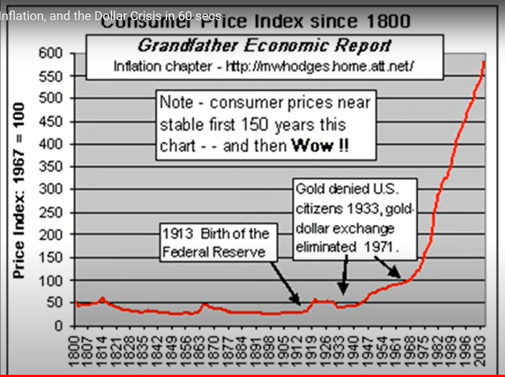
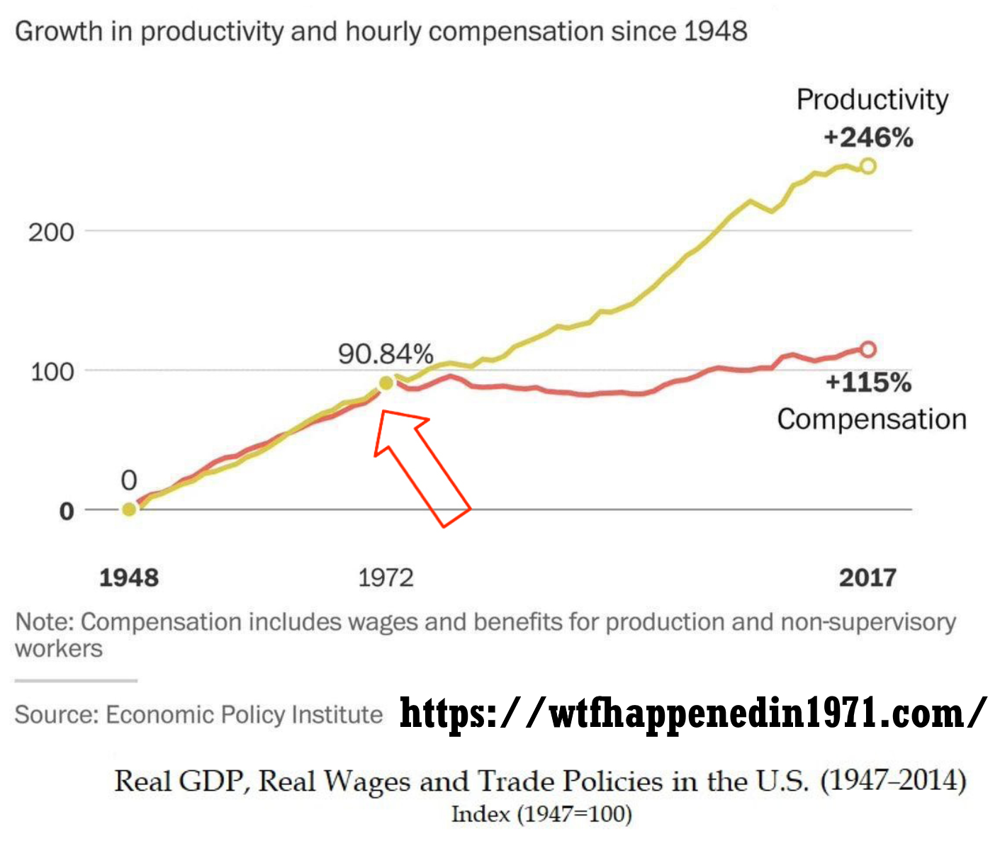

# Economics For Blacks and "Minorities":  An Introduction to 'Austrian Economics' and applications regarding race relations.

## Preface.

This book-project is a collaborative Open Source project put together by the Freemarketeers writing group, a group of people who feel like they have had the immense fortune of having stumbled upon the proper understanding of the functioning and evolution of the socio-economic order as provided by the legendary economists known as 'The Austrian School of Economics'. 

Like all titles published by the Freemarketeers this book includes and thus repeats vital economic and historical wisdom, which is then followed by "race" related content specific to this title.

Just like the Linux operating system can be continuously improved and propagated by many people, we likewise hope that the Open Source nature of this project motivates others to both improve it and speak on its behalf thus hopefully maximizing its reach. If you would like to learn more and contribute please visit https://freemarketeers.org/

## Economic ignorance is the root of all of our problems, especially our "racial" ones.

In August 10, 1915, British physicist Henry Mosely, who would have probably won the Nobel Prize that year, died in perhaps the most disastrous error mankind has thus far made, The First World War (1914–18). Bright and pious slightly smarter apes that had absorbed German-French-British-Russian “identities”… students, fathers, engineers, “great minds” and “experts”, who even shared a common European Christian faith, reverted to their tribal ape-like nature, and for God, honor, flag and country, slaughtered each other leading to about 18 million deaths and millions more left invalid (6.5 million just in France). At 7:30 am July 1st, 1916 the 'Battle of the Somme' began. On this single day, just the British alone, had about 20,000 fatalities and 35,000 wounded. On that day a British soldier was either killed or wounded on average every second. The "honor" of a military career would lead to disproportionately higher losses for the upper classes for all belligerents. Germany's top general, Erich Ludendorff would lose two sons, as would future British Prime Minister Andrew Bonar Law. British Prime Minister at the start of the war, Herbert Asquith, lost one. While about 12% of British troops would die in the war, 31% of Oxford's 1913 graduating class would die. This should help abolish the popular naive myth that politicians are quick to bring about wars while wanting to avoid personal loses in them. Nonsense unfortunately, human beings are slightly smarter apes that have been naturally selected to be vicious killers and to enjoy violence. Warfare-predation was an important evolutionary strategy and one of the reasons we are social and have evolved big brains to begin with. As Steven Pinker writes:

>"… men go to war to get or keep women –not necessarily as a conscious goal of the warriors(though often it is exactly that), but as the ultimate payoff that allowed a willingness to fight to evolve. Access to women is the limiting factor on male's reproductive success. Having two wives can double a man's children, having three wives can triple it, and so on. The most common spoils of tribal warfare are women. Raiders kill the men, abduct the nubile women, gang-rape them, and allocate them as wives." [( Steven Pinker's "How the Mind Works" 1999, p. 510)](https://books.google.com/books?id=5cXKQUh6bVQC&pg=PA510&lpg=PA510&dq=%22men+go+to+war+to+get+or+keep+women+%E2%80%93not+necessarily+as+a+conscious%22&source=bl&ots=4RwtAahW_K&sig=ACfU3U0IXRFzLuCSIqv5V30T72_P_PpzSQ&hl=en&sa=X&ved=2ahUKEwin-sGOwe7mAhVJoZ4KHbZ5BvAQ6AEwAHoECAkQAQ#v=onepage&q=%22men%20go%20to%20war%20to%20get%20or%20keep%20women%20%E2%80%93not%20necessarily%20as%20a%20conscious%22&f=false)

To be successful in war-hunt you need a strong sense of unity which translates itself into the strong tribalistic-nationalist-militaristic-patriotic tendencies we are so susceptible to and has the planet littered with nuclear weapons and "civilized" taxpayers believing we must have them. The bond men make as co-warriors may be stronger than male-female love. A female is easily replaceable (another raid, etc.) but the loss of that co-warrior that will help get the next female and-or defend you when you only get one chance at life is probably even more important. Just like natural selection has shaped us to enjoy sex due to the vital biological-evolutionary importance, it has also shaped us to enjoy war-violence and easily segregating ourselves into the in-group-us-"good" vs. out-group-them-"evil". Given its importance, war-patriotism easily fills us with a great sense of purpose. England's prime minister during World War Two and national hero Winston Churchill shows us how inspiring, exciting and purposeful World War One was to him when he mentioned:

>"I think a curse should rest on me - because I love this war. I know it's smashing and shattering the lives of thousands every moment - and yet - I can't help it - I enjoy every second of it." [(Churchill)](https://foreignpolicy.com/2009/02/25/churchills-advice/)

Chuchill wrote to his wife:

>“Everything tends towards catastrophe and collapse. I am interested, geared up and happy. Is it not horrible to be built like that?”

Churchill also told Prime Minister Asquith that his life’s ambition was:

>“to command great victorious armies in battle.” 

Churchill again:

>"My God! This is living History. Everything we are doing and saying is thrilling… Why I would not be out of this glorious delicious war for anything the world could give me…" [(Churchill, per Margot Asquith)](https://books.google.com/books?id=MzytDwAAQBAJ&pg=PT297&lpg=PT297&dq=%22My+God!+This+is+living+History.+Everything+we+are+doing+and+saying+is+thrilling%22&source=bl&ots=zYG1LaIeSU&sig=ACfU3U3RqPMPBYEmjxIkEd7kh_p8RBiKrw&hl=en&sa=X&ved=2ahUKEwiiycmAr-7mAhWVoJ4KHSSzAQIQ6AEwAXoECAoQAQ#v=onepage&q=%22My%20God!%20This%20is%20living%20History.%20Everything%20we%20are%20doing%20and%20saying%20is%20thrilling%22&f=false)

Towards the end of WWII, Russia's Red Army is estimated to have raped over 2 million German women. Equally human, the Allies-Americans weren't much better and generally saw the Japanese as an inferior race and cared little for their suffering or views, as US president who needlessly nuked Hiroshima and Nagasaki, Harry S. Truman, mentions in a letter:

>"The only language they seem to understand is the one we have been using to bombard them. When you have to deal with a beast you have to treat him as a beast." [(Truman letter to Samuel McCrea Cavert, General Secretary of The Churches of Christ in America)](http://www.nuclearfiles.org/menu/library/correspondence/truman-harry/corr_truman_1945-08-11.htm)

We shouldn't be shocked when men murder, rape and torture, or masturbate to tentacle porn, the real miracle that has taken thousands of years of cultural-legal evolution to create, are the modern cultural values-laws-ideologies-software we absorb that program homo sapiens into respecting the body-property-thoughts of all human beings regardless of age, sex, beliefs, and race. Being the social slightly smarter apes that we are, fellow humans are our biggest assets which helps explain the evolution of altruism-compassion, as well as our biggest competitors which helps us understand our horrendous violence towards fellow men. During the early days in the lead-up to World War I there was an atmosphere of joy and excitement as thousands of young men celebrated and volunteered for the coming war which would bring unity, purpose, and glory. After the war, when much of Europe lay in ruins, many were numb and in a state of stupor wondering how they could have fooled themselves into such needless carnage. Why did this happen? And if it was such a big deal at the time, worth sacrificing so much, how come hardly anybody knows anything about it today? 20 years later via World War Two the tribalistic slaughter led to over 80 million deaths and what followed was a "Cold War" that brought the slightly smarter apes close to nuclear annihilation several times. Why were our "great leaders" and "intellectuals" utterly powerless to prevent the World War One and Two slaughters and were in fact its promoters? How can mankind today build mindbogglingly complex microchips, airplanes, satellites, the Internet and so much more, yet still not have figured out something as simple as peace and always be one spark away from another world-wide tribalistic tyrannical and chaotic calamity as CovidMania, the Russia-Ukraine war, and recurring financial crisis are showing? 

There is something missing from our understanding of how the world works, something as monumental in importance as Darwin's theory of evolution, something that our "leading intellectuals" and "experts" have yet to discover and spread accordingly. Fortunately for mankind that "something" has already been discovered and explained by a group of little-known and widely misunderstood evolutionary intellectuals often-times referred to as ‘The Austrian School of Economics’. And as 1974 Nobel Laureate in Economics, F.A. Hayek(1899–1992) writes, their vital insights and “fundamental ideas belong fully and wholly to Carl Menger”[1840–1921].

Hayek provides a simple answer to the questions above. However, this answer can be a bit hard to swallow for the prideful slightly smarter apes, but swallow it we must if we are to survive the next World War One-like calamity which might very well result from the current Coronavirus-related economic shutdowns-policies, Israeli-Palestinian conflict, or Russia-Ukraine war, etc. The answer is the following: Human beings are slightly smarter vicious apes whose instincts are ideally suited to living in small tribes of less than 100 people but find themselves relatively lost in the modern socioeconomic order where things like money, profit-loss calculation, economic competition, and interest rates coordinate the actions of billions of human beings all over the world to create what the great British 19th century thinker Herbert Spencer referred to as ["The Social Organism"](https://oll.libertyfund.org/titles/spencer-the-man-versus-the-state-with-six-essays-on-government-society-and-freedom-lf-ed), which can also be seen as an incredibly complex movie-like-Matrix that did not exist 20,000 years ago. 

Tribal warfare, politial infighting, coercing each other, rape, and 'The law of the jungle', are things we have been doing for millions of years and are somewhat intuitive, commercial society, the tolerance and wisdom needed to refrain from coercing others, and understanding the aforementioned economic concepts which have been around for less than a few thousand years, are not. Hayek summarizes:

>"...man’s instincts...were not made for the kinds of surroundings, and for the numbers, in which he now lives. They were adapted to life in the small roving bands or troops in which the human race and its immediate ancestors evolved during the few million years while the biological constitution of homo sapiens was being formed."

Most of us associate 'natural selection' with people like Charles Darwin and the biological world of animals and living things, but natural selection also evolved the socioeconomic order and things like religions, laws, customs, language, and especially for our purposes, the many socioeconomic institutions that make up our modern economies. And, very importantly, it is also indispensable for understanding our geopolitical conflicts as well as their history. In other words, at a fundamental level natural selection creates both the biological as well as the socioeconomic orders and is indispensable for understanding how they have come into existence and behave. As Hayek writes:

>“We understand now that all enduring structures above the level of the simplest atoms, and up to the brain and society, are the results of, and can be explained only in terms of, processes of selective evolution…”

Most people fear the concepts of natural selection and evolution with good reason, we don’t really understand them, especially when it comes to the concept of race and socioeconomic achievement. Popular phrases associated with evolution like Herbert Spencer’s “survival of the fittest” can scare us and keep us away from learning these vital subjects. Racist and erroneous ideologies like the ones that flourished in Hitler’s Germany were also heavily influenced by faulty evolutionary thought and still play a significant role today.

Just like the human body-organism and the numerous "systems" that coordinate it like the respiratory-nervous-digestive "systems", are the result of the actions of some 70 trillion human and bacterial cells but obviously NOT the result of any conscious planning or designing by them, and thanks to the likes of Darwin and a modern understanding of genetics we can understand how 'natural selection' was the inadvertent "designer" of such systems and complex order, the modern global socioeconomic order-'Social Organism', is also coordinated by a "system", by what economists of the so-called 'Austrian School' like Ludwig von Mises and his great protégé F.A. Hayek, referred to as "The Market Process". 'The Market Process' and the "parts" it is composed of like money, prices, economic competition, interest rates, and the legal-religious-governmental frameworks that sustain it, "are indeed the result of human action, but not the execution of any human design" [(Adam Ferguson)](https://www.adamsmith.org/blog/adam-fergusons-great-insight) similar to how cells inadvertently-unconsciously act to create the systems that coordinate multicellular life. The 'market process' shares this trait with language which is also a complex mechanism that is the result of human action but was not consciously designed or invented by people-cells. It took about one billion years for natural selection to evolve the numerous complex biochemical 'systems' that allow single cells to cooperate leading to multicellular animals. Sometimes these mechanisms fail and the cells revert to their solitary ways and replicate wildly, in other words, they become cancerous-tribal or uncooperative and prematurely destroy the larger multicellular organism-order they were a part of. Similarly, it took about 50,000 years for natural selection to evolve 'the market process' which reordered tribal homo sapiens into cooperative members of the 'Social Organism'. Unfortunately, the economically ignorant tribal slightly smarter apes intuitively turn cancerous when they destroy 'the market process' via coercive central planning-Socialism because it inadvertently destroys-diminishes the freedom of individuals which is vital for the functioning of the 'Social Organism'. 

We are members of a matrix-'Social Organism' whose workings hardly anyone really understands (unless you have heard of Ludwig von Mises), and whose evolution is understood by an even smaller number of people (Menger and Hayek are needed here). Standing on Mises' shoulders, who provided him with a superb explanation of the workings of the economy and thus all aspects of 'the market process'(money-prices-'interest rates'-etc.) and much, much, much, much more, Hayek would go on to explain how in a few thousand years culture and 'the market process' had co-evolved to transform homo sapiens, from tribes of slightly smarter vicious apes, into today's massively complex global socioeconomic order-'Social Organism' thus arguably becoming the first person in the history of mankind to provide a complete evolutionary framework for understanding how the entire world works. Ignorance of how the socioeconomic order works and has evolved is what keeps plunging the slightly smarter apes, regardless of their "experts" and "great leaders", into tribalistic world wars and socioeconomic disasters like the recent Coronavirus-related chaos, Russia-Ukraine war, and financial crisis. Either Spencer-Menger-Mises-Hayek-friends' monumental contributions quickly reach the general public or mankind will soon prove to be an evolutionary dead-end. It is that simple. Someday, if mankind does not destroy itself, 'The Austrian School' economists-thinkers will be as well-known as Darwin is today. 

Notice how all man-made calamities, from religious slaughters, to world wars, to political chaos, are always, always! the result of large groups of homo sapiens coercing each other via government, forcing each other to go along with the prevailing myths of the times. We have simply not evolved to understand the economic forces that create civilization, the vital need for freedom and privatization, and the immense harm that too much government can do. Supposedly the Dodo bird quickly went extinct because it had not evolved to recognize humans as potential dangers, we similarly just line up for ‘central planning’ and government coordinated self-destruction over and over and over and over.

Imagine you had a time machine and went back in time about 300 years to Salem, Massachusetts during the famed Salem witch trials where 19 women were hanged for witchcraft, and told people that the world could function much better if there was no slavery, that women should have the same freedoms as men, that homosexuality should be tolerated and seen as natural, and that six million years ago we had a common ancestor with chimpanzees. People would see you as some devilish monstrosity spreading heretical-sinful ideas and quickly "conspire" to kill you. Even if you succeeded in persuading a few people, the rate at which your ideas could spread would likely be no match for the rate at which existing fallacies, myths and the "incentive and ideological structure" of slave owners, religious leaders and the "experts" of their day would lead to your death. Would this mean that the people of the time were bad-malicious-"evil"? Or members of some "vast conspiracy" of "bad guys" or "special interests"? Of course not. The people would be fellow homo sapiens acting based on the prevailing myths and incentive structures of the times. Even if you didn't get killed, as the superior ideas spread they may end up doing far more harm than good. Perhaps their spread may lead to ultimately unsuccessful slave revolts, or a civil war that ends up making society more susceptible to conquest by an external power like the French or Spanish at the time. Thus the spread of superior ideas or truths can end up doing far, far more harm than good. Knowing the risks, would you attempt to spread the ideas? Would it be "immoral" for you not to try? How would you attempt to spread them? Had you succeeded, needless suffering and the cultural-intellectual changes that led to more freedom for any individual to live his or her life according to their plans instead of those of another (master, husband, church, government) could have happened much faster. The American Civil War and who knows how many other calamities and suffering could have been avoided. Something along these lines applies to this book and the dilemmas its authors face.  Spreading Spencer-Menger-Mises-Hayek-friends' ideas is similar to the above example, however, instead of attempting to explain today's mainstream superior ideas to tribalistic myth-following slightly smarter apes in the past, we take and apply ideas that are currently ahead of our time and attempt to spread them among today's dangerous slightly smarter apes, who as we will soon show, are as lost in mythology and dangerous as they were 300 years ago. If by our modern standards pretty much everything about how people saw the world 300 years ago could be rightly understood as mythology, why should we not be open to the idea that we are likewise immersed in mythology? 

It should be easy to realize that all human beings are such slightly smarter apes who grow up absorbing a continuously evolving culture-language-"identity"-ideas-myths which then leads them to act in ways that lead to disorder via conflict-war, or order via peace and prosperity. As Mises tells us:

>"It is ideas that group men into fighting factions, that press the weapons into their hands, and that determine against whom and for whom the weapons shall be used. It is they alone, and not arms, that, in the last analysis, turn the scales."

When a lion takes over a pride and kills the cubs so that the females will once again be ready to mate, we don’t say that the lion is “evil”, we rightly understand the complex evolutionary factors leading to such actions. It is likewise important to look at our socioeconomic disasters using an evolutionary lens that is free of "blame" and full of sympathy and understanding. Hitler, Lenin, Stalin, Mao, Churchill, Roosevelt, Fauci, etc. were not "evil", which is itself a mythical linguistic construct inherited from more religious times, they were fellow homo sapiens adored by their respective masses who absorbed horrendous ideas or myths propagated by scholars arising from the complexity of the economy as in the case of Socialism (Hitler-Lenin-Mao-Roosevelt-etc.), and the biochemical order as in the case of CovidMania and resulting coercive lockdowns and damaging vaccinations and more (Fauci). As Hayek tells us:

>"It is necessary to realize that the sources of many of the most harmful agents in this world are often not evil men but high-minded idealists, and that in particular the foundations of totalitarian barbarism have been laid by honourable and well-meaning scholars who never recognized the offspring they produced." (Hayek F. A., 1973, p. 70)

>"Most people are still unwilling to face the most alarming lesson of modern history: that the greatest crimes of our time have been committed by governments that had the enthusiastic support of millions of people who were guided by moral impulses. It is simply not true that Hitler or Mussolini, Lenin or Stalin, appealed only to the worst instincts of their people: they also appealed to some of the feelings which also dominate contemporary democracies." (Hayek F. A., 1976, p. 134)

The great war historian and senior editor of antiwar.com, Scott Horton, shared an Instagram quote that read:

>"To get one to commit the greatest atrocities, you do not need to convince evil men to do evil. You need to convince good men to believe they are doing good. The best men I have ever met have done the worst things I have ever seen."  -- US Marine.

Mises again:

>"Neither as judges allotting praise and blame nor as avengers seeking out the guilty should we face the past. We seek truth, not guilt; we want to know how things came about to understand them, not to issue condemnations."

The centuries of slavery, religious slaughters, persecution of minorities, and all man-made calamities were obviously the result, not of mythical "evil" or "madness", but of the ideas and myths held by the slightly smarter apes at the time and the mistaken need to coerce each other, and as long as the masses remain lost in erroneous mythology, democracy obviously does little good. Hayek:

>"Perhaps the fact that we have seen millions voting themselves into complete dependence on a tyrant has made our generation understand that to choose one's government is not necessarily to secure freedom."

It is obvious that we should focus on the ideas instead of vilifying people and assuming sinister motives or madness as the source of our problems, yet the fact that this goes largely unnoticed as we constantly segregate ourselves along political-tribal lines is further evidence that we are such dangerous slightly smarter apes, and just as important, how little a role "reason" plays in creating and sustaining civilization. Focusing on the actions of individual men is irrelevant compared to the evolutionary processes that create the ideas, incentive structures and circumstances under which he acts. Without the above men's evolutionary insights, as Spencer tells us: 

>"It is as though a child, seeing for the first time a tree from which a gardener is here cutting off a branch and there pruning away smaller parts, should regard the gardener, the only visible agent, as the creator of the whole structure: knowing nothing about the agency of sun and rain, air and soil. Undeveloped intelligences cannot recognize the results of slow, silent, invisible causes."

The complete evolutionary worldview provided by 'The Austrians', arguably reaching its zenith or completion with F.A. Hayek, is still so ridiculously far ahead of our time and mainstream intellectuals that even today's leading thinkers, like renowned popular science writer Matt Ridley, by their own admission are 'still catching up with him'. Ridley humbly acknowledges this in a 2011 speech where he mentions:

>"As someone who came to Fredrick von Hayek comparatively late in life, I'm still catching up with him...Indeed, many of the insights I thought I had discovered in my own readings and writings on the frontier of evolutionary biology and economics it turns out Hayek had long before me...It's Hayek who first puts it all together." - [Matt Ridley](https://www.youtube.com/watch?v=pG-grkJPU8Q)

So how did Hayek 'put it all together'?. Easy. Hayek realized that all living things require precise information to sustain-coordinate-expand their order. If one understands how information arises and guides the transformations of matter that lead to the biological and social orders, then one understands how the entire living world works. It is that simple! Hayek's focus on information helps us understand not just all life and resulting society, but what Menger-Mises-Hayek referred to as 'complex phenomena' like the environment, climate, medicine, nutrition, economy, mind, history, etc.. Basically, if it is superior information one is looking for, whether it is how to order 8 billion human beings in a manner that maximizes prosperity, our health, how to take care of the environment, or discovering THE TRUTH!, Hayek's focus on economic ['Competition as a Discovery Procedure'](https://mises.org/library/competition-discovery-procedure-0) provides us the best mechanism for discovering such information which includes busting and steering us away from dangerous mythology. 

### The Vital Lessons in Two Paragraphs.

Let's try to summarize the wisdom of 'The Austrian School of Economics' in two paragraphs, albeit very abstract and dense ones whose concepts will be better explained throughout the book. 

The socioeconomic order inadvertently emerges from the tradition of private property. Our 'freedom to trade' our private property with anyone in the planet inadvertently turns mankind into a global supercomputer where people via the companies they create are motivated to innovate and learn from each other thus inadvertently cooperate to discover and spread superior information with which to serve customers and reorder all of mankind. It is our freedom as consumers to buy the best cars, and as producers to go into the auto manufacturing business, which motivates existing auto manufacturers(competitors) to innovate-compete-learn to produce the best cars. As millions of Italians, Britons, Germans and others from all over the world came to America, it was ultimately the competition which grows from ‘private property’ and thus individual liberty which stripped these people of their otherwise nationalistic, ethnocentric, tribalistic “identities” and evolved what came to be seen as the classic American character of wanting to be seen as a reputable and honest businessman or professional who treats everyone with respect and wears a business suit as opposed to older ethnocentric attires. Thus freedom and resulting *'competitive knowledge discovery'*, NOT coercive-centralized-competitionless-monopoly-government control by "experts" or "great leaders", as opposed to leading to chaos-injustice, is what 1) motivates the discovery and spread of superior information and resulting order-civilization,  2) shields us from being coerced into going along the plans of others, 3) civilizes us, and 4) discovers THE TRUTH! Government is a coercive and competition-immune growth whose regulations and bureaucracies  paralyze or slow 'competitive knowledge discovery' and inevitably consumes more than it produces and should thus be kept to a minimum, otherwise, as the history of Socialist-Communist governments always shows, the socioeconomic order shrinks and dissolves into chaos and war. Coercion, whether it is by the patriarchy, slave-master, Church, and ultimately government, is not only a burden to those being coerced, but also destroys this wonderful mechanism of 'competitive knowledge discovery' which is what has discovered and spread the superior information which replaced erroneous mythology and continuously reordered mankind into increasingly more technologically advanced, productive, and prosperous states. This helps us understand how as the coercive and thus competitionless-monopoly decision-making power of the Catholic Church was reduced, and individual freedom increased in Europe, so did emerging 'competitive knowledge discovery' thus taking Western civilization to prominence, but as the social order got mind-bogglingly complex in the late 1800s and Socialist-Central-Planning mythology arose, freedom and emerging 'competitive knowledge discovery' was destroyed leading to immense suffering in Communist countries like the former Soviet Union and pre-Capitalist China.

Knowing that 'private property' and emergent freedom is the simple tradition that leads to a chain-reaction of incentives which generates and spreads the information that creates the social order, we can see that over thousands of years those tribes-societies whose customs-religions-myths inadvertently became more peaceful and thus less violent, extended peace-friendship-tolerance-trade to those outside the tribe, etc., in other words, those who tended to respect 'private property' and thus individual freedom and emerging business-capitalist culture more and more, would become more productive-advanced-powerful, and as they were 'naturally selected' relative to other groups, they would inadvertently spread the very customs-myths that allowed them to reach such relative heights. Thus the true sort of 'designer' of "the market process" or "free-market economy" or capitalism was our old friend 'natural selection' or competition acting on groups-cultures, inadvertently selecting those customs-ideologies-myths-concepts as if they were "fitter" genetic mutations. The fact that the market economy-order was 'designed' by an evolutionary process, NOT our "reason", helps us understand how we have inadvertently created this amazing Matrix with its complex microchips-Internet-Airplanes yet still be economically-ignorant-intuitively-tribal slightly smarter apes, who fooled by the growing complexity of the social order, history, biochemistry, environment, etc. are constantly coercing each other via massive competition-less-monopoly-governments led by "great leaders"-theologians-experts-apes which destroy our very freedom and resulting 'competitive knowledge discovery' that creates our civilization and end up propagating what is essentially mythology and inevitable wars-tyrannies. 

Most people hope that some great intellectual comes along and provides mankind with a great understanding of the world that can get us on a path to peace and prosperity. Plenty of intellectuals are constantly looking for fame and glory by providing such an understanding.

For example, arguably one of today's "leading intellectuals" is Yuval Noah Harari the author of the wildly popular 'Sapiens:  A Brief History of Humankind' which has over 65,000 mostly glowing reviews and recommended by today's leading personalities like Obama, Bill Gates and Mark Zuckerberg. Over seven years after its initial publication in 2015, it is still at the top of numerous amazon.com categories. There is a section titled 'The Capitalist Hell' where he writes:

>"Capitalism has killed millions out of cold indifference coupled with greed."

Mr. Harari is deeply mistaken. He and his book are popular not because they are great but because they reinforce and appeal to the leading fallacies of our day. Surely Pope Urban II's views as he launched the Crusades were popular, and so was Karl Marx's Communist manifesto which is sadly the #2 best-seller in Amazon.com's 'Political Philosophy' category. The world is in chaos, because, as we will sooon show, its 'leading intellectuals' are essentially clueless.  

As we and like-minded friends hope to show, what is more likely to be the case is that the great intellectuals we hope explain the world and get mankind on a path to prosperity lie in the past and are commonly referred to as 'The Austrian School of Economics', but their ideas are just still ahead of our time. Obama, Gates, Zuckerberg,  Hariri and today's 'leading intellectuals', via their global coercive central plans, are once again, inadvertently, and often times with the best of intentions, destroying civilization. 

As Ludwig von Mises wrote over 100 years ago:

>"The intellectual leaders of the peoples have produced and propagated the fallacies which are on the point of destroying liberty and Western civilization. The intellectuals alone are responsible for the mass slaughters which are the characteristic mark of our century. They alone can reverse the trend and pave the way for a resurrection of freedom."

Mises also tells us:

>"The flowering of human society depends on two factors: the intellectual power of outstanding men to conceive sound social and economic theories..."

This part has already been done by the so-called 'Austrians'. Mises continues:

>"and the ability of these or other men to make these ideologies palatable to the majority."

It is this latter part which the authors of this book and like-minded friends all over the world believe we must focus on.

Since economic ignorance is the root of our socioeconomic problems, per Mises, we feel it is our "civic duty" to help fellow citizens overcome such ignorance. Mises also writes:

>"Liberalism is rationalistic. It maintains that it is possible to convince the immense majority that peaceful cooperation within the framework of society better serves their rightly understood interests than mutual battling and social disintegration. It has full confidence in man’s reason. It may be that this optimism is unfounded and that the liberals have erred. But then there is no hope left for mankind’s future."

Mises also:

>"The masses follow the lead of the people we call educated. Once convince these, and the game is won."

In other words, we have to believe that we can educate "the immense majority" even if it proves to be futile, otherwise "there is no hope left for mankind's future". Different people have different ideas regarding how to improve the world. Some think we need to be more religious, better Christians or Muslims. Some think people with different political ideologies should segregate themselves accordingly. Some feel like there will always be wars, corrupt or "bad" politicians, and chaos and this is just the way things will always be and we just have to hope for the best. We are Misesians in the sense that we belive that Mises was right not just in his insights regarding the economy, the evolution of society and more, but also in his strategy of economic education as the key for worldwide peace and prosperity. He writes:

>"If we want to avoid the destruction of Western civilization and the relapse into primitive wretchedness, we must change the mentality of our fellow citizens. We must make them realize what they owe to the much vilified "economic freedom," the system of free enterprise and capitalism."

Also:

>"Economics deals with society's fundamental problems; it concerns everyone and belongs to all. It is the main and proper study of every citizen."

And again:

>"It is a fateful error on the part of our most valuable contemporaries to believe that economics can be left to specialists...The issues of society's economic organization are every citizen's business. To master them to the best of one's ability is the duty of everyone."

If we are to quickly save mankind and reach the prosperity we are truly capable of, those of us who've had the miraculous fortune of stumbling upon Mises and fellow 'Austrian School'-thinkers must succeed at spreading their ideas before it is too late. We must find, join, and grow the people who are thoroughly convinced that such quick prosperity can be achieved and thus become beacons of hope and economic education. We must join Mises in the trenches and go over the parapet in his "intellectual battle" against the economic ignorance that threatens civilization.

Mises: 

>"Everyone carries a part of society on his shoulders; no one is relieved of his share of responsibility by others. And no one can find a safe way out for himself if society is sweeping towards destruction. Therefore, everyone, in his own interests, must thrust himself vigorously into the intellectual battle. None can stand aside with unconcern; the interests of everyone hang on the result. Whether he chooses or not, every man is drawn into the great historical struggle, the decisive battle into which our epoch has plunged us." (Mises, 1981)

This book's "Hayekian" focus on how information arises and coordinates the social order provides a framework to pack many vital economic concepts into a short book. We will explain concepts we feel everyone should understand like 1) the Mises-Hayek explanation for the impossibility of Socialism-Communism, information which could have prevented millions of people from falling for the horrendous Socialist-Communist disasters of the 20th century which still affect Cuba, North Korea, and all of us to various degrees. 2) The 'Austrian Theory of the Business Cycle' which explains how governments all over the world via misguided central bank policy create the booms and busts which plague economies leading to socioeconomic chaos and political unrest. 3) The foolishness of mainstream 'Keynesian Economics' and leading mainstream economists like 2008 Nobel Laureate in Economics Paul Krugman. 4) Founder of the 'Austrian School' Carl Menger's explanation of the evolution of money which is a VITAL concept needed to make sense of how the socioeconomic order works, has evolved, and just as importantly, why mankind remains lost in economic ignorance and resulting socioeconomic chaos. 5) How mankind's ignorance of how the socioeconomic order evolved led to Socialist-Communist mythology resulting in world-wide Communist revolutions and the vital role that Ludwig von Mises played in nearly single-handedly saving civilization. 6) Many other related insights from 'The Austrian School' economists. 

After summarizing the socioeconomic wisdom of 'The Austrians' we will apply it to our racial problems which are ultimately outgrowths of economic ignorance similar to how Communist mythology wrecked the lives of millions of bright and well-intentioned people.

### Intro to discussion on racial problems.

If you are going to have a civil war-unrest you need some simplistic ideas which can segregate-polarize the economically ignorant public. To one economically ignorant group of fellow homo sapiens (the political "Left"-"Democrats"-"Liberals"), the political "Right"-"Republicans"-"Conservatives" is just the "racist white man who uses capitalism to exploit and maintain the status quo for his benefit and Donald Trump and all the other white 'conservative' leaders are the perfect embodiment of this fact". That's pretty much it. It is so-called "identity politics", where the "racist white man" and his antiquated values(religion) oppresses or discriminates against various groups-"identities"(women-minorities-gays) and overturning such supposed political-economic oppression is what is needed to fix the world's problems by sharing more wealth and funding social programs (competition-less government monopolies) that treat everyone fairly-equitably. The fact that many whites understandably make the erroneous assumption that their blood-race-religion was a very significant factor in the recent emergence of civilization only helps add fuel to the Left-Right polarization-hatreds. Many whites-liberals, with the best of intentions, might be ashamed of the imperialist past of their ancestors or of the racism of their parents-uncles-friends-etc. or their own "shameful" preference for perhaps blue-eyed blondes and erroneously believe that such a past-racism-preference is a significant factor in the relative underachievement-problems of other groups-minorities. A well intentioned economically ignorant person can easily find some "racist CEO" who discriminates based on race and "voilà! this racism is the root of the problems!". This sort of collective sense of guilt is what allows Black Lives Matter rioters to destroy cities virtually unopposed. Economic ignorance inevitably leads both blacks and whites to increasingly see whatever racism might exist as an increasingly significant problem to fix, via massive government-monopoly-coercion of course as can be seen by today's Democratic party's prominent focus on 'racial justice'. Both groups are wrong. It should be easy to see that the explosion in relative human prosperity and technology mankind has stumbled upon during the last 200 years has little to do with biological differences and much more to do with the expansion of the global 'division of labor and information'-free-trade-competition-Capitalism, etc. If a human being can grow up and learn something as complex as a language, which can take even the brightest of people years to master, everyone has more than enough intelligence to understand the basics of how freedom-privatization-free-(trade-movement) are the keys to rapid socioeconomic progress. Clever economic education-marketing is obviously the key.

 

## Economics

### Production and Consumption.

Whenever a person works he uses the information in his mind to reorder matter, the trillions of atoms he is made of, to produce his labor and whatever wealth it creates thus increasing the economic pie. If you are a freelancer you produce a product-service-wealth and trade it directly with society (customers) for money, and then trade the money back with society for the wealth you consume. If you work for a company, you produce your labor and trade it for money with your “employer” who combines it with the labor of others to produce a product-service-wealth which is then traded with society for the money from which your paycheck comes. Whether you are a freelancer, employee, or company, what is commonly referred to as sales revenue (your paycheck), is an estimate of the total amount of wealth produced. Costs, like employee wages which will be used by them to consume wealth(food,energy,etc.), are an estimate of how much wealth is consumed from the economic pie. And profits, which are the difference between sales revenue (production) and costs (consumption) are an *estimate* of by how much additional wealth the economic pie has grown. Again, a profitable order is an order (cell-person-company) that produces more than it consumes and is therefore self-sustaining-alive. The global economy or ‘Social Organism’ is really a vast collection of orders-people-companies that are constantly trading with each other, nourishing each other, each trade taking each participant-order from an inferior to a superior state of well-being from its own perspective, otherwise the trade would not occur. When Carl trades a dollar for a hamburger he values the hamburger more than the dollar and the restaurant values the dollar more than the hamburger so the action of trading takes place, which like all action which is not coerced, takes each participant from an inferior to superior state of wellbeing. 

If a teenager uses a tree-trimmer to produce one mowed lawn valued at $50 in 10 hours, his 'rate of production' is $50 / 10 hours = $5/hour. If next month he uses a riding lawn mower and mows the same lawn in 1 hour, he has increased his 'rate of production' 10-fold to $50/hour. Profit-loss calculation motivates and enables all orders-people-companies to guide their actions in the most profitable and thus pie-increasing way, and, very importantly, it also prevents orders from consuming more than what they produce. Unless, of course, they are the benefactors of charity. The wealthier a person-company-order is, the more this order has produced and exchanged for all this money-wealth. Jeff Bezos is one of the world’s richest men because the social order he helped shape and successfully managed, Amazon.com , has been one of the most productive in the world. We know this is the case because millions of human beings traded their money-wealth for its products-services.

Since production is just a transformation-relocation of existing matter-wealth ("fashioning of imperishable matter into more advantageous shapes"), the production of wealth requires the consumption-use of existing wealth. For example, if 10,000 men are to spend 2 years producing an airplane factory, they must consume-use the concrete-materials-food-energy-transportation-shelter-wealth that they (as well as their dependents-family) need while they produce the factory. In other words, there can be no production if there does not already exist enough saved wealth that can be consumed while production takes place.
### Money.

More money does not equal more wealth. Imagine if everyone in the world suddenly had an extra billion dollars. Would this make society wealthier? No. The amount of REAL wealth(goods-services) has not increased by a single toothpick. It would actually lead to less wealth since many people wound stop working-producing seeing their new-found fortune. Would the 10,000 men above be able to produce the factory if instead of having real wealth to use-consume had to consume pieces of paper with dead presidents on them? Of course not.

More money leads to and enables higher prices. For example, if there are 1,000 people in an island (BlueIsle) and each has $100 for a total of $100,000 in the island, can anything sell for $200,000? Of course not, even if they all combined their money such a transaction could not happen because there isn't enough money, but what if each person had $500 so that there is now a total of $500,000? Then yes obviously, prices could go up to $500,000. So for general prices to go up there HAS to be more money. And who creates the money and is ultimately responsible for a general increase in prices? Generally speaking, today all money is created by governments via their central banks (Federal Reserve in USA) and they are thus responsible for the price increases. Let’s say you print yourself 1,000 trillion dollars and start offering people in the USA’s West coast ridiculous amounts of money for their goods-property-wealth. You buy all the wealth in California, Washington, Oregon, etc. As this is happening Americans are growing richer in terms of money but poorer in terms of what really matters, homes-property-wealth. At some point you make it to Florida, by this time it will be packed with about 300 million Americans and perhaps the 1,000 trillion dollars or more you kept offering people. The price of wealth tends to be the amount of money that is offered in exchange for it given all the other things the money could be traded for. With so much money and so little wealth left, the price of everything would be astronomical and people would be much poorer given that you are the one that possesses most of the wealth in the country. Assuming the total amount of money remains stable, if the economy-wealth is expanding, which can only happen if the rate at which goods-services-wealth is produced is faster than the rate at which it is consumed, we expect general prices to go DOWN because the money will sort of get divided among more goods-wealth so less money per item-wealth means a lower price. This last point is of vital importance, under normal-ideal circumstances, as the economy grows we should expect prices to go down and people's savings to buy them more in the future. If the amount of wealth remains stable or grows slower than the amount-supply of money, then we have more money per item, thus higher prices.

Let's go over a final and very important example. Keep your eye on how much wealth is being produced and consumed, and the relationship between the quantity of money, wealth, and thus prices. Let's say Alan prints himself another $100,000 which is enough to hire half the people in BlueIsle for 3 months while they build him a small castle. Alan thinks this is a great idea, he is paying some people more than what they were making before, there were also a few unemployed or unmotivated-to-work people before but he is offering enough money to get everyone working thus achieving "full-employment". Prior to trading their labor for Alan's paper-money, people were producing stuff that they either wanted-needed to consume themselves or could be sold-traded to others who obviously wanted-needed to consume them, they were producing "socially desired" or "order-life creating-sustaining" stuff like oranges-apples-hair-cuts-blankets-baskets-etc. The day half the population begins working on Alan's castle, the island's economic pie begins to lose half its "socially desired" stuff-wealth since half the population is no longer creating it, and begins increasing the amount of rocks, ladders, and other things for Alan's castle. These things, are NOT "socially desired" or "order creating-sustaining" wealth as judged-calculated by the inhabitants. Since the existing $100,000 will be distributed over half as many socially-desired-goods, this would eventually motivate their prices to about double. However, since Alan is further doubling the money supply as he pays people using his newly printed $100,000, on the last days of castle-building, when half the population is still working on his castle and they have also spent most of the new $100,000, prices would have nearly doubled once again making them about 4 times higher than they were before Alan came up with his idea. It should be easy to see that Alan has reordered society in an inferior way. Everyone is "working" and making more money than before, but the unavoidable reality that they are ordered in a less productive way reflects itself in the much higher prices and smaller amount of wealth on average that each can consume. Ideally people now "lose their jobs", and instead of working on the easily identifiable yet disastrous plan laid out by Alan, for a few days there appears to be "chaos" as people discover superior plans and likely transition to their old trades-jobs thus once again reordering society on a far, far more productive way. However, they are **economically ignorant**, so they tell Alan "Can you hire us again to make the castle bigger? You pay us more than what we used to make before. You are about to create massive unemployment". Alan thinks to himself "Gosh! It is a good thing that by creating money I am preventing massive unemployment and chaos. Obviously I must keep providing 'liquidity'!" So the relative suffering continues even as the local newspaper gives Alan the "Citizen of the Year" award. Carl told Alan that what he was doing was disastrous and told people that Alan should just stop creating money and let everyone lose their jobs. The mob labeled him a heartless capitalist and killed him unfortunately. Had Alan been a bad king, who instead of creating money to acquire the necessary wealth to create his castle, simply taxed people at a 50% rate, the people's living standard would have suffered similarly, but they would have easily understood the fact that their wealth was taken from them for the creation of things they didn't want or benefit from for a hopefully more obvious massive loss. 

The creation of money by governments is just a hidden tax that transfers wealth from savers and society at large to the people who get the newly created money. For example, Let's say you have saved $1,000 which can buy you 1,000 items at $1-each. The government via the central bank (Federal Reserve in US) and a convoluted process eventually creates billions of dollars which are given to the newly-created Space Force military personnel so they can trade them for the wealth they need to consume-live and because of this money-creation prices go up 5% so each item is now $1.05 and your saved(or future earned) $1,000 can only buy you about 952 instead of 1,000 items. The 48 items-wealth that you (and other taxpayers) can no longer obtain, is the wealth that the Space Force personnel got to consume. Again, money is not the same thing as wealth, when governments create money they are simply creating an additional tax or transfer of wealth from savers and the public at large to those who get the money. 

    
	

The following graph helps us understand how when the US was still on a gold standard, since gold can't be increased by adding 0s at the end of bars, this prevented the government from acquiring additional wealth-taxes by just creating the money thus prices had a slight downward trend until 1971 when the USA completely abandoned the gold standard. Up to 1971 the US would give foreign governments an ounce of gold per $35 dollars, but to acquire enough wealth from the public in order to give it to people involved in the Vietnam War, as well as grow a rapidly increasing welfare system, the US was creating more dollars than what it could honestly exchange to gold. French president Charles de Gaulle, who wanted the war to end, knew this money-debt-creation was allowing the US to dishonestly acquire the needed wealth to finance the war so he demanded many dollars to be exchanged into gold. The US had enough for France, but was running very low on gold and knew it could not meet further obligations so it just completely stopped dollar-to-gold convertibility and thus end the gold standard. Had the US government tried to obtain this wealth, not via money-creation-inflation, but by raising taxes directly, chances are Americans would not have gone along. Thus from 1971 onward the US government thanks to Fed(Central Bank) money-creation has been able to additionally tax workers-savers causing prices to rapidly increase instead of going down. If you look very carefully at the graph, you will notice two rapid increases in prices, one occurring during the American Civil War (1861-65) and another during the First World War(1914-1918). During wars, tribalistic politicians-ideologues always resort to the price-increasing  money-creation to acquire the wealth needed to feed-clothe-nourish the war effort, because if they had to get the wealth via direct taxation, the public would more easily factor the true costs of the tribalistic warmongering and likely bring an end to such slaughters. 

The graph above helps us see how thanks to technology-progress even though worker productivity has increased by 246% since 1948, compensation has only increased by 115%. Again, once the economically ignorant technocrats-politicians abandoned the gold standard in 1971 and could easily acquire additional wealth by just creating money (more debt) much of the additional production was taken away from workers via inflation-money-creation. The concept of "No taxation without representation!" is bypassed when ideologues can take all the wealth they want from the public by just creating money. This is NOT the result of some 'malicious plot' by bureaucrats, for the most part most are clueless and are only focused on spending (acquiring wealth now) to help the cause-war-welfare-etc. 

This next graph shows how from early march to mid may 2020, the Federal reserve has created about 3 trillion dollars which will be given to people and businesses so that they can exchange this money for wealth they can consume, much of this will be unemployment benefits which will motivate many to not even look for work and thus continue to be pure consumers thus overall the 3+ trillion is leading to a rapid shrinking of the economy and accelerating rise in prices. Again, this is just a transfer of wealth from workers-seniors, and ultimately anyone who trades dollars for wealth, to others as the economy continues to shrink and prices rise compared to what they would have otherwise been without the money-creation. 

This money-creation by the Federal Reserve *inadvertently* transfers wealth from, not just Americans, but anyone in the world who trades wealth for dollars. The US government and its countless ideologues somewhat *inadvertently* end up creating money which then gets traded with the rest of the world for wealth, leaving the rest of the world with more dollars and less wealth and thus higher prices. It has taken decades for relatively clueless politicians to understand this, but this is something that now many world leaders are very aware of which is understandably causing them to abandon using the US dollar. Putin explains:

>"over the past two years, the money supply in the United States has grown by more than 38 percent. Previously, a similar rise took decades, but now it grew by 38 percent or 5.9 trillion dollars in two years...So, they printed more money, and then what? Where did all that money go? It was obviously used to pay for goods and services outside Western countries – this is where the newly-printed money flowed... Naturally, no one thought about the interests of other states, including the poorest ones. They were left with scraps, as they say, and even that at exorbitant prices."

When Putin mentions "no one thought about the interests of other states", is this due to malice or a 'conspiracy' by US politicians and Federal Reserve economists to rob the world? No. The vast majority of US politicians and even Federal Reserve economists have been unaware of this ongoing monumental transfer of wealth from the whole planet to the USA, it too is something that has more to do with the complex evolution of the global financial system instead of a 'conspiracy' and is "indeed the result of human action, but not the execution of any human design"

### Trade, Money and the Division of Labor and Information.

Trade and money led to the "division of labor and information" which allowed the social order to efficiently compartmentalize information in only the brains that needed it and also accumulate a virtually limitless amount of information with which to continuously restructure itself in increasingly more productive-advanced ways. For example, Mark's brain contains knowledge of how to get coconuts and process them to create pastries. Tom's brain contains knowledge of how to find the best vines and weave them together to make baskets. Jim's of where to find rocks which when split can create sharp knives and how to sharpen them. When Mark trades his pastries for Tom's baskets and Jim's knives he is a benefactor of all the knowledge needed to creating those items yet he only had to know how to make his pastries. Unlike the tribal social order where knowledge is inefficiently repeated across every brain, trade allows for information to be efficiently stored fewer times freeing up more brains to contain more information. We can envision 1,000 men producing and trading 1,000 different types of items requiring 1,000 times more information which without trade and the 'division of information' that it enables would have been impossible to achieve in a tribal society. Also, when Mark trades his pastries for the baskets and knives he can now make less trips to gather coconuts by using the baskets and process them faster by using the knives and thus increase his 'rate of production' from 2 to 10 pastries per day. The pastry-making process has become more productive and also more complex because it was enabled by basket and knife making knowledge. We now have a never-ending cycle of increased 'rate of production' and complexity -> population growth (more brains) -> increased 'rate of production' and complexity -> more brains -> … leading to where we are today with nearly 8 billion people and the inability to fully trace the knowledge that enabled the creation of anything. In Hayek's words: 

>"the greater density of population, leading to the discovery of opportunities for specialisation, or division of
labour, led to yet further increases of population and per capita income that
made possible another increase in the population. [And so on."](https://books.google.com/books?id=YQLYAQAAQBAJ&pg=PA40&lpg=PA40&dq=%22the+greater+density+of+population,+leading+to+the+discovery+of+opportunities%22&source=bl&ots=OdrrCyyGT3&sig=ACfU3U2RrY6L_hQm8BCBOad08o-du-kPtQ&hl=en&sa=X&ved=2ahUKEwj3wOfc4q_pAhUxFjQIHe5VBigQ6AEwAHoECAcQAQ#v=onepage&q=%22the%20greater%20density%20of%20population%2C%20leading%20to%20the%20discovery%20of%20opportunities%22&f=false) (Hayek, 1988, p. 40)

For example, a web-designer can trade his services which are dependent on web-design information that resides in his brain for money, and then trade the money for any of the billions of products-services that exist in the world and are likewise dependent on information spread throughout the world. The websites he creates are also enabled by all the information that enabled the "factors of production" he used to create them, like his computer, monitor, keyboard, software, electricity, the Internet, etc., which themselves are enabled by all the information that enabled their "factors of production" like the computer's memory, processor, and so on. Everything that is produced today is the result of an interdependence of information that spans millions of minds, not just in the present, but in the past as well, because wealth that is currently being produced-consumed is dependent on tools-'factors of production'-information provided further in the past. When he upgrades to a better computer, the information that enabled these improvements also contributes to-enables the improvement of his website production process. Without money how would a heart surgeon trade his costly services for toothpicks? Without trade and money, this "division of labor and information" as well as the inter-temporal cooperation-interlocking-stacking of information just described, and the ability to do profit-loss calculation to ensure that each order guides its actions in a manner that it produces more than it consumes, would not exist and neither would our social order which depends on it.

### Creation and Spread of Information via Economic Competition and its emergence from the tradition of Private Property.

In the 'Social Organism'-economy superior information arises and spreads thanks to economic competition which emerges from the tradition of private property. Private property means that matter is under the exclusive control or ownership of a single person-mind-CPU. Each person is motivated to discover the best information with which to transform or reorder their private property in a way that increases its value or utility. Most of us transform the trillions of atoms that make up our bodies in a manner that maximizes the value-utility of the labor we produce and then trade with other people or companies. Some transform bread and beef to increase their value as hamburgers which are then traded with others, etc. From our freedom to use-transform our private property emerges the 'freedom to trade' it with anyone in the entire planet which inadvertently transforms mankind into a global supercomputer where people via the companies they create are motivated to innovate and learn from each other(competitors) thus inadvertently cooperate to discover and spread superior information and subsequent order. For example, a Honda engineer in Tokyo, Japan, may have invented power door locks which thanks to 'economic competition' motivated BMW in Germany, Ford in the USA, and other 'competitors' throughout the world to copy and thus spread superior information throughout the world. Why do they do this? Because people in their role as consumers have the 'freedom to trade' their life-order-sustaining wealth with the better informed auto-manufacturers(competitors), and as producers, to go into the auto manufacturing business. This in turn motivates all competitors to learn-copy each other lest they not get enough revenue-wealth with which to pay their employees a competitive wage so they use their 'freedom to trade' their labor to join the better-informed and thus more productive-efficient orders-companies. Notice how the biggest companies or 'private sector orders' in the world like Amazon, Apple, Walmart, Google and Microsoft, which hire and efficiently coordinate the actions of millions of fellow homo sapiens across the world regardless of age, sex, religion or race, do not force anyone to buy their products or coerce anyone in any way and have no army or tribalistic and patriotic flag salutations. They spend all of their time peacefully innovating and copying each other’s innovations thus inadvertently spreading superior information and subsequent social order. This wonderful automatic mechanism of *COMPETITIVE KNOWLEDGE DISCOVERY* is "turned on" or "emerges" from the simple concept, or better said, tradition of 'private property'. Private property gives everyone in our role as consumers the 'freedom to trade' our life-order-sustaining wealth for what we calculate-think is best. This 'freedom to trade-choose' in turn motivates everyone, in our role as producers, to *discover the best information with which to order* ourselves and the matter we control in a manner that produces something society-customers value (our labor, a product-service), which we do by, once again, innovating and-or copying-learning existing ideas-information, in other words, by competing in the economic sense. Most of us simply choose to produce and then trade our labor with a company-order that knows how to further incorporate our labor in a more competitive-profitable way. Via advertising, competitors are motivated to spread the potential usefulness and superiority of their products-ideas as well as the defects-inferiority of their competitors thus accelerating the need to compete-copy-spread superior information.  

A mind-CPU anywhere in the planet that comes up with an improvement will benefit everyone in the world if they are 'free to trade' for his product-service which will also motivate all competitors in the world to likewise improve their actions-order. So we can see how just like in the Olympics we can discover the best athletes in the world due to global competition, so does having the 'freedom to trade' with everyone in the world allows the best ideas to compete and spread globally thus ensuring the best possible global order. As cost-cutting ideas emerge and inevitably spread via competition leading prices to continuously fall, new profitable ideas easily arise and once again spread via competition in an endless cycle of knowledge generation-innovation. For example, computers were once very expensive, but once the price of making them came down enough, people easily realized that every home could have them, which gave birth to our computerized world and the Internet and all the great things that flow from it. The more wealth is produced, the more wealth has to be offered in exchange for labor as companies-orders compete against each other for the labor they need which helps explain why the economic pie grows for everyone. For example, imagine that after a shipwreck you end up in an island where everyone has a machine that can turn dirt into food. Tom wants your labor to build a home, Mark, to build a boat, and Gina to plant a garden. Competition will motivate them to offer you all the food you want and more.
 

### Prices and the Impossibility of 'Central Planning'-Socialism-Communism.

How much wealth had to be consumed in order to produce a gallon of gasoline that sells in Seattle for $3.50? Or a pound of beef that sells in a store in London for $5.35? We can't know for sure, however, we can be fairly certain that it was less than the advertised price which on average must include the costs. The price of any item in the world lets us know that there is an order at that particular place and time that is coordinated by information that can produce the item while consuming less than the advertised price. THAT IS AMAZING! This allow goods to be purchased and combined in a manner that ensures that the combination (like a car) can easily have a price set that properly accounts for the costs-consumption of the whole (car) by just adding the prices of the parts used to produce it (wheels, glass, robotics, labor, etc.), parts which themselves had a price set that included their costs-consumption and so on, each part-input managed-ordered by entrepreneurs-brains-CPUs with highly specialized time-and-place specific information who are always using profit-loss calculation to ensure they are increasing the economic pie. The concept-tradition of 'private property' plays a vital role here as well, it is not until matter-things are privately owned, that they are controlled-coordinated by brains-CPUs that are incentivized to discover the best information with which to reorder-coordinate them in the most productive-profitable way possible.

How do we know whether it is a good idea to build an airport or a school at a particular time and place and also get the necessary wealth without coercion or making criminals out of people who may not want to contribute to them? Only entrepreneours at those times and places can 'discover' if there are enough people whose lives would be improved by trading their wealth for such wealth (airport or school), and how to build them in a profitable and competitive way. The information needed to create-coordinate the social order, like whether to produce cars, or buildings, or pizzas, where to do so, what prices to set, and most importantly, how to produce them in a manner that more wealth is produced than consumed, is information that can only be created by free people dispersed throughout the world thus rendering central planning ideologies like Socialism-Communism IMPOSSIBLE regardless of the good intentions of their members or their intelligence. To see why this is the case consider the following example, a Cuban restaurant in Miami Beach sells a picadillo dish (ground beef, plantains, rice) for $8. Perhaps $1 might be profit, and $7 will be spent in costs, in other words, in the necessary consumption of wealth needed to produce the meal-wealth, things like equipment-electricity-food, and everything employees and their families will consume at home (food, energy) thanks to their paychecks that came from the $7-meal. The businessman discovered 1) that there are enough customers nearby willing to patronize the restaurant at the $8-meal price which necessitates taking into account customer's already existing local competitive options thus providing an improvement in society, and 2) how to reorder $7 worth of stuff(labor-supplies-etc.) to produce the meal. If he sets prices too high, customers will choose other superior existing competing options and thus fail to improve the social order. If he sets prices too low, he won't cover costs and cause more consumption than production thus shrinking the economic pie. These are two vital pieces of information that are impossible for a central planning body to discover and helps explain why every time Communism has been attempted the result has been a much faster rate of consumption than production and eventual famine-starvation-chaos-death. Again, only free entrepreneurs dispersed througout society, not government "experts" in a central location, are at the right time and place needed to discover people's desires and how to order a business or section of society while setting prices that create a profitable order. The social order exists thanks to the fact that private property maximizes economic calculation by allowing-encouraging every person-mind-CPU to sense-analyze its proximate corner of the world and reorder it to be as profitable-'pie increasing' as possible. Central planning-Socialism-Communism simply reduces the number of brains-CPUs that can do profitable calculation by turning them into order-takers by the smaller number of 'central planning "experts"' who are also too far away to gather the necessarily time-and-place information needed to profitably plan-reorder thus always rendering their planning inferior, leading to more consumption than production or what Mises referred to as ['Planned Chaos'.](https://www.youtube.com/watch?v=7EnHeZXLzTc)

Try to envision how matter is coordinated by information constantly increasing its value. The restaurant owner discovers laborers-equipment-‘food distributors’ with the right prices to hopefully create a profitable order-restaurant. He places orders for the food/ingredients which can be seen as increasing in value as they are delivered to the restaurant, at a cost of course, that which must be consumed(fuel-food-etc.) by the driver-etc. The waiters begin producing the ‘meal experience’ by seating customers and taking the orders, the cooks increase the value of the ingredients by combining-cooking-transforming them and thus producing the meals, the waiters further increase the value of the meals by further transforming/transporting them from the kitchen to the table. The customers consume the meals, their internal order-cells will further consume them as they produce their heartbeats and all that is required to keep the cells-people-orders alive-etc. Customers, who had previously produced stuff and exchanged it for money, traded money which will then go to the owner, cooks, waiters, suppliers, etc. and then traded with countless orders/businesses so that they too can consume-live. Each actor-order producing and consuming at different rates using prices and ‘economic calculation’ to ensure more production than consumption at the whole restaurant level, and at each individual level as the waiters and cooks manage their personal spending-lives. The food-supplying company uses the prices in its own relevant corner of the world to likewise organize itself profitably. Each actor-order is motivated to sell or trade the wealth it produces for as high a price as it can but the freedom of customers to choose competitors limits how high a profitable price can be. Thus prices, and the vital information they convey, are what allow ‘economic calculation’, they allow cars-picadillo-stuff to be built from parts-beef-inputs, which themselves are built from other inputs, each input managed-ordered by entrepreneurs-brains with highly specialized time-and-place-specific-knowledge-skills, leading to never-ending conveyor belts of interlocking cycles of production-consumption, each moving-reordering matter in increasingly valuable ways. Since prices contain highly time-place specific information it is absurd to arbitrarily copy the price from one place and apply it to another. A similar Cuban restaurant-meal might be profitable in Austin, Texas selling the picadillo for $6.50 because costs-consumption like real estate, transportation, and labor might be lower there compared to Miami Beach. In Oslo, Norway, the costs might be $20/meal due to the additional consumption of wealth that has to take place as the ingredients are shipped so far and numerous other factors, which again, are highly time and place specific and only discoverable by local actors.

Nikita Khrushchev, who followed Stalin as head of the centrally planned (Socialist-Communist) Soviet Union, is credited with saying “When all the world is socialist, Switzerland will have to remain capitalist, so that it can tell us the price of everything”. Unfortunately for Khrushchev and the billions who suffered economic chaos and an inevitable decline in production under Socialist-Communist regimes all over the world, prices in Switzerland (or anywhere else) embody information about the costs/consumption of those particular places at specific times and are no good elsewhere.

With the Internet, pricing information all over the world can help customers find-nourish cheaper-better products-orders-companies and also help producers likewise thus greatly accelerating competitive knowledge-order-spreading but it will NEVER lead to the success of central economy-wide planning because no computers-system can get in the brains of entrepreneurs to predict what products-businesses they will create and thus alter society, and similarly, no computers can get in the minds of consumers and predict how they will choose to spend their money/wealth thus once again altering the social order’s numerous cycles of production and consumption. As Mises so eloquently explains:

>“The consumers, by their buying or abstention from buying, ultimately determine what should be produced and in what quantity and quality. They render profitable the affairs of those businessmen who best comply with their wishes and unprofitable the affairs of those who do not produce what they are asking for most urgently. Profits convey control of the factors of production into the hands of those who are employing them for the best possible satisfaction of the most urgent needs of the consumers, and losses withdraw them from the control of the inefficient businessmen. In a market economy not sabotaged by the government the owners of property are mandataries of the consumers as it were. On the market a daily repeated plebiscite determines who should own what and how much. It is the consumers who make [some people rich and other people penniless.” (Mises)](https://fee.org/articles/inequality-of-wealth-and-incomes/)

Who can anticipate the firing of trillions of neurons in billions of brains to predict-plan the resulting desires-ideas?

 

Since prices that properly estimate costs/consumption can only be set by free entrepreneurs, when the government (central planners) attempts to set them via "price controls" it warps the socioeconomic order in inferior ways. For example, if the free-market price of a gallon of milk is $2.30 in a particular store in Miami which profits 0.30 per gallon (costs = $2.00) and the government mandates the price to be $1.99, then the business is consuming more wealth ($2.00) than what it gets ($1.99) and will eventually go bankrupt causing less milk to be produced leading to shortages. Even if the government sets the price to, say $2.15, so that the business can still profit, it will still lead to eventual shortages for the following reasons. Under normal circumstances the rate of profit tends to be equal-uniform across all sectors-businesses, if higher-than-average profits are being made in say auto-manufacturing, factors of production like labor, materials, real-estate are withdrawn from other less profitable sectors which reduces production-competition in them causing profits to go up in those sectors, while simultaneously increasing production-competition in the auto-manufacturing sector causing the initial higher-than-average rate of profit to go down towards average levels. So by making profits in milk production lower than the average it still has the effect of decreasing, albeit less drastically, milk production which is the opposite of what the economically ignorant masses and politicians want.

It is important to envision the socioeconomic order as it really exists as if looked at from high above. Envision people coming together-apart as companies-orders emerge and dissolve in ever-changing conditions. Superior information arising and rippling-restructuring the social order thanks to competition. As orders get more productive they lure other people to 'trade-with' or 'join-them' by offering more money-wealth for their labor relative to other companies-orders, eventually causing the least productive orders to sort of dissolve as their 'factors of production' like labor, buildings, etc. are bid away to be parts of more productive plans-orders. A sort of swarm intelligence emerges as the all-pervasive public quickly nourishes the growth and spread or superior orders-companies-information, inadvertently expanding the worldwide "division of labor and information" as entire neighborhoods-cities morph themselves in specialized ways as complementary pieces of information-orders segregate themselves in distinct geographical locations like the software industry in Silicon Valley, California and manufacturing in Guangdong, southern China. As Mises reminds us "The division of labour is a fundamental principle of all forms of life." The division of labor is a pattern-way which natural selection rediscovers to enable smaller units-orders to efficiently compartmentalize labor-information as they contribute-to (and are nourished-by) a larger organism they become parts of(Organelles -> Cells -> Organs -> Humans -> Social Organism). Mises again:

>"It is by virtue of the division of labor that man is distinguished from the animals. It is the division of labor that has made feeble man, far inferior to most animals in physical strength, the lord of the earth and the creator of the marvels of [technology." (Mises, 1985)](https://mises.org/library/liberalism-classical-tradition/html/p/7)

### Morals as Superior Information.

Morals are simply ways of acting, they are knowledge which also emerges and spreads via economic competition. Companies-orders that hire-nourish-'trade with' lazy, disrespectful, or corrupt people will be less competitive and be inevitably pressured-selected to hire people with better morals which in turn forces everyone to be respectful and hardworking regardless of race, sex, etc. Similarly, it is hard-working, tolerant, courteous people who thanks to competition inevitably force everyone else to be likewise. As Hayek tells us:

>"Competition is, after all, always a process in which a small number makes it necessary for larger numbers to do what they do not like, be it to work harder, to change habits, or to devote a degree of attention, continuous application, or regularity to their work which without competition would not be needed." [(Hayek, 1981, p. 77)](https://books.google.com/books?id=malYAQAAQBAJ&pg=RA2-PA77&lpg=RA2-PA77&dq=%22continuous+application,+or+regularity+to+their+work+which+without+competition+would+not+be+needed%22&source=bl&ots=kU2cMHmKYQ&sig=ACfU3U30vW96Pca8EGx2LO5qTHNN9P8FNw&hl=en&sa=X&ved=2ahUKEwinl4zg4PDoAhUChHIEHWifC9IQ6AEwAHoECAsQKQ#v=onepage&q=%22continuous%20application%2C%20or%20regularity%20to%20their%20work%20which%20without%20competition%20would%20not%20be%20needed%22&f=false)

As millions of Italians, Britons, Germans and others from all over the world came to America, it was ultimately the competition which grows from 'private property' and thus individual liberty-freedom which stripped these people of their otherwise nationalistic-ethnocentric-tribalistic identities and evolved what came to be seen as the classic American character-ethos of wanting to be seen as a reputable-honest businessman-professional who treats everyone with respect and wears a business suit as opposed to older religious-ethnocentric dress. So not only does 'private property' "turn on" or leads to economic competition and other aspects of the market process and resulting social order-civilization, it also evolves our culture-identity to be ideally suited for participation in the 'Social Organism'.

### Government-'Public Sector' is an Inefficient Monopoly.

Since it is through freedom and resulting 'competitive knowledge discovery' that we both, free people from coercion-tyranny-slavery, and also discover the best information with which to reorder mankind, the role of governments should be to set the framework-laws that maximize such freedom-'competitive knowledge discovery' and NOT to attempt to manage-order society because governmental-'public sector' bureaucracies, being COERCIVE MONOPOLIES which get their life-order-sustaining wealth through taxes-compulsion are immune to the competitive-information-spreading incentives-pressures which motivate-force private sector orders to be efficient-innovative-hard-working. This helps one understand how Communism, which abolishes competing orders-companies and replaces them with a single competition-less monopolistic bureaucracy of 'experts', leads to a massive lack of production-innovation and eventually socioeconomic chaos-starvation as the economic pie continuously shrinks as has happened in every country that consciously attempts Communism-Socialism or inadvertently drifts in that direction as their governments get bigger and bigger (USA-World). Central plans can’t work if people are free to not go along with them, or use property as they wish instead of by the central plans — so they inevitably require compulsion-tyranny. For example, it is a criminal act in Communist countries like North Korea to start a business, in other words, to attempt a superior restructuring of society because it interferes with the plans of "the experts" who run the government. It is also a criminal act everywhere to not pay taxes that sustain public sector bureaucracies like "public education" so there is little incentive or wealth to sustain other, more desirable-superior competitors. For example, the NYC public(monopolistic) school bureaucracy consumes about $29,000 per year to “educate” a K-12 student. Refusing to pay a single dollar that goes to this bureaucracy is a criminal act. Taxes and all transfers of wealth from the private sector to the government, besides being an obvious burden to the people that had to sacrifice a part of their lives to earn such wealth and now have less wealth to trade for the things they want, simply destroy the private sector jobs the taxed-away spending would have sustained and replaces such productive-efficient and pie-increasing jobs for inefficient government ones or worse like militarism-wars. The former Soviet Union had plenty of highly educated scientists-'experts' whose plans required the coercion of millions, but they were thoroughly crushed by free Americans and their 'competitive knowledge discovery'. Socialist regimes and government in general also face an "incentive problem." In free societies, or the private sector, each person-cell is incentivized to be as productive as possible and keep inefficiencies to a minimum since he owns-keeps the additional wealth or losses. On the other hand, the government employee or bureaucrat gets the same pay (ability to then consume) whether his department did a good job (produced a lot) or not, and is also not risking his own wealth since that comes from the taxpayers. The image below is another one of our most powerful memes for explaining the difference between competitive-private-free orders(South Korea) and monopolistic-government-coerced orders (North Korea). Again, keep your eye on how information arises-spreads via competition and continuously restructures the social order. 

Hayek:

>"The argument for liberty is not an argument against organization, which is one of the most powerful tools human reason can employ, but an argument against all exclusive, privileged, monopolistic organization, against the use of coercion to prevent others from doing better."

Action requires two things, the information that guides it, and the wealth that must be consumed while to action takes place. For 'competitive knowledge discovery' to work wealth must remain in private, not government-public hands. For example, in relatively free countries like the USA you have the freedom of speech necessary to criticize an awful public education system, or the disastrous Iraq and Afghanistan wars, but since you are still coerced via taxation to support those "ideas", the 'competitive knowledge discovery' is inexistent because bad ideas can still get the wealth they need for execution. 

In his essay ["Over-Legislation" Herbert Spencer](https://www.econlib.org/book-chapters/chapter-essay-over-legislation/) beautifully comments on the differences between governmental(law-made) orders and private/competitive ones:

>"How invariably officialism becomes corrupt every one knows. Exposed to no such antiseptic as free competition — not dependent for existence, as private unendowed organizations are, upon the maintenance of a vigorous vitality; all law-made agencies fall into an inert, over-fed state, from which to disease is a short step. Salaries flow in irrespective of the activity with which duty is performed; continue after duty wholly ceases; becomes rich prizes for the idle well born; and prompt to perjury, to bribery, to simony. ... Officialism is habitually slow. When non-governmental agencies are dilatory, the public has its remedy: it ceases to employ them, and soon finds quicker ones. Under this discipline all private bodies are taught promptness. But for delays in State-departments there is no such easy cure. ...

>Consider first how immediately every private enterprise is dependent upon the need for it; and how impossible it is for it to continue if there be no need. Daily are new trades and new companies established. If they subserve some existing public want, they take root and grow. If they do not, they die of inanition. It needs no act of Parliament, to put them down. As with all natural organizations, if there is no function to them, no nutrient comes to them, and they dwindle away. Moreover, not only do the new agencies disappear if they are superfluous, but the old ones cease to be when they have done their work. Unlike law-made instrumentalities…these private instrumentalities dissolve when they become needless. ...

>Again, officialism is stupid. Under the natural course of things each citizen tends towards his fittest function. Those who are competent to the kind of work they undertake, succeed, and, in the average of cases, are advanced in proportion to their efficiency; while the incompetent, society soon finds out, ceases to employ, forces to try something easier, and eventually turns to use. But it is quite otherwise in State-organizations. Here, as everyone knows, birth, age, back-stairs intrigue, and sycophancy, determine the selections, rather than merit. The “fool of the family” readily finds a place in the Church, if “the family” have good connections. A youth, too ill-educated for any active profession, does very well for an officer in the Army. Gray hair or a title, is a far better guarantee of naval promotion than genius is. Nay, indeed, the man of capacity often finds that, in government offices, superiority is a hindrance — that his chiefs hate to be pestered with his proposed improvements, and are offended by his implied criticism. Not only, therefore, is legislative machinery complex, but it is made of inferior materials." (Spencer, 1853) 

### Regulatory Paralysis.

With our focus on how information arises and coordinates life-order, we can see that a government regulation is essentially a "way" of doing things, it is information. But unlike information that arises in the private-competitive sector and is constantly being replaced by superior information due to economic competition, a government regulation is information that arises out of a few brains and is then forced upon the entire social order from the top-down via the law and can only be changed via a painfully slow monopolistic-bureaucratic apparatus made up of economically ignorant politicians, lawyers, lobbyists and special interest groups who always lack the necessary local time-and-place-knowledge and incentives to discover what is the best way to do something. In the free-private-competitive sector information moves from the bottom (individual minds-entrepreneurs-innovators) to the top-others-influencers as it is ‘tested’-refined-preferred by the comparisons to other information by billions of minds thus ensuring superior information spreads and is ideally adapted to each specific time and place. This is bypassed by top-down regulation and all government-monopoly action which ultimately comes at the expense of wiser private-competitive action. The more the government regulates, the more it paralyzes 'competitive knowledge discovery'. As government regulations have increased in the health care sector, turning it into a sort of island of paralyzed top-down competition-less-socialist central planning, so have costs. These increased costs have led the sector to grow from consuming 5% of the American economic pie in 1960 to a whopping 16% in 2006 and over 20% 2022 culminating in the Coromunism disaster. The image below helps explain the regulatory paralysis-bureaucratization of the entire medical sector which is responsible for the skyrocketing costs.

What a person must learn in order to legally offer medical advice via licensing of doctors, where he must learn it via licensing of medical schools, what chemical compounds can be legally consumed, how to test drugs, how the medical insurance industry should work, and countless other gigantic bodies of knowledge-information are dictated by monopolistic competition-less bureaucracies like the American Medical Association (AMA), the Food And Drug Administration (FDA) and numerous others. By comparison, the Information Technology sector has very few government regulations so competition motivates the creation and spread of superior information at breakneck speed and is obviously transforming our world right before our eyes. Teenagers can work at Google-Microsoft-Amazon and write the software that keeps planes in the sky or people alive via software in medical equipment, yet there is no American Association of Computer Programmers dictating what or where such knowledge can be obtained similar to how the government via the AMA regulates-monopolizes-paralyzes the medical sector via the licensing of doctors, medical schools, insurance sector, etc. There is no government monopolistic bureaucracy ensuring the proper functioning of the software that runs PCs, smart-phones, the Internet, or ensuring the lack of malware or viruses in software. Freedom and competition in the Software Development industry is even quickly evolving culture. It is increasingly seen as uncool and backward to have a traditional degree, where one wastes thousands of dollars and time physically attending gigantic temple-like universities, inefficiently ("professors" instead of popular online videos you can pause-rewind) "learning" things that have nothing (English 101, etc.) to do with being a productive software-web-IT professional. Thanks to this lack of monopolistic centralized decision making-regulating-paralyzing, education in the Software Development-IT world is astounding. At places like www.freecodecamp.org thousands of people are going from 0 experience to highly-paid computer programmers in just a few months for free. IT companies who reach a large enough size ultimately due to the great services they provide, and therefore the useful-profitable knowledge they contain, like Microsoft, Google, Amazon, and many others, go about creating their own educational institutions which train and test people using their products and technologies which are solving real problems and have been shaped by years of fierce competition. There are over 2.1 million individuals worldwide who have become Microsoft Certified Professionals(MCPs) by studying for and passing exams created by Microsoft. These exams change frequently to reflect the never-ending cycle of knowledge generation that exists in this freer and less regulated sector of the economy. Economic ignorance leads many to believe that since one has to be seemingly more careful with medicine, such monopolistic regulatory oversight is somehow necessary. This is irrelevant, if it is superior knowledge that is needed, which includes figuring out how careful to be, freedom and competition is the best way to discover it, period. Nobody knows who the greatest programmers in the world are, there is rightly no Nobel prize for them, the nearly 30 million lines of complex computer code that make up the Linux Operating System that runs most of the world's computers and is now an integral part of the 'Social Organism' were created not so much by 'smart' people, but by pure competition. If the medical sector, or better yet, the entire world-wide economy was as deregulated and thus as competitive-innovative as the Software-IT sector, the rate of innovation and prosperity would skyrocket and in all likelihood people who as of today have 5-10 years left to live might be able to beat dying of old age. Only the truly economically woke can easily accept the feasibility of this statement. In graph below one can see how the more regulated a sector is (Hospital Services) the more expensive-consumptive it becomes.

One of the numerous flaws in how the AMA goes about regulating the world of medicine is in the assumption that medical professionals have to be some of the brightest and most dedicated people around, which it attempts to achieve by making entry into medical school and training such an arduous and ultimately expensive process. But this assumption is false, what cures people, or produces any product or service in today's world, is not so much hard working bright individuals, it is the tremendous amount of knowledge and cheap technology that the market-process-coordinated world puts at our fingertips. This flaw is not specific to the AMA, it applies to our educational establishments and much of how we look at learning and the role of human intelligence. 

The market process and resulting world-wide "division of labor and information" is far, far more important than individual intelligence-IQ-effort. For example, Mike knows he can incorporate Tom (who has down syndrome) into his landscaping company by having him perform simple tasks in a manner that increases the company's 'rate of production-revenue' in terms of landscaping services by an additional $4 per hour ($640 per month). Mike trades $3 per hour ($480 per month) for Tom's labor to make a 1 per hour (160 per month) profit, and after just 10 hours of labor-production and trade, Tom can produce a mindbogglingly complex tablet by trading his $30 for it. Thus it currently takes about 10 hours of labor for a low-IQ person to produce something that was impossible to create just 20 years ago. "But he didn't really create the tablet!" thinks the economically ignorant. But guess what? The economically woke knows the neither did the company that "manufactured it". Did such a company create the tablet's CPU? Or the memory-camera-touchscreen-battery-plastic? Or any of the machinery-tools required to produce the aforementioned components? Of course not. The "manufacturer", just like Tom, mostly traded and added a relatively minuscule amount of new information compared to what it already got from the "Social Organism" and its world-wide division of labor-information that has been evolving for thousands of years. Due to massive economic ignorance, Tom's truly astounding rate of production is impossible to achieve because it is either illegal for someone to trade their labor-production for a rate lower than the minimum of $12 per hour (i.e. California), or because the legal expenses related to paying someone less than the minimum make it unprofitable to do so. Minimum wage laws are regulations which essentially outlaw all production that does not occur faster than the legally mandated minimum and hurt the least productive members of society who need wealth the most. Elderly who due to old age eventually produce at a slower rate, teenagers, etc. 

Government regulations, which again, are inferior competition-less information which is imposed on the social order by force, not only paralyze the superior competitive knowledge discovery that would otherwise exist and enable the growth of paralyzing-inefficient bureaucracies, they also allow BAD ideas to be much harder to change. We only have to remind ourselves of the Catholic Church’s regulation of speech-thought which led to the persecution of thinkers like Galileo Galilei and thus the general retardation of scientific progress to various degrees. Bad ideas, like Socialism-Communism must have intellectual persecution in order to prevent criticism or ideological competition. So once again we must highlight that freedom, is not only indispensable for the competitive discovery of innovations, but also for discovering the TRUTH.

### Patents.

By understanding how patents do far more harm than good we can continue to solidify our vital understanding of how information coordinates the social order. One of the reasons why we so naively fall for the erroneous idea that patents are good for society is because we greatly overestimate the importance of the individual or company making the discovery while being unaware of how it is 'the market process', via its various mechanisms like prices, the profit motive and competition, which plays the key role in innovation. Competing orders-companies, due to the fact that they are already in business competing with each other, contain knowledge that has to be relatively similar. If one competitor has knowledge that leads to much more productivity-profitability, it would drive some competitors out of business, and it would also motivate competitors to copy-emulate the superior knowledge thus leading to a state where once again all competitors contain more or less the same knowledge and inevitably come up with new products-improvements-innovations. Which particular mind manages to stumble upon a new innovation has more to do with chance and circumstances than anything else. Patents inevitably turn competitors which are ultimately cooperators since we are constantly learning from each other as we compete, into bitter rivals; give credit to one where many, or better said, the entire social order via the market process and world-wide division of labor are involved; they slow down the market process by preventing further innovation by competitors whose ideas are based on patented ideas because they now have to pay large sums to patent holders; they remove competitive pressure from patent holders thus making them lazier and worth their time and money to go into the damaging business of suing patent infringes thus retarding technological progress; and since the patent system is overseen by a monopolistic and bureaucratic government organization, it is bound to grow more inefficient and chaotic and also prone to manipulation by the better-connected. Patents, just like regulations, simply create-spread paralysis in the market process. The information technology industry, although less regulated than the health care sector provides a good example of how patents begin to paralyze an industry. Prior to 1981 computer programs could not be patented and this helped spark the explosive growth of the computer-software industry. As Microsoft founder Bill Gates tells us:

>"if people had understood how patents would be granted when most of today's ideas were invented, and had taken out patents, the industry would be at a complete standstill today. I feel certain that some large company will patent some obvious thing… If we assume this company has no need of any of our patents then they have a 17-year right to take as much of our profits as they want. The solution to this is patent exchanges with large companies and patenting as much as we can." [(Bill Gates, "Microsoft Challenges and Strategy," memo, May 16, 1991)](http://antitrust.slated.org/www.iowaconsumercase.org/011607/0000/PX00738.pdf )

So Gates clearly saw how patents would lead to paralysis. Unfortunately his solution at the time was not to argue for the abolishment of patents altogether(which I don't blame him for), but to attempt to protect his company by patenting as many things as possible with which to threaten-protect itself from others in this new ecosystem of warring-litigating patent holders. Given the incentives, this is the strategy that works or is "naturally selected", thus we have bigger and bigger patent holders fighting it out in order to progress, while at the same time making it harder and harder for the little guy or new competitor to innovate.

Without patents, the social order is constantly improving and moving the best information which can be copied freely-quickly, but existing patents inadvertently disincentivize this more ideal outcome and cause research-wealth to be diverted for the discovery of non-patented inferior information. For example, a whopping 77% of new drugs approved by the FDA are not "new" in the sense that they make some significant improvement compared to an existing drug; they are what are referred to as "me-too" drugs. These "me-too" drugs are usually inferior to drugs already on the market to treat the same condition, they simply allow competing drug manufacturers to enter the market to treat a condition where other companies might be making huge profits due to their patents-monopolistic position.

Innovating is a lot easier than people think. As previously mentioned, as prices or costs of production go down, that which was prohibitively expensive becomes possible which in turn makes other things possible and so on. The world is vastly more innovative today than it was 100 years ago not because we got any smarter because obviously our biology has not changed, but because the market process has made it easier to innovate. Some innovations revolutionize entire fields and make it easy for further innovations to come about. For example, how much easier was it for scientists to make biology-related innovations once the electron microscope took magnification from about 2,000 times to over two million? How much easier was it to invent all sorts of gadgets once electricity came about, or computers, or the Internet? The market process and continuously evolving world-wide division of labor can be seen as a sort of ever-growing ladder taking humanity up an infinitely high tree whose fruits are innovations. For the most part all we have to do is easily pick them off the branches when the ladder gets us there. Very expensive endeavors that only seem profitable if granted patents can be seen as attempts to grab a fruit-innovation that is currently too high up in the tree and we are better off just waiting for the normal technological progress to get us there by cheapening all related research-etc. instead of damaging the workings of the system-ladder in an attempt to make gains that really leave us worse off due to the damage made to the ladder-system by patents.

The damaging pro-patent ideology is also adding to tensions between patent enforcing nations and developing nations who are being coerced or erroneously persuaded to implement patents while also being sort of accused of "stealing our ideas without proper compensation". This is rooted in the same fallacy of attributing innovation to those making the innovation as opposed to the market process. So-called "developed" areas like North America, Europe, and Japan became developed because the market process managed to work well enough in those areas as to incentivize and coordinate minds in a way that so much knowledge was created, and this was done, in spite of patents, not because of them. Old people, being more likely to be found with cancers, does not mean that having cancers leads to old age, it means that natural selection has built us in a way that we can continue to live for a while in spite of the cancers. Too much government, just like too much cancer, eventually destroys the super-structure. The market process' ability to organize the social order in ways that lead to what we would call progress is amazing. A little freedom goes a long way. Technological progress in the 20th century has been great, in spite of cancerous government bureaucracies, wars, patents and other misguided government regulatory frameworks which we believe to be the creators or managers of social order while they are in fact its retardants or destroyers to significant degrees. Think about how truly unfair the following is: the Chinese had the misfortune of having much of their 20th century destroyed by war and a truly communist economy which led to the deaths of tens of millions while the market process used millions of brains in the US to discover new ideas, and now that the Chinese increase their freedom and begin to have their social order be coordinated by the market process, they have to pay royalties to the West. This seems pretty "unfair" to me. Developing nations like India and China should not feel like they are "stealing" ideas from the more developed nations, and likewise the United States should not be souring economic relations based on patent infringement which you can be sure is a significant part of the economic saber-rattling that the economically clueless-tribalistic Trump administration is doing.

### Savings, Interest Rates, Business Cycles, and Recuperating Coronavirus Job Losses.

Finance-banking and interest rates are other vital aspects of the 'Market Process'. Besides the more obvious function of safeguarding savings and pooling the savings of many people to allow the execution of bigger projects which would have been impossible if entrepreneurs were limited to the few savings-wealth of friends and family, banking-finance and more specifically the phenomenon of 'interest rates' also play a nearly miraculous role. For example, assuming interest rates are at around 8-10%, some people, those who have no desire to start a business or have inferior business ideas they expect will have a return on investment (ROI) lower than 8%, will be motivated to lend their money to banks to earn ~8% interest and by doing so they refrain from consumption-spending, thus increasing the amount of wealth-savings available to the future borrowers. The banks are a place where such saved money can be combined, easily accessed and loaned out in different quantities to nourish ideas-businesses-restructurings of different sizes. Banks charge borrowers a higher interest than what they pay to savers-lenders and profit the difference. For example, they lend 1 million to John who uses the money to pay for his business' consumption as it produces (has sales revenue) $1,300,000 worth of stuff thus growing the economic pie by 30%. He pays back loan with the 10% interest (1.1 million) and keeps the $200,000. The Bank pays the savers 8% ($80,000) and keeps the %2 ($20,000) with which to pay-for-nourish its own consumption. Something amazing is going on here!!!. Interest rates motivate the accumulation of wealth and movement of money from minds-CPUs that have inferior ideas that can grow the economic pie slowly (0-8% rate) to minds that have superior ideas and can grow the economy faster (> 10%) thus giving a tremendous sort of 'computational boost' to society. To the economically ignorant, banks-financier-money-lenders, making a living by charging interest without seemingly having to "sweat" seems immoral-unethical, but the economically woke can see how they play a vital role in pairing savings with the best ideas and the interest rate is like a barometer that helps decide whether a mind should do the saving or borrowing. The savings-wealth of the rich, like all wealth in the private sector, is eventually spent on the private sector sustaining efficient private sectors jobs that will tend to grow the economic pie by at least the prevailing interest rate. Taxing such wealth-savings from the rich just destroys those jobs-orders and leads to relatively unproductive government consumption. If you take away the wealth that the rich spend on creating yachts and big homes, you have destroyed the jobs-livelihoods of the yacht and big-home builders. 

It is important to realize that, as the great economist Henry Hazlitt writes in his classic “Economics in One Lesson”:

>“ “Saving,” in short, in the modern world, is only another form of spending. The usual difference is that the money is turned over to someone else to spend on means to [increase production”,](https://fee.org/resources/economics-in-one-lesson/)

and that this increase in production has to be at least large enough to pay back the loan with interest. The economically ignorant masses are unaware of the fact that thanks to the finance-banking sector, the savings of the much vilified "rich" is the very wealth that private sector workers consume while they go about increasing production by an amount greater than the current interest rate. Taxing "the rich" just removes this wealth and the private sector jobs it would otherwise sustain and gives it to government where it is inefficiently consumed while producing little in comparison leading to massive relative losses. 

A society that saves little is sort of stuck in the same cycle of production and consumption and is unable to nourish a new business-idea-restructuring for the time it might take before it produces wealth. Where would our 10,000 airplane factory builders get the wealth to nourish their consumption for the 2 years it would take them to even begin making new planes if others had not saved it? How long would it take for such savings-wealth to exist if savings grow very slowly? On the other hand, a society that saves a lot is constantly making wealth available for superior ideas-businesses-restructurings and thus growing and advancing technologically much faster. 

The more people save, the more money banks will have to lend out and the lower the interest rate will be as banks compete with each other by offering a lower interest rate to lure borrowers. This also means that there is more REAL wealth available to sustain more ideas-businesses, the REAL wealth that savers did NOT consume when they gave their money to banks. If interest rates are at 10%, it does not make sense to borrow-consume to nourish an idea-restructuring that will have a return on investment of less than 10%, but if they go down to 3%, then it does make sense for additional entrepreneurs to borrow and nourish ideas that will yield 10% ROI to profit the 7% difference. Now, VERY IMPORTANT!. What happens if interest rates are lowered, not because more saved-unconsumed wealth is available, but because central banks increased the money supply("bank credit") to "artificially lower" interest rates from the "natural rate" of 10%, to the "artificial rate" of 3%? What happens is that additional projects-ideas which would NOT have been attempted before will now be attempted even though the needed wealth to sustain them to completion will not exist eventually leading to a sort of "bust"-bankruptcies, and partly-finished projects which squandered wealth. Mises has a masterful analogy that goes as follows. At any moment in time given a certain real "natural rate"(again, we assume 10%), there exists enough wealth in terms of bricks-wealth needed to create 100 buildings-projects. If people have really saved more to bring down the interest rate from 10% to 3% there are now more bricks-wealth and 120 buildings-projects can be completed, but if the interest rate has gone down to 3%, not because there really are more bricks-wealth-savings, but because more money has been created, the bases and some scaffolding for 120 buildings is attempted, but eventually, due to the fact that there are now more businessmen with more newly created money which was used to lower the interest rate competing for the same amount of bricks-wealth, the price of bricks (factors of production like labor,land,energy,materials) goes up more than would have otherwise been the case, which eventually causes many entrepreneurs to face the unavoidable fact that there did not exist enough wealth-bricks at the right prices to complete their projects in a profitable way, therefore a sort of bust-chaos and loss of wealth will eventually happen as inevitable bankruptcies occur. Partly finished buildings that are inhabitable are obviously massive losses, and even though eventually perhaps 70 buildings are completed, the wealth-bricks that could have completed an extra 30 was consumed-used to create 50 unfinished ones. Mises summarizes:

>“Credit expansion cannot increase the supply of real goods. It merely brings about a rearrangement. It diverts capital investment away from the course prescribed by the state of economic wealth and market conditions. It causes production to pursue paths which it would not follow unless the economy were to acquire an increase in material goods. As a result, the upswing lacks a solid base. It is not real prosperity. It is illusory prosperity. It did not develop from an increase in economic wealth. Rather, it arose because the credit expansion created the illusion of such an increase. Sooner or later it must become apparent that this economic situation is built on sand.”[(Mises L. v., 2006, p. 162)](https://books.google.com/books?id=n2o4k-RaWrcC&pg=PA162&lpg=PA162&dq=%22that+this+economic+situation+is+built+on+sand%22&source=bl&ots=J362cHTdkY&sig=ACfU3U2dd0wZHn-qAwigsnFxCOXK8hYdrA&hl=en&sa=X&ved=2ahUKEwi739ry0PDoAhUclnIEHcY5BzwQ6AEwAXoECAwQLw#v=onepage&q=%22that%20this%20economic%20situation%20is%20built%20on%20sand%22&f=false)

The sort of bust-chaos will occur in one of two ways depending on how the central banks act. If the myth-error that creating "liquidity"-money is beneficial persists as the government via the central banks attempts to 'bail out' more and more industries-businesses-people, either by sending money to people directly or adding it to banks to keep interest rates low and thus continuing the illusion that there is enough saved wealth-bricks, then the hopefully obvious result is hyperinflation and an intensifying unproductive chaos as money's vital coordination of profit-loss-economic calculation breaks down, leading to more consumption than production, riots, famine, who knows. Eventually people will switch to a foreign currency or something else for money. The better scenario is that the central banks stop the money-creation. Remember, the creation of money just transfers wealth from society at large to the entities receiving the money, it is just a transfer of wealth. Unfortunately the wealth is being transferred to orders-governments-businesses that are misaligned, ultimately consuming more than producing, thus continuously shrinking parts of the economic pie, so you have less wealth and more money and the obvious relative higher prices. Stopping the money creation-inflation will do several beneficial things: 

1) It will allow wealth to remain in the control of the brains that created it in the first place and thus contain superior 'profitable information', in other words, the information needed to order society in a manner that creates more wealth than it consumes which is precisely what is needed. When the government creates money and gives it to some entity, like when it sends a check to someone who lost his job due to Coronavirus lockdowns who will simply trade the money for wealth to consume, this obviously just reduces the economic pie while adding additional money leading to relatively higher prices so everyone else will consume less, and also incentivizes the person to not even work-produce. If the money is given to some inherently inefficient government bureaucracy we again have consumption by its employees with little wealth added in return thus continuing the relative shrinking of the economic pie and higher prices. If it is given to a private sector company, it will most likely be a misaligned-unprofitable order-company which will once again lead to a relative shrinking of the economy although not as severe or quickly as the first two scenarios. 

2) Stopping money creation-inflation will also cause interest rates to rise to whatever level truly coordinates the level of savings and investment possible. Initially and temporarily this will be very high which is great, those projects-businesses for which there weren't enough bricks-wealth to complete in a truly profitable manner and were fooled into trying by borrowing at low interest rates, will no longer be able to do so and finally go bankrupt and their 'factors of production' like existing buildings and labor, will be sold-laid off and their prices will come down enough to the point where entrepreneurs will once again be able to incorporate them into truly profitable plans-orders thus realigning the social structure of production in the best possible way. If 120 buildings-projects are mistakenly being attempted, you want those that can't possibly be finished to fail as soon as possible so they stop consuming the wealth-bricks that can go to profitable plans/buildings.  

3) The temporary high interest rates will also motivate people to save and thus consume less so they can earn the higher interest rates which will provide the necessary REAL wealth-savings to sustain further economic growth and also quickly bring down interest rates to more normal levels.

Again, the information needed to organize labor-society can only be discovered and acted upon by free people-entrepreneurs who are at the right time and place and have the ideal incentives. Taxes, or creating money which is just another way to transfer wealth or tax, simply removes wealth from the private sector where it is part of profitable orders which grow the economic pie on average at a rate greater than the prevailing interest rate, and gives the wealth to government which for the most part just consumes it adding little productivity in return leading to horrendous relative losses of prosperity-progress. No matter how chaotic it might seem due to the potential number of bankruptcies, the quicker we allow them to occur and prices to fall, the quicker will entrepreneurs-people discover how to once again order labor and existing "factors of production" in profitable and thus truly pie-increasing ways. This applies just as much to a recovery from a Central Banking-inflation-created business cycle as it does to quickly figuring out how to reorder millions of people who are out of work due to Coronavirus-hype and related government lockdowns. Right now I could easily hire 50 people in my building for $1-hour and rent them out to give massages, do laundry, deliveries, etc., however, competition from other entrepreneurs-brains-CPUs-themselves who have superior information would pay them more and thus lure them away from my inferior order so that very quickly everyone would be incorporated in the most profitable plans the millions of competing brains can come up with. It is of course vitally important that minimum wage laws are abolished so we allow all profitable ideas-restructurings to occur. 

The Coronavirus lockdowns have led to more consumption than production thus obviously shrinking the economic pie. The less seed a farmer has to plant for the next crop, the smaller the crop will be. Since there exists less wealth, the wealth that can be traded for people's labor will be smaller and therefore people should expect lower wages. Most of the 35+ million people who have lost their jobs would probably be able to work in the same companies as before if they are wise enough to accept correspondingly lower pay. Most of us have been made poorer, we will have less wealth to trade for meals at restaurants which means less wealth-revenue for restaurants and correspondingly smaller wages if they are to remain in business-profitable. Since many businesses, especially restaurants, already pay minimum or close to minimum wages, many will not be allowed to lower wages and have to stop producing altogether.

When a business like an airline goes bankrupt and ownership-assets are now in the hands of creditors, what usually happens is that the creditors are motivated to sell the business to a competitor who is likely to have the best ideas-information leading to profitable use of resources-labor and will thus typically be the highest bidder for the old airline-business. That's all, financiers-investors take losses and often employees also see their wages reduced as part of a now-profitable company-order. Economic education is obviously the most important thing needed to allow the necessary freedom for this to happen. 

Hayek summarizes the cure:

>“And, if we pass from the moment of actual crisis to the situation in the following depression, it is still more difficult to see what lasting good effects can come from credit-expansion. The thing which is needed to secure healthy conditions is the most speedy and complete adaptation possible of the structure of production … determined by voluntary saving and spending. If the proportion as determined by the voluntary decisions of individuals is distorted by the creation of artificial demand, it must mean that part of the available resources is again led into a wrong direction and a definite and lasting adjustment is again postponed. And, even if the absorption of the unemployed resources were to be quickened this way, it would only mean that the seed would already be sown for new disturbances and new crises. The only way permanently to “mobilize” all available resources is, therefore, not to use artificial stimulants—whether during a crisis or thereafter—but to leave it to time to affect a permanent cure by the slow process of adapting the structure of production to the means available for capital purposes.” [(Hayek F. A., 1932, pp. 86-87)](https://cdn.mises.org/Prices%20and%20Production_5.pdf)

#### You can't print savings-wealth. The Errors of Keynes, Krugman and the mainstream.

It should be easy to see that you can’t “print savings” at least not the REAL wealth-savings that the REAL world needs, yet to John Maynard Keynes, arguably the most famous mainstream economist, such money-only savings [“are just as genuine as any other savings”](https://www.marxists.org/reference/subject/economics/keynes/general-theory/ch07.htm) (Keynes, 1936, p. 47) Let’s look at another absurd statement from Keynes which further reflects the utter ignorance of the vital role savings play in the economy:

>“…whenever you save five shillings, you put a man out of work for a day. Your saving that five shillings adds to unemployment to the extent of one man for one day — and so in proportion. On the other hand, whenever you buy goods you increase employment…For if you buy goods, someone will have to make them. And if you do not buy goods, the shops will not clear their stocks, they will not give repeat orders, and some one will be thrown out of work. Therefore, oh patriotic housewives, sally out to-morrow early into the streets and go to the wonderful sales which are everywhere advertised. You will do yourselves good…And have the added joy that you are increasing employment, adding to the wealth of the country because you are setting on foot useful activities…Surely all this is the most obvious common sense. For take the extreme case. Suppose we were to stop spending our incomes altogether, and were to save the lot. Why, every one would be out of work. And before long we should have no incomes to spend.” [(Keynes, 1963, pp. 152–3)](https://www.economicsnetwork.ac.uk/archive/keynes_persuasion/Saving_and_Spending.htm)

Wow! First of all, when most people save their money they invest it, which for the general case here we’ll just assume that it is loaned out at interest. The money still gets spent by the borrowers as Hazlitt already reminded us. With respect to his “extreme case” where people save all their income and don’t spend. Why bring up such a foolish scenario that would never be in anyone’s best interest to attempt? Who does not want to trade-spend for the food, gasoline, wealth they need to survive?

Keynes, like most of his adherents (and the public at large sadly), is also utterly ignorant of the vital fact that ‘economic activity’ must be coordinated in a way that produces more than it consumes, otherwise it is obviously shrinking the economic pie. Yet this coordination requires precise knowledge and is something only millions of free individuals and businessmen can achieve by using profit-loss calculation at the individual, household, and corporate level. Unaware of this, Keynes disastrously encourages the purposeful destruction of wealth just so people are put to work rebuilding it even though the effects of this are a massive shrinking of the economic pie. He writes:

>“…activity of one kind or another is the only possible means of making the wheels of economic progress and of the production of wealth go round again.…why not pull down the whole of South London from Westminster to Greenwich, and make a good job of it…Would that employ men? Why, of course it would!” (Keynes, 1963, pp. 153–4)

One should not be fooled by fancy money-related terms or mathematical equations. Complex-looking mathematical equations-models-Econometrics are just as inappropriate for making sense of the socioeconomic order as they are for making sense of how trillions of cells and bacteria coordinate the biological one. As Mises writes:

>"As a method of economic analysis econometrics is a childish play with figures that does not contribute anything to the elucidation [of the problems of economic reality"](https://mises.org/library/what-wrong-econometrics) (Mises, 1962, p. 63)

If you just keep your eye on the cycle of wealth production and consumption, most economic fallacies can easily be avoided. The housing that comprises the ‘South of London’ exists, it is then destroyed thus a huge loss in wealth has occurred, then a massive amount of existing wealth has to be consumed in terms of food-energy-materials-etc. to sustain many men who produce new buildings. The net result is the loss of existing housing and the wealth needed in exchange for new buildings. Had the housing not been destroyed, Londoners would’ve still had them plus new housing or whatever else the men would have produced as they consumed the same amount of existing wealth as before.

So the erroneous belief that real savings-wealth can be “printed” to then “stimulate the economy” (i.e. ‘activity of one kind or another’ even if you have 0 regard for whether the people are ordered in a way that produces more than it consumes), provide the one-two punch of fallacies that keep the mainstream slightly smarter apes making the same errors over and over, culminating in the most horrific economic fallacy that could possibly exist, that war is good for the economy and its corollary, that World War Two is what got the USA out of the Great Depression of the 1930s. Consider the following absurdity by 2008 Nobel Laureate in Economics Paul Krugman:

>"Think about WWII…it brought us out[of the great depression]. If we discovered that, you know, space aliens were planning to attack and we needed a massive buildup to counter the space alien threat…this slump would be over [in 18 months"](https://www.youtube.com/watch?v=MuI9C3Tv4Mk)

How can getting millions of people to consume-'wear-down'
 existing wealth to produce weapons which are then used to destroy fellow human beings and their property be anything other than an obvious reduction in life-wealth-order? Krugman's statement is the perfect example of what Mises once told students: 

>"Don't be afraid to speak up. Remember, whatever you say about the subject and however wrong it might be, the same thing has already been said by some eminent [economist."](http://www.libertarianpress.com/rothbard/essential/toc.htm)

### The Benefits of Immigration.

The free migration of people allows them to quickly become parts of and expand the most productive orders thus vastly increasing production. A person in Africa is stuck in an unproductive order which lacks good laws (respect for private property of course), roads, advanced tools-factories, large groups of already-highly-educated and productive minds-order so his production might be $5 per day. By just moving to a more advanced-productive country-area like the USA, even without knowing English, he can do many jobs managed-aided by a bilingual English speaker when necessary and easily increase his rate of production to say $7-hour or $56-day, an 11-fold increase in his rate of production, benefiting his life tremendously and that of existing American-world producers because they now have additional customers that can actually afford their products instead of poor Africans that can't. In countries like China, every day thousands of relatively unproductive farmers who are producing wealth at a rate of say $10-day are moving to cities to join-'work-with'-use factories which might triple their rate of production to say $30-day. Similarly, one of the reasons why the USA has been far more productive than the similarly sized Europe is because people have had the freedom to easily move to the areas-companies that are more productive and there have been no internal tariffs and other impediments to free-trade and thus 'competitive knowledge discovery' within a large area and population. When countries allow foreign investment, they make it profitable for wealth to be shipped to poor countries to create the tools-factories-order that can increase the productivity of workers, but it is even better when the workers have the freedom to quickly move to and incorporate themselves with the already existing more productive order.   

## Cultural Evolution.

Having discussed several aspects of the market process like economic competition and interest rates, as well as how 'private property' inadvertently leads to its emergence and civilization, we can now discuss how 'processes of selective evolution' evolved the 'market process'-'Social Organism' without conscious human planning or design. In other words, how vicious tribal slightly smarter apes had their culture-ideologies-software changed from their instinctual 'Law of the Jungle' which they have been practicing for millions of years to civilized commerce, tolerance, and at its very core, respect for private property. We discuss the process that tamed-civilized us, a process that was the result of our actions, but not of our conscious planning, similar to how cells inadvertently created the respiratory, circulatory, nervous, etc. systems that made up multicellular organisms. As Carl Menger asks:

>"How can it be that institutions that serve the common welfare and are extremely significant for its development come into being without a common will directed towards establishing [them?"](https://cdn.mises.org/Investigations%20into%20the%20Method%20of%20the%20Social%20Sciences_5.pdf) 

Hayek answered this monumentally important question via an evolutionary-competitive process that goes more or less as follows. If we envision mankind about 100,000 years ago, we would see a sort of petri-dish of competing cultures(languages-concepts-rules-laws) that are being 'naturally selected' based on their ability to grow the groups that contain them relative to other groups. Customs-concepts-rules-etc. that inadvertently cause their respective social orders to grow whether it'd be via conquest, successful defense, migration into, imitation, etc., will expand their order AND the very customs-concepts-rules-ideologies-etc. which helped them thrive. Every rule-law has an effect in the productivity-growth-survival of a social order. Given that a society-tribe is likely to have dozens of such rules it is impossible to know the exact impact of any one of them when considering the overall competitiveness of a society-order. For simplicity's sake let us focus on just one rule, what is the optimal punishment for theft? In the tribal past a stereotypical tribe might believe in some animal-spirit-god. The very existence-discussion of the concept among members of the tribe, coupled with inevitable dreams which would make such concepts seem real and shared among the tribe, would be enough to greatly solidify such mythology-religion. The shaman sacrifices the virgin and it happened to rain the next day thus making the "science" certain-settled. If the rains didn't come, perhaps she had to be sacrificed facing another direction. Again, what matters is how certain ideas make enough sense to create the 'echo chamber' that leads to them being carried out and propagated. Let's assume that in culture-tribe 'A' when a man steals he is killed which might deter many thefts but decreases the number of people in the group and all the productivity that this person might contribute in the future. In tribe 'B' they cut off a hand, and in tribe 'C' 10 lashes. Let's assume that tribe A's custom-rule of killing the thief actually proved to lead to a "fitter" social order. Perhaps it turns out that cutting off the hand led to an unproductive person that became a big drain on rest of tribe and a weak-useless fighter when it came to offense-defense so it was better if he was dead, and that lashes proved to not be enough of a deterrent which led to many thefts and retaliatory violence which turned out to be more costly than losing a member of the tribe. For simplicity's sake let us assume that this was by far the most important custom-rule affecting the growth-fitness of the social order, and that because of this, tribe-culture 'A' eventually displaced the others so that its kill-thieves rule-custom survived while the other punishments disappeared. The kill-thieves rule, is the result of human action, yet not the result of conscious human planning or design with the reasoned or conscious goal of having a more competitive-fit social order. The real designing of this rule or cultural element was made, not by innate instinct or human reason, but by 'natural selection'-competition-'group selection'-'cultural evolution'.

This concept of 'cultural evolution'-'group selection' allowed Hayek to identify a sort of 'third dimension'-source-mechanism for discovering-spreading knowledge which was neither instinctual (tied to our genetics-biology), nor the result of our conscious reason. As Hayek liked to refer to it, it was a mechanism for creating-spreading information which laid "between instinct and reason" and is the largely unknown-understood source of knowledge that played the vital role in the evolution of the market process and those related social institutions. Consider the following example, omnipresence, the ability to be everywhere at all times is another concept that would provide a great benefit to religions that used it to describe their God. Without God's omnipresence you could get away with breaking the rules that give society order and only have to face the consequences brought upon by fellow men. But if God is everywhere, watching your every move, you will be much more likely to follow those rules that give your society a productive social order. A similar case can be made for the concepts of "sin" and "evil". Did clever men "conspire" to create our religions to control us? Of course not. Like the 'market process', they too "are indeed the result of human action, but not the execution of any human design". It could be said that an omnipresent God is one of those culturally evolved-designed concepts that is far more important than anything our "reason" has ever invented, as Hayek writes:

 >"...we may owe to these religions the preservation - admittedly for false reasons - of practices that were more important in enabling man to survive in large numbers than most of what has been accomplished through reason."

These concepts-rules help enforce constraints on what for brevity's sake we'll refer to as our evolved tribalistic('small group')-primate-like nature-instincts-'law of the jungle', which for millions of years were shaped by things like violence, cannibalism, rape, what today would be considered pedophilia, tribal warfare and other practices which are now generally seen as abhorrent and whose relatively recent suppression via culture-religion-law enabled the emergence of the 'Social Organism'-civilization. Growing up is about programming-molding our flexible brains into learning all of these rules and thus rewiring them to be as happy as possible even though many of these restrictions go counter to our 'uncivilized instincts'. We have tentacle porn, Q.E.D. Obviously the molding-brainwashing fails quite often when we engage in rape-torture-militarism-war-"sin" and more. One can easily speculate about how the simplicity and pro-private-property character of Judaism's Ten Commandments ('Thou shalt not steal-murder-'commit adultery'- 'covet(neighbor's…)) and monotheism helped it be more 'viral' and thus be 'naturally selected' over other beliefs-religions that might have been more complex-confusing-contradictory and also be less respectful of private property thus inadvertently foregoing the emergence of the market process and corresponding 'Social Organism'-Civilization.

Due to numerous evolutionary pressures involved (megafauna extinction-etc.), agricultural-grain-bread-based society, although inferior and suddenly out of synch with our evolved big-game-hunter carnivorous biology in terms of nutrition at the individual level, was more conducive to trade, the resulting division of labor-information-competition, and thus a large more productive-powerful social order *at the group level*. Nomadic tribes can't carry around large buildings-granaries, increasingly-complex tools-weapons-etc. Instead of sharing things which was vital for tribal-communist intuitive existence, privatization became more important-productive. The privatization of land-resources-others(slavery)-women-children and accompanying-enforcing myths-taboos-religions began to be naturally selected for.  Our very concept of the "self" became more individualistic and less tied to a tribal-communal identity. We went from animalistic promiscuity-gang-bangs(women can have multiple orgasms and enjoy sex for longer uninterrupted periods than men due to sex with multiple males for millions of years), to a stricter and more privatized family structure with the necessary taboos-myths-software needed to enforce them ("...you shall eat bread..." Genesis 3:19, Ten Commandments...). Pre-agricultural man didn't even have a word or linguistic construct for a biological father, this cultural concept-language arose due to the natural selection of agricultural and pastoral societies which benefitted from such privatization, over the tribalistic-hunter-gatherer-communist groups that didn't. Egyptian civilization, although populated by relatively malnourished agrarian people, had an advanced division of labor-commerce, could feed-equip large armies and thus ultimately became one of [modernity's cultural great-grandparents.](https://www.youtube.com/watch?v=bY2v6AnEyuU). 

Rules relating to sex are crucial given the biological importance and potential turmoil relating to it. For example, at some point we developed strong taboos-punishments for sex with animals. For example, the Hebrew Bible mentions:

>"Whosoever lieth with a beast shall surely be put [to death." Exodus 22:18](https://www.mechon-mamre.org/p/pt/pt0222.htm)

>"And thou shalt not lie with any beast to defile thyself therewith; neither shall any woman stand before a beast, to lie down thereto; it [is perversion." Lev. 18:23](https://www.mechon-mamre.org/p/pt/pt0318.htm)

For the Hittites we have:

>"If a man has sexual relations with a cow, it is an unpermitted sexual pairing; he will be put to death"

However,

>"If a man has sexual relations with either a horse or a mule it is not an offense"

Some form of marriage custom has evolved to help deal with sexual issues and currently the ‘one man’-‘one woman’ rule has been the winning-selected strategy for most cultures, but it is impossible to predict that this arrangement is the best thing for mankind going forward. We certainly know that biologically we are polyamorous and much more like our primate cousins the chimpanzees and bonobos. Fake boobs, genetic engineering coming down the line, birth control, women’s freedom and who-knows-what-else-the-future-holds makes predicting what might emerge impossible. Thanks to the large amounts of wealth, safety, and tolerance that our modern societies now provide, even a single mother can easily provide for her children helping reach a new level of individualism that can make breaking away from the traditional family structure possible. Not that we are encouraging this. Preferably it is the freedom of each person to evaluate what is in his-her best interest while taking into account the freedom of others that guides this evolution from the bottom up instead of various coercive-controlling schemes the economically ignorant masses and their politicians increasingly fall for. Our ever-changing societies will lead to changes whose repercussions we will never be able to fully predict, as Hayek wrote: 

>“Man is not and never will be the master of his fate: his very reason always progresses by leading him into the unknown and unforeseen where he learns new things” (Hayek F. A., 1981, p. 176)

Morals have a lot to do with enforcing the sort of equality that leads to a stable social order. Traditional morals shun showing off and laying praise on qualities that cannot be shared or possessed by everyone. According to traditional morals if you have beautiful daughters, you don’t raise them to take advantage of their looks, on the contrary, it is considered virtuous to forego those advantages that most cannot have. Daddy’s little princes is groomed to be more virtuous, her beauty is like an extra special gift that should go to a man that has done great things for society; to the doctor, the respected member of the community, etc. And definitely not get knocked up by the local playboy who doesn’t have a job but uses his charm and good looks, something that does not add value to society and might not be possessed by others giving him an “unfair” advantage. By doing this sort of thing we create an environment that helps mold us into liking things that everyone can achieve and encourage productivity while disliking things that are not conducive to everyone’s happiness and leads to potentially unproductive habits. If we put too much emphasis on looks then there will be a small number of more beautiful people who set a standard for what is preferred that most cannot achieve, and given the way our minds work, how they are constantly making associations between traits, mannerisms, etc., and what is considered best, an increasing number of people fall into the pattern where they will be unhappy because they cannot associate themselves with that which the trendsetters are creating. This is the kind of thing that makes some fear genetic engineering and the legalization of steroids-prostitution-etc. We fear that suddenly many people will want to look a lot better, or some particular “look” becomes the ideal and the rest of us will either have to go along or have our kids grow up in an environment where they are relatively uglier and less associated with those characteristics that are considered attractive-successful. Any setting where we are associated with qualities that are not as good as those of others naturally make us feel a little uncomfortable, especially if everyone around us considers those qualities to be important. We tend to measure our success relative to others and for obvious reasons we tend to avoid such situations. A modern example of this is the online social sites like Facebook where a sort of subconscious popularity contest seems to drive much of what goes on. We just want to be associated with that which is considered fun and cool or praised by our culture. As we age, we have even less incentive to show off our looks and have a culture that places so much emphasis on looks etc., so older folks play a noticeable role in creating a cultural ambiance that also shuns such inequalities. We also praise hard work, self-reliance, and professional achievement. These are things that everyone can achieve and lead to a more productive society. Religion greatly helps here as well. We are all equal under the eyes of God(at least the large Islam-Christianity), so that too helps us associate great qualities that are held by everyone. We teach our children to try to put themselves in other people’s shoes, this way we can perhaps feel some of the pain our actions might have on others and hopefully this exercise will once again motivate us to act, live, and praise those things that everyone can excel at and have good consequences for society.

These "traditional morals" which are pretty universal and shared by grandparents of Americans, Chinese, Arabs, etc. have worked pretty well. For most of our evolution life was not about how “cool” your partner was, you just looked forward to having one and having enough wealth so that your children were well fed. People who deviated from these morals were quickly shunned and seen as selfish or "sinners", etc. They can-are-will change but what really matters is whether they lead to a competitive order the produces more than it consumes. Some people mistakenly believe that if certain traditions or social norms "break down" society will suffer greatly, but this will likely not be the case *if people understand basic economics.*  Theoretically and in all likelihood we can go back to having sex with animals and other practices today most consider barbaric, what we can't do is abandon-forget-abolish private property and resulting economic freedom. 

The above can help us understand some of the roots of the modern political Left(Darwinian-scientists-irreligious) vs.  Right (religious-tradition) divide. For example, to various degrees the Left tolerates-encourages the human animal in his natural, intuitive, animalistic state and thus attacks the culturally evolved gender roles as the increasingly influential LGBT movement shows, increasingly allows sexual activity by youth at whatever age may arise naturally, and is far more tolerant of things like prostitution. While the Right finds such things as sick perversions an injurious to society. This also helps us understand how the Left-Right mindsets or "identities" see the so-called Jeffrey Epstein scandal where many famous people like Bill Gates and Bill Clinton took many flights to the property where Epstein organized sexual relations between young women and visitors. Today's intellectual and political leaders are not religious and tend to be Darwinians and see little wrong with having sex with 13 year olds as was the case just a few centuries ago and even more so 50,000 years ago, so little effort to apply the law exists, especially when so many of today's leading figures seem to have participated. This also helps us understand the 'Balenciaga' clothing brand 'scandal' where adds by the brand implying a certain potential tolerance of sexual acts by minors created a storm of controversy. Again, an increasingly Darwinian mindset by an increasing number of thought-policy-intellectual leaders is moving in this direction causing a cultural war, especially as each group uses government force to coerce each other with its views.

Our cultural brainwashing also had to tame the feeling of envy and jealousy which obviously plays such an ardent factor in fueling the economically ignorant anti-Capitalist mentality. Hayek writes:

>“Envy and ignorance lead people to regard possessing more than one needs for current consumption as a matter for censure rather than merit. Yet the idea that such capital must be accumulated ‘at the expense of others’ is a throwback to economic views that, however obvious they may seem to some, are actually groundless, and make an accurate understanding of economic development impossible” (Hayek F. A., 1989, p. 124)

Just like natural selection modified solitary cells to have tumor suppressing genes to control rapid cell division-proliferation (cancer) in order to cooperate in a multi-cellular organism, so has cultural evolution likewise molded homo sapiens to suppress these "uncivilized" animalistic barbaric tendencies. As Hayek tells us:

>"Man has been civilized very much against his wishes. It was the price he had to pay for being able to raise a larger number of children. We especially dislike the economic disciplines… The indispensable rules of the free society require from us much that is unpleasant, such as suffering competition from others, seeing others being richer than ourselves, etc., etc." [(Hayek "Law, Legislation and Liberty, Volume 3: The Political Order of a Free People" 1981, p. 168)](https://books.google.com/books?id=malYAQAAQBAJ&pg=RA2-PA168&lpg=RA2-PA168&dq=such+as+suffering+competition+from+others,+seeing+others+being+richer+than+ourselves&source=bl&ots=kU2cMHmM0M&sig=ACfU3U1ebW7PN3x-KT4wq6sAFW2yairvrQ&hl=en&sa=X&ved=2ahUKEwjzsbHQ4fDoAhVgmHIEHcT4BXoQ6AEwAXoECAQQLw#v=onepage&q=such%20as%20suffering%20competition%20from%20others%2C%20seeing%20others%20being%20richer%20than%20ourselves&f=false)

>"Constraints on the practices of the small group, it must be emphasized and repeated, are hated. For as we shall see, the individual following them, even though he depend on them for life, does not and usually cannot understand how they function or how they benefit him."…"Disliking these constraints so much, we hardly can be said to have selected them; rather, these constraints selected us: they enabled us to survive." [(Hayek "The Fatal Conceit", 1989, p. 14)](https://books.google.com/books?id=YQLYAQAAQBAJ&pg=PA14&lpg=PA14&dq=%22these+constraints+selected+us:+they+enabled+us+to+survive%22+the+fatal+conceit&source=bl&ots=OdrpACtIP1&sig=ACfU3U0Xx2-a-ItEjsfQyz7doxdiri__IA&hl=en&sa=X&ved=2ahUKEwjWl8qH4vDoAhUcmnIEHZcVA1sQ6AEwA3oECA8QLw#v=onepage&q=%22these%20constraints%20selected%20us%3A%20they%20enabled%20us%20to%20survive%22%20the%20fatal%20conceit&f=false)

### Early Cultural Evolution : Names, Self, Identity, Language and Reason.

When-how did we begin "naming" people which would bring a tremendous advantage for group cooperation. Associating ideas-language with the concept of the "self"? And linking the "self" with group-religious-tribal identities which was vital for group-tribal cohesion in war-conquest-defense-survival? The farther back in time we go, the more ethnocentric-tribalistic our ideologies-identities were. A tribe-group that didn't have such strong us vs. them mentality would be outcompeted in war-offence-defense and be naturally selected out of existence thus what remained-existed in our tribal past was strong ethnocentrism. These vital early cultural concepts-software are neither "in our genes", and also "do not prove to be the result of an intention aimed at this purpose, i.e., the result of an agreement of members of society" [(Menger)](https://books.google.com/books?id=3NdnezJePIQC&pg=PA130&lpg=PA130&dq=result+of+an+intention+aimed+at+this+purpose,+i.e.,+the+result+of+an+agreement+of+members+of+society&source=bl&ots=UC_E8u_fPu&sig=ACfU3U13Jzkf_em3RgupNaY7li841zhG9w&hl=en&sa=X&ved=2ahUKEwjnzteF5_7mAhXiNX0KHXFKBVwQ6AEwAHoECAUQAQ#v=onepage&q=result%20of%20an%20intention%20aimed%20at%20this%20purpose%2C%20i.e.%2C%20the%20result%20of%20an%20agreement%20of%20members%20of%20society&f=false), they were designed-refined by competition between groups. Most slightly smarter apes still place great emphasis on their "identity" as Jews, Christians, Muslims, etc., sometimes leading to understandable yet disastrous results as will be discussed later. Obviously it only takes a few seconds to come to the realization that whatever "identity"-religion one identifies with is purely based on luck-circumstance and having grown up among fellow slightly smarter apes that raise us identifying as such. 

What about human "reason"? It too has far more to do with cultural evolution than most realize. Imagine the following cruel scenario. A baby is taken from his mother at birth and raised by plain-looking mechanical arms. No human being looks at him in the eyes implying that there is a "self" behind them. He never sees his own reflection, is never spoken to and thus never picks up a language which is crucial for thinking. For example, Mises writes:

>"Thought is bound up with speech. The thinker's conceptual edifice is built on the elements of language. The human mind works only in language; it is by the Word that it first breaks through from the obscurity of uncertainty and the vagueness of instinct to such clarity as it can ever hope to attain. Thinking and that which is thought cannot be detached from the language to which they owe their origin." [(Mises, "Socialism")](https://www.econlib.org/book-chapters/chapter-part-iiich-19/)

How would this unfortunate person "think" as an adult regardless of how powerful the brain and what it gets purely from genetics? Hayek writes:

>"It may well be asked whether an individual who did not have the opportunity to tap such cultural tradition could be said even to have a mind" (Hayek, "The Fatal Conceit")

Hazlitt tells us:

>“[referring to man in general]He could not think at all(or only at the level of a chimpanzee) if he did not inherit from the society and civilization in which he was born the priceless gift of an already created language. Without this he would not only be unable to reason logically, he would have nothing worthy to be called a “concept”. He could not frame a sentence; he could not even name things. We think in words, even in conversations. Our language, concepts, and logic are part of the social inheritance of all of us”… “As the great nineteenth-century philologist Max Mueller put it: “To think is to speak low. To speak is to think aloud”. The corollary of this is tremendously important. A man with a scant vocabulary will almost certainly be a weak thinker. The richer and more copious one’s vocabulary and the greater one’s awareness of the fine distinctions and subtle nuances of meaning, the more fertile and precise is likely to be one’s thinking. Knowledge of things and knowledge of the words for them grow together. If you do not know the words, you can hardly know the thing. We are told that the Tasmanian method of counting is: “One, two, plenty.” This points to a very significant truth. Man could not even count, certainly not beyond the number of fingers on his hands, until he had invented names and symbols for numbers. For in speaking of the need for language for thought, we must, of course, include symbols as an integral part of language. It is amazing how recent in human history are even the Arabic numerals, the denary system, and elementary signs for addition, subtraction, multiplication, and division…” [(Hazlitt, p. 51)](https://books.google.com/books?id=Fg17rGu02OsC&pg=PA51&lpg=PA51&dq=%22we+must,+of+course,+include+symbols+as+an+integral+part+of+language.+It+is+amazing+how+recent+in+human%22&source=bl&ots=et5ThYpIAD&sig=ACfU3U01xzGqF-8xroN4OY590Eia24Q9Eg&hl=en&sa=X&ved=2ahUKEwj61IDk--LsAhWypFkKHQicCCsQ6AEwAHoECAEQAg#v=onepage&q=%22we%20must%2C%20of%20course%2C%20include%20symbols%20as%20an%20integral%20part%20of%20language.%20It%20is%20amazing%20how%20recent%20in%20human%22&f=false)

My guess is that a bonobo-ape, raised among humans and taught some rudimentary sign language would act far, far more reasonably than this "culture-software-less" person. And again, what is the process that designs those things like language, religions and 'the market process' which "are indeed the result of human action, but not the execution of any human design"(Ferguson)? Natural Selection-competition via Hayek's 'group selection'.

Knowing that 'private property' is the simple concept-institution that leads to a chain-reaction of incentives which creates the Social Organism, we can easily see that those tribes-orders whose customs-religions inadvertently became more peaceful and thus less violent, extended peace-friendship-trade to those outside the tribe, etc., in other words, those who tended to respect 'private property' and thus individual freedom more and more, would become more technologically advanced-powerful, and as they grew, they would inadvertently spread the very customs (increasing respect for private property, tolerance, and commercial culture that emerges from it) and evolving economic system (market process-capitalism) that allowed them to reach such relative heights. Once again, the true sort of 'designer' of the market process was our old friend 'natural selection'-competition acting on groups-cultures, inadvertently selecting those customs-ideologies-concepts as if they were genes. 

An example of this process was the Protestant Reformation. For centuries the Catholic Church’s traditions-myths held immense coercive-monopoly-competitionless power which prevented-retarded individual freedom and resulting ‘competitive knowledge discovery’. In the early 1500s Martin Luther preached that a person could be saved by believing in Christ without the Catholic Church’s approval, and that the Bible itself, not the Pope-Church’s edicts-interpretations, was what mattered. This helped reduce-eliminate the coercive-monopoly power of the Church and spark a pro-freedom and thus emergent ‘competitive knowledge discovery’ that would lead to skyrocketing rates of innovation-production-prosperity per graph below.

Now, very important! Did Martin Luther reason that his religious interpretations would accelerate ‘competitive knowledge discovery’ leading to our relatively advanced civilization? Of course not! Again, just like solitary cells millions of years ago inadvertently created the respiratory-circulatory-nervous-etc. “systems” that led to multicellular organisms without ‘designing them’, so is ‘the market process’-Capitalism “indeed the result of human action, but not the execution of any human design”. The ‘market process’-Capitalism is mankind’s greatest invention, yet it was not “the execution of any human design” and emerged “as unintended results of historical development” !!!!

### The Evolution of Money: Menger's Flux-Capacitor Idea of the Social Sciences.

In our earlier example showing the benefits of trade and resulting 'division of labor-knowledge', what if Tom was not interested in Mark's pastries and wanted a blanket instead? Mark would have to find the blanket-maker, hope he was interested in his pastries, make the trade, and finally trade the blanket for the basket. But what if the blanket-maker was not interested in pastries either and wanted wine instead? One gets the point. This problem, of having to run around setting up intermediate trades to make the trade you really want is commonly referred to as “The Double Coincidence of Wants” problem because for a trade to happen you need the coincidence that both parties are interested in the goods they have available for trade. We must always keep in mind that biological order-life, whether it is the cells that make up a person, and therefore the person and therefore the social order, is in a constant cycle of production and consumption of wealth. Simply being alive has a cost, in other words, the amount of wealth that must be consumed in order to stay alive. The man who spends 3 hours setting up a trade is consuming food-energy, his family and all that depends on his production will be consuming as well. The more time-wealth you have to spend-consume running around setting up the intermediate trades the higher the 'cost of transaction' becomes and the less time you have for production, and there will come a point where you will be more productive hunting and gathering and abandoning all the benefits of trade than spending all day setting up intermediate trades while you starve to death. So the great benefits of trade like the division of labor and knowledge which is necessary for civilization can only be realized if we solve the double coincidence of wants problem. 

This is where the evolution of money plays a vital role. Menger’s explanation of the emergence of money and its ramifications is the “flux-capacitor” idea of the social sciences. It is the idea that makes ‘time-travel’-‘understanding society’ possible and is in all likelihood the most important insight to have coalesced in the mind of a human being.

As people traded, they realized that there were some goods that most people were willing to trade for, not necessarily because they wanted to consume them, but because they knew they could later use them to trade for the things they really wanted. For example, let's assume Mark is now a member of a 1,000 member market-oriented society where goats were very common. People could use them for their skin-fur, milk, and meat, and most households had at least a few. Because of this, even if Mark already had more goats than he needed for milk-skin-meat, he would still be willing to accept them as payment for his pastries because he knew that given the goats’ popularity there was a high chance that he could later trade the goats for the other goods he really needed. Even if the 'basket-maker'-Tom did not want Mark's pastries there would be a good chance that he would accept one of his goats, and even if he didn’t want the goat either and Mark had to contact the blanket-maker, if he did accept the goat it would have saved Mark from having to see if the wine-maker would trade with him. Essentially what happens is that by offering to trade a more popular good Mark increases the chances that his attempt at trading will be successful so the average number of intermediate trades goes down the more widely accepted the goats are.

Once people started using a common ‘medium of exchange’(the goats) the double coincidence of wants problem went away and goats became the money in the society. The more people, say Adam, Biff, and Cindy, started accepting goats in exchange for their products, not just because they valued the goats due to their milk-fur-meat, but because they too realized that they could later trade them for what they wanted, in other words, the more people valued them as money, the more incentive others, say Dan, Ellen, and Frank, would have to also accept goats as a form of payment because they saw how Adam, Biff, and Cindy would later accept the goats as well. Goats now were valuable for 4 things, their skin-fur, milk, meat, and as money, as something people value because others will trade for it, therefore making the goats valuable and tradable with an even greater number of people. More people begin to accept goats as payment because they realize they can trade them with more people, leading to more people noticing that more people are accepting goats and so on, until eventually the majority of people, if not all, would be using goats and thus goats became the major source of money.

Without money one trades two specific goods for each other but a lot of unproductive time and effort must be wasted making intermediary trades to trade for what you really need. Using money two quick trades take place, first one quickly trades a specific good for the generally accepted good (money), then one quickly trades the generally accepted money for what one really needs. Mark would sell a batch of his coconut pastries for money (a goat), and then quickly trade the goat for the basket or knife, assuming everyone accepts goats by now. Thanks to money, very little time, effort, and consumption needs to take place while one does the trading, leaving that time/wealth available for increased production and growth. In other words, the 'transaction costs' have been greatly reduced.

In the example above as well as in the real world it is important to note that money was not a deliberate invention on the part of any individual or government. What eventually becomes money naturally arises as it is inadvertently selected by people following their own selfish interests. By inadvertently overcoming the ‘Double Coincidence of Wants’ problem, these societies inadvertently enjoyed the benefits that trade brings to a social order. As great economist and modern founder of the Austrian School of Economics Carl Menger tells us:

>"As each economizing individual becomes increasingly more aware of his economic interest, he is led by this interest, without any agreement, without legislative compulsion, and even without regard to the public interest, to give his commodities in exchange for other, more saleable, commodities, even if he does not need them for any immediate [consumption purpose."](https://mises.org/library/nature-and-origin-money) (Menger, 2007, p. 260)

The easier it is to trade, the more fluid, and faster the previously mentioned benefits of trade occur and the faster the society that benefits from them will be able to constantly rearrange its social order into increasingly more productive and technologically advanced states.

Given that money greatly facilitates trade and therefore greatly increases the rate at which a society progresses we have to now consider what qualities lead to the best money. For example, let's say a society uses elephants for money, elephants are big and indivisible. You might be interested in trading some of your elephants for blankets but you feel like one elephant for one blanket is way too much, unfortunately you can't offer a quarter of an elephant. Elephants can also run away, get sick and die, and can get very angry and destroy property. So a society that used elephants for trading might miss out on many trading opportunities. So what are some of the qualities that make good money?

1. Wide acceptance as a medium of exchange. You want the money to be accepted by as many people as possible, this allows you to trade for the most amount of goods and services. Goods and services that now become available to your calculating brain.

2. It should be seen as valuable by itself, like gold for example. Gold can be used as money yet it is valuable for ornaments and industrial purposes. This greatly helps meet quality #1. If something is valuable by itself, more people are willing to trade for it which means that you will be able to trade this money for a greater amount of goods and services.

3. You want money to be durable. You don’t want your money to be burnt away, or die or run away from you like an elephant can. You want it to be a durable store of value.

4. Divisible and easily aggregated. You want to be able to divide the money into smaller units to enable trades for items of low value and you also want to be able to combine your money into large quantities to facilitate expensive trades.

5. Convenience. Money should be convenient to carry and transfer.

6. Money should be relatively scarce or hard to manufacture. If the money is easy to manufacture, then people have more incentive to create money than to actually produce real wealth. If dirt is accepted as money then people will just dig dirt and offer that in exchange for goods from fools. The economic pie is increased by dirt, while it is reduced as the dirt-making people consume the real wealth they were able to exchange the dirt for. A society that uses an abundant thing like dirt for money would have the products it produces brought into the possession of people that came up with the best way of creating money-dirt as opposed to the people that added useful products or services. Once again try to picture it from high above. When Alan started using money to build his castle, the most important things in society, the people and their brains were drawn and directed away from productive activities that were good for the whole social order, activities which increased the economic pie of useful goods. The useless and damaging knowledge of counterfeiting was rewarded. Given that money can be used to restructure the actions of the social order it is of vital importance to societies that those who obtain money do so by producing things of value to society, in other words, by increasing the economic pie of socially desirable goods, goods that people are willing to freely trade their money-wealth for. If Alan would have produced many great things of value to society in exchange for money and then used his large savings, which came from previous socially beneficial production to build his castle, although the effects would have been similar(prices would have first declined as Alan removed money from economy as he saved it, and later increased as Alan injected his savings back into the economy), society would have benefited in the past from all the great things Alan produced which would have strengthened it or improved it in some way. The destructive effects of inflation will plague societies that make the mistake of using money that can be easily manufactured or counterfeited. Their productive structures will be distorted leading to a weaker and less productive social order. Good money forces every brain to think of a way to add something to the economic pie that society values and is willing to trade for(for most of us we add our labor). It forces everyone to always take part in the endless pie-increasing-cycle of production-trade-consumption. Good money can be trusted to show the optimal relationships between the values of goods in society and make efficient social calculation possible. Bad money will cause a society to have its structure distorted for the benefit of the people controlling the money supply like Alan did in our simple example, or as is the case in real life, governments and their well-intended-yet-economically-ignorant tribal politicians. Once ideologues-politicians-technocrats can just acquire wealth by creating money, whether malicious, or just economically clueless, they can bypass the will of citizens and  "Taxation without representation" is bypassed. 

Cattle were the most commonly used form of money in early civilizations, Menger again:

 
>"In the earliest periods of economic development, cattle seem to have been the most saleable commodity among most peoples of the ancient world. Domestic animals constituted the chief item of the wealth of every individual among nomads and peoples passing from a nomadic economy to agriculture. Their marketability extended literally to all economizing individuals, and the lack of artificial roads combined with the fact that cattle transported themselves(almost without cost in the primitive stages of civilization!) to make them saleable over a wider geographical area than most other commodities…The trade and commerce of the most cultured people of the ancient world, the Greeks … showed no trace of coined money even as late as the time of Homer. Barter still prevailed, and wealth consisted of herds of cattle. Payments were made in cattle. Prices were reckoned in cattle. And cattle were used for the payment of fines… Among the Arabs, the cattle standard existed as late as [the time of Mohammed."](https://books.google.com/books?id=pFva23_vWzkC&pg=PA263&lpg=PA263&dq=%22In+the+earliest+periods+of+economic+development,+cattle+seem+to+have+been+the+most+saleable%22&source=bl&ots=ibFegT8Qx5&sig=ACfU3U0B3UP9h1e5nYML-xcn9LJt9J13ig&hl=en&sa=X&ved=2ahUKEwjsi4a2tPnrAhXOpFkKHXvPD1UQ6AEwBHoECAgQAQ#v=onepage&q=%22In%20the%20earliest%20periods%20of%20economic%20development%2C%20cattle%20seem%20to%20have%20been%20the%20most%20saleable%22&f=false) (Menger, 2007, p. 263)

Just like complex environmental factors create selective pressures that favor the spread-emergence of certain genes-information, the advantages of living in cities allowed for superior ideas to emerge and spread faster, so incentives-pressures to "select" a more suitable money for city-life arose leading to a change from the 'animal standard' to the metallic standard and eventually by the early 20th century gold had been 'naturally selected' as the best money. Let's briefly discuss why. It is widely accepted as money, everyone knows gold is valuable and willing to accept it as a form of payment. Gold does not rust or burn away, it can be stored and not decay for an eternity as far as people are concerned, it is durable. It can easily be melted and divided into smaller pieces of any size and also combined to make large purchases. It is easy to carry around. It is very heavy but by the time it gets too heavy to carry you are making very large and infrequent purchases. BUT MOST IMPORTANTLY...Gold is relatively scarce or hard to acquire. If the money is easy to manufacture then people have more incentive to create money than to actually produce real wealth which would weaken the social order relative to others who had better money.

By the early 20th century gold had arisen as the best money. It met all the criteria previously described, helped people all over the world trade and therefore expand the division of labor and knowledge all over the world, bringing great benefits to those societies that embarked on trade. It is important to note that just like money was not consciously “invented” by people neither was the gold standard. Mankind invented money and the gold standard as much as it invented us.

Let us remind ourselves that since gold can't be "printed" and thus easily increased-controlled by a single body which can then use it to warp the social order via central planning like Alan did, the 'gold standard' inadvertently made it much harder for governments to grow thus keeping more wealth in the pie-increasing-innovating-peaceful competitive private sector. A bad idea that requires directly taking wealth from people is much easier to correct than one which can acquire the wealth it needs by just creating money and sort of fooling the public-itself. The gold standard made it much harder for the slightly smarter apes to go to war with each another because the true costs-consumption of war will easily reflect itself in painful higher taxes and thus a proper cost-benefit analysis of the war by the public-king will help the ideas of peace and mutual understanding compete with the tribal-innate good-us vs. evil-them. But with inflation-money-creation, such evolved constraints-wisdom which helped prevent war and central planning are discarded. It should then come as no surprise that the most horrific disasters the slightly smarter apes get themselves into, massive world-civil wars and the viral spread of central planning ideologies to various degrees have coincided with the abandonment of the evolution-created-international-gold-standard and a move towards the "rationally" constructed "fiat"-paper-electronic convoluted mess we have today. In the old days, rulers-kings would sometimes run out of gold with which to pay their troops and the wars would end, but this would not be the case as central banking began to emerge, giving "great leaders" a new way with which to sustain and prolong to even more severe levels the destruction that war and central planning brings. As Prof. Salerno mentions in one of his many great lectures at the Ludwig von Mises Institute:

>“Wars have invariably been financed by printing money since the invention of paper money. Indeed, it might be said that paper fiat money and central banks were invented mainly to finance wars. The first irredeemable paper currency in the Western world was issued in 1690 by the British colony of Massachusetts in order to pay its soldiers in its sporadic wars of plunder against the French colony of Quebec. The first central bank in history, the Bank of England, was established in 1694 to finance the mercantilist and imperialist foreign policy of the Whig party that had gained control of [the British government.”](http://www.mises.org/multimedia/mp3/misescircle-ny06/Salerno.mp3) (Salerno, 2006)

The monopolizing of the banking and financial institutions by governments and their “experts” and regulations has not only helped create all sorts of crises, it has also retarded the further evolution of financial institutions themselves, with bitcoin and cryptocurrencies being the new exception-competition. The following quote by Hayek captures all this beautifully:

>“…Like morality, law, language, and biological organisms, monetary institutions result from spontaneous order — and are similarly susceptible to variation and selection. Yet monetary institutions turn out to be the least satisfactorily developed of all spontaneously grown formations. Few will, for example, dare to claim that their functioning has improved during the last seventy years or so, since what had been an essentially automatic mechanism based on an international metallic standard was replaced, under the guidance of experts, by deliberate national ‘monetary policies’. Indeed, humankind’s experiences with money have given good reason for distrusting it, but not for reasons commonly supposed. Rather, the selective processes are interfered with here more than anywhere else: selection by evolution is prevented by government monopolies that make competitive experimentation impossible.” (Hayek, 1988, p. 103)

And again, more concisely:

>“the basic tools of civilisation – language, morals, law and money – are all results of spontaneous growth and not of design, and of the last two organized power has got hold and thoroughly [corrupted them” ](https://books.google.com/books?id=9IpEBAAAQBAJ&pg=PA495&lpg=PA495&dq=%22last+two+organized+power+has+got+hold+and+thoroughly+corrupted+them%22&source=bl&ots=uofnkCSJes&sig=ACfU3U1sbjb7_naq8xk8-ZqOAzSakIjSeQ&hl=en&sa=X&ved=2ahUKEwj37avy_uLsAhUjwVkKHa0iBaMQ6AEwA3oECAEQAg#v=onepage&q=%22last%20two%20organized%20power%20has%20got%20hold%20and%20thoroughly%20corrupted%20them%22&f=false) (Hayek, 1981, p. 163)

Consider the following, right now you are an incredibly complex order, yet going without oxygen for a few minutes will cause a sort of “economic chaos” in your body that will make it impossible to recover from even if oxygen becomes available again. The same thing WILL happen to the social organism if the world-wide division of labor and monetary system breaks down, perhaps even for just a few months or less, or if a few key cities or financial institutions-system are disabled in either a cyber-attack or inevitable bug-error, or as we are seeing due to the Coronavirus because the apes scare themselves into totalitarian paralysis. Just imagine what would happen if the electronic systems that coordinate how the banks interact with the Federal Reserve breaks down for just a few weeks, and that for whatever reason credit cards and checks or transfers don't work during that time thus leading to a complete breakdown of monetary profit-loss order-sustaining calculations leading to a rapid pie-decreasing chaos. Totally clueless bureaucrats-apes and "great leaders" might succeed in getting enough people behind them to carry out some master plan, but the apes would consume more wealth-order than it actually produces as it "succeeds" in carrying it out thus continuing the socioeconomic destruction because ONLY freedom and privatization with a sound monetary system and profit-loss calculation in the private sector can create socioeconomic order. A modern gold standard where real physical gold is distributed throughout society might prevent against such disaster. But discussing hypothetical improvements to our eventual monetary chaos is beyond our scope. We just want to understand the potential fragility of the socioeconomic order since it is something that has sort of evolved without hardly anyone really understanding how it works and the slightly smarter apes can destroy it at any moment like they did during Lenin's Communist-Bolshevik revolution which we'll soon discuss.

We have discussed how from the tradition of private property(1) emerges the ‘freedom to trade’(2) which leads to the emergence of the ‘division of labor and information’(3), ‘competitive knowledge discovery’(4) which helps civilize our morals and discover the truth, and ‘economic calculation’(5). The emergence of these 5 and other parts of 'the market process' are as unplanned-designed as money whose evolution was needed to enable the above to function in large numbers of people. This is key for understanding why we live in this complex society which hardly anyone understands and with our "reason" we constantly attempt to destroy via central planning. 

Again, we are slightly smarter tribal apes that have been "civilized" and turned into members of Spencer's "Social Organism" by the same process that turned solitary cells into complex multi-cellular organisms. "Processes of selective evolution". If every cell in our bodies suddenly had the same intelligence and ability to reason that we do, including our current understanding of biology, they would wake up to a bewildering complexity and attempt to use their "reason" to impose a supposedly superior plan-order and while doing so wrecking the far more intelligent systems that evolution-competition had fine-tuned for billions of years. The "reason" of so many intelligent and well educated intellectuals during the last couple of centuries led them to attack private property and the freedom that grows from it because they erroneously thought it led to 'exploitative capitalism', 'social injustices', and thought that central planning-regulation by well intentioned-educated "experts" and resulting competitionless-monopolistic bureaucracies would lead to far more prosperity. They were wrong of course, their "reason" proved to be far less intelligent than the evolved traditions which protected-invented "private property" and the 'market process' that emerged from it which hardly anyone at the time (or today) understood.

### Cultural, not Biological Evolution is the key.

We must stress the fact that the cultural evolutionary process which has created 'the market process' is much, much faster than the slow genetic biological evolution thus rendering slight genetic differences between races-populations largely irrelevant. As Hayek tells us:

>"With respect to what we mean by cultural evolution in a narrower sense, that is, the fast and accelerating development of civilization…Since it differs from genetic evolution by relying on the transmission of acquired properties, it is very fast, and once it dominates, it swamps genetic evolution" [(Hayek "Law, Legislation and Liberty, Volume 3: The Political Order of a Free People" 1981, p. 156)](https://books.google.com/books?id=9IpEBAAAQBAJ&pg=PA489&lpg=PA489&dq=%22With+respect+to+what+we+mean+by+cultural+evolution+in+a+narrower+sense,+that+is,+the+fast+and+accelerating%22&source=bl&ots=unmroxTPbu&sig=ACfU3U1hRwunoRJDJ9cd_DAAu0YcZ-uEoA&hl=en&sa=X&ved=2ahUKEwjZkY6Hw_jmAhWBMX0KHbatDF4Q6AEwAHoECAYQAQ#v=onepage&q=%22With%20respect%20to%20what%20we%20mean%20by%20cultural%20evolution%20in%20a%20narrower%20sense%2C%20that%20is%2C%20the%20fast%20and%20accelerating%22&f=false)

Also:

>"…biological evolution would have been far too slow to alter or replace man's innate responses in the course of the ten or twenty thousand years during which civilisation has developed…. Thus it hardly seems possible that civilisation and culture are genetically determined and transmitted. They have to be learnt by all alike through tradition." (Hayek's 'The Fatal Conceit' page 16)

As numerous great free-market thinkers like Mises, [Robert Higgs](https://mises.org/library/rise-west), and [Ralph Raico](https://mises.org/library/european-miracle-0) just to name a few have shown, during the last couple thousand years different groups of people in widely dispersed locations like, the Middle East, Asia, and Europe, traded the sort of title for most socioeconomically advanced places in the planet. Mises makes this point and criticizes people who focus on race:

>"But it is by all means an unsatisfactory answer to say that a genius owes his greatness to his ancestry or to his race. The question is precisely why such a man differs from his brothers and from the other members of his race. It is a little bit less faulty to attribute the great achievements of the white race to racial superiority. Yet this is no more than vague hypothesis which is at variance with the fact that the early foundations of civilization were laid by peoples of other races. We cannot know whether or not at a later date other races will [supplant Western civilization."](https://mises.org/library/human-action-0/html/pp/661)

With respect to the momentary lead in terms of civilization that China had, and the real reason why whites-Europeans had a recent relative lead, Hayek writes:

>"…the history of China provides many instances of government attempts to enforce so perfect an order that innovation became impossible. This country, technologically and scientifically developed so far ahead of Europe that, to give only one illustration, it had ten oil wells operating on one stretch of the river Po already in the twelfth century, certainly owed its later stagnation, but not its early progress, to the manipulatory power of its governments. What led the greatly advanced civilisation of China to fall behind Europe was its government's clamping down so tightly as to leave no room for new developments, while, as remarked in the last chapter, Europe probably owes its extraordinary expansion in the Middle Ages to its political anarchy" [(Hayek's 'The Fatal Conceit' page 44)](https://books.google.com/books?id=YQLYAQAAQBAJ&pg=PA45&lpg=PA45&dq=%22Europe+probably+owes+its+extraordinary+expansion+in+the+Middle+Ages+to+its+political+anarchy%22&source=bl&ots=OdrpACuIRZ&sig=ACfU3U0bJQJuY3PuMN0tExE9cXiIi_mO7Q&hl=en&sa=X&ved=2ahUKEwjH94Xs5fDoAhW8knIEHWHYBS4Q6AEwBHoECAsQOA#v=onepage&q=%22Europe%20probably%20owes%20its%20extraordinary%20expansion%20in%20the%20Middle%20Ages%20to%20its%20political%20anarchy%22&f=false)

### Private Governance (The Wisdom of the Anarcho-Capitalists (Friedman-Rothbard-Tannehills)).

The "political anarchy" Hayek referred to in earlier quote just means that there was no central authority preventing-monopolizing legal-religious-moral-ethical knowledge and thus preventing the superior knowledge-discovery that cultural evolution-competition brings about. Not only does government stamp out competition which is the main selective-competitive process that helps us discover what is best in terms of how to go about providing goods and services but also what rules-laws, judicial-penal-transportation systems and more are best. As Hayek tells us “…selection by evolution is prevented by government monopolies that make competitive experimentation impossible.” (Hayek F. A., 1989, p. 103) Since freedom, decentralization, and the economic-legal-moral competition it creates is the best way to discover superior information and subsequent order, why not allow freedom-competition in things we usually associate with monopolistic governments like the legal and penal systems and more? The cultural evolutionary-competitive process that has shaped religions and more recently secular governments which provide such governmental functions has been happening blindly, and has been largely tied to the religious myths we inevitably see as absolutes, which explains why the legal-penal systems are still draped in religious-like mysticism. Think of priestly judges and their costumes-robes, temple-like court buildings-etc., but once we understand the competitive process we can use it to our advantage. Imagine if people could own large chunks of land and have more sovereignty or freedom as to what laws-rules people should abide by in them. Today the knowledge of how to plan a city, what laws-rules we should follow, what should be the repercussions of breaking such rules-laws, how to design a transportation-legal-penal system and so much more comes about the bureaucratic-monopolized-politicized process that shapes the inefficient public sector. By allowing people the freedom to create such cities we introduce competition in these areas which will discover superior laws-rules-contracts, ways to build transportation systems, ways to deal with people who break the rules and so on. If people wanted to move to such cities they would just sign a contract saying that they would abide by its rules, which is no different than what we do today when we move to a new country-state, which is just agreeing to abide by certain rules. This is similar to choosing product A over product B. In this case people are selecting one set of laws-rules over the other, nourishing a better social order-information while starving an inferior one. They vote for a better system with their feet.

Think about a small country like the island nation of Grenada. Grenada has about 110,000 people living in an area of about 130 square miles and its social order produced about 1.1 billion dollars’ worth of wealth in 2007. Like all modern nations its government has a monopoly on law enforcement, courts, defense, and many other services. Microsoft, Wal-Mart, and IBM coordinate about 90,000, 2,100,000 and 400,000 employees respectively and in the year 2008 had a combined productive output of about 500 billion dollars’ worth of wealth. If allowed, isn’t it obvious that the aforementioned companies or similar private sector orders, whose employees count among the world’s hardest working and best educated minds, would be better able to manage a similarly sized social order-city than the Grenada bureaucrats? Of course they would, and a similar line of thinking should apply to social orders or private cities of any size.

Considerably more privatization, or a world without governments as we currently envision them might seem like a weird or shocking concept at first but upon closer examination its tremendous benefits and feasibility should become obvious. Take the provision of law enforcement for example(or any municipal service).  Police departments are city-wide government monopolies, which like all monopolies, immune from competition due to government decree and economic ignorance grow to become gigantic consumptive bureaucracies. For example, California prison guards can earn upwards of $300,000 per year due to lucrative overtime pay. A police commander in Delray Beach, Florida, was making $90,000 per year when he retired at the age of 42 after working for 21 years. He got a $65,000 per year pension that is guaranteed for life, adjusted for inflation, and includes medical care. If we assume he dies at 82 years old, he would have worked for only about a third of his adult life and Florida taxpayers would have paid an additional $2.6 million plus medical expenses while getting nothing in protection services in return.  There is nothing wrong with making a lot of money when one creates a lot of wealth and then trades such wealth in the free market, where competition ensures that the way such wealth was created is efficient, and is usually part of a profitable cycle that leaves the economic pie larger. But these people’s wages are not reflective of superior knowledge and productivity, they are reflective of the evolution of a political system dominated by self-serving unions and ignorant or flat-out corrupt politicians who find cleverer and more subtle ways to tax the public and believe that no price is too high to pay for such vital services. So how can privatization and competition be introduced in law enforcement and other sectors which we are so used to associating with inherently inefficient government monopolies?

A more privatized world should not seem so shocking when one realizes that our world as it currently works can already be seen as being privatized. By simply seeing each country’s government as a private corporation that has a rightful monopoly in the provision of everything the government does like courts, roads, law enforcement and national defense, we can already see the world as being 100% privatized. Each country’s government can be seen as a complicated set of laws that apply over a territory, or as a company that has a monopoly of providing law-courts-defense services over the territory it owns. It is important to realize that a company is really just a contract between individuals and the same can be said about a government. Just like corporations have their corporate bylaws where the people who create the company craft and agree to rules describing how various aspects of the company will be run, the US’s government can be seen as a corporation whose corporate bylaws are described in the US Constitution and the thousands of pages of existing regulations, etc. So just like governments can be seen in a more privatized way by thinking of them as private corporations, laws can be seen as clauses in a contract.

One of the most important things to realize is that the world currently works without a global government. For example, when someone commits a crime and flees the country, most countries have extradition agreements with other countries that dictate how they will coordinate the transfer of suspected or convicted criminals. And even when such formal agreements do not exist, as is the case with the US and China, it is in all nations’ best interest to coordinate in such matters and be seen by other nations as acting ethically. For the most part this works pretty well and we want things to be this way. We want “criminals” to have the option to flee to other countries because maybe they are not really criminals. What makes someone a criminal is relative to existing laws or rules. We would not want people fleeing a tyrannical government to be extradited back to their country of origin because they broke a law which most of us would consider absurd or unjust. This is one of the ways in which cultural evolution has been selecting superior laws. People have moved from oppressive societies and their bad laws to freer societies and their better laws, starving the oppressive countries of manpower and intellect, while nourishing the freer nations like the United States, helping them grow stronger which helps them spread their superior values and laws. We see this in CovidMania as people flee the more draconian lockdown-states like California and New York for no-lockdown Florida.

We should once again remind ourselves of the unintended evils of coercive-competitionless-monopolies-government, especially world government organizations like the World Health Organization. Their rules-regulations-laws are discovered via the usual mixture of human tribalism, economic ignorance, all kinds of special interests, corruption, and so much more. There is no competition, no voting with your feet once the laws-regulations apply to the entire world. 

When farmers use selective breeding to create a bigger cow or ear of corn, they can be said to consciously use their knowledge of evolution to their advantage. When they breed a bigger cow, they do not know what genes or groups of them led to the bigger cow, but by selecting the bigger cow, they got the right genes without having to tinker with them. Just like a cow, society is a large organism, and in many ways the laws, customs, rules, knowledge, and regulations that it contains can be seen as genes. The way all of these things interact can be very complex and lead to results that are impossible to predict. We cannot just pass some law-rule and predict all future outcomes. For example, things like drug prohibition, appropriate age or method used to label someone a minor, and similar rules have countless unintended consequences, which might depend on the interaction with other social rules making it even harder to pinpoint how exactly each law-rule affects society. Just like changing a gene or two in an animal can lead to unexpected results as that gene interacts with many biological processes leading to who-knows-what given the complexities of an animal, so can the rules-laws of society. Just like the breeders select at the whole cow level based on simple criteria, like how much milk it produces, without knowing about the genes that achieve this, free individuals can choose to move to societies whose rules might lead to overall better results based on simple criteria without having to know how all the laws-rules-etc. lead to such a superior social order. For example, a person did not have to understand how the United States’ laws and social institutions created a better society than communist Cuba in order to want to come to the US. They just looked at simple things like how much they could afford given the money they expected to earn in their jobs.

By allowing more freedom and the ability to freely manage-create entire cities or anything else, we would consciously use cultural evolution to select for superior “breeds of laws-rules” and many other things just like biologists-farmers-fishermen use their knowledge of biological evolution to grow better crops-fish.

Understanding cultural evolution and the workings of the market process has been a little harder to see than biological evolution. Thanks to modern technology we can almost see the genes and evolution happen under our microscopes, but cultural evolution, the evolution of the market process, language, law, various socioeconomic institutions and so on are not tangible things that have led themselves to easier experimentation like the biological world.

As in the case of international law and things like extradition, one can see how the global lawful superstructure that we can naively expect a global government to carry out, does not need a global government and naturally evolves from the bottom up as the various sub-units/countries/individuals contract with each other. Private cities-kingdoms would create the same kinds of extradition contracts the way today’s countries have evolved them. If some kind of cooperation is truly in the best interest of all potential cooperators, whether they’d be individuals, or large groups of them, the contractual bonds that would solidify such cooperation will naturally grow from their self-interests. Again, whenever we expect things to be done, it comes naturally for us to envision some visible and deliberately created manmade leader-coordinator-structure-bureaucracy to be the one that carries it out, and we tend to be unaware of how a contractual structure that evolves through time can lead to superior results and is in fact what sustains the modern world.

The above should NOT be seen as some moralist crusade or desire to abolish governments. Like law, language, and 'the market process', governments have been crucial social institutions, we just want to understand their evolution and how to improve them to maximize prosperity. If the world's governments were run by people familiar with Mises-Hayek-etc. and were focused on maximizing freedom and competitive knowledge discovery, all would be great, the problem is that governments are usually run by economically clueless apes who want to centrally plan and-or do other less than ideal things. 

## The Wisdom Applied.

### From Tradition to Reason: French Revolution, Lenin and the Bolshevik Revolution.

The slightly smarter apes have a good understanding of how to pee, shit, rape, and kill, but again, when it comes to anything related to the recently evolved 'market order', 'Social Organism', economics, like the aforementioned money equals wealth fallacy, or not understanding that war is the worst thing for mankind, the slightly smarter apes, including the "experts"-Krugmans-Keynes, are utterly clueless and easily susceptible to paralyzing and tyrannical Central Planning-Communism and thus destroying the social order. It is important that we understand how this occurred in the former Soviet Union because at its core the Coronavirus-related socioeconomic destruction-chaos-tyranny, actually all man-made disasters past and future, are ultimately based on the same mass economic ignorance-tribalism.

Let us discuss the state of man by around the 1700s.

Newton’s invention of calculus and his ability to use mathematics to discover his laws of motion and gravitation and general scientific progress gave humanity a consistent understanding of the mechanical workings of the world. The idea that the world could be explained with mathematics also began to tighten its grip on the minds of future scientists and social theorists (future economists). To Newton and many others this might have seemed like further proof of the genius of God and that just like there are God’s laws of nature there were also God’s laws of justice, or what some people refer to as the 'Natural Law'. God was still above everything and man tried to discover his physical laws as well as his moral laws and therefore justice, but the idea of giving society a human ‘rational’ order, which would have to violate or replace God’s laws, would spread through our minds with every scientific discovery, especially those that clearly refuted scripture(tradition). Science was doing away with God, and his laws and morals as a byproduct, and man began to create his own laws via legislation and representative governments. The "scientists"-"experts" and their "reason" began to replace the theologians-kings and their "traditions" which had been crafted-designed by thousands of years of cultural evolution. 

If one had to pick a single point in recent history to pinpoint this changing of the guard from a society built around God’s laws and 'natrually selected' traditions to a society centrally planned by human reason-experts, a good candidate would be the French Revolution(1789–1799) and the so called ‘Age of Reason’. France at the time was structured into three classes, the king and Catholic Church(First Estate), the Nobles(Second Estate), and the peasants-workers-merchants-traders who were lumped into the ‘Third Estate’ and paid all the taxes to support the first two. Inspired by the American Revolution, what people increasing saw as their 'natural rights' and other circumstances, the Third Estate rebelled, chopped the king’s head off, confiscated the Church’s property and made the Church subordinate to the State. All of this was great in a way, supposedly we were bringing equality under the law to all men and curbing the power of oppressive governments-kings-religious entities, but at the same time something else was beginning to happen, something that would enslave men for a new purpose in a new way. Socialism, the idea that government could be used to plan and better orchestrate society. Now government and man-made laws were above the Church, above Natural Law. The time came for human reason and good intentions to rewrite the laws, sometimes with disastrous results.

As the French Revolution was getting rid of an “evil” ruling class, science was accelerating its breakthroughs and inspiring influential thinkers like Saint-Simon, the founder of French Socialism. Saint-Simon wanted to organize a great “Council of Newton” made up of “three mathematicians, three physicists, three chemists, three physiologists, three authors, three painters and three musicians” who would then use their supposedly superior genius to tell everyone else what to do. Saint-Simon explains:

>“All men will work; they will regard themselves as laborers attached to one workshop whose efforts will be directed to guide human intelligence according to my divine foresight. The supreme Council of Newtown will [direct their works”](https://archive.org/stream/counterrevolutio030197mbp/counterrevolutio030197mbp_djvu.txt)

Hayek comments that:

>“Saint-Simon has no qualms about the means that will be employed to enforce the instructions of his central planning body: “Anybody who does not obey the orders will be treated by the others as a quadruped” ” [(Hayek F. A., 1979, pp. 221-2)](https://archive.org/stream/counterrevolutio030197mbp/counterrevolutio030197mbp_djvu.txt)

 

Saint-Simon’s plan of rule by a monopoly of "experts" is obviously a recipe for complete government control, for Socialism, for the inadvertent destruction of 'competitive knowledge discovery', the market process, and the entire social order, but with good intentions of course. Voltaire, who according to Hayek was “the greatest representative of the so-called ‘Age of Reason’” (Hayek F. A., 1985, p. 5) captured the spirit of the movement by saying “if you want good laws, burn those you have and make yourself new ones”. Just a couple of generations later, Charles Darwin’s discovery of biological evolution would make it even easier for man to discard God and His 'Natural Law' as an unfortunate byproduct. The growing complexity of the socioeconomic order, the overall increase in man’s ability to understand the physical world, the belief that science and technology would usher in a new way to socially engineer mankind for the better, and man’s subsequent departure from God’s justice, were amongst the key factors in transforming 'natural law' and its relatively strong respect for private property into 'positive law'-legislation with its anything-goes attitude towards private property and human life itself. The nature of government would slowly begin to change from an entity that was supposed to protect the individual God-given rights of its citizens and customs to an entity that could be used to engineer society for the better. 

But to engineer society one inevitably has to curb the freedom of the individual in order to implement the social engineer-government’s plans. As Adam Smith said with respect to the ‘social engineer’-leader-politician or what he refers to as “the man of system”:

>“The man of system, on the contrary, is apt to be very wise in his own conceit; and is often so enamoured with the supposed beauty of his own ideal plan of government, that he cannot suffer the smallest deviation from any part of it. He goes on to establish it completely and in all its parts, without any regard either to the great interests, or to the strong prejudices which may oppose it. He seems to imagine that he can arrange the different members of a great society with as much ease as the hand arranges the different pieces upon a chess-board. He does not consider that the pieces upon the chess-board have no other principle of motion besides that which the hand impresses upon them; but that, in the great chess-board of human society, every single piece has a principle of motion of its own, altogether different from that which the legislature might chuse to impress upon it. If those two principles coincide and act in the same direction, the game of human society will go on easily and harmoniously, and is very likely to be happy and successful. If they are opposite or different, the game will go on miserably, and the society must be at all times in the highest degree of disorder.” (Smith, p. VI.II.42)

During the last 200 years the rapid increases in technology and productivity have led to large perceived differences in wealth which have aggravated our sort of intuitive egalitarianism-tribalism. Instead of the Church, which was supposed to be a sort of representative from God who always had the best interest of everyone and the poor in mind, we began to see large concentrations of wealth in capitalists-investors-businessmen who were out to seemingly “hoard” as much wealth as possible to themselves and “obviously” leave less for the rest. The idea that all this wealth was created by mankind’s increased ability to transform that which was previously useless, was, and still is, not understood by people, which further aggravated our egalitarianism and anti-capitalist mentality setting the stage for egalitarian-socialist-communist-distributive policies. With the rise of mechanical power like steam engines and trains, our jobs have become less physically demanding. This too is something new. We saw a rise in new industries like finance, investing, banking, insurance, advertising, and a change in the proportion of people employed in manual labor compared to non-manual labor. For most of our evolution, wealth was directly related to our ability to physically transform nature, this involved hard physical labor and sweat. Many of us sort of intuitively consider jobs where we sweat and really have to physically exert ourselves to somehow be more “real” than jobs where you are not necessarily involved in the production of a tangible physical good with manual labor. In our tribal past anyone who had wealth and did not sweat for it, there was a good chance he stole it, tricked someone to get it, or hoarded it when he should have shared it. It just “seems unfair” that someone can have a hard physical job yet get paid a quarter of what someone else in a comfortable office can.

As freedom was increasing, so was 'competitive knowledge discovery' and resulting superior order and complexity, which increasingly fooled homo sapiens into a more fervent desire for monopoly-government central planning. As the world was advancing technologically so did the complexity associated with the production of most items. Until recently, the steps taken for the production of most items could be traced by a single mind. For example your potatoes were grown by a farmer who used a plow made out of copper dug up by some miners from a nearby mine. The potatoes were brought to the market in a carriage made of wood chopped from a nearby forest. Things were complex but still somewhat possible to trace in small-town life. As societies grew in complexity thanks to the market process, the complexity of the interactions grew to an incomprehensible network of trades, which made it seem chaotic to most of us given our lack of an understanding of the market process. It became “obvious” that things like competition were wasteful, “why have different producers each doing things differently, wouldn’t it be better if they all shared their knowledge and gained the benefits of standardization?” As we should know by now competition is needed to discover the best ways of doing things, but unfortunately this is not the idea which seemed obvious to most. Our instinct to give order to, and plan our actions, naturally translated itself into believing that we could give society a better order than the seemingly ‘chaotic’ and ‘unfair’ mess that capitalism-freedom was creating. And quite naturally we felt like it was the task of government planners to achieve this more perfect and “just” order, similarly to how in our tribal past an elder leader might orchestrate a large hunt or migration.

The idea of natural selection via evolution creating the biological order is beginning to be adopted or accepted by the majority of the modern world, because here, it is obvious that we did not design the complex processes that create-maintain the biological order. We can also almost see the process via our advanced knowledge of DNA-genetics. But the social order fools us into believing that we are responsible for it because it is our actions that are responsible for it. Yet we are not, it is the market process, natural selection’s second child, which creates the social order, which requires individual freedom (decentralized calculation) and is destroyed by government’s confiscation-redistribution of wealth.

We are also used to simple delegation and organizational thinking for everything we do in the world that immediately surrounds us. For example, we coordinate our households. Within companies, we delegate and can seemingly organize great accomplishments. New technologies and building-sized machinery allows us to create enormous orderly things, so we are fooled into believing that delegation and ‘organizational thinking’ can accomplish anything. But our purely delegation-based organizing techniques are not what organize the tremendous complexity of the social order, it is the market process. As Hayek writes:

>"Today organizational thinking increasingly dominates the activities of many of the most powerful and influential figures of modern society, the organizers themselves. The modern improvements in the technique of organization, and the consequent increase of the range of particular tasks which can be performed by means of large-scale organization far beyond what was possible before, have created the belief that there are no limits to what organization can achieve. Most people are no longer aware of the extent to which the more comprehensive order of society on which depends the very success of the organizations within it is due to ordering forces of an altogether different kind.” (Hayek F. A., 1976, p. 134)

 
Until the last couple hundred years, most people produced their goods or services and directly traded them in the market. For example, most people made a living by farming and selling their food, blacksmiths and carpenters directly traded their services or products with society. Trading-exchange, was a much more visible and clearly important activity compared to today where most of us do not directly trade some tangible and finished good or service with the population at large. This older “exchange society” was sustained by certain morals-customs which are now being inadvertently abandoned. Hayek explains:

>"This exchange society and the guidance of the co-ordination of a far-ranging division of labour by variable market prices was made possible by the spreading of certain gradually evolved moral beliefs which, after they spread, most men in the Western world learned to accept. These rules were inevitably learned by all the members of a population consisting chiefly of independent farmers, artisans and merchants and their servants and apprentices who shared the daily experiences of their masters”… “At present, however, an ever increasing part of the population of the Western World grow up as members of large organizations and thus strangers to those rules of the market which have made the great open society possible. To them the market economy is largely incomprehensible; they have never practised the rules on which it rests, and its results seem to them irrational and immoral. They often see in it merely an arbitrary structure maintained by some sinister power.” (Hayek F. A., 1981, pp. 164-5)
 
Who is that 'sinister power'? Each group of homo sapiens depending on their history and numerous circumstances mistakenly identifies a different boogeyman. As just briefly mentioned, since the recent and rapid evolution of 'the market process' occurred in Europe, understandably so for much of the third world and non-whites, it is "the white man" and his "exploitative Capitalism" and-or "racism". There is of course, the "evil corporations", "the rich-CEOs", "greed", "sexism", "minorities", "immigrants", "the Jews", etc. It is as if we are fooled into believing that just because the social order is the result of human action, that our problems are likewise the result of conscious planning or design-plotting by fellow slightly smarter apes. They are not. They are overwhelmingly the result of economic ignorance.

The 'market process' had given the whiter slightly smarter apes a relative technological advantage so as Spencer angrily laments:

>"Now that the white savages of Europe are overrunning the dark savages everywhere — now that the European nations are vying with one another in political burglaries — now that we have entered upon an era of social cannibalism in which the strong nations are devouring the weaker... it is useless to resist the wave of barbarism. There is a bad time coming, and civilized mankind will (morally) be uncivilized before civilization [can again advance."(17 July, 1898)](https://archive.org/stream/b29012193/b29012193_djvu.txt)

And sure enough, 11 years after Spencer's death (1903), as the Church's 'we are all equal under God' gave way to nationalistic-tribalistic movements along linguistic-ethnic lines the apes reverted to their intuitive tribalism and went wild in 1914 with Word War I and then the rapid spread of Communism.

So by the early 1900s viral economic fallacies and their socialist-statist-(central-monopoly planning) ideological result had gripped much of the western world’s intellectuals and masses. Mises writes:

>"By 1900 practically everyone in the German-speaking countries was either a statist (interventionist) or a state socialist. Capitalism was seen as a bad episode which fortunately had ended forever. The future belonged to the “State.” All enterprises suitable for expropriation were to be taken over by the state. All others were to be regulated in a way that would prevent businessmen from exploiting workers and consumers…When I entered the university, [I, too, was a thorough statist."](https://books.google.com/books?id=it9c6z4bw_8C&pg=PA79&lpg=PA79&dq=%22When+I+entered+the+university,+I,+too,+was+a+thorough+statist%22&source=bl&ots=w7tJ43ISAj&sig=ACfU3U25jZ_hfdZNRCe7ZwW4BAdfeq9_Kg&hl=en&sa=X&ved=2ahUKEwi03rH_48TuAhXSt1kKHWPRCn0Q6AEwAXoECAYQAg#v=onepage&q=%22When%20I%20entered%20the%20university%2C%20I%2C%20too%2C%20was%20a%20thorough%20statist%22&f=false)

Again, the slightly smarter apes had realized that their moral values and laws had been grounded on religious myths, they accelerated replacing the evolved wisdom-information-laws espoused by religious mythology (private property and family) which had tamed-brainwashed the savages into civilization, by the "reason" of "expert-scientist" apes. Not having the slightest clue what 'the market process' is and how civilization and the bewildering complexity of modern cities "emerges" from 'private property'-freedom since this amazing mechanisms-order had been designed, not by clever men, but by an evolutionary process we didn't even really understand at the time, they understandably fell for all the usual anti-Capitalist fallacies and saw religion and its traditions of private property and family as something backward and a tool of the growing business-Capitalist-"Bourgeoisie" class'. Just like complex environmental factors create selective pressures that favor the spread of certain genes, the environment was ripe for the emergence of a new religion-mythology, Socialism-Communism, 'Coercive Competition-immune Central Planning by Experts', Statism. Eventually some slightly smarter ape would describe these increasingly popular fallacies-myths in a manner that was bound to go viral and that is what happened with Karl Marx and his bite-sized 'Communist Manifesto':

>"the theory of the Communists may be summed up in the single sentence: Abolition of private property"...."Abolition of the family!" 

We now fast forward to the end of WWI(1918-9) when Vladimir Lenin begins to take control of Russia and attempts to bring about Socialism-Communism. The slightly smarter apes were about to go wild and revert to their intuitive egalitarianism-communism. Natural Selection was about to get a chance to select between the order created by human reason-experts-instincts-communism, and that of tradition-religion. Given that our major faiths evolved customs centered around small farming-trading communities, to significant degrees they centered around family life, not stealing, etc. which inadvertently played a key role in the emergence of the market order. It is true of course that the Catholic Church and Islamic Caliphates at times held enormous power but they certainly never intentioned to coordinate the entire socioeconomic order as the 'Scientific'-rational-atheists were about to attempt via Socialism-Communism. 

Lenin was "the man of system". As he tried hard to give a more "just" and "equal" order to the Russian people via government planning as opposed to letting the market process and individual economic freedom do so, he acknowledged and said the following, which seems like the perfect and unfortunate compliment to Adam Smith's recent quote/wisdom:

>"The machine refused to obey the hand that guided it. It was like a car that was going not in the direction the driver desired, but in the direction someone else desired; as if it were being driven by some mysterious, lawless hand, God knows whose, perhaps of a profiteer, or of a private capitalist, or of both. Be that as it may, the car is not going quite in the direction that the man at the wheel imagines, and often goes in an altogether different direction." (Lenin, 1922)

Lenin, as well as most people, believed that ["the key feature is people, the proper choice of people"](https://www.marxists.org/archive/lenin/works/1922/mar/27.htm), and if we could just have the right people-experts-'Great Leaders' with the right values government-central management would work. But Lenin was wrong of course, it is not so much the individual cells-people that matter, it is the system, it is freedom and its emergent competitive knowledge and socioeconomic order spreading mechanisms. It makes perfect sense how a bunch of economically clueless apes would go wild looking for and pledging support to the ape they feel has the right personal qualities (courage, honesty, intelligence, toughness, etc.) and coercing everyone to go along with the "master plans" while being totally ignorant of the need to discover the time-and-place information and incentives that can actually order mankind profitably (again, a manner-cycle in which more order-wealth is produced than consumed). The public not only believes that we need a benevolent dictator; the system naturally selects him for us. A confident fool will sway more minds than a doubtful and considerate genius. It is the man who thoroughly believes that he has the right “master plan” and great group of friends, that carries himself with the needed confidence to sway and inspire the public. As Bertrand Russell put it “The trouble with the world is that the stupid are cocksure and the intelligent are full of doubt.”

It is important that we see Communism-'Central Planning' and Lenin's Bolshevik Revolution and other Socialist-Communist uprisings which dominated the 20th century, as well as all of our socioeconomic problems since they are all caused or greatly exacerbated by competitionless-coercive-central-planning, as an almost inevitable spread of viral self-reinforcing economic fallacies and incentives that were just bound to finally spark in truly sustainable reactions. A young idealistic Russian could worry about how to make a good living in the always-uncertain and competitive private sector, or by joining Lenin and his Socialist Bolsheviks(government) he could become a hero to mankind by just forcing farmers-others to give up (share) their grain-wealth to feed a bureaucracy-monopoly of "experts" who would plan a superior order. Sign me up! Again, we must focus on how the ideas create intellectual 'echo chambers' and 'incentive structures' that lead the slightly smarter apes into either carnage or civilization. 

We should also highlight the fact that ideologues ultimately *inadvertently* stumble upon the fact that in order to carry out their wonderful plans, they must either coerce the public directly via edicts, force, direct taxes or regulations, or, even better, simply control the central banks. It becomes a lot easier to spread your ideology and create an 'incentive structure' where most people go along with your wonderful ideas when you can create the money and assure the public that you can provide the money-wealth they need. The money=wealth mass-fallacy-myth easily causes the apes to self-destroy as 1) It allows transfers of wealth from the productive private sector to the centrally-planned inefficiently ordered bureaucracies which will consume more than they produce thus destroying social order 2) It easily motiva
tes the masses to peacefully fool themselves and even clamor for such an ultimately disastrous rearrangement. Again, we just have to remember Alan and his castle. The masses go from fear and uncertainty to the comfort of working towards the 'master plan' and see how they are getting the money they foolishly equate with wealth. We can easily see the inadvertent evolution of this process in our modern world where what increasingly matters to politicians-ideologues-masses is who will appoint or control the technocrats who run the 'central banks'-'Federal Reserve' and will thus be able to keep creating money-"stimulus" to take wealth from the private sector to seemingly accomplish anything  (Green New Deal, free education and healthcare, 'racial equality', visit gatesnotes.com for an up-to-date list of all potential 'social problems' and how Bill and Melinda Gates have a 'master plan' to solve each). This is essentially what the latest monkey-economics Modern Monetary Theory is all about. It is just continuous money-creation-taxation by central bank ideologues-technocrats. Regarding this disastrous myth of using money-creation-"inflationism" to manage society, something that the slightly smarter apes understandably repeatedly fall for, Hayek writes:

>"I do not think it is an exaggeration to say history is largely a history of inflation, usually inflations engineered by governments for the gain of governments."

>"Inflation is probably the most important single factor in that vicious circle wherein one kind of government action makes more and more government control necessary. For this reason all those who wish to stop the drift toward increasing government control should concentrate their effort on monetary policy." (Hayek, 1978)

Mises:

>"Inflation is the fiscal complement of statism and arbitrary government. It is a cog in the complex of policies and institutions which gradually lead toward totalitarianism."

A gold standard (or crypto these days perhaps) makes "inflationism" impossible thus helping keep wealth with the peaceful and productive private sector and away from tribalistic apes and their clueless Socialism and militarism.

>"Inflationism, however, is not an isolated phenomenon. It is only one piece in the total framework of politico-economic and socio-philosophical ideas of our time. Just as the sound money policy of gold standard advocates went hand in hand with liberalism, free trade, capitalism and peace, so is inflationism part and parcel of imperialism, militarism, protectionism, statism and socialism." (Mises, 2006, p. 43)

Lenin was a "great leader" who had the "strength" to carry out his vision. An example of one of the orders he was sending to various cities-districts to deal with farmers (kulaks) who were rebelling against the grain requisitions went as follows:

>“Comrades! The kulak uprising in your five districts must be crushed without pity. The interests of the whole revolution demand such actions, for the final struggle with the kulaks has now begun. You must make an example of these people. (1) Hang (I mean hang publicly, so that people see it) at least 100 kulaks, rich bastards, and known blood-suckers. (2) Publish their names. (3) Seize all their grain. (4) Single out the hostages per my instructions in yesterday’s telegram. Do all this so that for miles around people see it all. Understand it, tremble, and tell themselves that we are killing the bloodthirsty kulaks and that we will continue to do so. Reply saying you have received and carried out these instructions. Yours, Lenin. P.S. Find tougher people.” (Panne, et al., p. 72)"

The unproductive chaos-tyranny that Lenin was creating inevitably brought a gigantic famine that would claim about 5 million lives in 1921 and 1922. The majestic “The Black Book of Communism: Crimes, Terror, Repression” explains:

>“Despite the bad harvest of 1920…All grain stocks, even the seed for the future harvest, had been seized. Numerous peasants had virtually nothing to eat since January 1921. The mortality rate had immediately increased in February. In the space of two to three months, riots and revolts against the regime had effectively stopped in the province of Samara. “Today,” Vavilin explained, “there are no more revolts. We see new phenomena instead: crowds of thousands of starving people gather around the Executive Committee or the Party headquarters of the soviet to wait, for days and days, for the miraculous appearance of the food they need. It is impossible to chase this crowd away, and every day more of them die. They are dropping like flies…I think there must be at least 900,000 starving people in this province.” … “Though perfectly well informed of the inevitable consequences of the requisitioning policy, the government took no steps to combat these predicted effects. On 30 July 1921, while famine gripped a growing number of regions, Lenin and Molotov sent a telegram to all leaders of regional and provincial Party committees asking them to “bolster the mechanisms for food collection…step up the propaganda for the rural population, explaining the economic and political importance of the prompt payment of taxes…put at the disposal of the agencies for the collection of taxes in kind all the authority of the Party, and allow them to use all the disciplinary measures that the state itself would use.”” (Panne, et al., pp. 120-1)

Fortunately other Bolshevik leaders helped Lenin accept relief from international organizations like the Red Cross, the Quakers, and future US President Herbert Hoover’s American Relief Association whose combined efforts fed a whopping 11 million people each day. Lenin’s anti-market thus anti-production and thus anti-life-order government-control-measures where such a disaster that by 1921 Lenin scaled some of it back in what was called the NEP (New Economic Policy). The NEP essentially reintroduced some levels of private property-enterprise, especially for farmers-kulaks, which immediately led to a better functioning of the market process and substantial increases in food production.

Among the numerous things to learn from this and similar disasters is the fact that it is understandably difficult for ideologues like Lenin and his governmental structure ('echo chamber' of 'experts' and 'incentive structure' since they are wholly dependent on wealth taken by force from the masses) to change their minds since not only do they have to admit to error but also realize that they have caused unimaginable suffering. This is just the kind of stuff the slightly smarter apes don't do that often. The 'echo chambers' just intensify and get more negligent. The incentives are to look the other way, or place the blame elsewhere. Even though Lenin was becoming aware of the chaos he was causing, he understandably had incentives to look for other causes, like saboteurs, the rich-'capitalist exploiters', not social distancing enough, the religious-church who did not want to relinquish power-authority etc. It was his economic policies that were intensifying the misery, but he would just double-down further intensifying it. 

The Soviet Union's rule by competition-immune "monopoly of experts-scientists" had disastrous consequences for scientific research as well. We are fooled into believing that it is "scientists" that make our wonderful innovations, but it is not "scientists" per se, but competition which requires freedom of course, something the Soviet Union lacked leading to massive competition-immune bureaucracies that evolved to fight change-discoveries and warp science-research in political-ideological ways. A particularly disastrous "scientist" who rose to the top in the 1930s was [Trofim Lysenko](https://en.wikipedia.org/wiki/Trofim_Lysenko) who led a campaign against the growing field of genetics, had many other [scientists-critics persecuted-killed](https://www.theatlantic.com/science/archive/2017/12/trofim-lysenko-soviet-union-russia/548786/) and whose competition-immune theories related to farming led to millions of deaths via crop failures both in Russia, and later in China helping lead to the Great Chinese Famine which [claimed 15-55 million lives.](https://en.wikipedia.org/wiki/Great_Chinese_Famine#Extent_of_the_famine). Being a favorite of Stalin and also on good terms with his successor Nikita Khrushchev it wasn't until Khrushchev's downfall in 1963 that Lysenko was thoroughly discredited. From [his wiki](https://en.wikipedia.org/wiki/Trofim_Lysenko):

>"In 1964, physicist [Andrei Sakharov](https://en.wikipedia.org/wiki/Andrei_Sakharov) spoke out against Lysenko in the General Assembly of the Academy of Sciences of the USSR:

>>"He is responsible for the shameful backwardness of Soviet biology and of genetics in particular, for the dissemination of pseudo-scientific views, for adventurism, for the degradation of learning, and for the defamation, firing, arrest, even death, of many [genuine scientists.""](http://www.learntoquestion.com/seevak/groups/2003/sites/sakharov/AS/biography/dissent.html)

Even though plenty of people knew Communism would bring about unimaginable suffering, the rate at which the economic ignorance-fallacies and perverse incentives appealed to the tribalistic smarter apes was much faster than the rate at which proper arguments against it could spread. One could say that the definitive knockout blow that proved the impossibility of central planning did not even exist until Ludwig von Mises wrote his ["Economic Calculation in the Socialist Commonwealth"](https://mises.org/library/economic-calculation-socialist-commonwealth) in 1920, far away and in a foreign language. Without sound economic arguments which were also brief enough to be somewhat viral much of mankind was doomed. The religious traditions of looking at the world's problems as the result of "good" vs. "evil" did not work with the atheistic Socialists-Communists who thanks to scientific progress and Darwin could easily discard deity-based arguments, in other words, mankind was stuck in what Mises referred to as "the moral sphere". Although within the context of economics, the following quote from Mises applies to all of mankind's problems. In just two consecutive paragraphs Mises does away with the "they are evil" fallacy, and the "they are mad" fallacy:

>"The problems involved are purely intellectual and must be dealt with as such. It is disastrous to shift them to the moral sphere and to dispose of supporters of opposite ideologies by calling them villains. It is vain to insist that what we are aiming at is good and what our adversaries want is bad. The question to be solved is precisely what is to be considered as good and what as bad. The rigid dogmatism peculiar to religious groups and to Marxism results only in irreconcilable conflict. It condemns beforehand all dissenters as evildoers, it calls into question their good faith, it asks them to surrender unconditionally. No social cooperation is possible where such an attitude prevails.

>No better is the propensity, very popular nowadays, to brand supporters of other ideologies as lunatics. Psychiatrists are vague in drawing a line between sanity and insanity. It would be preposterous for laymen to interfere with this fundamental issue of psychiatry. However, it is clear that if the mere fact that a man shares erroneous views and acts according to his errors qualifies him as mentally disabled, it would be very hard to discover an individual to which the epithet sane or normal could be attributed. Then we are bound to call the past generations lunatic because their ideas about the problems of the natural sciences and concomitantly their techniques differed from ours. Coming generations will call us lunatics for the same reason. Man is liable to error. If to err were the characteristic feature of mental disability, then everybody should be called mentally disabled." [(Mises)](https://mises.org/library/human-action-0/html/pp/714)

Thus the ideological battle between the atheistic-"scientific" anti-(religion-tradition) 'central planning by experts' viral fallacies and inherited religious traditions continued, with religion, private property, and thus humanity, suffering immensely. In the period between 1927 and 1940, the number of Orthodox Churches in the Soviet Union fell from 29,584 to less than 500. The Soviet Union’s anti-religion purges were equal-opportunity, in 1917 there were over 20,000 Islamic mosques in the Soviet Union, by 1935 there would be less than 60. Thousands of priests would stick to their faith and quickly be shot. The atheistic nature of the Soviet Union obviously played a role in making it so much easier to discard human life and thus tremendously deadlier. 

A family structure, as already mentioned, has been important for keeping the peace and other things, and obviously respect for private property is the foundation of our modern socioeconomic order. Communism-Socialism, good intentions and all, destroyed these two and inadvertently destroyed the order that emerged from them-itself. As Hayek mentions:

>"Among the founders of religions over the last two thousand years, many opposed property and the family. But the only religions that have survived are those which support property and the family. Thus the outlook for communism, which is both anti-property and anti-family(and also anti-religion), is not promising. For it is, I believe, itself a religion which had its time, and which is now declining rapidly. In communist and socialist countries we are watching how the natural selection of religious beliefs disposes of the maladapted" (Hayek F. A., 1989, p. 137)

In February 25th, 1956, Nikita Khrushchev shook the world by admitting that "the Great Terror", a political witch-hunt that Stalin carried out (1936-38) and led to the execution of about 700,000 people had been based on lies-exaggerations-etc. He had to wait till Stalin's death (1953) to admit this "mistake", however, it was not till 1991 that enough doubt and dissent emerged within the political structure and public in the USSR to finally put an end to the more textbook communist-socialist intellectual error and resulting perverse incentives and relative tyranny that ruled that area since 1918. Obviously immense praise should be given to Mikhail Gorbachev for admitting that the Communist ideology had been a massive failure-error. But the challenge did not end there, how do you get millions of people who have spent generations looking at a single bureaucracy to manage the social order and at least keep them alive to abandon that 'order maker' and trust freedom and competition? Soviet style Socialism and the perverse ideological myths and resulting 'incentive structure' lasted over 70 years. And it still persists today in countries like Cuba, North Korea, and there are Communist Parties with significant support in many countries and increasingly so in the USA.

Once you get the slightly smarter apes chasing their own tails via an ideological and incentive structure that grows government, and increasingly relies on 'Central Bank' money-creation to sustain the wealth-transfers needed to keep the governments-'Central Plans' going, one usually has to wait for it to self-destroy via economic collapse (at the country-group level) per Hayek's earlier quote:

>"The ultimate decision about what is accepted as right and wrong will be made not by individual human wisdom but by the disappearance of the groups that have adhered to the "wrong" beliefs."

### Good intentions and intelligence guided by economic ignorance leads to disaster. The case of Albert Einstein. 

Albert Einstein is perhaps the perfect example of a "genius" who with the best of intentions would use his "reason" to provide what is essentially a recipe for the destruction of civilization via his economically ignorant push for 'central planning'-Socialism. In his 1949 article "Why Socialism?" he writes:

>"Technological progress frequently results in more unemployment rather than in an easing of the burden of work for all. The profit motive, in conjunction with competition among capitalists, is responsible for an instability in the accumulation and utilization of capital which leads to increasingly severe depressions. Unlimited competition leads to a huge waste of labor…I am convinced there is only one way to eliminate these grave evils, namely through the establishment of a socialist economy, accompanied by an educational system which would be oriented toward social goals. In such an economy, the means of production are owned by society itself and are utilized in a planned fashion. A planned economy, which adjusts production to the needs of the community, would distribute the work to be done among all those able to work and would guarantee a livelihood to every man, woman, and child." [(Einstein, 1949)](https://monthlyreview.org/2009/05/01/why-socialism/)

Numerous disastrous economic fallacies can be found above. "Technological progress" allows us to lower costs so more wealth can be created while consuming less thus growing the economic pie. Technological progress has made it so that on average a single worker in the agricultural sector, thanks to increasingly automated tractors-machinery, can create vast quantities of food and competition between such farmers guarantees that they must innovate and copy each other's innovations and that they must sell their food cheaply-competitively so now the masses have more wealth to spend in other sectors helping them grow, like the IT sector and everything else we now have since we don't have 80% of people working on farms like we did just a few centuries ago. The wealth that no longer sustains a job that has been lost to automation simply goes to sustain some other job, allowing us to easily afford more stuff, the stuff that got automated and is cheaper thanks to it, plus the new stuff we spend our newly saved-extra money-wealth on. Einstein is utterly clueless about the fact that the "accumulation" of wealth by savers and "the rich" just enters the banking-finance sector where "interest rate coordination" pairs such wealth with most profitable ideas. 

As painful as it might be to admit for some, if Einstein can be so clueless, we can hardly blame Lenin, Stalin, Mao, Hitler, Roosevelt and the countless others for the misery they caused. 

### Economic ignorance is the root of “racism” fears.

Before going any further let’s review the following important facts:

1.     Individual freedom and privatization are the keys to economic prosperity.

2.     The market process and its socioeconomic institutions were not designed by people, they were naturally selected, and that it is the market process and a process of cultural evolution that carried Europeans to dominance in the last few centuries and not something inherent in their genes.

3.     Human beings are tribal creatures who are easily susceptible to violence, us vs. them mentality, trying to see ourselves as superior to others, or at the very least, easily susceptible to these.

At the core of all the hoopla and negativity surrounding the concept of “racism”, lays yet again, economic ignorance. If black people were as productive and economically well-off as whites, in other words, if blacks were 100% convinced that their ability to prosper was unaffected by whatever dislike or fear some whites might have of them, the concept of “racism” would not be as big a deal as it is today. But obviously this is not the case. Blacks, or so-called minorities in general, fear some sort of economic discrimination which they feel would then be detrimental to them, and is in fact seen by most Americans as one of the main reasons why the living standards of blacks-minorities can be so far behind whites-majority. In order to combat this feared potential economic discrimination, minorities, as well as well-intentioned whites and peoples of all backgrounds, overwhelmingly call on government to make sure that:

1. We punish-brainwash-culturally change the mindset of people who might discriminate based on race-culture-background-sex-etc.

2. We redistribute wealth to make up for the alleged economic damage that the majority of whites do to African Americans and other minorities via their evil racism or discrimination. This does not happen directly via taxing whites to give money directly to minorities, it happens via public services like education and various welfare schemes where by being poorer, African Americans tend to pay less in taxes compared to what gets spent on them and so on.

Thus far I have discussed ignorance of the socioeconomic forces that have shaped the social order and the big-government ideology that results from it as being the main culprit in so much suffering and lack of progress, but the aforementioned (1,2...) reasons for government growth also play an important role in the socioeconomic problems we face. If privatization and the dismantling of government are what is needed to bring about a rapidly increasing socioeconomic prosperity, we also need to alleviate the fears which lead so many people, especially blacks-minorities and their well-intentioned supporters, to call on government to curb all the race-related or motivated legislation and growth of government programs.

If white American’s inadvertent move towards Socialism wasn’t bad enough, African Americans are much more susceptible to socialist share-the-wealth ideology. If socialist ideology arises out of our fears of freedom and that the ‘haves’ will naturally exploit the ‘have-nots’, then it makes perfect sense that African Americans and other “minorities” are even more inclined towards Socialism and government enforced economic equality. Given our usual tribal understanding of the world, many blacks easily reason that some white’s dislike or discrimination towards them is the main reason why blacks have problems. Many tend to see economic development as a sort of foot-race, and many people(blacks and whites) figure that since they started way back it is ok or “fair” that the government takes from the haves to give to the have-less and bring about equality. This is all just sort of obvious; if one yearns for equality and you are nearer the bottom, then to reach this equality you need the big ape government to enforce such equality. In the back of many people’s minds is the fear that should it not be for our “equal opportunity” laws and forced integration, whites would hog all the jobs and make things worse for blacks, and that without things like public education bringing about equality in education whites will always have better education and blacks will always be behind/etc. On and on and on and on, every fear or concern that leads to socialist policies we should expect to see in higher proportion amongst blacks/minorities, not because it is part of their nature or because the color of their skin, but because of historical circumstances, various incentives and a few other things. As the US continues its economic downward spiral and calls to cut government spending increase, it is inevitable that minorities, especial African Americans, see this as an attack on their wellbeing, which can lead to riots and a further acceleration of America’s socioeconomic decline. 

### Freedom vs. Racism.

Let’s immediately say a few things about how freedom and competition are also the solution to the “economic racism” so many people fear.

First of all, businesses-people that refuse to do business with people due to race will do less business, thus make less profit, and thus be more likely to be out-competed by those that do not discriminate. This by itself creates the necessary incentives to help eradicate a racist culture and replace it with a more tolerant one which is precisely what we are seeing as the global freemarket integrates more fellow homo sapiens. But let’s examine things deeper.

If you are a CEO-investor-owner of a company, do you want the people doing the hiring to be “racist” and forego better qualified (more productive) blacks-minorities-etc. at the expense of profits?  Let’s say Edward, an evil racist white man, owns a business that has a workforce of say 100 white employees and pays each on average about $40,000 per year and could replace 10 of them for equally qualified blacks-minorities who would be willing to work for $35,000 per year. By hiring minorities he could be profiting $5,000 more per year per employee for an extra $5,000 x 10 employees = $50,000 per year. Is his racism or preference enough to give up $50,000 per year? Or does he rather curb his own racism and preach tolerance within his company so he can make the extra $50,000? So as one can see, there are financial incentives that motivate people to curb whatever racist attitudes they might have. But there is more than just incentives, there is competition which forces racism to be diminished. Edward’s less racist or more tolerant competitors who hire the blacks-minorities-etc. will be able to sell for less thus forcing Edward to also curb his racism or go out of business.

During the days of slavery the world was still pretty simple, especially in the South where agriculture played such a dominant role in the economy. It was easy to see how freedom could lead to prosperity. Besides the obvious freedom from bondage and torture, blacks wanted the freedom to own their own plot of land, to go into business by themselves and keep for themselves everything that their labor produced. But in today’s world of larger corporations and a tremendously complicated productive structure where hardly anyone produces a physical good-product directly for the market, this sort of freedom can scare us, especially when most of the CEOs and the upper echelons of management are likely to be whites(or Chinese and Indian the way things are going). Back in the simpler days, most people were either self-employed, or employed in small businesses, which is not the case today, even “small” businesses, according to the US definition, can have up to 500 employees. People now have to join these mini social orders instead of seemingly selling-producing directly for the public, and if these companies are largely headed by whites who might prefer other whites to a certain degree, then you get this fear of so called “institutional racism”. We no longer see our prosperity based on how we can help produce something, we see it based on how we can “find a job”, or based on “who is going to give us a job”, as if jobs were these things that were in some kind of limited supply. But by now we know this is economic nonsense. There are as many jobs as people willing to trade their labor for a price others are willing to pay. If minimum wage legislation makes it a criminal activity to trade your labor for less than some amount, then yes, there will seemingly be a lack of “jobs”. The word “job” itself can be misleading and provides an example of where the meaning of words and language gets us into trouble. People can be seen as producing their labor, labor which businessmen-others have to compete for in order to incorporate such labor with their productive plans. And again, working is just trading, so-called companies are just mini social orders of people constantly trading with each other to help produce a good or service.

Again, at a fundamental level, natural selection selects for order, for social order, which means it selects for knowledge that leads to more productivity, and a “racist” business culture will be less productive and thus outcompeted and eventually die out, so that the businesses(or the sort of pockets of knowledge which businesses represent) which remain will be less and less racist-tribal and more and more strictly focused on productive ability and the mutual respect that it fosters. The bottom line is that racism-tribalism is naturally selected against and we see signs of this everywhere, the world is far less racist-tribal as time has gone by and free markets have integrated more and more people all over the world.  Most Americans probably prefer to deal with or hire other Americans, yet American companies are expanding in places like China or wherever there is enough freedom to make profits, and this profit motive forces profit-seekers(everyone) into cooperating and ultimately dropping the tribal and ethnocentric culture we have inherited from our more tribal past. The examples I’ve just mentioned apply not just to so called racism, but to “sexism”, overweight-ism, or whatever other “ism” which supposedly “oppresses” some group of people in a free society. Ultimately what is selected for is productive capacity and thus cooperation and mutual respect and sympathy regardless of age, sex, race, sexual preference, etc.

Improvements in race relations have not come about mainly thanks to the efforts of “great leaders” like the much hyped Martin Luther King. Just like ideas and innovations are more the result of the market process than they are of the individual who had the fortune of having some concepts coalesce in his mind in a way that led to a great invention, so too has the equal treatment of people come about thanks to the economic incentives that united people of all backgrounds in attempts to make bigger profits and remain competitive. Actually, not just the economic incentives, the freedom that allows people to interact with each other and inevitably come to the truth that all human beings are far more alike than the ethnocentric views-identities we had inherited from our past. In order to win more championships with which to lure more fans and sell more tickets the Brooklyn Dodgers broke the color barrier in sports by hiring Jackie Robinson in 1947, soon others would follow in all professional sports. By the time Martin Luther King Jr. was assassinated in 1968 helping to launch him to political martyrdom status, black musicians had enamored an entire generation of Americans and Europeans and people all over the world. Go to England or Spain or Germany and see if anyone has ever heard of Martin Luther King; you’ll have a hard time finding people who do, but take your average 40+ year old person in any one of these countries and ask him-her to hymn along to chart-topping songs from The Supremes, The Temptations, Stevie Wonder and so on; you are likely to find millions. Martin Luther King’s contributions towards the success of African Americans and minorities are insignificant compared to those of these musicians and the musical entrepreneurs who helped launch their careers like the founder of Motown Record Corporation, Berry Gordy Jr.. Actually, MLK’s contributions have been tremendously detrimental. You see, like most other prominent black political leaders and intellectuals he had little understanding of economics, and for reasons already hinted at, his socioeconomic views leaned more towards Socialism. One of today’s leading mainstream African American intellectuals, Michael Eric Dyson writes:

>“King also contended, in 1967, that “the roots [of economic injustice] are in the system rather than in men or faulty operations.” In a remarkable statement in a speech he gave to his staff in 1966, King laid out the ideological basis for his deepened assault on poverty, economic injustice, and class inequality:

>>We are now making demands that will cost the nation something. You can’t talk about solving the economic problem of the Negro without talking about billions of dollars. You can’t talk about ending slums without first saying profit must be taken out of slums. You’re really tampering and getting on dangerous ground because you are messing with folk then. You are messing with the captains of industry….Now this means that we are treading in difficult waters, because it really means that we are saying that something is wrong… with capitalism….There must be a better distribution of wealth and maybe America must move toward a Democratic Socialism

>This statement is remarkable since King rarely allowed his positive response to democratic socialism to be recorded. His usual practice, according to one of his aides, was to demand that they “turn off the tape recorder” while he expounded on the virtues of “what he called democratic socialism, and he said, ‘I can’t say this publicly, and if you say I said it I’m not gonna admit to it.’ ” King “didn’t believe that capitalism as it was constructed could meet the needs of poor people” ” [(Dyson,"I may not Get There with You: The True Martin Luther King, Jr" p. 88)](https://books.google.com/books?id=F7ljj_iyQcwC&pg=PA87&lpg=PA87&dq=%22King+also+contended,+in+1967,+that+%E2%80%9Cthe+roots+%5Bof+economic+injustice%5D+are+in+the+system+rather+than+in+men%22&source=bl&ots=aiAd2iTj9v&sig=ACfU3U2wI2T3iw9aW7v1OF8Qx75vPbFZsA&hl=en&sa=X&ved=2ahUKEwjG6s78xvjmAhWVnp4KHbATCZYQ6AEwAHoECAEQAQ#v=onepage&q=%22King%20also%20contended%2C%20in%201967%2C%20that%20%E2%80%9Cthe%20roots%20%5Bof%20economic%20injustice%5D%20are%20in%20the%20system%20rather%20than%20in%20men%22&f=false)

So understandably MLK had to keep his Socialist socioeconomic views under wraps but it was hard to conceal the fact that he was often surrounded by communists. Another famous American black leader, Malcolm X, sent a letter to President Truman letting him know that [“I have always been a communist”](https://books.google.com/books?id=RownbjVryWIC&pg=PT124&lpg=PT124&dq=%22I+have+always+been+a+communist%22+malcolm+x&source=bl&ots=0zculHF59I&sig=ACfU3U08S-Up8-ZXAnVbSZs0_Df5Bu7CdA&hl=en&sa=X&ved=2ahUKEwiAopS3x_jmAhVTop4KHbaxAzgQ6AEwAnoECAgQAQ#v=onepage&q=%22I%20have%20always%20been%20a%20communist%22%20malcolm%20x&f=false). Perhaps the most famous international black leader, South Africa’s Nelson Mandela who won the Nobel Peace Prize in 1993 is also a Socialist ideologue. In a statement at the beginning of the trial that would send him to jail for 27 years he said:

>“We all accept the need for some form of socialism to enable our people to catch up with the advanced countries of this world and to overcome their legacy of extreme poverty...I should tie myself to no particular system of society other than of [socialism.” ](https://books.google.com/books?id=beRL3schM0kC&pg=RA2-PA206&lpg=RA2-PA206&dq=%22We+all+accept+the+need+for+some+form+of+socialism+to+enable+our+people+to+catch+up+with+the+advanced%22&source=bl&ots=67XG2f71DK&sig=ACfU3U3ViPIrY7wN-Wp-h_ky-qKPzAlYtA&hl=en&sa=X&ved=2ahUKEwjA8tHXx_jmAhVGJTQIHdefAfQQ6AEwAnoECAgQAQ#v=onepage&q=%22We%20all%20accept%20the%20need%20for%20some%20form%20of%20socialism%20to%20enable%20our%20people%20to%20catch%20up%20with%20the%20advanced%22&f=false)

South Africa has gone from a country where a small percentage of whites used government force to restrict the freedom of blacks, to a democracy where a majority of blacks, full of an understandable resentment coupled with a huge dose of economic ignorance, attempt to implement socialist policies that redistribute wealth from everybody and inadvertently help destroy the economy and moral fabric of society.

The Black Lives Matter organization which has been taken to almost religious-like reverence by so many well-meaning white people is also understandably an economically ignorant communist organization. Black lives matter founder Patrisse Cullors mentioned that "we're trained Marxists".

These black leaders-intellectuals should not be blamed for the fact that they have inadvertently pushed America in the wrong socioeconomic direction, have helped keep Africa devastatingly poor, and via the ideologically Marxist-Communist Black Lives Matter organization are taking America towards a racial civil war. We want to understand the complex environmental factors that lead to the economic fallacies which then manifest themselves in the more obvious-trivial "identities" of socialists-communists-etc., and place the "blame" on such fallacies instead of blaming the current "identities" of people which can easily change with the proper understanding of economics. These men were courageous individuals with the best of intentions who knew their views would likely have them killed as happened with MLK and Malcom X. We must always be aware of how difficult it can be to overcome economic fallacies and understand freedom. For example, the great free-market black intellectual-economist Prof. Thomas Sowell still considered himself a Marxist even after getting a Masters degree in economics from Columbia University. Sowell writes in his autobiography:

>"The more other government programs I looked into, over the years, the harder I found it to believe that they were a net benefit to society. I had remained a Marxist, despite being at the University of Chicago, but now my experience in Washington began a process of changing my mind completely as to how to deal with social problems. Fortunately, it was a gradual process, so that I was spared the traumatic conversions which some other Marxists have suffered."

African Americans during slavery obviously wanted freedom from bondage and the freedom to compete and keep the fruits of their labor. As they gained such freedom their socioeconomic progress as measured by literacy, marriage rates, income, etc. was quickly catching up to those of whites and was higher in numerous black neighborhoods in Chicago, Atlanta, and many other cities. While under slavery, not only was there the obvious torture-exhaustion associated with it, there was also a system that prevented the proper existence-function of the family, and also contributed to the creation of a character which was in some ways dependent on slavery itself and ill-suited to freedom, self-reliance and competition in the market-place. For example, [Sowell writes](https://www.amazon.com/Ethnic-America-History-Thomas-Sowell/dp/0465020755/ref=sr_1_1?dchild=1&keywords=ethnic+america+sowell&qid=1609301884&sr=8-1):

>“With many generations of discouragement of initiative and with little incentive to work any more than necessary to escape punishment, slaves developed foot-dragging, work-evading patterns that were to remain as a cultural legacy long after slavery itself disappeared. Duplicity and theft were also pervasive patterns among antebellum slaves, and these too remained long after slavery ended.” (Sowell, p. 187)

>… “As workers, blacks had acquired little sense of personal responsibility under slavery. Lack of initiative, evasion of work, half-done work, unpredictable absenteeism, and abuse of tools and equipment were pervasive under slavery, and these patterns did not suddenly disappear with emancipation.” (Sowell, p. 200) 

>…In the decades immediately after emancipation, when blacks first became responsible for their own health, death rates among Negroes rose from what they had been under slavery. But as later generations of blacks became more experienced and acculturated, their death rates declined absolutely, and the large gap between black and white death rates also narrowed. (Sowell, p. 212)

>…“The masses of uncultured, ill-educated, rural southern Negroes who flooded into the northern cities were bitterly resented by blacks and whites alike. The Negro middle class and the northern Negro press denounced them as crude, vulgar, unwashed, rowdy, and criminal and as a menace to the standing of the whole race in the eyes of the larger white community.” (Sowell, p. 211)

As already mentioned, freedom and competition is what has evolved our morals-ethics-culture to be hard-working, tolerant and treat everyone with respect and overcame the aforementioned problems created by slavery. Unfortunately blacks didn't just get increasing freedom, they also got constant 'social engineering'-Socialism from well-intentioned whites which often times did more harm than good. Frederick Douglass' advice below was just as important then as it is today (perhaps even more so today):

>“Everybody has asked the question. . .“What shall we do with the Negro?” I have had but one answer from the beginning. Do nothing with us! Your doing with us has already played the mischief with us. Do nothing with us! If the apples will not remain on the tree of their own strength, if they are wormeaten at the core, if they are early ripe and disposed to fall, let them fall! I am not for tying or fastening them on the tree in any way, except by nature's plan, and if they will not stay there, let them fall. And if the Negro cannot stand on his own legs, let him fall also. All I ask is, give him a chance to stand on his own legs! Let him alone!”

Frederick Douglass also said a few words that carry more wisdom than anything coming out of the mouths of all American psychiatrists combined: *“Men are so constituted that they derive their conviction of their own possibilities largely from the estimate formed of them by others.”*  During slavery, long after, and probably still to this very day, some black people must have felt that they in fact were inferior to whites. This was just inevitable-understandable given that all the technology, the ability to read-write and just about everything that was much more advanced compared to what blacks had achieved was associated with white people. And of course, the "experts" and "the science" of the day had all sorts of explanations as to why blacks were inferior and needed whites to make them more productive-civilized. For example in 1851, American physician Samuel A. Cartwright hypothesized that a mental illness he called *Drapetomania* caused slaves to flee captivity. Believe it or not, sometimes the established "science"-Faucis can be wrong.

Given the deteriorating racial and economic situation brought about by economic ignorance, the public is looking for answers, unfortunately they are understandably drawn to the same simplistic fallacies which again we can summarize as "Capitalism is the racist white man's tool to enrich himself at the expense of women and minorities" For example, books like Robin DiAngelo's "White Fragility" are spreading the usual simplistic "identity"-based and anti-capitalist and thus anti-freedom and pro-coercion fallacies. For example, she writes:

>"...the US economy was based on the abduction and enslavement of African people, the displacement and genocide of indigenous people, and the annexation of Mexican lands"(p. 15-16)

Wrong. Those things certainly occurred, but they were NOT the "base" or most important factors leading to the rising standard of living Americans, and the entire planet, would enjoy as US-made discoveries and innovations spread globally. The US economy was "based" on Capitalism(albeit a very imperfect one of course), on a relatively strong respect for private property and the emergent competitive knowledge discovery and superior social order it leads to, as well as the "identity" of the fellow slightly smarter apes that best reflects the TRUTH, that regarding the things that really matter all human beings are equal slightly smarter apes regardless of the cultural-tribalistic baggage we have inherited from by-gone centuries. 

Unfortunately DiAngelo and the well-intentioned people who always fall for some coercive-monopoly central plan have transformed blacks from rapidly-progressing free-market competitors to being largely dependent on unproductive-damaging government jobs, thus their wealth, is increasingly that which is coerced from others. 

Patrick J. Buchanan summarizes in an article titled [“Obama's Race-Based Spoils System”](https://www.lewrockwell.com/2011/08/patrick-j-buchanan/is-it-a-racial-spoils-system/) 8/29/2011

>“Though only 12 percent to 13 percent of the U.S. population, blacks hold 18 percent of all federal jobs. African-Americans are 25 percent of the employees at Treasury and Veterans Affairs, 31 percent of State Department employees, 37 percent of the Department of Education, 38 percent of Housing and Urban Development. They are 42 percent of the Equal Employment Opportunity Commission and Pension Benefit Guaranty Corp., 55 percent of the Government Printing Office, 82 percent of the Court Services and Offender Supervision Agency.

>According to The Washington Post, blacks hold 44 percent of the jobs at Fannie Mae and 50 percent of the jobs at Freddie Mac.” 

African American economist Walter E. Williams writes in his aptly titled article “Does Political Power Mean Economic Power?”:

>“While black politicians have preached that political power is a means to gain economic power, whether it has done so is a testable proposition. We only have to examine the socioeconomic status of black Americans in cities where blacks hold considerable political power, cities such as Washington, D.C., Newark, Philadelphia, Detroit, Cleveland, Memphis and others. What we'll find in those cities are grossly inferior education, welfare dependency for much of the population, unsafe neighborhoods and citizens, both black and white, who can't wait for the first opportunity to get out.”

DiAngelo's book and views which are the nearly inevitable result of the economic ignorance of your average mainstream intellectual reminds me of perhaps today's most famous biologist and evolutionary thinker, Richard Dawkins, and the very first paragraph in the first chapter (titled 'Why are People?') of his seminal book "The Selfish Gene" which we quote in its entirety:

>"Intelligent life on a planet comes of age when it first works out the reason for its own existence. If superior creatures from space ever visit earth, the first question they will ask, in order to assess the level of our civilization, is: 'Have they discovered evolution yet?' Living organisms had existed on earth, without ever knowing why, for over three thousand million years before the truth finally dawned on one of them. His name was Charles Darwin. To be fair, others had had inklings of the truth, but it was Darwin who first put together a coherent and tenable account of why we exist. Darwin made it possible for us to give a sensible answer to the curious child whose question heads this chapter. We no longer have to resort to superstition when faced with the deep problems: Is there a meaning to life? What are we for? What is man? After posing the last of these questions, the eminent zoologist G. G. Simpson put it thus: 'The point I want to make now is that all attempts to answer that question before 1859 are worthless and that we will be better off if [we ignore them completely.'"](http://classes.kvcc.edu/jcorbin/PHI106/Darwin%20Articles/WhyArePeople.htm)

Point? A "social scientist" who has 0 understanding of how the real social order works and has co-evolved with our culture-ideologies-"identities", in other words, someone who has no familiarity with the great economists and social thinkers of the so-called "Austrian School" like Ludwig von Mises and his numerous intellectual heirs like his great protégé 1974 Nobel Laureate in Economics F.A. Hayek, Thomas Sowell, and more... Again, as G.G. Simpson put it "...are worthless and that we will be better off if we ignore them completely." after properly debating their ideas and persuading the mainstream of course. 

Thus Mises:

>"History speaks only to those people who know how to interpret it on the ground of correct theories."

Which explains the above-mainstream erroneous Marxist way of looking at history as separate classes and now "identities" in some struggle and the usual "Capitalism is the white man's tool to oppress thus we must have coercive-competition-less 'experts' run the world" nonsense.

### Slavery.

Slavery has been the norm not the exception for a good chunk of our recent evolution. The ancient Sumerians, Babylonians, Egyptians, Assyrians, Greeks and Romans all used slavery. “The ancient Chinese used both domestic and imported slaves and customarily buried them alive with their deceased masters” (D'Souza, p. 38). If you can enslave others and get away with it in a way that increases the strength of your social order then your social order will survive and carry within it the cultural values associated with slavery. First we enslaved others like us, but as our ability to travel further increased we also enslaved those that were different from us. Much of the world was an orgy of slavery until the “white man”, due mostly to the evolution of his religious values, i.e. Christianity, eventually put an end to it in Europe and then forced-enlightened the rest of the world to be as civilized. The single sentence story about the slavery of blacks, which unfortunately is held by too large an amount of people goes something like this: The more technologically advanced whites, brought over blacks and enslaved them therefore “the white man” is evil. Ok, so maybe I’m exaggerating here a little but not by much, but let’s go over the story one more time.

For various reasons which had nothing to do with their biological ability to do so, African blacks did not develop more advanced civilizations and were easy prey to the Arabs which became the first mass enslavers of blacks by the 8th century. As African American economist and historian Thomas Sowell tells us:

>“Arab slave traders penetrated down into the center of Africa and in the East coast as far south as Mozambique. In cooperation with local tribes, they captured or purchased slaves to take back with them across the Sahara desert, which eventually became strewn with the skeletons of Negroes who died on the long march across the burning sands. The Arabs were notable as the most cruel of all slave masters. As late as the nineteenth century, British explorer David Livingstone had nightmares for weeks after witnessing the treatment of slaves by Arabs. Slavery was not completely abolished in the Arab world until after the middle of the twentieth century.” (Sowell, 1981, p. 185)

As bad as slavery was, for some blacks in some ways it was a better experience than that of many “freer” Europeans. Sowell continues:

>“In narrowly material terms, slaves in the United States were usually amply fed with low-quality food, and their housing – although primitive by today’s standards—was comparable to(or better than) that of contemporary European peasants or workers. The average life-span of nineteenth-century American slaves was slightly below that of whites in the United States, but the same as the lifespan in Holland and France and greater than that in Italy or Austria. Slaves in the United States lived an average of thirty-six years; peasants in Ireland, nineteen years. To the slave owner, slaves were an investment, and one to be safeguarded. For example, slave owners typically hired white workers –typically Irish immigrants—to do work considered too dangerous for slaves.” (Sowell, 1981, p. 186)

 
So why was the “white man” so evil? How could the strong Christianity of the times and the ideology of “all men are created equal” coexist with such cruelty? Does this really need explaining? It was an outcome of the current state of the “cultural books” or software or ideologies at the time coupled with the various economic incentives that made slavery profitable. It should also be noted that most slaves brought over to America were not snatched from Africa by Europeans, they were sold to Europeans by fellow Africans.

It is important to also realize that the more technologically advanced Europeans often times believed that they were doing good by “civilizing” people who they saw as savages, living more like wild animals than human beings, without proper clothing and no knowledge of Christianity. From European’s perspective, they were obviously more advanced and superior and they attributed this superiority to the way they looked, to their race. Europeans at the time had no clue that what had made them the more powerful civilization was a process of cultural evolution that had little to do with whatever slight genetic differences exist between Europeans and the rest of the world. Their prosperity was created by a more advanced legal and financial framework, by the market process and so on. To this day the “white man” is still utterly clueless of this crucial fact! Some think God has “blessed” America. Others, drowning in the usual economic ignorance, inevitably believe that it is people that matter and therefore point to the perceived greatness of US presidents and the many government bureaucracies they created completely overlooking the socioeconomic forces that like a wave carried the Europeans to relative greatness.

When African slaves were being brought to the new world, for many people they were simply not considered full human beings on equal footing with whites. As economist Robert Higgs writes:

>“Black slavery, so the story went, was a “positive good” because the blacks were inherently inferior. The whites stood in the position of “natural” superiors. But they recognized an obligation to the blacks like that of a parent toward a child, an obligation to protect and care for the simple needs of a simple people. They recognized, too, that the black could offer useful services in return, generally the performance of arduous field labor in the production of the Southern staple crops. With whites and blacks occupying their preordained social and economic spheres, society would not only be prosperous but happy, for everyone would recognize and fill his proper “place”. Finding biblical, even “scientific,” support for these beliefs was not difficult for people committed to them in any event.

>After the Civil War, DeBow’s Review, a leading organ of Southern opinion, opened its pages to a proslavery theorist, George Fitzhugh, who expounded the philosophy of race relations most widely accepted in the South:

>>“We should treat them [the blacks] as mere grown-up children, entitled like children, or apprentices, to the protection of guardians or masters, and bound to obey those put above them, in place of parents, just as children are so bound. Little legal regulation is needed to induce white men to work. But a great deal of severe legislation will be required to compel negroes to labor as much as they should, in order not to become a charge upon the whites. We must have a black code… Mere law cannot sufficiently govern negroes… They need masters of some sort, as well to protect as to govern them. And masters they will have, or soon perish and disappear from the face of the earth.[214]

And again:

>>Nature never intended, and never will permit the races to live together, except as masters and slaves, so that the superior race, commanding the labor of the inferior race, shall at the same time be compelled to provide for, and take care of that race. We do not mean by slavery such as that which has been recently abolished, but some form of subordination of the inferior race that shall compel them to labor, whilst it protects their rights and provides for their wants.

 

>Evidently white Southerners intended to preserve the privileged position of their race regardless of the emancipation.” (Higgs, 1980, p. 7)

—End of Higgs’ quote

 
As if things weren’t bad enough for blacks, Charles Darwin’s theory of evolution (and more importantly, its misunderstandings) coupled with blacks’ unfortunate greater resemblance to apes than whites, made it even more “obvious” to many, especially those who had the most to gain from the exploitation of blacks, that blacks were somehow inferior and further down in the evolutionary ladder and therefore incapable of self-rule and socioeconomic prosperity.

### Racial IQ inferiority nonsense.

James Watson, co-discoverer of DNA’s structure, is a perfect example of how ignorance of economics and a whole lot more is deeply entrenched in the minds of many of the world’s top scientists. He recently took a lot of heat for making the following remarks.

>“there is no firm reason to anticipate that the intellectual capacities of peoples geographically separated in their evolution should prove to have evolved identically. Our wanting to reserve equal powers of reason as some universal heritage of humanity will not be enough to make it so.”

 
This is true. People of different races do have slightly different genes here and there which could lead to differences in mental capacity as well.

Some people might quickly reach the conclusion that people who are in tribal stages of social development must be dumber in some way, but this does not have to be true at all. For example, Jared Diamond in his bestselling book “Guns, Germs, and Steel” shows how Australian aboriginals were bound to be stuck in a tribal world because there simply weren’t any animals suitable for domestication that might have been as useful as things like cattle, and that the soil and plants in their environment were not conducive to farming. Moreover, the selective pressures that really shape our intelligence have come about by competing with fellow big-brained humans. People in a tribe have to learn language, communicate and compete with the selfish interests of all the other members in the tribe: lie here, join an alliance there, remember favors, plan some clever scheme to manipulate others to get what you want, etc. These sorts of calculations are the ones that really shaped our intelligence. One can actually make the case that people who live in tribes might even be smarter. People who live in modern market oriented societies can have very little social skills, learn how to do just a few things, and thanks to the tremendous productivity of the entire social order via the market process they can easily feed themselves, clothe themselves, reproduce and feed their offspring. A waitress can perform the same job for a lifetime, trade her labor for money, and the money for a computer with Internet access, use Google to figure out how to solve all kinds of problems. She can afford a car, modern medicine, all things that can greatly help her survive and reproduce. As previously mentioned, the modern human ant-farm can be seen as a robot or a tool that gets better with time and a larger population. A “dumb” person 100 years from now will be able to achieve a lot more than a “smart” person today. Although the tribal social order was a lot simpler compared to what we have today, there was still plenty to do and many people had to be jack-of-all-traders. A small number of trades compared to today, but a small number of brains too. You had to learn how to build the huts, simple tools, where to get materials, which ones were best. This is highly speculative but it is a simple point to keep in mind. As Hayek put it:

>“In civilized society it is indeed not so much the greater knowledge that the individual can acquire, as the greater benefit he receives from the knowledge possessed by others, which is the cause of his ability to pursue an infinitely wider range of ends than merely the satisfaction of his most pressing physical needs. Indeed, a ‘civilized’ individual may be very ignorant, more ignorant than many a savage, and yet greatly benefit from the civilization in which he lives.” (Hayek F. A., 1973, p. 14)

Back to Dr. Watson. He also said that he is “inherently gloomy about the prospect of Africa” because “all our social policies are based on the fact that their intelligence is the same as ours – whereas all the testing says not really”. This is where the great mistakes begin to occur and sort of reminds me of the kind of mindset that evolved to play a leading role in Nazi Germany. First of all, as already repeated over and over, it is not individual intelligence that creates socioeconomic prosperity, it is the ability of the market process to combine human intelligence(smart or dumb) into a new type of collective intelligence. Even if it were true that Africans were not as smart as whites, this would not be the main reason why societies with larger white populations are more prosperous than Africans. Again, it is the economic system that really brings prosperity, not individual human intelligence. It is as if the market process can add up the IQs of people so that you are better off with 5 brains with IQs of 100 for a total of 500 “intelligence points”, than you are with 4 brains of 115 IQ for 460 intelligence points. But Dr. Watson, and most scientists have no understanding of what the market process is. They are stuck looking for answers in their tiny world of genes and believe that the answers to most things somehow have to be found there, especially those things that are largely shaped by the market process and cultural evolution. Since they do not understand these concepts they are limited to using the same sort of genetic hammer to stomp every nail.

Second is that IQ related testing is dubious at best. As Dr. Sowell explains:

>“Like fertility rates, IQ scores differ substantially among ethnic groups at a given time, and have changed substantially over time—reshuffling the relative standings of the groups. As of about World War I, Jews scored sufficiently low on mental tests to cause a leading “expert” of that era to claim that the test score results “disprove the popular belief that the Jew is highly intelligent.” At the same time, IQ scores for many of the other more recently arrived groups—Italians, Greeks, Poles, Portuguese, and Slovaks—were virtually identical to those found today among blacks, Hispanics, and other disadvantaged groups. However, over the succeeding decades, as most of these immigrant groups became more acculturated and advanced socioeconomically, their IQ scores have risen by substantial amounts. Jewish IQs were already above the national average by the 1920s, and recent studies of Italian and Polish IQs show them to have reached or passed the national average in the post-World War II era. Polish IQs, which averaged eighty-five in the earlier studies—the same as that of blacks today—had risen to 109 by the 1970s. This twenty-four-point increase in two generations is greater than the current black-white difference(fifteen points).” (Sowell, pp. 8-9)

If IQs can change so much with socioeconomic achievement it does not tell us much about differences in mental capacity, and again, whatever differences might exist are insignificant compared to what really matters, the way the economy works. And why is it that if black people supposedly have lower IQs do why they excel in music, comedy and so much more?  Don’t these activities require great minds? The bottom line is that when one looks at people bringing up IQ stuff or arguments about prosperity based on human traits, you are usually dealing with someone who has little understanding of the fact that whatever slight biological differences might exists between peoples of different populations are insignificant compared to how freedom and the market process creates a prosperous social order.

Let us also assume the “worst”, let’s make the ridiculous assumption that only super smart Ashkenazi Jews can do certain things and they are highly paid for it. Let us quote Mises' great pupil George Reisman:

“If two people both want to be an automotive engineer, and the better qualified succeeds, while the less qualified ends up as an auto mechanic, the better qualified one can raise the productivity of the poorer-qualified one by designing a better car for him to work on. If their positions were reversed, this would not be possible.” (Reisman, p. 357)

 
As a less intelligent lowly Cuban (I do share 0.4% of some genes with Ashkenazi Jews according to 23andme by the way), fortunately I, just like everyone in the planet, have enough intelligence to understand how it is in my best interest to have whoever is more able be free to lives their lives to the fullest. Again!!!! Preaching an understanding of economics is the key.

#### Biological differences.

Our modern understanding of evolution and genetics shows just how much alike all human beings are, this is wonderful and a key to our potential prosperity, but there are some slight differences given the fact that various populations have adapted to slightly different environments.

Although born a week earlier than white or Asian babies, black babies are more mature in terms of bone development. According to French physician Marcelle Geber who studied Ugandan children in 1957 “The motor development was greatly in advance of that of European infants of the same age. It was paralleled by advanced adaptivity, language, and personal social behaviour.” In his book “Taboo: Why Black Athletes Dominate Sports And Why We’re Afraid To Talk About It”, Jon Entine summarizes some of the differences:

>“The faster maturation of black babies continues throughout life even when blacks are poorer and eat a less healthy diet. They demonstrate superior eye-hand coordination, hold their necks erect earlier by a couple of weeks, walk earlier by about a month, and enter puberty earlier by about a year.

>“I think the reason [for precocity in black infants] may be partially biological,” notes William Frankenburg, a professor of pediatrics and preventive medicine at the University of Colorado. In the mid-1960s Frankenburg and fellow researcher Joe Dodds developed a standardized measure of thirty gross motor skills of infants, including throwing, jumping, kicking, and coordination, that is now used in more than fifty countries. The researchers were intrigued to find that black children as young as six months developed significantly more quickly than the white infants.

>“When I first looked at the data I thought, ‘Those were interesting but maybe not replicable kind of findings, perhaps chance findings,’” says Dodds. The researchers, who have worked together for more than twenty years, then crunched the numbers on thousands more children. Once again, they were flabbergasted. “There were no items that the white children were doing earlier than the black children in the first year of life,” Dodds notes. Even by age four, blacks had an edge in fifteen categories while whites bested blacks in only three.” (Entiene, p. 250)

West Africans and their descendants like Haitians, Jamaicans and African Americans, have also been shown to have a higher proportion of so called “fast-twitch” muscle fiber which helps explain their utter dominance in the world of sprinting. While discussing sports in general, Entine mentions in an interview:

>“Different populations... do better at certain sports, not only because of cultural reasons...but also because of genetic reasons. East Africans have a body type that tends to contribute to them dominating in things like...long distance running... West Africans (African Americans are almost exclusively of West African ancestry) tend to dominate in sports that require quick jumping and running, everything from the hundred meters to basketball and football. Whites dominate in the strength events. These are all to some degree circumscribed by the body types that evolved in very different climates.”

On general black people have bigger penises too. For example, for condom width the World Health Organization recommends different sizes for different parts of the world. 49 millimeter width for Asia, 52 millimeters for North America and Europe, and 53 millimeters for Africa. Testicle size/weight also varies significantly among populations. 24 grams for Asians, 29 to 33 grams for Caucasians, and 50 grams for Africans. As Christopher Ryan and Cacilda Jetha write:

>“These are dangerous waters we’re swimming in, dear reader, suggesting that culture, environment, and behavior can be reflected in anatomy—genital anatomy, at that. But any serious biologist or physician knows there are anatomical differences expressed racially. Despite the hiar-trigger sensitivity of these issues, not to consider racial background in the diagnosis and treatment of disease would be unethical.” (Ryan & Jetha, p. 241)

### From sub-human negro to the nigga so many want to emulate and “player hate”.

Today’s popularity and confidence of black men and hip-hop culture is a great example of how the ever-changing pages in our cultural books play a key role in defining how we see things. Over time, the associations made with black men inevitably changed, especially as they became pioneers in everything that is “fun”, and by today, if blacks have a more seeming resemblance to apes, it just means that they make the apes look good, probably better than some “white boys”. A hundred years ago the last thing black people wanted, was to be mentioned in the same sentence with apes, but today there is a popular hip-hop oriented brand name of clothing, BAPE(A Bathing Ape), which uses an ape for its logo and is worn by many African Americans and endorsed by such Hip-Hop stars like Jay-Z and Lil Wayne. Let’s briefly go over how this transformation has occurred.
 
At the heart of the black-white racial tensions lies a sort of inadvertent sexual competition to a slight degree whose roots can be traced back to even before Africans were brought over to America. Historian Peter W. Bardaglio writes:

>“English settlers who came to America brought with them notions about African sexuality that influenced colonial policies concerning miscegenation. It was widely held, for instance, that black women were extraordinarily passionate and had virtually no self-restraint; they were “hot constitution’d Ladies” who possessed a “temper hot and lascivious,” one Englishman reported. Black males also were associated with a “beastly” sexuality, and European travelers to Africa commented often on the “extraordinary greatness” of the men’s “members” as confirmation of their exceptional virility. These perceptions regarding the supposedly uncivilized nature of African sexuality helped to legitimize the legal control of interracial sexual encounters in America.” (Bardaglio, p. 50)  

 

The perceived inferiority and relative cultural/tribal backwardness of blacks served as the ideological foundation needed to justify their enslavement. As long as blacks were associated with an inferior race, whatever advantages in terms of strength or other qualities they might possess posed no threat, but when white women chose to be with black men, this not only helped shattered this ideology, but quite naturally struck fear in the hearts of many white men. Various laws were obviously needed to enforce slavery for economic reasons, but the potential sexual competition also played a tremendously important role in shaping life in the South as can be seen by the various laws established to prevent interracial sex, especially sexual relations between white women and black men. Bardaglio writes:

>“The Maryland and Virginia assemblies led the way in legislating against miscegenation, beginning in the 1660s. Maryland at first punished only interracial marriage, and Virginia only interracial fornication, but by the end of the seventeenth century the two colonies penalized both acts. From the beginning antimiscegenation legislation in Maryland manifested an intense concern with controlling the sexual behavior of white women. In 1664, for example, the legislature enacted a law that denounced “diverse freeborne Englishwomen [who were] forgetful of their free Condition and to the disgrace of our Nation doe intermarry with Negro slaves.” To discourage “such shamefull Matches,” the statute stipulated that any white woman who married a black slave was to serve her husband’s master until the slave died. The offspring of these interracial marriages were to “be slaves as their fathers were,”…” (Bardaglio, pp. 51-52)

 

Historian Winthrop D. Jordan writes that:

>“Attitudes toward the Negro male were more complex and potentially far more explosive. The notion that Negro men were particularly virile, promiscuous, and lusty was of course not new in the eighteenth century, but the English colonists in America showed signs of adding a half-conscious and revealing specific corollary: they sometimes suggested that Negro men lusted after white women” (Jordan, p. 151)

and:

>“A Maryland act of 1681 described marriages of white women with Negros as, among other things, “always to the Satisfaccion of theire Lascivious and Lustfull desires, and to the disgrace not only of the English butt also of many other Christian Nations.””

 
When black boxer Jack Johnson was beating up “great white hope”s  on his way to becoming the first black heavy-weight boxing champion of the world in 1908, the white world was very worried and with good reason. Given the way our minds work, where associations of characteristics/traits and their level of success-failure are very important, whites obviously did not want black men to get the confidence that comes from knowing that their characteristics-‘blood’ were associated with superiority at something as instinctively desirable and important for men as superior fighting abilit-toughness. Intuitively we know that when someone has an advantage, they are likely to show it off and use it to make the most of it. It inevitably affects our confidence and provides an advantage that one is somewhat inclined to take advantage of. Especially when you have been treated as inferior like blacks had been.

When someone of your race-population is bigger or stronger or better at something, it is not as big a deal as when it is someone from a different race-population. Having children is a bit like a crapshoot, ugly people often times have beautiful children, and beautiful people often times have ugly kids and so on, and because of this, a slight advantage by members of the same race in any trait is not that important. The superior trait being examined is only possessed by a relatively few members of your group and since human beings have for most of our evolution lived in tribes, where there was little genetic difference between members, such changes amongst people are more the result of chance. Let me put it this way, in a small tribe everyone is playing with the same cards(sentences-genes), sometimes some people have a great hand, they are more beautiful or athletic than others because the cards came out that way, but when they reshuffle their cards with another to mate and have children, the straight-“three of a kind”-“full house”, which led to an exceptional person in the past might now be broken to lead to ‘an average or below average hand’-‘human being’. But if the qualities that are associated with superiority are associated with someone from a different race, then you will never have this quality in your lineage, it is as if they have a card that can always beat yours, and whatever race you belong to, it is now associated-stereotyped with whatever trait is being considered. It is great if the trait is something desirable; a disadvantage if it is not and thus eventually entire populations-races are stereotyped.

Riots broke out when Jack Johnson became world champion. Jack Johnson was in many ways the white man’s worst nightmare. Not only did he humiliate his “great white hope” opponents, he flaunted his taste in white women and was the main reason behind many racially motivated laws during the time. Soon after marrying his second wife, Lucille Cameron, an 18 year old white prostitute, the government finally got him for violating the Mann Act, a law which prohibited the transportation of women for “immoral purposes” across state lines, and had been motivated by these kind of racial tensions that Jack was stirring up. Jack skipped bail and lived overseas for several years before finally turning himself in. If one had a time machine which could be used to bring back a feverishly racist white man from Jack Johnson’s time, and be shown what things are like in growing America, he would not have been surprised. Some of what we are seeing today is what fueled his racism; he intuitively knew that associations between success and characteristics which he did not possess, or possessed to a lesser degree would eventually lead to a large stereotype which is exactly what has slowly happened in America.

Blacks were slightly ahead in terms of athleticism but what remained of their African cultural influence also put them ahead in terms of a sort of more “fun” culture. Their African cultural norms did not have the many rules that restricted our more carnal instincts, they were not exactly ‘Victorian England’-type morals which might have played a key role in building civilization at the time and helped carry Europeans to dominance. Some of these elements were kept alive in their culture and music. These cultural elements roughed up and livened up classical music instruments and led to ragtime and Jazz, which amongst other influences led to Rock and Roll and so on. At the core of much of the life, energy, and bravado that various musical genres that have evolved from African American influence, I believe that one can find this relative physical superiority being a subconscious motivator(I know these are rather vague and abstract words). There is an additional action, or swagger, or liveliness to the contribution of African Americans to music. They did not take classical music and slow it down or made it more serene, they gave more movement, more action, they transformed it in a way that better suited a more raw or primal humanity.

Racism was strong not just between blacks and whites but between blacks and mulattos, or the lighter skinned blacks, who had an easier time absorbing or fitting in with the white aristocracy-culture most felt was superior. According to Sowell:

>“The folk culture of the black masses—spirituals, jazz, dialect—was rejected by the elite in favor of the more aristocratic elements of white American culture. Color differences within Negro population became social barriers, erected by many of the same people who first led the NAACP’s fight against color barriers erected by whites. This apparent inconsistency was, however, quite consistent when seen as an attempt by the Negro elite to join the larger American elite from which it was excluded solely because of race. But the moral and political claims that might enable them to do so had to rest on democratic rhetoric and on their role as spokesmen for the whole race. ” (Sowell, p. 206)

Given that blacks are better athletes, and for socioeconomic factors already briefly discussed, it makes perfect sense that this would lead to an increased advantage when it came to using violence towards those that might be smaller and for those who are smaller to instinctively be weary of the tougher people. There was a time when New York City had Italian, Jewish, and Black ghettoes, but blacks, being the physically superior ones as well as the ones with less to lose, naturally rose to be the kings of the ghettos. Norman Podhoretz, a Jewish man who is one of the top so called Neoconservatives during the Bush Jr. Presidency, discusses his experiences while growing up in a Jewish ghetto in this multi-ethnic NYC during WWII(1939-45):

>“To me, at the age of twelve, it seemed very clear that Negroes were better off than Jews—indeed, than all whites. A city boy’s world is contained within three or four square blocks, and in my world it was the whites, the Italians and the Jews, who feared the Negroes, not the other way around. The Negroes were tougher than we were, more ruthless, and on the whole they were better athletes.”

Let’s face it, for most of our evolution if you were bigger or had an advantage you took it, if you were the smaller guy you owe your life to the fact you feared and played it extra carefully when dealing with the bigger guy. During our millions of years of evolution we have played both cards all the time. This is why all men, regardless of their size or ethnicity can both be chickens and scared, and dominant and brutal, we just play our cards when it suits us.

It is common for one to hear things like blacks-Hispanics-whites-Asians are this way or that way which is nonsense. If it seems like people are beginning to pigeonhole themselves into certain stereotypical behaviors it is because that is a new emergent pattern that we are settling into as we deal with each other. All human beings have spent too much evolutionary history together, in other words, our genetics is too similar for any significant differences to cause the behavioral differences we often times use when we stereotype populations-races. As it is in the United States, Asians, given their smaller stature compared to whites and blacks, are more likely to be pigeonholed as the smart nerds, but there was nothing nerdy about the Mongol empire raping and looting during the 13th and 14th centuries as it conquered the largest continuous piece of land mankind has ever done. Here I am referring to behavioral differences, not physical, because obviously those do exist. 

Let’s fast forward and get to the recent evolution and development of Hip-Hop. Hip-Hop, whatever its exact roots might be, has mostly evolved from black inner-city ghettoes. When one looks at its evolution, it is easy to look at the early artists and attribute to them the creation of this movement but it is not so much the individuals who created the movement, it was a complicated mixture of socioeconomic factors and history which led to the environment and “lemons” which eventually found themselves in various artists’ minds and led to the Hip-Hop “lemonade”.

There is probably no tougher environment in America than black ghettos. At a certain level we might rationalize that guns and gangs are counterproductive to society, but at a more instinctive level being successful in this world is very appealing to our manly instincts and a great source of confidence and pride. The man who reaches the top and survives in this tribal world, where the law and cultural norms which have also evolved to check the power of the strong for the benefit of the weak and the larger social order are lacking, gains a great sense of confidence. As rapper Busta Rhymes tells us in his song “In The Ghetto”:

>“That’s where I … Get my instincts and survival tactics

>Ain’t nuttin like the hood nigga, I don’t care

>You surviving in the ghetto you can make it anywhere”

The source of confidence and pride that comes with being tough enough to survive in the ghetto helps with the ladies as well. A once popular song titled “Soldier” by group “Destiny’s Child” provides a good example:

>“If his status ain’t hood

>I ain’t checkin for him

>Betta be street if he lookin’ at me”

 
In any environment the people who emulated are the ones that excel and survive in it, their mannerisms and gestures are the ones that are mimicked by the young minds around. This is sort of obvious; rapper Ice-T’s video for his rap classic “Hustler” comes to mind. The video begins with three young black kids bouncing a basketball around. One says he wants to be a pilot when he grows up, the other says he wants to be like Michael Jordan, but the third says “I want to be like them across the street” pointing to Ice-T and his gangsters.

Inner city ghettoes are tough, but jails can be tougher, they offer an even more concentrated environment of people who are more likely to use violence to get their way. It gets even closer to “survival of the fittest” and the fittest members to survive in this environment are blacks and statistics on things like prison rape provide good evidence of this. As reported by Human Rights Watch(hrw.org):

>“Overall, our correspondence and interviews with white, black, and Hispanic inmates convince us that white inmates are disproportionately targeted for abuse. Although many whites reported being raped by white inmates, black on white abuse appears to be more common… Some inmates, both black and white, told Human Rights Watch that whites were generally perceived as weaker and thus more vulnerable to sexual abuse. An African American prisoner, describing the situation of incarcerated whites, said:

>>When individuals come to prison, they know that the first thing that they will have to do is fight. Now there are individuals that are from a certain race that the majority of them are not physically equip to fight. So they are the majority that are forced to engage in sexual acts.”

So again, more evidence of superior toughness, which leads to more attention grabbing/spreading swagger.

Black ghettos might have been the most important breeding ground for Hip-Hop; but: what created the ghettos and the tribal-gang-crime ridden environment which selected for such toughness-machismo and the culture it led to? Various economic policies and the incentives they inevitably create; economic policies created by the stupid white men who probably hate Hip-Hop the most, white congressmen. Actually, black political leaders too as we have already discussed. The most important culprits are, once again, the so called ‘War on Drugs’, minimum wage legislation, various welfare schemes and a whole lot more. Yet again, minimum wage laws essentially dictate that if you cannot help someone-employer produce wealth at a rate greater than the minimum wage then no one will find it in their best interest to hire you, it would be a criminal act. According to Washington Post columnist Frank Ahrens, black teenage unemployment for November 2009 was a whopping 49.4%, so basically half of the black teenage population cannot find a job. And this is a national average; some cities have even larger black teenage unemployment. If there was no minimum wage legislation, as well as no legislation preventing teenagers from working, teens or high school dropouts would be able to integrate themselves into the labor force and make much better use of their time in terms of learning useful skills and more importantly, shaping a productive and self-reliant attitude, which is basically all that is needed to succeed. This would make the dismal state of America’s public education system that much more obvious and help lead to its abolishment, but the combination of high minimum wage and laws restricting teenage employment keep teens, especially black teens, in an unproductive and risky path while gaining little in terms of productive knowledge/habits.

If you can’t find a legal job because of the aforementioned reasons, thanks to the artificially high price of drugs you have much more incentive to go into the drug business or committing theft and other real crimes. Eventually they get busted and go to jail where instead of having their character be molded by the market process and its productive-cooperative incentives, it is molded by a tribal environment that selects for toughness-machismo and other traits that do not lead to increased production in the free world. Now with a criminal record and little in terms of valuable productive experience it gets even harder to find employment making the world of drug dealing and criminal activity that much more appealing given the available options, thus leading to a cycle of law-breaking and prison-parole that is very hard to break and traps millions of blacks.

Next let’s add the effect of the various welfare schemes. Due to both biological factors and cultural ones, women are more suited to childrearing which makes the man have a better role as the “breadwinner”. The various welfare programs inadvertently reduce the value of a hardworking man and the morals-values which help create one. If a teenage girl with a single child had to fully deal with the consequences and expenses of raising a child she would be far more selective of the type of man she had sex with, one who could provide for a child, which means one who has the values and productive morals needed to get and keep a job and stay out of trouble. But with the government providing this financial function, it makes it a lot easier to fall for the football-‘basketball star’-‘tough guy’ while he is young and so on. This also puts more pressure on men to be more like the athletes-ballers-etc. in order to score with the ladies as well.

There are also the more obvious economic incentives associated with welfare. People who can get by with welfare have little incentive to get off it. Some people might be brainwashed with this whole bullshit about it being immoral if you don’t really need it, but most people are too smart, especially if you are from the hood, to fall for such silly brainwashing. Let’s say you are getting $1,000 per month in various aids because you don’t have a job or whatever. If you get a job that pays say $1,500 per month but lose your aid you are really just working the whole month for an increase of $500 while you could get $1,000 for doing nothing. I know plenty of professionals who have lost their jobs and are milking unemployment/welfare as much as they can.

With the rise of various welfare schemes and the war on drugs the black family began to break apart. In 1940, a time when there was far more racism and legal barriers for blacks, less than 15% of black children were born to unwed mothers, by today over 70% of black children are born to unwed mothers. Not having a male figure who can better discipline a young male is yet another factor that helps spread the tribal-tough-nigger attitude which gets so many young blacks into trouble. The tribal-tough-nigger attitude is also incompatible with modern fatherhood, part of being the alpha male is doing very well with the ladies, the more the better. This might appeal to our manly instincts but helps spread various socioeconomic problems.

Then there is, again, black’s superiority and utter dominance in sports. Little needs to be said here; black athletes dominate basketball, football, golf with Tiger Woods( at least for a long time before his recent marital troubles ). In female tennis, with the exception of a few admirable adversaries, the Williams sisters have dominated the sport during the last decade. The athletic superiority in sports naturally marries itself with Hip-Hop culture. The Hip-Hop lingo is intertwined with references to sports. Popular phrases like being a “player” and having “game” are perfect examples. The culture of sports does teach some good-productive morals at times. Fans of the NBA and NFL are constantly reminded of how it is all about business and competing, we see players make lots of money when they are good, we see coaches get fired, we see trades. Yet this pales in comparison to the socioeconomic damage that this does to most people who will never make it to pro sports and spend their lives excelling at something that has little market value. Your average athlete, even the very good ones who get scholarships, get useless watered-down degrees which makes the whole college experience a waste of time and adds more people to the millions of “educated” Americans who can’t find jobs, people who then cry for more government help to solve problems thus taking society one step closer to Socialism and the situation we currently find ourselves in.

Thus far we’ve gone over some of the factors involved in creating the sort of swagger-machismo attitude that is at the core of Hip-Hop but how did this culture come to become mainstream? How is it that rappers who grew up in ghettoes became the symbols of what is cool? One of the things that helped was public education. Public education became the main medium where this transformation occurred. Public schools are where most Americans send their kids and parents have little control as to what sort of culture is promoted or tolerated in such schools. There was a time when it was very easy to expel a troublemaking student, or one whose attitude-morals or whatever the case might be went counter to whatever ambiance-culture parents wanted to have in the environment where their children went. But this is nearly impossible to do in public schools. Root causes like the aforementioned high minimum wage laws and regulations that make employment of the less-skilled more expensive, the drug war, and the various welfare schemes are like a continuous flame that burns the black community as well as all Americans in general causing all sorts of side-effects. The increasing dominance of black athletes also played a role. Another and more obvious crucial factor is the fact that rappers and hip-hop musicians created great music about topics that are very appealing like sex, power, etc.

### Drug prohibition, its history, and race relations.

Mind altering substances have been a constant part in our recent evolutionary history. Such drugs have helped our minds ease their powerful soberness, and by screwing up that reality-minded functioning of our brains, drugs have helped us interact, or better said, create, the spiritual world, which as already discussed, has been such a key factor in our evolution. Some drugs make us more relaxed and better able to bond with others, some drugs excite us and give us a feeling of invincibility which might have been helpful in overcoming our fear in preparation for an always brutal war-confrontation. The bottom line is that when one looks at the evolutionary history of mankind, mind altering substances have been a common trait in our cultures. Besides the obvious reasons that people do drugs because they like them, drug use has been a cultural trait that has been naturally selected for. If it was so detrimental and played such an important and negative role in society, it is a trait that would have been damaging to those societies that had it and would have led to their cultural extinction, but again, the fact that it has been common in all cultures gives some powerful evidence that it has had a net beneficiary effect.

Some might say that on the contrary, that the tough drug war and moral depravity associated with drug use has been a key ingredient in creating a better society. In today’s world we can’t get high around some fire and then drive a car. But this is non-sense, the vast majority of drug users are easily able to understand and control such risks. Alcohol is a far worse drug than marijuana yet millions incorporate it into their functioning without any problems. And probably the biggest problem with alcohol, drunk driving related accidents, are more the result of our bad laws. A person who is high on a drug easily knows that he-she is impaired and should this person need to drive he could compensate by driving a lot slower and perhaps with blinkers or some other signal letting people know that “I am impaired”. But given our laws this would ruin your life so you have no choice but to surrender your good judgment which is more than capable of dealing and planning for its future impaired state. Anyways, this is not the book for going into detail about drugs.

An important factor in our drug prohibition is rooted in our desire to restrain the actions of others; actions which we feel might put us at a disadvantage in some regard. For example, one of the things we like about marriage between a man and a woman and all the social pressures we use to push for this, is because we fear a guy who is a stud who will do better with many women, and likewise, women fear other women luring their men away and so on. The ideologies which we adhere to have a lot to do with incentives and how we see ourselves succeeding or failing given the world lived according to such ideologies. For example, if you see yourself as being very beautiful with a killer body compared to others, you might be ok with people wearing skimpy dresses and would be less likely to shun such behavior. If on the other hand you are fat and ugly, you might shun such behavior and have your mind inadvertently gravitate towards ideologies which associate such behavior with bad things. If you are the nerdy kid who for whatever reason never managed to absorb the much more fun culture of recreational drug use and sex, your mind might inadvertently gravitate more towards an ideology that restricts such behavior. So we can assume that people who are less likely to feel threatened by what others might do with their freedom tend to be more tolerant of freedom. And similarly, people who tend to be less tolerant of freedom are more likely to feel threatened by what others do with their freedom.

This applies perfectly to drug prohibition. The prohibition of drugs is a strategy for preventing others from perhaps succeeding at being more social and gaining the benefits that come from this and the history of drug prohibition clearly shows this to have been an important motivating factor. Black men inherited a culture of more sexual and drug freedom and were in a position to not fear sexual-drug freedom, so they were more likely to push the envelope.

Harry J. Anslinger, the nation’s first Drug Czar, before Congress in 1937 said “There are 100,000 total marijuana smokers in the U.S. and most are Negroes, Hispanics, Filipinos and entertainers. Their satanic music, jazz and swing, result from marijuana use. This marijuana causes white women to seek sexual relations with Negroes.”

What was happening was that jazz music was the cool music and blacks were just having more fun or better said, spreading a more fun environment-culture that was more in tune with our human nature. The down-to-earth white girls wanted to be where the fun, dancing and happy guys were, and that was in the jazz scene, and quite naturally there were plenty of happy and high black guys looking to score. Similar interracial fears were at play in some of our very first drug prohibitions, in this case involving Opium and the Chinese that brought it over here.  In San Francisco in 1875 when the City of San Francisco passed the first laws aimed at prohibiting drug use.

>“The roots of this ordinance were racist rather than health-oriented, and were concerned with what today is known as "life-style." Opium smoking was introduced into the United States by tens of thousands of Chinese men and boys imported during the l850s and 1880s to build the great Western railroads. The Chinese laborers then drifted into San Francisco and other cities, and accepted employment of various kinds at low wages --- giving rise to waves of anti-Chinese hostility. Soon white men and even women were smoking opium side by side with the Chinese, a life-style which was widely disapproved. The San Francisco authorities, we are told learned upon investigation that "many women and young girls, as well as young men of respectable family, were being induced to visit the [Chinese] opium-smoking dens, where they were ruined morally and otherwise”

 
The following quote by former U.S. president Gerald Nixon’s staffer John Ehrlichman really shows how racism towards black men was the leading motivating factor in Nixon’s escalation of the “War on Drugs”:

>“The Nixon campaign in 1968, and the Nixon White House after that, had two enemies: the antiwar left and black people. You understand what I’m saying? We knew we couldn’t make it illegal to be either against the war or black, but by getting the public to associate the hippies with marijuana and blacks with heroin, and then criminalizing both heavily, we could disrupt those communities. We could arrest their leaders, raid their homes, break up their meetings, and vilify them night after night on the evening news. Did we know we were lying about the drugs? Of course we did.”

 
Having briefly discussed the true racial/sociological motivations for the origins of the “war on drugs” let’s quickly discuss why the war on drugs is so awful and “unwinnable”(for those haters who actually want to win it). Economics and our inability to understand the workings of the modern world play a key role here as well. In a simpler tribal world, if you had a drug problem like some people think we do today and wanted to get rid of it by killing the bad guys, you would gather the necessary resources, which would be synonymous with increasing taxes to fund the drug war today, find the bad guys, kill them, problem solved. So in today’s world we create our government tentacle-bureaucracy and get it to root out the bad guys, and believe that that will make things better at some point. But this is not what happens. Let’s begin with the source of the “problem”. People like drugs, humanity has for all of mankind, and this is reflected in our desire to trade money for them. Since drugs are illegal, if you sell them you can go to jail for a long time, so this greatly reduces the incentive to create and sell the drugs. The average price of a drug will tend to be the total amount of money being offered by society divided by the total amount of drugs available for sale. Since society wants the drugs, and is offering lots of money for them, and there is few drugs because it is illegal to make/sell them, the amount of money that goes to each unit of drug is very high, so the price of drugs is very high. This high price of drugs motivates people to break the law and go into the drug trafficking business, especially if you are poor or from a poorer country and can sell drugs for a high price in the U.S. Every drug bust that the police make does the following. First it incarcerates people for a long time at a cost of about $31,000 per year per inmate (in NYC it is a whopping $168,000). This means that $31,000 worth of wealth will be consumed from the economic pie by everyone employed in the legal and penal system. This is a complete loss of wealth because the economic pie gains nothing as this wealth is being consumed.  The loss is far greater when one takes into account the families that will be broken up, the children who will spend years without a mother-father and so on. Second, the bust reduces the supply of drugs which simply means that their price will go up or stay high, once again increasing the incentive for more people to get into the drug trafficking business. Third, a bust simply removes a competitor and makes it easier for a new competitor to sell the drugs. So a cycle that never ends takes place. Drug traffickers enter the market to exploit the high profits caused by the high prices offered for drugs, busts are made which remove competitors at a high cost to society and drives up the price of drugs, which motivates new competitors to enter the drug trafficking business and the cycle just continues like a tsunami wreaking havoc on the social order, consuming more wealth as people are incarcerated, destroying more lives and families.

The high price of drugs is a measure of the large amount of wealth that is consumed from the economic pie by the millions of people in the drug business. The high price of illegal drugs pays for the drug dealers who work many hours just to secretly move small amounts of matter-drugs; it has to pay for the bribes of officers, complex concealment of shipments, weapons, etc. This is why a kilogram of cocaine might cost $200 to create in a Bolivian jungle yet sell for $20,000 in New York City. The $200 pays for the consumption of all the things the farmers in Bolivia need to live, the other $19,800 help sustain the aforementioned dealers, mercenaries, corrupt politicians-police and so on. If drugs were legalized, no wealth would have to be consumed by such activities thus lowering their price to that of your average multivitamin. Instead of having millions of people consuming billions of dollars’ worth of wealth as they made a living doing the expensive aforementioned activities, you would simply get a small increase in the people employed in the pharmaceutical and agricultural industry. People would not make a living by growing pot in their houses because they would not be able to sell the pot profitably due to competition from large and modern agribusiness. These people would be employed in other areas helping further increase the economic pie.

Since people in relatively poorer countries (Colombia, Mexico,etc.) have a bigger incentive to go into the drug-trafficking business since they can more easily hide their activities from the US government and also have lower costs of labor, they are more likely to grow the various drug cartels. The US government then gives money to arm and train the police in those countries to help crack down on the cartels leading to brutal mini-civil wars in those countries at great human cost.

Since alcohol consumption has been wildly popular and desirable for thousands of years, when the US prohibited it in 1919 huge sums of money were to be made by those who broke the law in order to satisfy the desires/demand of millions of Americans. If law enforcement does a good job at catching alcoholic beverage producers, that just means that there will be even more money available per unit of beverage thus a higher price, this process guarantees that eventually the price is high enough to pay bribes to police. Cops have an incentive for things to be illegal because now they can make extra money by just looking the other way and the fact that there will be a higher demand for cops to fight the illegal activity; it is a win/win situation for law enforcement. So eventually the price gets high enough to lure cops to break the law. If the cops are incorruptible that just means that the price gets higher until eventually it is profitable to begin killing cops too. The bottom line is that making anything illegal guarantees that you will create an illegal market(a ‘black market’)  for it, which WILL ALWAYS EXIST!!! Whether it is drugs/alcohol/prostitution/gambling/etc., all that prohibition does is inadvertently skew or morph the social order in consumptive/expensive and disastrous ways. Whatever product is prohibited is also deteriorated in various ways. Drug traffickers, in order to increase their profits often times dilute the products to various degrees creating drugs with different potencies. Sometimes a drug user overdoses because he/she expects a lower potency but ingests a higher one. If drugs were legal they would be of good quality with labels that properly described their potency just like current alcoholic beverages. Again, they would be very cheap, few people would be in financial stress due to their habit. Families would not be bankrupted or broken apart due to the financial stresses that the current high cost of drugs place on some people. Prostitution would be cleaner, safer, free from violence by pimps, police, or customers. I already discussed why we might fear or dislike people going into prostitution but these dislikes can still be remedied via freedom and things like shame, and thanks to the internet a reputation that really sticks with you. But this is assuming that society continues down the path where for whatever reason we want to ban or feel negatively affected by the freedom of other people to do certain things. Freedom is what is needed to discover the superior alternative and culture. Ok, I’m getting a little off topic here so back to drugs.  

Meet Doug, a 28 year old computer programmer, who uses cocaine about once every couple of months at parties. Like your average recreational drug user, he is not some desperate, jobless, petty criminal living from high to high. He is an average human being who has ambitions, a family, and a productive job that adds wealth to society. He just wasn’t a nerd who bought into the whole “fear” of drugs when he was in high school. He had good friends that did it from time to time, they seemed to be enjoying life better and were in control of what they were doing. They were happier, more relaxed and confident, which made them more attractive to the girls. The girls enjoyed being with happy cool guys and the guys enjoyed the girls. They had more sex and fun. Ohh, and Doug didn’t buy the cocaine from some sinister “evil” person who commits thefts or robberies or harms anyone in any way; he bought it from his friend Antonio who sells as a way to supply his friends and to supplement the income from his day job at the local auto-parts store. 

It is ironic how today’s baby boomer generation politicians play the fear card, trying to get America’s youth not to do drugs, when so many of them did them in their youth(Gore, Bush, Clinton, Gingrich, Obama…). The real reason why politicians have to seem so tough on drugs, is because they have to appeal to that large segment of the population that is resentful, or a bit fearful, of the fun others have. These people have an additional incentive to gravitate towards more religious fervor than others. It should be no surprise that drug prohibition seems like a bigger deal to the Conservative-Republican party masses who portray themselves as being more religious. I’m not saying that all people who are for the drug war are these resentful people, or that religious individuals are of this type. Many people envision the real dangers which drug abuse might lead to and want to help prevent them. I just want to bring attention to this important “competitive-behavior-suppressing” role that in many ways our religious institutions have evolved to carry out. Something similar to this but in a greater scale took part during the Iranian Islamic Revolution of 1979. Prior to the revolution, many in Iran had been westernized to the point where it had many bars that sold alcohol, discos, cinemas that even showed nudity, and  was in many ways indistinguishable from Europe. But eventually a pent up resentment and various other factors(as already discussed) exploded in the revolution and such symbols of “decadence” were burned down and destroyed. 

So Doug gets stopped for a broken taillight and eventually busted for carrying 10 grams of cocaine and gets a mandatory 5 year sentence. The social order now loses Doug’s productivity as a computer programmer plus $155,000 in wealth like cars, homes, food, etc., that will have to be consumed in order to feed and clothe for 5 years an ever-expanding U.S. criminal-industrial-complex made up of inmates, jailors, cops, jail building companies, etc. From 1984 to 1996, California built 21 new prisons, and only one new university. In 2006 there were a whopping 1,889,810 drug related arrests, of which almost 830,000 were related to marijuana , which is relatively harmless, and much less so than alcohol.  Just try to imagine all the wealth that is consumed from society as we feed, clothe and equip the criminal-industrial-complex as it does this useless function. There is also Elena, a high school mate of Doug’s who due to upbringing and many other factors was not one of the popular girls who had enough common sense to do drugs responsibly and grew up resentful. Her ideology drifted more towards those of people who think drug users are “bad” people, and are more inclined to think/wish that there is something “wrong” with them. She got a degree in psychiatry and counseling and became a psychiatrist at our jails, “counseling” people like Doug, helping them overcome their “problems” which turned them to drug use. Angry and distraught, one day Doug told Elena to go to hell and later in the day he threw a temper tantrum where he destroyed some of his cell and threw stuff outside between the bars causing him to lose even more freedoms. But fortunately for Doug, Elena felt like she was a caring woman and wanted to give Doug a chance to regain his freedoms. She told Doug that “the reason why you are having these irrational bursts of anger is because you might have a chemical imbalance in your brain which perhaps even played a role in your initial drug-use. Just do the right thing and take these medications which will help you with your attitude and you will get your freedoms back Doug. But you have to be reasonable Doug, I am here to help you but first you have to help yourself by doing what you know is right.”  Doug is now caught in the deadly jaws of both the Drug War as well as the Psychiatric industry.

I once met a woman who was getting a PhD in psychology and wanted to do her doctoral dissertation in children with mystical powers. She told me that even if it seems a little far-fetched she had read a lot about them and research needed to be done to verify such things and what could be learned from them. She had a high-paying part-time job counseling people in a Miami jail, helping them understand why theft was bad and overcome whatever was “wrong” with them. Doug and countless others, have to agree and admit that there is something “wrong” with themselves in front of the Elenas of the world, who make up the majority of our parole boards and employees of the criminal-industrial-complex. 

One should also keep in mind that if a taxpayer refuses to pay the taxes that go to feed this socially destructive drug-war, the taxpayer will be locked up too, causing yet another $31,000 per year to be further consumed by force from the social order to feed an army of politically correct zombies.

One of the examples of our current drug laws’ more blatant racism comes from the discrepancy in sentencing between being busted for crack cocaine and powdered cocaine. Crack cocaine is cheaper and more predominantly used by lower income blacks yet the punishment for using crack is much more severe. For example, you might get a mandatory 5 year sentence for carrying 5 grams of crack cocaine, yet you would need to carry maybe 500 grams of the powdered cocaine to get hit with same sentence. As mentioned in drugwarfacts.com :

>“In 1986, before mandatory minimums for crack offenses became effective, the average federal drug offense sentence for blacks was 11% higher than for whites. Four years later following the implementation of harsher drug sentencing laws, the average federal drug offense sentence was 49% higher for blacks.”
 
There was a time when kids could go to drugstores and buy anything and people could take any substance and people weren’t all high and unproductive. Few people would consider jailing a grown man and taking him away from his children and job because he abuses alcohol and gets drunk from time to time at parties in responsible ways, yet someone who does a little cocaine or heroin is somehow treated different, as some sort of irresponsible ‘evil-doer’. If drugs were legal, instead of having mostly just alcohol, people would have more choices and the normal consequences and incentives related to their use would ensure that they would be used responsibly. Consequences are all that we need to help mankind discover how to best go about utilizing its freedom. The bottom line is that drugs don’t screw people’s lives, it is getting busted and the financial and other stresses that the drug war causes as well as the socioeconomic problems people have that lead them to abuse drugs in the first place.

Next I have to tell the story of Rachel Harrison even though it has nothing to do with race. Rachel was a newborn when Child Protection Services took her away from her responsible and loving parents for the “crime” of recreational marijuana use even though CPS personnel never found the parents to have abused or neglected her in any way. Eventually her parents got her back but when she was 3 years old her mother had an appendectomy and this time they found cocaine in her system, a drug both parents responsibly used and never got in the way of being responsible, hardworking, and caring adults. This time, instead of just being mistreated and neglected by a foster system that cared little about her, a psychiatrist who worked for CPS put her on multiple psychiatric drugs like Risperdal which even according to the medical establishment should not be given to kids under 10. Next time her parents were allowed to see her she had become a “drooling, lethargic, emaciated little girl”. The parents asked CPS if she had been given psychiatric drugs but they would lie to them and tell them she wasn’t. Eventually, after a drawn out legal battle (I’m sure costly too) they got her back. “You are powerless against these people. They hold all the cards and they will do whatever they want.” Said the father in an interview. “There is paperwork saying she was screaming for mommy and daddy, and the easiest way to handle her acting up was to medicate her.” Said the mother. According to the Government Accountability Office, about a fourth of all 425,000 children in foster care are given psychiatric drugs with many being forced to take doses higher than the FDA approves.  In Texas, children in foster care are 53 times more likely to be put on more than FIVE drugs simultaneously than children not in foster care. Foster parents who refuse to put children in psychiatric medications can lose the kids if they don’t do so. I really, really hate psychiatry.

The drug war needs to be ended immediately and the millions of people in jail or harassed by it should be freed from such bondage. This would be the quickest way to improve the lives of African Americans as a whole.

### Black comedians are the real black intellectuals.

In order to understand race in America one can take America’s political correctness, economic ignorance, wishful thinking, psychobabble, and mix it up really well to create a cocktail of bullshit reasons, or you can simply watch black comedians tell you the real truth about race in America.

Examples of this wisdom can be seen in Chris Rock’s many great and down to earth performances.  In his “Bring the Pain” performance he classified African Americans into two groups, the niggas and regular black folks. He joked that:

>“There is black people, and there is niggas…and niggas have got to go!…Can’t go to a movie the first week it comes out, why? cuz niggas are shooting at the screen… I love black people but I hate niggas… boy I wish they’d let me join the Ku Klux Klan. Shit, I’d do a drive by from here to Brooklyn….Niggas always want some credit for shit they’re supposed to do… a nigga will say some shit like “I take care of my kids!”, you’re supposed to you dumb mother fucker!… “I ain’t never been to jail”, what!, you want a cookie?! You are not supposed to go to jail you low-expectation-having-mother-fucker!…If you’re black, you get more respect coming out of jail than you do coming out of school… “Hey man, I got out of school, I got my Masters” “So what bitch. You punk ass bitch!…So I’m supposed to listen to your punk ass now! Fuck you nigga, fuck you. So what you gotta masters. So what you gotta fucking masters…Let me ask you this, let me ask you this. Can you kick my ass?!?!?”

In his “Never Scared” performance:

>“During slavery they used to take the biggest, strongest slaves and breed them And try their best to make big, strong, superslaves… There is evidence of that today like the NFL… The NFL stands for “Nigger Fucking Large”… This is why black people dominate every physical activity in the United States of America…We’re only ten percent of the population, we’re 90% of the final four. We fucking dominate all this shit…Basketball, baseball, football, boxing, track, even golf and tennis. As soon as they make a heated hockey ring we are going to take that shit too… Mother-fuck Wayne Gretzky! Wait till you see LeBron in some skates!... He ain’t even gonna have a stick. He’s gonna smack the puck with his dick!”

As Chris mentioned these things, the largely black audience cheered and agreed.

Why would “Niggas always want some credit for shit they’re supposed to do”? I think the answer to this question has something to do with the following: If you were a millionaire and could afford to have servants do your laundry and other things that we usually have to do out of necessity, and all of a sudden, while still being a millionaire, you now have to do the laundry yourself and forego all of these other enjoyable things that you could be doing, wouldn’t it be a bigger sacrifice for you to do laundry than for the average person who does not have better options and is already used to the tedium of doing laundry? The point I’m trying to make is that it makes sense for the ‘nigga’ to feel more pain for doing the things the average person has to do because he usually does not have to do them. Deep down inside, for various reasons already hinted at, he thinks he is superior or has got more “game” than others which means someone else down the pecking order should be doing this. We are all susceptible to this sort of mentality. Chris Rock’s stereotyping of African Americans into regular black folks and niggas is not really about people, it is more about a mindset. The ‘nigga’ mindset can just as easily be referred to as the alpha male mindset. It is a mindset which everyone can relate to regardless “race”.

### Hip-Hop’s capitalist mindset and tolerance of human nature.

The ‘nigga’ mindset and many of its cultural elements is one that has spread to millions of Americans and people all over the world to various degrees as Hip-Hop culture spreads. One of the great benefits of rap/Hip-Hop culture and the spreading of the ‘nigga’ mindset is the strong sense of individualism it carries. Rap/Hip-Hop is very much about the individual, about individual greatness and success, about the individual/rapper having “game” and succeeding, competing, outperforming others, and standing up for himself. Whether it be Ludacris singing about having “hoes in different area codes” or LL Cool J about how “I’m gonna knock you out”, the sort of primal confidence that comes from succeeding in the ghetto and womanizing fills the mind that absorbs Rap/Hip-Hop with a certain sense of confidence which is one of the reasons why it is so appealing to minds everywhere. This strong sense of individualism inevitably helps shape a mindset that is very susceptible to Capitalism/Libertarianism and I believe has been inadvertently preparing minds everywhere for the pro-Capitalism/freedom revolution we are currently, or very soon about to experience. Hip-hop is a crucial element in helping spread pro-freedom protests via the Internet across the Middle East in early 2011[245].  You simply cannot absorb the confident ‘nigga’ mindset and at the same time believe or act like you are not on equal footing with others, or be tolerant of a government or any entity messing around with your property or freedom. At its core, Rap/Hip-Hop is very libertarian. This does not mean that Rap/Hip-Hop stars consciously preach Capitalism which one might expect if what I just said were true, because as far as I can tell right now that is not the case. Actually, popular acts like the Black Eyed Peas show hints of communism by having one of the lead singers, Will.i.am, wear a red shirt with the letters CCCP(letters used to represent the former communist Soviet Union) prominently displayed[36]. I believe this happens because economic ignorance is currently too powerful to allow the pro-freedom/individualism attitude in Rap/Hip-Hop to really push the culture in a more conscious pro-Capitalism direction. The Hip-Hop world is still too influenced by the aforementioned reasons as to why the black community is particularly susceptible to Socialism… But this can change in a heartbeat. And once a few rappers or stars like Lady Gaga start rapping/singing and dissing the economorons at the Federal Reserve, the revolution will really transform America in a matter of months.

Another great benefit of the spread of Hip-Hop culture is its tolerance of human nature. When you grow up listening to rap/Hip-Hop you quickly become accustomed to the potential of men to be dogs, women to be bitches and a whole lot more. Take for example the following lyrics from Hip-Hop pioneers ‘2 Live Crew’ in their song “Pop That Coochie”:

>“I like the way you lick the champagne glass

>It makes me wanna stick my dick in your ass

>So come on, baby, and pop it quick

>I fall in love when you suck my dick”

If you grew up listening to Hip-Hop these are just the lyrics to a song about fantasizing about being all powerful to the point where beautiful women can fulfill whatever desire enters your mind, and is not a song created by “evil perverts” which perhaps someone who did not grow up to absorb Hip-Hop might think.  I believe that a culture that accepts human nature for what it is and then works to deal with it is preferable to a culture that simply labels people as good-evil-sinners. And in this sense Hip-Hop radiates a truth about human nature which spills into other areas. If we think about different musical genres; which is the one we associate the most with being more honest or in other words, “keeping it real”? I think Hip-Hop would come to mind more than others. I think that in some ways, the confidence black men have for reasons already discussed has helped them express themselves in Hip-Hop and thus give it that “keeping it real” aura. A cocky mindset which evolved due to the toughness of blacks and their dominance of ghettoes and sports, as well as a righteous indignation over mistreatment, is spreading to non-black minds and filling them with the same sense of confidence and individualism. If you want to say something and be taken seriously these days, one can see why having a black guy who has absorbed the Hip-Hop “keeping it real” mannerisms is a very persuasive way of spreading a message which is obviously one of the reasons why Hip-Hop stars and music play such an increasing role in commercials.

I have to conclude this small section by mentioning the important role that music and rock and roll and thus African Americans played in helping bring down Communism. Thaddeus Russell describes this process beautifully in the 13th chapter titled “How Juvenile Delinquents Won the Cold War” of his highly recommended book “A Renegade History of the United States”. The contagious sounds of Motown, The Beatles, and  rock and roll in general were inevitably reaching the millions of youth trapped in Communist regimes all over Europe. Russell writes that:

>“In 1946 Stalin’s chief aide Andrei Zhdanov warned that jazz would “poison the consciousness of the masses,” the Central Committee of the Communist Party ordered all state orchestras to stop playing the music. Also banned were saxophones, wah-wah trumpet mutes, the plucking of bass strings, the deliberate lowering of tones to create “blue notes,” and the playing of drums with too much rhythm. Brigades of music patrols monitored theaters and dance halls to ensure that nothing jazzy was being played. Couples caught dancing anything other than the waltz, the polka, or Russian folk dances were subject to arrest. Members of jazz bands were rounded up and sent to Siberian prisons or exiled to remote cities, where they were supposed to undergo “rehabilitation””. (Russell, p. 285)

Youth living under communist censorship became increasingly troublesome and defiant of the authorities. They might not have had the fortune of reading the works of Ludwig von Mises or F.A.Hayek and make a big fuzz about economic freedom, but they certainly felt the desire for cultural freedom and to behave like the apes that we are. More by Russell:

>“Though they avoided the explicit racism of their capitalist rivals, Communist authorities clearly understood the source of the corruption. A Bulgarian newspaper called the young rockers “arrogant monkeys, dropped into our midst as if from a foreign zoo.” Soviet cultural magazines referred to jazz and rock as “mud music” produced by an “ape culture.” East German Communists more frankly dismissed it as “Negermusik.””… By the late 1970s, desire for music frequently turned to hatred for the Communist regime. Riots broke out at several concerts, where targets were usually authorities who attempted to stop the performances. Then disco swept the Soviet Block…Polls of Soviet youth showed that they had far greater knowledge of rock stars than of Marx, Lenin, or Stalin. When the Berlin Wall came down in 1989, East Germans flooded West Berlin record shops.” (Russell, p. 292)

### The “n” word.

Rap-Hip-Hop and black culture as well as American culture in general just wouldn’t be the same without this word and its sort of evolution reveals other important aspects of human nature.  To understand the important role of this highly controversial word we have to answer a bigger question, why do we like to say and pepper our speech with “bad words”? The answer to this question might be related to our desire to show off and seek attention. If for whatever reason you have power one way to show off your power is just to break the rules. We know that social rules are there to more or less curb selfish actions and help maintain an egalitarian order, and it is in our immediate best interest to break these rules if we can get away with it. If you can break the rules and get away with it you have power. Altering words by pronouncing them differently or modifying them in other ways can also have its roots in the same attention-showing off kind of way but it is also yet another way in which we identify with groups.

Men want to be bad, we would love to have the power to push other guys around and have all the girls to ourselves and it is very common to have sayings like “I’m a badass” to represent positive qualities. This type of transformation is the same one that has occurred to the word nigger. At one point it was used to describe black people with a subhuman connotation but my guess is that the word’s meaning and application changed from applying to say a lazy or ignorant nigger to a nigger who is lazy and ignorant because he can afford to be one for whatever reason. Again, what has just been discussed with respect to Chris Rock’s performance comes to mind. Some black people “take offense” to white’s usage of nigga-nigger but this is often times used as a way to bully whites and find an excuse to exert power over them. White people use it for the very same reasons blacks do, the word is an integral part of the current cultural symbolism. Hip-Hop culture is, well, cultural and not genetic, although it has grown out of black ghettoes and most associate it with blacks, it can be just as easily absorbed by minds controlling bodies with different skin tones. I am reminded of a time I visited Nashville, Tennessee and went to a nightclub there. Some country music was playing when I got inside but when a hip-hop song came up I remember this white guy, with cowboy boots and hat and all, who made a seamless transition to hip-hop dancing and had every mannerism and gesture down. Again, Hip-Hop is a cultural book, one that can be absorbed by any mind regardless of race, it is true that for various reasons it is more difficult to find non-blacks who have assimilated it well but obviously these people abound. One of the most famous rappers is the blue-eyed fellow Miami Cuban who happens to have gone to the same high school I went to, Pitbull(Armando Christian Pérez). The colorlessness of Hip-Hop culture as well as the word “nigga” was described by long time Hip-Hop performer-activist KRS-One who on April 29th, 2007 while talking to Fox News commentator Sean Hannity said:

>“In hip-Hop it doesn’t matter, we don’t see race or ethnicity or any of that for the most part. That’s why everybody is basically a nigga”

Many blacks also refer to their white friends or anyone else depending on the context as niggas, once again showing that the word is just part of the culture and only people who have a special axe to grind use it to bring up whatever resentments or concerns they have. Others like black leader Jessie Jackson have gone on small crusades trying to prevent the word from being used by both whites or blacks because they believe that somehow the usage of the word has to do with creating a bad self-image and who knows what other psychobabble that supposedly harms the black community. But this is obviously nonsense, a word and whatever meaning it carries, which for the most part can be translated to dude-friend-dummy-etc. depending on context, has little impact on what really causes the socioeconomic problems African Americans are facing, those causes being the economically ignorant socialist policies both blacks and whites help bring about.

###  White guys who have mojo grew up with different cultural symbolism.

If we look at popular white musicians we find bands like Aerosmith. I know, they are not as popular these days but they were when I initially wrote this and I’m sticking to it since it still helps make the point I’m trying to get across. The members of Aerosmith grew up and absorbed cultural elements long before the current Hip-Hop takeover. The members of Aerosmith see themselves as cool, their minds grew up making associations between what was cool at the time and how well the bodies they controlled could fit in and compete in this medium. They were successful and they gained the confidence that comes from this. Because they grew up to absorb and be trendsetters in a time where their genre was truly cool according to the current social symbolism, they sang with bravado, they really lived sex, drugs and rock and roll. Their front man Steven Tyler sings and moves with the confidence of a man who feels sexy and desirable. Superbowl XL featured a 62 year old Rolling Stone’s front man Mick Jagger who like Steven Tyler displayed more cockiness and testosterone than many of the younger white musicians, the old timer’s minds see themselves as cool and have had a lifetime of positive reinforcement to verify this, they are relaxed and cocky and this confidence shows in their mannerisms and actions, but this is not the case with the new and current wave of white musicians. White musicians no longer rock like they used to, you don’t see cockiness from the front men, you see expressions and feelings but not bravado and testosterone to the extent that black musicians have. When you do see testosterone it is an angry depressed heavy metal sound. The music has more symbolism and fantasy as opposed to Hip-Hop and black musicians whose themes are more focused on real life, real women and day to day issues and less abstract or fictional topics. For example a popular group amongst white youth at the time of this writing is Gorillaz and it is composed of fictional cartoon characters. It is as if the symbolism that competes and appeals to our minds is being filled with black derived content and many minds that live inside white people are finding comfort in more fictional environments, because the real world of real muscles and real toughness that currently shapes popular culture is dominated by blacks. Super hero movies are popular, 30+ year old Star Wars fans, many movies that deal with historical or mystical/medieval topics from the past where white men were the only ones around in those settings are providing the cultural symbolism that is appealing to brains housed inside white bodies. Computer games and the fictitious environment they create are also growing in popularity for many whites, games like “World Of Warcraft” where one creates a fictional self that lives inside a fictitious world are providing alternative realities. There is nothing wrong with this obviously; with the exception of spending lots of time in role-playing computer games, the above, including liking popular songs by Gorillaz are things I like as well and I think that in many ways a freer society will be one with less of the sort of machismo that is so prevalent in Hip-Hop.

It is becoming increasingly common to watch black people, especially in our new Hip-Hop dominated environment, making fun of other races, not because there is anything inherent in being black that leads to this, it is simply because black men are in a position to do so and a few other things we’ve already hinted at. They just happen to be the ones that are bigger and stronger than others and this naturally affects their incentives and eventually character. Like a fat ugly kid who is being made fun of in school, white people disguise their frustration by being able to “laugh at themselves”, as so often happens in the various TV shows like MTV’s ‘Yo-Momma’ and ‘Wild and Out’ where it is common for people to insult each other and sort of win points by having the most humiliating putdown. In shows like these it is all too common to see white people being associated with “uncoolness” and at the butt of racially motivated jokes, whether it be being unathletic, nerdy, smaller penis, or increasingly associated with being gay, this is increasingly the types of associations that are filling up the modern “cultural book” for some of today’s American youth.

Black men pushing the envelope on fun-sex-drugs has played an important role in making America more “Conservative” to a certain degree. It is an important reason as to why the “Republican Party” or “Conservative” party is always the religious party who is for the strong moral elements (drug prohibition, God-given "rights", etc.) and is easily susceptible to “good” vs “evil” which ultimately mean less party or fun and dancing and activities that lead to more sexual freedom and thus more potential competition, especially from “threatening” minorities like blacks. I know this is a rather crude generalization but there is some truth to it. In many ways racist fallacies and thorny relations between blacks and whites in the US, inadvertently played a significant role in saving civilization from Socialist mythology. To a significant degree, the desire to not share wealth with blacks was a significant factor in America’s rejection of Socialist mythology. Had the US had a more homogeneous all-white population, the appeal to share the wealth via socialism would have been stronger and likely have succeeded in taking the US towards Soviet Union-like Communism during the 1920s-1940s. The increased religiousity and its 'God-given rights' also helped slow down the Atheistic Commununism-Socialism. This also helps us understand how as America and the whole world fell in love with great musicians like The Platters, The Supremes, The Temptations, Dionne Warwick, Aretha Franklin, Ray Charles and countless others... as mostly white people filled stadiums cheering on mostly black athletes, in other words, as we became less racist and sympathized with black's ill-treatment and relative lack of prosperity, we understandably saw wealth redistribution and various socialist schemes as a way to help, inadvertently destroying the very freedom and emerging and increasing socioeconomic harmony that had been occurring, leading to where we are today.  

If one knows where to look and how to interpret the 'echo chamber' that is increasingly dominating the Democratic party-Left one can easily see how using the government to bring about coerced "inclusion" (women, minorities, gays, etc.) is seen as the key to improving the world. This could not happen without the support of white men themselves, but as previously discussed, many white men, fully believing the aforementioned fallacies feel heroic by admitting their racial guilt and so on.

The new Biden administration is intensifying this dangerous 'echo chamber' of economic fallacy with statements like this regarding post CovidMania central planning-socialism: 

>"Our priority will be Black, Latino, Asian, and Native American owned small businesses, women-owned businesses, and finally having equal access to resources needed to reopen [and rebuild." -- Biden](https://twitter.com/transition46/status/1348403213200990209) 

The Bolshevik-like level of ignorance and anti-white-male-hate that now dominates the Biden administration and much of the "woke" world was nicely summarized by popular congresswoman from New York, Alexandria Ocasio-Cortez, when she mentioned in 1/14/2021:

>"The Republican Party...They don't give a damn about the law. They don't give a damn about order. They don't give a damn about safety. They give a damn about white supremacy. They care about preserving the social order and the mythology of whiteness....[They lust for power more than they care about democracy"](https://fb.watch/30UP0Ssj-V/)

The slightly smarter apes are segregating for the usual monkey slaughter. 

How freedom leads to economic competition which spreads knowledge and superior socioeconomic order, how prices allow economic calculation, how interest rates pair wealth with superior plans. None of this is understood by most of today's "leaders" because such mechanisms were not "invented" by men. It may be more correct to say that they invented us. To your average citizen and politician, black, white, asian...the economic ignorance is the same for all of us slightly smarter apes. The above simplistic ideology understandably dominates not just the US government but global governing bodies who are understandibly more interested 'diversity' and 'gender equality' than actually discovering the best way of achieving prosperity. There are only so many bananas in the tree, white men seem to have more bananas, and obviously we must force them to share the bananas. We must sacrifice the virgins, we must kill the heretics, we must jail those who don't social distance. The slightly smarter apes are going wild.

Here we can see further factors leading to the modern political Left-Right divide that has the USSA on the brink of civil war. If you are going to have a civil war-unrest you need some simplistic ideas which can segregate-polarize the economically ignorant masses. To one economically ignorant horde of slightly smarter apes (the political "Left"-"Democrats"-"Liberals"), the political "Right"-"Republicans"-"Conservatives" is just the "racist white man who uses capitalism to exploit and maintain the status quo for his benefit and Donald Trump and all the other white 'conservative' leaders are the perfect embodiment of this fact". That's pretty much it. It is so-called "identity politics", where the "racist white man" and his antiquated values(religion) oppresses or discriminates against various groups-"identities"(women-minorities-gays) and overturning such supposed political-economic oppression is what is needed to fix the world's problems by sharing more wealth and funding social programs (competition-less government monopolies) that treat everyone fairly-equitably. The fact that many whites understandably make the erroneous assumption that their blood-race-religion was a very significant factor in the recent emergence of civilization only helps add fuel to the Left-Right polarization-hatreds. Many whites-liberals, with the best of intentions, might be ashamed of the imperialist past of their ancestors or of the racism of their parents-uncles-friends-etc. or their own "shameful" preference for perhaps blue-eyed blondes and erroneously believe that such a past-racism-preference is a significant factor in the relative underachievement-problems of other groups-minorities. A well intentioned economically ignorant person can easily find some "racist CEO" who discriminates based on race and "voilà! this racism is the root of the problems!". This sort of collective sense of guilt is what allows Black Lives Matter rioters to destroy cities virtually unopposed. So we can see how economic ignorance inevitably leads both blacks and whites to increasingly see whatever racism might exist as an increasingly significant problem to fix, via massive government-monopoly-coercion of course as can be seen by today's Democratic party's prominent focus on 'racial justice'. Both groups are wrong. It should be easy to see that the explosion in relative human prosperity and technology mankind has stumbled upon during the last 200 years has little to do with biological differences and much more to do with the expansion of the global 'division of labor and information'-free-trade-competition-Capitalism, etc. If a human being can grow up and learn something as complex as a language, which can take even the brightest of people years to master, everyone has more than enough intelligence to understand the basics of how freedom-privatization-free-(trade-movement) are the keys to rapid socioeconomic progress. Clever economic education-marketing is obviously the key.
 

### White women and beauty standards.
 

Just like black men and slave culture has played a tremendous role in defining modern culture in terms of what is “cool” and “fun” so have white women in terms of female beauty. White/European women seem to be seen as more attractive in general, and perhaps blue-eyed blondes might be at the top. How this happened I don’t know. The fact that the market process took off in Europe and carried white people to world dominance and thus carried themselves with a certain aura of confidence and superiority might be a factor but perhaps there is something more “biological” that can explain this preference and there are some theories to support this. Even if there were some biological factors giving white women an edge in beauty this would still be a minor factor compared to the role that culture plays in shaping our ideas of beauty. Nude paintings from the 1600s and 1700s showed heavier women compared to today’s standards. Different cultures obviously have different standards for beauty which reflect the “cultural books” or symbolic associations that spread through minds in their local populations. For example, 19th century explorer John Hanning Speke who is credited for discovering the source of the Nile river was surprised by a custom of Abyssinian nobility (Ethiopians)  to fatten their wives to “such an extent that they could not stand up upright” (Taubes, p. 6220).

I am reminded of a daytime Tyra Banks show where she had a black girl talk about how she wished she was lighter skinned. The girl’s mother too talked about her own issues with her skin color. Actor-director Spike Lee’s classic movie on black-white relations “Jungle Fever” too does a great job of showing the pressure/effect that being lighter skinned or more “white looking” has on black women. I know that these are great generalizations, especially when it comes to judging beauty since it is something that is heavily influenced by the cultural brainwashing we get as we grow up. I am also reminded of a book I was flipping through one time, I don’t remember the title but it talked about sex and beauty. It had a picture of a woman from some African tribe with all kinds of ornaments on her face. To most of us who grow up in the West this woman would probably not look very attractive, but in her tribe she was considered to be exceptionally beautiful and the man who married her had to pay the woman’s family many cows and other animals that were considered a fortune in that tribe. Since we no longer grow up in isolated pockets of people where everyone looks relatively similar, now we have a situation where what is perceived superior in certain things like sports-manliness and beauty might lean more towards one particular “race”. After a few minutes searching on youtube I ran into a video from a recent high school graduated black girl in Alaska where she complains that black guys in her school only go out with light skinned girls, she says:

>“black boys don’t date black girls anymore…In Alaska it’s pretty extreme. You know the boys up here, for the most part—granted you could find a couple that would date a dark-skinned girl like myself—but for the most part they’re only dating girls that are either light-skinned and or mixed, other than that, up here, they are dating whites and Asians.” 

Many studies show that black men are more likely to attempt to contact a white woman online than a black woman. An okcupid.com study concluded that at least on their site:

>“Men don’t write black women back. Or rather, they write them back far less often than they should. Black women reply the most, yet get by far the fewest replies. Essentially every race—including other blacks—singles them out for the cold shoulder.”

In one of the hundreds of comments to the above okcupid.com article, a black woman wrote:

>“This article like all other ones like it, has left a bad taste in my mouth and not much hope in my heart as a black woman who is interested in finding love in whatever form it comes. I guess being the favored majority has given whites the ability to be selective. Whatever. Its been hammored to death. We all know. Some of us wont admit it, but we all know. My problem? What point is there for me? Seriously. At what point do you resign yourself to the fact that finding a mate is almost an impossible challenge already, and then with the added social stigmas completely unattainable. Why BE on a site like this. Progression in this country is a myth I swear. Because all the so called progressives are still harbouring traditionalist mentailities when it comes to things that are close to home. Like families, and mates, and social orders. Whatever. You have the right to be choosy I guess. And clearly you have done nothing but prove to me once again that the chances that I will find love, even with those most compatible with me (according to your system and your research) will NOT overcome the racial barriers placed in front of us. AND whats worse? The men of my OWN background prefer others! So thank you oktrends for taking the obvious and attempting to make it scientific. Excuse me while I attend to my 5 children ages newborn to toddler by 10 different men, cook my fried chicken, eat my watermelon, and comb my unruly ass hair. *Puke* You know what? I cant even blame you. Your findings arent revolutionary, they just support a stigma that was well in place before science came in to prove it. Your just reporting it. Things really dont change at all. The old messages are just reformed into more politically correct representations of racism. Its sad. Its not everybody. But there is enough to represent truth in your findings. And that is bad enough.”

This really sucks obviously. One of the reasons why this happens is due to the forced integration of people. For example, black people tend to attend churches that are predominantly populated by other blacks and have rituals or cultural elements that have been traditionally associated with blacks. Some sort of segregation by groups seems like a natural way for people to create a cultural environment that meets their needs, and our well intentioned forced integration, primarily via public schools, might interfere with the benefits that some levels of voluntary segregation might bring. Does this mean that I am advocating segregation, no, I am advocating whatever freedom discovers to be a better choice which might include some levels of voluntary segregation by both whites and blacks and people of any group-ethnicity-language-customs-etc. This seems pretty obvious and happens all the time. The United States unfortunately went from forced segregation, to forced integration when what we really need to discover what is best is freedom and emerging competition of ideas and ways thus the lack of coercion. But here too we find economic ignorance and the inevitable fear of freedom that it brings as the main motivator. The fear that poorer blacks would always be behind because whites “would always” afford better education became a feel-good call too strong to overcome thus leading the well intentioned bureaucrats and public to forcibly integrate schools and make criminals out of people who want to do things differently.

Another factor here is that mainstream culture is still very prudish and sort of removed from our more carnal instincts to say the least. We cover up out bodies leaving only the head which seems to cause special emphasis on our facial features and hair and so on. Things like this lead to places like Iran where women have to cover their hair in a scarf being the nose-job leader in the world. So big deal if generally speaking people prefer straight blond hair to a nappy afro. What are we going to do? When clothes come off, as in the real world and in the world of online pornography black women with their relatively amazing physiques are very successful.

In the late 1800’s and early 1900s when anyone could move to the US and there was no monolithic public education like we have today or any government policies aimed at forcibly integrating people, communities freely evolved to best meet the needs of their members. Cities would have various ghettoes where an immigrant who just arrived could easily find a community that spoke his language and get a job. These days this seems to only happen in major Hispanic populated cities like Los Angeles and Miami, yet even in such places high minimum wage laws make it increasingly hard for immigrants to get jobs even though they don’t need to know English in these places. 

Just like we discussed the role that black men played in sexual freedom, fun, dancing, music, etc., and in many ways taking humanity back to its more promiscuous biological roots, white women too played an important role. White women, especially prostitutes, played the leading role in changing how women dressed. They are the ones that kept pushing the envelope on showing skin and legs (to mainstream culture of course), they are the ones that popularized lipstick and make-up, these are things that originally only prostitutes would wear to be even more attractive. But eventually through mimicking and wanting to act like and look like that which is superior (which in terms of sex appeal prostitutes wanted to be leaders at) their trends spread to the public at large. They also played an important role in interracial harmony via their shameless servicing of blacks. Russell writes that:

>“One particularly thriving New York establishment called Spann’s advertised itself as a club of “white inmates for colored men.” Another speakeasy was described by investigators as employing “white inmates, operated for colored men only.” When a Chicago reformer visited a black-white club, he found “nine white women, eight of whom were there in the company of black men.” The moral reformers surveilling this underground scene were particularly appalled when they saw white women enticing black men with dancing that was “very sexual and indecent,” “degenerate,” and “obscene”. A Chicago vice investigator reported on a club in which “black men were seen dancing with white girls and vice versa.” The “actions of these people,” of course, “were absolutely disgusting.” Worst of all were the white prostitutes who liked servicing black customers, such as the woman in a New York speakeasy who worked part-time as a “hostess in a Broadway nightclub” but also “consorted with black men” in Harlem and declared that she preferred “the colored man’s technique.” (Russell, p. 120)

           

### How The ‘Austrian School’ Economists Saved Civilization Via The Publication Of F.A. Hayek’s ‘The Road To Serfdom’ And The Need For A Modern Repeat.

The disastrous spread of Socialist-Communist mythology which accelerated when Vladimir Lenin and his Bolsheviks created the Soviet Union was to an overwhelming degree stopped by our main protagonists of 'The Austrian School'. These men not only explained how the world works but also simplified the ideas in order to educate the masses and politicians and reached people of influence in order to stop the ideological disasters. For brevity’s sake we will focus on the achievements of Ludwig von Mises, Hayek, Henry Hazlitt, and Max Eastman. 

Unfortunately, criticisms of Socialism-‘Central Planning’, the vital focus on economic education as a means to overcome the fallacies and resulting disasters, and the Atlas-like fortitude and determination needed to act and reach people of influence with the right ideas just did not exist much, until Ludwig von Mises came along. We already briefly mentioned how Mises drove the intellectual stake through Socialist mythology by showing via his 1920 essay “Economic Calculation in the Socialist Commonwealth” that all-around Socialist central planning by “experts”, regardless of how smart or well-intentioned they may be, would always lead to the destruction of the social order. Mises also persuaded Austrian politicians away from Communism in the late 1910s when the Bolshevik-Socialist revolution was rapidly expanding thus helping stop the falling dominoes in Europe. Mises recalls:

>"There were few who recognized the state of affairs clearly. People were so convinced of the inevitability of Bolshevism that their main concern was securing a favorable place for themselves in the new order. The Catholic Church and its followers, the Christian Social Party, were prepared to befriend the Bolshevists with the same eagerness with which the bishops and archbishops would embrace National Socialism 20 years later. Bank directors and industrialists hoped to make good livings as managers under the Bolshevists. A certain Mr. Guenther, an industrial consultant to the Bodenkreditanstalt, assured Otto Bauer, in my presence, that he would prefer serving the people to serving a group of stockholders. The effect of this kind of declaration can be appreciated when one understands that this man was considered, although mistakenly, the best industrial manager in Austria." 

>"I knew what was at stake. Bolshevism would lead Vienna to starvation and terror within a few days. Plundering hordes would take to the streets and a second blood bath would destroy what was left of Viennese culture. After discussing these problems with the Bauers over the course of many evenings, I was finally able to persuade them of my view. Bauer's resulting moderation was a determining factor in Vienna's fate."

>"The most important task I undertook...was the forestalling of a Bolshevist takeover. The fact that events did not lead to such a regime in Vienna was my success and mine alone. Few supported me in my efforts...I alone convinced Bauer to abandon the idea of seeking union with Moscow." (Mises, 2009, p. 14,15,62)

In 1922 Mises wrote what is arguably still one of the greatest books of all time, ‘Socialism: An Economic and Sociological Analysis’, where he explains how the social order works and evolved, countless factors leading to erroneous Socialist mythology and much, much, much more. Hayek elaborates:

>"When Socialism first appeared in 1922, its impact was profound. It…altered the outlook of many of the young idealists returning to their studies after the First World War. I know, for I was one of them."

In September 1944, as World War Two was still raging, Hayek published a book where he tried to show how the same economic fallacies that led to Socialism of the Nazi and Soviet style, also increasingly dominated the thinking of the freer democracies like England, and would inevitably lead to, as his book was titled, "The Road To Serfdom". Properly identifying socialist ideology as an understandable error, he dedicated the book ‘to socialists of all parties’. Fellow freemarketeer and disciple of Mises, Henry Hazlitt, who was working at 'The New York Times' loved the book, wrote a glowing review which began as “In “The Road to Serfdom” Friedrich A. Hayek has written one of the most important books of our generation.” And had the review placed in the front page on The Times’ Book Review Section. The book became an instant sensation among The Times’ book readers. However, at over 250 pages its wisdom remained less accessible to a mass audience. Enter Max Eastman. Max Eastman had been one of America’s most prominent Socialists. He had traveled to the Soviet Union, befriended men like Leon Trotsky and even translated several of his works into English. But eventually the inevitable economic chaos and tyranny of Socialism led him to stumble upon the writings of Mises and Hayek, made an intellectual 180 and became a passionate defender of freedom-Capitalism. Max’s monumental contribution came when he created a brilliantly written [‘condensed’ version of Hayek’s book which was less than 40 pages](https://fee-misc.s3.amazonaws.com/files/docLib/20150731_RoadtoSerfdom.pdf), which with the help of The Reader’s Digest magazine where he worked was eventually sold to over one million American homes. By the time Hayek came to the US in April 1945 to go on a speaking tour, instead of giving small talks at university departments, his first event “drew an overflow crowd of more than 3,000 listeners and was broadcast [over the radio.”](https://press.uchicago.edu/Misc/Chicago/320553.html)

Hayek’s book and Eastman’s condensation were a great antidote to Marx’s short and viral ‘Communist Manifesto’. Instead of inspiring Socialist ideologues, it inspired freedom ones like Margaret Thatcher who read the book while an 18-year-old undergraduate at Oxford, and countless others like 3-time presidential candidate Dr. Ron Paul who writes:

>“My introduction to Austrian economics came when I was studying medicine at Duke University and came across a copy of Hayek’s The Road to Serfdom. After devouring this, I was determined to read whatever I could find on what I thought was this new school of economic thought—especially [the works of Mises”](https://cdn.mises.org/Mises%20and%20Austrian%20Economics%20A%20Personal%20View_2.pdf) (Paul, p. 4)

There are countless things we can learn from these men’s achievements. They had a laser-like focus on the very root of mankind’s problems. The economic ignorance that leads to the massive-coercive-competition-immune governments and resulting calamities. They believed that the public and average citizens could and should understand basic economics. As Mises writes:

>“Economics deals with society’s fundamental problems; it concerns everyone and belongs to all. It is the main and proper study of every citizen.”

Without this belief, the effort to educate would not exist so the government-created calamities would continue and as Mises tells us “then there is no hope left for mankind’s future.”

Remember Sowell? “People will forgive you for being wrong, but they will never forgive you for being right—especially if events prove you right while proving them wrong.” People, especially “intellectuals” whose sense of identity, self-worth, and oftentimes paycheck since many work for the government, are soo deeply tied to the ideas they preach, that most are extremally negligent or hostile to superior ideas, thus causing the ideas to move very slowly. Here Max Eastman provides a great example of someone who was about as disastrously wrong as one can be and devoted much of his life to an error, and completely turn it around in a spectacular way. As dangerous and malicious as some popular politicians and ideologues can become, they focused, not on ill intent or malice by politicians or ideologues or the tribalistic masses whose ignorance they ultimately represent, but on economic ignorance and misunderstandings. Hayek elaborates:

>“When I stressed that is genuine intellectual error that we have to fight, what I meant to bring out is that we ought to remain aware that our opponents are often high-minded idealists whose harmful teachings are inspired by very noble ideals. It seems to me that the worst mistake a fighter for our ideals can make is to ascribe to our opponents dishonest or immoral aims.

>I know it is sometimes difficult not to be irritated into a feeling that most of them are a bunch of irresponsible demagogues who ought to know better. But though many of the followers of what we regard as the wrong prophets are neither just plain silly, or merely mischievous troublemakers, we ought to realise that their conceptions derive from serious thinkers whose ultimate ideals are not so very different from our own and with whom we differ not so much on ultimate values, but on the effective means of achieving them.

>I am indeed profoundly convinced that there is much less difference between us and our opponents on the ultimate values to be achieved than is commonly believed, and that the differences between us are chiefly intellectual differences. We at least believe that we have attained an understanding of the forces which have shaped civilisation which our opponents lack. Yet if we have not yet convinced them, the reason must be that our arguments are not yet quite good enough, that we have not yet made explicit some of the foundations on which our conclusions rest. Our chief task therefore must still be to improve the argument on which our case for a free society rests.”

No matter how bad things get, just a few determined people focused on spreading the right ideas can save civilization as these men did. We obviously need a repeat.

## Concluding remarks.

If one looks at homo sapiens during the last 100,000 years it is easy to see that civilization has been a sort of cultural mutation, an anomaly (although one that was likely bound to happen). This miracle needs further miracles to happen. It was already miraculous that Mises-Hayek-friends managed to save Western Civilization in the 1920s-1940s.

Most of us mistakenly believe that the best thing we could do for ourselves is to work hard, be productive, etc. Sounds reasonable right? Yes and no, although those things are important, perhaps it is even more important to join Mises in his "intellectual battle". If mankind proves to be an evolutionary dead end in the near future as certainly looks to be the case, it will not be because of the "evil" or clueless politicians and public. It will be because those who have had the fortune of stumbling upon these and like-minded men's ideas failed to educate fellow citizens.

Mankind's problems are obviously the result of the economic ignorance of the public which then, via democracy, reflects itself in the disastrous competition-less central planning bureaucracies the well-intentioned public always fall for. It is their ignorance, that of your neighbor, former self, family members, etc. that is the root of the problems, not whatever slightly smarter ape they vote for and the inevitable corruption that emerges in the competition-immune bureaucracies-Priesthoods. And the very very very root of this ignorance, as especially shown by Menger, is the fact that money and emerging 'market process' and 'Social Organism', are "indeed the result of human action, but not the execution of any human design" and hardly anyone in the planet, and much less so people of significant influence, are aware of this. We are flying blind!  

Mises:

>"... in the field of social organization and economic policies. Here the best theories are useless if not supported by public opinion. They cannot work if not accepted by a majority of the people. Whatever the system of government may be, there cannot be any question of ruling a nation lastingly on the ground of doctrines at variance with public opinion. In the end the philosophy of the majority prevails. In the long run there cannot be any such thing as an unpopular system of government...The supremacy of public opinion determines not only the singular role that economics occupies in the complex of thought and knowledge. It determines the whole process of human history... great men cannot succeed in adjusting social conditions to their plans if they do not convince public opinion.

>The flowering of human society depends on two factors: the intellectual power of outstanding men to conceive sound social and economic theories, and the ability of these or other men to make these [ideologies palatable to the majority."](https://mises.org/library/human-action-0/html/pp/920)
 
We should focus on our most 'viral ideas', those ideas that can both explain the most as quickly as possible and also cause enough doubt on what the current crop of clueless "experts"-apes are recommending(essentially more regulation-planning and 'Central Bank Socialism' by creating money to manage the social order). [In his essay "The Task Confronting Libertarians" Hazlitt advised us to focus](https://mises.org/library/task-confronting-libertarians) on the basics on monetary policy and inflation because it is easy to understand, teach, and immediately lets people know that it is the Central Banks that are responsible for the inflation, rising prices, and general growth of government:

>“This brings me, finally, to one more single issue on which all those libertarians who lack the time or background for specialized study can effectively concentrate. This is in demanding that the government provide an honest currency, and that it stop inflating.

>This issue has the inherent advantage that it can be made clear and simple because fundamentally it is clear and simple. All inflation is government made. All inflation is the result of increasing the quantity of money and credit; and the cure is simply to halt the increase.

>If libertarians lose on the inflation issue, they are threatened with the loss of every other issue. If libertarians could win the inflation issue, they could come close to winning everything else. If they could succeed in halting the increase in the quantity of money, it would be because they could halt the chronic deficits that force this increase. If they could halt these chronic deficits, it would be because they had halted the rapid increase in welfare spending and all the socialistic schemes that are dependent on welfare spending. If they could halt the constant increase in spending, they could halt the constant increase in government power."

Hayek's focus on how competition spreads information and superior order and how governments prevent-slow-down this process is also easy and a powerful way to get people closer to the proper understanding of how private property leads to economic freedom which then leads to competition and superior order. Concentrating on reaching famous people seems like a simple and great strategy. There is no reason why famous athletes and movie stars and other "influencers" can't understand how the world works and then quickly spread such wisdom to the fans who admire-trust them. Wealthy people have the advantage that they can voice potentially unpopular or misunderstood opinions that could cause people to fear conflicts at work-etc. Every one of us is just one or two connections away from a very famous and potentially influential person.  

In his presidential runs of 2008/2012 Congressman Dr. Ron Paul, by running for office and thus placing himself where concerned citizens look for answers, became a great beacon of economic education and so much more. If we have a mini Ron Paul in every political race, likewise educating the public, overcoming the ignorance should quickly follow. 

Mises:

>"the masses follow the lead of the people we call educated. Once convince these, and the game is won."

The astute young programmers and dreamers that overwhelmingly make up the world of Bitcoin and Cryptocurrencies is already dominated by people who have caught up to Mises/Hayek and their so-called 'Austrian School' of economists. The creators of [Bitcoin were fervent intellectual descendent of Mises](https://nakamotoinstitute.org/origins-of-bitcoin/). The second largest cryptocurrency, Ethereum, was created by Vitalik Buterin who nicely sums up the ongoing intellectual revolution when he mentioned that [“I thought Austrian economics was like the world”.](https://www.youtube.com/watch?t=30&v=VosfxChTxVg&feature=youtu.be). Interest in Bitcoin-cryptocurrencies inadvertently achieves what Hazlitt advised above, it teaches the [basics of inflation to millions.](https://hayekian.medium.com/how-bitcoin-spreads-austrian-economics-and-thus-worldwide-intellectual-revolution-9df49929725d)

Unimaginable peace and prosperity could be just around the corner!. As the great Murray Rothbard recommends in ["The Case for Radical Idealism"](https://mises.org/library/case-radical-idealism). We should go BIG! We just have to help our fellow citizens lose their fear of economic freedom and thus economic ignorance. The bigger the tax-cut, the bigger the job losses-wages in the public sector will be, but just as quickly, the bigger the job gains-wages will be in the private sector as tax-payers now have that additional wealth to spend. All that will happen is that a public sector employee loses his public sector job and quickly finds a private sector one. Instead of getting his paycheck-wealth by coercing the taxpayer as part of a massively-inefficient government monopoly and thus providing very little in return, he now joins a much more productive private sector order-company that is growing-hiring because tax-payers are now giving them more business-money-wealth with which to hire-sustain him. All wealth that is given by government has to be taken away coercively (or sneakily via inflation) from others who in a sense gave up a part of their lives to produce it. Whenever you get something from the government you are essentially consuming another person's life/order. This is not some moralist crusade against government, we just want to understand and minimize such inefficient coercion which when properly understood, most of us will find it immoral. The better people understand economics the more they will be willing to go along with these transitions to skyrocketing prosperity, even those who currently have relatively well-paid government jobs. Again, economic education is the key.

Decentralization, or just having one massive peaceful and well publicized tax rebellion could do it or provide yet another spark of education from which something greater can arise. If just 70%-80% of all citizens in one small city in the country politely explained their economic arguments for not paying income taxes, or secede and become a new small country like Lichtenstein, and do so in a manner that does not interfere with the private property of people, it could become an immense beacon of publicity and education. It is one thing for some religious people to hunker down in some compound and say God told them it was immoral to pay taxes and Bill Gates is an agent of the Devil, so the economically ignorant public, would see them as nuts and want them to be made an example of and taken to jail. But if the "rebels" use this to properly educate the public about sound economic policy, things should be different. 

Let us further discuss some simple ways to quickly get mankind on a path to unimaginable prosperity. The quicker we can help people overcome their fear of freedom and clearly see the rapid prosperity we can have the better. 

Abolish minimum wage laws and other restrictions on labor like minimum age requirements and obviously all the Coromunism related restrictions. This would allow everyone to work adding a tremendous boost to the economy and the very morals of people. Coromunism is over! This would greatly reduce crime since former “criminals” will now be able to find employment. It is true that some of their first jobs might not pay much initially, but with a few months of experience and the reputation that also comes from this, their productivity would rise and thus would their income. The ability of children and teens to work will greatly reduce whatever little poverty exists in the USA and help to further shape a productive character, one that not only values hard work, honesty, competition, and so on, but a character that appreciates and expects those same values from other individuals because teamwork and mutual respect is crucial for successful competition. Hard working and honest people inevitably force others to be likewise. The sooner and easier we make it for people to integrate themselves into the private sector and its attitude-shaping incentives the better. Public education should be abolished immediately as well. With places like http://www.khanacademy.org/, Wikipedia.org, and the many free educational sites and games and the ability to use video-web conferencing via programs like Skype-Zoom to talk to a knowledgeable person it should be obvious to realize that there is little need to spend thousands of dollars to learn the basic reading, writing, and arithmetic skills needed to move on to more challenging concepts, and much less the need for expensive temple-or-prison-like structures we call “schools”. The war on drugs should be ended immediately and those that have been incarcerated or on parole because of it released from such bondage. At its core the drug war is simply coercion by a group of haters against others. This would turn over a million people-prisoners into wealth producers instead of wealth consumers, reunite parents with children and once again integrate people into the productive-morals-shaping private sector.

Regarding our "racial" problems. Our "diversity", our American hodge-podge of different cultures, etc. has led to various misunderstandings which we have attempted to discuss above, this brought us certain problems, but the freedom, patience and good will of millions has led to their understanding and solution. Ouch! A moose is biting us... 

Please consider leaving a review in amazon.com, donating or being a part of our Freemarketeers writers group at https://www.freemarketeers.org

 

 

## Bibliography

1 olenazelenska_official Instagram. https://www.instagram.com/p/ByK1DdJCwbj/?hl=en

2 @KremlinRussia_E twitter. https://twitter.com/kremlinrussia_e/status/605428750122119168

Dershowitz, Alan. Interview with Shalom TV. https://www.youtube.com/watch?v=-FscSs-_IL0 

Einstein, A. (1949, May). Why Socialism. Monthly Review, http://www.monthlyreview.org/598einst.htm.

Hazlitt, H. (1988). Economics in One Lesson: The Shortest and Surest Way to Understand Basic Economics. Three Rivers Press.

Hayek, F. A. (1932). Prices and Production. George Routledge & Sons, LTD.

Hayek, F. A. (1973). Law Legislation and Liberty (Vol. I Rules and Order). Chicago: The University of Chicago Press.

Hayek, F. A. (1976). Law Legislation and Liberty (Vol. II The Mirage of Social Justice). Chicago: The University of Chicago Press.

Hayek, F. A. (1978). The Constitution of Liberty. The University of Chicago Press.

Hayek, F. A. (1979). The Counter Revolution of Science. Liberty Fund, Inc.

Hayek, F. A. (1981). Law Legislation and Liberty (Vol. III The Political Order of a Free People). The University of Chicago Press.

Hayek, F. A. (1988). The Fatal Conceit. Routledge.

Hulsmann, JÖRG GUIDO.(2007). Mises: The Last Knight of Liberalism. Auburn, AL: Ludwig von Mises Institute.

Keynes, J. M. (1936). The General Theory of Employment, Interest and Money. https://www.files.ethz.ch/isn/125515/1366_KeynesTheoryofEmployment.pdf

Keynes, J. M. (1963). Essays in Persuasion. New York: W. W. Norton & Company.

Lenin, V.I. (1922). Political Report of the Central Committee to the 11th Congress of the Russian Communist Party, March 27, 1922, Collected Works, Vol. 33, p. 279

Menger, C. (2007). Principles of Economics. Auburn, AL: Ludwig von Mises Institute

Mises, L. (1981). Socialism: An Economic and Sociological Analysis. Indianapolis: LibertyClassics.

Mises, L. (1955). Inequality of Wealth and Incomes. Article first appeared in the May 1955 issue of Ideas on Liberty, published by FEE.

Mises, L. (1962). The Ultimate Foundation of Economic Science.  Princeton, New Jersey:  D. VAN NOSTRAND COMPANY, INC.

Mises, L. (1985). Liberalism.  Irvington-on-Hudson, New York:  The Foundation for Economic Education, Inc.

Mises, L. (1998). Human Action Scholars Edition. Auburn, AL: Ludwig von Mises Institute.

Mises, L. (2006). The Causes of the Economic Crisis: And Other Essays Before and After the Great Depression. (P. L. Greaves, Ed.) Auburn, AL: Ludwig von Mises Institute.

Mises, L. (2009). Memoirs. Auburn, AL: Ludwig von Mises Institute.

Panne, J.-L., Paczkowski, A., Bartosek, K., Margolin, J.-L., Werth, N., & Courtois, S. (1999). The Black Book of Communism: Crimes, Terror, Repression. Harvard University Press.

Paul, Ron. (2004). Mises and Austrian Economics: A Personal View. Auburn, AL: Ludwig von Mises Institute.

Salerno, Joseph T. (2006). War and Inflation: The Monetary Process and Implications. Presented at the Mises Circle in Manhattan: The Fed and War Finance. http://www.mises.org/multimedia/mp3/misescircle-ny06/Salerno.mp3

Shapiro, Ben. (2008). Jimmy Carter, emissary of evil.  LONG BEACH PRESS TELEGRAM. https://www.presstelegram.com/2008/04/16/ben-shapiro-jimmy-carter-emissary-of-evil/

Smith, Adam. (n.d.). The Theory of Moral Sentiments.

Spencer, H. (1853). Essay: Over-Legislation. https://www.econlib.org/book-chapters/chapter-essay-over-legislation/