# Freedom and Peace MD

## Preface.

Welcome to the 'Freedom And Peace MD' book!. This book-project is a collaborative Open Source project put together by the increasing number of people who feel like they have had the immense fortune of having stumbled upon the proper understanding of economic freedom (and thus how the world works) as provided by the legendary economists known as 'The Austrian School of Economics'. 

Just like the Linux operating system can be continuously improved and propagated by many people, we likewise hope that the Open Source nature of this project motivates others to both improve it and speak on its behalf thus hopefully maximizing its reach. If you would like to learn more and contribute please visit http://www.libertyspeaks.world. 

## Introduction: About Dr. Mav and The Need for Medical Professionals to Understand and Defend Freedom

Hi! Like many doctors I care greatly about my patients and "The Science", but thanks to numerous friends who helped me see the monumental importance of economic freedom I've realized how vital it is for fellow citizens and medical professionals to also understand economic freedom, thus my podcast and this little book. 

Most people hope that some great intellectual comes along and provides mankind with a great understanding of the world that can get us on a path to peace and prosperity. Plenty of intellectuals are constantly looking for fame and glory by providing such an understanding.

For example, arguably one of today's "leading intellectuals" is Yuval Noah Harari the author of the wildly popular 'Sapiens:  A Brief History of Humankind' which has over 65,000 mostly glowing reviews and recommended by today's leading personalities like Obama, Bill Gates and Mark Zuckerberg. Over seven years after its initial publication in 2015, it is still at the top of numerous amazon.com categories. There is a section titled 'The Capitalist Hell' where he writes:

>"Capitalism has killed millions out of cold indifference coupled with greed."

Mr. Harari is deeply mistaken. He and his book are popular not because they are great but because they reinforce and appeal to the leading fallacies of our day. Surely Pope Urban II's views as he launched the Crusades were popular, and so was Karl Marx's Communist manifesto which is sadly the #2 best-seller in Amazon.com's 'Political Philosophy' category. The world is in chaos, because, as we will sooon show, its 'leading intellectuals' are essentially clueless.  

As we and like-minded friends hope to show, what is more likely to be the case is that the great intellectuals we hope explain the world and get mankind on a path to prosperity lie in the past and are commonly referred to as 'The Austrian School of Economics', but their ideas are just still ahead of our time.
Obama, Gates, Zuckerberg,  Hariri and today's 'leading intellectuals', via their global coercive central plans, are once again, inadvertently, and often times with the best of intentions, destroying civilization. 

As Ludwig von Mises wrote over 100 years ago:

>"The intellectual leaders of the peoples have produced and propagated the fallacies which are on the point of destroying liberty and Western civilization. The intellectuals alone are responsible for the mass slaughters which are the characteristic mark of our century. They alone can reverse the trend and pave the way for a resurrection of freedom."

Mises also tells us:

>"The flowering of human society depends on two factors: the intellectual power of outstanding men to conceive sound social and economic theories..."

This part has already been done by the so-called 'Austrians'. Mises continues:

>"and the ability of these or other men to make these ideologies palatable to the majority."

It is this latter part which the authors of this book and like-minded friends all over the world believe we must focus on.

Among the numerous members of the so-called 'Austrian School' economists, we have chosen Ludwig von Mises as the standard bearer for our book and theme because his achievements and 'ethos' make him the ideal role model for those of us looking for the wisdom and inspiration needed to quickly get mankind on a path to prosperity. Arguably no single human being in the last 120 years has done so much, both intellectually, and in terms of political manouvers, to save mankind from the economic ignorance that led to Communism and remains the source of virtually all of our current socioeconomic problems, than Mises.

Imagine you had a time machine and went back in time about 300 years to Salem, Massachusetts during the famed Salem witch trials where 19 women were hanged for witchcraft, and told people that the world could function much better if there was no slavery, that women should have the same rights and freedoms as men, that homosexuality should not be criminalized and seen as part of homo sapiens, and that six million years ago we had a common ancestor with chimpanzees (we’ll assume they know what chimps are). People would see you as some devilish monstrosity spreading heretical ideas and quickly “conspire” to kill you. Would this mean that the people of the time were somehow dumb or malicious? Or members of some “vast conspiracy” of “bad guys” or “special interests” intent on taking away your freedoms? Of course not. The people would be fellow homo sapiens acting based on the prevailing myths and incentive structures of the times. If by our modern standards pretty much everything about how people saw the world 300 years ago could be understood as myths, in other words, as “widely held but false beliefs or ideas”, why should we not be open to the idea that we too are likewise immersed in mythology?

Since myths are ideas, how do we discover the best ideas, determine their validity, usefulness and spread them? How do we discover the best information with which to guide our actions and order mankind?

Among numerous great free-market economists of the ‘Austrian School’, Mises' pupil and 1974 Nobel Laureate F.A. Hayek([Mick Jagger’s favorite economist](https://www.youtube.com/watch?v=0pCZo6iXOfk)), in some of his seminal writings like ‘The Use of Knowledge in Society’ and the aptly titled ‘Competition as a discovery procedure’ helped us realize that the economic competition which emerges from people’s freedom to choose among competing alternatives or ideas is how we motivate the discovery and spread of superior information and subsequent order throughout society. This process of ‘competitive knowledge discovery’ inadvertently turns mankind into a global supercomputer as entrepreneurs via the companies they create are motivated to innovate and have to copy and thus spread each other’s innovations due to billions of minds freely trading their life-sustaining wealth for what they calculate to be best.

Coercion, whether it is by the patriarchy, slave-master, Church, and ultimately government, is not only a burden to those being coerced, but also destroys this wonderful mechanism of ‘competitive knowledge discovery’ which is what has discovered and spread the superior information which replaced erroneous mythology and continuously reordered mankind into increasingly more technologically advanced, productive, and prosperous states. This helps us understand how as the coercive and thus competition-immune-monopolistic decision-making power of the Catholic Church was reduced and individual freedom increased in Europe so did emerging ‘competitive knowledge discovery’ and resulting technological advancements thus taking Western civilization to prominence, but as the social order got mind-bogglingly complex in the late 1800s and Socialist-competition-immune-Central-Planning mythology arose, freedom and emerging ‘competitive knowledge discovery’ was destroyed leading to immense suffering and technological stagnation in Communist countries like the former Soviet Union and pre-Capitalist China.

Since economic ignorance is the root of our socioeconomic problems, per Mises, we feel it is our "civic duty" to help fellow citizens overcome such ignorance. Mises also writes:

>"Liberalism is rationalistic. It maintains that it is possible to convince the immense majority that peaceful cooperation within the framework of society better serves their rightly understood interests than mutual battling and social disintegration. It has full confidence in man’s reason. It may be that this optimism is unfounded and that the liberals have erred. But then there is no hope left for mankind’s future."

Mises also:

>"The masses follow the lead of the people we call educated. Once convince these, and the game is won."

In other words, we have to believe that we can educate "the immense majority" even if it proves to be futile, otherwise "there is no hope left for mankind's future". Different people have different ideas regarding how to improve the world. Some think we need to be more religious, better Christians or Muslims. Some think people with different political ideologies should segregate themselves accordingly. Some feel like there will always be wars, corrupt or "bad" politicians, and chaos and this is just the way things will always be and we just have to hope for the best. We are Misesians in the sense that we belive that Mises was right not just in his insights regarding the economy, the evolution of society and more, but also in his strategy of economic education as the key for worldwide peace and prosperity. He writes:

>"If we want to avoid the destruction of Western civilization and the relapse into primitive wretchedness, we must change the mentality of our fellow citizens. We must make them realize what they owe to the much vilified "economic freedom," the system of free enterprise and capitalism."

Also:

>"Economics deals with society's fundamental problems; it concerns everyone and belongs to all. It is the main and proper study of every citizen."

And again:

>"It is a fateful error on the part of our most valuable contemporaries to believe that economics can be left to specialists...The issues of society's economic organization are every citizen's business. To master them to the best of one's ability is the duty of everyone."

If we are to quickly save mankind and reach the prosperity we are truly capable of, those of us who've had the miraculous fortune of stumbling upon Mises and fellow 'Austrian School'-thinkers must succeed at spreading their ideas before it is too late. We must find, join, and grow the people who are thoroughly convinced that such quick prosperity can be achieved and thus become beacons of hope and economic education. We must join Mises in the trenches and go over the parapet in his "intellectual battle" against the economic ignorance that threatens civilization.

Mises: 

>"Everyone carries a part of society on his shoulders; no one is relieved of his share of responsibility by others. And no one can find a safe way out for himself if society is sweeping towards destruction. Therefore, everyone, in his own interests, must thrust himself vigorously into the intellectual battle. None can stand aside with unconcern; the interests of everyone hang on the result. Whether he chooses or not, every man is drawn into the great historical struggle, the decisive battle into which our epoch has plunged us." (Mises, 1981)

This book's "Hayekian" focus on how information arises and coordinates the social order provides a framework to pack many vital economic concepts into a short book. We will explain concepts we feel everyone should understand like 1) the Mises-Hayek explanation for the impossibility of Socialism-Communism, information which could have prevented millions of people from falling for the horrendous Socialist-Communist disasters of the 20th century which still affect Cuba, North Korea, and all of us to various degrees. 2) The 'Austrian Theory of the Business Cycle' which explains how governments all over the world via misguided central bank policy create the booms and busts which plague economies leading to socioeconomic chaos and political unrest. 3) The foolishness of mainstream 'Keynesian Economics' and leading mainstream economists like 2008 Nobel Laureate in Economics Paul Krugman. 4) Founder of the 'Austrian School' Carl Menger's explanation of the evolution of money which is a VITAL concept needed to make sense of how the socioeconomic order works, has evolved, and just as importantly, why mankind remains lost in economic ignorance and resulting socioeconomic chaos. 5) How mankind's ignorance of how the socioeconomic order evolved led to Socialist-Communist mythology resulting in world-wide Communist revolutions and the vital role that Ludwig von Mises played in nearly single-handedly saving civilization. 6) Many other related insights from 'The Austrian School' economists. 

 
## We are a part of something greater than ourselves. The Market Process and Spencer's 'Social Organism'.

Just like the human body-organism and the numerous "systems" that coordinate it like the respiratory-nervous-digestive "systems", are the result of the actions of some 70 trillion human and bacterial cells but obviously NOT the result of any conscious planning or designing by them, and thanks to the likes of Darwin and a modern understanding of genetics we can understand how 'natural selection' was the inadvertent "designer" of such systems and complex order, the modern global socioeconomic order-'Social Organism', is also coordinated by a "system", by what economists of the so-called 'Austrian School' like Ludwig von Mises and his great protégé F.A. Hayek, referred to as "The Market Process". 'The Market Process' and the "parts" it is composed of like money, prices, economic competition, interest rates, and the legal-religious-governmental frameworks that sustain it, "are indeed the result of human action, but not the execution of any human design" [(Adam Ferguson)](https://www.adamsmith.org/blog/adam-fergusons-great-insight) similar to how cells inadvertently-unconsciously act to create the systems that coordinate multicellular life. The 'market process' shares this trait with language which is also a complex mechanism that is the result of human action but was not consciously designed or invented by people-cells. It took about one billion years for natural selection to evolve the numerous complex biochemical 'systems' that allow single cells to cooperate leading to multicellular animals. Sometimes these mechanisms fail and the cells revert to their solitary ways and replicate wildly, in other words, they become cancerous-tribal or uncooperative and prematurely destroy the larger multicellular organism-order they were a part of. Similarly, it took about 50,000 years for natural selection to evolve 'the market process' which reordered tribal homo sapiens into cooperative members of the 'Social Organism'. Unfortunately, the economically ignorant tribal slightly smarter apes intuitively turn cancerous when they destroy 'the market process' via coercive central planning-Socialism because it inadvertently destroys-diminishes the freedom of individuals which is vital for the functioning of the 'Social Organism'. 

## Economics

### Production and Consumption.

Whenever a person works he uses the information in his mind to reorder matter, the trillions of atoms he is made of, to produce his labor and whatever wealth it creates thus increasing the economic pie. If you are a freelancer you produce a product-service-wealth and trade it directly with society (customers) for money, and then trade the money back with society for the wealth you consume. If you work for a company, you produce your labor and trade it for money with your “employer” who combines it with the labor of others to produce a product-service-wealth which is then traded with society for the money from which your paycheck comes. Whether you are a freelancer, employee, or company, what is commonly referred to as sales revenue (your paycheck), is an estimate of the total amount of wealth produced. Costs, like employee wages which will be used by them to consume wealth(food,energy,etc.), are an estimate of how much wealth is consumed from the economic pie. And profits, which are the difference between sales revenue (production) and costs (consumption) are an *estimate* of by how much additional wealth the economic pie has grown. Again, a profitable order is an order (cell-person-company) that produces more than it consumes and is therefore self-sustaining-alive. The global economy or ‘Social Organism’ is really a vast collection of orders-people-companies that are constantly trading with each other, nourishing each other, each trade taking each participant-order from an inferior to a superior state of well-being from its own perspective, otherwise the trade would not occur. When Carl trades a dollar for a hamburger he values the hamburger more than the dollar and the restaurant values the dollar more than the hamburger so the action of trading takes place, which like all action which is not coerced, takes each participant from an inferior to superior state of wellbeing. 

If a teenager uses a tree-trimmer to produce one mowed lawn valued at $50 in 10 hours, his 'rate of production' is $50 / 10 hours = $5/hour. If next month he uses a riding lawn mower and mows the same lawn in 1 hour, he has increased his 'rate of production' 10-fold to $50/hour. Profit-loss calculation motivates and enables all orders-people-companies to guide their actions in the most profitable and thus pie-increasing way, and, very importantly, it also prevents orders from consuming more than what they produce. Unless, of course, they are the benefactors of charity. The wealthier a person-company-order is, the more this order has produced and exchanged for all this money-wealth. Jeff Bezos is one of the world’s richest men because the social order he helped shape and successfully managed, Amazon.com , has been one of the most productive in the world. We know this is the case because millions of human beings traded their money-wealth for its products-services.

Since production is just a transformation-relocation of existing matter-wealth ("fashioning of imperishable matter into more advantageous shapes"), the production of wealth requires the consumption-use of existing wealth. For example, if 10,000 men are to spend 2 years producing an airplane factory, they must consume-use the concrete-materials-food-energy-transportation-shelter-wealth that they (as well as their dependents-family) need while they produce the factory. In other words, there can be no production if there does not already exist enough saved wealth that can be consumed while production takes place.

### Money.

More money does not equal more wealth. Imagine if everyone in the world suddenly had an extra billion dollars. Would this make society wealthier? No. The amount of REAL wealth(goods-services) has not increased by a single toothpick. It would actually lead to less wealth since many people wound stop working-producing seeing their new-found fortune. Would the 10,000 men above be able to produce the factory if instead of having real wealth to use-consume had to consume pieces of paper with dead presidents on them? Of course not.

More money leads to and enables higher prices. For example, if there are 1,000 people in an island (BlueIsle) and each has $100 for a total of $100,000 in the island, can anything sell for $200,000? Of course not, even if they all combined their money such a transaction could not happen because there isn't enough money, but what if each person had $500 so that there is now a total of $500,000? Then yes obviously, prices could go up to $500,000. So for general prices to go up there HAS to be more money. And who creates the money and is ultimately responsible for a general increase in prices? Generally speaking, today all money is created by governments via their central banks (Federal Reserve in USA) and they are thus responsible for the price increases. Let’s say you print yourself 1,000 trillion dollars and start offering people in the USA’s West coast ridiculous amounts of money for their goods-property-wealth. You buy all the wealth in California, Washington, Oregon, etc. As this is happening Americans are growing richer in terms of money but poorer in terms of what really matters, homes-property-wealth. At some point you make it to Florida, by this time it will be packed with about 300 million Americans and perhaps the 1,000 trillion dollars or more you kept offering people. The price of wealth tends to be the amount of money that is offered in exchange for it given all the other things the money could be traded for. With so much money and so little wealth left, the price of everything would be astronomical and people would be much poorer given that you are the one that possesses most of the wealth in the country. Assuming the total amount of money remains stable, if the economy-wealth is expanding, which can only happen if the rate at which goods-services-wealth is produced is faster than the rate at which it is consumed, we expect general prices to go DOWN because the money will sort of get divided among more goods-wealth so less money per item-wealth means a lower price. This last point is of vital importance, under normal-ideal circumstances, as the economy grows we should expect prices to go down and people's savings to buy them more in the future. If the amount of wealth remains stable or grows slower than the amount-supply of money, then we have more money per item, thus higher prices.

Let's go over a final and very important example. Keep your eye on how much wealth is being produced and consumed, and the relationship between the quantity of money, wealth, and thus prices. Let's say Alan prints himself another $100,000 which is enough to hire half the people in BlueIsle for 3 months while they build him a small castle. Alan thinks this is a great idea, he is paying some people more than what they were making before, there were also a few unemployed or unmotivated-to-work people before but he is offering enough money to get everyone working thus achieving "full-employment". Prior to trading their labor for Alan's paper-money, people were producing stuff that they either wanted-needed to consume themselves or could be sold-traded to others who obviously wanted-needed to consume them, they were producing "socially desired" or "order-life creating-sustaining" stuff like oranges-apples-hair-cuts-blankets-baskets-etc. The day half the population begins working on Alan's castle, the island's economic pie begins to lose half its "socially desired" stuff-wealth since half the population is no longer creating it, and begins increasing the amount of rocks, ladders, and other things for Alan's castle. These things, are NOT "socially desired" or "order creating-sustaining" wealth as judged-calculated by the inhabitants. Since the existing $100,000 will be distributed over half as many socially-desired-goods, this would eventually motivate their prices to about double. However, since Alan is further doubling the money supply as he pays people using his newly printed $100,000, on the last days of castle-building, when half the population is still working on his castle and they have also spent most of the new $100,000, prices would have nearly doubled once again making them about 4 times higher than they were before Alan came up with his idea. It should be easy to see that Alan has reordered society in an inferior way. Everyone is "working" and making more money than before, but the unavoidable reality that they are ordered in a less productive way reflects itself in the much higher prices and smaller amount of wealth on average that each can consume. Ideally people now "lose their jobs", and instead of working on the easily identifiable yet disastrous plan laid out by Alan, for a few days there appears to be "chaos" as people discover superior plans and likely transition to their old trades-jobs thus once again reordering society on a far, far more productive way. However, they are **economically ignorant**, so they tell Alan "Can you hire us again to make the castle bigger? You pay us more than what we used to make before. You are about to create massive unemployment". Alan thinks to himself "Gosh! It is a good thing that by creating money I am preventing massive unemployment and chaos. Obviously I must keep providing 'liquidity'!" So the relative suffering continues even as the local newspaper gives Alan the "Citizen of the Year" award. Carl told Alan that what he was doing was disastrous and told people that Alan should just stop creating money and let everyone lose their jobs. The mob labeled him a heartless capitalist and killed him unfortunately. Had Alan been a bad king, who instead of creating money to acquire the necessary wealth to create his castle, simply taxed people at a 50% rate, the people's living standard would have suffered similarly, but they would have easily understood the fact that their wealth was taken from them for the creation of things they didn't want or benefit from for a hopefully more obvious massive loss. 

The creation of money by governments is just a hidden tax that transfers wealth from savers and society at large to the people who get the newly created money. For example, Let's say you have saved $1,000 which can buy you 1,000 items at $1-each. The government via the central bank (Federal Reserve in US) and a convoluted process eventually creates billions of dollars which are given to the newly-created Space Force military personnel so they can trade them for the wealth they need to consume-live and because of this money-creation prices go up 5% so each item is now $1.05 and your saved(or future earned) $1,000 can only buy you about 952 instead of 1,000 items. The 48 items-wealth that you (and other taxpayers) can no longer obtain, is the wealth that the Space Force personnel got to consume. Again, money is not the same thing as wealth, when governments create money they are simply creating an additional tax or transfer of wealth from savers and the public at large to those who get the money. 

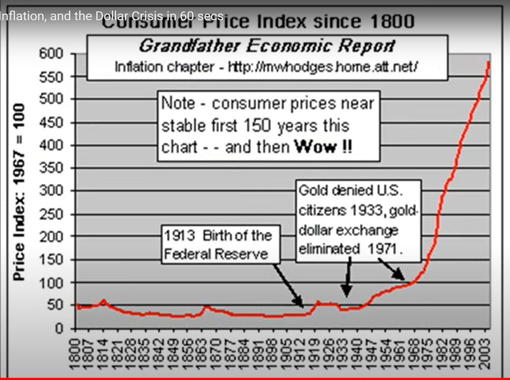
    
	

The following graph helps us understand how when the US was still on a gold standard, since gold can't be increased by adding 0s at the end of bars, this prevented the government from acquiring additional wealth-taxes by just creating the money thus prices had a slight downward trend until 1971 when the USA completely abandoned the gold standard. Up to 1971 the US would give foreign governments an ounce of gold per $35 dollars, but to acquire enough wealth from the public in order to give it to people involved in the Vietnam War, as well as grow a rapidly increasing welfare system, the US was creating more dollars than what it could honestly exchange to gold. French president Charles de Gaulle, who wanted the war to end, knew this money-debt-creation was allowing the US to dishonestly acquire the needed wealth to finance the war so he demanded many dollars to be exchanged into gold. The US had enough for France, but was running very low on gold and knew it could not meet further obligations so it just completely stopped dollar-to-gold convertibility and thus end the gold standard. Had the US government tried to obtain this wealth, not via money-creation-inflation, but by raising taxes directly, chances are Americans would not have gone along. Thus from 1971 onward the US government thanks to Fed(Central Bank) money-creation has been able to additionally tax workers-savers causing prices to rapidly increase instead of going down. If you look very carefully at the graph, you will notice two rapid increases in prices, one occurring during the American Civil War (1861-65) and another during the First World War(1914-1918). During wars, tribalistic politicians-ideologues always resort to the price-increasing  money-creation to acquire the wealth needed to feed-clothe-nourish the war effort, because if they had to get the wealth via direct taxation, the public would more easily factor the true costs of the tribalistic warmongering and likely bring an end to such slaughters. 

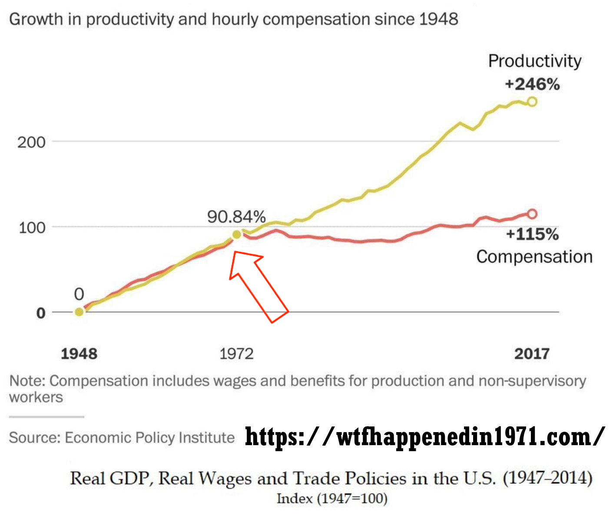

The graph above helps us see how thanks to technology-progress even though worker productivity has increased by 246% since 1948, compensation has only increased by 115%. Again, once the economically ignorant technocrats-politicians abandoned the gold standard in 1971 and could easily acquire additional wealth by just creating money (more debt) much of the additional production was taken away from workers via inflation-money-creation. The concept of "No taxation without representation!" is bypassed when ideologues can take all the wealth they want from the public by just creating money. This is NOT the result of some 'malicious plot' by bureaucrats, for the most part most are clueless and are only focused on spending (acquiring wealth now) to help the cause-war-welfare-etc. 

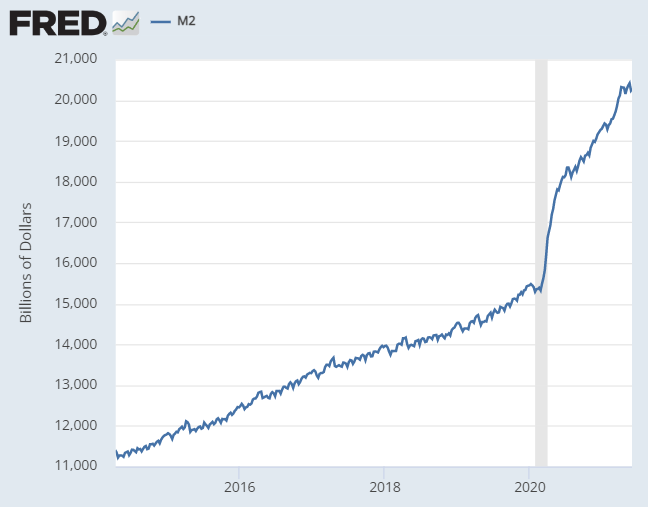

This next graph shows how from early march to mid may 2020, the Federal reserve has created about 3 trillion dollars which will be given to people and businesses so that they can exchange this money for wealth they can consume, much of this will be unemployment benefits which will motivate many to not even look for work and thus continue to be pure consumers thus overall the 3+ trillion is leading to a rapid shrinking of the economy and accelerating rise in prices. Again, this is just a transfer of wealth from workers-seniors-some to others as the economy continues to shrink and prices rise compared to what they would have otherwise been without the money-creation. 

### Trade, Money and the Division of Labor and Information.

Trade and money led to the "division of labor and information" which allowed the social order to efficiently compartmentalize information in only the brains that needed it and also accumulate a virtually limitless amount of information with which to continuously restructure itself in increasingly more productive-advanced ways. For example, Mark's brain contains knowledge of how to get coconuts and process them to create pastries. Tom's brain contains knowledge of how to find the best vines and weave them together to make baskets. Jim's of where to find rocks which when split can create sharp knives and how to sharpen them. When Mark trades his pastries for Tom's baskets and Jim's knives he is a benefactor of all the knowledge needed to creating those items yet he only had to know how to make his pastries. Unlike the tribal social order where knowledge is inefficiently repeated across every brain, trade allows for information to be efficiently stored fewer times freeing up more brains to contain more information. We can envision 1,000 men producing and trading 1,000 different types of items requiring 1,000 times more information which without trade and the 'division of information' that it enables would have been impossible to achieve in a tribal society. Also, when Mark trades his pastries for the baskets and knives he can now make less trips to gather coconuts by using the baskets and process them faster by using the knives and thus increase his 'rate of production' from 2 to 10 pastries per day. The pastry-making process has become more productive and also more complex because it was enabled by basket and knife making knowledge. We now have a never-ending cycle of increased 'rate of production' and complexity -> population growth (more brains) -> increased 'rate of production' and complexity -> more brains -> … leading to where we are today with nearly 8 billion people and the inability to fully trace the knowledge that enabled the creation of anything. In Hayek's words: 

>"the greater density of population, leading to the discovery of opportunities for specialisation, or division of
labour, led to yet further increases of population and per capita income that
made possible another increase in the population. [And so on."](https://books.google.com/books?id=YQLYAQAAQBAJ&pg=PA40&lpg=PA40&dq=%22the+greater+density+of+population,+leading+to+the+discovery+of+opportunities%22&source=bl&ots=OdrrCyyGT3&sig=ACfU3U2RrY6L_hQm8BCBOad08o-du-kPtQ&hl=en&sa=X&ved=2ahUKEwj3wOfc4q_pAhUxFjQIHe5VBigQ6AEwAHoECAcQAQ#v=onepage&q=%22the%20greater%20density%20of%20population%2C%20leading%20to%20the%20discovery%20of%20opportunities%22&f=false) (Hayek, 1988, p. 40)

For example, a web-designer can trade his services which are dependent on web-design information that resides in his brain for money, and then trade the money for any of the billions of products-services that exist in the world and are likewise dependent on information spread throughout the world. The websites he creates are also enabled by all the information that enabled the "factors of production" he used to create them, like his computer, monitor, keyboard, software, electricity, the Internet, etc., which themselves are enabled by all the information that enabled their "factors of production" like the computer's memory, processor, and so on. Everything that is produced today is the result of an interdependence of information that spans millions of minds, not just in the present, but in the past as well, because wealth that is currently being produced-consumed is dependent on tools-'factors of production'-information provided further in the past. When he upgrades to a better computer, the information that enabled these improvements also contributes to-enables the improvement of his website production process. Without money how would a heart surgeon trade his costly services for toothpicks? Without trade and money, this "division of labor and information" as well as the inter-temporal cooperation-interlocking-stacking of information just described, and the ability to do profit-loss calculation to ensure that each order guides its actions in a manner that it produces more than it consumes, would not exist and neither would our social order which depends on it.

### Creation and Spread of Information via Economic Competition and its emergence from the tradition of Private Property.

In the 'Social Organism'-economy superior information arises and spreads thanks to economic competition which emerges from the tradition of private property. Private property means that matter is under the exclusive control or ownership of a single person-mind-CPU. Each person is motivated to discover the best information with which to transform or reorder their private property in a way that increases its value or utility. Most of us transform the trillions of atoms that make up our bodies in a manner that maximizes the value-utility of the labor we produce and then trade with other people or companies. Some transform bread and beef to increase their value as hamburgers which are then traded with others, etc. From our freedom to use-transform our private property emerges the 'freedom to trade' it with anyone in the entire planet which inadvertently transforms mankind into a global supercomputer where people via the companies they create are motivated to innovate and learn from each other(competitors) thus inadvertently cooperate to discover and spread superior information and subsequent order. For example, a Honda engineer in Tokyo, Japan, may have invented power doorlocks which thanks to 'economic competition' motivated BMW in Germany, Ford in the USA, and other 'competitors' throughout the world to copy and thus spread superior information throughout the world. Why do they do this? Because people in their role as consumers have the 'freedom to trade' their life-order-sustaining wealth with the better informed auto-manufacturers(competitors), and as producers, to go into the auto manufacturing business. This in turn motivates all competitors to learn-copy each other lest they not get enough revenue-wealth with which to pay their employees a competitive wage so they use their 'freedom to trade' their labor to join the better-informed and thus more productive-efficient orders-companies. Again, this wonderful automatic mechanism of *COMPETITIVE KNOWLEDGE DISCOVERY* is "turned on" or "emerges" from the simple concept, or better said, tradition of 'private property'. Private property gives everyone in our role as consumers the 'freedom to trade' our life-order-sustaining wealth for what we calculate-think is best. This 'freedom to trade-choose' in turn motivates everyone, in our role as producers, to *discover the best information with which to order* ourselves and the matter we control in a manner that produces something society-customers value (our labor, a product-service), which we do by, once again, innovating and-or copying-learning existing ideas-information, in other words, by competing in the economic sense. Most of us simply choose to produce and then trade our labor with a company-order that knows how to further incorporate our labor in a more competitive-profitable way. Via advertising, competitors are motivated to spread the potential usefulness and superiority of their products-ideas as well as the defects-inferiority of their competitors thus accelerating the need to compete-copy-spread superior information.  

A mind-CPU anywhere in the planet that comes up with an improvement will benefit everyone in the world if they are 'free to trade' for his product-service which will also motivate all competitors in the world to likewise improve their actions-order. So we can see how just like in the Olympics we can discover the best athletes in the world due to global competition, so does having the 'freedom to trade' with everyone in the world allows the best ideas to compete and spread globally thus ensuring the best possible global order. As cost-cutting ideas emerge and inevitably spread via competition leading prices to continuously fall, new profitable ideas easily arise and once again spread via competition in an endless cycle of knowledge generation-innovation. For example, computers were once very expensive, but once the price of making them came down enough, people easily realized that every home could have them, which gave birth to our computerized world and the Internet and all the great things that flow from it. The more wealth is produced, the more wealth has to be offered in exchange for labor as companies-orders compete against each other for the labor they need which helps explain why the economic pie grows for everyone. For example, imagine that after a shipwreck you end up in an island where everyone has a machine that can turn dirt into food. Tom wants your labor to build a home, Mark, to build a boat, and Gina to plant a garden. Competition will motivate them to offer you all the food you want and more.
 

### Prices and the Impossibility of 'Central Planning'-Socialism-Communism.

How much wealth had to be consumed in order to produce a gallon of gasoline that sells in Seattle for $3.50? Or a pound of beef that sells in a store in London for $5.35? We can't know for sure, however, we can be fairly certain that it was less than the advertised price which on average must include the costs. The price of any item in the world lets us know that there is an order at that particular place and time that is coordinated by information that can produce the item while consuming less than the advertised price. THAT IS AMAZING! This allow goods to be purchased and combined in a manner that ensures that the combination (like a car) can easily have a price set that properly accounts for the costs-consumption of the whole (car) by just adding the prices of the parts used to produce it (wheels, glass, robotics, labor, etc.), parts which themselves had a price set that included their costs-consumption and so on, each part-input managed-ordered by entrepreneurs-brains-CPUs with highly specialized time-and-place specific information who are always using profit-loss calculation to ensure they are increasing the economic pie. The concept-tradition of 'private property' plays a vital role here as well, it is not until matter-things are privately owned, that they are controlled-coordinated by brains-CPUs that are incentivized to discover the best information with which to reorder-coordinate them in the most productive-profitable way possible.

How do we know whether it is a good idea to build an airport or a school at a particular time and place and also get the necessary wealth without coercion or making criminals out of people who may not want to contribute to them? Only entrepreneours at those times and places can 'discover' if there are enough people whose lives would be improved by trading their wealth for such wealth (airport or school), and how to build them in a profitable and competitive way. The information needed to create-coordinate the social order, like whether to produce cars, or buildings, or pizzas, where to do so, what prices to set, and most importantly, how to produce them in a manner that more wealth is produced than consumed, is information that can only be created by free people dispersed throughout the world thus rendering central planning ideologies like Socialism-Communism IMPOSSIBLE regardless of the good intentions of their members or their intelligence. To see why this is the case consider the following example, a Cuban restaurant in Miami Beach sells a picadillo dish (ground beef, plantains, rice) for $8. Perhaps $1 might be profit, and $7 will be spent in costs, in other words, in the necessary consumption of wealth needed to produce the meal-wealth, things like equipment-electricity-food, and everything employees and their families will consume at home (food, energy) thanks to their paychecks that came from the $7-meal. The businessman discovered 1) that there are enough customers nearby willing to patronize the restaurant at the $8-meal price which necessitates taking into account customer's already existing local competitive options thus providing an improvement in society, and 2) how to reorder $7 worth of stuff(labor-supplies-etc.) to produce the meal. If he sets prices too high, customers will choose other superior existing competing options and thus fail to improve the social order. If he sets prices too low, he won't cover costs and cause more consumption than production thus shrinking the economic pie. These are two vital pieces of information that are impossible for a central planning body to discover and helps explain why every time Communism has been attempted the result has been a much faster rate of consumption than production and eventual famine-starvation-chaos-death. Again, only free entrepreneurs dispersed througout society, not government "experts" in a central location, are at the right time and place needed to discover people's desires and how to order a business or section of society while setting prices that create a profitable order. The social order exists thanks to the fact that private property maximizes economic calculation by allowing-encouraging every person-mind-CPU to sense-analyze its proximate corner of the world and reorder it to be as profitable-'pie increasing' as possible. Central planning-Socialism-Communism simply reduces the number of brains-CPUs that can do profitable calculation by turning them into order-takers by the smaller number of 'central planning "experts"' who are also too far away to gather the necessarily time-and-place information needed to profitably plan-reorder thus always rendering their planning inferior, leading to more consumption than production or what Mises referred to as ['Planned Chaos'.](https://www.youtube.com/watch?v=7EnHeZXLzTc)

Try to envision how matter is coordinated by information constantly increasing its value. The restaurant owner discovers laborers-equipment-‘food distributors’ with the right prices to hopefully create a profitable order-restaurant. He places orders for the food/ingredients which can be seen as increasing in value as they are delivered to the restaurant, at a cost of course, that which must be consumed(fuel-food-etc.) by the driver-etc. The waiters begin producing the ‘meal experience’ by seating customers and taking the orders, the cooks increase the value of the ingredients by combining-cooking-transforming them and thus producing the meals, the waiters further increase the value of the meals by further transforming/transporting them from the kitchen to the table. The customers consume the meals, their internal order-cells will further consume them as they produce their heartbeats and all that is required to keep the cells-people-orders alive-etc. Customers, who had previously produced stuff and exchanged it for money, traded money which will then go to the owner, cooks, waiters, suppliers, etc. and then traded with countless orders/businesses so that they too can consume-live. Each actor-order producing and consuming at different rates using prices and ‘economic calculation’ to ensure more production than consumption at the whole restaurant level, and at each individual level as the waiters and cooks manage their personal spending-lives. The food-supplying company uses the prices in its own relevant corner of the world to likewise organize itself profitably. Each actor-order is motivated to sell or trade the wealth it produces for as high a price as it can but the freedom of customers to choose competitors limits how high a profitable price can be. Thus prices, and the vital information they convey, are what allow ‘economic calculation’, they allow cars-picadillo-stuff to be built from parts-beef-inputs, which themselves are built from other inputs, each input managed-ordered by entrepreneurs-brains with highly specialized time-and-place-specific-knowledge-skills, leading to never-ending conveyor belts of interlocking cycles of production-consumption, each moving-reordering matter in increasingly valuable ways. Since prices contain highly time-place specific information it is absurd to arbitrarily copy the price from one place and apply it to another. A similar Cuban restaurant-meal might be profitable in Austin, Texas selling the picadillo for $6.50 because costs-consumption like real estate, transportation, and labor might be lower there compared to Miami Beach. In Oslo, Norway, the costs might be $20/meal due to the additional consumption of wealth that has to take place as the ingredients are shipped so far and numerous other factors, which again, are highly time and place specific and only discoverable by local actors.

Nikita Khrushchev, who followed Stalin as head of the centrally planned (Socialist-Communist) Soviet Union, is credited with saying “When all the world is socialist, Switzerland will have to remain capitalist, so that it can tell us the price of everything”. Unfortunately for Khrushchev and the billions who suffered economic chaos and an inevitable decline in production under Socialist-Communist regimes all over the world, prices in Switzerland (or anywhere else) embody information about the costs/consumption of those particular places at specific times and are no good elsewhere.

With the Internet, pricing information all over the world can help customers find-nourish cheaper-better products-orders-companies and also help producers likewise thus greatly accelerating competitive knowledge-order-spreading but it will NEVER lead to the success of central economy-wide planning because no computers-system can get in the brains of entrepreneurs to predict what products-businesses they will create and thus alter society, and similarly, no computers can get in the minds of consumers and predict how they will choose to spend their money/wealth thus once again altering the social order’s numerous cycles of production and consumption. As Mises so eloquently explains:

>“The consumers, by their buying or abstention from buying, ultimately determine what should be produced and in what quantity and quality. They render profitable the affairs of those businessmen who best comply with their wishes and unprofitable the affairs of those who do not produce what they are asking for most urgently. Profits convey control of the factors of production into the hands of those who are employing them for the best possible satisfaction of the most urgent needs of the consumers, and losses withdraw them from the control of the inefficient businessmen. In a market economy not sabotaged by the government the owners of property are mandataries of the consumers as it were. On the market a daily repeated plebiscite determines who should own what and how much. It is the consumers who make [some people rich and other people penniless.” (Mises)](https://fee.org/articles/inequality-of-wealth-and-incomes/)

Who can anticipate the firing of trillions of neurons in billions of brains to predict-plan the resulting desires-ideas?

 

Since prices that properly estimate costs/consumption can only be set by free entrepreneurs, when the government (central planners) attempts to set them via "price controls" it warps the socioeconomic order in inferior ways. For example, if the free-market price of a gallon of milk is $2.30 in a particular store in Miami which profits 0.30 per gallon (costs = $2.00) and the government mandates the price to be $1.99, then the business is consuming more wealth ($2.00) than what it gets ($1.99) and will eventually go bankrupt causing less milk to be produced leading to shortages. Even if the government sets the price to, say $2.15, so that the business can still profit, it will still lead to eventual shortages for the following reasons. Under normal circumstances the rate of profit tends to be equal-uniform across all sectors-businesses, if higher-than-average profits are being made in say auto-manufacturing, factors of production like labor, materials, real-estate are withdrawn from other less profitable sectors which reduces production-competition in them causing profits to go up in those sectors, while simultaneously increasing production-competition in the auto-manufacturing sector causing the initial higher-than-average rate of profit to go down towards average levels. So by making profits in milk production lower than the average it still has the effect of decreasing, albeit less drastically, milk production which is the opposite of what the economically ignorant masses and politicians want.

It is important to envision the socioeconomic order as it really exists as if looked at from high above. Envision people coming together-apart as companies-orders emerge and dissolve in ever-changing conditions. Superior information arising and rippling-restructuring the social order thanks to competition. As orders get more productive they lure other people to 'trade-with' or 'join-them' by offering more money-wealth for their labor relative to other companies-orders, eventually causing the least productive orders to sort of dissolve as their 'factors of production' like labor, buildings, etc. are bid away to be parts of more productive plans-orders. A sort of swarm intelligence emerges as the all-pervasive public quickly nourishes the growth and spread or superior orders-companies-information, inadvertently expanding the worldwide "division of labor and information" as entire neighborhoods-cities morph themselves in specialized ways as complementary pieces of information-orders segregate themselves in distinct geographical locations like the software industry in Silicon Valley, California and manufacturing in Guangdong, southern China. As Mises reminds us "The division of labour is a fundamental principle of all forms of life." The division of labor is a pattern-way which natural selection rediscovers to enable smaller units-orders to efficiently compartmentalize labor-information as they contribute-to (and are nourished-by) a larger organism they become parts of(Organelles -> Cells -> Organs -> Humans -> Social Organism). Mises again:

>"It is by virtue of the division of labor that man is distinguished from the animals. It is the division of labor that has made feeble man, far inferior to most animals in physical strength, the lord of the earth and the creator of the marvels of [technology." (Mises, 1985)](https://mises.org/library/liberalism-classical-tradition/html/p/7)

### Morals as Superior Information.

Morals are simply ways of acting, they are knowledge which also emerges and spreads via economic competition. Companies-orders that hire-nourish-'trade with' lazy, disrespectful, or corrupt people will be less competitive and be inevitably pressured-selected to hire people with better morals which in turn forces everyone to be respectful and hardworking regardless of race, sex, etc. Similarly, it is hard-working, tolerant, courteous people who thanks to competition inevitably force everyone else to be likewise. As Hayek tells us:

>"Competition is, after all, always a process in which a small number makes it necessary for larger numbers to do what they do not like, be it to work harder, to change habits, or to devote a degree of attention, continuous application, or regularity to their work which without competition would not be needed." [(Hayek, 1981, p. 77)](https://books.google.com/books?id=malYAQAAQBAJ&pg=RA2-PA77&lpg=RA2-PA77&dq=%22continuous+application,+or+regularity+to+their+work+which+without+competition+would+not+be+needed%22&source=bl&ots=kU2cMHmKYQ&sig=ACfU3U30vW96Pca8EGx2LO5qTHNN9P8FNw&hl=en&sa=X&ved=2ahUKEwinl4zg4PDoAhUChHIEHWifC9IQ6AEwAHoECAsQKQ#v=onepage&q=%22continuous%20application%2C%20or%20regularity%20to%20their%20work%20which%20without%20competition%20would%20not%20be%20needed%22&f=false)

As millions of Italians, Britons, Germans and others from all over the world came to America, it was ultimately the competition which grows from 'private property' and thus individual liberty-freedom which stripped these people of their otherwise nationalistic-ethnocentric-tribalistic identities and evolved what came to be seen as the classic American character-ethos of wanting to be seen as a reputable-honest businessman-professional who treats everyone with respect and wears a business suit as opposed to older religious-ethnocentric dress. So not only does 'private property' "turn on" or leads to economic competition and other aspects of the market process and resulting social order-civilization, it also evolves our culture-identity to be ideally suited for participation in the 'Social Organism'.

### Government-'Public Sector' is an Inefficient Monopoly.

Since it is through freedom and resulting 'competitive knowledge discovery' that we both, free people from coercion-tyranny-slavery, and also discover the best information with which to reorder mankind, the role of governments should be to set the framework-laws that maximize such freedom-'competitive knowledge discovery' and NOT to attempt to manage-order society because governmental-'public sector' bureaucracies, being COERCIVE MONOPOLIES which get their life-order-sustaining wealth through taxes-compulsion are immune to the competitive-information-spreading incentives-pressures which motivate-force private sector orders to be efficient-innovative-hard-working. This helps one understand how Communism, which abolishes competing orders-companies and replaces them with a single competition-less monopolistic bureaucracy of 'experts', leads to a massive lack of production-innovation and eventually socioeconomic chaos-starvation as the economic pie continuously shrinks as has happened in every country that consciously attempts Communism-Socialism or inadvertently drifts in that direction as their governments get bigger and bigger (USA-World). Central plans can’t work if people are free to not go along with them, or use property as they wish instead of by the central plans — so they inevitably require compulsion-tyranny. For example, it is a criminal act in Communist countries like North Korea to start a business, in other words, to attempt a superior restructuring of society because it interferes with the plans of "the experts" who run the government. It is also a criminal act everywhere to not pay taxes that sustain public sector bureaucracies like "public education" so there is little incentive or wealth to sustain other, more desirable-superior competitors. For example, the NYC public(monopolistic) school bureaucracy consumes about $29,000 per year to “educate” a K-12 student. Refusing to pay a single dollar that goes to this bureaucracy is a criminal act. Taxes and all transfers of wealth from the private sector to the government, besides being an obvious burden to the people that had to sacrifice a part of their lives to earn such wealth and now have less wealth to trade for the things they want, simply destroy the private sector jobs the taxed-away spending would have sustained and replaces such productive-efficient and pie-increasing jobs for inefficient government ones or worse like militarism-wars. The former Soviet Union had plenty of highly educated scientists-'experts' whose plans required the coercion of millions, but they were thoroughly crushed by free Americans and their 'competitive knowledge discovery'. Socialist regimes and government in general also face an "incentive problem." In free societies, or the private sector, each person-cell is incentivized to be as productive as possible and keep inefficiencies to a minimum since he owns-keeps the additional wealth or losses. On the other hand, the government employee or bureaucrat gets the same pay (ability to then consume) whether his department did a good job (produced a lot) or not, and is also not risking his own wealth since that comes from the taxpayers. The image below is another one of our most powerful memes for explaining the difference between competitive-private-free orders(South Korea) and monopolistic-government-coerced orders (North Korea). Again, keep your eye on how information arises-spreads via competition and continuously restructures the social order. 

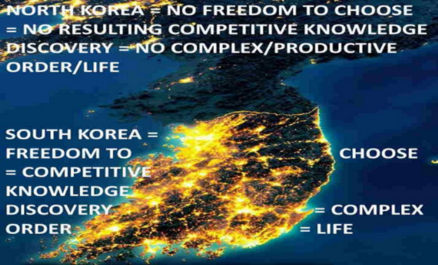

Hayek:

>"The argument for liberty is not an argument against organization, which is one of the most powerful tools human reason can employ, but an argument against all exclusive, privileged, monopolistic organization, against the use of coercion to prevent others from doing better."

For 'competitive knowledge discovery' to work wealth must remain in private, not government-public hands. For example, in relatively free countries like the USA you have the freedom of speech necessary to criticize an awful public education system, or the disastrous Iraq and Afghanistan wars, but since you are still coerced via taxation to support those "ideas", the 'competitive knowledge discovery' is inexistent.

In his essay ["Over-Legislation" Herbert Spencer](https://www.econlib.org/book-chapters/chapter-essay-over-legislation/) beautifully comments on the differences between governmental(law-made) orders and private/competitive ones:

>"How invariably officialism becomes corrupt every one knows. Exposed to no such antiseptic as free competition — not dependent for existence, as private unendowed organizations are, upon the maintenance of a vigorous vitality; all law-made agencies fall into an inert, over-fed state, from which to disease is a short step. Salaries flow in irrespective of the activity with which duty is performed; continue after duty wholly ceases; becomes rich prizes for the idle well born; and prompt to perjury, to bribery, to simony. ... Officialism is habitually slow. When non-governmental agencies are dilatory, the public has its remedy: it ceases to employ them, and soon finds quicker ones. Under this discipline all private bodies are taught promptness. But for delays in State-departments there is no such easy cure. ...

>Consider first how immediately every private enterprise is dependent upon the need for it; and how impossible it is for it to continue if there be no need. Daily are new trades and new companies established. If they subserve some existing public want, they take root and grow. If they do not, they die of inanition. It needs no act of Parliament, to put them down. As with all natural organizations, if there is no function to them, no nutrient comes to them, and they dwindle away. Moreover, not only do the new agencies disappear if they are superfluous, but the old ones cease to be when they have done their work. Unlike law-made instrumentalities…these private instrumentalities dissolve when they become needless. ...

>Again, officialism is stupid. Under the natural course of things each citizen tends towards his fittest function. Those who are competent to the kind of work they undertake, succeed, and, in the average of cases, are advanced in proportion to their efficiency; while the incompetent, society soon finds out, ceases to employ, forces to try something easier, and eventually turns to use. But it is quite otherwise in State-organizations. Here, as everyone knows, birth, age, back-stairs intrigue, and sycophancy, determine the selections, rather than merit. The “fool of the family” readily finds a place in the Church, if “the family” have good connections. A youth, too ill-educated for any active profession, does very well for an officer in the Army. Gray hair or a title, is a far better guarantee of naval promotion than genius is. Nay, indeed, the man of capacity often finds that, in government offices, superiority is a hindrance — that his chiefs hate to be pestered with his proposed improvements, and are offended by his implied criticism. Not only, therefore, is legislative machinery complex, but it is made of inferior materials." (Spencer, 1853) 

### Regulatory Paralysis.

With our focus on how information arises and coordinates life-order, we can see that a government regulation is essentially a "way" of doing things, it is information. But unlike information that arises in the private-competitive sector and is constantly being replaced by superior information due to economic competition, a government regulation is information that arises out of a few brains and is then forced upon the entire social order from the top-down via the law and can only be changed via a painfully slow monopolistic-bureaucratic apparatus made up of economically ignorant politicians, lawyers, lobbyists and special interest groups who always lack the necessary local time-and-place-knowledge and incentives to discover what is the best way to do something. In the free-private-competitive sector information moves from the bottom (individual minds-entrepreneurs-innovators) to the top-others-influencers as it is ‘tested’-refined-preferred by the comparisons to other information by billions of minds thus ensuring superior information spreads and is ideally adapted to each specific time and place. This is bypassed by top-down regulation and all government-monopoly action which ultimately comes at the expense of wiser private-competitive action. The more the government regulates, the more it paralyzes 'competitive knowledge discovery'. As government regulations have increased in the health care sector, turning it into a sort of island of paralyzed top-down competition-less-socialist central planning, so have costs. These increased costs have led the sector to grow from consuming 5% of the American economic pie in 1960 to a whopping 16% in 2006 and over 20% 2022 culminating in the Coromunism disaster. The image below helps explain the regulatory paralysis-bureaucratization of the entire medical sector which is responsible for the skyrocketing costs.

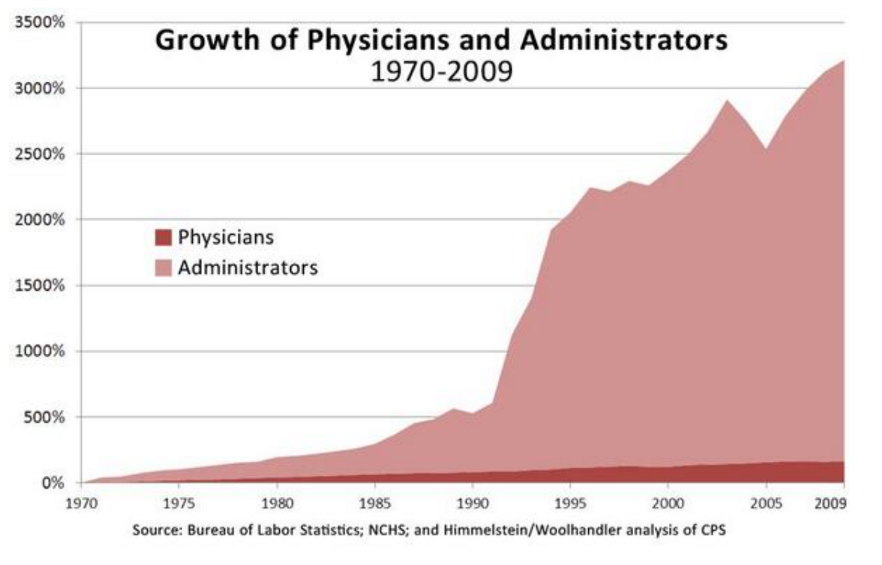

What a person must learn in order to legally offer medical advice via licensing of doctors, where he must learn it via licensing of medical schools, what chemical compounds can be legally consumed, how to test drugs, how the medical insurance industry should work, and countless other gigantic bodies of knowledge-information are dictated by monopolistic competition-less bureaucracies like the American Medical Association (AMA), the Food And Drug Administration (FDA) and numerous others. By comparison, the Information Technology sector has very few government regulations so competition motivates the creation and spread of superior information at breakneck speed and is obviously transforming our world right before our eyes. Teenagers can work at Google-Microsoft-Amazon and write the software that keeps planes in the sky or people alive via software in medical equipment, yet there is no American Association of Computer Programmers dictating what or where such knowledge can be obtained similar to how the government via the AMA regulates-monopolizes-paralyzes the medical sector via the licensing of doctors, medical schools, insurance sector, etc. There is no government monopolistic bureaucracy ensuring the proper functioning of the software that runs PCs, smart-phones, the Internet, or ensuring the lack of malware or viruses in software. Freedom and competition in the Software Development industry is even quickly evolving culture. It is increasingly seen as uncool and backward to have a traditional degree, where one wastes thousands of dollars and time physically attending gigantic temple-like universities, inefficiently ("professors" instead of popular online videos you can pause-rewind) "learning" things that have nothing (English 101, etc.) to do with being a productive software-web-IT professional. Thanks to this lack of monopolistic centralized decision making-regulating-paralyzing, education in the Software Development-IT world is astounding. At places like www.freecodecamp.org thousands of people are going from 0 experience to highly-paid computer programmers in just a few months for free. IT companies who reach a large enough size ultimately due to the great services they provide, and therefore the useful-profitable knowledge they contain, like Microsoft, Google, Amazon, and many others, go about creating their own educational institutions which train and test people using their products and technologies which are solving real problems and have been shaped by years of fierce competition. There are over 2.1 million individuals worldwide who have become Microsoft Certified Professionals(MCPs) by studying for and passing exams created by Microsoft. These exams change frequently to reflect the never-ending cycle of knowledge generation that exists in this freer and less regulated sector of the economy. Economic ignorance leads many to believe that since one has to be seemingly more careful with medicine, such monopolistic regulatory oversight is somehow necessary. This is irrelevant, if it is superior knowledge that is needed, which includes figuring out how careful to be, freedom and competition is the best way to discover it, period. Nobody knows who the greatest programmers in the world are, there is rightly no Nobel prize for them, the nearly 30 million lines of complex computer code that make up the Linux Operating System that runs most of the world's computers and is now an integral part of the 'Social Organism' were created not so much by 'smart' people, but by pure competition. If the medical sector, or better yet, the entire world-wide economy was as deregulated and thus as competitive-innovative as the Software-IT sector, the rate of innovation and prosperity would skyrocket and in all likelihood people who as of today have 5-10 years left to live might be able to beat dying of old age. Only the truly economically woke can easily accept the feasibility of this statement. In graph below one can see how the more regulated a sector is (Hospital Services) the more expensive-consumptive it becomes.

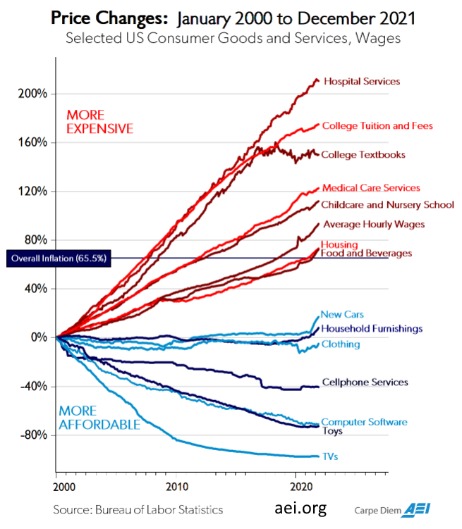

One of the numerous flaws in how the AMA goes about regulating the world of medicine is in the assumption that medical professionals have to be some of the brightest and most dedicated people around, which it attempts to achieve by making entry into medical school and training such an arduous and ultimately expensive process. But this assumption is false, what cures people, or produces any product or service in today's world, is not so much hard working bright individuals, it is the tremendous amount of knowledge and cheap technology that the market-process-coordinated world puts at our fingertips. This flaw is not specific to the AMA, it applies to our educational establishments and much of how we look at learning and the role of human intelligence. 

The market process and resulting world-wide "division of labor and information" is far, far more important than individual intelligence-IQ-effort. For example, Mike knows he can incorporate Tom (who has down syndrome) into his landscaping company by having him perform simple tasks in a manner that increases the company's 'rate of production-revenue' in terms of landscaping services by an additional $4 per hour ($640 per month). Mike trades $3 per hour ($480 per month) for Tom's labor to make a 1 per hour (160 per month) profit, and after just 10 hours of labor-production and trade, Tom can produce a mindbogglingly complex tablet by trading his $30 for it. Thus it currently takes about 10 hours of labor for a low-IQ person to produce something that was impossible to create just 20 years ago. "But he didn't really create the tablet!" thinks the economically ignorant. But guess what? The economically woke knows the neither did the company that "manufactured it". Did such a company create the tablet's CPU? Or the memory-camera-touchscreen-battery-plastic? Or any of the machinery-tools required to produce the aforementioned components? Of course not. The "manufacturer", just like Tom, mostly traded and added a relatively minuscule amount of new information compared to what it already got from the "Social Organism" and its world-wide division of labor-information that has been evolving for thousands of years. Due to massive economic ignorance, Tom's truly astounding rate of production is impossible to achieve because it is either illegal for someone to trade their labor-production for a rate lower than the minimum of $12 per hour (i.e. California), or because the legal expenses related to paying someone less than the minimum make it unprofitable to do so. Minimum wage laws are regulations which essentially outlaw all production that does not occur faster than the legally mandated minimum and hurt the least productive members of society who need wealth the most. Elderly who due to old age eventually produce at a slower rate, teenagers, etc. 

Government regulations, which again, are inferior competition-less information which is imposed on the social order by force, not only paralyze the superior competitive knowledge discovery that would otherwise exist and enable the growth of paralyzing-inefficient bureaucracies, they also allow BAD ideas to be much harder to change. We only have to remind ourselves of the Catholic Church’s regulation of speech-thought which led to the persecution of thinkers like Galileo Galilei and thus the general retardation of scientific progress to various degrees. Bad ideas, like Socialism-Communism must have intellectual persecution in order to prevent criticism or ideological competition. So once again we must highlight that freedom, is not only indispensable for the competitive discovery of innovations, but also for discovering the TRUTH.

### Patents.

By understanding how patents do far more harm than good we can continue to solidify our vital understanding of how information coordinates the social order. One of the reasons why we so naively fall for the erroneous idea that patents are good for society is because we greatly overestimate the importance of the individual or company making the discovery while being unaware of how it is 'the market process', via its various mechanisms like prices, the profit motive and competition, which plays the key role in innovation. Competing orders-companies, due to the fact that they are already in business competing with each other, contain knowledge that has to be relatively similar. If one competitor has knowledge that leads to much more productivity-profitability, it would drive some competitors out of business, and it would also motivate competitors to copy-emulate the superior knowledge thus leading to a state where once again all competitors contain more or less the same knowledge and inevitably come up with new products-improvements-innovations. Which particular mind manages to stumble upon a new innovation has more to do with chance and circumstances than anything else. Patents inevitably turn competitors which are ultimately cooperators since we are constantly learning from each other as we compete, into bitter rivals; give credit to one where many, or better said, the entire social order via the market process and world-wide division of labor are involved; they slow down the market process by preventing further innovation by competitors whose ideas are based on patented ideas because they now have to pay large sums to patent holders; they remove competitive pressure from patent holders thus making them lazier and worth their time and money to go into the damaging business of suing patent infringes thus retarding technological progress; and since the patent system is overseen by a monopolistic and bureaucratic government organization, it is bound to grow more inefficient and chaotic and also prone to manipulation by the better-connected. Patents, just like regulations, simply create-spread paralysis in the market process. The information technology industry, although less regulated than the health care sector provides a good example of how patents begin to paralyze an industry. Prior to 1981 computer programs could not be patented and this helped spark the explosive growth of the computer-software industry. As Microsoft founder Bill Gates tells us:

>"if people had understood how patents would be granted when most of today's ideas were invented, and had taken out patents, the industry would be at a complete standstill today. I feel certain that some large company will patent some obvious thing… If we assume this company has no need of any of our patents then they have a 17-year right to take as much of our profits as they want. The solution to this is patent exchanges with large companies and patenting as much as we can." [(Bill Gates, "Microsoft Challenges and Strategy," memo, May 16, 1991)](http://antitrust.slated.org/www.iowaconsumercase.org/011607/0000/PX00738.pdf )

So Gates clearly saw how patents would lead to paralysis. Unfortunately his solution at the time was not to argue for the abolishment of patents altogether(which I don't blame him for), but to attempt to protect his company by patenting as many things as possible with which to threaten-protect itself from others in this new ecosystem of warring-litigating patent holders. Given the incentives, this is the strategy that works or is "naturally selected", thus we have bigger and bigger patent holders fighting it out in order to progress, while at the same time making it harder and harder for the little guy or new competitor to innovate.

Without patents, the social order is constantly improving and moving the best information which can be copied freely-quickly, but existing patents inadvertently disincentivize this more ideal outcome and cause research-wealth to be diverted for the discovery of non-patented inferior information. For example, a whopping 77% of new drugs approved by the FDA are not "new" in the sense that they make some significant improvement compared to an existing drug; they are what are referred to as "me-too" drugs. These "me-too" drugs are usually inferior to drugs already on the market to treat the same condition, they simply allow competing drug manufacturers to enter the market to treat a condition where other companies might be making huge profits due to their patents-monopolistic position.

Innovating is a lot easier than people think. As previously mentioned, as prices or costs of production go down, that which was prohibitively expensive becomes possible which in turn makes other things possible and so on. The world is vastly more innovative today than it was 100 years ago not because we got any smarter because obviously our biology has not changed, but because the market process has made it easier to innovate. Some innovations revolutionize entire fields and make it easy for further innovations to come about. For example, how much easier was it for scientists to make biology-related innovations once the electron microscope took magnification from about 2,000 times to over two million? How much easier was it to invent all sorts of gadgets once electricity came about, or computers, or the Internet? The market process and continuously evolving world-wide division of labor can be seen as a sort of ever-growing ladder taking humanity up an infinitely high tree whose fruits are innovations. For the most part all we have to do is easily pick them off the branches when the ladder gets us there. Very expensive endeavors that only seem profitable if granted patents can be seen as attempts to grab a fruit-innovation that is currently too high up in the tree and we are better off just waiting for the normal technological progress to get us there by cheapening all related research-etc. instead of damaging the workings of the system-ladder in an attempt to make gains that really leave us worse off due to the damage made to the ladder-system by patents.

The damaging pro-patent ideology is also adding to tensions between patent enforcing nations and developing nations who are being coerced or erroneously persuaded to implement patents while also being sort of accused of "stealing our ideas without proper compensation". This is rooted in the same fallacy of attributing innovation to those making the innovation as opposed to the market process. So-called "developed" areas like North America, Europe, and Japan became developed because the market process managed to work well enough in those areas as to incentivize and coordinate minds in a way that so much knowledge was created, and this was done, in spite of patents, not because of them. Old people, being more likely to be found with cancers, does not mean that having cancers leads to old age, it means that natural selection has built us in a way that we can continue to live for a while in spite of the cancers. Too much government, just like too much cancer, eventually destroys the super-structure. The market process' ability to organize the social order in ways that lead to what we would call progress is amazing. A little freedom goes a long way. Technological progress in the 20th century has been great, in spite of cancerous government bureaucracies, wars, patents and other misguided government regulatory frameworks which we believe to be the creators or managers of social order while they are in fact its retardants or destroyers to significant degrees. Think about how truly unfair the following is: the Chinese had the misfortune of having much of their 20th century destroyed by war and a truly communist economy which led to the deaths of tens of millions while the market process used millions of brains in the US to discover new ideas, and now that the Chinese increase their freedom and begin to have their social order be coordinated by the market process, they have to pay royalties to the West. This seems pretty "unfair" to me. Developing nations like India and China should not feel like they are "stealing" ideas from the more developed nations, and likewise the United States should not be souring economic relations based on patent infringement which you can be sure is a significant part of the economic saber-rattling that the economically clueless-tribalistic Trump administration is doing.

### Savings, Interest Rates, Business Cycles, and Recuperating Coronavirus Job Losses.

Finance-banking and interest rates are other vital aspects of the 'Market Process'. Besides the more obvious function of safeguarding savings and pooling the savings of many people to allow the execution of bigger projects which would have been impossible if entrepreneurs were limited to the few savings-wealth of friends and family, banking-finance and more specifically the phenomenon of 'interest rates' also play a nearly miraculous role. For example, assuming interest rates are at around 8-10%, some people, those who have no desire to start a business or have inferior business ideas they expect will have a return on investment (ROI) lower than 8%, will be motivated to lend their money to banks to earn ~8% interest and by doing so they refrain from consumption-spending, thus increasing the amount of wealth-savings available to the future borrowers. The banks are a place where such saved money can be combined, easily accessed and loaned out in different quantities to nourish ideas-businesses-restructurings of different sizes. Banks charge borrowers a higher interest than what they pay to savers-lenders and profit the difference. For example, they lend 1 million to John who uses the money to pay for his business' consumption as it produces (has sales revenue) $1,300,000 worth of stuff thus growing the economic pie by 30%. He pays back loan with the 10% interest (1.1 million) and keeps the $200,000. The Bank pays the savers 8% ($80,000) and keeps the %2 ($20,000) with which to pay-for-nourish its own consumption. Something amazing is going on here!!!. Interest rates motivate the accumulation of wealth and movement of money from minds-CPUs that have inferior ideas that can grow the economic pie slowly (0-8% rate) to minds that have superior ideas and can grow the economy faster (> 10%) thus giving a tremendous sort of 'computational boost' to society. To the economically ignorant, banks-financier-money-lenders, making a living by charging interest without seemingly having to "sweat" seems immoral-unethical, but the economically woke can see how they play a vital role in pairing savings with the best ideas and the interest rate is like a barometer that helps decide whether a mind should do the saving or borrowing. The savings-wealth of the rich, like all wealth in the private sector, is eventually spent on the private sector sustaining efficient private sectors jobs that will tend to grow the economic pie by at least the prevailing interest rate. Taxing such wealth-savings from the rich just destroys those jobs-orders and leads to relatively unproductive government consumption. If you take away the wealth that the rich spend on creating yachts and big homes, you have destroyed the jobs-livelihoods of the yacht and big-home builders. 

It is important to realize that, as the great economist Henry Hazlitt writes in his classic “Economics in One Lesson”:

>“ “Saving,” in short, in the modern world, is only another form of spending. The usual difference is that the money is turned over to someone else to spend on means to [increase production”,](https://fee.org/resources/economics-in-one-lesson/)

and that this increase in production has to be at least large enough to pay back the loan with interest. The economically ignorant masses are unaware of the fact that thanks to the finance-banking sector, the savings of the much vilified "rich" is the very wealth that private sector workers consume while they go about increasing production by an amount greater than the current interest rate. Taxing "the rich" just removes this wealth and the private sector jobs it would otherwise sustain and gives it to government where it is inefficiently consumed while producing little in comparison leading to massive relative losses. 

A society that saves little is sort of stuck in the same cycle of production and consumption and is unable to nourish a new business-idea-restructuring for the time it might take before it produces wealth. Where would our 10,000 airplane factory builders get the wealth to nourish their consumption for the 2 years it would take them to even begin making new planes if others had not saved it? How long would it take for such savings-wealth to exist if savings grow very slowly? On the other hand, a society that saves a lot is constantly making wealth available for superior ideas-businesses-restructurings and thus growing and advancing technologically much faster. 

The more people save, the more money banks will have to lend out and the lower the interest rate will be as banks compete with each other by offering a lower interest rate to lure borrowers. This also means that there is more REAL wealth available to sustain more ideas-businesses, the REAL wealth that savers did NOT consume when they gave their money to banks. If interest rates are at 10%, it does not make sense to borrow-consume to nourish an idea-restructuring that will have a return on investment of less than 10%, but if they go down to 3%, then it does make sense for additional entrepreneurs to borrow and nourish ideas that will yield 10% ROI to profit the 7% difference. Now, VERY IMPORTANT!. What happens if interest rates are lowered, not because more saved-unconsumed wealth is available, but because central banks increased the money supply("bank credit") to "artificially lower" interest rates from the "natural rate" of 10%, to the "artificial rate" of 3%? What happens is that additional projects-ideas which would NOT have been attempted before will now be attempted even though the needed wealth to sustain them to completion will not exist eventually leading to a sort of "bust"-bankruptcies, and partly-finished projects which squandered wealth. Mises has a masterful analogy that goes as follows. At any moment in time given a certain real "natural rate"(again, we assume 10%), there exists enough wealth in terms of bricks-wealth needed to create 100 buildings-projects. If people have really saved more to bring down the interest rate from 10% to 3% there are now more bricks-wealth and 120 buildings-projects can be completed, but if the interest rate has gone down to 3%, not because there really are more bricks-wealth-savings, but because more money has been created, the bases and some scaffolding for 120 buildings is attempted, but eventually, due to the fact that there are now more businessmen with more newly created money which was used to lower the interest rate competing for the same amount of bricks-wealth, the price of bricks (factors of production like labor,land,energy,materials) goes up more than would have otherwise been the case, which eventually causes many entrepreneurs to face the unavoidable fact that there did not exist enough wealth-bricks at the right prices to complete their projects in a profitable way, therefore a sort of bust-chaos and loss of wealth will eventually happen as inevitable bankruptcies occur. Partly finished buildings that are inhabitable are obviously massive losses, and even though eventually perhaps 70 buildings are completed, the wealth-bricks that could have completed an extra 30 was consumed-used to create 50 unfinished ones. Mises summarizes:

>“Credit expansion cannot increase the supply of real goods. It merely brings about a rearrangement. It diverts capital investment away from the course prescribed by the state of economic wealth and market conditions. It causes production to pursue paths which it would not follow unless the economy were to acquire an increase in material goods. As a result, the upswing lacks a solid base. It is not real prosperity. It is illusory prosperity. It did not develop from an increase in economic wealth. Rather, it arose because the credit expansion created the illusion of such an increase. Sooner or later it must become apparent that this economic situation is built on sand.”[(Mises L. v., 2006, p. 162)](https://books.google.com/books?id=n2o4k-RaWrcC&pg=PA162&lpg=PA162&dq=%22that+this+economic+situation+is+built+on+sand%22&source=bl&ots=J362cHTdkY&sig=ACfU3U2dd0wZHn-qAwigsnFxCOXK8hYdrA&hl=en&sa=X&ved=2ahUKEwi739ry0PDoAhUclnIEHcY5BzwQ6AEwAXoECAwQLw#v=onepage&q=%22that%20this%20economic%20situation%20is%20built%20on%20sand%22&f=false)

The sort of bust-chaos will occur in one of two ways depending on how the central banks act. If the myth-error that creating "liquidity"-money is beneficial persists as the government via the central banks attempts to 'bail out' more and more industries-businesses-people, either by sending money to people directly or adding it to banks to keep interest rates low and thus continuing the illusion that there is enough saved wealth-bricks, then the hopefully obvious result is hyperinflation and an intensifying unproductive chaos as money's vital coordination of profit-loss-economic calculation breaks down, leading to more consumption than production, riots, famine, who knows. Eventually people will switch to a foreign currency or something else for money. The better scenario is that the central banks stop the money-creation. Remember, the creation of money just transfers wealth from society at large to the entities receiving the money, it is just a transfer of wealth. Unfortunately the wealth is being transferred to orders-governments-businesses that are misaligned, ultimately consuming more than producing, thus continuously shrinking parts of the economic pie, so you have less wealth and more money and the obvious relative higher prices. Stopping the money creation-inflation will do several beneficial things: 

1) It will allow wealth to remain in the control of the brains that created it in the first place and thus contain superior 'profitable information', in other words, the information needed to order society in a manner that creates more wealth than it consumes which is precisely what is needed. When the government creates money and gives it to some entity, like when it sends a check to someone who lost his job due to Coronavirus lockdowns who will simply trade the money for wealth to consume, this obviously just reduces the economic pie while adding additional money leading to relatively higher prices so everyone else will consume less, and also incentivizes the person to not even work-produce. If the money is given to some inherently inefficient government bureaucracy we again have consumption by its employees with little wealth added in return thus continuing the relative shrinking of the economic pie and higher prices. If it is given to a private sector company, it will most likely be a misaligned-unprofitable order-company which will once again lead to a relative shrinking of the economy although not as severe or quickly as the first two scenarios. 

2) Stopping money creation-inflation will also cause interest rates to rise to whatever level truly coordinates the level of savings and investment possible. Initially and temporarily this will be very high which is great, those projects-businesses for which there weren't enough bricks-wealth to complete in a truly profitable manner and were fooled into trying by borrowing at low interest rates, will no longer be able to do so and finally go bankrupt and their 'factors of production' like existing buildings and labor, will be sold-laid off and their prices will come down enough to the point where entrepreneurs will once again be able to incorporate them into truly profitable plans-orders thus realigning the social structure of production in the best possible way. If 120 buildings-projects are mistakenly being attempted, you want those that can't possibly be finished to fail as soon as possible so they stop consuming the wealth-bricks that can go to profitable plans/buildings.  

3) The temporary high interest rates will also motivate people to save and thus consume less so they can earn the higher interest rates which will provide the necessary REAL wealth-savings to sustain further economic growth and also quickly bring down interest rates to more normal levels.

Again, the information needed to organize labor-society can only be discovered and acted upon by free people-entrepreneurs who are at the right time and place and have the ideal incentives. Taxes, or creating money which is just another way to transfer wealth or tax, simply removes wealth from the private sector where it is part of profitable orders which grow the economic pie on average at a rate greater than the prevailing interest rate, and gives the wealth to government which for the most part just consumes it adding little productivity in return leading to horrendous relative losses of prosperity-progress. No matter how chaotic it might seem due to the potential number of bankruptcies, the quicker we allow them to occur and prices to fall, the quicker will entrepreneurs-people discover how to once again order labor and existing "factors of production" in profitable and thus truly pie-increasing ways. This applies just as much to a recovery from a Central Banking-inflation-created business cycle as it does to quickly figuring out how to reorder millions of people who are out of work due to Coronavirus-hype and related government lockdowns. Right now I could easily hire 50 people in my building for $1-hour and rent them out to give massages, do laundry, deliveries, etc., however, competition from other entrepreneurs-brains-CPUs-themselves who have superior information would pay them more and thus lure them away from my inferior order so that very quickly everyone would be incorporated in the most profitable plans the millions of competing brains can come up with. It is of course vitally important that minimum wage laws are abolished so we allow all profitable ideas-restructurings to occur. 

The Coronavirus lockdowns have led to more consumption than production thus obviously shrinking the economic pie. The less seed a farmer has to plant for the next crop, the smaller the crop will be. Since there exists less wealth, the wealth that can be traded for people's labor will be smaller and therefore people should expect lower wages. Most of the 35+ million people who have lost their jobs would probably be able to work in the same companies as before if they are wise enough to accept correspondingly lower pay. Most of us have been made poorer, we will have less wealth to trade for meals at restaurants which means less wealth-revenue for restaurants and correspondingly smaller wages if they are to remain in business-profitable. Since many businesses, especially restaurants, already pay minimum or close to minimum wages, many will not be allowed to lower wages and have to stop producing altogether.

When a business like an airline goes bankrupt and ownership-assets are now in the hands of creditors, what usually happens is that the creditors are motivated to sell the business to a competitor who is likely to have the best ideas-information leading to profitable use of resources-labor and will thus typically be the highest bidder for the old airline-business. That's all, financiers-investors take losses and often employees also see their wages reduced as part of a now-profitable company-order. Economic education is obviously the most important thing needed to allow the necessary freedom for this to happen. 

Hayek summarizes the cure:

>“And, if we pass from the moment of actual crisis to the situation in the following depression, it is still more difficult to see what lasting good effects can come from credit-expansion. The thing which is needed to secure healthy conditions is the most speedy and complete adaptation possible of the structure of production … determined by voluntary saving and spending. If the proportion as determined by the voluntary decisions of individuals is distorted by the creation of artificial demand, it must mean that part of the available resources is again led into a wrong direction and a definite and lasting adjustment is again postponed. And, even if the absorption of the unemployed resources were to be quickened this way, it would only mean that the seed would already be sown for new disturbances and new crises. The only way permanently to “mobilize” all available resources is, therefore, not to use artificial stimulants—whether during a crisis or thereafter—but to leave it to time to affect a permanent cure by the slow process of adapting the structure of production to the means available for capital purposes.” [(Hayek F. A., 1932, pp. 86-87)](https://cdn.mises.org/Prices%20and%20Production_5.pdf)

#### You can't print savings-wealth. The Errors of Keynes, Krugman and the mainstream.

It should be easy to see that you can’t “print savings” at least not the REAL wealth-savings that the REAL world needs, yet to John Maynard Keynes, arguably the most famous mainstream economist, such money-only savings [“are just as genuine as any other savings”](https://www.marxists.org/reference/subject/economics/keynes/general-theory/ch07.htm) (Keynes, 1936, p. 47) Let’s look at another absurd statement from Keynes which further reflects the utter ignorance of the vital role savings play in the economy:

>“…whenever you save five shillings, you put a man out of work for a day. Your saving that five shillings adds to unemployment to the extent of one man for one day — and so in proportion. On the other hand, whenever you buy goods you increase employment…For if you buy goods, someone will have to make them. And if you do not buy goods, the shops will not clear their stocks, they will not give repeat orders, and some one will be thrown out of work. Therefore, oh patriotic housewives, sally out to-morrow early into the streets and go to the wonderful sales which are everywhere advertised. You will do yourselves good…And have the added joy that you are increasing employment, adding to the wealth of the country because you are setting on foot useful activities…Surely all this is the most obvious common sense. For take the extreme case. Suppose we were to stop spending our incomes altogether, and were to save the lot. Why, every one would be out of work. And before long we should have no incomes to spend.” [(Keynes, 1963, pp. 152–3)](https://www.economicsnetwork.ac.uk/archive/keynes_persuasion/Saving_and_Spending.htm)

Wow! First of all, when most people save their money they invest it, which for the general case here we’ll just assume that it is loaned out at interest. The money still gets spent by the borrowers as Hazlitt already reminded us. With respect to his “extreme case” where people save all their income and don’t spend. Why bring up such a foolish scenario that would never be in anyone’s best interest to attempt? Who does not want to trade-spend for the food, gasoline, wealth they need to survive?

Keynes, like most of his adherents (and the public at large sadly), is also utterly ignorant of the vital fact that ‘economic activity’ must be coordinated in a way that produces more than it consumes, otherwise it is obviously shrinking the economic pie. Yet this coordination requires precise knowledge and is something only millions of free individuals and businessmen can achieve by using profit-loss calculation at the individual, household, and corporate level. Unaware of this, Keynes disastrously encourages the purposeful destruction of wealth just so people are put to work rebuilding it even though the effects of this are a massive shrinking of the economic pie. He writes:

>“…activity of one kind or another is the only possible means of making the wheels of economic progress and of the production of wealth go round again.…why not pull down the whole of South London from Westminster to Greenwich, and make a good job of it…Would that employ men? Why, of course it would!” (Keynes, 1963, pp. 153–4)

One should not be fooled by fancy money-related terms or mathematical equations. Complex-looking mathematical equations-models-Econometrics are just as inappropriate for making sense of the socioeconomic order as they are for making sense of how trillions of cells and bacteria coordinate the biological one. As Mises writes:

>"As a method of economic analysis econometrics is a childish play with figures that does not contribute anything to the elucidation [of the problems of economic reality"](https://mises.org/library/what-wrong-econometrics) (Mises, 1962, p. 63)

If you just keep your eye on the cycle of wealth production and consumption, most economic fallacies can easily be avoided. The housing that comprises the ‘South of London’ exists, it is then destroyed thus a huge loss in wealth has occurred, then a massive amount of existing wealth has to be consumed in terms of food-energy-materials-etc. to sustain many men who produce new buildings. The net result is the loss of existing housing and the wealth needed in exchange for new buildings. Had the housing not been destroyed, Londoners would’ve still had them plus new housing or whatever else the men would have produced as they consumed the same amount of existing wealth as before.

So the erroneous belief that real savings-wealth can be “printed” to then “stimulate the economy” (i.e. ‘activity of one kind or another’ even if you have 0 regard for whether the people are ordered in a way that produces more than it consumes), provide the one-two punch of fallacies that keep the mainstream slightly smarter apes making the same errors over and over, culminating in the most horrific economic fallacy that could possibly exist, that war is good for the economy and its corollary, that World War Two is what got the USA out of the Great Depression of the 1930s. Consider the following absurdity by 2008 Nobel Laureate in Economics Paul Krugman:

>"Think about WWII…it brought us out[of the great depression]. If we discovered that, you know, space aliens were planning to attack and we needed a massive buildup to counter the space alien threat…this slump would be over [in 18 months"](https://www.youtube.com/watch?v=MuI9C3Tv4Mk)

How can getting millions of people to consume-'wear-down' existing wealth to produce weapons which are then used to destroy fellow human beings and their property be anything other than an obvious reduction in life-wealth-order? Krugman's statement is the perfect example of what Mises once told students: 

>"Don't be afraid to speak up. Remember, whatever you say about the subject and however wrong it might be, the same thing has already been said by some eminent [economist."](http://www.libertarianpress.com/rothbard/essential/toc.htm)

### The Benefits of Immigration.

The free migration of people allows them to quickly become parts of and expand the most productive orders thus vastly increasing production. A person in Africa is stuck in an unproductive order which lacks good laws (respect for private property of course), roads, advanced tools-factories, large groups of already-highly-educated and productive minds-order so his production might be $5 per day. By just moving to a more advanced-productive country-area like the USA, even without knowing English, he can do many jobs managed-aided by a bilingual English speaker when necessary and easily increase his rate of production to say $7-hour or $56-day, an 11-fold increase in his rate of production, benefiting his life tremendously and that of existing American-world producers because they now have additional customers that can actually afford their products instead of poor Africans that can't. In countries like China, every day thousands of relatively unproductive farmers who are producing wealth at a rate of say $10-day are moving to cities to join-'work-with'-use factories which might triple their rate of production to say $30-day. Similarly, one of the reasons why the USA has been far more productive than the similarly sized Europe is because people have had the freedom to easily move to the areas-companies that are more productive and there have been no internal tariffs and other impediments to free-trade and thus 'competitive knowledge discovery' within a large area and population. When countries allow foreign investment, they make it profitable for wealth to be shipped to poor countries to create the tools-factories-order that can increase the productivity of workers, but it is even better when the workers have the freedom to quickly move to and incorporate themselves with the already existing more productive order.   

### The Evolution of Money: Menger's Flux-Capacitor Idea of the Social Sciences.

In our earlier example showing the benefits of trade and resulting 'division of labor-knowledge', what if Tom was not interested in Mark's pastries and wanted a blanket instead? Mark would have to find the blanket-maker, hope he was interested in his pastries, make the trade, and finally trade the blanket for the basket. But what if the blanket-maker was not interested in pastries either and wanted wine instead? One gets the point. This problem, of having to run around setting up intermediate trades to make the trade you really want is commonly referred to as “The Double Coincidence of Wants” problem because for a trade to happen you need the coincidence that both parties are interested in the goods they have available for trade. We must always keep in mind that biological order-life, whether it is the cells that make up a person, and therefore the person and therefore the social order, is in a constant cycle of production and consumption of wealth. Simply being alive has a cost, in other words, the amount of wealth that must be consumed in order to stay alive. The man who spends 3 hours setting up a trade is consuming food-energy, his family and all that depends on his production will be consuming as well. The more time-wealth you have to spend-consume running around setting up the intermediate trades the higher the 'cost of transaction' becomes and the less time you have for production, and there will come a point where you will be more productive hunting and gathering and abandoning all the benefits of trade than spending all day setting up intermediate trades while you starve to death. So the great benefits of trade like the division of labor and knowledge which is necessary for civilization can only be realized if we solve the double coincidence of wants problem. 

This is where the evolution of money plays a vital role. Menger’s explanation of the emergence of money and its ramifications is the “flux-capacitor” idea of the social sciences. It is the idea that makes ‘time-travel’-‘understanding society’ possible and is in all likelihood the most important insight to have coalesced in the mind of a human being.

As people traded, they realized that there were some goods that most people were willing to trade for, not necessarily because they wanted to consume them, but because they knew they could later use them to trade for the things they really wanted. For example, let's assume Mark is now a member of a 1,000 member market-oriented society where goats were very common. People could use them for their skin-fur, milk, and meat, and most households had at least a few. Because of this, even if Mark already had more goats than he needed for milk-skin-meat, he would still be willing to accept them as payment for his pastries because he knew that given the goats’ popularity there was a high chance that he could later trade the goats for the other goods he really needed. Even if the 'basket-maker'-Tom did not want Mark's pastries there would be a good chance that he would accept one of his goats, and even if he didn’t want the goat either and Mark had to contact the blanket-maker, if he did accept the goat it would have saved Mark from having to see if the wine-maker would trade with him. Essentially what happens is that by offering to trade a more popular good Mark increases the chances that his attempt at trading will be successful so the average number of intermediate trades goes down the more widely accepted the goats are.

Once people started using a common ‘medium of exchange’(the goats) the double coincidence of wants problem went away and goats became the money in the society. The more people, say Adam, Biff, and Cindy, started accepting goats in exchange for their products, not just because they valued the goats due to their milk-fur-meat, but because they too realized that they could later trade them for what they wanted, in other words, the more people valued them as money, the more incentive others, say Dan, Ellen, and Frank, would have to also accept goats as a form of payment because they saw how Adam, Biff, and Cindy would later accept the goats as well. Goats now were valuable for 4 things, their skin-fur, milk, meat, and as money, as something people value because others will trade for it, therefore making the goats valuable and tradable with an even greater number of people. More people begin to accept goats as payment because they realize they can trade them with more people, leading to more people noticing that more people are accepting goats and so on, until eventually the majority of people, if not all, would be using goats and thus goats became the major source of money.

Without money one trades two specific goods for each other but a lot of unproductive time and effort must be wasted making intermediary trades to trade for what you really need. Using money two quick trades take place, first one quickly trades a specific good for the generally accepted good (money), then one quickly trades the generally accepted money for what one really needs. Mark would sell a batch of his coconut pastries for money (a goat), and then quickly trade the goat for the basket or knife, assuming everyone accepts goats by now. Thanks to money, very little time, effort, and consumption needs to take place while one does the trading, leaving that time/wealth available for increased production and growth. In other words, the 'transaction costs' have been greatly reduced.

In the example above as well as in the real world it is important to note that money was not a deliberate invention on the part of any individual or government. What eventually becomes money naturally arises as it is inadvertently selected by people following their own selfish interests. By inadvertently overcoming the ‘Double Coincidence of Wants’ problem, these societies inadvertently enjoyed the benefits that trade brings to a social order. As great economist and modern founder of the Austrian School of Economics Carl Menger tells us:

>"As each economizing individual becomes increasingly more aware of his economic interest, he is led by this interest, without any agreement, without legislative compulsion, and even without regard to the public interest, to give his commodities in exchange for other, more saleable, commodities, even if he does not need them for any immediate [consumption purpose."](https://mises.org/library/nature-and-origin-money) (Menger, 2007, p. 260)

The easier it is to trade, the more fluid, and faster the previously mentioned benefits of trade occur and the faster the society that benefits from them will be able to constantly rearrange its social order into increasingly more productive and technologically advanced states.

Given that money greatly facilitates trade and therefore greatly increases the rate at which a society progresses we have to now consider what qualities lead to the best money. For example, let's say a society uses elephants for money, elephants are big and indivisible. You might be interested in trading some of your elephants for blankets but you feel like one elephant for one blanket is way too much, unfortunately you can't offer a quarter of an elephant. Elephants can also run away, get sick and die, and can get very angry and destroy property. So a society that used elephants for trading might miss out on many trading opportunities. So what are some of the qualities that make good money?

1. Wide acceptance as a medium of exchange. You want the money to be accepted by as many people as possible, this allows you to trade for the most amount of goods and services. Goods and services that now become available to your calculating brain.

2. It should be seen as valuable by itself, like gold for example. Gold can be used as money yet it is valuable for ornaments and industrial purposes. This greatly helps meet quality #1. If something is valuable by itself, more people are willing to trade for it which means that you will be able to trade this money for a greater amount of goods and services.

3. You want money to be durable. You don’t want your money to be burnt away, or die or run away from you like an elephant can. You want it to be a durable store of value.

4. Divisible and easily aggregated. You want to be able to divide the money into smaller units to enable trades for items of low value and you also want to be able to combine your money into large quantities to facilitate expensive trades.

5. Convenience. Money should be convenient to carry and transfer.

6. Money should be relatively scarce or hard to manufacture. If the money is easy to manufacture, then people have more incentive to create money than to actually produce real wealth. If dirt is accepted as money then people will just dig dirt and offer that in exchange for goods from fools. The economic pie is increased by dirt, while it is reduced as the dirt-making people consume the real wealth they were able to exchange the dirt for. A society that uses an abundant thing like dirt for money would have the products it produces brought into the possession of people that came up with the best way of creating money-dirt as opposed to the people that added useful products or services. Once again try to picture it from high above. When Alan started using money to build his castle, the most important things in society, the people and their brains were drawn and directed away from productive activities that were good for the whole social order, activities which increased the economic pie of useful goods. The useless and damaging knowledge of counterfeiting was rewarded. Given that money can be used to restructure the actions of the social order it is of vital importance to societies that those who obtain money do so by producing things of value to society, in other words, by increasing the economic pie of socially desirable goods, goods that people are willing to freely trade their money-wealth for. If Alan would have produced many great things of value to society in exchange for money and then used his large savings, which came from previous socially beneficial production to build his castle, although the effects would have been similar(prices would have first declined as Alan removed money from economy as he saved it, and later increased as Alan injected his savings back into the economy), society would have benefited in the past from all the great things Alan produced which would have strengthened it or improved it in some way. The destructive effects of inflation will plague societies that make the mistake of using money that can be easily manufactured or counterfeited. Their productive structures will be distorted leading to a weaker and less productive social order. Good money forces every brain to think of a way to add something to the economic pie that society values and is willing to trade for(for most of us we add our labor). It forces everyone to always take part in the endless pie-increasing-cycle of production-trade-consumption. Good money can be trusted to show the optimal relationships between the values of goods in society and make efficient social calculation possible. Bad money will cause a society to have its structure distorted for the benefit of the people controlling the money supply like Alan did in our simple example, or as is the case in real life, governments and their well-intended-yet-economically-ignorant tribal politicians. Once ideologues-politicians-technocrats can just acquire wealth by creating money, whether malicious, or just economically clueless, they can bypass the will of citizens and  "Taxation without representation" is bypassed. 

Cattle were the most commonly used form of money in early civilizations, Menger again:

 
>"In the earliest periods of economic development, cattle seem to have been the most saleable commodity among most peoples of the ancient world. Domestic animals constituted the chief item of the wealth of every individual among nomads and peoples passing from a nomadic economy to agriculture. Their marketability extended literally to all economizing individuals, and the lack of artificial roads combined with the fact that cattle transported themselves(almost without cost in the primitive stages of civilization!) to make them saleable over a wider geographical area than most other commodities…The trade and commerce of the most cultured people of the ancient world, the Greeks … showed no trace of coined money even as late as the time of Homer. Barter still prevailed, and wealth consisted of herds of cattle. Payments were made in cattle. Prices were reckoned in cattle. And cattle were used for the payment of fines… Among the Arabs, the cattle standard existed as late as [the time of Mohammed."](https://books.google.com/books?id=pFva23_vWzkC&pg=PA263&lpg=PA263&dq=%22In+the+earliest+periods+of+economic+development,+cattle+seem+to+have+been+the+most+saleable%22&source=bl&ots=ibFegT8Qx5&sig=ACfU3U0B3UP9h1e5nYML-xcn9LJt9J13ig&hl=en&sa=X&ved=2ahUKEwjsi4a2tPnrAhXOpFkKHXvPD1UQ6AEwBHoECAgQAQ#v=onepage&q=%22In%20the%20earliest%20periods%20of%20economic%20development%2C%20cattle%20seem%20to%20have%20been%20the%20most%20saleable%22&f=false) (Menger, 2007, p. 263)

Just like complex environmental factors create selective pressures that favor the spread-emergence of certain genes-information, the advantages of living in cities allowed for superior ideas to emerge and spread faster, so incentives-pressures to "select" a more suitable money for city-life arose leading to a change from the 'animal standard' to the metallic standard and eventually by the early 20th century gold had been 'naturally selected' as the best money. Let's briefly discuss why. It is widely accepted as money, everyone knows gold is valuable and willing to accept it as a form of payment. Gold does not rust or burn away, it can be stored and not decay for an eternity as far as people are concerned, it is durable. It can easily be melted and divided into smaller pieces of any size and also combined to make large purchases. It is easy to carry around. It is very heavy but by the time it gets too heavy to carry you are making very large and infrequent purchases. BUT MOST IMPORTANTLY...Gold is relatively scarce or hard to acquire. If the money is easy to manufacture then people have more incentive to create money than to actually produce real wealth which would weaken the social order relative to others who had better money.

By the early 20th century gold had arisen as the best money. It met all the criteria previously described, helped people all over the world trade and therefore expand the division of labor and knowledge all over the world, bringing great benefits to those societies that embarked on trade. It is important to note that just like money was not consciously “invented” by people neither was the gold standard. Mankind invented money and the gold standard as much as it invented us.

Let us remind ourselves that since gold can't be "printed" and thus easily increased-controlled by a single body which can then use it to warp the social order via central planning like Alan did, the 'gold standard' inadvertently made it much harder for governments to grow thus keeping more wealth in the pie-increasing-innovating-peaceful competitive private sector. A bad idea that requires directly taking wealth from people is much easier to correct than one which can acquire the wealth it needs by just creating money and sort of fooling the public-itself. The gold standard made it much harder for the slightly smarter apes to go to war with each another because the true costs-consumption of war will easily reflect itself in painful higher taxes and thus a proper cost-benefit analysis of the war by the public-king will help the ideas of peace and mutual understanding compete with the tribal-innate good-us vs. evil-them. But with inflation-money-creation, such evolved constraints-wisdom which helped prevent war and central planning are discarded. It should then come as no surprise that the most horrific disasters the slightly smarter apes get themselves into, massive world-civil wars and the viral spread of central planning ideologies to various degrees have coincided with the abandonment of the evolution-created-international-gold-standard and a move towards the "rationally" constructed "fiat"-paper-electronic convoluted mess we have today. In the old days, rulers-kings would sometimes run out of gold with which to pay their troops and the wars would end, but this would not be the case as central banking began to emerge, giving "great leaders" a new way with which to sustain and prolong to even more severe levels the destruction that war and central planning brings. As Prof. Salerno mentions in one of his many great lectures at the Ludwig von Mises Institute:

>“Wars have invariably been financed by printing money since the invention of paper money. Indeed, it might be said that paper fiat money and central banks were invented mainly to finance wars. The first irredeemable paper currency in the Western world was issued in 1690 by the British colony of Massachusetts in order to pay its soldiers in its sporadic wars of plunder against the French colony of Quebec. The first central bank in history, the Bank of England, was established in 1694 to finance the mercantilist and imperialist foreign policy of the Whig party that had gained control of [the British government.”](http://www.mises.org/multimedia/mp3/misescircle-ny06/Salerno.mp3) (Salerno, 2006)

The monopolizing of the banking and financial institutions by governments and their “experts” and regulations has not only helped create all sorts of crises, it has also retarded the further evolution of financial institutions themselves, with bitcoin and cryptocurrencies being the new exception-competition. The following quote by Hayek captures all this beautifully:

>“…Like morality, law, language, and biological organisms, monetary institutions result from spontaneous order — and are similarly susceptible to variation and selection. Yet monetary institutions turn out to be the least satisfactorily developed of all spontaneously grown formations. Few will, for example, dare to claim that their functioning has improved during the last seventy years or so, since what had been an essentially automatic mechanism based on an international metallic standard was replaced, under the guidance of experts, by deliberate national ‘monetary policies’. Indeed, humankind’s experiences with money have given good reason for distrusting it, but not for reasons commonly supposed. Rather, the selective processes are interfered with here more than anywhere else: selection by evolution is prevented by government monopolies that make competitive experimentation impossible.” (Hayek, 1988, p. 103)

And again, more concisely:

>“the basic tools of civilisation – language, morals, law and money – are all results of spontaneous growth and not of design, and of the last two organized power has got hold and thoroughly [corrupted them” ](https://books.google.com/books?id=9IpEBAAAQBAJ&pg=PA495&lpg=PA495&dq=%22last+two+organized+power+has+got+hold+and+thoroughly+corrupted+them%22&source=bl&ots=uofnkCSJes&sig=ACfU3U1sbjb7_naq8xk8-ZqOAzSakIjSeQ&hl=en&sa=X&ved=2ahUKEwj37avy_uLsAhUjwVkKHa0iBaMQ6AEwA3oECAEQAg#v=onepage&q=%22last%20two%20organized%20power%20has%20got%20hold%20and%20thoroughly%20corrupted%20them%22&f=false) (Hayek, 1981, p. 163)

Consider the following, right now you are an incredibly complex order, yet going without oxygen for a few minutes will cause a sort of “economic chaos” in your body that will make it impossible to recover from even if oxygen becomes available again. The same thing WILL happen to the social organism if the world-wide division of labor and monetary system breaks down, perhaps even for just a few months or less, or if a few key cities or financial institutions-system are disabled in either a cyber-attack or inevitable bug-error, or as we are seeing due to the Coronavirus because the apes scare themselves into totalitarian paralysis. Just imagine what would happen if the electronic systems that coordinate how the banks interact with the Federal Reserve breaks down for just a few weeks, and that for whatever reason credit cards and checks or transfers don't work during that time thus leading to a complete breakdown of monetary profit-loss order-sustaining calculations leading to a rapid pie-decreasing chaos. Totally clueless bureaucrats-apes and "great leaders" might succeed in getting enough people behind them to carry out some master plan, but the apes would consume more wealth-order than it actually produces as it "succeeds" in carrying it out thus continuing the socioeconomic destruction because ONLY freedom and privatization with a sound monetary system and profit-loss calculation in the private sector can create socioeconomic order. A modern gold standard where real physical gold is distributed throughout society might prevent against such disaster. But discussing hypothetical improvements to our eventual monetary chaos is beyond our scope. We just want to understand the potential fragility of the socioeconomic order since it is something that has sort of evolved without hardly anyone really understanding how it works and the slightly smarter apes can destroy it at any moment like they did during Lenin's Communist-Bolshevik revolution which we'll soon discuss.

We have discussed how from the tradition of private property(1) emerges the ‘freedom to trade’(2) which leads to the emergence of the ‘division of labor and information’(3), ‘competitive knowledge discovery’(4) which helps civilize our morals and discover the truth, and ‘economic calculation’(5). The emergence of these 5 and other parts of 'the market process' are as unplanned-designed as money whose evolution was needed to enable the above to function in large numbers of people. This is key for understanding why we live in this complex society which hardly anyone understands and with our "reason" we constantly attempt to destroy via central planning. 

Again, we are slightly smarter tribal apes that have been "civilized" and turned into members of Spencer's "Social Organism" by the same process that turned solitary cells into complex multi-cellular organisms. "Processes of selective evolution". If every cell in our bodies suddenly had the same intelligence and ability to reason that we do, including our current understanding of biology, they would wake up to a bewildering complexity and attempt to use their "reason" to impose a supposedly superior plan-order and while doing so wrecking the far more intelligent systems that evolution-competition had fine-tuned for billions of years. The "reason" of so many intelligent and well educated intellectuals during the last couple of centuries led them to attack private property and the freedom that grows from it because they erroneously thought it led to 'exploitative capitalism', 'social injustices', and thought that central planning-regulation by well intentioned-educated "experts" and resulting competitionless-monopolistic bureaucracies would lead to far more prosperity. They were wrong of course, their "reason" proved to be far less intelligent than the evolved traditions which protected-invented "private property" and the 'market process' that emerged from it which hardly anyone at the time (or today) understood.

### Private Governance (The Wisdom of the Anarcho-Capitalists (Friedman-Rothbard-Tannehills)).

Hayek writes:

>"…the history of China provides many instances of government attempts to enforce so perfect an order that innovation became impossible. This country, technologically and scientifically developed so far ahead of Europe that, to give only one illustration, it had ten oil wells operating on one stretch of the river Po already in the twelfth century, certainly owed its later stagnation, but not its early progress, to the manipulatory power of its governments. What led the greatly advanced civilisation of China to fall behind Europe was its government's clamping down so tightly as to leave no room for new developments, while, as remarked in the last chapter, Europe probably owes its extraordinary expansion in the Middle Ages to its political anarchy" [(Hayek, 1988, p. 44)](https://books.google.com/books?id=YQLYAQAAQBAJ&pg=PA45&lpg=PA45&dq=%22Europe+probably+owes+its+extraordinary+expansion+in+the+Middle+Ages+to+its+political+anarchy%22&source=bl&ots=OdrpACuIRZ&sig=ACfU3U0bJQJuY3PuMN0tExE9cXiIi_mO7Q&hl=en&sa=X&ved=2ahUKEwjH94Xs5fDoAhW8knIEHWHYBS4Q6AEwBHoECAsQOA#v=onepage&q=%22Europe%20probably%20owes%20its%20extraordinary%20expansion%20in%20the%20Middle%20Ages%20to%20its%20political%20anarchy%22&f=false)

The "political anarchy" Hayek refers to just means that there was no central authority preventing-monopolizing legal-religious-moral-ethical knowledge and thus preventing the superior knowledge-discovery that cultural evolution-competition brings about. Not only does government stamp out competition which is the main selective-competitive process that helps us discover what is best in terms of how to go about providing goods and services but also what rules-laws, judicial-penal-transportation systems and more are best. As Hayek tells us “…selection by evolution is prevented by government monopolies that make competitive experimentation impossible.” (Hayek F. A., 1989, p. 103) Since freedom, decentralization, and the economic-legal-moral competition it creates is the best way to discover superior information and subsequent order, why not allow freedom-competition in things we usually associate with monopolistic governments like the legal and penal systems and more? The cultural evolutionary-competitive process that has shaped religions and more recently secular governments which provide such governmental functions has been happening blindly, and has been largely tied to the religious myths we inevitably see as absolutes, which explains why the legal-penal systems are still draped in religious-like mysticism. Think of priestly judges and their costumes-robes, temple-like court buildings-etc., but once we understand the competitive process we can use it to our advantage. Imagine if people could own large chunks of land and have more sovereignty or freedom as to what laws-rules people should abide by in them. Today the knowledge of how to plan a city, what laws-rules we should follow, what should be the repercussions of breaking such rules-laws, how to design a transportation-legal-penal system and so much more comes about the bureaucratic-monopolized-politicized process that shapes the inefficient public sector. By allowing people the freedom to create such cities we introduce competition in these areas which will discover superior laws-rules-contracts, ways to build transportation systems, ways to deal with people who break the rules and so on. If people wanted to move to such cities they would just sign a contract saying that they would abide by its rules, which is no different than what we do today when we move to a new country-state, which is just agreeing to abide by certain rules. This is similar to choosing product A over product B. In this case people are selecting one set of laws-rules over the other, nourishing a better social order-information while starving an inferior one. They vote for a better system with their feet.

Think about a small country like the island nation of Grenada. Grenada has about 110,000 people living in an area of about 130 square miles and its social order produced about 1.1 billion dollars’ worth of wealth in 2007. Like all modern nations its government has a monopoly on law enforcement, courts, defense, and many other services. Microsoft, Wal-Mart, and IBM coordinate about 90,000, 2,100,000 and 400,000 employees respectively and in the year 2008 had a combined productive output of about 500 billion dollars’ worth of wealth. If allowed, isn’t it obvious that the aforementioned companies or similar private sector orders, whose employees count among the world’s hardest working and best educated minds, would be better able to manage a similarly sized social order-city than the Grenada bureaucrats? Of course they would, and a similar line of thinking should apply to social orders or private cities of any size.

Considerably more privatization, or a world without governments as we currently envision them might seem like a weird or shocking concept at first but upon closer examination its tremendous benefits and feasibility should become obvious. Take the provision of law enforcement for example(or any municipal service).  Police departments are city-wide government monopolies, which like all monopolies, immune from competition due to government decree and economic ignorance grow to become gigantic consumptive bureaucracies. For example, California prison guards can earn upwards of $300,000 per year due to lucrative overtime pay. A police commander in Delray Beach, Florida, was making $90,000 per year when he retired at the age of 42 after working for 21 years. He got a $65,000 per year pension that is guaranteed for life, adjusted for inflation, and includes medical care. If we assume he dies at 82 years old, he would have worked for only about a third of his adult life and Florida taxpayers would have paid an additional $2.6 million plus medical expenses while getting nothing in protection services in return.  There is nothing wrong with making a lot of money when one creates a lot of wealth and then trades such wealth in the free market, where competition ensures that the way such wealth was created is efficient, and is usually part of a profitable cycle that leaves the economic pie larger. But these people’s wages are not reflective of superior knowledge and productivity, they are reflective of the evolution of a political system dominated by self-serving unions and ignorant or flat-out corrupt politicians who find cleverer and more subtle ways to tax the public and believe that no price is too high to pay for such vital services. So how can privatization and competition be introduced in law enforcement and other sectors which we are so used to associating with inherently inefficient government monopolies?

A more privatized world should not seem so shocking when one realizes that our world as it currently works can already be seen as being privatized. By simply seeing each country’s government as a private corporation that has a rightful monopoly in the provision of everything the government does like courts, roads, law enforcement and national defense, we can already see the world as being 100% privatized. Each country’s government can be seen as a complicated set of laws that apply over a territory, or as a company that has a monopoly of providing law-courts-defense services over the territory it owns. It is important to realize that a company is really just a contract between individuals and the same can be said about a government. Just like corporations have their corporate bylaws where the people who create the company craft and agree to rules describing how various aspects of the company will be run, the US’s government can be seen as a corporation whose corporate bylaws are described in the US Constitution and the thousands of pages of existing regulations, etc. So just like governments can be seen in a more privatized way by thinking of them as private corporations, laws can be seen as clauses in a contract.

One of the most important things to realize is that the world currently works without a global government. For example, when someone commits a crime and flees the country, most countries have extradition agreements with other countries that dictate how they will coordinate the transfer of suspected or convicted criminals. And even when such formal agreements do not exist, as is the case with the US and China, it is in all nations’ best interest to coordinate in such matters and be seen by other nations as acting ethically. For the most part this works pretty well and we want things to be this way. We want “criminals” to have the option to flee to other countries because maybe they are not really criminals. What makes someone a criminal is relative to existing laws or rules. We would not want people fleeing a tyrannical government to be extradited back to their country of origin because they broke a law which most of us would consider absurd or unjust. This is one of the ways in which cultural evolution has been selecting superior laws. People have moved from oppressive societies and their bad laws to freer societies and their better laws, starving the oppressive countries of manpower and intellect, while nourishing the freer nations like the United States, helping them grow stronger which helps them spread their superior values and laws. We see this in CovidMania as people flee the more draconian lockdown-states like California and New York for no-lockdown Florida.

We should once again remind ourselves of the unintended evils of coercive-competitionless-monopolies-government, especially world government organizations like the World Health Organization. Their rules-regulations-laws are discovered via the usual mixture of human tribalism, economic ignorance, all kinds of special interests, corruption, and so much more. There is no competition, no voting with your feet once the laws-regulations apply to the entire world. 

When farmers use selective breeding to create a bigger cow or ear of corn, they can be said to consciously use their knowledge of evolution to their advantage. When they breed a bigger cow, they do not know what genes or groups of them led to the bigger cow, but by selecting the bigger cow, they got the right genes without having to tinker with them. Just like a cow, society is a large organism, and in many ways the laws, customs, rules, knowledge, and regulations that it contains can be seen as genes. The way all of these things interact can be very complex and lead to results that are impossible to predict. We cannot just pass some law-rule and predict all future outcomes. For example, things like drug prohibition, appropriate age or method used to label someone a minor, and similar rules have countless unintended consequences, which might depend on the interaction with other social rules making it even harder to pinpoint how exactly each law-rule affects society. Just like changing a gene or two in an animal can lead to unexpected results as that gene interacts with many biological processes leading to who-knows-what given the complexities of an animal, so can the rules-laws of society. Just like the breeders select at the whole cow level based on simple criteria, like how much milk it produces, without knowing about the genes that achieve this, free individuals can choose to move to societies whose rules might lead to overall better results based on simple criteria without having to know how all the laws-rules-etc. lead to such a superior social order. For example, a person did not have to understand how the United States’ laws and social institutions created a better society than communist Cuba in order to want to come to the US. They just looked at simple things like how much they could afford given the money they expected to earn in their jobs.

By allowing more freedom and the ability to freely manage-create entire cities or anything else, we would consciously use cultural evolution to select for superior “breeds of laws-rules” and many other things just like biologists-farmers-fishermen use their knowledge of biological evolution to grow better crops-fish.

Understanding cultural evolution and the workings of the market process has been a little harder to see than biological evolution. Thanks to modern technology we can almost see the genes and evolution happen under our microscopes, but cultural evolution, the evolution of the market process, language, law, various socioeconomic institutions and so on are not tangible things that have led themselves to easier experimentation like the biological world.

As in the case of international law and things like extradition, one can see how the global lawful superstructure that we can naively expect a global government to carry out, does not need a global government and naturally evolves from the bottom up as the various sub-units/countries/individuals contract with each other. Private cities-kingdoms would create the same kinds of extradition contracts the way today’s countries have evolved them. If some kind of cooperation is truly in the best interest of all potential cooperators, whether they’d be individuals, or large groups of them, the contractual bonds that would solidify such cooperation will naturally grow from their self-interests. Again, whenever we expect things to be done, it comes naturally for us to envision some visible and deliberately created manmade leader-coordinator-structure-bureaucracy to be the one that carries it out, and we tend to be unaware of how a contractual structure that evolves through time can lead to superior results and is in fact what sustains the modern world.

The above should NOT be seen as some moralist crusade or desire to abolish governments. Like law, language, and 'the market process', governments have been crucial social institutions, we just want to understand their evolution and how to improve them to maximize prosperity. If the world's governments were run by people familiar with Mises-Hayek-etc. and were focused on maximizing freedom and competitive knowledge discovery, all would be great, the problem is that governments are usually run by economically clueless apes who want to centrally plan and-or do other less than ideal things. 

### Homo Sapiens and their Militarism

In August 10, 1915, British physicist Henry Mosely, who would have probably won the Nobel Prize that year, died in perhaps the most disastrous error mankind has thus far made, The First World War (1914–18). Bright and pious slightly smarter apes that had absorbed German-French-British-Russian “identities”… students, fathers, engineers, “great minds” and “experts”, who even shared a common European Christian faith, reverted to their tribal ape-like nature, and for God, honor, flag and country, slaughtered each other leading to about 18 million deaths and millions more left invalid. At 7:30 am July 1st, 1916 the 'Battle of the Somme' began. On this single day, just the British alone, had about 20,000 fatalities and 35,000 wounded. On that day a British soldier was either killed or wounded on average every second. The "honor" of a military career would lead to disproportionately higher losses for the upper classes for all belligerents. Germany's top general, Erich Ludendorff would lose two sons, as would future British Prime Minister Andrew Bonar Law. British Prime Minister at the start of the war, Herbert Asquith, lost one. While about 12% of British troops would die in the war, 31% of Oxford's 1913 graduating class would die. This should help abolish the popular naive myth that politicians are quick to bring about wars while wanting to avoid personal loses in them. Nonsense unfortunately, homo sapiens has been naturally selected to be vicious killers and to enjoy violence. Warfare-predation was an important evolutionary strategy and one of the reasons we are social and have evolved big brains to begin with. 

Given its importance, war-patriotism easily fills us with a great sense of purpose. England's prime minister during World War Two and national hero Winston Churchill shows us how inspiring, exciting and purposeful World War One was to him when he mentioned:

>"I think a curse should rest on me - because I love this war. I know it's smashing and shattering the lives of thousands every moment - and yet - I can't help it - I enjoy every second of it." [(Churchill)](https://foreignpolicy.com/2009/02/25/churchills-advice/)

And in another occasion:

>"My God! This is living History. Everything we are doing and saying is thrilling… Why I would not be out of this glorious delicious war for anything the world could give me…" [(Churchill, per Margot Asquith)](https://books.google.com/books?id=MzytDwAAQBAJ&pg=PT297&lpg=PT297&dq=%22My+God!+This+is+living+History.+Everything+we+are+doing+and+saying+is+thrilling%22&source=bl&ots=zYG1LaIeSU&sig=ACfU3U3RqPMPBYEmjxIkEd7kh_p8RBiKrw&hl=en&sa=X&ved=2ahUKEwiiycmAr-7mAhWVoJ4KHSSzAQIQ6AEwAXoECAoQAQ#v=onepage&q=%22My%20God!%20This%20is%20living%20History.%20Everything%20we%20are%20doing%20and%20saying%20is%20thrilling%22&f=false)

Chuchill wrote to his wife:

>“Everything tends towards catastrophe and collapse. I am interested, geared up and happy. Is it not horrible to be built like that?”

Churchill also told Prime Minister Asquith that his life’s ambition was:

>“to command great victorious armies in battle.” 

Towards the end of WWII, Russia's Red Army is estimated to have raped over 2 million German women. Equally human, the Allies-Americans weren't much better and generally saw the Japanese as an inferior race and cared little for their suffering or views, as US president who needlessly nuked Hiroshima and Nagasaki, Harry S. Truman, mentions in a letter:

>"The only language they seem to understand is the one we have been using to bombard them. When you have to deal with a beast you have to treat him as a beast." [(Truman letter to Samuel McCrea Cavert, General Secretary of The Churches of Christ in America)](http://www.nuclearfiles.org/menu/library/correspondence/truman-harry/corr_truman_1945-08-11.htm)

We shouldn't be shocked when men murder, rape and torture, or masturbate to tentacle porn, the real miracle that has taken thousands of years of cultural-legal evolution to create, are the modern cultural values-laws-ideologies-software we absorb that program homo sapiens into respecting the body-property-thoughts of all human beings regardless of age, sex, beliefs, and race. Being the social slightly smarter apes that we are, fellow humans are our biggest assets which helps explain the evolution of altruism-compassion, as well as our biggest competitors which helps us understand our horrendous violence towards fellow men. 

Unbeknownst to most, today we find ourselves in a situation far, far, far more dangerous than that which led to World War One. The world is littered with nuclear weapons controlled by tribalistic ideologues-apes who know nothing about human nature, history, or economics. Numerous economic fallacies in their world-views inevitably take mankind towards economic warfare via tariffs-sanctions, escalations, alliances, increasing polarization and rate at which sparks ignite, until the statistical certainty that another all-out disaster occurs, and the USA is accelerating this process tremendously with nearly weekly sparks in its dealings with Russia, China, Turkey, Syria, Iran, North Korea, etc. Every year, well over 1.2 trillion dollars worth of civilian wealth in terms of homes, cars, energy, medicines, etc., (an amount similar to the entire productive output of Mexico which has the world's 15th largest economy), is consumed by the millions of people employed by the United State's national security bureaucracy-military and its associated contractors as they produce push-ups, military drills, nukes and other weapons of destruction. In 2015, for every dollar spent in research and development by the world’s ten biggest R&D spending corporations, companies that harmoniously integrate and nourish some of the most hardworking and talented people from nearly every corner-faith-ethnicity of the world, companies like Amazon, Google, Microsoft, Volkswagen and six others…the United States’ National Security-Military bureaucracy consumed nine dollars (109 billion compared to over 1 trillion). In all likelihood, yearly US Military-related spending-consumption is comparable to what the entire planet spends on research and development. Militaries, being massive government MONOPOLIES which are also protected by flag-waving tribalism-patriotism, take wasteful inefficiency to unprecedented levels leading to [$1,280 cups, $999 pliers, and $640 toilet seats.](https://mises.org/power-market/f-35-15-trillion-boondoggle) 

The meme below is another powerful reminder of the economic ignorance that is destroying the American economy.

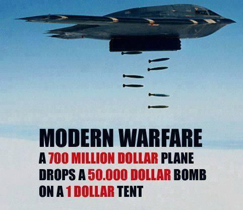

As a young man in Saudi Arabia, Osama bin laden studied economics and business administration at King Abdulaziz University and his understanding of economics became his main weapon. By motivating his enemies(Russia and USA) to increase military spending-consumption he caused them to sort of destroy themselves from within, making Paul Krugman bin Laden's best soldier.
He tells us his strategy:

>“We, alongside the mujahedeen, bled Russia for 10 years until it went bankrupt and was forced to withdraw in defeat,”
>“We are continuing this policy in bleeding America to the point of bankruptcy. Allah willing, and nothing is too great for Allah,”
>“All that we have to do is to send two mujahedeen to the furthest point east to raise a piece of cloth on which is written al Qaeda, in order to make generals race there to cause America to suffer human, economic and political losses without their achieving anything of note other than some benefits for their private corporations,”
>“Every dollar of al Qaeda defeated a million dollars, by the permission of Allah, besides the loss of a huge number of jobs,”
>“As for the economic deficit, it has reached record astronomical numbers estimated to total more than a trillion dollars.”
>“And it all shows that the real loser is you,”…“It is the [American people and their economy.”](https://www.cnn.com/2004/WORLD/meast/11/01/binladen.tape/)
 

Mankind is already fortunate to have made it this far without a nuclear war. For example, during the 1962 Cuban Missile Crisis, had it not been for Russian submarine commander Vasili Alexandrovich Arkhipov's sole dissenting vote in a decision to launch a nuclear strike against the USA, mankind might have already suffered a nuclear holocaust. The horrific mindset of top military and political leaders-apes is perfectly captured in Daniel Ellsberg's great book "The Doomsday Machine: Confessions of a Nuclear War Planner". In a discussion of Ellsberg's book, famed intellectual Noam Chomsky summarizes:

>"The things that I learned in the book were hair-raising. For example, I learned… that during the Eisenhower period and basically carried on, there was one war plan, and the war plan was that if there was a confrontation with the Russians in Berlin,whatever, maybe a small confrontation, then immediately we wipe out every city in China… There was no alternative plan, that was the plan… A war could be set off just by inadvertence. There is case after case…where we came extremely close to war just by inadvertence. Sometimes reckless actions on the part of leaders, but sometimes just accidents that happen…When the first early warning system was established to detect incoming missiles…It turns out this new sophisticated system…In the first day of operation it detected a Russian missile attack with 99.9% certainty…That kind of thing happens over and over and the war plans are setup so that if somebody acts on that 99% a billion people die…Page after page of the book contains graphic example of this kind of, you can only call it insanity" - [Chomsky](https://www.youtube.com/watch?v=foati7DWvzE)

Let that sink in. Over some tribalistic scuffle in Berlin, which ultimately came down to economic ideology-ignorance, the incineration of hundreds of millions of Chinese and a probable terrestrial life-ending environmental catastrophe. The upper echelons of the US military-leadership is packed with slightly smarter apes who see the world similarly and one can be certain that so are the corresponding Chinese-Russian-Israeli military apes. For example, during the Vietnam War, President Nixon mentioned to then Secretary of State Henry Kissinger that "I'd rather use the nuclear bomb" and "The only place where you and I disagree … is with regard to the bombing…You're so goddamned concerned about the civilians and I don't give a damn. I don't care." As technological progress continues to accelerate, it is just a matter of time before any disgruntled group can manufacture a device as damaging as a nuke, or cause enough havoc in a few major cities to cause devastating disruptions to global trade-production which can be just as damaging to the social order as if entire cities are wiped out. The world had plenty of so-called "experts" and scholars in 1914 and 1939 when the world wars got started. Nothing has changed!

The Israeli-Palestininan conflict, which is an outgrowth of a complex web of Jew-Gentile-religious misunderstandings and historical mishaps for which no group of people are to blame, is of vital importance because it radiates naive 'good vs. evil' thinking which has obviously polarized so much of the world. It is discouraging to see how even well educated people who have the best of intentions and have spent a lifetime looking at this conflict can end up vilifying each other. One of Israel's most popular scholarly defenders, Dr. Alan Dershowitz has written a book whose title is very revealing: “The Case Against Israel’s Enemies: Exposing Jimmy Carter and Others Who Stand in the Way of Peace”.  Even a well-intentioned nice old man like former US President Jimmy Carter finds himself on the wrong side of good vs. evil (from Dershowitz’s perspective) for having researched the history and circumstances which shape the Israeli-Palestinian conflict and arriving at conclusions which have been at times critical of the Israeli government. In an interview with Shalom TV, Dershowitz said the following about Jimmy Carter:

>“Jimmy Carter has literally become such an anti-Israel bigot that there is a kind of special place in hell reserved for somebody like that. He has no sympathy or understanding for the suffering of the Jewish people, the plight of the Jewish people, he loves every Muslim extremist he can find...If you're an Israeli, Carter doesn't like you and if you're an Arab or a Muslim, he likes you.” (Dershowitz)

When it comes to the Israeli-Palestinian conflict, getting pigeonholed into “good” or “evil” is very easy. As the title of Dershowitz’s book implies, Carter is not just a man who might disagree with the Israeli government and its policies, he is an enemy of Israel, something truly sinister. Ben Shapiro is another increasingly popular conservative Jewish voice who I believe is making great contributions when it comes to preaching free-market economics and criticizing  [the massive economic ignorance that plagues "the left"](https://www.youtube.com/watch?v=SIAyudtNicY), but perhaps understandably so since he is Jewish, he wrote a scary critique of Carter whose title says it all ["Jimmy Carter: Emissary of Evil"](https://townhall.com/columnists/benshapiro/2008/04/16/jimmy-carter-emissary-of-evil-n832387) and starts with "Jimmy Carter is an evil man. It is painful to label a past president of the United States as a force for darkness." What hope is there for average politicians and citizens who know even less about the conflict?

It should be easy to realize that all homo sapiens grow up absorbing a continuously evolving culture-language-"identity"-ideas-myths which then leads them to act in ways that lead to disorder via conflict-war, or order via peace and prosperity. As Mises tells us:

>"It is ideas that group men into fighting factions, that press the weapons into their hands, and that determine against whom and for whom the weapons shall be used. It is they alone, and not arms, that, in the last analysis, turn the scales."

When a lion takes over a pride and kills the cubs so that the females will once again be ready to mate, we don’t say that the lion is “evil”, we rightly understand the complex evolutionary factors leading to such actions. It is likewise important to look at our socioeconomic disasters using an evolutionary lens that is free of "blame" and full of sympathy and understanding. Hitler, Lenin, Stalin, Mao, Churchill, Roosevelt, Fauci, etc. were not "evil", which is a linguistic construct inherited from more religious times, they were fellow homo sapiens adored by their respective masses who absorbed horrendous ideas or myths propagated by scholars arising from the complexity of the economy as in the case of Socialism (Hitler-Lenin-Mao-Roosevelt-etc.), and the biochemical order as in the case of CovidMania and resulting coercive lockdowns and damaging vaccinations and more (Fauci). As Hayek tells us:

>"It is necessary to realize that the sources of many of the most harmful agents in this world are often not evil men but high-minded idealists, and that in particular the foundations of totalitarian barbarism have been laid by honourable and well-meaning scholars who never recognized the offspring they produced." (Hayek F. A., 1973, p. 70)

>"Most people are still unwilling to face the most alarming lesson of modern history: that the greatest crimes of our time have been committed by governments that had the enthusiastic support of millions of people who were guided by moral impulses. It is simply not true that Hitler or Mussolini, Lenin or Stalin, appealed only to the worst instincts of their people: they also appealed to some of the feelings which also dominate contemporary democracies." (Hayek F. A., 1976, p. 134)

The centuries of slavery, religious slaughters, persecution of minorities, and all man-made calamities were obviously the result, not of "evil" or "madness", but of the ideas and myths held by homo sapiens at the time and the mistaken alleged need to coerce each other, and as long as the public remains lost in erroneous mythology, democracy obviously does little good. Hayek:

>"Perhaps the fact that we have seen millions voting themselves into complete dependence on a tyrant has made our generation understand that to choose one's government is not necessarily to secure freedom."

It is obvious that we should focus on the ideas instead of vilifying people and assuming sinister motives or madness as the source of our problems, yet the fact that this goes largely unnoticed as we constantly segregate ourselves along political-tribal-identity lines is further evidence that we are potentially dangerous slightly smarter apes.

We need the wisdom of 'The Austrian School of Economics' in order to understand the root causes of the misunderstandings and complex factors which eventually cause fellow homo sapiens to hate each other.

The current and escalating Russia-Ukraine war is once again polarizing homo sapiens into the forces of "good":

(1)

and "darkness"-"evil":

(2)

Really???!!! What a mess! These slightly smarter apes are neither "evil" nor "mad" they are what inevitably emerges from economic ignorance.  
## Science and Medicine

##### Scientific mythology arising out of biochemical and socioeconomic complexity. How so many "experts" can be so wrong

In the following sections we hope to make it obvious to the reader that much of mainstream "science" is nearly as mythical, misguided, and intolerant as the famed Spanish Inquisitors were. It is understandable how this can seem somewhat shocking. Can so many well-intentioned and very smart people-scientists-"experts" be so blind to their errors and continue to act in a manner that is doing immense harm? Seems so improbable right? However, consider the following. Today organized religion like the Catholic Church employs thousands of priests-theologians who preach various ideas with various degrees of belief which are actually impossible to prove in a real tangible sense. We would assume that some priests really believe much of what the Church preaches, some might have some doubt to various degrees, and we can also expect some to be 100% charlatans who might be atheists and even pedophiles. Many of these people are very bright, highly educated, very well read in history and other subjects and speak many languages yet the incentive and ideological structure still persists and does both much good and bad. We also just discussed how out of the complexity of the socioeconomic order Socialist-Communist mythology arose leading to oppressive-competition-immune-'central planning' governments all over the world which were-are also populated by smart and caring people who believed the various economic fallacies to various degrees. Again, wherever there is complexity or doubt or lack of certainty (afterlife, complex social order, mind, biochemistry) there is bound to be mythology and resulting competitionless-monopoly-coercive-governments to coordinate the mythical ideas-plans-solutions making them much more difficult to change. Let us begin to prepare our minds for this rather difficult-to-swallow and dangerous idea by seeing just how utterly misguided "mainstream science" and the "experts" have been in the recent past.

In 1847 [Ignaz Semmelweis](https://en.wikipedia.org/wiki/Ignaz_Semmelweis) realized that by doctors just washing their hands, the mortality rate of mothers giving birth at the time could be reduced drastically (from about 16% to 1%). Regardless of his superb results, the medical establishment of the time, in other words, the "experts" and "great minds", fought and ridiculed his advise and he died a depressed man. [Alfred Wegener](https://en.wikipedia.org/wiki/Alfred_Wegener#Continental_drift_theory) was the originator of the theory of continental drift (later renamed-revised as 'plate tectonics') by hypothesizing in 1912 that the continents are slowly drifting around the Earth. His ideas were also rejected by the scientific establishment (the "experts") which even held a special symposium just to criticize them. In 1926 Johannes Fibiger was recognized by the "experts" of the day when he was given the Nobel Price in Medicine for the wonderful discovery that a particular worm was the cause of cancer. The "experts" and Johannes were embarrassingly wrong. In 1935 Portuguese neurologist Egas Moniz performed the first lobotomy (removing/slicing parts of brain) and would win the Nobel Prize in 1949. Paul A. Offit writes: 

>"The New York Times hailed Moniz as "a brave explorer of the human brain." Over the next three decades more than 40,000 lobotomies were performed across the globe, 20,000 in the United states alone. But lobotomies didn't cure anything. Rather they caused memory loss, seizures, and occasionally fatal uncontrollable bleeding. By the 1970s lobotomies were relegated to the dusty bin of discarded psychiatric therapies next to whips,chains [and snake pits."](https://www.amazon.com/Bad-Advice-Paul-A-Offit-MD-audiobook/dp/B07MXPDGYN/ref=sr_1_1?dchild=1&keywords=paul+offit+bad+advice&qid=1604277456&sr=8-1) (Offit, p. 4)

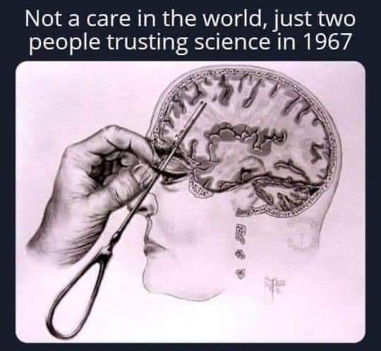 

Then there are the countless Communist ideologues-"scientists"-"experts" and today's mainstream Keynesian economists which we will revisit further below.

Bottom line. As Henry H. Bauer writes:

>"If the overwhelming consensus were always right, then combustion would still be regarded as a release of phlogiston, the splitting of atoms would still be regarded as impossible, and so on. Progress means discarding theories formerly held and defended by an overwhelming consensus."

So how can so many "experts" be so wrong? Few things are as important as our health and our fears of death. When it comes to health and religion there is a sort of tremendous selective pressure that ensures that both doctors and theologians carry themselves with additional certainty. A change in ideas here means the existing religion-doctors were wrong in vitally important things so it makes sense that these two bureaucracies evolve certain incentives which fight change even more. The great economist and historian Thomas Sowell twitted April in 2020:

>"People will forgive you for being wrong, but they will never forgive you for being right—especially if events prove you right while proving them wrong."

And a related quote by famed physicist  Max Plank:

>“A new scientific truth does not triumph by convincing its opponents and making them see the light, but rather because its opponents eventually die, and a new generation grows up that is familiar with it.”

Bottom line, there is an understandable 'echo chamber' of NEGLIGENCE that causes new ideas to spread slowly as the always proudful apes have to admit to being wrong and also losing their paychecks.
   

Since religion has historically been the state-government which is not only immune from competition but can also sustain its views via force-threats-inquisitions it becomes even easier to see how such ideas-bureaucracies are more immune to change. Why should we think that today's "scientists" are somehow immune from similar attitudes of the past and also not currently making monumental errors? A tiny amount of reason and humility is all that is needed to realize that in all likelihood there are many ideas which currently dominate "scientific consensus" which are bound to be wrong, and by simply looking at today's dissenters we are looking at potential Galileos. 

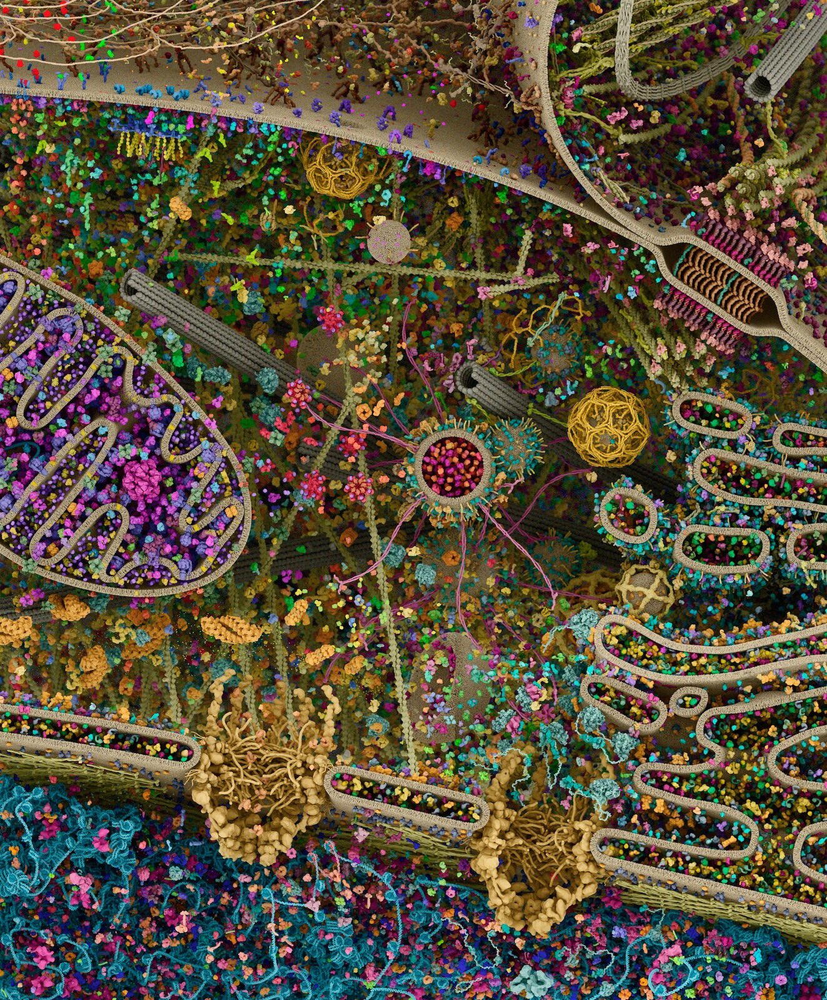 [Cell](https://twitter.com/Mahjabinno/status/1325224651476250624/photo/1)

The image above is the latest simulation (guess) that some NASA scientists have created of what a cell looks like. The tiniest dots you see are proteins which contain tens or hundreds of thousands of atoms each(protein TRP-cage has 127, Titin has 539,022) linked together in a very precise order leading to structures of very specific shapes which can go from useful to useless or dangerous if just one atom is off or if the resulting structure itself simply bends the wrong way because it collided with a 'free-radical' or a heavy-big mercury atom. Imagine a large auto-manufacturing plant that employs 2,000 men operating complex machinery and suddenly having a few laborers make a 45 degree turn or do the same with the complex robotics. You'd still have 2,000 men and robotics, but you'd have an unproductive chaos. Just doing this to one machine, or just one little part of one machine, will be enough to wreck the whole factory or assembly line for days-months-ever. Men-machines-things that are part of life don't just exist, they exist in a very specific or complex ORDER which is maintained by very precise INFORMATION and an existing and precise chain-reaction of events. Everything in the private sector is owned and thus controlled or coordinated by a mind that is interested in reordering it in the most useful-productive-profitable way possible. Something similar has evolved in the biochemical order. Also, imagine if to "study" the factory, first you had to immerse it in water thus killing all the workers and causing electrical malfunctions which stopped the plant leading to various chaotic scenarios. Whenever a "scientist" shows you some fancy "electron microscope" image of what the biochemical world supposedly looks like, you are seeing a dead cell that had to be interfered with or prepared in numerous ways making it nearly impossible for us to really predict how the living cell actually worked. Lester and Parker write:

>"The nature of these procedures is described by Dr Harold Hillman in his previously cited 2011 article entitled Cell Biology at the Beginning of the 21st Century is in Dire Straits, which bears repetition,
>>“When a tissue is prepared for histology, histochemistry, electron microscopy, or immunochemistry, an animal is killed; the tissue is excised; it is fixed or frozen; it is embedded; it is
sectioned; it is rehydrated; it is stained; it is mounted; it is radiated by light, or bombarded by
electron beams.”

>Although this refers to the study of animal tissue, the same, or very similar, procedures are employed
in the study of diseased tissue obtained from a human patient, but these procedures, as well as the
chemicals used as stains and fixatives, directly affect the tissue samples, which are clearly no longer
alive when observed. Furthermore, the laboratory apparatus and the laboratory itself are sterile
environments that bear no resemblance whatsoever to the natural environment of the tissue samples within
the human body, from which they have been removed. Unfortunately, as discussed in chapter three,
researchers are mostly oblivious of the extent to which their preparation procedures affect the samples
they study." (Lester, p. 670)

These are just some of the numerous complexities to keep in mind when trying to understand the mind-bogglingly complex biochemical order. There are many "carrier proteins" like the famous HDL and LDL whose job is to carefully-safely-orderly-purposely move stuff-cholesterol around. The proteins themselves are manufactured in large mega-molecules called ribosomes which read mRNA to determine the proper sequence of amino acids to stitch together to make the protein.

Consider the following example. In 2005, aided by a supercomputer that had 768 processors and ran on-task for 260 days, researchers came up with a computer simulation that guessed what a ribosome might look like and how it might work as it read some mRNA to create a protein.

>"The task wasn't simple. Researchers had to model the physical interactions of each of 2.64 million atoms--about 250,000 in the ribosome itself, but most involving water molecules inside and outside it. The simulation resulted in a movie that is 20 million frames long, he said....In reality, however, the ribosome behavior that they simulated takes only 2 nanoseconds, or 2 billionths of a second--too short to even be [labeled as "fleeting." "](https://www.cnet.com/news/lab-computer-simulates-ribosome-in-motion/#:~:text=The%20task%20wasn't%20simple,molecules%20inside%20and%20outside%20it.) (Shankland)

Let that sink in... With our fanciest computers, electron microscopes, and other impressive sounding technologies, as late as 2005 the best we could do is somewhat guess, for just 2 nanoseconds, what one ribosome might look like-function. It took another 4 years, till 2009, for the Nobel Prize in Chemistry to be given to Venkatraman Ramakrishnan, Thomas A. Steitz and Ada E. Yonath, "for studies of the structure and function of the ribosome". How did they achieve this? How did they gather the evidence for their amazing breakthroughs and future simulations? The Noble Prize website summarizes:

>"The story of the 2009 Nobel Prize in Chemistry begins in hot springs and in the Dead Sea. Ada Yonath used micro-organisms from these extreme environments to isolate robust ribosomes. Her goal was to make the ribosomes crystallize, like salt in a solution crystallizes when the water evaporates. After many years of trial and error, Ada Yonath managed to generate well organized crystals with millions of ribosomes assembled into regular patterns."

>Ada Yonath sent X-rays through ribosome crystals. When the rays hit the crystal’s atoms they are scattered, making millions of dots on a CCD detector. This method is called X-ray crystallography. By analysing the pattern of the dots, researchers can determine the positions of the hundreds of thousands of atoms in the ribosome. However, scientists also needed to know the “phase angle” for each and every dot. This mathematical information is related to the location of the atoms in the crystal. In 1998, Thomas Steitz managed to solve the phase problem and the first crystal structure of the ribosome’s large subunit was published." (Yonath)

So…Dead crystallized ribosomes, bombarded by X-rays, leaving a shadow, followed by numerous mathematical equations and other layers upon layers of assumptions-hypotheses (guesses), dealing with immense complexity, just to come up with a good enough guess to impress fellow apes of the scientific community and get the Prize. Our ability to biochemically identify one of these proteins-molecules-structures and alter it in a useful-predictable manner that also does not negatively affect other proteins-molecules-processes is currently INEXISTENT. The simple truth is that how the biochemical world functions is still far far far far far too complex for the slightly smarter apes to have the technology-means to interact with in ways that when one properly accounts for all the potential side-effects of our numerous drugs and vaccines clearly proves to be an improvement in the long run for many things we are currently doing. We see this all the time as old drugs-treatments, which were hyped as revolutionary at the time when the scientific community was focused on the drug's positive effects as they relate to the condition they want to improve, are found to do more harm than good once the complex side-effects are better understood and eventually traced to the drug-intervention. The seemingly positive effects are easy to see when that is what they are focused on and there is tremendous financial incentive for good news, the negative effects are much, much harder to see and there is no money to be made in doing so for the most part, especially if convoluted government regulations make companies immune from or more difficult to sue when things go wrong.

As our ability to understand biochemistry increased, we kept focusing on how particular compounds-medicines could affect the proximate symptoms of various diseases. Successes there and continued technological breakthroughs regarding our ability to understand such complex biochemistry just led to drugs-poisons which got a little better at treating the symptoms. I mentioned 'poisons' because that is exactly what drugs are, they are poisons which at certain doses superficially improve or block some symptoms we focus on, but given the mindbogglingly complex biochemistry of the human body, they inevitably cause imbalances-chaos in other areas which go largely unnoticed. Eat all the meat you want and your body will properly make the most of it because that is what our biochemistry has been ideally evolved to process, swallow the bottle of pills and the reality that they are poisons will quickly manifest itself. Consider the following, the US General Accounting Office published a study which found that "…of the 198 drugs approved by the FDA between 1976 and 1985… 102 (or 51.1%) had serious post-approval risks" (risks=heart-kidney-liver failure, birth defects-etc.) We have reached the point where the medical system itself via errors and side-effects of drugs and many other factors is estimated to be the 3rd leading [cause of death.](https://www.hopkinsmedicine.org/news/media/releases/study_suggests_medical_errors_now_third_leading_cause_of_death_in_the_us) This should not be seen as an attack on the pharmaceutical industry, we just want to appreciate the immense complexity and still relative backwardness of our ability to properly understand and much less interfere with the biochemical world. Remember, it wasn't until 2009 that we even got a good enough guess of what a ribosome looks like, so it should be unsurprising that the better we understand the biochemical world, the better we realize that we had been doing much harm. Of special importance and toxicity are chemotherapy drugs. The theory behind chemotherapy drugs is that they are immensely toxic but hopefully more so to the cancerous cells we want to kill, than to our non-cancerous cells which we can hopefully replenish. None of the drugs we use "cure" anything, they just alleviate or delay certain symptoms whose root causes are usually related to nutrition and-or environmental toxins, etc. 

If a cure-improvement-information involves not doing anything or there is less money to be made in it, less money exists to advertise it and spread such information. But if the remedy-information does involve big profits, then there is money-wealth to motivate the spread of this idea, so the "invasive" remedy-information is sort of "naturally selected". And, once gain, if the money-wealth comes from a competitionless-monopolistic government institution then the potential fallacies are even harder to change. So the 'incentive structure' that evolves is one that fools the slightly smarter apes into long-term and hard-to-notice and change disasters. The politicians and masses only see the alleged benefits of a government-coercive-competitionless intervention into the socioeconomic order-economy-'complex phenomena', while being unaware of the fact that usually the cost will be greater than the perceived benefit. Something similar happens here. This has little to do with some "conspiracy" by the doctors or pharmaceutical industry to keep people away from superior ideas(although this certainly happens and is also a factor to various degrees), this is just the way things have inadvertently evolved to various degrees and is also "indeed the result of human action, but not the execution of any human design". Again, we must always be focused on the root cause of our problems. It is the economic ignorance of the masses-experts which calls for the creation of the paralyzing-competitionless-inefficient bureaucracies which get more incompetent-malicious-neglective with time, which then leads to some truly corrupt-incompetent-negligent-clueless apes-Lysenkos-Faucis. This is a monumentally important fact!!!! Again!!! Just like in the Catholic Church one can find pedophile priests who don't believe in God or at least many of the 'myths' the Church preaches, especially today when we have so much science-genetics-etc. to at least cause doubt in some of the myths, it would be a monumental mistake to point to those examples and then label organized religion as some "conspiracy" of liars. If the incentive and ideological structure that maintains organized religion and its much-easier-to-criticize potential myths can still be so prevalent, we should expect the same pattern repeating itself in areas involving far more difficult to understand complexity (biochemical order-medicine, "theoretical" physics, the brain-psychiatry, 'climate change', history, economy, etc.) 

We should stress that in each of these complex fields like religion, nutrition, disease, economics, history, we get mythological structures which should NOT be confused with purposeful-coordinated "conspiracies". When one looks at the leading voices in the low-carb-keto(and more recently carnivore) community, essentially people who have major disagreements with mainstream science when it comes to nutrition and diseases in this example, people like 1) [Dr. Timothy Noakes, who had to defend his low-carb views against the existing medical bureaucracy in a manner akin to Galileo defending himself vs. the Church](https://www.youtube.com/watch?v=9OT_S6fDxR0&list=PLPda1Yn6bpO6DG_b5_wAVXf100niaaJDX), 2) Dr. Jason Fung whose books "The Obesity Code" and "The Diabetes Code" have dominated Amazon.com bestsellers lists for years and are helping thousands lose weight and easily reverse type 2 diabetes by simply fasting and thus cutting out sugar and carbohydrates and other potential troublemakers..... and many many other doctors, they once believed the "mythology" that diseases like diabetes, heart disease, cancer, obesity and many others were primarily due to genetics, eating too much, perhaps not enough exercise, etc. (other causes except for diet). They were not part of some "conspiracy" or maliciously-negligently avoiding superior information. They simply believed the current myths and were parts of the 'echo chamber' that sustains them.  Dr. Noakes mentions how he was one of the respectable doctors who without much thought dismissed people like the famed low-carb proponent Dr. Atkins as some contrarian-scammer, yet when other doctors he greatly respected defended Dr. Atkins he finally decided to read Atkins' classic book "Dr. Atkin's New Diet Revolution". Dr. Noakes mentions:

>"You must understand for 33 years I've been saying that you must eat a high carbohydrate diet and Atkins was the devil, I mean literally, that's what we thought of him....I went down to the bookshop, bought the book, brought it back and two hours later I was stunned, and I realized that I'd been wrong and that I'd been wrong for 33 years...During this period I've gone through a lot of trauma...I "came out" and said I am now a low-carbs-no-grain person and immediately lost all my funding, my research funding. The medical research council took [their money away from me"](https://www.youtube.com/watch?v=8rtZJF-xfyo)

Like that rare priest who might suddenly understand evolution and genetics and perhaps admit to losing faith and feel as though he had been espousing erroneous views-advice Noakes made a similar change. It is important to note that Noakes was part of the existing 'echo chamber' that would vilify-dismiss Dr. Atkins, and that once he changed his views, he would also become an outcast to the existing bureaucracy-Church. When Dr. Noakes was ignoring-vilifying Atkins, was he a "bad guy" who was part of some "conspiracy"?, Of course not. There ARE charlatans and people who are willfully negligent to various degrees if it helps them make money, and this is obviously the case in every field, ESPECIALLY WITHIN THE PHARMACEUTICAL INDUSTRY and competitionless governments!. Nearly the entire field of Bariatric surgery where people's stomachs are surgically shrunk can be seen as mostly negligence by doctors-priests since most people can easily be trained-taught how to simply fast as Dr. Fung's books have done for many. Yet such relatively barbaric, dangerous, and expensive practice continues. I doubt the doctors who perform such surgeries are giving away copies of Fung's books. Back to Noakes. 

Noakes might have equated Atkins with one of those medical charlatans. The popular and somewhat nebulous term 'Cognitive Dissonance' is at play here and plays an important role in the creation of the 'echo chambers' that unites groups. People just have various understandable reasons which have little to do with pure malice or fraud for neglecting or holding contradictory ideas. Sometimes we neglect ideas because we already think we are doing things based on the best available information. Who has the time to properly consider every possible criticism? And then of course there is a bias that motivates us to overlook-ignore ideas that can greatly invalidate our views, sense of purpose, harm our finances, and when these factors are sort of layered on top of others the resulting ideological differences can lead to dangerous extremes-fallacies-excommunications-burnings. This might lead many mainstream scientists (like Noakes had done) to mistakenly attack or neglect revolutionary scientists (Atkins) on the one hand, and it could also lead to having people or revolutionary scientists label mainstream science as some "conspiracy" that purposely fights change, when that too would be a mischaracterization. And hopefully one gets the point.

Just like we can expect more "charlatans" or non-believing priests in organized religion as the reasons to doubt become more and more numerous or obvious, so can we expect more medical professionals or scientists who purposely look the other way when superior ideas which go against entrenched dogmas become more noticeable. Those who are more intellectually rigorous and thus more willing to think independently instead of just uncritically accepting emerging trends and also willing to change their minds will do so sooner, and the more fraudulent and-or dangerously negligent or just intellectually lazier will do so slower, and much more so when they work in competition-immune governments and their regulatory bureaucracies like the CDC, FDA, NIAID. 

The fact that simply aggressive fasting and eating a low-carbohydrate diet for just a few weeks can essentially reverse-control type-2 diabetes for many, yet the mainstream medical establishment remains somewhat oblivious to this fact, is just further evidence of how ideological and incentive structures, especially when they are entrenched-sustained via government monopolies like the American Medical Association which essentially controls what is taught to doctors, are difficult and slow to change. Again, how many theologians are actively knocking on the doors of Biology departments? Why did it take 70+ years for Communism to be generally seen as a failure(and still exists in Cuba!)? Again, this should be obvious, the emergence of superior ideas means that all the "experts" of the past were wrong.

Once one understands how competition is what discovers superior information all one has to do is look where competition and its required freedom exists to see where the real 'state of the art' information resides. It is in Amazon.com, its bestsellers lists of competing books-ideas-'well-written reviews', and in youtube-internet where various scientists-intellectuals are debating and thus competing intellectually where one sees the emergence and spread of superior information. It is thus not surprising that the low-carb-keto-carnivore authors and personalities like Dr. Jason Fung dominate Amazon.com bestsellers lists, while mainstream "scientists"-theologians remain in their 'echo chambers' in the government-regulated bureaucracies-Church and related mythology of attempting to treat everything with a pill-vaccine-operation-intervention and increasingly 'technologically advanced treatments' which only addresses the eventual breakdowns in complex-biochemistry which are mostly the result of improper diets and environmental toxins. 

The story of Dr. Ancel Keys helps us further understand how out of the immense complexity of the biochemical order that creates the human body, coupled with human nature and perverse incentives, disastrous ideas can mislead the entire scientific community. In the 1950s Dr. Ancel Keys had a pet theory that saturated fats, which are the fat abundantly found in animals, were the major culprit in heart disease and that we would be better off eating the polyunsaturated fats of vegetable oils. A Canadian Broadcasting Corporation documentary summarizes:

>"But the theory needed proof. In one experiment Keys and colleagues studied thousands of patients at mental hospitals in Minnesota feeding one group a diet high in corn oil and another group got saturated fat. It was the largest clinical trial in history to test Ancel Keys' diet heart hypothesis but after years of research they didn't publish what they found....Why did they sit on the data? Because nothing happened. The results showed no health benefit from the high corn oil diet, it completely contradicted Ancel Keys' theory. Years passed, people kept on eating corn oil, but the whole story of the Minnesota coronary experiment has never been told until today now that a new team of scientists has recovered the data, re-evaluated it and discovered there was even evidence of harm from the [high corn oil diet."](https://www.youtube.com/watch?v=UO86iiTkPfo)

Best-selling author-physicist Gary Taubes had discussed why the results had been hidden-ignored with Keys' colleague Ivan Frantz and mentions:

>"He said that they were disappointed in the way the study had come out. And the implication was that... "they" was primarily Ancel Keys" 

"Scientists"-people (slightly smarter apes) looking for glory and overlooking information that contradicts their life's work or affects their finances is very much a part of human nature. Consider the following, [one study](https://www.ncbi.nlm.nih.gov/pmc/articles/PMC2685008/) of scientific misconduct estimates that about 2% *"of scientists admitted to have fabricated, falsified or modified data or results at least once –a serious form of misconduct by any standard– and up to 33.7% admitted other questionable research practices...Considering that these surveys ask sensitive questions and have other limitations, it appears likely that this is a conservative estimate of the true prevalence of scientific misconduct."* (Fanelli) There are about 1 million doctors in the USA and 7 million scientists and engineers for a total of 8 million. 2% is a whopping 160,000 scientists-docs who are out there maliciously or extremely negligently looking to exaggerate, lie, etc. to get government grants-influence-fame and so on, and another 2.7 million (33.7% of 8 million) who are aware of blatant corruption. So year after year 160,000 potential charlatans and-or exaggerators (see wikipedia ["List of scientific misconduct incidents"](https://en.wikipedia.org/wiki/List_of_scientific_misconduct_incidents)) are out there recognizing and affiliating with other fraudsters to various degrees, statistically guaranteeing that eventually somebody is going to hit it big and potentially mislead a large portion of the scientific community as in all likelihood happened with Ancel Keys. 

Just one example of someone who got caught is [Yoshitaka Fujii (Japan)](https://en.wikipedia.org/wiki/Yoshitaka_Fujii), an anesthesiologist, who "was found to have fabricated data in at least 183 scientific papers, setting what is believed to be a record for the number of papers by a single author requiring retractions. A committee reviewing 212 papers published by Fujii over a span of 20 years found that 126 were entirely fabricated, with no scientific work done. Only 3 were found to be valid. He was also found to have forged the signatures of scientists he listed as co-authors without their knowledge". Diederik Stapel, professor of Social Psychology at Tilburg University and the University of Groningen, after getting busted wrote about his numerous data forgeries:

>"In the privacy of my office or my study at home, I did some things that were terrible, maybe even disgusting. I faked research data and invented studies that had never happened. I worked alone, knowing exactly what I was doing, and my solitary drive to achieve led to my becoming ever more detached from myself and my emotions. I didn’t feel anything: no disgust, no shame, [no regrets."](https://scienceintegritydigest.com/2019/07/16/fabrication-the-diederik-stapel-case/) (Bik)

Consider the story of Frances Oldham Kelsey, she was an FDA reviewer who in 1960 refused to authorize thalidomide given what she considered was lack of evidence of safety. Her wikipedia summarizes:

>"Even though it had already been approved in Canada and more than 20 European and African countries,she withheld approval for the drug and requested further studies. Despite pressure from thalidomide's manufacturer, Kelsey persisted in requesting additional information to explain an English study that documented peripheral neuritis, a nervous system side effect. She also requested data showing the drug was not harmful to the fetus.

>Kelsey's insistence that the drug should be fully tested prior to approval was vindicated when the births of deformed infants in Europe were linked to thalidomide ingestion by their mothers during pregnancy. Researchers discovered that the thalidomide crossed the placental barrier and caused serious birth defects. She was hailed on the front page of The Washington Post as a heroine for averting a similar tragedy in the U.S."

What if instead of her, one of the fraudulent/negligent scientists had been in her position? What if in today's American CDC or FDA or National Institute of Allergy and Infectious Diseases or in the World Health Organization we have such potential bad-negligent apples-Lysenkos? 

It is now widely discussed how the scientific community has a “replication crisis” because around half of published research is so plagued with errors that only about half can be reproduced. Kelsey Piper summarizes:

">[One 2015 attempt](https://science.sciencemag.org/content/349/6251/aac4716) to reproduce 100 psychology studies was able to replicate only 39 of them. [A big international](https://osf.io/ux3eh/) effort in 2018 to reproduce prominent studies found that 14 of the 28 replicated, and an [attempt to replicate studies from top journals Nature and Science](https://www.nature.com/articles/s41562-018-0399-z.epdf?sharing_token=uY-7XXSwrYqjnTaF4k_LwdRgN0jAjWel9jnR3ZoTv0ODPoD_DniKOJV85YbvYREV4WYg3rUMkw4Dn3xQpiS36ewTQMztGsmzwDVhiD6qsOTincMm_6MNx3iVweaC-Br4IKcK_J1FMyo7gekrMG0IwJjMkUbPoOOsXV_plU0uyaUh7wihjHJ-UQu1bguEiZfqnqN7NTFPQt3C_0QoV-oKp432nRQ5ffc2UA5BY90g4iK0ZBBYY3dUcr_5QiA4dJ4hgldAHBXR-Z59rVmKtU6W1S9mmQWSK2UkVcSsp-mF6XUa0m236lCGYzIleP_2BSiM77pjx_WrxRWf5SrVCGJ5L535khtcNZ8XtAIl7bwr98I%3D&tracking_referrer=www.theatlantic.com) found that 13 of the 21 results looked at could be [reproduced."](https://www.vox.com/future-perfect/21504366/science-replication-crisis-peer-review-statistics)

It makes perfect sense that a field like psychology which has to deal with the complexity of the mind and human behaviour, is plagued by hypothetical bullshit.

We really want to understand how these patterns arise-repeat in all complex fields. We re-focus on economics.

The world of mainstream economics is similarly fooled by its misguided use of mathematical models. Math is good for physics-chemistry and relatively simple things. Per above, with enough computing power you can sorta guess how one ribosome might work for a few nanoseconds, but how 100 billion neurons in a human brain lead to actions based on prices and a global division of labor that has evolved over millennia and coordinates the actions of 8 billion people, is way too complex for math to be of significant value when it comes to analyzing the fundamentals. Since money, law, religions, governments, 'the market process' and resulting 'Social Organism' is the product of 'Natural Selection', they need to be studied more like biology than physics. As Menger explains:

>"Now if social phenomena and natural organisms exhibit analogies with respect to their nature, their origin, and their function, it is at once clear that this fact cannot remain without influence on the method of research in the field of the social sciences in general and economics in particular....Now if state, society, economy, etc., are conceived of as organisms, or as structures analogous to them, the notion of following directions of research in the realm of social phenomena similar to those followed in the realm of organic nature readily suggests itself." (Menger, 1996, p. 131)

But the slightly smarter apes just love their impressive looking useless mathematicobabble, and the sheer arrogance and sense of superiority that comes from being able to understand it helps evolve the 'Priesthood of Scientism'. Menger, peace be upon him, again:

>"I do not belong to the believers in the mathematical method as a way to deal with our science. I am of the opinion that mathematics is mainly a way to give an example or demonstration, but not to do the research itself...Mathematics is not a method for...economic research" [(Ebeling, 2012)](https://www.aier.org/article/carl-menger-and-the-sesquicentennial-founding-of-the-austrian-school/)

Mises sets those apes straight(re-quoted):

>"As a method of economic analysis econometrics is a childish play with figures that does not contribute anything to the elucidation of the problems of economic reality."

>"The Econometricians have not the slightest notion of the issues involved."

The distinction between micro and macro economics is another "delusion" or myth the apes have created because they don't understand how the economy or socioeconomic order, just like the biological one, must be understood as one intertwined, indivisible, and coevolved system. Hayek perfectly describes the evolving 'Priesthood of Scientism' and their math-based "magic" as he criticizes the:

>"...delusion that macro-economics is both viable and useful (a delusion encouraged by its extensive use of mathematics, which must always impress politicians lacking any mathematical education, and which is really the nearest thing to the practice of magic that occurs among professional economists)" (Hayek, 1989, p. 98)

And in a more general sense, the great scientist Nikola Tesla:

>"Today’s scientists have substituted mathematics for experiments, and they wander off through equation after equation, and eventually build a structure which has no relation to reality."

Understandably so, the world of economics too has its mixture of relatively clueless economists and also some charlatans so the same applies. Here too, the naive thinkers portray central banks and the economists-priests that mismanage our economies as a "conspiracy" by "elites" which is greatly mistaken. For example, former Federal Reserve economist Danielle DiMartino Booth describes in her book “Fed Up: An Insider’s Take on Why the Federal Reserve is Bad for America”, how utterly clueless, incompetent, politicized, and disastrous the Federal Reserve and our mainstream economics establishment are. The important point here is that Danielle was herself a product of our mainstream economics establishment. She studied in our "great universities" and one could say she grew up with "faith" in the mathematical models-courses-theories(mythologies) she studied in college, but eventually realized that much of what she had learned was wrong similarly to how perhaps some religious priest comes to abandon some previously held beliefs-myths. In the introduction she writes:

>“I witnessed the tunnel vision and arrogance of Fed academics who can’t understand that their theoretical models bear little resemblance to real life…Every American must understand this extraordinary powerful institution and how it affects his or [her everyday life”](https://www.amazon.com/Fed-Up-Insiders-Federal-Reserve/dp/0735211655) (Booth, 2017, p. 10)

Had Danielle been familiar with Mises, Hayek, Hazlitt, Rothbard and other members of the so-called ‘Austrian School’ of economics, she would've had a superior understanding of economics and the inevitable disaster that the Federal Reserve is, but then her life would have been different and she would not have reached such heights at the FED. That would have been akin to having an evolutionary biologist try to move up the ranks of the Catholic Church. Her great insider-tell-all book is not the first of its kind to expose the dangerous disaster that the Federal Reserve and our mainstream economics establishment is. For example, William E. Simon, former Secretary of the Treasury for presidents Richard Nixon and Gerald Ford, fills us in on the incompetence of the nation’s “most prominent economists” during the financial crisis of the 70s. His statements apply just as well to recent (and future) economic troubles and government “experts”:

>“The Wall Street Journal interviewed several dozen of the most prominent economists in the United States on the causes of the recession and on ways to prevent a recurrence. They disagreed about virtually everything save this: that there was much economists did not yet understand. The details of the economists’ ignorance are of interest, but I stress here the overriding conclusion to be drawn from their statements: The economists who had been advising our Presidents simply had not known what they were doing…Gerson Green, formerly of the Office of Economic Opportunity, summed up the attitude of many of his colleagues when he observed caustically, “The change I discern is that none of us knows what to do. In those days, we thought we did. The country has taught the social engineers a lesson.”… So who was running the store? The answer is: nobody. Not one human being in the whole vast realm of political control over the American economy has ever known what he was doing. Nobody could know. This is the precise phenomenon described by F.A. Hayek in his Noble lecture called “The Pretense of Knowledge.” For forty years the American ship of state has been lunging erratically toward economic disaster, with no awareness of its direction…” (Simon, 1978, p. 121–123)

A final and perhaps best example showing how our mainstream economics establishment-FED is essentially based on mythology and not on "conspiracy" is the fact that one of today's best 'Austrian Economists', Robert Wenzel, editor & publisher of [EconomicPolicyJournal.com](http://EconomicPolicyJournal.com) was invited to give a [talk at the New York FED](https://mises.org/library/new-york-fed-leave-building). If the FED had been run by some secret cabal, the last thing they would have done is invite Mr. Wenzel who told them early in his speech:

>"to do what I believe should be done, which is to close down the entire Federal Reserve System."

Reflecting on being invited to give the speech and his experience talking to FED officials Wenzel wrote:

>"Overall, I was simply amazed at the lack of knowledge of these economists about the Austrian School. It was very close to nonexistent....My experience at the Fed points out the importance of intellectual debate and study. Clearly, the economists whom I met at the Fed were brought up in an intellectual tunnel, where they had no exposure to Austrian economic theory. They read and study within a limited range of writers. But they were very curious about my view."

The so-called military-industrial-complex is the same way where you have plenty of "good vs. evil" thinkers who genuinely believe we need to protect ourselves against the evildoers and that the world has and will always be about who can display more power, there are also plenty of armaments industry CEOs-salesman just looking to purposely exaggerate or even create threats to make a buck.  

So to briefly summarize, wherever there is complexity-doubt (nutrition-medicine-afterlife-economy-environment-climate-history-mind( psychiatry's popular 'chemical imbalance' myth which of course needs to be treated by mythical poisons-drugs is also myth-bullshit)), there is *mythology*. The economically clueless masses and politicians always believe that a coercive-competitionless-monopoly of "experts" in the government should manage-oversee-regulate related research and action since they have no clue how freedom and competition are best suited for all knowledge. And of course we also have that petri-dish of deliberately fraudulent scientists-doctors-engineers-politicians, and how can one forget, the 'foreign policy experts' that are constantly reminding us of all the evildoers trying to kill us.....all inadvertently-negligently-maliciously creating hypothetically dangerous scenarios, which then create a sort of ideological chain-reaction where government wealth and coercion spreads certain ideas which become more difficult to correct. Natural selection created a sort of algorithm to discover information, create superior social order, and also very importantly! prevent the growth of falsehoods and incentive structures which lead to hard-to-change-paralyzing-dangerous-mythological-tyrannical orders-bureaucracies. Freedom of course, which is "the ultimate algorithm". We just need to understand it, that's all. The average citizen has no need to become an expert in nutrition, or economics, or history, or psychology, or whatever, what he needs to become an expert in, which fortunately is not hard at all, is ensuring that there is maximum freedom and thus 'competitive knowledge discovery' everywhere. It does not look like we will be able to change the fact that we are simply slightly smarter apes, which I think is kind of cool anyways, however, we can easily go from "wild" to "civilized" slightly smarter apes by understanding how private property and emerging freedom and 'competitive knowledge discovery' is what leads to civilization. By focusing on economic education we really strike at the root of the ignorance and errors from which all other problems arise. 

When people who criticize mainstream bureaucracies like the medical-religious-economic-etc. on potential differences of opinion regarding diet, vaccines, handling of Covid, religious interpretation, economic policy and numerous other potential areas, it is a gigantic error to label such bureaucracies and whatever errors they might propagate as some sinister conspiracy. Unfortunately this error happens all the time among naive thinkers who erroneously think everything is the result of some plotters-conspirators when they are the result of more complex evolutionary factors-incentives and are to a significant degree "the result of human action, but not the execution of any human design". These are the "conspiracy theorists" who then sort of mess it up for the rest of the critics of such bureaucracies. These "conspiracy theorists" sooner or later always end up in the same misguided conclusions, blaming "Jews", the Rockefellers, the Illuminati, etc. which then makes it easy and understandable for the misguided-malicious-negligent bureaucrats-experts to dismiss all criticism. However, just like we don't want to make the errors that the "conspiracy theorists" fall for, we also don't want to be ignorant of how human nature coupled with complexity-mythology, competition-less government monopolies and financial incentives create an 'incentive structure' and sort of "echo chamber" which fights change, selects for ass-kissing, negligence, etc. thus virtually guaranteeing that often times as you get to the upper layers of bureaucracies you have some real charlatans, truly malicious characters, and the dangerously misinformed and negligent. When truly malicious people are identified in such bureaucracies, then the "conspiracy theorists" will use that as evidence of some "grand conspiracy" which never really existed which helps the pattern repeat... Anyway, you get the point... We just want a nuanced understanding of all factors. And most importantly, to understand how freedom and resulting competitive knowledge discovery, not "science" or whatever that means, is the key to both discovering superior information and preventing bad ideas from persisting thanks to massive government regulatory-monopoly-coercive bureaucracies.

##### Human Evolution and Nutrition.

A brief look at human evolution and nutrition is not only important for improving our health-fitness-happiness but also helps us solidify our complete evolutionary understanding of the world, and building on the above, we continue to see how the mainstream scientific community or Priesthood can be so wrong.

About 6.5 million years ago we shared a common ancestor with Chimpanzees and Bonobos and were herbivorous tree-dwellers where it was relatively safer, but eventually certain environmental pressures forced us to come down from the trees and become the ultimate carnivorous predators. Unlike herbivores which need more laborious-complex digestive systems to extract-create the necessary fats-proteins-calories from plants, carnivores move up in the food-chain by eating and easily absorbing such nutrients from the bodies of other animals that have already "done the work". What could possibly have the perfect combination of nutrients needed to build a human brain, kidney, liver, muscles, etc. than the brain, kidney, liver of a biologically similar mammal-animal(or human (cannibalism seems to have been popular in our past)). Our guts changed in important ways from those of our closely related primates. The small intestine which absorbs nutrients grew while the large intestines where bacteria helped break down, ferment, and extract-create nutrients from plants shrank. Bacteria that have evolved to feed or decompose plants are mal-adapted to doing the same on animals, this allows herbivores to have slightly acidic stomachs(pH around 4.0), but if you are a carnivore (pH 2-3) bacteria that have evolved the necessary biochemistry to decompose or feed on fellow animal cells can harm you thus the need for a more acidic (lower pH) stomach. Scavenging and eating rotting animals with large quantities of such bacteria requires even more acidic stomachs which is precisely what humans have (pH 1.1 - 1.5). Dr. Saladino writes:

>"2.5 million years ago, with the advent of stone tools and hunting, our ancestors' brains began to grow even more rapidly. In fact they doubled in size over the next 1 million years. Based on the fossil record, it appears we reached a maximum brain size of 1600cc about 40,000 years ago, and that our brains have shrunk slightly since...a significant change in the rate of growth of our ancestors' brains coincided with stone tools and hunting..." (Saladino, p. 5)

>"In order to determine the proportion of animal foods in the diets of our predecessors, we can examine the amount of δ15 nitrogen in their fossilized bones. By looking at levels of this isotope, researchers are able to infer where in the food chain animals reside by identifying their protein sources. Herbivores generally have δ15N levels of 3–7 percent, carnivores show levels of 6–12 percent, and omnivores display levels between these two. When samples from Neanderthal and early modern humans were analyzed, they demonstrated levels of 12 percent and 13.5 percent, respectively, even higher than that of other known carnivorous animals like hyena and wolves."(Saladino, p. 7)

The downward trend in brain size to about 1,400cc at present coincided with the extinction of megafauna and especially the rise of agriculture as previously discussed. Today we get about 70% of our calories from plants, we consume large quantities of highly refined carbohydrates like breads and pastas which cause unnatural and frequent spikes in blood-sugar-glucose and also lack the numerous vitamins and minerals in bioavailable forms that our bodies can actually use. The gasoline that powers our cars has carbon, so does broccoli, yet nobody pumps broccoli into their gas tank. Similarly, just because plants have various vitamins and minerals we need, it does not mean that our bodies will be able to properly absorb them. For example, the phytic acid in seeds "chelates[binds with] with minerals and metals, such as calcium, magnesium, zinc, and iron, forming insoluble salts that are not readily absorbed by animals or humans. In particular, it can severely impair availability of zinc and iron. Phytate can also complex with proteins and may thereby reduce digestibility or enzyme [activity."](https://www.sciencedirect.com/topics/neuroscience/phytic-acid). Not only do we lack the necessary digestive machinery to get the same nutrition from plants that we have evolved to easily get from animals, we also lack defenses against the numerous toxins plants have evolved to defend themselves against predators-herbivores-insects. Plants that did not evolve chemical defenses would have been naturally selected out of existence millions of years ago, thus all plants that exist today do so because they contain such defenses to various degrees. Lectins (damage the gut), glycoalkaloids (neurotoxins), oxalates (create crystals which damage host in numerous ways), phytic acid binds to nutrients and prevents their absorption and [there are many more.](https://www.youtube.com/watch?v=GgnnklDVhso) The image below summarizes various types of toxins.

The glycemic index is a measure of how quickly glucose levels in the blood rise after eating certain foods. Pre-agricultural man, with considerable risk, might find carbohydrate-rich honey from time to time which has an index score of 58, but he would never find, and much less eat several times per day throughout the year, something like a French baguette that has a score of 99, sugary drinks like Coke(63), Gatorade(78),spaghetti(58), white rice(89), Cornflakes(93), and the plethora of processed, grain-based foods that make up most of our calories today. The average American consumes over 150 pounds of sugar per year, high-fructose corn syrup, and many other things [like recently-invented-unnatural vegetable-seed oils](https://www.youtube.com/watch?v=k_XDMdltRlY) which contain [high amounts of polyunsaturated fats whose chemical structure](https://www.youtube.com/watch?v=rQmqVVmMB3k) our bodies(mitochondria) have simply not evolved to deal with in the abnormally high quantities being consumed, which when taken together creates a sort of biochemical chaos that eventually manifests itself in our various diseases and easily explains why humans have become the only obese and metabolically dysfunctional animal that is plagued by 'diseases of civilization' like diabetes, heart disease, cancer, dental caries, etc. Animals in the wild who eat their 'species appropriate' diet are rarely ever seen with these diseases and so were human beings prior to the emergence of our modern diets based on these man-made foods instead of the mostly animal-based diets that natural selection has crafted our biology to ideally use.

The bottom line is that like a car that runs with contaminated-improper gasoline and performs sub-optimally, or without coolant and the heat eventually causes some early breakdown somewhere, improper nutrition is likewise the main source of our diseases and relative obesity. The complex biochemical order that took natural selection billions of years to ideally craft, is breaking down prematurely in countless ways due to bad raw materials-diet and environmental toxins. 

Mankind is beginning to catch up to men like dentist Weston Price and anthropologist Vilhjalmur Stefansson who in the early 20th century wrote about how cultures that had not adopted the "civilized" Western world's agriculture-grain-based-sugary-seed-oils-processed diets were relatively healthier. To examine the result of highly complex systems like the economy, you do not have to get lost in little details and hypotheticals, just like the night-time pictures of North-South Korea and a few simple comparisons show which order is superior, the same applies to the biochemical order. In his seminal book ["Nutrition and Physical Degeneration"](http://gutenberg.net.au/ebooks02/0200251h.html) Weston Price easily notices how tribal societies that had not adopted the white man's diets with our sugars-seed-oils-etc. were relatively free-immune of cavities-"affections" and obesity-etc. He summarizes:

>"A critical examination of these groups revealed a high immunity to many of our serious affections so long as they were sufficiently isolated from our modern civilization and living in accordance with the nutritional programs which were directed by the accumulated wisdom of the group. In every instance where individuals of the same racial stocks who had lost this isolation and who had adopted the foods and food habits of our modern civilization were examined, there was an early loss of the high immunity characteristics of the isolated group. These studies have included a chemical analysis of foods of the isolated groups and also of the displacing foods of our modern civilization."

He noticed that not just tooth decay was a result of the white man's diet but also other ailments:

>"There have been many important unexpected developments in these investigations. While a primary quest was to find the cause of tooth decay which was established quite readily as being controlled directly by nutrition, it rapidly became apparent that a chain of disturbances developed in these various primitive racial stocks starting even in the first generation after the adoption of the modernized diet and rapidly increased in severity with expressions quite constantly like the characteristic degenerative processes of our modern civilization of America and Europe. While tooth decay has proved to be almost entirely a matter of the nutrition of the individual at the time and prior to the activity of that disease, a group of affections have expressed themselves in physical form."

It was easy to see over and over that soon after the wrong gasoline-food was given to people they soon began having cavities and other breakdowns-diseases. The arrogance of the civilized white man would ignore the dietary wisdom that such tribal societies contained. Wisdom that by now we can easily recognize was not the result of a superior understanding of biochemistry by tribal peoples, but arose via cultural-hayekian evolution. Price writes:

>"Much ancient wisdom, however, has been rejected because of prejudice against the wisdom of so-called savages. Some readers may experience this reaction to the primitive wisdom recorded in these chapters....since our orthodox theories have not saved us we may have to readjust them to bring them into harmony with Nature's laws. Nature must be obeyed, not orthodoxy. Apparently many primitive races have understood her language better than have our modernized groups. "

Stefansson spent years living with Eskimos who hardly ever ate any plants or carbohydrates or vegetable oils like our pre-agriculture ancestors and were in excellent health, free of cavities or various deficiencies we are supposed to be susceptible to by not eating plants. Stefansson succinctly describes human evolution and how the relatively sudden change to grain-based diets brought about by agriculture is a potential main source of our troubles. We also pay him homage by quoting him at length :

>"Practically the whole world is now agricultural in its diet... if the speculative study of our forebears is begun at the stage when they first deserve the name of anthropoid, or Ape-Human, their dietetic history will fall into three main stages— gathering, hunting, and farming. According to the geologists, the gathering stage, or apeman period, lasted several million years. During this time man ate roots and tubers, shoots and succulent leaves, fruits and yams and nuts, worms and snails and rodents, eggs and fledgling birds. This period was long enough for us to become well adapted to digesting and assimilating the diet, to be healthy on it... After the largely vegetarian gathering stage came the hunting stage, during which the ape turned definitely human. This will have lasted between one and three million years. The period was long enough to enable digestion and assimilation to adapt themselves to a largely carnivorous diet...The third or agricultural stage of diet marks a profound change from either of the two previous diets, those of the gathering ape and of the hunting or herding man. For hitherto, as exclusive gatherers in the anthropoid stage and as occasional gatherers in the hunting stage, men cannot have had any high percentage of cereal food. A little gathering of wild rice or wild wheat now and then, by small groups here and there, cannot have given the people of ten or twenty thousand years ago much evolutionary preparation for the drastic change that came in when our recent ancestors, in some such place as Egypt, India or China, discovered that they could support great numbers on small areas by planting crops— which, in practice, were chiefly cereals, at least over great stretches of several continents. Ten or even twenty thousand years is a short spell, in terms of biologic evolution. So the human mechanism for digesting and assimilating must still be much like what it was when agriculture thrust upon the human race a change in diet that was nearly as profound as the one which had been forced on the anthropoid long ago when he faced the choice of hunting or perishing... It is practically the anthropologists alone, the students of pre-history and of modern primitives, who seem aware that broad conditions of health, as influenced by food, were ever fundamentally different from what they now are. For most branches of the sciences which deal with health never have been jolted from a nearly unquestioning acceptance of the predominantly agricultural civilization into which we were born and in which we and our neighbors, and nearly all the people we ever heard of, have lived. On the agricultural diets now taken for granted this nation, like most or all other civilized nations, is having a deal of trouble with malnutrition... Such troubles have been with us since agriculture began." (Stefansson, p. 10-11)

He rightly ridicules-criticizes the dental establishment-experts of his day (1946) and even more so ours:

>"A clean tooth never decays. Brush your teeth after every meal, and visit your dentist twice a year. These slogans carry the faith of our people. It is said and believed that we have the best dentists in the world, that we have more tooth brushes, and use them more, than any other people. Many agencies, from kindergarten to university, from town council to and through the governments of city, state, and nation, strive for the spread of dental knowledge and the enforcement of its discipline... During the same time the ether was filled and the magazine pages were crowded with advertising which told that mouth chemistry is altered by a paste, a powder, or a gargle so as to prevent decay; that a special kind of toothbrush reaches all the crevices; that a particular brand of fruit, milk, or bread is rich in elements for tooth health. There were toothbrush drills in the schools. Mothers throughout the land were scolding, coaxing, and bribing to get children to use the preparations, eat the foods, and follow the rules that were said to guarantee perfect oral hygiene. There was endless repetition of the slogan: A clean tooth never decays. Meantime there appeared a statement from Dr. Adelbert Fernald, Curator of the Museum of the Dental School, Harvard University, that he had been collecting mouth casts of living North Americans of all racial derivations from blond to black, from the most northerly Eskimos through Canada and the States south to Yucatan. The best teeth and the healthiest mouths were found among people who never drank milk since they ceased to be suckling babes and who never in their lives tasted or tested any of the other things which we usually recommend for sound teeth. These people, Eskimos not as yet influenced by white men, never used tooth paste, tooth powder, toothbrushes, mouth wash, or gargle. They never took any pains to cleanse their teeth or mouths. They did not visit their dentists twice a year or even once in a lifetime. Their food was exclusively meat. Meat, be it noted, is not mentioned as good for the teeth in the advertisement sponsored by the Commissioner of Health of the City of New York. Teeth superior on the average to those of the presidents of our largest tooth paste companies are found in the world today, and have existed during past ages, among people who violate every precept of current dentifrice advertising." ([(Stefansson, p. 90-91))](https://www.amazon.com/Not-bread-alone-Eating-Healthy-ebook/dp/B01M7468KW/ref=sr_1_6?dchild=1&keywords=not+by+bread+alone&qid=1587179074&sr=8-6))

But there was just no-way that the arrogant "white man" slightly smarter apes could swallow the fact that these seemingly backward people, following inherited traditions that had been crafted by trial-error-evolution, could be wiser than their "science".  Again, just like organized religion is not necessarily motivated to constantly discuss its myths-ideas with Richard Dawkins, neither is the "scientific" medical community motivated to look at the aforementioned since most of its source of funding-prestige would disappear if most of our diseases could be prevented just eating better. Yet, again, this civilization-wide error is not a conspiracy-hoax it is "indeed the result of human action, but not the execution of any human design".

Just like we are hopefully realizing that the best we can do for our health is to ensure that the food we eat and surrounding environment is as biologically ideal to match our complex biochemistry we also want to understand how we are damaging the environment via our pesticides, large monocrops, etc. Before we started clearing land and filling it with pesticides to unnaturally grow a bunch of corn and other crops, the natural world was full of animals whose grazing, pooping, peeing, was an integral part of the ecosystem we are destroying. We should aim to restore this delicate balance which would be better for our health and that of the biosphere as well. [The book "Sacred Cow" does a great job showing this.](https://www.youtube.com/watch?v=J4gBgrzytUs)

It is unfortunate yet understandable to see how mankind, in other words, slightly smarter apes, are using their "reason" and "technology" to create fake meats-foods that will NOT come close to matching the immensely complex biochemistry needed to properly match what our biochemistry-enzymes have evolved to deal with over millions of years. The apes with electron microscopes are going wild destroying the social order via their monkey-central plans, and via disastrous interventions into the biochemical order and environment as well.

	
	
##### Vaccination mythology vs. reality and how the apes spread the myths with violence without a conspiracy.

The alleged benefits of vaccination is another myth. 

As the market process was quickly reordering mankind, incentivizing more and more people to move to cities, for a brief period people lived in horrible conditions. Human-animal feces and urine in the streets, no running water or sanitation, no refrigeration, the emergence of a scientific-chemical industry that filled cities with all kinds of substances we now know are very toxic like lead, arsenic, and many more. Malnutrition via caloric, vitamin and mineral deficiencies further contributed to numerous biochemical breakdowns which manifested themselves as various diseases like Scarlet Fever, Rheumatic Fever, Typhus, Cholera, Yellow Fever, Whooping Cough (Pertussis), Polio and many others. As to be expected and eventually happened, as the clever apes began to understand and appreciate the importance of sanitation (remember, the monopoly "experts" ridiculed Semmelweis), as their understanding of biochemistry increased and they began to understand how vitamin-mineral deficiencies could affect health and susceptibility to disease(lack of vitamin B1-beriberi, B12-anaemia,C-scurvy,D-rickets), as they restricted the use of dangerous chemicals, as it became cheaper and cheaper to live in a more nutritious and sanitary world, the diseases went away on their own. A society-wide breakdown in biochemistry led to the diseases-disorder, and as the proper biochemical order was restored thanks to better nutrition and reduction in environmental toxins, the imbalances-diseases began to go away. The diseases were going away thanks to 'the market process' you could say, but the apes gave credit to the vaccines-'virgin sacrifices' and their emerging great "scientists"-priests-planners. It was an understandable error-myth arising out of biochemical complexity. The graphs below show how diseases for which we vaccinate were going away on their own just like diseases like Scarlet Fever for which a vaccine was never widely used.

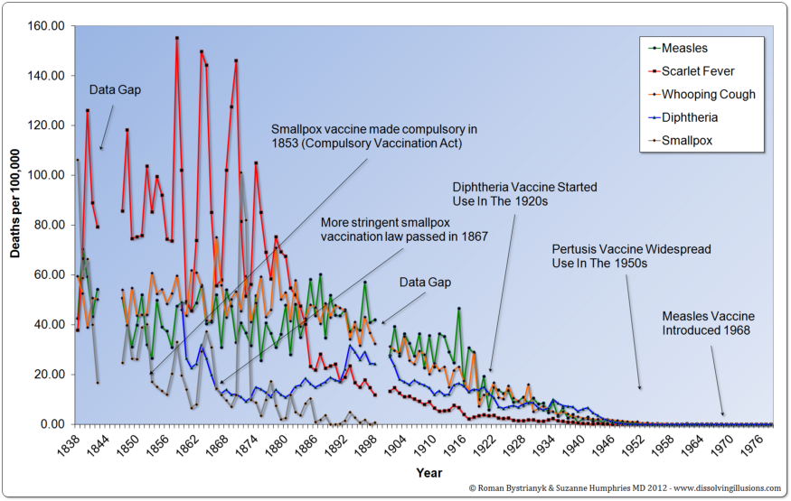 [dissolvingillusions.com](http://www.dissolvingillusions.com/wp-content/uploads/2013/03/G11.2-UK-Deaths-1838-1978.png)

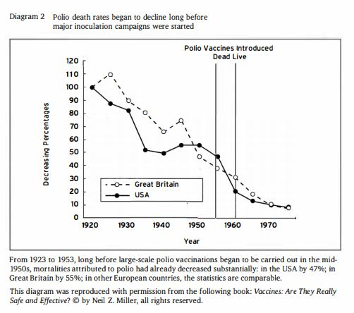 [Vaccines: Are They Really Safe and Effective? ](https://www.amazon.com/Vaccines-They-Really-Safe-Effective/dp/1881217302/ref=sr_1_1?dchild=1&keywords=vaccines+are+the&qid=1621214870&sr=8-1)

Same with Covid vaccines, by the time they were introduced, cases had already been going down. 

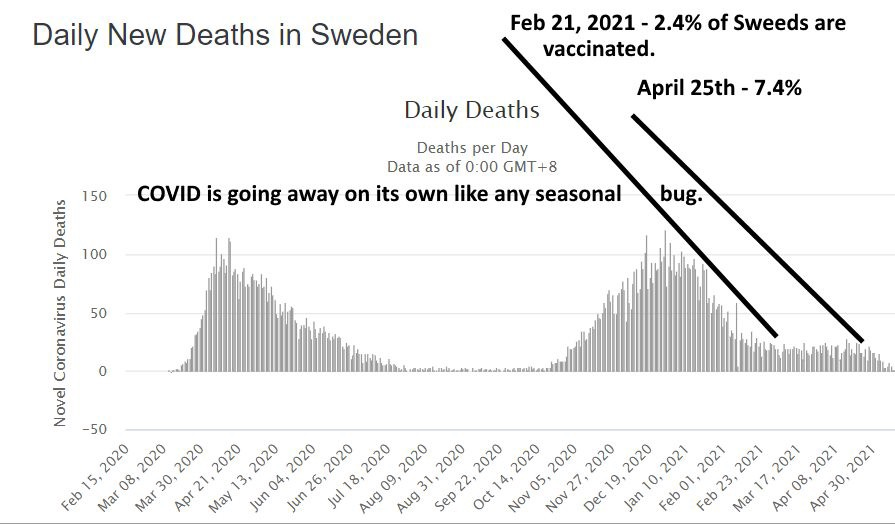 

Just like with Ancel Keys, and Karl Marx, Edward Jenner was another ignorant-negligent scientist who ignored much early criticism from other doctors regarding his hypothesis that inoculating people with a cow-pox concoction would then make them immune to smallpox. We quote the majestic book "Dissolving Illusions":

>"When Jenner published his paper in 1798 claiming lifelong immunity to smallpox and promoting his technique, many doctors who had seen smallpox follow cowpox challenged his doctrine at a meeting of the Medico-Convivial Society. 

>>"But he [Jenner] no sooner mentioned it than they laughed at it. The cow doctors could have told him of hundreds of cases where smallpox had followed cow-pox…"

>In 1799 Dr. Drake, a surgeon from Stroud, England, conducted an experiment to test Jenner’s new preventive using vaccine obtained directly from Edward Jenner. The children were then challenged with a smallpox inoculation to see if the cowpox procedure had been effective. 

>>"In three of them, a lad aged seventeen and two of the Colborne children (one four years, the other fifteen months), the cowpox vesicles came to early maturity and were scabbed under the usual time. The lad was inoculated with smallpox on the 20th December, being the eight day from his vaccination, and the two children on the 21st, being again the eight day. They all developed smallpox, both the local pustules and the general eruption with fever." 

>Dr. Hughes, another doctor from Stroud, reported that the children subsequently developed smallpox and suggested that the vaccination technique failed. Jenner received the report but decided to ignore the results." (Humphries)

The harm of vaccination, especially the US schedule, is in all likelihood one of the numerous areas where mainstream "experts" are essentially as wrong as they were when they vilified Semmelweis. And much of the increasingly important debates around the CovidVaccine and vaccination in general is simply a reflection of this fact. The apes are essentially going through the growing pains of overcoming a certain mythology. Let's look deeper. 

If it wasn’t until 2009 that the slightly smarter apes congratulated each other over what they think a ribosome looks like and how it functions, they have NO FUCKING CLUE what the near-term, much less long-term, and even less what the combined long-term effects, of routinely injecting children with numerous substances that make up vaccines like live viruses, foreign proteins, toxic chemical ‘adjuvants’, antibiotics, detergents, acid and alkaline buffers, a variety of animal cells, and foreign DNA and proteins and more. We quote 'Dissolving Illusions' again:

>"Instead of acknowledging the true cause for this extraordinary mortality decline before vaccination took hold, the medical profession embraced vaccination as a profitable and core medical tool. The problems with vaccines were consigned to oblivion or ensconced—and ultimately replaced with myth. Few ever bother to investigate or consider that anything else happened besides what they’ve been told. Vaccination is not a simple, straightforward cut-and-dry issue. It is complicated. The diseases are complicated and, moreover, the immune system is very superficially understood by even the most accomplished immunologists today.... “the immune system remains a black box, ” says Garry Fathman, MD, a professor of immunology and rheumatology and associate director of the Institute for Immunology, Transplantation and Infection... “Right now we’re still doing the same tests I did when I 
was a medical student in the late 1960s... ’’ It’s staggeringly complex, comprising at least 
15 different interacting cell types that spew dozens of different molecules into the blood to 
communicate with one another and to do battle. Within each of those cells sit tens of 
thousands of genes whose activity can be altered by age, exercise, infection, vaccination 
status, diet, stress, you name it.... That’s an awful lot of moving parts. And we don’t really know what the vast majority of them do, or should be doing."" (Humphries)

The “science” is definitely “settled” when it comes to the fact that as the number of vaccines given to kids has skyrocketed since the 1980s so have various illnesses and disabilities.

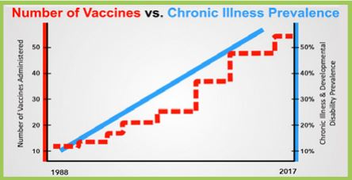 [Children's Health Defense](https://childrenshealthdefense.org/wp-content/uploads/generation-sick-ebook.pdf)

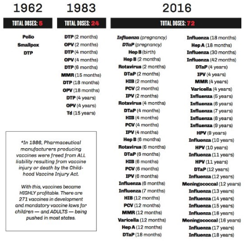 [nanoqed.org](https://www.nanoqed.org/2018.php)

The "American Academy of Pediatrics" website mentions:

>"In the first six months of life, the total amount of aluminum contained in all routinely recommended vaccines is about 4 milligrams (mg). This is about one-half the amount of aluminum received from breast milk and less than one-tenth the amount of aluminum received from regular infant formula during the first six months of life. In over 70 years of use, aluminum salts have proven to be safe and [effective."](https://www.aappublications.org/news/2017/09/26/IDSnapshot092617#:~:text=In%20the%20first%20six%20months,about%204%20milligrams%20(mg).)

This means that through various injections an infant has 89,280,948,851,000,741,289 atoms of aluminum (a known neurotoxin) injected directly into the bloodstream during the first 6 months of life. If he were to drink these 4 mg, a highly evolved digestive system would keep most of them out since there are currently no known needs for aluminum in the body, and should it need to enter the bloodstream it would do so in the manner 4 billion+ years of natural selection have crafted, perhaps bound to some carrier molecule/protein in a manner that keeps-sustains the delicate ORDER that life is all about. But this filtering-ordering process is bypassed leading to a molecular chaos-disorder-damage. It is absurd to compare the direct injection of trillions upon trillions of atoms to the careful filtering-ordering that digestion would provide. And 70 years ago, in 1951 we didn't even know what DNA looked like! Below is a sample of a few vaccines (trade name) and some of [their ingredients](https://www.cdc.gov/vaccines/pubs/pinkbook/downloads/appendices/b/excipient-table-2.pdf). Quadrillions upon quadrillions of foreign molecules injected into the mindbogglingly complex biochemical order of a child. An order which in its millions of years of evolution has not evolved to prevent these things from causing harm or safely remove them. 

1. Adenovirus vaccine: monosodium glutamate, sucrose, D-mannose, D-fructose, dextrose, human serum
albumin, potassium phosphate, plasdone C, anhydrous lactose, microcrystalline
cellulose, polacrilin potassium, magnesium stearate, cellulose acetate phthalate,
alcohol, acetone, castor oil, FD&C Yellow #6 aluminum lake dye.

2. Hep B (Heplisav-B): yeast protein, yeast DNA, deoxycholate, phosphorothioate linked
oligodeoxynucleotide, sodium phosphate, dibasic dodecahydrate, sodium
chloride, monobasic dehydrate, polysorbate 80 

3. Influenza (Afluria): sodium chloride, monobasic sodium phosphate, dibasic sodium phosphate,
monobasic potassium phosphate, potassium chloride, calcium chloride, sodium
taurodeoxycholate, ovalbumin, sucrose, neomycin sulfate, polymyxin B, betapropiolactone, hydrocortisone, thimerosal (multi-dose vials).

4. MMRV (ProQuad): MRC-5 cells including DNA and protein, sucrose, hydrolyzed gelatin, sodium
chloride, sorbitol, monosodium L-glutamate, sodium phosphate dibasic,
recombinant human albumin, sodium bicarbonate, potassium phosphate
monobasic, potassium chloride, potassium phosphate dibasic, neomycin, bovine
calf serum, other buffer and media ingredients 

But the 'Priesthood of Scientism' allegedly understands all the complexity so they are "Safe and Effective".

As everyone knows or intuitively senses and already mentioned, Amazon.com and its reviews and best-sellers lists have evolved to be superior sources of information given the real competition among authors-ideas compared to the competition-less monopoly AMA-CDC-etc. If you visit amazon.com and do a search for "vaccines" by far the best-selling and best reviewed books will be highly critical of vaccines to various degrees.  For example "The Vaccine-Friendly Plan" by Paul Thomas MD and Jennifer Margulis PhD suggest less vaccines and not giving out so many at once. This already implies that our priesthood-monopoly of "experts" may be giving wrong advise so this is sacrilege as it is. It has over 2000 nearly-all-5-star reviews. Paul also published research showing that from amongst the thousands of children his practice saw those who were unvaccinated were the healthiest. And soon after had his medical license suspended. [Journalist Jeremy Hammond has a superb article about Paul's ordeal and much that is related.](https://www.jeremyrhammond.com/2021/03/26/oregon-medical-board-suspends-dr-paul-thomas-for-practicing-informed-consent/) "Miller's Review of Critical Vaccine Studies: 400 Important Scientific Papers Summarized for Parents and Researchers" by Neil Z. Miller (over 1000 reviews, solid 5 star average), as the title implies, it succinctly summarizes 400 scientific papers documenting vaccine-related harms. It is also an eye-soar to the priesthood-establishement since it is often the #1 best-seller in "Health Policy" category. "Dissolving Illusions: Disease, Vaccines, and the Forgotten History" by Suzanne Humphries MD and Roman Bystrianyk provides a wonderful history of the vaccination mythology and its battles to coerce people(Roman created a superb 2 hour [video here](https://www.youtube.com/watch?v=-HTRhKynQg0)). Suzanne has many excellent presentations easily found online ([smallpox](https://www.youtube.com/watch?v=hBRwY-gFTio),[polio](https://www.youtube.com/watch?v=Rrb1XwI2_JA)). The image below shows the results as of 5/29/2021.

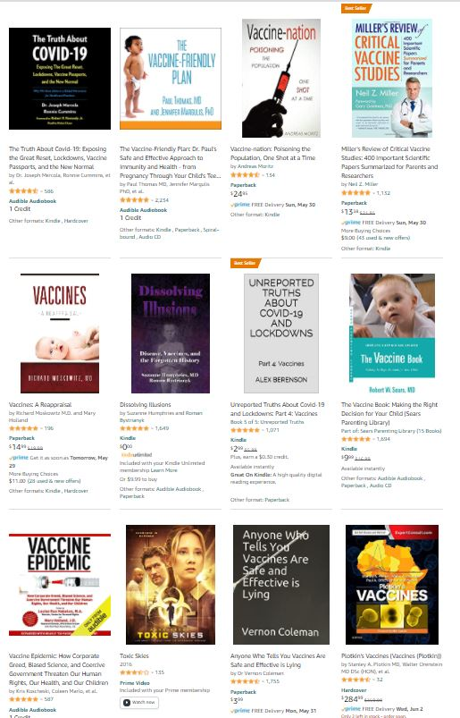 

With the exception of the movie that got in there, except for one book, which appears to be an expensive textbook which happens to have a description that mentions "Described by Bill Gates as "an indispensable guide to the enhancement of the well-being of our world,""(only 34 reviews) .... All other books range from being highly critical of the current USA vaccination schedule, to being 100% against vaccines period. They have a whopping combined 11,038 mostly passionate and many-well-written 5 star reviews. Are these authors and the thousands upon thousands upon thousands of parents and curious educated people who actually bother to read technical books on amazon, and totally dominate in terms of sales and passionate and well-written reviews part of some conspiracy of charlatans? Or again, is this simply a sign that mankind is in the middle of overcoming a myth in this particular area arising out of biochemical complexity? Given the immense complexity are the vaccine-critics simply wrong-misguided instead of quacks? How do we "discover" this? Via freedom and its 'competitive knowledge discovery' of course.

As with Noakes(nutrition) and Danielle(economics), Dr. Suzanne Humphries was once a believer in the mainstream views-myths that the current ways we use vaccines are “safe and effective”. She often recalls how she got interested in the subject after having patients whose severe kidney problems occurred after vaccination. She was rightly concerned when she learned that patients in the hospital she worked would get vaccinated with little regard for their medical condition, she mentions:

>“the policy was… to offer every patient that was conscious no matter what their disease these vaccines …I think that should stand out to everybody as problematic. Would you want to give a flu shot and a Pneumococcal vaccine to a man that has cancer and is on chemotherapy that moment?…I saw vaccines given to people who are having heart attacks while they were having the heart attacks, while they had active sepsis, while they had new onset kidney problems, and numerous other ailments that there was no scientific literature to support vaccinating. But the ethos was “vaccines are safe and effective and they need to be given”

Once again it is monumentally important that we see our problems as rooted in economic ignorance, human tribalism-nature, and resulting mythology, NOT ill intent or “conspiracy” even if it is easy to find malicious people in the evolving structures-myths. It is the economic ignorance-myths and resulting violence of the masses which will throw a man in prison for not paying taxes to sustain public education, or trade his labor for less than the minimum wage, etc. Little needs to be said about anti-Capitalist violence like Lenin's Bolshevik revolution. Atkins was vilified and one would assume had his life threatened many times, and it is even more dangerous for vaccination critics [like Suzanne](https://www.youtube.com/watch?v=bjb0_w_MYys). Let us re-quote Hayek, people “often see in it merely an arbitrary structure maintained by some sinister power.” Take the pharmaceutical industry and vaccination as an example. Many people who are critical of vaccination to various degrees, the much-vilified “anti-vaxxers”, will make the error of believing that ‘Big Pharma’ as they like to call it, is the result of some malicious-evil people wanting to get rich at the expense of others. Most doctors-experts blindly-religiously pushing vaccination as one of “the greatest medical achievements of modern civilization” will see the anti-vaxxers as wrong-malicious-nutty(the very religious ones) because they know deep down inside that they are pushing the vaccines out of what they considers to be good science and not some malicious profiteering at the expense of the health of others. If every time a doctor stumbles upon someone questioning the efficacy and safety of the USA vaccine schedule he sees some very religious person accusing him and the medical industry of malice, it is totally understandable how the vaccine-freedom and anti-vaxx movement is seen as dangerous-irresponsible naïve people. Again, this erroneous pattern repeats in other complex fields. In economics you have naïve thinkers believing the Federal Reserve and government is run by some secret cabal of “elites”(Jews, Rockefellers, etc.) when it is actually run by totally clueless apes regardless of the fact that one can identify truly corrupt people. 

Suzanne, like Noakes and Danielle, wisely realize that their misguided co-professionals in medicine, nutrition, and economics respectively are not part of some conspiracy of bad guys, but just caught in a complex web of fallacies-incentives-errors-myths-etc. given the understandable complexity of the subject matter. Vaccine critics like Suzanne would seem to be the ones in most danger but the following logic applies to all courageous independent thinkers and how myths are sustained via violence. Assume 1 million people learn about her views, perhaps 999,000 will immediately just dismiss her as some quack for understandable reasons, 1,000 may immediately think she has to be some malicious charlatan who is carelessly spreading ideas that can put millions of lives at risk, 100 of these may go as far as harasing her online, and perhaps statistically 10 or so will be "heroic" enough to want to take concrete steps to harm her. A similar line of thought can apply to the existing companies, scientists, and bureaucrats that stand to lose financially if the vaccine-nutrition-economic critics are correct. Most will be normal civilized people and say "wow, we've been inadvertently doing considerable harm, time to do something else/differently", but statistically there will be a group that might want to physically harm the dissenters. The same applies in other fields like religious mythology obviously, as in the killing of writers in the French satirical weekly newspaper Charlie Hebdo for having published material offensive to Muslims. Also take for example nationalism-militarism-tribalism. It is obvious that everyone who died in World War One died for absolutely nothing. And the same could be said about most military conflicts. But such an opinion will eventually upset-offend many "veterans"-heroes from which a group will resort to violence-intimidation and inadvertently silence-kill the mythbusters-dissenters. This is how the myths-fallacies are spread by the slightly smarter dangerous apes in a manner that is NOT the result of grand conspiracies but is "indeed the result of human action, but not the execution of any human design".

##### The Coronavirus Ape Self-Mutilation and the similarity to HIV->AIDS->DEATH mythology

Much of what is related to the Coronavirus, from the "science" to the resulting lockdowns and socioeconomic chaos, is essentially mythology that arises due to the complexity of biochemistry and perverse incentives leading to central-planning-like Communism and should be analyzed similarly. Again, in just the last 300 years mankind has been mired in religious slaughters, two massive world wars, the rise of Communism, etc. that are ultimately rooted in myth, religious myths, economic myths, etc. All backed by the "experts" of their day. Myths that inadvertently motivate the slightly smarter apes into creating competitionless-coercive bureaucracies that paralyze-destroy the social order in various ways. None of the previous disasters would have occurred if people had not been coerced into the ideologies and government-central plans of the times. Once again, freedom shields people from doing something they don't want to do, AND!! also leads to 'competitive knowledge discovery' which is the ultimate way to discover the best information with which to create superior products, order mankind, and discover THE TRUTH!, which obviously includes "the science"!. And the more complex the subject matter is (like medicine), the more freedom and competition is needed. Regarding Covidmania we have the opposite of competitive knowledge discovery in both the biochemical order as massive competition-immune coercive government regulatory bodies like the AMA, CDC and WHO dictate what is "the science", as well as disastrous interventions-destruction of the socioeconomic order via lockdowns, travel restrictions, coerced vaccinations, etc. leading to the civilization-ending calamity that is now upon us. 

Let us see how the slightly smarter apes with electron microscopes have let the complexity of the biological order further motivate them into the disastrous-coercive-'central planning' they always fall for.

Although plenty of people knew that the mortality due to Covid19 was going to be on par with that of a regular-strong flu from the minute the mania and lockdowns started just like plenty of people knew that Communism was bound to be an unworkable disaster, by mid 2020 enough data and related research had been done to make this obvious to anyone curious enough and able to trust his reason more than what clueless politicians and Anthony Fauci were saying. Great free-market think-tanks like the ["American Institute for Economic Research"](https://www.aier.org/) were able to coordinate intellectual opposition to the CovidMania lockdown-restrictions via their ["Great Barrington Declaration"](https://gbdeclaration.org/) where thousands of highly accredited and respected scientists from all over the world lent their names to such criticisms. A simple comparison between Sweden which did relatively little compared to the USA and other countries easily showed how masks and lockdowns were counter-productive or hardly any better at best. But just like with Communism and the night-time North-South Korea comparison, even though for decades one could easily see how the non-Communist countries were doing much better, once the ideological and incentive structure began to take shape, simple reason could do little to get in its way. For decades Communist ideologues-theologians and their evolved 'echo chambers' had their various explanations as to why they remained behind the freer-Capitalist countries, just like the pro-mask-lockdown-CovidVaccine ideologues justify their fallacies. We are also just dealing with largely uneducated masses who are understandingly scared, and many who also just refuse to admit they were wrong.

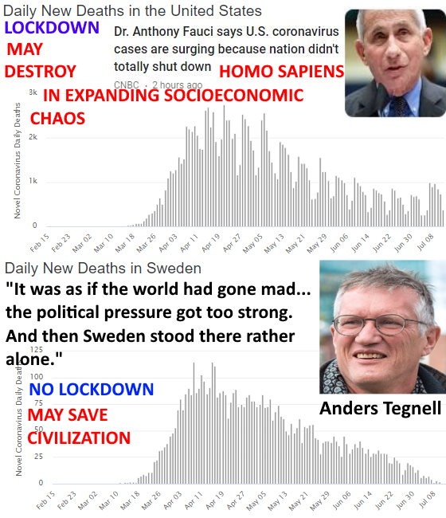

CovidMania was-is essentially what is being called a "Casedemic", botched science at numerous levels leading to false positive tests, fueling a hysteria, and very very very important, an incentive structure, that just like with Lenin's Bolshevik Communist revolution, motivates many people to grow-join central planning-regulating-paralyzing bureaucracies especially when government began to pay more money for [Covid19 treatments-tests-vaccines-drugs-etc.](https://www.usatoday.com/story/news/factcheck/2020/04/24/fact-check-medicare-hospitals-paid-more-covid-19-patients-coronavirus/3000638001/) and started sending people checks-money so they could take a vacation and continue to consume wealth without having to work-produce due to lockdowns. Remember that the medical sector has gone from about 4% of economy in 1960s to about 20% now, and it is incentivized to grow in revenue in order to heroically protect us from the killer pandemic. Public sector bureaucracies like public education and college professors ("experts") also don't have any 'skin in the game' and are not affected by lockdowns since they get their wealth from coercive taxation. So one has a massive amount of the population with a pro-lockdown incentive structure. US Centers for Disease Control (CDC) personnel knew early on that the Covid tests were faulty and would lead to many false positives [but they kept quiet.](https://www.npr.org/2020/11/06/929078678/cdc-report-officials-knew-coronavirus-test-was-flawed-but-released-it-anyway) Again, this does not have to be seen as some massive conspiracy, it could have been negligence by a few bad-apple-scientists who knew the coming panic would bring them additional funds-business, it could have also been what is referred to as a "Noble Lie", where people with good intentions commit a fraud or go along with a little white lie or exaggeration if they feel like it will help people in general (and also happens to improve your finance). Perhaps some felt like the eventual exaggeration of the danger would motivate people to be extra careful and help "save more lives". There is no need to even lie a bit, why not make it clear to the government and public that this "could potentially" be very bad and just out of caution we need more money for research. Just like the firefighter that daydreams of being a hero and valiantly running into danger to save people needs a fire, and a soldier who daydreams of courageously killing the enemy while saving his fellow countrymen needs a war, so do some "disease experts" and numerous economically ignorant ideologues look forward to some calamity so they can be heroes and also blame everything on the capitalism-freedom('selfishness') they don't understand and want an opportunity to socially engineer society "for the greater good". There is the petri dish of 'scientists' with various levels of honesty leading to honest errors, charlatans, and negligence, and eventually the statistical certainty that exaggerations will explode into a government-funded chain-reaction of mania and government growth. Again! It is vitally important that we see the formation of disastrous 'central planning structures' as complex ideological factors-incentives instead of a "conspiracy"-"hoax".

This and numerous other factors led people who obviously died of old age and other co-morbidities to be labeled as having died due to Covid helping fuel the mania. For example, in [Italy](https://www.epicentro.iss.it/coronavirus/bollettino/Report-COVID-2019_20_marzo_eng.pdf?fbclid=IwAR2xLHsmL_R3vKjoUOonuu5sUPZiB0VB2xH3k3vI7tq3o8cShnwTeWXNhYM), which was a hotbed of hysteria, the average age of people who died and had the virus was 78 years old, and on average people had almost 3 other diseases. It is also important to notice how many were taking all kinds of drugs whose side-effects are often-times what kills them, especially more dangerous anti-viral drugs etc. In [England figures have been similar](https://news.sky.com/video/covid-19-how-do-figures-of-virus-deaths-compare-to-a-normal-year-11964813?fbclid=IwAR2b7ifXRjnbt-eL8oBPLeUhgYj6kLHK5BKNG5xXwrMtq8VXcQ4SATJ1dBo), 98% were elderly with other medical conditions. Their "experts" and their mythical models quickly had to revise predictions from about 500,000 deaths to only 20,000 out of a total population of 56 million people, yet they also wisely estimated that 2/3 of those people would have died anyway from some other cause leading to an estimate of about 6-10K deaths due to virus for the year. Random testing for antibodies which show up after people have been infected with the potential pathogen have shown that the pathogen has already affected way more people than originally thought and that the rate of mortality is is closer to [0.12-0.2%](https://reason.com/2020/04/17/covid-19-lethality-not-much-different-than-flu-says-new-study/) which makes it similar to regular flu (0.1%). The PCR based test that is being used to identify cases comes back positive if it finds a piece of the virus that came from an antibody of someone who already dealt with the pathogen thus helping fuel the covidmania. Yet with all of this evidence, Fauci and his counterparts in much of the world continued to believe-preach that we must have lockdowns and eventual vaccines in order to be better off, in other words, they are pushing "a widely held but false belief or idea", a myth. A myth far more dangerous than praying to some likely inexistent deity. What we really want is for the immune system that natural selection has been perfecting for over a billion years and our "experts" still hardly really understand, to work optimally which it can only do in a body that is free from disease and has been fed the optimal diet/fuel which helps explain why truly healthy people, even among the relatively old, rarely succumb to the Coronavirus pathogen. 

According to alleged immunology 101 mythology, viruses infect us and attempt to use our own cells to make copies of themselves, eventually our defenses fight off the infection and remember the genetic sequence of the virus so they can no longer attack us in the future. A new "novel" virus initially has a large population to infect, but as an increasing amount of members have fought off the infection we develop "herd immunity" and the virus has less potential hosts to infect and use for replication so it tends to disappear. This is more or less the common understanding of what millions of years of natural selection has crafted in ways we are just beginning to understand(which given the complexity may be erroneous as we will soon discuss). The whole idea behind vaccines is that by injecting ourselves with a dead or somehow less potentially dangerous-virulent version of the pathogen we can sort of "trick" the body into creating the antibodies which will then properly prevent the live or more dangerous version of the pathogen, which as already discussed may actually do more harm than good and be unnecessary-detrimental. 

The aforementioned ["Great Barrington Declaration"](https://gbdeclaration.org/) which was signed by thousands of top scientists helps us maximize our highly evolved immune system while using scientific interventions when needed-useful. It is very short and most of its recommendations are:

>"Fortunately, our understanding of the virus is growing. We know that vulnerability to death from COVID-19 is more than a thousand-fold higher in the old and infirm than the young. Indeed, for children, COVID-19 is less dangerous than many other harms, including influenza. 

>As immunity builds in the population, the risk of infection to all – including the vulnerable – falls. We know that all populations will eventually reach herd immunity – i.e.  the point at which the rate of new infections is stable – and that this can be assisted by (but is not dependent upon) a vaccine. Our goal should therefore be to minimize mortality and social harm until we reach herd immunity. 

>The most compassionate approach that balances the risks and benefits of reaching herd immunity, is to allow those who are at minimal risk of death to live their lives normally to build up immunity to the virus through natural infection, while better protecting those who are at highest risk. We call this Focused Protection. 

>Those who are not vulnerable should immediately be allowed to resume life as normal. Simple hygiene measures, such as hand washing and staying home when sick should be practiced by everyone to reduce the herd immunity threshold. Schools and universities should be open for in-person teaching. Extracurricular activities, such as sports, should be resumed. Young low-risk adults should work normally, rather than from home. Restaurants and other businesses should open. Arts, music, sport and other cultural activities should resume. People who are more at risk may participate if they wish, while society as a whole enjoys the protection conferred upon the vulnerable by those who have built up herd immunity."

Again... Using our understanding of the "science" we want to let the herd immunity that has been crafted by natural selection for millions of years to do its thing. It is totally UNNATURAL and against the acquired wisdom and disease fighting ability of millions or years of natural selection to go AGAINST this by locking away all human beings, including the young who have virtually 0 chance of dying from covid, and making people depressed prisoners eating garbage food and ultimately getting sicker in countless ways and creating an economic damage none of the bureaucrats or even mainstream economists can understand since they are clueless money-creating Keynesians.

Just like in the Soviet Union people like Trofim Lysenko would rise to the top, we see the same thing in national monopolies like in the USA with Anthony Fauci(more about this soon) and in the World Health Organization via its top bureaucrat Tedros Ghebreyesus who said the following absurdity regarding herd immunity:

>"Herd immunity is a concept used for vaccination, in which a population can be protected from a certain virus if a threshold of vaccination is reached … Herd immunity is achieved by protecting people from a virus, not by exposing [them to it."](https://en.wikipedia.org/wiki/Great_Barrington_Declaration#Reception)

The above shows complete ignorance of herd immunity and basic immunology. It is by being exposed to a virus and building natural immunity to it via the creation of antibodies-etc., which is what vaccines attempt to replicate, that we supposedly attempt to create herd immunity. Tedros' new statement-definition of "the science" has now been adopted by the WHO, and replaces the older and more correct meaning which rightly incorporated natural infection as can be seen in image below:

Anthony Fauci did not recognize or try to engage the thousands of leading scientist who signed the [Great Barrington Declaration(GBD)](https://gbdeclaration.org/), in good tribal-political ape manner, just like Communist ideologues (as well as Church when it had all the power) tend to do, he simply called the declaration ["ridiculous", "total nonsense" and "very dangerous"](https://en.wikipedia.org/wiki/Great_Barrington_Declaration#Reception), saying that it would lead to a large number of avoidable deaths. Dismissing so many world-renowned scientists in such a manner without curious and welcoming dialog, is really all one needs to know in order to realize that Fauci has Lysenko-like 'cognitive dissonance'. Communists, in their self-reinforcing "echo chamber" would simply see free-marketeers as callous people who wanted to "exploit" the masses and so on, "unscientific religious people" who blindly followed supposedly absurd religious concepts, etc. and we similarly see mainstream press and "scientists" smear the GBD as some "right-wing" political creation. However, it is once again vitally important that we see these phenomena not as the result of 100% purposeful malice, but out of a certain cognitive dissonance-bias or understandable lack of care for different views or the true extent of harm caused by potentially looking the other way. For example Fauci and the "scientific experts" can always point to some very religious persons talking about wild conspiracies by the "devil" or some carefully orchestrated "hoax"-"conspiracy" trying to defend their freedom to not go along the plans of the "fauci-scientists-experts" as some nuts that need to be ignored or coerced for their own good or "the good of society". So we can easily see how the various 'echo chambers' can form-spread-intensify their polarization. Again, complex ideological factors and incentive structures can lead to concerted action which should not be confused with a "conspiracy" or "hoax". We want to focus on how the ideas, the 'echo chambers' and the 'incentive structures' arise-evolve, instead of on particular individuals. In such structures since there are so many people involved it would be easy to find people with all sorts of motives, from truly well-intentioned-concerned, to 100% malicious charlatans, and it would be a gigantic error to label all of CovidMania based on one-few individuals. Again, just like religious wars of the past, you had plenty of truly faithful and you had some focused on pure territorial gain-etc. and complex mixtures in-between.

As the medical monopoly Soviet Union-like 'echo chamber' and 'perverse incentive' structure materializes, there is a competitive-selective process that selects for the most negligent or ruthless apes who are more and more likely to dismiss dissent and push the government to suppress competing-critical opinions. A good and early example of this was the banning by Youtube of a [video that in just a few days had reached over 5 million views](https://www.bitchute.com/video/56R2zmYXSfIK/) by Doctors Dan Erickson and Artin Massihi of Bakersfield California where they explained the relative harmlessness of the CV compared to what Fauci-Tedros-CDC-WHO were preaching. In an interview about the matter, Youtube CEO Susan Wojciki, mentioned that they took the video down because "Anything that would go against World Health Organization recommendations would [be a violation of our policy".](https://youtu.be/sPrbGU0Wyh4?t=271). Again! economic ignorance, ignorance of how superior information can only be discovered by competition and thus freedom, always leads to a 'central plan' that eventually necessitates coercion and the suppression and eventual vilification of dissenting views(right-winger, 'science denier'). It is no longer freedom and competition what determines the truth-information, it is the monopoly-competition-immune ideologues at the WHO. This is not the result of some malice by Susan, she is simply the particular slightly smarter ape that inevitably rises to her position just like Goebbels inevitably emerged to fill a similar role in Nazi Germany. What can mistakenly seem like a 'conspiracy' by Susan-Fauci-Gates-etc.  IS NOT!, it is "indeed the result of human action, but not the execution of any human design"... So you have polarizing 'echo chambers' and increasingly conflicting groups (a) The central planners who have to increasingly 'conspire' to continue their ideology-plans even if it was never 'conspired' from the beginning, and (b) doubters-critics, many of whom mistakenly label the 'central planners' in general as one massive cabal of "bad guys". The 'central planners' clearly find such insults misguided and nutty, so they easily use that to justify ignoring and persecuting dissenting views and so on intensifying the polarization-persecution-hatreds. 

During the early days of the Bolshevik revolution, many communists were fiercely for principled freedom of speech. Many had experienced severe censorship and jail time under the Tsar for expressing their views. But again, bad-complex ideas eventually show cracks and inevitable dissent and differing(competing) opinions, if they are to persist and require unity for their execution, they must be carried out by force and dissenting views increasingly suppressed. Hayek summarizes[our comments applied to Coromunism]:

>"The creation and enforcement of the common creed [lockdowns-masks-vaccine] and of the belief in the supreme wisdom of the ruler [Fauci-Tedros-Politicians] becomes an indispensable instrument for the success of the planned system. The ruthless use of all potential instruments of propaganda and the suppression of every expression of dissent is not an accidental accompaniment of a centrally directed system — it is an essential part of it.

>Nor can moral coercion be confined to the acceptance of the ethical code underlying the whole plan. It is in the nature of things that many parts of this code, many parts of the scale of values underlying the plan, can never be explicitly stated. They exist only implicitly in the plan. But this means that every part of the plan, in fact, every action of the government or its agencies, becomes sacrosanct and exempt from criticism. [If you don't 'social distance', wear masks, ignore the heroic self-sacrificing experts like Fauci you are an immoral selfish negligent killer]

>It is, however, only the expression of criticism that can be forcibly suppressed. But doubts that are never uttered and hesitation that is never voiced have equally insidious effects, even if they dwell only in the minds of the people. Everything which might induce discontent must therefore be kept from them. The basis for comparison with conditions elsewhere [no-lockdown Sweden, Florida, etc.], the knowledge of possible alternatives to the course taken, information which might suggest failure on the part of the government to live up to its promises or to take advantage of opportunities to improve the lot of the people — all these [must be suppressed."](https://mises.org/library/what-price-planned-economy) (Hayek, 1938)

Regardless of what exactly the CV pathogen is and all the technical-scientific details about it, the initial scare and lockdowns were based on a quickly-revised and later totally discredited "epidemiological model" which grossly overestimated the lethality of the Coronavirus by British Professor Neil Ferguson who had made numerous totally bogus and exaggerated predictions before, like:

1. That up to 50,000 people would likely die from exposure to mad cow disease in beef in the UK, only 177 died.
2. That up to 150 million people could be killed from bird flu. Only 282 died worldwide between 2003 and 2009.
3. That swine flu could led to 65,000 deaths in the UK. Only 457 died.
4. That up to 150,000 people could die from a foot-and-mouth disease scare. There were fewer than 200 deaths.

All of these so-called "diseases" which led to such ultimately over-hyped and totally unnecessary fears and restrictions like "mad cow", "bird flu", "swine flu", "foot-and-mouth" and ultimately the Covid19 disease all seem to involve what we commonly refer to as viruses, which are soo small, that once again even with our best electron microscopes, their alleged functioning and interactions with the complex immune system remain the subject of much research and competing opinions. Again, wherever there is complexity, there is bound to be uncertainty and eventual mythology, and if these mythologies are sustained by competitionless government coercion-regulation the intellectual errors-myths are harder to change. What if our low-level understanding of the biochemistry relating to viruses-vaccines and the immune system was nowhere near as precise as mainstream scientists believe. What if the entire scientific establishment is as misguided as it was just a few decades ago when it went along with lobotomies, worms as the cause of cancer, and ridiculed people like Ignaz Semmelweis and Alfred Wegener? This brings us to the HIV-causes-AIDS and eventual death hypothesis which could be one of these massive errors-myths of modern "science" and its surprising relevance-application to current CovidMania and Government (monopoly) science-Scientism in general. Even if it is NOT a mistake there is still a tremendous amount to be learned by examining this subject.

Before delving deeper into this controversial and dangerous subject we can divide its protagonists into two camps, the mainstream and government (monopoly-force-huge-money) backed thinkers who believe that the HIV virus eventually weakens people's immune systems and they die of some opportunistic disease, and those who disagree with this hypothesis to various degrees, or are highly skeptical at least. There is a pro-standard view that HIV->AIDS->death website https://www.aidstruth.org/ which defends the standard narrative and there are also sites like https://rethinkingaids.com/ which back the doubter's views. Given the immense complexity of the subject and human nature, there are tremendous extremes, from seemingly nutty religious people who will say the whole thing is a massive "conspiracy"-"hoax" inspired by devil-evil-doers, to "scientists" who at various points have peddled or exaggerated ridiculous scaremongering scenarios for financial gain, and honest researchers. And then there are also smaller disagreements even withing their respective camps...

Consider the story of molecular [biologist Dr. Peter Deusberg.](https://www.lewrockwell.com/2006/02/donald-w-miller-jr-md/the-copernicus-of-aids/) Peter was a brilliant researcher who was awarded tenure at UC Berkeley at just 36 years of age and was considered for a Nobel Prize. Some of his early awards are:

1969, Merck Award ("recognizes outstanding contributions to research in biochemistry and molecular biology")
1971, California Scientist of the Year Award
1981, First Annual American Medical Center Oncology Award
1986, Outstanding Investigator Award, National Institutes of Health
1986, elected to National Academy of Sciences

When AIDS became the pandemic that was supposed to wipe out millions in the 1980s Deusberg took an interest in the subject and concluded that the HIV virus was likely to be harmless and thus NOT what was eventually killing these people, and hypothesized that the weakened immune systems of people who would be diagnosed as having AIDS had more to do with damage due primarily to certain heavy drug use, particularly so-called "poppers"(nitrite inhalants) which were very popular among homosexuals, also other factors like intravenous drug use which is known to damage-stress the immune system as well as other potential factors-unknowns. His book ["Inventing the AIDS Virus" (4.7/5 stars with over 100 reviews on Amazon)](https://www.amazon.com/Inventing-the-AIDS-Virus/dp/B00DBAXVMU/ref=sr_1_1?dchild=1&keywords=peter+duesberg&qid=1607924317&sr=8-1) seemed like a masterpiece to me as further evidenced by the many glowing and well written reviews. Peter would be one of the first big-time scientist to question the evolving mainstream narrative that HIV was the virus that caused AIDS-like symptoms and eventually death. Just like with Covid and the Great Barrington Declaration, many other scientists would also lend their names to various letters-documents of dissent-doubt. For example Charles Thomas Ph.D. was a former Professor of Biochemistry at Harvard and John Hopkins Universities  who organized [*The Group for the Scientific Reappraisal of the HIV-AIDS Hypothesis*](https://www.virusmyth.com/aids/group.htm) Another brilliant scientist, Kary B. Mullis, the 1993 Nobel Prize winner in Chemistry and inventor of the polymerase chain reaction(PCR) was also highly critical of the HIV->AIDS->death hypothesis and a defender of Deusberg's criticisms.

Just like Fauci would dismiss the GBD signed by world-renowned infectious disease experts as "ridiculous", "total nonsense" and "very dangerous" without debating them, so would he avoid going to conferences if Deusberg was also to attend.

>"In the year since Mr. Duesberg first advanced his theories in a paper in Cancer Research, leading AIDS investigators have been unanimous in their refusal to rebut him, despite requests from universities and press forums like the “MacNeil/Lehrer NewsHour.” They have been willing, however, to justify their silence at length. Anthony Fauci, coordinator of AIDS research at the National Institutes of Health, recently explained on National Public Radio, “Critiquing a dubious theory would take time away from more [productive efforts.”"](https://www.functionalps.com/blog/2012/04/07/the-aids-debate-that-isnt/) (Leishman, 1988)

Fauci also mentioned:

>"...many people consider what is in the media to be true by definition. One striking example is Peter Duesberg’s theory that HIV is not the cause of AIDS. I laughed at that for a while, but it led to a lot of public concern that maybe HIV was a hoax. The theory has extraordinary credibility just on the [basis of news coverage."[(Baily, p. 162)](https://books.google.com/books?id=glCNJzN4ZXUC&pg=PA162&lpg=PA162&dq=%22One+striking+example+is+Peter+Duesberg+theory+that+HIV+is+not+the+cause+of+AIDS.+I+laughed%22&source=bl&ots=zOeRHP8ETt&sig=ACfU3U2kAkquB-4UDsBomu8vWlCeqwdpnQ&hl=en&sa=X&ved=2ahUKEwjQn7L154f5AhWkM1kFHZcXARcQ6AF6BAgDEAM#v=onepage&q=%22One%20striking%20example%20is%20Peter%20Duesberg%20theory%20that%20HIV%20is%20not%20the%20cause%20of%20AIDS.%20I%20laughed%22&f=false)

Perhaps this last statement helps us understand why Fauci would dismiss Deusberg without necessarily doing so purely out of malice or negligence. Perhaps the following is at play:  1) Deusberg voices his criticisms, 2) then naive thinkers or very religious-types go around saying the whole thing is a "conspiracy" or a "hoax", 3) Fauci learns that it is Deusberg's work which led to the labels of "hoax" and "conspiracy theories" which he clearly knows are not true, 4) so he dismisses Deusberg. Or maybe not, maybe he plays the role of a modern Pope who is not very motivated to discuss theology with Richard Dawkins. Or perhaps some complex combination of numerous other factors. Maybe he is right and Deusberg wrong. Again, a very complex subject which requires freedom and resulting 'competitive knowledge discovery' instead of coercive government monopoly.

Today there is little doubt that many of the people who were supposedly dying of AIDS in the late-early 1980-90s were dying due to the immense toxicity of the early drugs [like AZT](https://www.spin.com/featured/aids-and-the-azt-scandal-spin-1989-feature-sins-of-omission/#:~:text=The%20toxic%20effects%20of%20AZT,to%20be%20taken%20off%20it.). How can a compound discovered in 1964 when we knew way less about the immensely complex biochemical pathways that sustain our order, and was deemed too dangerous and ineffective then, suddenly be given to people now for years and not expect it to be doing immense harm? We quote Celia Farber's article on Spin Magazine ["AIDS and the AZT Scandal: SPIN’s 1989 Feature, ‘Sins of Omission’"](https://www.spin.com/featured/aids-and-the-azt-scandal-spin-1989-feature-sins-of-omission/) ([see a critique of her article by prominent HIV researchers here](https://www.aidstruth.org/documents/ErrorsInFarberArticle.pdf))

>"[AZT]....had actually been developed a quarter of a century earlier as a cancer chemotherapy, but was shelved and forgotten because it was so toxic, very expensive to produce, and totally ineffective against cancer. Powerful, but unspecific, the drug was not selective in its cell destruction...

>"Dr. Harvey Bialy, scientific editor of the journal Biotechnology, is stunned by the low quality of science surrounding AIDS research. When asked if he had seen any evidence of the claims made for AZT, that it “prolongs life” in AIDS patients, Bialy said, “No, I have not seen a published study that is rigorously done, analyzed, and objectively reported.”

>Bialy, who is also a molecular biologist, is horrified by the widespread use of AZT, not just because it is toxic, but because, he insists, the claims its widespread use are based upon are false. “I can’t see how this drug could be doing anything other than making people very sick,” he says....

>"Most ironically, the drug has been found to accelerate the very process it was said to prevent: the loss of T-4 cells.

>Undeniably, AZT kills T-4 cells [white blood cells vital to the immune system],” says Bialy. “No one can argue with that. AZT is a chain-terminating nucleotide, which means that it stops DNA replication. It seeks out any cell that is engaged in DNA replication and kills it. The place where most of this replication is taking place is in the bone marrow. That’s why the most common and severe side effect of the drug is bone marrow toxicity. That is why they [patients] need blood transfusions.”

>AZT has been aggressively and repeatedly marketed as a drug that prolongs survival in AIDS patients because it stops the HIV virus from replicating and spreading to healthy cells. But, says Bialy: “There is no good evidence that HIV actively replicates in a person with AIDS, and if there isn’t much HIV replication to stop, it’s mostly killing healthy cells.”....

>"As a chemotherapeutic drug, explained Duesberg, AZT “kills dividing blood cells and other cells,” and is thus “directly immunosuppressive.”

>“The cell is almost a million-fold bigger target than the virus, so the cell will be much, much more sensitive,” says Duesberg. “Only very few cells, about one in 10,000, are actively making the virus containing DNA, so you must kill incredibly large numbers of cells to inhibit the virus. This kind of treatment could only theoretically help if you have a massive infection, which is not the case with AIDS. Meanwhile, they’re giving this drug that ends up killing millions of lymphocytes [white blood cells]. It’s beyond me how that could possibly be beneficial.”"

Again! Again! The immense complexity of the biochemical order can eventually lead to differences in opinion and an environment where flat out lies, extreme negligence and honest intellectual error can easily arise from all sides. In the passage below we see how Dr. Sandra Lehrman, a scientist working for the AZT manufacturer 'Burroughs Wellcome' which was making a fortune($10,000 per year per patient in 1987 ($22,000 in today's dollars)) with AZT, saw things:

>"When specific questions about the alleged mechanisms of AZT are asked, the answers are long, contradictory, and riddled with unknowns. Every scientific point raised about the drug is eventually answered with the blanket response, “The drug is not perfect, but it’s all we have right now.” About the depletion of T-4 cells and other white cells, Lehrman says, “We don’t know why T-4 cells go up at first, and then go down. That is one of the drug mechanisms that we are trying to understand.”"

In his book ["Poison By Prescription: The AZT Story"](https://www.scribd.com/document/111057800/Poison-by-prescription-The-AZT-story#download) John Lauritsen, who obtained data about the trial which the FDA was forced to release via the Freedom of Information act, writes:

>"The FDA analyst who reviewed the pharmacology data, Harvey I. Chernov, recommended that AZT should not be approved. Chernov documented many serious side effects of AZT, and summarized its effect on the blood as follows: 

>>"Thus, although the dose varied, anemia was noted in all species (including man) in which the drug has been tested."

>"Chernov concluded his review of the pharmacology data by recommending that AZT should not be approved:

>>"In conclusion, the full preclinical toxicological profile if far from complete with 6-month data
available, but not yet submitted, one-year studies to begin shortly, etc. The available data are insufficient to support FDA approval" (Lauritsen)

As the immense toxicity became increasingly apparent, the FDA ("the science") cut the dose in half. Prior to this change, anyone saying that AZT at old dose was doing immense harm was of course what in today's climate would be called a "science denier", someone giving dangerous advice that could cost lives and should perhaps be jailed. Lauritsen again:

>"The Food and Drug Administration (FDA) announced on 17 january 1990 that the recommended dose of AZT, the only federally approved drug for AIDS, would be cut in half. The old dose was 1200 milligrams per day. The new dose will be only half that: 600 milligrams per day after one month at the old dose of 1200 milligrams. The FDA has ordered changes in the labels on AZT (also known as zidovudine or Retrovir) to represent the new recommendation. 

>For some time prior to the FDA's announcement, doctors who treat "AIDS" patients had been experimenting with lower doses, in an effort to avoid the side effects of the drug. At the old dose of 1200 milligrams, about half of all "AIDS" patients had been unable to tolerate AZT's extreme toxicity, which caused severe anemia, as well as muscular pain and atrophy (wasting away) and damage to the kidneys, liver, and nerves. 

>Health and Human Services Secretary Louis Sullivan said in a statement that the change "means that fewer patients may have to discontinue AZT therapy because of serious side effects."

>The new dose recommendation was based on government press releases from last summer, which allegedly showed that the lower dose was just as effective as the higher, while causing fewer serious side effects." 

Beloved stars like singer Freddie Mercury and tennis legend Arthur Ashe were AZT victims. Basketball star Magic Johnson seems to have saved himself by stopping AZT before it was too late. Engelbrecht-Claus-Bailey-Scoglio write in their SUPERB!!!! book ["Virus Mania"](https://www.amazon.com/Virus-Mania-COVID-19-Hepatitis-Billion-Dollar/dp/B094X3F7D9/ref=sr_1_1?dchild=1&keywords=virus+mania&qid=1622394214&sr=8-1):

>"Mercury was terrified and took his doctor's advice to begin taking AZT. Mercury belonged to
the first generation of patients, who received the full AZT load (1500 mg a day). At the end, he looked like a bone rack, and he died in London on 24 November 1991 at the age of 45."...

>"...Arthur Ashe met his maker at the age of 36, after he had been declared HIV positive in 1988 and his doctor prescribed for him an extremely high AZT dose.
>At some point, Ashe discussed AZT's toxicity. In October 1992, he wrote a column for the Washington Post. "The confusion for AIDS patients like me is that there is a growing school of thought that HIV may not be the sole cause of AIDS, and that standard treatments such as AZT actually make matters worse," Ashe acknowledged, adding, "there may very well be unknown co-factors, but that the medical establishment is too rigid to change the direction of basic research and/or clinical trials." Ashe wanted to stop taking AZT, but he didn't dare: "What will I tell my doctors?" he asked the New York Daily News."

...

>"What Ashe didn't have the heart to do-resist the pressure of prevailing AIDS medicine and decide against AZT intake-apparently saved the life of basketball megastar Earvin "Magic" Johnson.

>At the end of 1991, Magic shocked the world with the news he had tested HIV positive. "It can happen to anybody, even Magic Johnson," said Time magazine on 18 November 1991. A few days later, Time wrote that the basketball player had "put the risk of heterosexual transmission squarely in center court." But what was the basis of this assumption? Nothing at all, for the American magazine-just like the rest of the media world-simply referred to Johnson's mere conjecture that he had "picked up the AIDS virus heterosexually," that is to say through sex with a
woman. 
>Evidence to support this statement is not available. Magic Johnson had tested positive, but at the same time, he was the picture of health-until "AIDS ruier" Anthony Fauci and his personal doctor, the New York AIDS researcher David Ho, insistently advised him to take AZT. Johnson followed their advice. 
>But Magic's health rapidly deteriorated, so much, in fact, that he felt "like vomiting almost every day," according to a 1991 National Enquirer story "Magic Reeling as Worst Nightmare Comes True-He's Getting Sicker." But virus mania was by then so dominant that nobody thought that the extremely toxic medications could have caused Magic's serious health problems....years later, in 1995, he admitted in a personal conversation in Florida that he had only taken AZT for a very short time. The medications were connected with far too severe side effects. And so came the saying, "There is no magic in AZT, and no AZT in 'Magic. "" (Köhnlein)

Interestingly enough Anthony Fauci was also one of the early proponents of AZT and has been the main ideologue diverting the vast resources of the US government towards the HIV->AIDS hypothesis and away from its criticisms.

In the early 80s when scientists where trying to make sense out of why so many of these overwhelmingly drug-using-gay-men where having very weak immune systems and dying, based on early hypotheticals and a paper he appears to not have gotten the opportunity to read in its entirety, Fauci wrote things in a manner that led to hysteria when he wrote:

>“We are witnessing at the present time the evolution of a new disease process of unknown etiology with a mortality of at least 50 percent and possibly as high as 75 percent to 100 percent with a doubling of the number of patients afflicted every six months.”...

>"The finding of AIDS in infants and children who are household contacts of patients with AIDS or persons with risks for AIDS has enormous implications with regard to ultimate transmissibility of this syndrome,”.... “If routine close contact can spread the disease, AIDS takes on an entirely new dimension,” (Shilts, p. 299)

Suddenly a respected official government "expert" was mentioning how we could have a highly infectious and deadly disease on our hands that could potentially quickly wipe out millions. The AIDS hysteria exploded. With the best of intentions many demanded the government immediately increase AIDS-related funding, not doing so and easily pointing to some religious leaders who were themselves spreading AIDS hysteria by saying that AIDS was God's punishment for homosexuality, would make the conservative Reagan administration look like that standard "evil selfish white man who uses Capitalism to exploit and doesn't care"... and the money for AIDS research exploded. A year later Fauci became Director of the National Institute of Allergy and Infectious Diseases. Shilts writes in his book "And the Band Played On: Politics, People, and the [AIDS Epidemic"](https://www.amazon.com/Band-Played-Politics-Epidemic-20th-Anniversary-ebook/dp/B000V761ZA/ref=sr_1_1?dchild=1&keywords=Shilts+hiv&qid=1609219010&sr=8-1):

>"Fauci quickly cast blame on a hysterical media for taking his comments “out of context.” After all, he had said only that the possibility of household transition might raise all these scientific implications. The lay public did not understand the language of science, he pleaded. Science always dealt with hypotheticals….the chief villain, he would accurately note, was the press office of the American Medical Association" (Shilts, p. 300-301)

Again, to the immense biochemical complexity we add various layers of human nature-ignorance-errors-incentives-etc. An ideological pattern or "algorithm" emerges, the more rightly "concerned" for gays and the suffering of potential AIDS victims people are, and the more "prudent", the more "could potentially"-type scenarios arise, the more incentive (both out of genuine concern and out of potential profit and scientific glory) arises and warps government spending in a way that accelerates both funding and more "hypothetically dangerous" scenarios. Again, this is not the result of some "well orchestrated plot" it is "indeed the result of human action, but not the execution of any human design". 

Robert Redfield, the current Director of the Centers for Disease Control and Prevention (CDC) who has been another main ideologue in CovidMania was a wild exaggerator of the potential transmissibility of HIV. For example, researcher Michael Fumento who has written extensively on HIV-AIDS and has challenged Peter Deusberg to willingly infect himself with HIV if he is so sure that it is as harmless as Deusberg says, writes in his book ["The Myth of Heterosexual AIDS: How a Tragedy Has Been Distorted by the Media and Partisan Politics"](https://www.amazon.com/Myth-Heterosexual-AIDS-Distorted-Partisan/dp/0895267292/ref=sr_1_1?dchild=1&keywords=the+myth+of+heterosexual+aids&qid=1609088156&sr=8-1)

>"Dr. Redfield, amazingly, has declared male-to-female vaginal HIV transmission to be 50 percent *per contact*, in an interview with Ann Guidici Fettnet. He referred to a letter published in *Lancet* in which it was reported that, of 8 Australian women inseminated artificially with sperm, 4 seroconverted. Redfield asserted: "The bottom line for women is that half of them get infected in spouse studies[and] very few viruses are effectively transmitted even 50 percent of the time. It's a very efficient virus" (Fumento)

Redfield willfully neglected to mention or properly take into account that this was due to specifics of artificial insemination which would NOT apply to regular intercourse. Redfield was way off, today's "consensus" is that HIV transmission is about 1 out of 1,000 sexual acts(0.1% not 50%) with an HIV-positive partner. Redfield has also admitted to flat [out making data up used in graphs](https://en.wikipedia.org/wiki/Robert_R._Redfield#The_Fake_Graph)

But the ideological pattern-algorithm easily overcomes all prior wild "hypotheticals" no matter how off they were with the "at the time we didn't know", "we learned", "we are trying to understand"...Remember Gerson Green?, formerly of the Office of Economic Opportunity, discussing the economic crisis of the 1970s when he said: “The change I discern is that none of us knows what to do. In those days, we thought we did. The country has taught the social engineers a lesson.”??? Again, the immense complexity of the biological and socioeconomic orders, coupled with various incentives, etc. easily allows the "experts"-priests to spew any myth-error and the slightly smarter apes just go along with it because the faith in the omnipotence of government and its experts-planners is our sort of religion.

Just like Covid is being blamed as the cause of death for people who are very old and with multiple comorbidities and likely to soon die anyway, so was a positive HIV test used to heighten AIDS hysteria and possibly kill thousands via AZT poisoning. Nobel Laureate Mullis writes in his biography:

>"The CDC has defined AIDS as one of more than thirty diseases accompanied by a positive result on a test that detects antibodies to HIV. But those same diseases are not defined as AIDS cases when the antibodies are not detected. If an HIV-positive woman develops uterine cancer, for example, she is considered to have AIDS. If she is not HIV-positive, she simply has uterine cancer. An HIV-positive man with tuberculosis has AIDS; if he tests negative he simply has tuberculosis. If he lives in Kenya or Colombia, where the test for HIV antibodies is too expensive, he is simply presumed to have the antibodies and therefore AIDS, and therefore he can be treated in the World Health Organization’s clinic. It’s the only medical help available in some places. And it’s free, because the countries that support the WHO are worried about AIDS. From the point of view of spreading medical facilities into areas where poor people live, AIDS has been a boon. We don’t poison them with AZT like we do our own people because it’s too expensive. We supply dressings for the machete cut on their left knee and call it AIDS...

>In 1634 Galileo was sentenced to house arrest for the last eight years of his life for writing that the Earth is not the center of the universe but rather moves around the sun. Because he insisted that scientific statements should not be a matter of religious faith, he was accused of heresy. Years from now, people looking back at us will find our acceptance of the HIV theory of AIDS as silly as we find the leaders who excommunicated Galileo. Science as it is practiced today in the world is largely not science at all. What people call science is probably very similar to what was called science in 1634. Galileo was told to recant his beliefs or be excommunicated. People who refuse to accept the commandments of the AIDS establishment are basically told the same thing. “If you don’t accept what we say, you’re out.”

>It has been disappointing that so many scientists have absolutely refused to examine the available evidence in a neutral, dispassionate way. Several respected scientific journals have refused to print a statement issued by the Group for the Scientific Reappraisal of the HIV-AIDS Hypothesis simply requesting “a thorough reappraisal of the existing evidence for and against this hypothesis.”

>I spoke publicly about this issue for the first time at a meeting of the American Association for Clinical Chemists in San Diego. I knew I would be among friends there. It was a small part of a much longer speech—at most I spoke for fifteen minutes about AIDS. I told the audience how my inability to find a simple reference had sparked my curiosity.

>The more I learned, the more outspoken I became. As a responsible scientist convinced that people were being killed by useless drugs, I could not remain silent.

>The responses I received from my colleagues ranged from moderate acceptance to outright venom. When I was invited to speak about PCR at the European Federation of Clinical Investigation in Toledo, Spain, I told them that I would like to speak about HIV and AIDS instead. I don’t think they understood exactly what they were getting into when they agreed. Halfway through my speech, the president of the society cut me off. He suggested I answer some questions from the audience. I thought it was incredibly rude and totally out of line that he cut me off, but what the hell, I would answer questions. He opened the floor to questions and then decided that he would ask the first one. Did I understand that I was being irresponsible? That people who listened to me might stop using condoms? I replied that fairly reliable statistics from the CDC showed that in the United States, at least, the number of reported cases of every known venereal disease was increasing, meaning people were not using condoms, while using the initial definition of AIDS, the number of reported cases of AIDS was decreasing. So, no. I didn’t understand that I was being irresponsible. He decided that that was enough questions and ended [the meeting abruptly."](https://www.amazon.com/Dancing-Naked-Mind-Field-Mullis/dp/0679774009/ref=sr_1_1?dchild=1&keywords=kary+mullis&qid=1605906208&sr=8-1) (Mullis, p. 179-181)

Regarding Anthony Fauci, Mullis mentioned:

"...guys like Fauci get up there and start talking, you know he doesn't know anything about anything and I'd say that to his face. Nothing...He should not be in a position like he is in. Most of those guys up there on the top are just total administrative people who don't know anything about what is going on at the bottom....They make up their own rules as they go, they change them when they want to... You can't expect the sheep to really respect the best and the brightest. They don't know the difference really...The vast majority of them do not posses the ability to judge who is and who isn't a really good scientist... That's the main problem actually with science I'd say in this century because the science is being judged by people, funding is being done by people who don't understand it. Okay, who do we trust, Fauci? Fauci doesn't know enough to you know...If Fauci wants to get on television with somebody who knows a little bit about this stuff and debate them he could easily do it because he's been asked. I mean, I've had a lot of people, president of the university of South Carolina ask Fauci if he'd come there and debate me on the stage in front of the [student body...."](https://www.youtube.com/watch?v=AtgUGxxzB_c)

Once again Fauci's now double-refusal to meaningfully engage top scientists who disagree with his views should not be seen as some purely-malicious neglect, again, perhaps most of the times when Fauci hears about an HIV->AIDS doubter-critic, or someone who is highly critical of his Covid recommendations, he usually hears from some overtly-religious person who thinks Fauci is part of some secret cabal who just wants to make money while he does not see himself that way. Or civilization might have another Lysenko-like individual. The Pope must be aware of many critics with various arguments, yet he has his reasons-ideology to continue-justify his views without, once again, be shown to be 100% malicious. Or perhaps Deusberg and Mullis and the mainstream-doubters were-are wrong, and those whose minds were swayed by their arguments have been misled or have fraudulent motives, perhaps in selling quack cures-etc. From the perspective of the HIV->AIDS->Death doubters it is the mainstream whose cognitive dissonance and financial incentives has evolved an 'echo chamber' and 'incentive structure' that has misled them, yet similarly, some Deusberg critics mention that he is a sort of contrarian with an immense ego who has simply doggedly refused to properly admit to error.

In 2019 the US gov. spent $34.8 billion dollars on HIV-related causes, that is more wealth than the entire countries of Iceland (GDP 24.5 billion) and Chad (9.87) produce in a year COMBINED. Since Deusberg and the doubters felt like HIV was not the cause of AIDS-death, it is not surprising to them that after nearly 40 years of HIV "research" no vaccine has or will ever be found. 

We are done bringing up this subject which just like the fields of nutrition and economics, focuses our attention on 'complex phenomena' where the mainstream is likely to be wrong, and as the slightly smarter apes always fall for, coercive-monopoly governments give rise to misguided-perverse and ultimately mythological structures which oppress potential heroic Galileos (Noakes, Deusberg, etc)-dissent and once again threaten civilization.

Hardly any of what has been mentioned above (from who is right or wrong, who has been malicious or negligent or well-intentioned) should matter much to a citizenry that has a basic understanding of economics. How do we "discover" the truth when the subject matter can be so complex and we are dealing with dangerous slightly smarter apes who have spent most of their evolution fervently believing numerous myths, lying, raping, easily segregating themselves into us vs. them and slaughtering each other? What is really needed is a basic understanding of how competition, unhampered by government(coercive-competitionless) influence, which requires freedom, is the key to discover information. Civilization does NOT need the right answers or "experts", we just need competitive knowledge discovery, we need freedom! The moment the government coerces someone, it is not only threatening to beat-imprison-kill people and preventing them from acting on other information they deem best, the government is attempting to implement monopoly-competitionless plans that are inferior, especially when it comes to medicine and things like *mandatory* anything-vaccinations.  

##### The Infectious Myth 

This section is dedicated to the memory of the great researcher [David Crowe](https://david-crowe-podcast.s3.amazonaws.com/index.htm)

The spectacular CovidTyranny mankind has recently experienced has had the inadvertent positive effect of getting countless minds to notice just how misguided mainstream medicine can be. To at least some degree Robert Kennedy Jr's book, "The Real Anthony Fauci", being a #1 bestseller on Amazon.com for nearly 2 months, and long after publication a still-bestseller in numerous science-related categories thus an obvious eye-sore to the medical Priesthood, is akin to Martin Luther's "95 Theses" document which sparked the Protestant Revolution and thus a massive change in the mythology of the times. Sixty percent of the book's content deals with the HIV->Death myth, the Fauci-Pope, and essentially the growth and functioning of the Medical Priesthood of Scientism. The vast majority of slightly smarter apes understandably just go along with Fauci's Priesthood as did the masses go along with the Pope's Crusades, but the sheer obvious stupidity of the lockdowns and coerced vaccinations, especially of kids, has greatly accelerated the rate at which that 2-3% of the population that actually reads books and can think a bit more independently is waking up to the fact that so much of mainstream medicine is nonsense and run by incompetent bureucrats. 

Given the above, as many are questioning the intellectual foundations from which so much nonsense and tyranny is arising, they are stumbling upon various potential Galileos who may ultimately be right when they question the entire paradigm of 'Infectious Diseases' and thus the very existence of pathogenic viruses. We have already discussed how diseases are due to biochemical breakdowns which can be caused by numerous things like improper nutrition and toxins, but what about harmful germs and viruses? The myth that there is some contagious agent is one that the slightly smarter apes understandably fall for over and over. For example, for many centuries 'Miasma Theory' was the leading medical myth. People believed that a sort of foul air spread disease. Since many diseases cause people to get sick at around the same time some infectious agent would make sense. They had no idea how shared lack of nutrients or filth and unsanitary conditions could also be a cause. Once the slightly smarter apes stumbled upon microscopes and discovered bacteria, especially when similar-looking bacteria appeared in diseased tissue, voilà! it is the bacteria! It is totally understandable how slightly smarter apes with a new scientific toy could make such errors. It would be foolish to say that firemen who usually appear when a home is on fire are the cause of the fire. Firemen are the result, not the cause, of the fire. Similarly, the overgrowth of certain bacteria is the result of the disease or biochemical breakdown but NOT the cause. For example, many people can be found with Streptococcus bacteria which is blamed for 'strep throat' yet they don't get the disease. 

Animals like human beings have co-evolved and are dependent on bacteria for their very existence. In experiments where mice are kept as sterile as possible they quickly die. We are just beginning to understand that vital role that the 'microbiome' plays. Bacteria are not "conscious", and much less choosing predation as a way to prosper. Natural Selection selects for order AND cooperation because that is what leads to the most order relative to less cooperation. Let's assume a purely pathogenic bacteria exits which prays on a healthy animal tissue, this would cause the animal to be outcompeted by other animals that didn't have such a dangerous bacteria causing the bacteria itself to be naturally selected against. Thus the bacteria that exist, exist because they are part of the complex environments that sustain the various organisms that ultimately provide the nutrients-wealth they need to sustain their order. It is true that sometimes an overgrowth of bacteria can lead to death and thus make antibiotics life-saving drugs, but this does not change the fundamental fact that the bacteria were NOT the root cause of the disease. Bacteria become overabundant in dead or diseased tissue not because they have "overcome our defenses" implying some constant battle, but because the diseased tissue essentially changes in a manner where it becomes natural or easy for the bacteria to now decompose it. Animals do not have "immune systems" that are fighting defensive battles, we have order-restoring systems which of course often-times have to deal with bacteria which inadvertently find-themselves munching on the wrong stuff. Again, natural selection selects for ORDER, for incorporating inanimate matter into life-order. Predation of course is an evolved strategy which leads to order, but when cooperation and symbiosis is possible and can lead to more order, then that is what is naturally selected as we have seen in our planet. The very emergence of the 'market process' and 'Social Organism' is yet another example. Another and superior mechanism for creating order has arisen, and instead of predation-war we are being naturally selected when we have peace and cooperation. As crazy as this may sound, no one has been able to prove the transmissibility of disease via bacteria or viruses which we turn to next.

Let us bring attention to the famed "Rosenau Spanish Flu Experiments (1918)". We quote from "The State of Science, Microbiology, and Vaccines [Circa 1918" by John M. Eyler, PhD](https://www.ncbi.nlm.nih.gov/pmc/articles/PMC2862332/#!po=60.7527) which we found in Mike Stone's awesome website [viroliegy.com](viroliegy.com):

>"Perhaps the most interesting epidemiological studies conducted during the 1918–1919 pandemic were the human experiments conducted by the Public Health Service and the U.S. Navy under the supervision of Milton Rosenau on Gallops Island, the quarantine station in Boston Harbor, and on Angel Island, its counterpart in San Francisco. The experiment began with 100 volunteers from the Navy who had no history of influenza. Rosenau was the first to report on the experiments conducted at Gallops Island in November and December 1918. His first volunteers received first one strain and then several strains of Pfeiffer's bacillus by spray and swab into their noses and throats and then into their eyes. When that procedure failed to produce disease, others were inoculated with mixtures of other organisms isolated from the throats and noses of influenza patients. Next, some volunteers received injections of blood from influenza patients. Finally, 13 of the volunteers were taken into an influenza ward and exposed to 10 influenza patients each. Each volunteer was to shake hands with each patient, to talk with him at close range, and to permit him to cough directly into his face. None of the volunteers in these experiments developed influenza. Rosenau was clearly puzzled, and he cautioned against drawing conclusions from negative results. He ended his article in JAMA with a telling acknowledgement: “We entered the outbreak with a notion that we knew the cause of the disease, and were quite sure we knew how it was transmitted from person to person. Perhaps, if we have learned anything, it is that we are not quite sure what we know about the disease.”

>The research conducted at Angel Island and that continued in early 1919 in Boston broadened this research by inoculating with the Mathers streptococcus and by including a search for filter-passing agents, but it produced similar negative results. It seemed that what was acknowledged to be one of the most contagious of communicable diseases could not be transferred under experimental conditions."

What about transmission of regular flu in modern times?

>"Our review found no human experimental studies published in the English-language literature delineating person-to-person [transmission of influenza."](https://academic.oup.com/cid/article/37/8/1094/2013282?login=false)

Rhinovirus?

>“Extensive human rhinovirus transmission experiments have not led to a widely-accepted view on the [transmission route"](https://www.sciencedirect.com/science/article/pii/S1879625717301773#bib0880)

Coronavirus?

>"Unfortunately, there is very little data to corroborate on the HCoV-229E, HCoV-NL63 and HCoV-OC43 transmission [routes."](https://www.ncbi.nlm.nih.gov/pmc/articles/PMC7102683/)

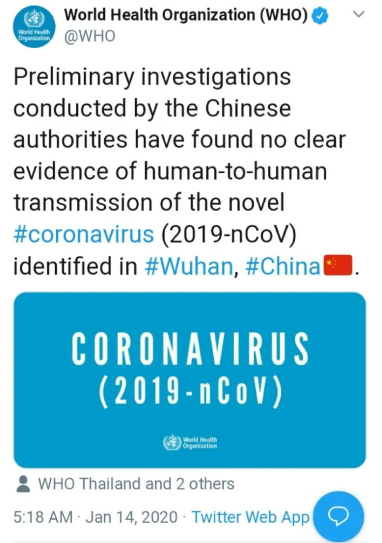
    

MERS?

>"To date, there is little data on the human-to-human MERS-CoV [transmission route"](https://www.sciencedirect.com/science/article/pii/S1879625717301773#bib1120)

Over and over and over, when good science and reason is applied, no concrete evidence of transmission of alleged viral or bacterial diseases can be proven.

As the apes with microscopes and newly-discovered bacteria were inadvertently growing their "Priesthood of Scientism" and "Scientists" were becoming the new all-powerful Priests, they realized many people were sick but they could not find bacteria to associate with the sickness so they cleverly assumed something smaller than a bacteria must be the contagious agents. Those clever apes! Thus, before having the ability to filter and much less see them, the mythical pathogenic virus expanded in the minds of scientists. For a while they thought viruses were proteins, but then... drumroll please...the apes got a new toy, the electron microscope, which allowed them to notice smaller things, which of course, had to be the pathogenic critters. As Science in general was growing at the expense of Religion, the public understandably saw bright and accomplished scientists as the new wise leaders and it became increasingly desirable for the Public-Faithful and thus politicians to give more money to this growing "Priesthood of Scientism". Government "investing in science", in other words, coercively redistributing wealth from the free and competitive private sector to a competition-immune Priesthood of slightly smarter apes became an increasingly popular belief which still haunts us today. Once again the slightly smarter apes gave credit to some apes-'great scientists' or growing bureucracy-Priesthood instead of freedom's emerging 'competitive knowledge discovery' or 'the market process' which is what was actually creating and spreading all the technology, information, and wealth necessary make rapid progress. As government investment grows the 'Priesthood of Scientism', young scientists are more motivated to inadvertently join it (which is of course always one breakthrough away from amazing cures) than they are in debunking bad science at their own expense. Who joins the Catholic Church to criticize its myths? Who wants to be the scientist-Priest that puts an end to the comfortable Scientist-Priest life by getting government to shut down the nearly $35 billion spent yearly in HIV research? This is a job for the Galileos and dissenters which brings us to the story of "The Perth Group" and Dr. Stefan Lanka.

###### The Virology Priesthood goes to Court and Loses. The evolved wisdom of the legal system.

Let us look deeper at the evolution of the HIV->DEATH myth. As already discussed, lifestyle and environmental factors were causing massive biochemical breakdowns in gay men leading some to die. Factors leading to the evolution of the myth were:

1. Scientists looking for answers, cures, and big bucks and glory too. Remember that petri-dish of 2% who are 100% charlatans-liars-exagerators-fearmongers and many others who show various degrees of negligence and how they can create these growing echo-chambers and social structures with various degrees of ignorance-negligence-malice, especially when looking the other way will bring a massive government contract? 

2. A gay community using their illness to criticize the Conservative-Religious-Raegan administration for not doing enough to help the culturally oppressed gay community find a cure.

3. Politicians and government bureaucrats like Fauci with an opportunity to be heroes and justify their bureaucracies.

4. Pharmaceutical companies looking for that massive government contract as they partner with the government.

As factors 1-4 are evolving in the early 1980s and spreading the ideas and incentive structure that would eventually coalesce in the HIV->DEATH myth, 'virologist' Dr. Robert Gallo, who would eventually be found guilty of research misconduct, claims that what he sees in some electron microscope images is the virus that is making people sick. Gallo had "claimed in 1975 to have discovered the first human retrovirus (HL23), but which turned out to be nothing more than pieces of DNA from three different sources of contamination." (Lanka) . This time Gallo's errors, negligence, or malice would provide the spark that ignited the myth. Before Gallo had even published his findings in peer-reviewed journals, on April 23rd, 1984 he and secretary of health and human services Margaret Heckler gave a press conference where Margaret mentions:

>"First, the probable cause of AIDS has been found: a variant of a known human cancer virus. Second, not only has the agent been identified, but a new process has been developed to mass produce this virus. Thirdly, with the discovery of both the virus and this new process, we now have a blood test for AIDS. With a blood test, we can identify AIDS victims with essentially 100% certainty."

As with Saddam Hussein's mythical Weapons of Mass Destruction and all the negligence, lies, and exaggerations that led to them, we have another example of mythical-hypothetical and ultimately fictitious bullshit leading to the expansion (at taxpayer expense obviously) of government-Priesthood and related myths.

We already touched upon one of those Galileos who stood up to the growing HIV-Priesthood in the form of Dr. Peter Duesberg, but there was another group of scientists who unlike Duesberg who believed HIV was a real virus but harmless, believed that there was no evidence of a pathogenic virus at all. Enter [The Perth Group](http://www.theperthgroup.com/), originally founded in 1981 in Perth, Western Australia. The three original members were the leader, biophysicist [Eleni Papadopulos-Eleopulos, physician Valendar F Turner and Professor of Pathology John Papadimitriou](https://www.youtube.com/watch?v=PQFxratWh7E). Later they were augmented with physicists Bruce Hedland-Thomas, David Causer and Barry Page and others. They really got to the root cause of the "complexity" from which the myth of Virology arose. They essentially showed how the countless interferences with cells and complexities reating to Electron Microscopy and the methods used in their experiments made it impossible for virologists to prove their claims and resulting hypothetical intellectual edifice known as 'Virology'. Stumbling upon the wisdom of 'The Perth Group' and thus the vaccination myth and the HIV->DEATH myth, and alarmed by a mandatory Measles vaccination program in Germany, Prof. Stefan Lanka, offered a 100,000 Euro reward to anyone who could prove the existence of the Measles virus.[(Lanka explains ordeal)](https://www.bitchute.com/video/MuBV8355mGe4/) German doctor David Bardens submitted 6 papers to the courts to force Lanka to pay, including John Enders' seminal paper upon which much of the Virology myth stands and eventually got him the Nobel Prize (1954). The lower German court accepted the submissions as sort of Gospel without the need to actually apply sound scientific principles in their examination and ruled in favor of Bardens. Lanka appealed the decision to a higher court where real examination of the papers would take place and the court rightly concluded that none of the papers, including Enders', could prove the existence of a virus. Bardens appealed, but the courts saw no need to re-examine. Notice how the entire "Priesthood of Scientism", especially in a country as technologically advanced as Germany, could have used all of its fancy technology to easily show that the virus exists, especially when you consider how much "science" and more is ultimately dependent on it. But the priesthood just remained silent, looking the other way, some Priests-Scientists spreading fear about the Faithful-unvaccinated dying due to heretical ideas. 

CovidMania made it obvious to many honest scientists how they were themselves part of a coercive priesthood following various myths. One of the biggest names to sort of wake up from such myths and thus become a heritic to the "Priesthood of Scientism" is Dr. Michael Yeadon, who was at one time the vice president and head of allergy and respiratory research in Pfizer. This one-time High-priest, when reached by no-pathogenic-virus proponents like Dr. Andrew Kaufman and Dr. Thomas Cowen, and further researching, came to the conclusion that there was in fact no great evidence of pathogenic respiratory viruses. In interview he mentions: 

>"I realized over time I could no longer maintain my understanding of respiratory viruses as I thought I knew them and then I learned a new bit of information recently and it was just, it collapsed the possibility that respiratory viruses exist at all. [They don’t."](https://genkimanquest.substack.com/p/dr-mike-yeadon-on-respiratory-viruses)

It is important to realize how the myths homo sapiens follow are very easy to debunk, they just need what should be obvious, freedom of speech, freedom from coercion, and the emerging 'competitive knowledge discovery'. Here we once again have to remind ourselves that things like a modern legal system and its rules of evidence, which provide a good framework or algorithm for discovering the truth, free of human-tribal influence and coercion, and incentives that prevent people from lying or committing fraud, is something that evolved independent and usually in spite of man's reason. Man's reason usually leads to a 'great leader' who must abolish legal constraints to accomplish the great monkey-plan, the great war against the evil-doers-others, central economic planning, etc. The courts thus provide a far better environment for discovering the truth in science than the regulatory Priesthoods like the AMA, FDA, and various government and thus competition-immune bureaucracies-Priesthoods. It is the lawsuits in sound legal environments, not the AMA, FDA and various government Priesthoods which really protect customers and help discover the truth. There would have been no witch burnings, slavery, world wars, or any of the countless myths the apes have fallen for which require coercing each other for some purpose, if such reasons-myths had to prove their efficacy or validity in a relatively modern court of law. The existing medical priesthood tried to silence Prof. Timothy Noakes, but fortunately South Africa's existing legal framework defended freedom from the existing Priesthood-myths, and we saw the same with Lanka and related myths. There is one more myth, the biggest and most dangerous of them all, where yet again, once the myths entered the courtroom, they fell apart.

##### Covid19 and the inevitable economically ignorant push for disastrous Global Central Planning

Why did mankind fall for this Corona-hype, the lockdowns and related disastrous economic policies we will continue to see? How did this totally unnecessary World War One-like Lenin-Like calamity fool so many experts, leaders, including some of our "brightest minds" into such needless socioeconomic chaos and misery? Is it the result of some "conspiracy" by people like Bill Gates and Fauci, etc.? *Mostly no.* Was religious oppression the result of some "conspiracy"? No. How about slavery? of course not as well. What about the spread of Socialism throughout much of the world? Was that too a "conspiracy" by Lenin, Mao, Hitler, Roosevelt, etc.? No, all of these disasters and the emergence of the very personalities which executed them are "indeed the result of human action, but not the execution of any human design". The spread of Socialism and Lenin's Bolshevik-'Central Planning' revolution and what for lack of a better word I'll refer to as "Coromunism" have important similarities. Let's discuss some of the factors that led to the emergence and current execution of Coromunism.

Since the world is becoming increasingly interconnected-complex, it is understandable how some hypothetical potential pathogen, which in a smaller tribal world might hypothetically have wiped out a tiny tribe, might now wipe out a huge chunk or perhaps even all of humanity. It is understandable how this mindset-ideology-hypothesis would almost inevitably lure an increasing number of concerned minds, like:

1. Bill Gates for example in 2015: "If anything kills over ten million people in the next few decades. It's most likely to be a highly infections virus", also "Whether it occurs by the quirk of nature or at the hand of a terrorist, epidemiologists show through their models that a respiratory-spread pathogen would kill more [than 30 million people"](https://youtu.be/o7A_cMpKm6w?t=392) 

2. Anthony Fauci in 2017:  "there will be a surprise outbreak … History, and the history of the past 32 years that I’ve been the director of NIAID, will tell the next administration that there’s no doubt in anyone’s mind that they will be faced with the challenges that their [predecessors were faced with."](https://www.wired.com/story/an-oral-history-of-the-pandemic-warnings-trump-ignored/). Fauci's 'historically inevitable' arguments also mirror those of the Marxist-Communists who were just as convinced that Communism-'Central Planning' was a historical inevitability. The 'historically inevitable' aspect further helps attract minds who both want to be on 'the right side of history' and to further accelerate the perceived improvements. There are many very bright and surely concerned and caring people like famous statistician Nassim Taleb who are in some ways glad that even if the reaction to CovidMania ended up being somewhat overblown, that it somehow helped prepare society for a future one, and might thus ultimately prove to be a good thing down the road. 

3. Michael Ryan, the Executive Director of the World Health Organization Health Emergencies Programme, on October 19, 2019, about 6 weeks before the Covid hysteria really began: "I fully expect that we will be confronted by a fast moving [highly lethal pandemic of a respiratory pathogen"](https://www.youtube.com/watch?v=PZu4K9js_Q0)

Given the global-borderless nature of this potential problem, as well as the potential-hypothetical-assumed need to require global compliance, it is understandable how anyone who attempts to tackle this hypothetical problem without the proper understanding of economics finds himself in the role of a central planner who pretty much has no choice but to persuade leaders into a potentially world-wide coercive solution which can obviously have you portrayed as some very bad guy, which is something Bill Gates is understandingly increasingly having to deal with. Given the nature of this hypothetical problem, the more this idea spreads through the minds of people, especially the medical monopolies-CDC-WHO who are inadvertently incentivized to see their budgets grow for their needed "heroic efforts", the more motivated and somewhat morally justified they are in exaggerating dangers and trying to implement what is essentially a competition-less central plan. Again, we must focus on how numerous ideas and incentives, and more importantly, economic fallacies leading to competitionless-central-planning, begin spreading and shaping the environment where eventually some spark leads them to coalesce behind a more coordinated plan which gives the impression that they were a "conspiracy" when in reality they weren't. 

In addition to all the standard economic fallacies which continue to grow and is evidenced by the growth in popularity of things like "democratic socialism", we have the growing complexity of the social order which the slightly smarter apes understandably feel needs some global central planner-regulator-experts to improve which brings us to the increasingly popular "The Great Reset"(TGR) initiative of the World Economic Forum. TGR should not be seen as some vast sinister conspiracy. Like Communism, it is just the inevitable result of slightly smarter apes dealing with a socioeconomic complexity they don't understand and the perverse incentives that grow such central planning bodies. 

The thinking of the economically ignorant "experts" goes as follows "the people and businessmen and 'capitalists' are too focused on their own narrow interests to worry about saving mankind from the coming pandemic-'climate change'-etc, there is seemingly no profit for them to make here" and so on. Again, what we want to understand is the emergence of the ideology and incentive structure that eventually materializes itself into what is now clearly before us, the rapid growth of a new economic-freedom stifling 'central planning' bureaucracy-Coromunism, just like the one Lenin created. Those of us who have had the fortune of stumbling upon Mises-Hayek can easily see how the economic fallacies and perverse incentives and 'echo chamber' of central planning ultimately financed by 'money creation'-inflation-central banking' is what spreads-materializes. If Bill Gates, Fauci, and the countless "experts" who are more and more convinced of the inevitable coming of such pandemic really understood how the world-economy works and how to make it better and are still worried about some superbug wiping out mankind, which I personally believe there is little chance of happening, instead of trying to pair up with the numerous top-down-competition-less-bureaucratic-paralyzing world-government health bodies and political leaders, these men should be helping spread an understanding of basic economics, privatization, economic competition, etc., so that rapid technological progress would allow us to both, better asses whether such a pandemic is even possible and the probability that it might happen, and have superior technological ability to deal with it or prevent-mitigate it should it arise with the proper cost-benefit analysis that only the free decisions of billions of people can create. In other words, they should be spreading an understanding of freedom and competitively funding related research and publishing findings-etc. Actually, they should also be encouraging more babies and a massive increase in world population so that 'the market process' has even more human brains with which to become even smarter. But obviously these men are economically clueless and are thus trying to coerce the entire planet to go along with their inferior information-mythology and oh so much more and as they do this they are destroying the world economy and thus civilization, just like Lenin and the similarly well-intentioned slightly smarter apes of his day. 

The economic ignorance leads to errors and even personalities which repeat themselves. Bill Gates is essentially a new Albert Einstein, a smart person who achieved a lot in a particular field, but whose economic ignorance is a recipe for the destruction of civilization. To my knowledge Bill Gates has NEVER mentioned Ludwig von Mises or F.A. Hayek so he simply does not have the slightest clue how the world really works and thus inevitably, with the best of intentions-negligence-arrogance or whatever the combination of factors might be, he becomes a coercive 'Central Planner'-Totalitarian-Socialist (in this regard). Mises easily predicted their personalities and inevitable totalitarian aims:

>"The outstanding fact about the contemporary ideological situation is that the most popular political doctrines aim at totalitarianism, the thorough abolition of the individual's freedom to choose and to act. No less remarkable is the fact that the most bigoted advocates of such a system of conformity call themselves scientists, logicians, and philosophers."

As Hayek mentions:

>"If socialists understood economics they wouldn't be socialists."

People like Fauci, Gates, World Economic Forum Chairman Klaus Schwab and that increasing number of like-minded 'single-minded idealists' who have invested so much of their lives and gain so much satisfaction from feeling like their central plans are so beneficial or vital for mankind, just like with Lenin and the Socialist-Communists, are often the most dangerous and detached from the immense suffering and tyranny they are causing. Hayek explains:

>“The movement for planning owes its present strength largely to the fact that, while planning is in the main still an ambition, it unites almost all the single-minded idealists, all the men and women who have devoted their lives to a single task.  The hopes they place in planning, however, are the result not of a comprehensive view of society but rather of a very limited view and often the result of a great exaggeration of the importance of the ends they place foremost.  This is not to underrate the great pragmatic value of this type of men in a free society like ours, which makes them the subject of just admiration.  But it would make the very men who are most anxious to plan society the most dangerous if they were allowed to do so—and the most intolerant of the planning of others. From the saintly and single-minded idealist to the fanatic is often [but a step.”](https://lpmaryland.org/liberty-quotation-day-planning-single-minded-idealist/)

Again, Bill Gates, whose 'single-minded' idealism and ambition did the world so much good via his management of Microsoft, is applying the same drive and 'single-minded' focus in an economically disastrous manner. He has been one of the biggest proponents of the disastrous lockdowns and looking the other way regarding the now-obvious relative harmlessness of the Coronavirus pathogen. On April 30, 2020 long long long after it has been shown that the fatality of CV is hardly different than that of the regular flu he wrote an article titled ["What you need to know about the COVID-19 vaccine"](https://www.gatesnotes.com/Health/What-you-need-to-know-about-the-COVID-19-vaccine) with a subheading which reads "Humankind has never had a more urgent task than creating broad immunity for coronavirus". Somehow the 3 pounds of tissue that make up the brain in Gates' head is thoroughly convinced that the nearly 8 billion people in the planet must be coerced to go along with injecting themselves with a vaccine he expects will be ready in 18 months. As of 12/20/2020 according to the CDC 1 out of 35 people taking Covid vaccines are being incapacitated to the point where they are "unable to perform normal daily activities, unable to work, required care from doctor or [health care professional"](https://www.cdc.gov/vaccines/acip/meetings/downloads/slides-2020-12/slides-12-19/05-COVID-CLARK.pdf?fbclid=IwAR1WXWqGYpckNHV-lBgmlzT85q5gTtHx_FKe3gKS3D6qhVlZ_0wownLxDxw) And these are just the easily noticeable immediate effects. Again, given this initial damage, and the immense complexity of the biochemical order, how can one be sure that no longer-term effects will occur? Especially in vaccines that are using new technology which has not even been verified long term with animal experiments? But as the great promoter of TV products, Billy Mays would say, "But wait, there's more!" The same incredible 3 pounds of flesh in Gate's head can save us yet again! This time via his new book "How to Avoid a Climate Disaster: The Solutions We Have and the Breakthroughs We Need". 

In this section's opening paragraph we asked regarding CovidMania:  "Is it the result of some "conspiracy" by people like Bill Gates and Fauci, etc.?" And proceeded with *Mostly no.* Let us once again refer to the Bolshevik revolution. The deeper causes were mankind's ignorance of economics even though one could also say that it was an evolving conspiracy by Lenin and his like-minded communists. The economically ignorant central planning 'echo chamber' and 'incentive structure' that currently dominates the thinking of people like Gates and Klaus and numerous others could very well have reached a point where in order to get the world's governments-leaders to go along with their wonderful global governing bodies, that they have spread their ideology so much virtually guaranteeing that the CovidMania would arise with the next flu-like bug. Consider the "Event 201: A Global Pandemic Exercise" backed by John Hopkins University, The Bill and Melinda Gates Foundation and The World Economic Forum, which supposedly occurred on Friday Oct. 18th, 2019 in NYC coincidentally a few months before CovidMania exploded. This is NOT some hidden sinister conspiracy, this is for all the good citizens to learn about and participate and [available here](https://www.centerforhealthsecurity.org/event201/about). The first paragraph explains the purpose:

>"Event 201 was a 3.5-hour pandemic tabletop exercise that simulated a series of dramatic, scenario-based facilitated discussions, confronting difficult, true-to-life dilemmas associated with response to a hypothetical, but scientifically plausible, pandemic. 15 global business, government, and public health leaders were players in the simulation exercise that highlighted unresolved real-world policy and economic issues that could be solved with sufficient political will, financial investment, and attention now and in the future"

Further...

>"In recent years, the world has seen a growing number of epidemic events, amounting to approximately 200 events annually. These events are increasing, and they are disruptive to health, economies, and society. Managing these events already strains global capacity, even absent a pandemic threat. Experts agree that it is only a matter of time before one of these epidemics becomes global—a pandemic with potentially catastrophic consequences. A severe pandemic, which becomes “Event 201,” would require reliable cooperation among several industries, national governments, and key international institutions.

>Recent economic studies show that pandemics will be the cause of an average annual economic loss of 0.7% of global GDP—or $570 billion. The players’ responses to the scenario illuminated the need for cooperation among industry, national governments, key international institutions, and civil society, to avoid the catastrophic consequences that could arise from a large-scale pandemic.....

>"Recommendations
>The next severe pandemic will not only cause great illness and loss of life but could also trigger major cascading economic and societal consequences that could contribute greatly to global impact and suffering. The Event 201 pandemic exercise, conducted on October 18, 2019, vividly demonstrated a number of these important gaps in pandemic preparedness as well as some of the elements of the solutions between the public and private sectors that will be needed to fill them. The Johns Hopkins Center for Health Security, World Economic Forum, and Bill & Melinda Gates Foundation jointly propose these [recommendations](https://www.centerforhealthsecurity.org/event201/recommendations.html).

From the "recommendations" page we have:

>"A call to action

>The next severe pandemic will not only cause great illness and loss of life but could also trigger major cascading economic and societal consequences that could contribute greatly to global impact and suffering. Efforts to prevent such consequences or respond to them as they unfold will require unprecedented levels of collaboration between governments, international organizations, and the private sector."

So... How does one interpret all this? What a coincidence!? Could all this preparation simply have spread to so many minds that when the next flu-like illness arose all the "experts" simply went along with this plan because it had been fresh on their minds? Did some ideologues purposely exaggerate in the hopes of getting more attention and the necessary resources to further their wonderful Global Plans for mankind? Was this just a coincidence? Remember all those clueless scientists in the "The Conservation of Species" section who essentially want homo sapiens to perish? Why should we not expect their ignorance to continue to spread and eventually materialize in disastrous errors-policies? Even if this had been "plotted" to various degrees along the way as some feel, the deeper causes, are once again economic ignorance. Lenin did not destroy much of the 20th century because he was some sinister guy who just didn't want to get a real job. Who really wants to be remembered for having caused so much suffering? And the same likely applies to Bill and Melinda and Fauci and all of our Central Planners-Priests. These people are just totally clueless. They are the inevitable Priesthood that arises from the ignorance and tribalisms of the masses. I have little doubt on my mind that if Bill and Melinda could be reached with the vital Mises-Hayek-friends ideas, that they would harness the power of 'the market process' and thus freedom to help civilization. 

## Concluding remarks.

If one looks at homo sapiens during the last 100,000 years it is easy to see that civilization has been a sort of cultural mutation, an anomaly (although one that was likely bound to happen). This miracle needs further miracles to happen. It was already miraculous that Mises-Hayek-friends managed to save Western Civilization in the 1920s-1940s.

When one looks at the [biographies of fellow freemarketeers](https://cdn.mises.org/I%20Chose%20Liberty%20Autobiographies%20of%20Contemporary%20Libertarians_2.pdf?fbclid=IwAR3FQCtUReWBaMgiZGCdTGeN4sjT6eaz9Tqq0Ak81ueW5BDK8yggXb4yLUc) it is easy to notice how prior to stumbling upon the proper understanding of economics most were essentially "wild" humans, Socialists-Communists to various degrees. This just makes sense, our nature is that of the 'Law of the Jungle', how freedom leads to order instead of chaos is definitely not 'in our genes'. Jealousy, vilification, tribalism... It all seems so obvious when we stand on Mises-Hayek's shoulders. Supposedly the Dodo bird quickly went extinct because it had not evolved to recognize humans as potential dangers, we similarly just line up for central planning and self-destroy over and over and over and over. 

Most of us mistakenly believe that the best thing we could do for ourselves is to work hard, be productive, etc. Sounds reasonable right? Yes and no, although those things are important, perhaps it is even more important to join Mises in his "intellectual battle". If mankind proves to be an evolutionary dead end in the near future as certainly looks to be the case, it will not be because of the "evil" or clueless politicians and public. It will be because those who have had the fortune of stumbling upon these and like-minded men's ideas failed to educate fellow citizens. Henry Hazlitt had the right ethos, on his 70th birthday, November 29th, 1964. He gave a wonderful speech in front of many of his friends including the great Ludwig von Mises, from which we briefly quote:

>"We Haven't Been Good Enough

>I am going to give what is no doubt a terribly oversimplified answer to that question. In the first place, we are almost hopelessly outnumbered. Our voices are simply drowned out in the general tumult and clamor. But there is another reason. And this is hard to say, above all to an audience of this sort, which contains some of the most brilliant writers and minds in the fields of economics, of jurisprudence, of politics, not only of this age but of any age. But the hard thing must be said that, collectively, we just haven't been good enough. We haven't convinced the majority. Is this because the majority just won't listen to reason? I am enough of an optimist, and I have enough faith in human nature, to believe that people will listen to reason if they are convinced that it is reason. Somewhere, there must be some missing argument, something that we haven't seen clearly enough, or said clearly enough, or, perhaps, just not said often enough.

>A minority is in a very awkward position. The individuals in it can't afford to be just as good as the individuals in the majority. If they hope to convert the majority they have to be much better; and the smaller the minority, the better they have to be. They have to think better. They have to know more. They have to write better. They have to have better controversial manners. Above all, they have to have far more courage. And they have to be [infinitely patient."](https://mises.org/library/hazlitts-reflections-70)

Mankind's problems are obviously the result of the economic ignorance of the public which then, via democracy, reflects itself in the disastrous competition-less central planning bureaucracies the well-intentioned public always fall for. It is their ignorance, that of your neighbor, former self, family members, etc. that is the root of the problems, not whatever slightly smarter ape they vote for and the inevitable corruption that emerges in the competition-immune bureaucracies/Priesthoods. And the very very very root of this ignorance, as especially shown by Menger, is the fact that money and emerging 'market process' and 'Social Organism', are "indeed the result of human action, but not the execution of any human design" and hardly anyone in the planet, and much less so people of significant influence, are aware of this. We are flying blind!  

Mises:

>"... in the field of social organization and economic policies. Here the best theories are useless if not supported by public opinion. They cannot work if not accepted by a majority of the people. Whatever the system of government may be, there cannot be any question of ruling a nation lastingly on the ground of doctrines at variance with public opinion. In the end the philosophy of the majority prevails. In the long run there cannot be any such thing as an unpopular system of government...The supremacy of public opinion determines not only the singular role that economics occupies in the complex of thought and knowledge. It determines the whole process of human history... great men cannot succeed in adjusting social conditions to their plans if they do not convince public opinion.

>The flowering of human society depends on two factors: the intellectual power of outstanding men to conceive sound social and economic theories, and the ability of these or other men to make these [ideologies palatable to the majority."](https://mises.org/library/human-action-0/html/pp/920)
 

Since it is a "battle of ideas" against economic ignorance for which nobody is really "to blame", we should try to keep our cool by not turning a problem of economic ignorance into a moral one which as Mises told us only leads to "irreconcilable conflict". Hayek also explains:

>"When I stressed that is genuine intellectual error that we have to fight, what I meant to bring out is that we ought to remain aware that our opponents are often high-minded idealists whose harmful teachings are inspired by very noble ideals. It seems to me that the worst mistake a fighter for our ideals can make is to ascribe to our opponents dishonest or immoral aims. I know it is sometimes difficult not to be irritated into a feeling that most of them are a bunch of irresponsible demagogues who ought to know better... if we have not yet convinced them, the reason must be that our arguments are not yet quite good enough, that we have not yet made explicit some of the foundations on which our conclusions rest. Our chief task therefore must still be to improve the argument on which our case for [a free society rests."](https://fee.org/resources/fa-hayek-on-fee-and-leonard-read/)

Thus it is vitally important that we do not vilify or see the clueless bureaucrats-Faucis-etc. as malicious. Being too critical or harsh on the bureaucrats will make it harder for them to be open to the right ideas, or downright dangerous. 

We should focus on our most 'viral ideas', those ideas that can both explain the most as quickly as possible and also cause enough doubt on what the current crop of clueless "experts"-apes are recommending(essentially more regulation-planning and 'Central Bank Socialism' by creating money to manage the social order). [In his essay "The Task Confronting Libertarians" Hazlitt advised us to focus](https://mises.org/library/task-confronting-libertarians) on the basics on monetary policy and inflation because it is easy to understand, teach, and immediately lets people know that it is the Central Banks that are responsible for the inflation, rising prices, and general growth of government:

>“This brings me, finally, to one more single issue on which all those libertarians who lack the time or background for specialized study can effectively concentrate. This is in demanding that the government provide an honest currency, and that it stop inflating.

>This issue has the inherent advantage that it can be made clear and simple because fundamentally it is clear and simple. All inflation is government made. All inflation is the result of increasing the quantity of money and credit; and the cure is simply to halt the increase.

>If libertarians lose on the inflation issue, they are threatened with the loss of every other issue. If libertarians could win the inflation issue, they could come close to winning everything else. If they could succeed in halting the increase in the quantity of money, it would be because they could halt the chronic deficits that force this increase. If they could halt these chronic deficits, it would be because they had halted the rapid increase in welfare spending and all the socialistic schemes that are dependent on welfare spending. If they could halt the constant increase in spending, they could halt the constant increase in government power."

Hayek's focus on how competition spreads information and superior order and how governments prevent-slow-down this process is also easy and a powerful way to get people closer to the proper understanding of how private property leads to economic freedom which then leads to competition and superior order. Concentrating on reaching famous people seems like a simple and great strategy. There is no reason why famous athletes and movie stars and other "influencers" can't understand how the world works and then quickly spread such wisdom to the fans who admire-trust them. Wealthy people have the advantage that they can voice potentially unpopular or misunderstood opinions that could cause people to fear conflicts at work-etc. Every one of us is just one or two connections away from a very famous and potentially influential person.  

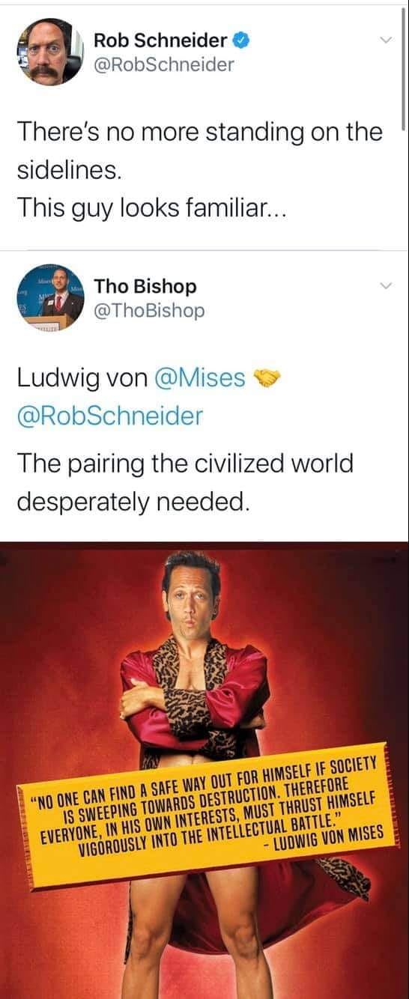

In his presidential runs of 2008/2012 Congressman Dr. Ron Paul, by running for office and thus placing himself where concerned citizens look for answers, became a great beacon of economic education and so much more. If we have a mini Ron Paul in every political race, likewise educating the public, overcoming the ignorance should quickly follow. 

Mises:

>"the masses follow the lead of the people we call educated. Once convince these, and the game is won."

The astute young programmers and dreamers that overwhelmingly make up the world of Bitcoin and Cryptocurrencies is already dominated by people who have caught up to Mises/Hayek and their so-called 'Austrian School' of economists. The creators of [Bitcoin were fervent intellectual descendent of Mises](https://nakamotoinstitute.org/origins-of-bitcoin/). The second largest cryptocurrency, Ethereum, was created by Vitalik Buterin who nicely sums up the ongoing intellectual revolution when he mentioned that [“I thought Austrian economics was like the world”.](https://www.youtube.com/watch?t=30&v=VosfxChTxVg&feature=youtu.be). Interest in Bitcoin-cryptocurrencies inadvertently achieves what Hazlitt advised above, it teaches the [basics of inflation to millions.](https://hayekian.medium.com/how-bitcoin-spreads-austrian-economics-and-thus-worldwide-intellectual-revolution-9df49929725d)

Unimaginable peace and prosperity could be just around the corner!. As the great Murray Rothbard recommends in ["The Case for Radical Idealism"](https://mises.org/library/case-radical-idealism). We should go BIG! We just have to help our fellow citizens lose their fear of economic freedom and thus economic ignorance. The bigger the tax-cut, the bigger the job losses-wages in the public sector will be, but just as quickly, the bigger the job gains-wages will be in the private sector as tax-payers now have that additional wealth to spend. All that will happen is that a public sector employee loses his public sector job and quickly finds a private sector one. Instead of getting his paycheck-wealth by coercing the taxpayer as part of a massively-inefficient government monopoly and thus providing very little in return, he now joins a much more productive private sector order-company that is growing-hiring because tax-payers are now giving them more business-money-wealth with which to hire-sustain him. All wealth that is given by government has to be taken away coercively (or sneakily via inflation) from others who in a sense gave up a part of their lives to produce it. Whenever you get something from the government you are essentially consuming another person's life/order. This is not some moralist crusade against government, we just want to understand and minimize such inefficient coercion which when properly understood, most of us will find it immoral. The better people understand economics the more they will be willing to go along with these transitions to skyrocketing prosperity, even those who currently have relatively well-paid government jobs. Again, economic education is the key.

Decentralization, or just having one massive peaceful and well publicized tax rebellion could do it or provide yet another spark of education from which something greater can arise. If just 70%-80% of all citizens in one small city in the country politely explained their economic arguments for not paying income taxes, or secede and become a new small country like Lichtenstein, and do so in a manner that does not interfere with the private property of people, it could become an immense beacon of publicity and education. It is one thing for some religious people to hunker down in some compound and say God told them it was immoral to pay taxes and Bill Gates is an agent of the Devil, so the economically ignorant public, would see them as nuts and want them to be made an example of and taken to jail. But if the "rebels" use this to properly educate the public about sound economic policy, things should be different. 

Let us further discuss some simple ways to quickly get mankind on a path to unimaginable prosperity. The quicker we can help people overcome their fear of freedom and clearly see the rapid prosperity we can have the better. 

Abolish minimum wage laws and other restrictions on labor like minimum age requirements and obviously all the Coromunism related restrictions. This would allow everyone to work adding a tremendous boost to the economy and the very morals of people. Coromunism is over! This would greatly reduce crime since former “criminals” will now be able to find employment. It is true that some of their first jobs might not pay much initially, but with a few months of experience and the reputation that also comes from this, their productivity would rise and thus would their income. The ability of children and teens to work will greatly reduce whatever little poverty exists in the USA and help to further shape a productive character, one that not only values hard work, honesty, competition, and so on, but a character that appreciates and expects those same values from other individuals because teamwork and mutual respect is crucial for successful competition. Hard working and honest people inevitably force others to be likewise. The sooner and easier we make it for people to integrate themselves into the private sector and its attitude-shaping incentives the better. Public education should be abolished immediately as well. With places like http://www.khanacademy.org/, Wikipedia.org, and the many free educational sites and games and the ability to use video-web conferencing via programs like Skype-Zoom to talk to a knowledgeable person it should be obvious to realize that there is little need to spend thousands of dollars to learn the basic reading, writing, and arithmetic skills needed to move on to more challenging concepts, and much less the need for expensive temple-or-prison-like structures we call “schools”. The war on drugs should be ended immediately and those that have been incarcerated or on parole because of it released from such bondage. At its core the drug war is simply coercion by a group of haters against others. This would turn over a million people-prisoners into wealth producers instead of wealth consumers, reunite parents with children and once again integrate people into the productive-morals-shaping private sector. The violent drug cartels that are destroying Mexico and other Latin American countries would also disappear. And also greatly help black people who are hit hardest by the drug war. 

If we reach enough of an understanding of freedom and economics to begin to discuss these things in the mainstream then we have definitely reached enough of an ideological change where we can drop our borders and encourage anyone who wishes to do so to come to the US. The statue of liberty will once again be free to welcome people with her beautiful and compassionate message:

>“Give me your tired, your poor, Your huddled masses yearning to breathe free, The wretched refuse of your teeming shore. Send these, the homeless, tempest-tossed to me, I lift my lamp beside the golden door”

Just a slight increase in prosperity and the spread of freedom will quickly alleviate poverty, ignorance, and the extremist ideologies. This will greatly help soothe the chaos in the Middle East. Extremist religious views, those of Israeli settlers as well as the Islamic kind will quickly see their ideologies lose their appeal and lead to the melting away of the Israeli-Palestinian conflict. Ouch, a moose is biting us. 

Please consider leaving a review in amazon.com and joining our shared book project at www.libertyspeaks.world

 

 

## Bibliography

1 olenazelenska_official Instagram. https://www.instagram.com/p/ByK1DdJCwbj/?hl=en

2 @KremlinRussia_E twitter. https://twitter.com/kremlinrussia_e/status/605428750122119168

Dershowitz, Alan. Interview with Shalom TV. https://www.youtube.com/watch?v=-FscSs-_IL0 

Einstein, A. (1949, May). Why Socialism. Monthly Review, http://www.monthlyreview.org/598einst.htm.

Hazlitt, H. (1988). Economics in One Lesson: The Shortest and Surest Way to Understand Basic Economics. Three Rivers Press.

Hayek, F. A. (1932). Prices and Production. George Routledge & Sons, LTD.

Hayek, F. A. (1973). Law Legislation and Liberty (Vol. I Rules and Order). Chicago: The University of Chicago Press.

Hayek, F. A. (1976). Law Legislation and Liberty (Vol. II The Mirage of Social Justice). Chicago: The University of Chicago Press.

Hayek, F. A. (1978). The Constitution of Liberty. The University of Chicago Press.

Hayek, F. A. (1979). The Counter Revolution of Science. Liberty Fund, Inc.

Hayek, F. A. (1981). Law Legislation and Liberty (Vol. III The Political Order of a Free People). The University of Chicago Press.

Hayek, F. A. (1988). The Fatal Conceit. Routledge.

Hulsmann, JÖRG GUIDO.(2007). Mises: The Last Knight of Liberalism. Auburn, AL: Ludwig von Mises Institute.

Keynes, J. M. (1936). The General Theory of Employment, Interest and Money. https://www.files.ethz.ch/isn/125515/1366_KeynesTheoryofEmployment.pdf

Keynes, J. M. (1963). Essays in Persuasion. New York: W. W. Norton & Company.

Lenin, V.I. (1922). Political Report of the Central Committee to the 11th Congress of the Russian Communist Party, March 27, 1922, Collected Works, Vol. 33, p. 279

Menger, C. (2007). Principles of Economics. Auburn, AL: Ludwig von Mises Institute

Mises, L. (1981). Socialism: An Economic and Sociological Analysis. Indianapolis: LibertyClassics.

Mises, L. (1955). Inequality of Wealth and Incomes. Article first appeared in the May 1955 issue of Ideas on Liberty, published by FEE.

Mises, L. (1962). The Ultimate Foundation of Economic Science.  Princeton, New Jersey:  D. VAN NOSTRAND COMPANY, INC.

Mises, L. (1985). Liberalism.  Irvington-on-Hudson, New York:  The Foundation for Economic Education, Inc.

Mises, L. (1998). Human Action Scholars Edition. Auburn, AL: Ludwig von Mises Institute.

Mises, L. (2006). The Causes of the Economic Crisis: And Other Essays Before and After the Great Depression. (P. L. Greaves, Ed.) Auburn, AL: Ludwig von Mises Institute.

Mises, L. (2009). Memoirs. Auburn, AL: Ludwig von Mises Institute.

Panne, J.-L., Paczkowski, A., Bartosek, K., Margolin, J.-L., Werth, N., & Courtois, S. (1999). The Black Book of Communism: Crimes, Terror, Repression. Harvard University Press.

Paul, Ron. (2004). Mises and Austrian Economics: A Personal View. Auburn, AL: Ludwig von Mises Institute.

Salerno, Joseph T. (2006). War and Inflation: The Monetary Process and Implications. Presented at the Mises Circle in Manhattan: The Fed and War Finance. http://www.mises.org/multimedia/mp3/misescircle-ny06/Salerno.mp3

Shapiro, Ben. (2008). Jimmy Carter, emissary of evil.  LONG BEACH PRESS TELEGRAM. https://www.presstelegram.com/2008/04/16/ben-shapiro-jimmy-carter-emissary-of-evil/

Smith, Adam. (n.d.). The Theory of Moral Sentiments.

Spencer, H. (1853). Essay: Over-Legislation. https://www.econlib.org/book-chapters/chapter-essay-over-legislation/