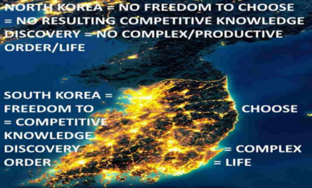
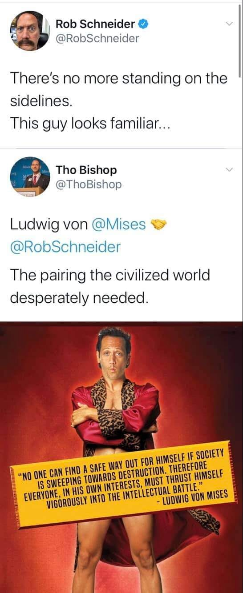

# Less Marx, More Mises

## Preface.

Welcome to the 'Less Marx More Mises' book!. This book-project is a collaborative Open Source project put together by the increasing number of people who feel like they have had the immense fortune of having stumbled upon the proper understanding of economic freedom (and thus how the world works) as provided by the legendary economists known as 'The Austrian School of Economics'. 

Just like the Linux operating system can be continuously improved and propagated by many people, we likewise hope that the Open Source nature of this project motivates others to both improve it and speak on its behalf thus hopefully maximizing its reach. If you would like to learn more and contribute please visit http://www.libertyspeaks.world. 

## Introduction: Worldwide Misesian Free Market Intellectual Revolution or Bust

Most people hope that some great intellectual comes along and provides mankind with a great understanding of the world that can get us on a path to peace and prosperity. Plenty of intellectuals are constantly looking for fame and glory by providing such an understanding.

For example, arguably one of today's "leading intellectuals" is Yuval Noah Harari the author of the wildly popular 'Sapiens:  A Brief History of Humankind' which has over 65,000 mostly glowing reviews and recommended by today's leading personalities like Obama, Bill Gates and Mark Zuckerberg. Over seven years after its initial publication in 2015, it is still at the top of numerous amazon.com categories. There is a section titled 'The Capitalist Hell' where he writes:

>"Capitalism has killed millions out of cold indifference coupled with greed."

Mr. Harari is deeply mistaken. He and his book are popular not because they are great but because they reinforce and appeal to the leading fallacies of our day. Surely Pope Urban II's views as he launched the Crusades were popular, and so was Karl Marx's Communist manifesto which is sadly the #2 best-seller in Amazon.com's 'Political Philosophy' category. The world is in chaos, because, as we will sooon show, its 'leading intellectuals' are essentially clueless.  

As we and like-minded friends hope to show, what is more likely to be the case is that the great intellectuals we hope explain the world and get mankind on a path to prosperity lie in the past and are commonly referred to as 'The Austrian School of Economics', but their ideas are just still ahead of our time.
Obama, Gates, Zuckerberg,  Hariri and today's 'leading intellectuals', via their global coercive central plans, are once again, inadvertently, and often times with the best of intentions, destroying civilization. 

As Ludwig von Mises wrote over 100 years ago:

>"The intellectual leaders of the peoples have produced and propagated the fallacies which are on the point of destroying liberty and Western civilization. The intellectuals alone are responsible for the mass slaughters which are the characteristic mark of our century. They alone can reverse the trend and pave the way for a resurrection of freedom."

Mises also tells us:

>"The flowering of human society depends on two factors: the intellectual power of outstanding men to conceive sound social and economic theories..."

This part has already been done by the so-called 'Austrians'. Mises continues:

>"and the ability of these or other men to make these ideologies palatable to the majority."

It is this latter part which the authors of this book and like-minded friends all over the world believe we must focus on.

Among the numerous members of the so-called 'Austrian School' economists, we have chosen Ludwig von Mises as the standard bearer for our book and theme because his achievements and 'ethos' make him the ideal role model for those us us looking for the wisdom and inspiration needed to quickly get mankind on a path to prosperity. Arguably no single human being in the last 120 years has done so much, both intellectually, and in terms of political manouvers, to save mankind from the economic ignorance that led to Communism and remains the source of virtually all of our current socioeconomic problems, than Mises.

Imagine you had a time machine and went back in time about 300 years to Salem, Massachusetts during the famed Salem witch trials where 19 women were hanged for witchcraft, and told people that the world could function much better if there was no slavery, that women should have the same rights and freedoms as men, that homosexuality should not be criminalized and seen as part of homo sapiens, and that six million years ago we had a common ancestor with chimpanzees (we’ll assume they know what chimps are). People would see you as some devilish monstrosity spreading heretical ideas and quickly “conspire” to kill you. Would this mean that the people of the time were somehow dumb or malicious? Or members of some “vast conspiracy” of “bad guys” or “special interests” intent on taking away your freedoms? Of course not. The people would be fellow homo sapiens acting based on the prevailing myths and incentive structures of the times. If by our modern standards pretty much everything about how people saw the world 300 years ago could be understood as myths, in other words, as “widely held but false beliefs or ideas”, why should we not be open to the idea that we too are likewise immersed in mythology?

Since myths are ideas, how do we discover the best ideas, determine their validity, usefulness and spread them? How do we discover the best information with which to guide our actions and order mankind?

Among numerous great free-market economists of the ‘Austrian School’, Mises' pupil and 1974 Nobel Laureate F.A. Hayek([Mick Jagger’s favorite economist](https://www.youtube.com/watch?v=0pCZo6iXOfk)), in some of his seminal writings like ‘The Use of Knowledge in Society’ and the aptly titled ‘Competition as a discovery procedure’ helped us realize that the economic competition which emerges from people’s freedom to choose among competing alternatives or ideas is how we motivate the discovery and spread of superior information and subsequent order throughout society. This process of ‘competitive knowledge discovery’ inadvertently turns mankind into a global supercomputer as entrepreneurs via the companies they create are motivated to innovate and have to copy and thus spread each other’s innovations due to billions of minds freely trading their life-sustaining wealth for what they calculate to be best.

Coercion, whether it is by the patriarchy, slave-master, Church, and ultimately government, is not only a burden to those being coerced, but also destroys this wonderful mechanism of ‘competitive knowledge discovery’ which is what has discovered and spread the superior information which replaced erroneous mythology and continuously reordered mankind into increasingly more technologically advanced, productive, and prosperous states. This helps us understand how as the coercive and thus competition-immune-monopolistic decision-making power of the Catholic Church was reduced and individual freedom increased in Europe so did emerging ‘competitive knowledge discovery’ and resulting technological advancements thus taking Western civilization to prominence, but as the social order got mind-bogglingly complex in the late 1800s and Socialist-competition-immune-Central-Planning mythology arose, freedom and emerging ‘competitive knowledge discovery’ was destroyed leading to immense suffering and technological stagnation in Communist countries like the former Soviet Union and pre-Capitalist China.

Since economic ignorance is the root of our socioeconomic problems, per Mises, we feel it is our "civic duty" to help fellow citizens overcome such ignorance. Mises also writes:

>"Liberalism is rationalistic. It maintains that it is possible to convince the immense majority that peaceful cooperation within the framework of society better serves their rightly understood interests than mutual battling and social disintegration. It has full confidence in man’s reason. It may be that this optimism is unfounded and that the liberals have erred. But then there is no hope left for mankind’s future."

Mises also:

>"The masses follow the lead of the people we call educated. Once convince these, and the game is won."

In other words, we have to believe that we can educate "the immense majority" even if it proves to be futile, otherwise "there is no hope left for mankind's future". Different people have different ideas regarding how to improve the world. Some think we need to be more religious, better Christians or Muslims. Some think people with different political ideologies should segregate themselves accordingly. Some feel like there will always be wars, corrupt or "bad" politicians, and chaos and this is just the way things will always be and we just have to hope for the best. We are Misesians in the sense that we belive that Mises was right not just in his insights regarding the economy, the evolution of society and more, but also in his strategy of economic education as the key for worldwide peace and prosperity. He writes:

>"If we want to avoid the destruction of Western civilization and the relapse into primitive wretchedness, we must change the mentality of our fellow citizens. We must make them realize what they owe to the much vilified "economic freedom," the system of free enterprise and capitalism."

Also:

>"Economics deals with society's fundamental problems; it concerns everyone and belongs to all. It is the main and proper study of every citizen."

And again:

>"It is a fateful error on the part of our most valuable contemporaries to believe that economics can be left to specialists...The issues of society's economic organization are every citizen's business. To master them to the best of one's ability is the duty of everyone."

If we are to quickly save mankind and reach the prosperity we are truly capable of, those of us who've had the miraculous fortune of stumbling upon Mises and fellow 'Austrian School'-thinkers must succeed at spreading their ideas before it is too late. We must find, join, and grow the people who are thoroughly convinced that such quick prosperity can be achieved and thus become beacons of hope and economic education. We must join Mises in the trenches and go over the parapet in his "intellectual battle" against the economic ignorance that threatens civilization.

Mises: 

>"Everyone carries a part of society on his shoulders; no one is relieved of his share of responsibility by others. And no one can find a safe way out for himself if society is sweeping towards destruction. Therefore, everyone, in his own interests, must thrust himself vigorously into the intellectual battle. None can stand aside with unconcern; the interests of everyone hang on the result. Whether he chooses or not, every man is drawn into the great historical struggle, the decisive battle into which our epoch has plunged us." (Mises, 1981)

This book's "Hayekian" focus on how information arises and coordinates the social order provides a framework to pack many vital economic concepts into a short book. We will explain concepts we feel everyone should understand like 1) the Mises-Hayek explanation for the impossibility of Socialism-Communism, information which could have prevented millions of people from falling for the horrendous Socialist-Communist disasters of the 20th century which still affect Cuba, North Korea, and all of us to various degrees. 2) The 'Austrian Theory of the Business Cycle' which explains how governments all over the world via misguided central bank policy create the booms and busts which plague economies leading to socioeconomic chaos and political unrest. 3) The foolishness of mainstream 'Keynesian Economics' and leading mainstream economists like 2008 Nobel Laureate in Economics Paul Krugman. 4) Founder of the 'Austrian School' Carl Menger's explanation of the evolution of money which is a VITAL concept needed to make sense of how the socioeconomic order works, has evolved, and just as importantly, why mankind remains lost in economic ignorance and resulting socioeconomic chaos. 5) How mankind's ignorance of how the socioeconomic order evolved led to Socialist-Communist mythology resulting in world-wide Communist revolutions and the vital role that Ludwig von Mises played in nearly single-handedly saving civilization. 6) Many other related insights from 'The Austrian School' economists. 

 
## We are a part of something greater than ourselves. The Market Process and Spencer's 'Social Organism'.

Just like the human body-organism and the numerous "systems" that coordinate it like the respiratory-nervous-digestive "systems", are the result of the actions of some 70 trillion human and bacterial cells but obviously NOT the result of any conscious planning or designing by them, and thanks to the likes of Darwin and a modern understanding of genetics we can understand how 'natural selection' was the inadvertent "designer" of such systems and complex order, the modern global socioeconomic order-'Social Organism', is also coordinated by a "system", by what economists of the so-called 'Austrian School' like Ludwig von Mises and his great protégé F.A. Hayek, referred to as "The Market Process". 'The Market Process' and the "parts" it is composed of like money, prices, economic competition, interest rates, and the legal-religious-governmental frameworks that sustain it, "are indeed the result of human action, but not the execution of any human design" [(Adam Ferguson)](https://www.adamsmith.org/blog/adam-fergusons-great-insight) similar to how cells inadvertently-unconsciously act to create the systems that coordinate multicellular life. The 'market process' shares this trait with language which is also a complex mechanism that is the result of human action but was not consciously designed or invented by people-cells. It took about one billion years for natural selection to evolve the numerous complex biochemical 'systems' that allow single cells to cooperate leading to multicellular animals. Sometimes these mechanisms fail and the cells revert to their solitary ways and replicate wildly, in other words, they become cancerous-tribal or uncooperative and prematurely destroy the larger multicellular organism-order they were a part of. Similarly, it took about 50,000 years for natural selection to evolve 'the market process' which reordered tribal homo sapiens into cooperative members of the 'Social Organism'. Unfortunately, the economically ignorant tribal slightly smarter apes intuitively turn cancerous when they destroy 'the market process' via coercive central planning-Socialism because it inadvertently destroys-diminishes the freedom of individuals which is vital for the functioning of the 'Social Organism'. 

## Economics

### Production and Consumption.

Whenever a person works he uses the information in his mind to reorder matter, the trillions of atoms he is made of, to produce his labor and whatever wealth it creates thus increasing the economic pie. If you are a freelancer you produce a product-service-wealth and trade it directly with society (customers) for money, and then trade the money back with society for the wealth you consume. If you work for a company, you produce your labor and trade it for money with your “employer” who combines it with the labor of others to produce a product-service-wealth which is then traded with society for the money from which your paycheck comes. Whether you are a freelancer, employee, or company, what is commonly referred to as sales revenue (your paycheck), is an estimate of the total amount of wealth produced. Costs, like employee wages which will be used by them to consume wealth(food,energy,etc.), are an estimate of how much wealth is consumed from the economic pie. And profits, which are the difference between sales revenue (production) and costs (consumption) are an *estimate* of by how much additional wealth the economic pie has grown. Again, a profitable order is an order (cell-person-company) that produces more than it consumes and is therefore self-sustaining-alive. The global economy or ‘Social Organism’ is really a vast collection of orders-people-companies that are constantly trading with each other, nourishing each other, each trade taking each participant-order from an inferior to a superior state of well-being from its own perspective, otherwise the trade would not occur. When Carl trades a dollar for a hamburger he values the hamburger more than the dollar and the restaurant values the dollar more than the hamburger so the action of trading takes place, which like all action which is not coerced, takes each participant from an inferior to superior state of wellbeing. 

If a teenager uses a tree-trimmer to produce one mowed lawn valued at $50 in 10 hours, his 'rate of production' is $50 / 10 hours = $5/hour. If next month he uses a riding lawn mower and mows the same lawn in 1 hour, he has increased his 'rate of production' 10-fold to $50/hour. Profit-loss calculation motivates and enables all orders-people-companies to guide their actions in the most profitable and thus pie-increasing way, and, very importantly, it also prevents orders from consuming more than what they produce. Unless, of course, they are the benefactors of charity. The wealthier a person-company-order is, the more this order has produced and exchanged for all this money-wealth. Jeff Bezos is one of the world’s richest men because the social order he helped shape and successfully managed, Amazon.com , has been one of the most productive in the world. We know this is the case because millions of human beings traded their money-wealth for its products-services.

Since production is just a transformation-relocation of existing matter-wealth ("fashioning of imperishable matter into more advantageous shapes"), the production of wealth requires the consumption-use of existing wealth. For example, if 10,000 men are to spend 2 years producing an airplane factory, they must consume-use the concrete-materials-food-energy-transportation-shelter-wealth that they (as well as their dependents-family) need while they produce the factory. In other words, there can be no production if there does not already exist enough saved wealth that can be consumed while production takes place.

### Money.

More money does not equal more wealth. Imagine if everyone in the world suddenly had an extra billion dollars. Would this make society wealthier? No. The amount of REAL wealth(goods-services) has not increased by a single toothpick. It would actually lead to less wealth since many people wound stop working-producing seeing their new-found fortune. Would the 10,000 men above be able to produce the factory if instead of having real wealth to use-consume had to consume pieces of paper with dead presidents on them? Of course not.

More money leads to and enables higher prices. For example, if there are 1,000 people in an island (BlueIsle) and each has $100 for a total of $100,000 in the island, can anything sell for $200,000? Of course not, even if they all combined their money such a transaction could not happen because there isn't enough money, but what if each person had $500 so that there is now a total of $500,000? Then yes obviously, prices could go up to $500,000. So for general prices to go up there HAS to be more money. And who creates the money and is ultimately responsible for a general increase in prices? Generally speaking, today all money is created by governments via their central banks (Federal Reserve in USA) and they are thus responsible for the price increases. Let’s say you print yourself 1,000 trillion dollars and start offering people in the USA’s West coast ridiculous amounts of money for their goods-property-wealth. You buy all the wealth in California, Washington, Oregon, etc. As this is happening Americans are growing richer in terms of money but poorer in terms of what really matters, homes-property-wealth. At some point you make it to Florida, by this time it will be packed with about 300 million Americans and perhaps the 1,000 trillion dollars or more you kept offering people. The price of wealth tends to be the amount of money that is offered in exchange for it given all the other things the money could be traded for. With so much money and so little wealth left, the price of everything would be astronomical and people would be much poorer given that you are the one that possesses most of the wealth in the country. Assuming the total amount of money remains stable, if the economy-wealth is expanding, which can only happen if the rate at which goods-services-wealth is produced is faster than the rate at which it is consumed, we expect general prices to go DOWN because the money will sort of get divided among more goods-wealth so less money per item-wealth means a lower price. This last point is of vital importance, under normal-ideal circumstances, as the economy grows we should expect prices to go down and people's savings to buy them more in the future. If the amount of wealth remains stable or grows slower than the amount-supply of money, then we have more money per item, thus higher prices.

Let's go over a final and very important example. Keep your eye on how much wealth is being produced and consumed, and the relationship between the quantity of money, wealth, and thus prices. Let's say Alan prints himself another $100,000 which is enough to hire half the people in BlueIsle for 3 months while they build him a small castle. Alan thinks this is a great idea, he is paying some people more than what they were making before, there were also a few unemployed or unmotivated-to-work people before but he is offering enough money to get everyone working thus achieving "full-employment". Prior to trading their labor for Alan's paper-money, people were producing stuff that they either wanted-needed to consume themselves or could be sold-traded to others who obviously wanted-needed to consume them, they were producing "socially desired" or "order-life creating-sustaining" stuff like oranges-apples-hair-cuts-blankets-baskets-etc. The day half the population begins working on Alan's castle, the island's economic pie begins to lose half its "socially desired" stuff-wealth since half the population is no longer creating it, and begins increasing the amount of rocks, ladders, and other things for Alan's castle. These things, are NOT "socially desired" or "order creating-sustaining" wealth as judged-calculated by the inhabitants. Since the existing $100,000 will be distributed over half as many socially-desired-goods, this would eventually motivate their prices to about double. However, since Alan is further doubling the money supply as he pays people using his newly printed $100,000, on the last days of castle-building, when half the population is still working on his castle and they have also spent most of the new $100,000, prices would have nearly doubled once again making them about 4 times higher than they were before Alan came up with his idea. It should be easy to see that Alan has reordered society in an inferior way. Everyone is "working" and making more money than before, but the unavoidable reality that they are ordered in a less productive way reflects itself in the much higher prices and smaller amount of wealth on average that each can consume. Ideally people now "lose their jobs", and instead of working on the easily identifiable yet disastrous plan laid out by Alan, for a few days there appears to be "chaos" as people discover superior plans and likely transition to their old trades-jobs thus once again reordering society on a far, far more productive way. However, they are **economically ignorant**, so they tell Alan "Can you hire us again to make the castle bigger? You pay us more than what we used to make before. You are about to create massive unemployment". Alan thinks to himself "Gosh! It is a good thing that by creating money I am preventing massive unemployment and chaos. Obviously I must keep providing 'liquidity'!" So the relative suffering continues even as the local newspaper gives Alan the "Citizen of the Year" award. Carl told Alan that what he was doing was disastrous and told people that Alan should just stop creating money and let everyone lose their jobs. The mob labeled him a heartless capitalist and killed him unfortunately. Had Alan been a bad king, who instead of creating money to acquire the necessary wealth to create his castle, simply taxed people at a 50% rate, the people's living standard would have suffered similarly, but they would have easily understood the fact that their wealth was taken from them for the creation of things they didn't want or benefit from for a hopefully more obvious massive loss. 

The creation of money by governments is just a hidden tax that transfers wealth from savers and society at large to the people who get the newly created money. For example, Let's say you have saved $1,000 which can buy you 1,000 items at $1-each. The government via the central bank (Federal Reserve in US) and a convoluted process eventually creates billions of dollars which are given to the newly-created Space Force military personnel so they can trade them for the wealth they need to consume-live and because of this money-creation prices go up 5% so each item is now $1.05 and your saved(or future earned) $1,000 can only buy you about 952 instead of 1,000 items. The 48 items-wealth that you (and other taxpayers) can no longer obtain, is the wealth that the Space Force personnel got to consume. Again, money is not the same thing as wealth, when governments create money they are simply creating an additional tax or transfer of wealth from savers and the public at large to those who get the money. 

    
	

The following graph helps us understand how when the US was still on a gold standard, since gold can't be increased by adding 0s at the end of bars, this prevented the government from acquiring additional wealth-taxes by just creating the money thus prices had a slight downward trend until 1971 when the USA completely abandoned the gold standard. Up to 1971 the US would give foreign governments an ounce of gold per $35 dollars, but to acquire enough wealth from the public in order to give it to people involved in the Vietnam War, as well as grow a rapidly increasing welfare system, the US was creating more dollars than what it could honestly exchange to gold. French president Charles de Gaulle, who wanted the war to end, knew this money-debt-creation was allowing the US to dishonestly acquire the needed wealth to finance the war so he demanded many dollars to be exchanged into gold. The US had enough for France, but was running very low on gold and knew it could not meet further obligations so it just completely stopped dollar-to-gold convertibility and thus end the gold standard. Had the US government tried to obtain this wealth, not via money-creation-inflation, but by raising taxes directly, chances are Americans would not have gone along. Thus from 1971 onward the US government thanks to Fed(Central Bank) money-creation has been able to additionally tax workers-savers causing prices to rapidly increase instead of going down. If you look very carefully at the graph, you will notice two rapid increases in prices, one occurring during the American Civil War (1861-65) and another during the First World War(1914-1918). During wars, tribalistic politicians-ideologues always resort to the price-increasing  money-creation to acquire the wealth needed to feed-clothe-nourish the war effort, because if they had to get the wealth via direct taxation, the public would more easily factor the true costs of the tribalistic warmongering and likely bring an end to such slaughters. 

The graph above helps us see how thanks to technology-progress even though worker productivity has increased by 246% since 1948, compensation has only increased by 115%. Again, once the economically ignorant technocrats-politicians abandoned the gold standard in 1971 and could easily acquire additional wealth by just creating money (more debt) much of the additional production was taken away from workers via inflation-money-creation. The concept of "No taxation without representation!" is bypassed when ideologues can take all the wealth they want from the public by just creating money. This is NOT the result of some 'malicious plot' by bureaucrats, for the most part most are clueless and are only focused on spending (acquiring wealth now) to help the cause-war-welfare-etc. 

This next graph shows how from early march to mid may 2020, the Federal reserve has created about 3 trillion dollars which will be given to people and businesses so that they can exchange this money for wealth they can consume, much of this will be unemployment benefits which will motivate many to not even look for work and thus continue to be pure consumers thus overall the 3+ trillion is leading to a rapid shrinking of the economy and accelerating rise in prices. Again, this is just a transfer of wealth from workers-seniors-some to others as the economy continues to shrink and prices rise compared to what they would have otherwise been without the money-creation. 

### Trade, Money and the Division of Labor and Information.

Trade and money led to the "division of labor and information" which allowed the social order to efficiently compartmentalize information in only the brains that needed it and also accumulate a virtually limitless amount of information with which to continuously restructure itself in increasingly more productive-advanced ways. For example, Mark's brain contains knowledge of how to get coconuts and process them to create pastries. Tom's brain contains knowledge of how to find the best vines and weave them together to make baskets. Jim's of where to find rocks which when split can create sharp knives and how to sharpen them. When Mark trades his pastries for Tom's baskets and Jim's knives he is a benefactor of all the knowledge needed to creating those items yet he only had to know how to make his pastries. Unlike the tribal social order where knowledge is inefficiently repeated across every brain, trade allows for information to be efficiently stored fewer times freeing up more brains to contain more information. We can envision 1,000 men producing and trading 1,000 different types of items requiring 1,000 times more information which without trade and the 'division of information' that it enables would have been impossible to achieve in a tribal society. Also, when Mark trades his pastries for the baskets and knives he can now make less trips to gather coconuts by using the baskets and process them faster by using the knives and thus increase his 'rate of production' from 2 to 10 pastries per day. The pastry-making process has become more productive and also more complex because it was enabled by basket and knife making knowledge. We now have a never-ending cycle of increased 'rate of production' and complexity -> population growth (more brains) -> increased 'rate of production' and complexity -> more brains -> … leading to where we are today with nearly 8 billion people and the inability to fully trace the knowledge that enabled the creation of anything. In Hayek's words: 

>"the greater density of population, leading to the discovery of opportunities for specialisation, or division of
labour, led to yet further increases of population and per capita income that
made possible another increase in the population. [And so on."](https://books.google.com/books?id=YQLYAQAAQBAJ&pg=PA40&lpg=PA40&dq=%22the+greater+density+of+population,+leading+to+the+discovery+of+opportunities%22&source=bl&ots=OdrrCyyGT3&sig=ACfU3U2RrY6L_hQm8BCBOad08o-du-kPtQ&hl=en&sa=X&ved=2ahUKEwj3wOfc4q_pAhUxFjQIHe5VBigQ6AEwAHoECAcQAQ#v=onepage&q=%22the%20greater%20density%20of%20population%2C%20leading%20to%20the%20discovery%20of%20opportunities%22&f=false) (Hayek, 1988, p. 40)

For example, a web-designer can trade his services which are dependent on web-design information that resides in his brain for money, and then trade the money for any of the billions of products-services that exist in the world and are likewise dependent on information spread throughout the world. The websites he creates are also enabled by all the information that enabled the "factors of production" he used to create them, like his computer, monitor, keyboard, software, electricity, the Internet, etc., which themselves are enabled by all the information that enabled their "factors of production" like the computer's memory, processor, and so on. Everything that is produced today is the result of an interdependence of information that spans millions of minds, not just in the present, but in the past as well, because wealth that is currently being produced-consumed is dependent on tools-'factors of production'-information provided further in the past. When he upgrades to a better computer, the information that enabled these improvements also contributes to-enables the improvement of his website production process. Without money how would a heart surgeon trade his costly services for toothpicks? Without trade and money, this "division of labor and information" as well as the inter-temporal cooperation-interlocking-stacking of information just described, and the ability to do profit-loss calculation to ensure that each order guides its actions in a manner that it produces more than it consumes, would not exist and neither would our social order which depends on it.

### Creation and Spread of Information via Economic Competition and its emergence from the tradition of Private Property.

In the 'Social Organism'-economy superior information arises and spreads thanks to economic competition which emerges from the tradition of private property. Private property means that matter is under the exclusive control or ownership of a single person-mind-CPU. Each person is motivated to discover the best information with which to transform or reorder their private property in a way that increases its value or utility. Most of us transform the trillions of atoms that make up our bodies in a manner that maximizes the value-utility of the labor we produce and then trade with other people or companies. Some transform bread and beef to increase their value as hamburgers which are then traded with others, etc. From our freedom to use-transform our private property emerges the 'freedom to trade' it with anyone in the entire planet which inadvertently transforms mankind into a global supercomputer where people via the companies they create are motivated to innovate and learn from each other(competitors) thus inadvertently cooperate to discover and spread superior information and subsequent order. For example, a Honda engineer in Tokyo, Japan, may have invented power doorlocks which thanks to 'economic competition' motivated BMW in Germany, Ford in the USA, and other 'competitors' throughout the world to copy and thus spread superior information throughout the world. Why do they do this? Because people in their role as consumers have the 'freedom to trade' their life-order-sustaining wealth with the better informed auto-manufacturers(competitors), and as producers, to go into the auto manufacturing business. This in turn motivates all competitors to learn-copy each other lest they not get enough revenue-wealth with which to pay their employees a competitive wage so they use their 'freedom to trade' their labor to join the better-informed and thus more productive-efficient orders-companies. Again, this wonderful automatic mechanism of *COMPETITIVE KNOWLEDGE DISCOVERY* is "turned on" or "emerges" from the simple concept, or better said, tradition of 'private property'. Private property gives everyone in our role as consumers the 'freedom to trade' our life-order-sustaining wealth for what we calculate-think is best. This 'freedom to trade-choose' in turn motivates everyone, in our role as producers, to *discover the best information with which to order* ourselves and the matter we control in a manner that produces something society-customers value (our labor, a product-service), which we do by, once again, innovating and-or copying-learning existing ideas-information, in other words, by competing in the economic sense. Most of us simply choose to produce and then trade our labor with a company-order that knows how to further incorporate our labor in a more competitive-profitable way. Via advertising, competitors are motivated to spread the potential usefulness and superiority of their products-ideas as well as the defects-inferiority of their competitors thus accelerating the need to compete-copy-spread superior information.  

A mind-CPU anywhere in the planet that comes up with an improvement will benefit everyone in the world if they are 'free to trade' for his product-service which will also motivate all competitors in the world to likewise improve their actions-order. So we can see how just like in the Olympics we can discover the best athletes in the world due to global competition, so does having the 'freedom to trade' with everyone in the world allows the best ideas to compete and spread globally thus ensuring the best possible global order. As cost-cutting ideas emerge and inevitably spread via competition leading prices to continuously fall, new profitable ideas easily arise and once again spread via competition in an endless cycle of knowledge generation-innovation. For example, computers were once very expensive, but once the price of making them came down enough, people easily realized that every home could have them, which gave birth to our computerized world and the Internet and all the great things that flow from it. The more wealth is produced, the more wealth has to be offered in exchange for labor as companies-orders compete against each other for the labor they need which helps explain why the economic pie grows for everyone. For example, imagine that after a shipwreck you end up in an island where everyone has a machine that can turn dirt into food. Tom wants your labor to build a home, Mark, to build a boat, and Gina to plant a garden. Competition will motivate them to offer you all the food you want and more.
 

### Prices and the Impossibility of 'Central Planning'-Socialism-Communism.

How much wealth had to be consumed in order to produce a gallon of gasoline that sells in Seattle for $3.50? Or a pound of beef that sells in a store in London for $5.35? We can't know for sure, however, we can be fairly certain that it was less than the advertised price which on average must include the costs. The price of any item in the world lets us know that there is an order at that particular place and time that is coordinated by information that can produce the item while consuming less than the advertised price. THAT IS AMAZING! This allow goods to be purchased and combined in a manner that ensures that the combination (like a car) can easily have a price set that properly accounts for the costs-consumption of the whole (car) by just adding the prices of the parts used to produce it (wheels, glass, robotics, labor, etc.), parts which themselves had a price set that included their costs-consumption and so on, each part-input managed-ordered by entrepreneurs-brains-CPUs with highly specialized time-and-place specific information who are always using profit-loss calculation to ensure they are increasing the economic pie. The concept-tradition of 'private property' plays a vital role here as well, it is not until matter-things are privately owned, that they are controlled-coordinated by brains-CPUs that are incentivized to discover the best information with which to reorder-coordinate them in the most productive-profitable way possible.

How do we know whether it is a good idea to build an airport or a school at a particular time and place and also get the necessary wealth without coercion or making criminals out of people who may not want to contribute to them? Only entrepreneours at those times and places can 'discover' if there are enough people whose lives would be improved by trading their wealth for such wealth (airport or school), and how to build them in a profitable and competitive way. The information needed to create-coordinate the social order, like whether to produce cars, or buildings, or pizzas, where to do so, what prices to set, and most importantly, how to produce them in a manner that more wealth is produced than consumed, is information that can only be created by free people dispersed throughout the world thus rendering central planning ideologies like Socialism-Communism IMPOSSIBLE regardless of the good intentions of their members or their intelligence. To see why this is the case consider the following example, a Cuban restaurant in Miami Beach sells a picadillo dish (ground beef, plantains, rice) for $8. Perhaps $1 might be profit, and $7 will be spent in costs, in other words, in the necessary consumption of wealth needed to produce the meal-wealth, things like equipment-electricity-food, and everything employees and their families will consume at home (food, energy) thanks to their paychecks that came from the $7-meal. The businessman discovered 1) that there are enough customers nearby willing to patronize the restaurant at the $8-meal price which necessitates taking into account customer's already existing local competitive options thus providing an improvement in society, and 2) how to reorder $7 worth of stuff(labor-supplies-etc.) to produce the meal. If he sets prices too high, customers will choose other superior existing competing options and thus fail to improve the social order. If he sets prices too low, he won't cover costs and cause more consumption than production thus shrinking the economic pie. Socialism-Communism can’t work because only free entrepreneurs dispersed throughout society are at the right time and place needed to discover people’s desires(1), (2) how to order a section of society in a manner where more wealth is produced than consumed, and (3) what prices to set to achieve these 2 things. The social order exists thanks to the fact that private property maximizes economic calculation by allowing-encouraging every person-mind-CPU to sense-analyze its proximate corner of the world and reorder it to be as profitable-'pie increasing' as possible. Central planning-Socialism-Communism simply reduces the number of brains-CPUs that can do profitable calculation by turning them into order-takers by the smaller number of 'central planning "experts"' who are also too far away to gather the necessarily time-and-place information needed to profitably plan-reorder thus always rendering their planning inferior, leading to more consumption than production or what Mises referred to as ['Planned Chaos'.](https://www.youtube.com/watch?v=7EnHeZXLzTc)

Try to envision how matter is coordinated by information constantly increasing its value. The restaurant owner discovers laborers-equipment-‘food distributors’ with the right prices to hopefully create a profitable order-restaurant. He places orders for the food/ingredients which can be seen as increasing in value as they are delivered to the restaurant, at a cost of course, that which must be consumed(fuel-food-etc.) by the driver-etc. The waiters begin producing the ‘meal experience’ by seating customers and taking the orders, the cooks increase the value of the ingredients by combining-cooking-transforming them and thus producing the meals, the waiters further increase the value of the meals by further transforming/transporting them from the kitchen to the table. The customers consume the meals, their internal order-cells will further consume them as they produce their heartbeats and all that is required to keep the cells-people-orders alive-etc. Customers, who had previously produced stuff and exchanged it for money, traded money which will then go to the owner, cooks, waiters, suppliers, etc. and then traded with countless orders/businesses so that they too can consume-live. Each actor-order producing and consuming at different rates using prices and ‘economic calculation’ to ensure more production than consumption at the whole restaurant level, and at each individual level as the waiters and cooks manage their personal spending-lives. The food-supplying company uses the prices in its own relevant corner of the world to likewise organize itself profitably. Each actor-order is motivated to sell or trade the wealth it produces for as high a price as it can but the freedom of customers to choose competitors limits how high a profitable price can be. Thus prices, and the vital information they convey, are what allow ‘economic calculation’, they allow cars-picadillo-stuff to be built from parts-beef-inputs, which themselves are built from other inputs, each input managed-ordered by entrepreneurs-brains with highly specialized time-and-place-specific-knowledge-skills, leading to never-ending conveyor belts of interlocking cycles of production-consumption, each moving-reordering matter in increasingly valuable ways. Since prices contain highly time-place specific information it is absurd to arbitrarily copy the price from one place and apply it to another. A similar Cuban restaurant-meal might be profitable in Austin, Texas selling the picadillo for $6.50 because costs-consumption like real estate, transportation, and labor might be lower there compared to Miami Beach. In Oslo, Norway, the costs might be $20/meal due to the additional consumption of wealth that has to take place as the ingredients are shipped so far and numerous other factors, which again, are highly time and place specific and only discoverable by local actors.

Nikita Khrushchev, who followed Stalin as head of the centrally planned (Socialist-Communist) Soviet Union, is credited with saying “When all the world is socialist, Switzerland will have to remain capitalist, so that it can tell us the price of everything”. Unfortunately for Khrushchev and the billions who suffered economic chaos and an inevitable decline in production under Socialist-Communist regimes all over the world, prices in Switzerland (or anywhere else) embody information about the costs/consumption of those particular places at specific times and are no good elsewhere.

With the Internet, pricing information all over the world can help customers find-nourish cheaper-better products-orders-companies and also help producers likewise thus greatly accelerating competitive knowledge-order-spreading but it will NEVER lead to the success of central economy-wide planning because no computers-system can get in the brains of entrepreneurs to predict what products-businesses they will create and thus alter society, and similarly, no computers can get in the minds of consumers and predict how they will choose to spend their money/wealth thus once again altering the social order’s numerous cycles of production and consumption. As Mises so eloquently explains:

>“The consumers, by their buying or abstention from buying, ultimately determine what should be produced and in what quantity and quality. They render profitable the affairs of those businessmen who best comply with their wishes and unprofitable the affairs of those who do not produce what they are asking for most urgently. Profits convey control of the factors of production into the hands of those who are employing them for the best possible satisfaction of the most urgent needs of the consumers, and losses withdraw them from the control of the inefficient businessmen. In a market economy not sabotaged by the government the owners of property are mandataries of the consumers as it were. On the market a daily repeated plebiscite determines who should own what and how much. It is the consumers who make [some people rich and other people penniless.” (Mises)](https://fee.org/articles/inequality-of-wealth-and-incomes/)

Who can anticipate the firing of trillions of neurons in billions of brains to predict-plan the resulting desires-ideas?

 

Since prices that properly estimate costs/consumption can only be set by free entrepreneurs, when the government (central planners) attempts to set them via "price controls" it warps the socioeconomic order in inferior ways. For example, if the free-market price of a gallon of milk is $2.30 in a particular store in Miami which profits 0.30 per gallon (costs = $2.00) and the government mandates the price to be $1.99, then the business is consuming more wealth ($2.00) than what it gets ($1.99) and will eventually go bankrupt causing less milk to be produced leading to shortages. Even if the government sets the price to, say $2.15, so that the business can still profit, it will still lead to eventual shortages for the following reasons. Under normal circumstances the rate of profit tends to be equal-uniform across all sectors-businesses, if higher-than-average profits are being made in say auto-manufacturing, factors of production like labor, materials, real-estate are withdrawn from other less profitable sectors which reduces production-competition in them causing profits to go up in those sectors, while simultaneously increasing production-competition in the auto-manufacturing sector causing the initial higher-than-average rate of profit to go down towards average levels. So by making profits in milk production lower than the average it still has the effect of decreasing, albeit less drastically, milk production which is the opposite of what the economically ignorant masses and politicians want.

It is important to envision the socioeconomic order as it really exists as if looked at from high above. Envision people coming together-apart as companies-orders emerge and dissolve in ever-changing conditions. Superior information arising and rippling-restructuring the social order thanks to competition. As orders get more productive they lure other people to 'trade-with' or 'join-them' by offering more money-wealth for their labor relative to other companies-orders, eventually causing the least productive orders to sort of dissolve as their 'factors of production' like labor, buildings, etc. are bid away to be parts of more productive plans-orders. A sort of swarm intelligence emerges as the all-pervasive public quickly nourishes the growth and spread or superior orders-companies-information, inadvertently expanding the worldwide "division of labor and information" as entire neighborhoods-cities morph themselves in specialized ways as complementary pieces of information-orders segregate themselves in distinct geographical locations like the software industry in Silicon Valley, California and manufacturing in Guangdong, southern China. As Mises reminds us "The division of labour is a fundamental principle of all forms of life." The division of labor is a pattern-way which natural selection rediscovers to enable smaller units-orders to efficiently compartmentalize labor-information as they contribute-to (and are nourished-by) a larger organism they become parts of(Organelles -> Cells -> Organs -> Humans -> Social Organism). Mises again:

>"It is by virtue of the division of labor that man is distinguished from the animals. It is the division of labor that has made feeble man, far inferior to most animals in physical strength, the lord of the earth and the creator of the marvels of [technology." (Mises, 1985)](https://mises.org/library/liberalism-classical-tradition/html/p/7)

### Morals as Superior Information.

Morals are simply ways of acting, they are knowledge which also emerges and spreads via economic competition. Companies-orders that hire-nourish-'trade with' lazy, disrespectful, or corrupt people will be less competitive and be inevitably pressured-selected to hire people with better morals which in turn forces everyone to be respectful and hardworking regardless of race, sex, etc. Similarly, it is hard-working, tolerant, courteous people who thanks to competition inevitably force everyone else to be likewise. As Hayek tells us:

>"Competition is, after all, always a process in which a small number makes it necessary for larger numbers to do what they do not like, be it to work harder, to change habits, or to devote a degree of attention, continuous application, or regularity to their work which without competition would not be needed." [(Hayek, 1981, p. 77)](https://books.google.com/books?id=malYAQAAQBAJ&pg=RA2-PA77&lpg=RA2-PA77&dq=%22continuous+application,+or+regularity+to+their+work+which+without+competition+would+not+be+needed%22&source=bl&ots=kU2cMHmKYQ&sig=ACfU3U30vW96Pca8EGx2LO5qTHNN9P8FNw&hl=en&sa=X&ved=2ahUKEwinl4zg4PDoAhUChHIEHWifC9IQ6AEwAHoECAsQKQ#v=onepage&q=%22continuous%20application%2C%20or%20regularity%20to%20their%20work%20which%20without%20competition%20would%20not%20be%20needed%22&f=false)

As millions of Italians, Britons, Germans and others from all over the world came to America, it was ultimately the competition which grows from 'private property' and thus individual liberty-freedom which stripped these people of their otherwise nationalistic-ethnocentric-tribalistic identities and evolved what came to be seen as the classic American character-ethos of wanting to be seen as a reputable-honest businessman-professional who treats everyone with respect and wears a business suit as opposed to older religious-ethnocentric dress. So not only does 'private property' "turn on" or leads to economic competition and other aspects of the market process and resulting social order-civilization, it also evolves our culture-identity to be ideally suited for participation in the 'Social Organism'.

### Government-'Public Sector' is an Inefficient Monopoly.

Since it is through freedom and resulting 'competitive knowledge discovery' that we both, free people from coercion-tyranny-slavery, and also discover the best information with which to reorder mankind, the role of governments should be to set the framework-laws that maximize such freedom-'competitive knowledge discovery' and NOT to attempt to manage-order society because governmental-'public sector' bureaucracies, being COERCIVE MONOPOLIES which get their life-order-sustaining wealth through taxes-compulsion are immune to the competitive-information-spreading incentives-pressures which motivate-force private sector orders to be efficient-innovative-hard-working. This helps one understand how Communism, which abolishes competing orders-companies and replaces them with a single competition-less monopolistic bureaucracy of 'experts', leads to a massive lack of production-innovation and eventually socioeconomic chaos-starvation as the economic pie continuously shrinks as has happened in every country that consciously attempts Communism-Socialism or inadvertently drifts in that direction as their governments get bigger and bigger (USA-World). Central plans can’t work if people are free to not go along with them, or use property as they wish instead of by the central plans — so they inevitably require compulsion-tyranny. For example, it is a criminal act in Communist countries like North Korea to start a business, in other words, to attempt a superior restructuring of society because it interferes with the plans of "the experts" who run the government. It is also a criminal act everywhere to not pay taxes that sustain public sector bureaucracies like "public education" so there is little incentive or wealth to sustain other, more desirable-superior competitors. For example, the NYC public(monopolistic) school bureaucracy consumes about $29,000 per year to “educate” a K-12 student. Refusing to pay a single dollar that goes to this bureaucracy is a criminal act. Taxes and all transfers of wealth from the private sector to the government, besides being an obvious burden to the people that had to sacrifice a part of their lives to earn such wealth and now have less wealth to trade for the things they want, simply destroy the private sector jobs the taxed-away spending would have sustained and replaces such productive-efficient and pie-increasing jobs for inefficient government ones or worse like militarism-wars. The former Soviet Union had plenty of highly educated scientists-'experts' whose plans required the coercion of millions, but they were thoroughly crushed by free Americans and their 'competitive knowledge discovery'. Socialist regimes and government in general also face an "incentive problem." In free societies, or the private sector, each person-cell is incentivized to be as productive as possible and keep inefficiencies to a minimum since he owns-keeps the additional wealth or losses. On the other hand, the government employee or bureaucrat gets the same pay (ability to then consume) whether his department did a good job (produced a lot) or not, and is also not risking his own wealth since that comes from the taxpayers. The image below is another one of our most powerful memes for explaining the difference between competitive-private-free orders(South Korea) and monopolistic-government-coerced orders (North Korea). Again, keep your eye on how information arises-spreads via competition and continuously restructures the social order. 

Hayek:

>"The argument for liberty is not an argument against organization, which is one of the most powerful tools human reason can employ, but an argument against all exclusive, privileged, monopolistic organization, against the use of coercion to prevent others from doing better."

For 'competitive knowledge discovery' to work wealth must remain in private, not government-public hands. For example, in relatively free countries like the USA you have the freedom of speech necessary to criticize an awful public education system, or the disastrous Iraq and Afghanistan wars, but since you are still coerced via taxation to support those "ideas", the 'competitive knowledge discovery' is inexistent.

In his essay ["Over-Legislation" Herbert Spencer](https://www.econlib.org/book-chapters/chapter-essay-over-legislation/) beautifully comments on the differences between governmental(law-made) orders and private/competitive ones:

>"How invariably officialism becomes corrupt every one knows. Exposed to no such antiseptic as free competition — not dependent for existence, as private unendowed organizations are, upon the maintenance of a vigorous vitality; all law-made agencies fall into an inert, over-fed state, from which to disease is a short step. Salaries flow in irrespective of the activity with which duty is performed; continue after duty wholly ceases; becomes rich prizes for the idle well born; and prompt to perjury, to bribery, to simony. ... Officialism is habitually slow. When non-governmental agencies are dilatory, the public has its remedy: it ceases to employ them, and soon finds quicker ones. Under this discipline all private bodies are taught promptness. But for delays in State-departments there is no such easy cure. ...

>Consider first how immediately every private enterprise is dependent upon the need for it; and how impossible it is for it to continue if there be no need. Daily are new trades and new companies established. If they subserve some existing public want, they take root and grow. If they do not, they die of inanition. It needs no act of Parliament, to put them down. As with all natural organizations, if there is no function to them, no nutrient comes to them, and they dwindle away. Moreover, not only do the new agencies disappear if they are superfluous, but the old ones cease to be when they have done their work. Unlike law-made instrumentalities…these private instrumentalities dissolve when they become needless. ...

>Again, officialism is stupid. Under the natural course of things each citizen tends towards his fittest function. Those who are competent to the kind of work they undertake, succeed, and, in the average of cases, are advanced in proportion to their efficiency; while the incompetent, society soon finds out, ceases to employ, forces to try something easier, and eventually turns to use. But it is quite otherwise in State-organizations. Here, as everyone knows, birth, age, back-stairs intrigue, and sycophancy, determine the selections, rather than merit. The “fool of the family” readily finds a place in the Church, if “the family” have good connections. A youth, too ill-educated for any active profession, does very well for an officer in the Army. Gray hair or a title, is a far better guarantee of naval promotion than genius is. Nay, indeed, the man of capacity often finds that, in government offices, superiority is a hindrance — that his chiefs hate to be pestered with his proposed improvements, and are offended by his implied criticism. Not only, therefore, is legislative machinery complex, but it is made of inferior materials." (Spencer, 1853) 

### Regulatory Paralysis.

With our focus on how information arises and coordinates life-order, we can see that a government regulation is essentially a "way" of doing things, it is information. But unlike information that arises in the private-competitive sector and is constantly being replaced by superior information due to economic competition, a government regulation is information that arises out of a few brains and is then forced upon the entire social order from the top-down via the law and can only be changed via a painfully slow monopolistic-bureaucratic apparatus made up of economically ignorant politicians, lawyers, lobbyists and special interest groups who always lack the necessary local time-and-place-knowledge and incentives to discover what is the best way to do something. In the free-private-competitive sector information moves from the bottom (individual minds-entrepreneurs-innovators) to the top-others-influencers as it is ‘tested’-refined-preferred by the comparisons to other information by billions of minds thus ensuring superior information spreads and is ideally adapted to each specific time and place. This is bypassed by top-down regulation and all government-monopoly action which ultimately comes at the expense of wiser private-competitive action. The more the government regulates, the more it paralyzes 'competitive knowledge discovery'. As government regulations have increased in the health care sector, turning it into a sort of island of paralyzed top-down competition-less-socialist central planning, so have costs. These increased costs have led the sector to grow from consuming 5% of the American economic pie in 1960 to a whopping 16% in 2006 and over 20% 2022 culminating in the Coromunism disaster. The image below helps explain the regulatory paralysis-bureaucratization of the entire medical sector which is responsible for the skyrocketing costs.

What a person must learn in order to legally offer medical advice via licensing of doctors, where he must learn it via licensing of medical schools, what chemical compounds can be legally consumed, how to test drugs, how the medical insurance industry should work, and countless other gigantic bodies of knowledge-information are dictated by monopolistic competition-less bureaucracies like the American Medical Association (AMA), the Food And Drug Administration (FDA) and numerous others. By comparison, the Information Technology sector has very few government regulations so competition motivates the creation and spread of superior information at breakneck speed and is obviously transforming our world right before our eyes. Teenagers can work at Google-Microsoft-Amazon and write the software that keeps planes in the sky or people alive via software in medical equipment, yet there is no American Association of Computer Programmers dictating what or where such knowledge can be obtained similar to how the government via the AMA regulates-monopolizes-paralyzes the medical sector via the licensing of doctors, medical schools, insurance sector, etc. There is no government monopolistic bureaucracy ensuring the proper functioning of the software that runs PCs, smart-phones, the Internet, or ensuring the lack of malware or viruses in software. Freedom and competition in the Software Development industry is even quickly evolving culture. It is increasingly seen as uncool and backward to have a traditional degree, where one wastes thousands of dollars and time physically attending gigantic temple-like universities, inefficiently ("professors" instead of popular online videos you can pause-rewind) "learning" things that have nothing (English 101, etc.) to do with being a productive software-web-IT professional. Thanks to this lack of monopolistic centralized decision making-regulating-paralyzing, education in the Software Development-IT world is astounding. At places like www.freecodecamp.org thousands of people are going from 0 experience to highly-paid computer programmers in just a few months for free. IT companies who reach a large enough size ultimately due to the great services they provide, and therefore the useful-profitable knowledge they contain, like Microsoft, Google, Amazon, and many others, go about creating their own educational institutions which train and test people using their products and technologies which are solving real problems and have been shaped by years of fierce competition. There are over 2.1 million individuals worldwide who have become Microsoft Certified Professionals(MCPs) by studying for and passing exams created by Microsoft. These exams change frequently to reflect the never-ending cycle of knowledge generation that exists in this freer and less regulated sector of the economy. Economic ignorance leads many to believe that since one has to be seemingly more careful with medicine, such monopolistic regulatory oversight is somehow necessary. This is irrelevant, if it is superior knowledge that is needed, which includes figuring out how careful to be, freedom and competition is the best way to discover it, period. Nobody knows who the greatest programmers in the world are, there is rightly no Nobel prize for them, the nearly 30 million lines of complex computer code that make up the Linux Operating System that runs most of the world's computers and is now an integral part of the 'Social Organism' were created not so much by 'smart' people, but by pure competition. If the medical sector, or better yet, the entire world-wide economy was as deregulated and thus as competitive-innovative as the Software-IT sector, the rate of innovation and prosperity would skyrocket and in all likelihood people who as of today have 5-10 years left to live might be able to beat dying of old age. Only the truly economically woke can easily accept the feasibility of this statement. In graph below one can see how the more regulated a sector is (Hospital Services) the more expensive-consumptive it becomes.

One of the numerous flaws in how the AMA goes about regulating the world of medicine is in the assumption that medical professionals have to be some of the brightest and most dedicated people around, which it attempts to achieve by making entry into medical school and training such an arduous and ultimately expensive process. But this assumption is false, what cures people, or produces any product or service in today's world, is not so much hard working bright individuals, it is the tremendous amount of knowledge and cheap technology that the market-process-coordinated world puts at our fingertips. This flaw is not specific to the AMA, it applies to our educational establishments and much of how we look at learning and the role of human intelligence. 

The market process and resulting world-wide "division of labor and information" is far, far more important than individual intelligence-IQ-effort. For example, Mike knows he can incorporate Tom (who has down syndrome) into his landscaping company by having him perform simple tasks in a manner that increases the company's 'rate of production-revenue' in terms of landscaping services by an additional $4 per hour ($640 per month). Mike trades $3 per hour ($480 per month) for Tom's labor to make a 1 per hour (160 per month) profit, and after just 10 hours of labor-production and trade, Tom can produce a mindbogglingly complex tablet by trading his $30 for it. Thus it currently takes about 10 hours of labor for a low-IQ person to produce something that was impossible to create just 20 years ago. "But he didn't really create the tablet!" thinks the economically ignorant. But guess what? The economically woke knows the neither did the company that "manufactured it". Did such a company create the tablet's CPU? Or the memory-camera-touchscreen-battery-plastic? Or any of the machinery-tools required to produce the aforementioned components? Of course not. The "manufacturer", just like Tom, mostly traded and added a relatively minuscule amount of new information compared to what it already got from the "Social Organism" and its world-wide division of labor-information that has been evolving for thousands of years. Due to massive economic ignorance, Tom's truly astounding rate of production is impossible to achieve because it is either illegal for someone to trade their labor-production for a rate lower than the minimum of $12 per hour (i.e. California), or because the legal expenses related to paying someone less than the minimum make it unprofitable to do so. Minimum wage laws are regulations which essentially outlaw all production that does not occur faster than the legally mandated minimum and hurt the least productive members of society who need wealth the most. Elderly who due to old age eventually produce at a slower rate, teenagers, etc. 

Government regulations, which again, are inferior competition-less information which is imposed on the social order by force, not only paralyze the superior competitive knowledge discovery that would otherwise exist and enable the growth of paralyzing-inefficient bureaucracies, they also allow BAD ideas to be much harder to change. We only have to remind ourselves of the Catholic Church’s regulation of speech-thought which led to the persecution of thinkers like Galileo Galilei and thus the general retardation of scientific progress to various degrees. Bad ideas, like Socialism-Communism must have intellectual persecution in order to prevent criticism or ideological competition. So once again we must highlight that freedom, is not only indispensable for the competitive discovery of innovations, but also for discovering the TRUTH.

### Patents.

By understanding how patents do far more harm than good we can continue to solidify our vital understanding of how information coordinates the social order. One of the reasons why we so naively fall for the erroneous idea that patents are good for society is because we greatly overestimate the importance of the individual or company making the discovery while being unaware of how it is 'the market process', via its various mechanisms like prices, the profit motive and competition, which plays the key role in innovation. Competing orders-companies, due to the fact that they are already in business competing with each other, contain knowledge that has to be relatively similar. If one competitor has knowledge that leads to much more productivity-profitability, it would drive some competitors out of business, and it would also motivate competitors to copy-emulate the superior knowledge thus leading to a state where once again all competitors contain more or less the same knowledge and inevitably come up with new products-improvements-innovations. Which particular mind manages to stumble upon a new innovation has more to do with chance and circumstances than anything else. Patents inevitably turn competitors which are ultimately cooperators since we are constantly learning from each other as we compete, into bitter rivals; give credit to one where many, or better said, the entire social order via the market process and world-wide division of labor are involved; they slow down the market process by preventing further innovation by competitors whose ideas are based on patented ideas because they now have to pay large sums to patent holders; they remove competitive pressure from patent holders thus making them lazier and worth their time and money to go into the damaging business of suing patent infringes thus retarding technological progress; and since the patent system is overseen by a monopolistic and bureaucratic government organization, it is bound to grow more inefficient and chaotic and also prone to manipulation by the better-connected. Patents, just like regulations, simply create-spread paralysis in the market process. The information technology industry, although less regulated than the health care sector provides a good example of how patents begin to paralyze an industry. Prior to 1981 computer programs could not be patented and this helped spark the explosive growth of the computer-software industry. As Microsoft founder Bill Gates tells us:

>"if people had understood how patents would be granted when most of today's ideas were invented, and had taken out patents, the industry would be at a complete standstill today. I feel certain that some large company will patent some obvious thing… If we assume this company has no need of any of our patents then they have a 17-year right to take as much of our profits as they want. The solution to this is patent exchanges with large companies and patenting as much as we can." [(Bill Gates, "Microsoft Challenges and Strategy," memo, May 16, 1991)](http://antitrust.slated.org/www.iowaconsumercase.org/011607/0000/PX00738.pdf )

So Gates clearly saw how patents would lead to paralysis. Unfortunately his solution at the time was not to argue for the abolishment of patents altogether(which I don't blame him for), but to attempt to protect his company by patenting as many things as possible with which to threaten-protect itself from others in this new ecosystem of warring-litigating patent holders. Given the incentives, this is the strategy that works or is "naturally selected", thus we have bigger and bigger patent holders fighting it out in order to progress, while at the same time making it harder and harder for the little guy or new competitor to innovate.

Without patents, the social order is constantly improving and moving the best information which can be copied freely-quickly, but existing patents inadvertently disincentivize this more ideal outcome and cause research-wealth to be diverted for the discovery of non-patented inferior information. For example, a whopping 77% of new drugs approved by the FDA are not "new" in the sense that they make some significant improvement compared to an existing drug; they are what are referred to as "me-too" drugs. These "me-too" drugs are usually inferior to drugs already on the market to treat the same condition, they simply allow competing drug manufacturers to enter the market to treat a condition where other companies might be making huge profits due to their patents-monopolistic position.

Innovating is a lot easier than people think. As previously mentioned, as prices or costs of production go down, that which was prohibitively expensive becomes possible which in turn makes other things possible and so on. The world is vastly more innovative today than it was 100 years ago not because we got any smarter because obviously our biology has not changed, but because the market process has made it easier to innovate. Some innovations revolutionize entire fields and make it easy for further innovations to come about. For example, how much easier was it for scientists to make biology-related innovations once the electron microscope took magnification from about 2,000 times to over two million? How much easier was it to invent all sorts of gadgets once electricity came about, or computers, or the Internet? The market process and continuously evolving world-wide division of labor can be seen as a sort of ever-growing ladder taking humanity up an infinitely high tree whose fruits are innovations. For the most part all we have to do is easily pick them off the branches when the ladder gets us there. Very expensive endeavors that only seem profitable if granted patents can be seen as attempts to grab a fruit-innovation that is currently too high up in the tree and we are better off just waiting for the normal technological progress to get us there by cheapening all related research-etc. instead of damaging the workings of the system-ladder in an attempt to make gains that really leave us worse off due to the damage made to the ladder-system by patents.

The damaging pro-patent ideology is also adding to tensions between patent enforcing nations and developing nations who are being coerced or erroneously persuaded to implement patents while also being sort of accused of "stealing our ideas without proper compensation". This is rooted in the same fallacy of attributing innovation to those making the innovation as opposed to the market process. So-called "developed" areas like North America, Europe, and Japan became developed because the market process managed to work well enough in those areas as to incentivize and coordinate minds in a way that so much knowledge was created, and this was done, in spite of patents, not because of them. Old people, being more likely to be found with cancers, does not mean that having cancers leads to old age, it means that natural selection has built us in a way that we can continue to live for a while in spite of the cancers. Too much government, just like too much cancer, eventually destroys the super-structure. The market process' ability to organize the social order in ways that lead to what we would call progress is amazing. A little freedom goes a long way. Technological progress in the 20th century has been great, in spite of cancerous government bureaucracies, wars, patents and other misguided government regulatory frameworks which we believe to be the creators or managers of social order while they are in fact its retardants or destroyers to significant degrees. Think about how truly unfair the following is: the Chinese had the misfortune of having much of their 20th century destroyed by war and a truly communist economy which led to the deaths of tens of millions while the market process used millions of brains in the US to discover new ideas, and now that the Chinese increase their freedom and begin to have their social order be coordinated by the market process, they have to pay royalties to the West. This seems pretty "unfair" to me. Developing nations like India and China should not feel like they are "stealing" ideas from the more developed nations, and likewise the United States should not be souring economic relations based on patent infringement which you can be sure is a significant part of the economic saber-rattling that the economically clueless-tribalistic Trump administration is doing.

### Savings, Interest Rates, Business Cycles, and Recuperating Coronavirus Job Losses.

Finance-banking and interest rates are other vital aspects of the 'Market Process'. Besides the more obvious function of safeguarding savings and pooling the savings of many people to allow the execution of bigger projects which would have been impossible if entrepreneurs were limited to the few savings-wealth of friends and family, banking-finance and more specifically the phenomenon of 'interest rates' also play a nearly miraculous role. For example, assuming interest rates are at around 8-10%, some people, those who have no desire to start a business or have inferior business ideas they expect will have a return on investment (ROI) lower than 8%, will be motivated to lend their money to banks to earn ~8% interest and by doing so they refrain from consumption-spending, thus increasing the amount of wealth-savings available to the future borrowers. The banks are a place where such saved money can be combined, easily accessed and loaned out in different quantities to nourish ideas-businesses-restructurings of different sizes. Banks charge borrowers a higher interest than what they pay to savers-lenders and profit the difference. For example, they lend 1 million to John who uses the money to pay for his business' consumption as it produces (has sales revenue) $1,300,000 worth of stuff thus growing the economic pie by 30%. He pays back loan with the 10% interest (1.1 million) and keeps the $200,000. The Bank pays the savers 8% ($80,000) and keeps the %2 ($20,000) with which to pay-for-nourish its own consumption. Something amazing is going on here!!!. Interest rates motivate the accumulation of wealth and movement of money from minds-CPUs that have inferior ideas that can grow the economic pie slowly (0-8% rate) to minds that have superior ideas and can grow the economy faster (> 10%) thus giving a tremendous sort of 'computational boost' to society. To the economically ignorant, banks-financier-money-lenders, making a living by charging interest without seemingly having to "sweat" seems immoral-unethical, but the economically woke can see how they play a vital role in pairing savings with the best ideas and the interest rate is like a barometer that helps decide whether a mind should do the saving or borrowing. The savings-wealth of the rich, like all wealth in the private sector, is eventually spent on the private sector sustaining efficient private sectors jobs that will tend to grow the economic pie by at least the prevailing interest rate. Taxing such wealth-savings from the rich just destroys those jobs-orders and leads to relatively unproductive government consumption. If you take away the wealth that the rich spend on creating yachts and big homes, you have destroyed the jobs-livelihoods of the yacht and big-home builders. 

It is important to realize that, as the great economist Henry Hazlitt writes in his classic “Economics in One Lesson”:

>“ “Saving,” in short, in the modern world, is only another form of spending. The usual difference is that the money is turned over to someone else to spend on means to [increase production”,](https://fee.org/resources/economics-in-one-lesson/)

and that this increase in production has to be at least large enough to pay back the loan with interest. The economically ignorant masses are unaware of the fact that thanks to the finance-banking sector, the savings of the much vilified "rich" is the very wealth that private sector workers consume while they go about increasing production by an amount greater than the current interest rate. Taxing "the rich" just removes this wealth and the private sector jobs it would otherwise sustain and gives it to government where it is inefficiently consumed while producing little in comparison leading to massive relative losses. 

A society that saves little is sort of stuck in the same cycle of production and consumption and is unable to nourish a new business-idea-restructuring for the time it might take before it produces wealth. Where would our 10,000 airplane factory builders get the wealth to nourish their consumption for the 2 years it would take them to even begin making new planes if others had not saved it? How long would it take for such savings-wealth to exist if savings grow very slowly? On the other hand, a society that saves a lot is constantly making wealth available for superior ideas-businesses-restructurings and thus growing and advancing technologically much faster. 

The more people save, the more money banks will have to lend out and the lower the interest rate will be as banks compete with each other by offering a lower interest rate to lure borrowers. This also means that there is more REAL wealth available to sustain more ideas-businesses, the REAL wealth that savers did NOT consume when they gave their money to banks. If interest rates are at 10%, it does not make sense to borrow-consume to nourish an idea-restructuring that will have a return on investment of less than 10%, but if they go down to 3%, then it does make sense for additional entrepreneurs to borrow and nourish ideas that will yield 10% ROI to profit the 7% difference. Now, VERY IMPORTANT!. What happens if interest rates are lowered, not because more saved-unconsumed wealth is available, but because central banks increased the money supply("bank credit") to "artificially lower" interest rates from the "natural rate" of 10%, to the "artificial rate" of 3%? What happens is that additional projects-ideas which would NOT have been attempted before will now be attempted even though the needed wealth to sustain them to completion will not exist eventually leading to a sort of "bust"-bankruptcies, and partly-finished projects which squandered wealth. Mises has a masterful analogy that goes as follows. At any moment in time given a certain real "natural rate"(again, we assume 10%), there exists enough wealth in terms of bricks-wealth needed to create 100 buildings-projects. If people have really saved more to bring down the interest rate from 10% to 3% there are now more bricks-wealth and 120 buildings-projects can be completed, but if the interest rate has gone down to 3%, not because there really are more bricks-wealth-savings, but because more money has been created, the bases and some scaffolding for 120 buildings is attempted, but eventually, due to the fact that there are now more businessmen with more newly created money which was used to lower the interest rate competing for the same amount of bricks-wealth, the price of bricks (factors of production like labor,land,energy,materials) goes up more than would have otherwise been the case, which eventually causes many entrepreneurs to face the unavoidable fact that there did not exist enough wealth-bricks at the right prices to complete their projects in a profitable way, therefore a sort of bust-chaos and loss of wealth will eventually happen as inevitable bankruptcies occur. Partly finished buildings that are inhabitable are obviously massive losses, and even though eventually perhaps 70 buildings are completed, the wealth-bricks that could have completed an extra 30 was consumed-used to create 50 unfinished ones. Mises summarizes:

>“Credit expansion cannot increase the supply of real goods. It merely brings about a rearrangement. It diverts capital investment away from the course prescribed by the state of economic wealth and market conditions. It causes production to pursue paths which it would not follow unless the economy were to acquire an increase in material goods. As a result, the upswing lacks a solid base. It is not real prosperity. It is illusory prosperity. It did not develop from an increase in economic wealth. Rather, it arose because the credit expansion created the illusion of such an increase. Sooner or later it must become apparent that this economic situation is built on sand.”[(Mises L. v., 2006, p. 162)](https://books.google.com/books?id=n2o4k-RaWrcC&pg=PA162&lpg=PA162&dq=%22that+this+economic+situation+is+built+on+sand%22&source=bl&ots=J362cHTdkY&sig=ACfU3U2dd0wZHn-qAwigsnFxCOXK8hYdrA&hl=en&sa=X&ved=2ahUKEwi739ry0PDoAhUclnIEHcY5BzwQ6AEwAXoECAwQLw#v=onepage&q=%22that%20this%20economic%20situation%20is%20built%20on%20sand%22&f=false)

The sort of bust-chaos will occur in one of two ways depending on how the central banks act. If the myth-error that creating "liquidity"-money is beneficial persists as the government via the central banks attempts to 'bail out' more and more industries-businesses-people, either by sending money to people directly or adding it to banks to keep interest rates low and thus continuing the illusion that there is enough saved wealth-bricks, then the hopefully obvious result is hyperinflation and an intensifying unproductive chaos as money's vital coordination of profit-loss-economic calculation breaks down, leading to more consumption than production, riots, famine, who knows. Eventually people will switch to a foreign currency or something else for money. The better scenario is that the central banks stop the money-creation. Remember, the creation of money just transfers wealth from society at large to the entities receiving the money, it is just a transfer of wealth. Unfortunately the wealth is being transferred to orders-governments-businesses that are misaligned, ultimately consuming more than producing, thus continuously shrinking parts of the economic pie, so you have less wealth and more money and the obvious relative higher prices. Stopping the money creation-inflation will do several beneficial things: 

1) It will allow wealth to remain in the control of the brains that created it in the first place and thus contain superior 'profitable information', in other words, the information needed to order society in a manner that creates more wealth than it consumes which is precisely what is needed. When the government creates money and gives it to some entity, like when it sends a check to someone who lost his job due to Coronavirus lockdowns who will simply trade the money for wealth to consume, this obviously just reduces the economic pie while adding additional money leading to relatively higher prices so everyone else will consume less, and also incentivizes the person to not even work-produce. If the money is given to some inherently inefficient government bureaucracy we again have consumption by its employees with little wealth added in return thus continuing the relative shrinking of the economic pie and higher prices. If it is given to a private sector company, it will most likely be a misaligned-unprofitable order-company which will once again lead to a relative shrinking of the economy although not as severe or quickly as the first two scenarios. 

2) Stopping money creation-inflation will also cause interest rates to rise to whatever level truly coordinates the level of savings and investment possible. Initially and temporarily this will be very high which is great, those projects-businesses for which there weren't enough bricks-wealth to complete in a truly profitable manner and were fooled into trying by borrowing at low interest rates, will no longer be able to do so and finally go bankrupt and their 'factors of production' like existing buildings and labor, will be sold-laid off and their prices will come down enough to the point where entrepreneurs will once again be able to incorporate them into truly profitable plans-orders thus realigning the social structure of production in the best possible way. If 120 buildings-projects are mistakenly being attempted, you want those that can't possibly be finished to fail as soon as possible so they stop consuming the wealth-bricks that can go to profitable plans/buildings.  

3) The temporary high interest rates will also motivate people to save and thus consume less so they can earn the higher interest rates which will provide the necessary REAL wealth-savings to sustain further economic growth and also quickly bring down interest rates to more normal levels.

Again, the information needed to organize labor-society can only be discovered and acted upon by free people-entrepreneurs who are at the right time and place and have the ideal incentives. Taxes, or creating money which is just another way to transfer wealth or tax, simply removes wealth from the private sector where it is part of profitable orders which grow the economic pie on average at a rate greater than the prevailing interest rate, and gives the wealth to government which for the most part just consumes it adding little productivity in return leading to horrendous relative losses of prosperity-progress. No matter how chaotic it might seem due to the potential number of bankruptcies, the quicker we allow them to occur and prices to fall, the quicker will entrepreneurs-people discover how to once again order labor and existing "factors of production" in profitable and thus truly pie-increasing ways. This applies just as much to a recovery from a Central Banking-inflation-created business cycle as it does to quickly figuring out how to reorder millions of people who are out of work due to Coronavirus-hype and related government lockdowns. Right now I could easily hire 50 people in my building for $1-hour and rent them out to give massages, do laundry, deliveries, etc., however, competition from other entrepreneurs-brains-CPUs-themselves who have superior information would pay them more and thus lure them away from my inferior order so that very quickly everyone would be incorporated in the most profitable plans the millions of competing brains can come up with. It is of course vitally important that minimum wage laws are abolished so we allow all profitable ideas-restructurings to occur. 

The Coronavirus lockdowns have led to more consumption than production thus obviously shrinking the economic pie. The less seed a farmer has to plant for the next crop, the smaller the crop will be. Since there exists less wealth, the wealth that can be traded for people's labor will be smaller and therefore people should expect lower wages. Most of the 35+ million people who have lost their jobs would probably be able to work in the same companies as before if they are wise enough to accept correspondingly lower pay. Most of us have been made poorer, we will have less wealth to trade for meals at restaurants which means less wealth-revenue for restaurants and correspondingly smaller wages if they are to remain in business-profitable. Since many businesses, especially restaurants, already pay minimum or close to minimum wages, many will not be allowed to lower wages and have to stop producing altogether.

When a business like an airline goes bankrupt and ownership-assets are now in the hands of creditors, what usually happens is that the creditors are motivated to sell the business to a competitor who is likely to have the best ideas-information leading to profitable use of resources-labor and will thus typically be the highest bidder for the old airline-business. That's all, financiers-investors take losses and often employees also see their wages reduced as part of a now-profitable company-order. Economic education is obviously the most important thing needed to allow the necessary freedom for this to happen. 

Hayek summarizes the cure:

>“And, if we pass from the moment of actual crisis to the situation in the following depression, it is still more difficult to see what lasting good effects can come from credit-expansion. The thing which is needed to secure healthy conditions is the most speedy and complete adaptation possible of the structure of production … determined by voluntary saving and spending. If the proportion as determined by the voluntary decisions of individuals is distorted by the creation of artificial demand, it must mean that part of the available resources is again led into a wrong direction and a definite and lasting adjustment is again postponed. And, even if the absorption of the unemployed resources were to be quickened this way, it would only mean that the seed would already be sown for new disturbances and new crises. The only way permanently to “mobilize” all available resources is, therefore, not to use artificial stimulants—whether during a crisis or thereafter—but to leave it to time to affect a permanent cure by the slow process of adapting the structure of production to the means available for capital purposes.” [(Hayek F. A., 1932, pp. 86-87)](https://cdn.mises.org/Prices%20and%20Production_5.pdf)

#### You can't print savings-wealth. The Errors of Keynes, Krugman and the mainstream.

It should be easy to see that you can’t “print savings” at least not the REAL wealth-savings that the REAL world needs, yet to John Maynard Keynes, arguably the most famous mainstream economist, such money-only savings [“are just as genuine as any other savings”](https://www.marxists.org/reference/subject/economics/keynes/general-theory/ch07.htm) (Keynes, 1936, p. 47) Let’s look at another absurd statement from Keynes which further reflects the utter ignorance of the vital role savings play in the economy:

>“…whenever you save five shillings, you put a man out of work for a day. Your saving that five shillings adds to unemployment to the extent of one man for one day — and so in proportion. On the other hand, whenever you buy goods you increase employment…For if you buy goods, someone will have to make them. And if you do not buy goods, the shops will not clear their stocks, they will not give repeat orders, and some one will be thrown out of work. Therefore, oh patriotic housewives, sally out to-morrow early into the streets and go to the wonderful sales which are everywhere advertised. You will do yourselves good…And have the added joy that you are increasing employment, adding to the wealth of the country because you are setting on foot useful activities…Surely all this is the most obvious common sense. For take the extreme case. Suppose we were to stop spending our incomes altogether, and were to save the lot. Why, every one would be out of work. And before long we should have no incomes to spend.” [(Keynes, 1963, pp. 152–3)](https://www.economicsnetwork.ac.uk/archive/keynes_persuasion/Saving_and_Spending.htm)

Wow! First of all, when most people save their money they invest it, which for the general case here we’ll just assume that it is loaned out at interest. The money still gets spent by the borrowers as Hazlitt already reminded us. With respect to his “extreme case” where people save all their income and don’t spend. Why bring up such a foolish scenario that would never be in anyone’s best interest to attempt? Who does not want to trade-spend for the food, gasoline, wealth they need to survive?

Keynes, like most of his adherents (and the public at large sadly), is also utterly ignorant of the vital fact that ‘economic activity’ must be coordinated in a way that produces more than it consumes, otherwise it is obviously shrinking the economic pie. Yet this coordination requires precise knowledge and is something only millions of free individuals and businessmen can achieve by using profit-loss calculation at the individual, household, and corporate level. Unaware of this, Keynes disastrously encourages the purposeful destruction of wealth just so people are put to work rebuilding it even though the effects of this are a massive shrinking of the economic pie. He writes:

>“…activity of one kind or another is the only possible means of making the wheels of economic progress and of the production of wealth go round again.…why not pull down the whole of South London from Westminster to Greenwich, and make a good job of it…Would that employ men? Why, of course it would!” (Keynes, 1963, pp. 153–4)

One should not be fooled by fancy money-related terms or mathematical equations. Complex-looking mathematical equations-models-Econometrics are just as inappropriate for making sense of the socioeconomic order as they are for making sense of how trillions of cells and bacteria coordinate the biological one. As Mises writes:

>"As a method of economic analysis econometrics is a childish play with figures that does not contribute anything to the elucidation [of the problems of economic reality"](https://mises.org/library/what-wrong-econometrics) (Mises, 1962, p. 63)

If you just keep your eye on the cycle of wealth production and consumption, most economic fallacies can easily be avoided. The housing that comprises the ‘South of London’ exists, it is then destroyed thus a huge loss in wealth has occurred, then a massive amount of existing wealth has to be consumed in terms of food-energy-materials-etc. to sustain many men who produce new buildings. The net result is the loss of existing housing and the wealth needed in exchange for new buildings. Had the housing not been destroyed, Londoners would’ve still had them plus new housing or whatever else the men would have produced as they consumed the same amount of existing wealth as before.

So the erroneous belief that real savings-wealth can be “printed” to then “stimulate the economy” (i.e. ‘activity of one kind or another’ even if you have 0 regard for whether the people are ordered in a way that produces more than it consumes), provide the one-two punch of fallacies that keep the mainstream slightly smarter apes making the same errors over and over, culminating in the most horrific economic fallacy that could possibly exist, that war is good for the economy and its corollary, that World War Two is what got the USA out of the Great Depression of the 1930s. Consider the following absurdity by 2008 Nobel Laureate in Economics Paul Krugman:

>"Think about WWII…it brought us out[of the great depression]. If we discovered that, you know, space aliens were planning to attack and we needed a massive buildup to counter the space alien threat…this slump would be over [in 18 months"](https://www.youtube.com/watch?v=MuI9C3Tv4Mk)

How can getting millions of people to consume-'wear-down' existing wealth to produce weapons which are then used to destroy fellow human beings and their property be anything other than an obvious reduction in life-wealth-order? Krugman's statement is the perfect example of what Mises once told students: 

>"Don't be afraid to speak up. Remember, whatever you say about the subject and however wrong it might be, the same thing has already been said by some eminent [economist."](http://www.libertarianpress.com/rothbard/essential/toc.htm)

### The Benefits of Immigration.

The free migration of people allows them to quickly become parts of and expand the most productive orders thus vastly increasing production. A person in Africa is stuck in an unproductive order which lacks good laws (respect for private property of course), roads, advanced tools-factories, large groups of already-highly-educated and productive minds-order so his production might be $5 per day. By just moving to a more advanced-productive country-area like the USA, even without knowing English, he can do many jobs managed-aided by a bilingual English speaker when necessary and easily increase his rate of production to say $7-hour or $56-day, an 11-fold increase in his rate of production, benefiting his life tremendously and that of existing American-world producers because they now have additional customers that can actually afford their products instead of poor Africans that can't. In countries like China, every day thousands of relatively unproductive farmers who are producing wealth at a rate of say $10-day are moving to cities to join-'work-with'-use factories which might triple their rate of production to say $30-day. Similarly, one of the reasons why the USA has been far more productive than the similarly sized Europe is because people have had the freedom to easily move to the areas-companies that are more productive and there have been no internal tariffs and other impediments to free-trade and thus 'competitive knowledge discovery' within a large area and population. When countries allow foreign investment, they make it profitable for wealth to be shipped to poor countries to create the tools-factories-order that can increase the productivity of workers, but it is even better when the workers have the freedom to quickly move to and incorporate themselves with the already existing more productive order.   

### The Evolution of Money: Menger's Flux-Capacitor Idea of the Social Sciences.

In our earlier example showing the benefits of trade and resulting 'division of labor-knowledge', what if Tom was not interested in Mark's pastries and wanted a blanket instead? Mark would have to find the blanket-maker, hope he was interested in his pastries, make the trade, and finally trade the blanket for the basket. But what if the blanket-maker was not interested in pastries either and wanted wine instead? One gets the point. This problem, of having to run around setting up intermediate trades to make the trade you really want is commonly referred to as “The Double Coincidence of Wants” problem because for a trade to happen you need the coincidence that both parties are interested in the goods they have available for trade. We must always keep in mind that biological order-life, whether it is the cells that make up a person, and therefore the person and therefore the social order, is in a constant cycle of production and consumption of wealth. Simply being alive has a cost, in other words, the amount of wealth that must be consumed in order to stay alive. The man who spends 3 hours setting up a trade is consuming food-energy, his family and all that depends on his production will be consuming as well. The more time-wealth you have to spend-consume running around setting up the intermediate trades the higher the 'cost of transaction' becomes and the less time you have for production, and there will come a point where you will be more productive hunting and gathering and abandoning all the benefits of trade than spending all day setting up intermediate trades while you starve to death. So the great benefits of trade like the division of labor and knowledge which is necessary for civilization can only be realized if we solve the double coincidence of wants problem. 

This is where the evolution of money plays a vital role. Menger’s explanation of the emergence of money and its ramifications is the “flux-capacitor” idea of the social sciences. It is the idea that makes ‘time-travel’-‘understanding society’ possible and is in all likelihood the most important insight to have coalesced in the mind of a human being.

As people traded, they realized that there were some goods that most people were willing to trade for, not necessarily because they wanted to consume them, but because they knew they could later use them to trade for the things they really wanted. For example, let's assume Mark is now a member of a 1,000 member market-oriented society where goats were very common. People could use them for their skin-fur, milk, and meat, and most households had at least a few. Because of this, even if Mark already had more goats than he needed for milk-skin-meat, he would still be willing to accept them as payment for his pastries because he knew that given the goats’ popularity there was a high chance that he could later trade the goats for the other goods he really needed. Even if the 'basket-maker'-Tom did not want Mark's pastries there would be a good chance that he would accept one of his goats, and even if he didn’t want the goat either and Mark had to contact the blanket-maker, if he did accept the goat it would have saved Mark from having to see if the wine-maker would trade with him. Essentially what happens is that by offering to trade a more popular good Mark increases the chances that his attempt at trading will be successful so the average number of intermediate trades goes down the more widely accepted the goats are.

Once people started using a common ‘medium of exchange’(the goats) the double coincidence of wants problem went away and goats became the money in the society. The more people, say Adam, Biff, and Cindy, started accepting goats in exchange for their products, not just because they valued the goats due to their milk-fur-meat, but because they too realized that they could later trade them for what they wanted, in other words, the more people valued them as money, the more incentive others, say Dan, Ellen, and Frank, would have to also accept goats as a form of payment because they saw how Adam, Biff, and Cindy would later accept the goats as well. Goats now were valuable for 4 things, their skin-fur, milk, meat, and as money, as something people value because others will trade for it, therefore making the goats valuable and tradable with an even greater number of people. More people begin to accept goats as payment because they realize they can trade them with more people, leading to more people noticing that more people are accepting goats and so on, until eventually the majority of people, if not all, would be using goats and thus goats became the major source of money.

Without money one trades two specific goods for each other but a lot of unproductive time and effort must be wasted making intermediary trades to trade for what you really need. Using money two quick trades take place, first one quickly trades a specific good for the generally accepted good (money), then one quickly trades the generally accepted money for what one really needs. Mark would sell a batch of his coconut pastries for money (a goat), and then quickly trade the goat for the basket or knife, assuming everyone accepts goats by now. Thanks to money, very little time, effort, and consumption needs to take place while one does the trading, leaving that time/wealth available for increased production and growth. In other words, the 'transaction costs' have been greatly reduced.

In the example above as well as in the real world it is important to note that money was not a deliberate invention on the part of any individual or government. What eventually becomes money naturally arises as it is inadvertently selected by people following their own selfish interests. By inadvertently overcoming the ‘Double Coincidence of Wants’ problem, these societies inadvertently enjoyed the benefits that trade brings to a social order. As great economist and modern founder of the Austrian School of Economics Carl Menger tells us:

>"As each economizing individual becomes increasingly more aware of his economic interest, he is led by this interest, without any agreement, without legislative compulsion, and even without regard to the public interest, to give his commodities in exchange for other, more saleable, commodities, even if he does not need them for any immediate [consumption purpose."](https://mises.org/library/nature-and-origin-money) (Menger, 2007, p. 260)

The easier it is to trade, the more fluid, and faster the previously mentioned benefits of trade occur and the faster the society that benefits from them will be able to constantly rearrange its social order into increasingly more productive and technologically advanced states.

Given that money greatly facilitates trade and therefore greatly increases the rate at which a society progresses we have to now consider what qualities lead to the best money. For example, let's say a society uses elephants for money, elephants are big and indivisible. You might be interested in trading some of your elephants for blankets but you feel like one elephant for one blanket is way too much, unfortunately you can't offer a quarter of an elephant. Elephants can also run away, get sick and die, and can get very angry and destroy property. So a society that used elephants for trading might miss out on many trading opportunities. So what are some of the qualities that make good money?

1. Wide acceptance as a medium of exchange. You want the money to be accepted by as many people as possible, this allows you to trade for the most amount of goods and services. Goods and services that now become available to your calculating brain.

2. It should be seen as valuable by itself, like gold for example. Gold can be used as money yet it is valuable for ornaments and industrial purposes. This greatly helps meet quality #1. If something is valuable by itself, more people are willing to trade for it which means that you will be able to trade this money for a greater amount of goods and services.

3. You want money to be durable. You don’t want your money to be burnt away, or die or run away from you like an elephant can. You want it to be a durable store of value.

4. Divisible and easily aggregated. You want to be able to divide the money into smaller units to enable trades for items of low value and you also want to be able to combine your money into large quantities to facilitate expensive trades.

5. Convenience. Money should be convenient to carry and transfer.

6. Money should be relatively scarce or hard to manufacture. If the money is easy to manufacture, then people have more incentive to create money than to actually produce real wealth. If dirt is accepted as money then people will just dig dirt and offer that in exchange for goods from fools. The economic pie is increased by dirt, while it is reduced as the dirt-making people consume the real wealth they were able to exchange the dirt for. A society that uses an abundant thing like dirt for money would have the products it produces brought into the possession of people that came up with the best way of creating money-dirt as opposed to the people that added useful products or services. Once again try to picture it from high above. When Alan started using money to build his castle, the most important things in society, the people and their brains were drawn and directed away from productive activities that were good for the whole social order, activities which increased the economic pie of useful goods. The useless and damaging knowledge of counterfeiting was rewarded. Given that money can be used to restructure the actions of the social order it is of vital importance to societies that those who obtain money do so by producing things of value to society, in other words, by increasing the economic pie of socially desirable goods, goods that people are willing to freely trade their money-wealth for. If Alan would have produced many great things of value to society in exchange for money and then used his large savings, which came from previous socially beneficial production to build his castle, although the effects would have been similar(prices would have first declined as Alan removed money from economy as he saved it, and later increased as Alan injected his savings back into the economy), society would have benefited in the past from all the great things Alan produced which would have strengthened it or improved it in some way. The destructive effects of inflation will plague societies that make the mistake of using money that can be easily manufactured or counterfeited. Their productive structures will be distorted leading to a weaker and less productive social order. Good money forces every brain to think of a way to add something to the economic pie that society values and is willing to trade for(for most of us we add our labor). It forces everyone to always take part in the endless pie-increasing-cycle of production-trade-consumption. Good money can be trusted to show the optimal relationships between the values of goods in society and make efficient social calculation possible. Bad money will cause a society to have its structure distorted for the benefit of the people controlling the money supply like Alan did in our simple example, or as is the case in real life, governments and their well-intended-yet-economically-ignorant tribal politicians. Once ideologues-politicians-technocrats can just acquire wealth by creating money, whether malicious, or just economically clueless, they can bypass the will of citizens and  "Taxation without representation" is bypassed. 

Cattle were the most commonly used form of money in early civilizations, Menger again:

 
>"In the earliest periods of economic development, cattle seem to have been the most saleable commodity among most peoples of the ancient world. Domestic animals constituted the chief item of the wealth of every individual among nomads and peoples passing from a nomadic economy to agriculture. Their marketability extended literally to all economizing individuals, and the lack of artificial roads combined with the fact that cattle transported themselves(almost without cost in the primitive stages of civilization!) to make them saleable over a wider geographical area than most other commodities…The trade and commerce of the most cultured people of the ancient world, the Greeks … showed no trace of coined money even as late as the time of Homer. Barter still prevailed, and wealth consisted of herds of cattle. Payments were made in cattle. Prices were reckoned in cattle. And cattle were used for the payment of fines… Among the Arabs, the cattle standard existed as late as [the time of Mohammed."](https://books.google.com/books?id=pFva23_vWzkC&pg=PA263&lpg=PA263&dq=%22In+the+earliest+periods+of+economic+development,+cattle+seem+to+have+been+the+most+saleable%22&source=bl&ots=ibFegT8Qx5&sig=ACfU3U0B3UP9h1e5nYML-xcn9LJt9J13ig&hl=en&sa=X&ved=2ahUKEwjsi4a2tPnrAhXOpFkKHXvPD1UQ6AEwBHoECAgQAQ#v=onepage&q=%22In%20the%20earliest%20periods%20of%20economic%20development%2C%20cattle%20seem%20to%20have%20been%20the%20most%20saleable%22&f=false) (Menger, 2007, p. 263)

Just like complex environmental factors create selective pressures that favor the spread-emergence of certain genes-information, the advantages of living in cities allowed for superior ideas to emerge and spread faster, so incentives-pressures to "select" a more suitable money for city-life arose leading to a change from the 'animal standard' to the metallic standard and eventually by the early 20th century gold had been 'naturally selected' as the best money. Let's briefly discuss why. It is widely accepted as money, everyone knows gold is valuable and willing to accept it as a form of payment. Gold does not rust or burn away, it can be stored and not decay for an eternity as far as people are concerned, it is durable. It can easily be melted and divided into smaller pieces of any size and also combined to make large purchases. It is easy to carry around. It is very heavy but by the time it gets too heavy to carry you are making very large and infrequent purchases. BUT MOST IMPORTANTLY...Gold is relatively scarce or hard to acquire. If the money is easy to manufacture then people have more incentive to create money than to actually produce real wealth which would weaken the social order relative to others who had better money.

By the early 20th century gold had arisen as the best money. It met all the criteria previously described, helped people all over the world trade and therefore expand the division of labor and knowledge all over the world, bringing great benefits to those societies that embarked on trade. It is important to note that just like money was not consciously “invented” by people neither was the gold standard. Mankind invented money and the gold standard as much as it invented us.

Let us remind ourselves that since gold can't be "printed" and thus easily increased-controlled by a single body which can then use it to warp the social order via central planning like Alan did, the 'gold standard' inadvertently made it much harder for governments to grow thus keeping more wealth in the pie-increasing-innovating-peaceful competitive private sector. A bad idea that requires directly taking wealth from people is much easier to correct than one which can acquire the wealth it needs by just creating money and sort of fooling the public-itself. The gold standard made it much harder for the slightly smarter apes to go to war with each another because the true costs-consumption of war will easily reflect itself in painful higher taxes and thus a proper cost-benefit analysis of the war by the public-king will help the ideas of peace and mutual understanding compete with the tribal-innate good-us vs. evil-them. But with inflation-money-creation, such evolved constraints-wisdom which helped prevent war and central planning are discarded. It should then come as no surprise that the most horrific disasters the slightly smarter apes get themselves into, massive world-civil wars and the viral spread of central planning ideologies to various degrees have coincided with the abandonment of the evolution-created-international-gold-standard and a move towards the "rationally" constructed "fiat"-paper-electronic convoluted mess we have today. In the old days, rulers-kings would sometimes run out of gold with which to pay their troops and the wars would end, but this would not be the case as central banking began to emerge, giving "great leaders" a new way with which to sustain and prolong to even more severe levels the destruction that war and central planning brings. As Prof. Salerno mentions in one of his many great lectures at the Ludwig von Mises Institute:

>“Wars have invariably been financed by printing money since the invention of paper money. Indeed, it might be said that paper fiat money and central banks were invented mainly to finance wars. The first irredeemable paper currency in the Western world was issued in 1690 by the British colony of Massachusetts in order to pay its soldiers in its sporadic wars of plunder against the French colony of Quebec. The first central bank in history, the Bank of England, was established in 1694 to finance the mercantilist and imperialist foreign policy of the Whig party that had gained control of [the British government.”](http://www.mises.org/multimedia/mp3/misescircle-ny06/Salerno.mp3) (Salerno, 2006)

The monopolizing of the banking and financial institutions by governments and their “experts” and regulations has not only helped create all sorts of crises, it has also retarded the further evolution of financial institutions themselves, with bitcoin and cryptocurrencies being the new exception-competition. The following quote by Hayek captures all this beautifully:

>“…Like morality, law, language, and biological organisms, monetary institutions result from spontaneous order — and are similarly susceptible to variation and selection. Yet monetary institutions turn out to be the least satisfactorily developed of all spontaneously grown formations. Few will, for example, dare to claim that their functioning has improved during the last seventy years or so, since what had been an essentially automatic mechanism based on an international metallic standard was replaced, under the guidance of experts, by deliberate national ‘monetary policies’. Indeed, humankind’s experiences with money have given good reason for distrusting it, but not for reasons commonly supposed. Rather, the selective processes are interfered with here more than anywhere else: selection by evolution is prevented by government monopolies that make competitive experimentation impossible.” (Hayek, 1988, p. 103)

And again, more concisely:

>“the basic tools of civilisation – language, morals, law and money – are all results of spontaneous growth and not of design, and of the last two organized power has got hold and thoroughly [corrupted them” ](https://books.google.com/books?id=9IpEBAAAQBAJ&pg=PA495&lpg=PA495&dq=%22last+two+organized+power+has+got+hold+and+thoroughly+corrupted+them%22&source=bl&ots=uofnkCSJes&sig=ACfU3U1sbjb7_naq8xk8-ZqOAzSakIjSeQ&hl=en&sa=X&ved=2ahUKEwj37avy_uLsAhUjwVkKHa0iBaMQ6AEwA3oECAEQAg#v=onepage&q=%22last%20two%20organized%20power%20has%20got%20hold%20and%20thoroughly%20corrupted%20them%22&f=false) (Hayek, 1981, p. 163)

Consider the following, right now you are an incredibly complex order, yet going without oxygen for a few minutes will cause a sort of “economic chaos” in your body that will make it impossible to recover from even if oxygen becomes available again. The same thing WILL happen to the social organism if the world-wide division of labor and monetary system breaks down, perhaps even for just a few months or less, or if a few key cities or financial institutions-system are disabled in either a cyber-attack or inevitable bug-error, or as we are seeing due to the Coronavirus because the apes scare themselves into totalitarian paralysis. Just imagine what would happen if the electronic systems that coordinate how the banks interact with the Federal Reserve breaks down for just a few weeks, and that for whatever reason credit cards and checks or transfers don't work during that time thus leading to a complete breakdown of monetary profit-loss order-sustaining calculations leading to a rapid pie-decreasing chaos. Totally clueless bureaucrats-apes and "great leaders" might succeed in getting enough people behind them to carry out some master plan, but the monkey horde would consume more wealth-order than it actually produces as it "succeeds" in carrying it out thus continuing the socioeconomic destruction because ONLY freedom and privatization with a sound monetary system and profit loss calculation in the private sector can create socioeconomic order. A modern gold standard where real physical gold is distributed throughout society might prevent against such disaster. But discussing hypothetical improvements to our eventual monetary chaos is beyond our scope. We just want to understand the potential fragility of the socioeconomic order since it is something that has sort of evolved without hardly anyone really understanding how it works and the slightly smarter apes can destroy it at any moment like they did during Lenin's Communist-Bolshevik revolution which we'll soon discuss.

We have discussed how from the tradition of private property(1) emerges the ‘freedom to trade’(2) which leads to the emergence of the ‘division of labor and information’(3), ‘competitive knowledge discovery’(4) which helps civilize our morals and discover the truth, and ‘economic calculation’(5). The emergence of these 5 and other parts of 'the market process' are as unplanned-designed as money whose evolution was needed to enable the above to function in large numbers of people. This is key for understanding why we live in this complex society which hardly anyone understands and with our "reason" we constantly attempt to destroy via central planning. 

Again, we are slightly smarter tribal apes that have been "civilized" and turned into members of Spencer's "Social Organism" by the same process that turned solitary cells into complex multi-cellular organisms. "Processes of selective evolution". If every cell in our bodies suddenly had the same intelligence and ability to reason that we do, including our current understanding of biology, they would wake up to a bewildering complexity and attempt to use their "reason" to impose a supposedly superior plan-order and while doing so wrecking the far more intelligent systems that evolution-competition had fine-tuned for billions of years. The "reason" of so many intelligent and well educated intellectuals during the last couple of centuries led them to attack private property and the freedom that grows from it because they erroneously thought it led to 'exploitative capitalism', 'social injustices', and thought that central planning-regulation by well intentioned-educated "experts" and resulting competitionless-monopolistic bureaucracies would lead to far more prosperity. They were wrong of course, their "reason" proved to be far less intelligent than the evolved traditions which protected-invented "private property" and the 'market process' that emerged from it which hardly anyone at the time (or today) understood.

### Cultural Evolution and De-evolution via Socialism.

Knowing that 'private property' is the simple tradition from which emerges a chain-reaction of incentives which creates civilization, we can look at the past and see a sort of petri-dish of inadvertently competing cultures and realize that those cultures whose customs inadvertently became more peaceful and thus less violent, extended peace, friendship, trade to those outside the tribe, etc., in other words, respected "private property" and thus individual liberty more and more, would inadvertently gain the emerging benefits of superior ‘competitive knowledge discovery’, become more technologically advanced-powerful, and as they grew relative to other groups, they would inadvertently spread the very customs and evolving economic system (capitalism) that allowed them to reach such relative heights. This ‘cultural evolution’ happened mostly without the design, intention, or the “reason” of homo sapiens. A great example of this process was the ‘Protestant Reformation’. For centuries the Catholic Church’s traditions held immense coercive-monopoly-competitionless power which prevented or retarded individual freedom and emerging 'competitive knowledge discovery'. In the early 1500s, among other religious reinterpretations, Martin Luther preached that indulgences (payments to the Catholic Church to help one go to heaven) were unnecessary, that a person could go to heaven by believing in Christ without the Catholic Church’s approval, and that the Bible itself, not the Church’s edicts-interpretations was what mattered. This helped reduce the coercive-monopoly power of the Catholic Church and spark a pro-freedom and thus emergent 'competitive knowledge discovery' that would lead to skyrocketing rates of innovation-production-prosperity in Europe-Christendom. Now, very important! Did Martin Luther “reason” that his religious reinterpretations would accelerate 'competitive knowledge discovery' leading to global Capitalism and homo sapiens' recent sky-rocketing prosperity? Of course not! Just like solitary cells millions of years ago inadvertently created the respiratory-circulatory-nervous-etc. “systems” that led to multicellular organisms without "designing them", so is the free-market-Capitalism “indeed the result of human action, but not the execution of any human design” (Adam Ferguson) or as Carl Menger writes, it arose “as the unintended product of historical development.” Hayek elaborates:

>“We have never designed our economic system. We were not intelligent enough for that. We have stumbled into it and it has carried us to unforeseen heights and given rise to ambitions which may yet lead us to destroy it.” (Hayek, 1981, p. 164)

By the late 1700s, the bewildering complexity of modern cities coupled with, per above, man not having the slightest clue how the "competitive knowledge discovery" that creates civilization “emerges” from “private property” and thus personal liberty since this amazing mechanism had been designed, not by clever men, but by an evolutionary process we didn’t even really understand at the time, homo sapiens understandably fell for all the usual anti-Capitalist, pro-Socialist-Nationalist central planning-tribal fallacies which still dominate popular thinking to this day. 

For example, Saint-Simon(1760-1825), the founder of French Socialism, wanted to organize a great “Council of Newton” made up of “three mathematicians, three physicists, three chemists, three physiologists, three authors, three painters and three musicians” who would then use their supposedly superior genius to tell everyone else what to do. Saint-Simon explains:

>“All men will work; they will regard themselves as laborers attached to one workshop whose efforts will be directed to guide human intelligence according to my divine foresight. The supreme Council of Newtown will [direct their works”](https://archive.org/stream/counterrevolutio030197mbp/counterrevolutio030197mbp_djvu.txt)

Hayek comments that:

>“Saint-Simon has no qualms about the means that will be employed to enforce the instructions of his central planning body: “Anybody who does not obey the orders will be treated by the others as a quadruped” ” [(Hayek F. A., 1979, pp. 221-2)](https://archive.org/stream/counterrevolutio030197mbp/counterrevolutio030197mbp_djvu.txt)

Hayek again referring to men in general:

>"To them the market economy is largely incomprehensible;... and its results seem to them irrational and immoral. They often see in it merely an arbitrary structure maintained by some sinister power.” (Hayek F. A., 1981, pp. 164-5)
 
Who is that 'sinister power'? Each group of economically ignorant people depending on their history and numerous circumstances mistakenly identifies a different boogeyman. Since the recent and rapid evolution of 'the market process'-Capitalism occurred in Europe, understandably so for much of the third world and non-whites, it is "the white man" and his "exploitative Capitalism" and-or "racism". There is of course, the "evil corporations", "the rich-CEOs", "greed", "sexism", "minorities", "immigrants", "the Jews", etc. It is as if we are fooled into believing that just because the social order is the result of human action, that our problems are likewise the result of conscious planning or design or plotting by fellow slightly smarter apes. They are not. They are overwhelmingly the result of economic ignorance.

The inadvertent emergence of freedom and resulting 'competitive knowledge discovery' in Europe had given the whiter-looking homo sapiens a relative technological advantage, which they understandably mistakenly attributed to their "race" and also religion which justified their Imperialism. As Herbert Spencer angrily laments in 1898:

>"Now that the white savages of Europe are overrunning the dark savages everywhere — now that the European nations are vying with one another in political burglaries — now that we have entered upon an era of social cannibalism in which the strong nations are devouring the weaker... it is useless to resist the wave of barbarism. There is a bad time coming, and civilized mankind will (morally) be uncivilized before civilization [can again advance."(17 July, 1898)](https://archive.org/stream/b29012193/b29012193_djvu.txt)

By the early 1900s viral economic fallacies and their socialist-statist-(central-monopoly planning) ideological result had gripped much of the western world’s intellectuals and public. Mises writes:

>"By 1900 practically everyone in the German-speaking countries was either a statist (interventionist) or a state socialist. Capitalism was seen as a bad episode which fortunately had ended forever. The future belonged to the “State.” All enterprises suitable for expropriation were to be taken over by the state. All others were to be regulated in a way that would prevent businessmen from exploiting workers and consumers…When I entered the university, [I, too, was a thorough statist."](https://books.google.com/books?id=it9c6z4bw_8C&pg=PA79&lpg=PA79&dq=%22When+I+entered+the+university,+I,+too,+was+a+thorough+statist%22&source=bl&ots=w7tJ43ISAj&sig=ACfU3U25jZ_hfdZNRCe7ZwW4BAdfeq9_Kg&hl=en&sa=X&ved=2ahUKEwi03rH_48TuAhXSt1kKHWPRCn0Q6AEwAXoECAYQAg#v=onepage&q=%22When%20I%20entered%20the%20university%2C%20I%2C%20too%2C%20was%20a%20thorough%20statist%22&f=false) (Hullsman, p. 79)

The recent success of the physical sciences, as well as Darwin's theory of evolution, led to a rapidly evolving sort of "Priesthood of Scientism" which saw religion and its traditions of "private property" and family as something backward and a tool of the growing business-Capitalist-"Bourgeoisie" class. Just like complex environmental factors create selective pressures that favor the spread of certain genes, the environment was ripe for the emergence of a new religion-mythology, Socialism-Communism-Scientism-'Coercive Competition-immune Central Planning by Experts'-Statism. Eventually some slightly smarter ape would describe these increasingly popular fallacies-myths in a manner that was bound to go viral and that is what happened with Karl Marx and his bite-sized 'Communist Manifesto':

>"the theory of the Communists may be summed up in the single sentence: Abolition of private property"...."Abolition of the family!" 

To engineer society or attempt to improve it via government or 'Central Planning' one inevitably has to curb the freedom of the individual in order to implement the social engineer-government’s plans. As Adam Smith said with respect to the ‘social engineer’-leader-politician or what he refers to as “the man of system”:

>“The man of system, on the contrary, is apt to be very wise in his own conceit; and is often so enamoured with the supposed beauty of his own ideal plan of government, that he cannot suffer the smallest deviation from any part of it. He goes on to establish it completely and in all its parts, without any regard either to the great interests, or to the strong prejudices which may oppose it. He seems to imagine that he can arrange the different members of a great society with as much ease as the hand arranges the different pieces upon a chess-board. He does not consider that the pieces upon the chess-board have no other principle of motion besides that which the hand impresses upon them; but that, in the great chess-board of human society, every single piece has a principle of motion of its own, altogether different from that which the legislature might chuse to impress upon it. If those two principles coincide and act in the same direction, the game of human society will go on easily and harmoniously, and is very likely to be happy and successful. If they are opposite or different, the game will go on miserably, and the society must be at all times in the highest degree of disorder.” (Smith, p. VI.II.42)

#### Lenin's Bolshevik Revolution.

We now reach the end of World War One (1918) when Vladimir Lenin begins to take control of Russia and attempts to bring about Socialism-Communism in what became the Soviet Union(1922). Lenin was "the man of system". As he tried hard to give a more "just", "equal", or "rational" order to the Russian people via government planning as opposed to letting the market process and individual economic freedom do so, he acknowledged and said the following, which seems like the perfect and unfortunate compliment to Adam Smith's recent quote-wisdom:

>"The machine refused to obey the hand that guided it. It was like a car that was going not in the direction the driver desired, but in the direction someone else desired; as if it were being driven by some mysterious, lawless hand, God knows whose, perhaps of a profiteer, or of a private capitalist, or of both. Be that as it may, the car is not going quite in the direction that the man at the wheel imagines, and often goes in an altogether different direction." (Lenin)

Lenin, as well as most people, believed that ["the key feature is people, the proper choice of people"](https://www.marxists.org/archive/lenin/works/1922/mar/27.htm), and if we could just have the right people-experts-'Great Leaders' with the right values government-central management would work. But Lenin was wrong of course, it is not so much the individual cells-people that matter, it is the system, it is freedom and its emergent competitive knowledge and socioeconomic order spreading mechanisms. It makes perfect sense how a bunch of economically clueless slightly smarter apes would go wild looking for and pledging support to the ape they feel has the right personal qualities (courage, honesty, intelligence, toughness, etc.) and coercing everyone to go along with the "master plans" while being totally ignorant of the need to discover the time-and-place information and incentives that can actually order mankind profitably (again, a manner-cycle in which more order-wealth is produced than consumed). The public not only believes that we need a benevolent dictator; the system naturally selects him for us. A confident fool will sway more minds than a doubtful and considerate genius. It is the man who thoroughly believes that he has the right “master plan” and great group of friends, that carries himself with the needed confidence to sway and inspire the public. As Bertrand Russell put it “The trouble with the world is that the stupid are cocksure and the intelligent are full of doubt.”

It is important that we see Communism-'Central Planning' and Lenin's Bolshevik Revolution and other Socialist-Communist uprisings which dominated the 20th century, as well as all of our socioeconomic problems since they are all caused by competitionless-coercive-central-planning, as an almost inevitable spread of viral self-reinforcing economic fallacies and incentives that were just bound to finally spark in truly sustainable reactions. A young idealistic Russian could worry about how to make a good living in the always-uncertain and competitive private sector, or by joining Lenin and his Socialist Bolsheviks(government) he could become a hero to mankind by just forcing farmers-others to give up (share) their grain-wealth to feed a bureaucracy-monopoly of "experts" who would plan an allegedly superior order. Sign me up! We must focus on how the ideas arise and spread and create intellectual 'echo chambers' and 'incentive structures' that lead the slightly smarter apes into either carnage or civilization. 

We should also highlight the fact that ideologues ultimately stumble upon the realization that in order to carry out their wonderful plans, they must either coerce the public directly via edicts, force, direct taxes or regulations, or, even better, simply control the central banks. It becomes a lot easier to spread your ideology and create an 'incentive structure' where most people go along with your wonderful ideas when you can create the money and assure the public that you can provide the money-wealth they need. The money=wealth mass-fallacy-myth easily causes the slightly smarter apes to totally self-destroy as 1) It allows transfers of wealth from the productive private sector to the centrally-planned inefficiently ordered bureaucracies which will consume more than they produce thus destroying social order 2) It easily motivates the masses to peacefully fool themselves and even clamor for such an ultimately disastrous rearrangement. Again, we just have to remember Alan and his castle. The masses go from fear and uncertainty to the comfort of working towards the 'master plan' and see how they are getting the money they foolishly equate with wealth. We can easily see the inadvertent evolution of this process in our modern world where what increasingly matters to politicians-ideologues-masses is who will appoint or control the technocrats who run the 'central banks'-'Federal Reserve' and will thus be able to keep creating money-"stimulus" to take wealth from the private sector to seemingly accomplish anything  (Green New Deal, free education and healthcare, 'racial equality', visit gatesnotes.com for an up-to-date list of all potential 'social problems' and how Bill and Melinda Gates have a 'master plan' to solve each). This is essentially what the latest monkey-economics Modern Monetary Theory is all about. It is just continuous money-creation-taxation by central bank ideologues-technocrats. Regarding this disastrous myth of using money-creation-"inflationism" to manage society, something that the slightly smarter apes understandably repeatedly fall for, Hayek writes:

>"I do not think it is an exaggeration to say history is largely a history of inflation, usually inflations engineered by governments for the gain of governments."

>"Inflation is probably the most important single factor in that vicious circle wherein one kind of government action makes more and more government control necessary. For this reason all those who wish to stop the drift toward increasing government control should concentrate their effort on monetary policy." (Hayek, 1978)

Mises:

>"Inflation is the fiscal complement of statism and arbitrary government. It is a cog in the complex of policies and institutions which gradually lead toward totalitarianism."

A gold standard (or crypto these days perhaps) makes "inflationism" impossible thus helping keep wealth with the peaceful and productive private sector and away from tribalistic apes and their clueless Socialism and militarism.

>"Inflationism, however, is not an isolated phenomenon. It is only one piece in the total framework of politico-economic and socio-philosophical ideas of our time. Just as the sound money policy of gold standard advocates went hand in hand with liberalism, free trade, capitalism and peace, so is inflationism part and parcel of imperialism, militarism, protectionism, statism and socialism." (Mises, 2006, p. 43)

Lenin was a "great leader" who had the "strength" to carry out his vision. An example of one of the orders he was sending to various cities-districts to deal with farmers (kulaks) who were rebelling against the grain requisitions went as follows:

>“Comrades! The kulak uprising in your five districts must be crushed without pity. The interests of the whole revolution demand such actions, for the final struggle with the kulaks has now begun. You must make an example of these people. (1) Hang (I mean hang publicly, so that people see it) at least 100 kulaks, rich bastards, and known blood-suckers. (2) Publish their names. (3) Seize all their grain. (4) Single out the hostages per my instructions in yesterday’s telegram. Do all this so that for miles around people see it all. Understand it, tremble, and tell themselves that we are killing the bloodthirsty kulaks and that we will continue to do so. Reply saying you have received and carried out these instructions. Yours, Lenin. P.S. Find tougher people.” (Panne, et al., p. 72)"

The unproductive chaos-tyranny that Lenin was creating inevitably brought a gigantic famine that would claim about 5 million lives in 1921 and 1922. The majestic “The Black Book of Communism: Crimes, Terror, Repression” explains:

>“Despite the bad harvest of 1920…All grain stocks, even the seed for the future harvest, had been seized. Numerous peasants had virtually nothing to eat since January 1921. The mortality rate had immediately increased in February. In the space of two to three months, riots and revolts against the regime had effectively stopped in the province of Samara. “Today,” Vavilin explained, “there are no more revolts. We see new phenomena instead: crowds of thousands of starving people gather around the Executive Committee or the Party headquarters of the soviet to wait, for days and days, for the miraculous appearance of the food they need. It is impossible to chase this crowd away, and every day more of them die. They are dropping like flies…I think there must be at least 900,000 starving people in this province.” … “Though perfectly well informed of the inevitable consequences of the requisitioning policy, the government took no steps to combat these predicted effects. On 30 July 1921, while famine gripped a growing number of regions, Lenin and Molotov sent a telegram to all leaders of regional and provincial Party committees asking them to “bolster the mechanisms for food collection…step up the propaganda for the rural population, explaining the economic and political importance of the prompt payment of taxes…put at the disposal of the agencies for the collection of taxes in kind all the authority of the Party, and allow them to use all the disciplinary measures that the state itself would use.”” (Panne, et al., pp. 120-1)

Fortunately other Bolshevik leaders helped Lenin accept relief from international organizations like the Red Cross, the Quakers, and future US President Herbert Hoover’s American Relief Association whose combined efforts fed a whopping 11 million people each day. Lenin’s anti-market thus anti-production and thus anti-life-order government-control-measures where such a disaster that by 1921 Lenin scaled some of it back in what was called the NEP (New Economic Policy). The NEP essentially reintroduced some levels of private property-enterprise, especially for farmers-kulaks, which immediately led to a better functioning of the market process and substantial increases in food production.

Among the numerous things to learn from this and similar disasters is the fact that it is understandably difficult for ideologues like Lenin and his governmental structure ('echo chamber' of 'experts' and 'incentive structure' since they are wholly dependent on wealth taken by force from the masses) to change their minds since not only do they have to admit to error but also realize that they have caused unimaginable suffering. This is just the kind of stuff the slightly smarter apes don't do that often. The 'echo chambers' just intensify and get more negligent. The incentives are to look the other way, or place the blame elsewhere. Even though Lenin was becoming aware of the chaos he was causing, he understandably had incentives to look for other causes, like saboteurs, the rich-'capitalist exploiters', not social distancing enough, the religious-church who did not want to relinquish power-authority etc. It was his economic policies that were intensifying the misery, but he would just double-down further intensifying it. 

#### Central Planning in Science. The Soviet Union's Trofim Lysenko.

The Soviet Union's rule by competition-immune "monopoly of experts-scientists" had disastrous consequences for scientific research as well. We are fooled into believing that it is "scientists" that make our wonderful innovations, but it is not "scientists" per se, but competition which requires freedom of course, something the Soviet Union lacked leading to massive competition-immune bureaucracies that evolved to fight change-discoveries and warp science-research in political-ideological ways. A particularly disastrous "scientist" who rose to the top in the 1930s was [Trofim Lysenko](https://en.wikipedia.org/wiki/Trofim_Lysenko) who led a campaign against the growing field of genetics, had many other [scientists-critics persecuted-killed](https://www.theatlantic.com/science/archive/2017/12/trofim-lysenko-soviet-union-russia/548786/) and whose competition-immune theories related to farming led to millions of deaths via crop failures both in Russia, and later in China helping lead to the Great Chinese Famine which [claimed 15-55 million lives.](https://en.wikipedia.org/wiki/Great_Chinese_Famine#Extent_of_the_famine). Being a favorite of Stalin and also on good terms with his successor Nikita Khrushchev it wasn't until Khrushchev's downfall in 1963 that Lysenko was thoroughly discredited. From [his wiki](https://en.wikipedia.org/wiki/Trofim_Lysenko):

>"In 1964, physicist [Andrei Sakharov](https://en.wikipedia.org/wiki/Andrei_Sakharov) spoke out against Lysenko in the General Assembly of the Academy of Sciences of the USSR:

>>"He is responsible for the shameful backwardness of Soviet biology and of genetics in particular, for the dissemination of pseudo-scientific views, for adventurism, for the degradation of learning, and for the defamation, firing, arrest, even death, of many [genuine scientists.""](http://www.learntoquestion.com/seevak/groups/2003/sites/sakharov/AS/biography/dissent.html)

#### The Collapse of the Soviet Union. Ludwig von Mises saves Civilization.

Even though plenty of people knew Communism would bring about unimaginable suffering, the rate at which the economic ignorance-fallacies and perverse incentives appealed to the tribalistic smarter apes was much faster than the rate at which proper arguments against it could spread. One could say that the definitive knockout blow that proved the impossibility of central planning did not even exist until Ludwig von Mises wrote his ["Economic Calculation in the Socialist Commonwealth"](https://mises.org/library/economic-calculation-socialist-commonwealth) in 1920, far away and in a foreign language. Without sound economic arguments which were also brief enough to be somewhat viral much of mankind was doomed. The religious traditions of looking at the world's problems as the result of "good" vs. "evil" did not work with the atheistic Socialists-Communists who thanks to scientific progress-Darwin could easily discard deity-based arguments, in other words, mankind was stuck in what Mises referred to as "the moral sphere". Although within the context of economics, the following quote from Mises applies to all of mankind's problems. In just two consecutive paragraphs Mises does away with the "they are evil" fallacy, and the "they are mad" fallacy:

>"The problems involved are purely intellectual and must be dealt with as such. It is disastrous to shift them to the moral sphere and to dispose of supporters of opposite ideologies by calling them villains. It is vain to insist that what we are aiming at is good and what our adversaries want is bad. The question to be solved is precisely what is to be considered as good and what as bad. The rigid dogmatism peculiar to religious groups and to Marxism results only in irreconcilable conflict. It condemns beforehand all dissenters as evildoers, it calls into question their good faith, it asks them to surrender unconditionally. No social cooperation is possible where such an attitude prevails.

>No better is the propensity, very popular nowadays, to brand supporters of other ideologies as lunatics. Psychiatrists are vague in drawing a line between sanity and insanity. It would be preposterous for laymen to interfere with this fundamental issue of psychiatry. However, it is clear that if the mere fact that a man shares erroneous views and acts according to his errors qualifies him as mentally disabled, it would be very hard to discover an individual to which the epithet sane or normal could be attributed. Then we are bound to call the past generations lunatic because their ideas about the problems of the natural sciences and concomitantly their techniques differed from ours. Coming generations will call us lunatics for the same reason. Man is liable to error. If to err were the characteristic feature of mental disability, then everybody should be called mentally disabled." [(Mises, 1998)](https://mises.org/library/human-action-0/html/pp/714)

Thus the ideological battle between the atheistic-"scientific" anti-(religion-tradition) 'central planning by experts' viral fallacies and inherited religious traditions and existing order continued, with religion, private property, and thus humanity, suffering immensely. In the period between 1927 and 1940, the number of Orthodox Churches in the Soviet Union fell from 29,584 to less than 500. The Soviet Union’s anti-religion purges were equal-opportunity, in 1917 there were over 20,000 Islamic mosques in the Soviet Union, by 1935 there would be less than 60. Thousands of priests would stick to their faith and quickly be shot. The atheistic nature of the Soviet Union obviously played a role in making it so much easier to discard human life and thus tremendously deadlier. 

As Socialist economic fallacies were rapidly spreading across Europe via Lenin's Bolshevik revolution, Ludwig von Mises nearly singlehandedly saved civilization by not only destroying Socialism intellectually and providing the clear writing and explanations that became the foundation of future freemarketeers like Hayek-others, but also by politically playing a vital role in slowing the spread of Soviet-like communism throughout Europe (at least Austria). Mises explains how he was able to persuade post World War One Austrian Foreign Minister Otto Bauer away from the Bolshevik Communist-anti-Capitalist fallacies that were so attractive and unstoppable at the time. Had the Austrian domino fallen, could all of Europe and then the rest of the world have followed? Mises recalls:

>"There were few who recognized the state of affairs clearly. People were so convinced of the inevitability of Bolshevism that their main concern was securing a favorable place for themselves in the new order. The Catholic Church and its followers, the Christian Social Party, were prepared to befriend the Bolshevists with the same eagerness with which the bishops and archbishops would embrace National Socialism 20 years later. Bank directors and industrialists hoped to make good livings as managers under the Bolshevists. A certain Mr. Guenther, an industrial consultant to the Bodenkreditanstalt, assured Otto Bauer, in my presence, that he would prefer serving the people to serving a group of stockholders. The effect of this kind of declaration can be appreciated when one understands that this man was considered, although mistakenly, the best industrial manager in Austria." 

>"I knew what was at stake. Bolshevism would lead Vienna to starvation and terror within a few days. Plundering hordes would take to the streets and a second blood bath would destroy what was left of Viennese culture. After discussing these problems with the Bauers over the course of many evenings, I was finally able to persuade them of my view. Bauer's resulting moderation was a determining factor in Vienna's fate."

>"The most important task I undertook...was the forestalling of a Bolshevist takeover. The fact that events did not lead to such a regime in Vienna was my success and mine alone. Few supported me in my efforts...I alone convinced Bauer to abandon the idea of seeking union with Moscow." (Mises, 2009, p. 14,15,62)

Mises' clear writings and explanations catapulted his pupil Hayek to prominence at the London School of Economics in the 1930s. Hayek humbly acknowledges this to his master in a letter:

>“...I am aware, for the first time, that I owe to you virtually everything that gives me an advantage as compared to my colleagues here and to most economists even outside my narrow field of research (here my indebtedness to you goes without saying). In Vienna one is less aware of [this intellectual debt to you] because it is the unquestioned common basis of our circle. If I do not deceive too many expectations of the people here at LSE, it is not to my credit but to yours. However, [my] advantage [over the others] will disappear with your books being translated and becoming generally known… I must tell you this because I here feel more indebted to you than anytime before.” (Hulsmann, 2007, p. 635)

Hayek's classic book "The Road to Serfdom"(1944), but perhaps just as importantly, the brilliantly written 'condensed' version[(only 30ish pages...free)](https://fee-misc.s3.amazonaws.com/files/docLib/20150731_RoadtoSerfdom.pdf) which "Reader's Digest" magazine placed in millions of US homes in 1945, would play a vital role in educating and inspiring future freemarketeers like future British PM Margaret Thatcher, and 3-time presidential candidate Dr. Ron Paul who writes:

>“My introduction to Austrian economics came when I was studying medicine at Duke University and came across a copy of Hayek’s The Road to Serfdom. After devouring this, I was determined to read whatever I could find on what I thought was this new school of economic thought—especially [the works of Mises”](https://cdn.mises.org/Mises%20and%20Austrian%20Economics%20A%20Personal%20View_2.pdf) (Paul, p. 4)

Communism-Socialism-'Central Planning', good intentions and all, attempted to destroy the family and 'private property' and inadvertently destroyed the order that emerged from them and thus itself. As Hayek mentions:

>"Among the founders of religions over the last two thousand years, many opposed property and the family. But the only religions that have survived are those which support property and the family. Thus the outlook for communism, which is both anti-property and anti-family(and also anti-religion), is not promising. For it is, I believe, itself a religion which had its time, and which is now declining rapidly. In communist and socialist countries we are watching how the natural selection of religious beliefs disposes of the maladapted" (Hayek F. A., 1989, p. 137)

In February 25th, 1956, Nikita Khrushchev shook the world by admitting that "the Great Terror", a political witch-hunt that Stalin carried out (1936-38) and led to the execution of about 700,000 people had been based on lies-exaggerations-etc. He had to wait till Stalin's death (1953) to admit this "mistake", however, it was not till 1991 that enough doubt and dissent emerged within the political structure and public in the USSR to finally put an end to the more textbook communist-socialist intellectual error and resulting perverse incentives and relative tyranny that ruled that area since 1918. But the challenge did not end there, how do you get millions of people who have spent generations looking at a single bureaucracy to manage the social order and at least keep them alive to abandon that 'order maker' and trust freedom and competition? Soviet style Socialism and the perverse ideological myths and resulting 'incentive structure' lasted over 70 years. And it still persists today in countries like Cuba, North Korea, and there are Communist Parties with significant support in many countries and increasingly so in the USA.

Once you get the slightly smarter apes chasing their own tails via an ideological and incentive structure that grows government, and increasingly relies on 'Central Bank' money-creation to sustain the wealth-transfers needed to keep the governments-'Central Plans' going, one usually has to wait for it to self-destroy via economic collapse (at the country-group level), Hayek:

>"The ultimate decision about what is accepted as right and wrong will be made not by individual human wisdom but by the disappearance of the groups that have adhered to the "wrong" beliefs."

### Private Governance (The Wisdom of the Anarcho-Capitalists (Friedman-Rothbard-Tannehills)).

Hayek writes:

>"…the history of China provides many instances of government attempts to enforce so perfect an order that innovation became impossible. This country, technologically and scientifically developed so far ahead of Europe that, to give only one illustration, it had ten oil wells operating on one stretch of the river Po already in the twelfth century, certainly owed its later stagnation, but not its early progress, to the manipulatory power of its governments. What led the greatly advanced civilisation of China to fall behind Europe was its government's clamping down so tightly as to leave no room for new developments, while, as remarked in the last chapter, Europe probably owes its extraordinary expansion in the Middle Ages to its political anarchy" [(Hayek, 1988, p. 44)](https://books.google.com/books?id=YQLYAQAAQBAJ&pg=PA45&lpg=PA45&dq=%22Europe+probably+owes+its+extraordinary+expansion+in+the+Middle+Ages+to+its+political+anarchy%22&source=bl&ots=OdrpACuIRZ&sig=ACfU3U0bJQJuY3PuMN0tExE9cXiIi_mO7Q&hl=en&sa=X&ved=2ahUKEwjH94Xs5fDoAhW8knIEHWHYBS4Q6AEwBHoECAsQOA#v=onepage&q=%22Europe%20probably%20owes%20its%20extraordinary%20expansion%20in%20the%20Middle%20Ages%20to%20its%20political%20anarchy%22&f=false)

The "political anarchy" Hayek refers to just means that there was no central authority preventing-monopolizing legal-religious-moral-ethical knowledge and thus preventing the superior knowledge-discovery that cultural evolution-competition brings about. Not only does government stamp out competition which is the main selective-competitive process that helps us discover what is best in terms of how to go about providing goods and services but also what rules-laws, judicial-penal-transportation systems and more are best. As Hayek tells us “…selection by evolution is prevented by government monopolies that make competitive experimentation impossible.” (Hayek F. A., 1989, p. 103) Since freedom, decentralization, and the economic-legal-moral competition it creates is the best way to discover superior information and subsequent order, why not allow freedom-competition in things we usually associate with monopolistic governments like the legal and penal systems and more? The cultural evolutionary-competitive process that has shaped religions and more recently secular governments which provide such governmental functions has been happening blindly, and has been largely tied to the religious myths we inevitably see as absolutes, which explains why the legal-penal systems are still draped in religious-like mysticism. Think of priestly judges and their costumes-robes, temple-like court buildings-etc., but once we understand the competitive process we can use it to our advantage. Imagine if people could own large chunks of land and have more sovereignty or freedom as to what laws-rules people should abide by in them. Today the knowledge of how to plan a city, what laws-rules we should follow, what should be the repercussions of breaking such rules-laws, how to design a transportation-legal-penal system and so much more comes about the bureaucratic-monopolized-politicized process that shapes the inefficient public sector. By allowing people the freedom to create such cities we introduce competition in these areas which will discover superior laws-rules-contracts, ways to build transportation systems, ways to deal with people who break the rules and so on. If people wanted to move to such cities they would just sign a contract saying that they would abide by its rules, which is no different than what we do today when we move to a new country-state, which is just agreeing to abide by certain rules. This is similar to choosing product A over product B. In this case people are selecting one set of laws-rules over the other, nourishing a better social order-information while starving an inferior one. They vote for a better system with their feet.

Think about a small country like the island nation of Grenada. Grenada has about 110,000 people living in an area of about 130 square miles and its social order produced about 1.1 billion dollars’ worth of wealth in 2007. Like all modern nations its government has a monopoly on law enforcement, courts, defense, and many other services. Microsoft, Wal-Mart, and IBM coordinate about 90,000, 2,100,000 and 400,000 employees respectively and in the year 2008 had a combined productive output of about 500 billion dollars’ worth of wealth. If allowed, isn’t it obvious that the aforementioned companies or similar private sector orders, whose employees count among the world’s hardest working and best educated minds, would be better able to manage a similarly sized social order-city than the Grenada bureaucrats? Of course they would, and a similar line of thinking should apply to social orders or private cities of any size.

Considerably more privatization, or a world without governments as we currently envision them might seem like a weird or shocking concept at first but upon closer examination its tremendous benefits and feasibility should become obvious. Take the provision of law enforcement for example(or any municipal service).  Police departments are city-wide government monopolies, which like all monopolies, immune from competition due to government decree and economic ignorance grow to become gigantic consumptive bureaucracies. For example, California prison guards can earn upwards of $300,000 per year due to lucrative overtime pay. A police commander in Delray Beach, Florida, was making $90,000 per year when he retired at the age of 42 after working for 21 years. He got a $65,000 per year pension that is guaranteed for life, adjusted for inflation, and includes medical care. If we assume he dies at 82 years old, he would have worked for only about a third of his adult life and Florida taxpayers would have paid an additional $2.6 million plus medical expenses while getting nothing in protection services in return.  There is nothing wrong with making a lot of money when one creates a lot of wealth and then trades such wealth in the free market, where competition ensures that the way such wealth was created is efficient, and is usually part of a profitable cycle that leaves the economic pie larger. But these people’s wages are not reflective of superior knowledge and productivity, they are reflective of the evolution of a political system dominated by self-serving unions and ignorant or flat-out corrupt politicians who find cleverer and more subtle ways to tax the public and believe that no price is too high to pay for such vital services. So how can privatization and competition be introduced in law enforcement and other sectors which we are so used to associating with inherently inefficient government monopolies?

A more privatized world should not seem so shocking when one realizes that our world as it currently works can already be seen as being privatized. By simply seeing each country’s government as a private corporation that has a rightful monopoly in the provision of everything the government does like courts, roads, law enforcement and national defense, we can already see the world as being 100% privatized. Each country’s government can be seen as a complicated set of laws that apply over a territory, or as a company that has a monopoly of providing law-courts-defense services over the territory it owns. It is important to realize that a company is really just a contract between individuals and the same can be said about a government. Just like corporations have their corporate bylaws where the people who create the company craft and agree to rules describing how various aspects of the company will be run, the US’s government can be seen as a corporation whose corporate bylaws are described in the US Constitution and the thousands of pages of existing regulations, etc. So just like governments can be seen in a more privatized way by thinking of them as private corporations, laws can be seen as clauses in a contract.

One of the most important things to realize is that the world currently works without a global government. For example, when someone commits a crime and flees the country, most countries have extradition agreements with other countries that dictate how they will coordinate the transfer of suspected or convicted criminals. And even when such formal agreements do not exist, as is the case with the US and China, it is in all nations’ best interest to coordinate in such matters and be seen by other nations as acting ethically. For the most part this works pretty well and we want things to be this way. We want “criminals” to have the option to flee to other countries because maybe they are not really criminals. What makes someone a criminal is relative to existing laws or rules. We would not want people fleeing a tyrannical government to be extradited back to their country of origin because they broke a law which most of us would consider absurd or unjust. This is one of the ways in which cultural evolution has been selecting superior laws. People have moved from oppressive societies and their bad laws to freer societies and their better laws, starving the oppressive countries of manpower and intellect, while nourishing the freer nations like the United States, helping them grow stronger which helps them spread their superior values and laws. We see this in CovidMania as people flee the more draconian lockdown-states like California and New York for no-lockdown Florida.

We should once again remind ourselves of the unintended evils of coercive-competitionless-monopolies-government, especially world government organizations like the World Health Organization. Their rules-regulations-laws are discovered via the usual mixture of human tribalism, economic ignorance, all kinds of special interests, corruption, and so much more. There is no competition, no voting with your feet once the laws-regulations apply to the entire world. 

When farmers use selective breeding to create a bigger cow or ear of corn, they can be said to consciously use their knowledge of evolution to their advantage. When they breed a bigger cow, they do not know what genes or groups of them led to the bigger cow, but by selecting the bigger cow, they got the right genes without having to tinker with them. Just like a cow, society is a large organism, and in many ways the laws, customs, rules, knowledge, and regulations that it contains can be seen as genes. The way all of these things interact can be very complex and lead to results that are impossible to predict. We cannot just pass some law-rule and predict all future outcomes. For example, things like drug prohibition, appropriate age or method used to label someone a minor, and similar rules have countless unintended consequences, which might depend on the interaction with other social rules making it even harder to pinpoint how exactly each law-rule affects society. Just like changing a gene or two in an animal can lead to unexpected results as that gene interacts with many biological processes leading to who-knows-what given the complexities of an animal, so can the rules-laws of society. Just like the breeders select at the whole cow level based on simple criteria, like how much milk it produces, without knowing about the genes that achieve this, free individuals can choose to move to societies whose rules might lead to overall better results based on simple criteria without having to know how all the laws-rules-etc. lead to such a superior social order. For example, a person did not have to understand how the United States’ laws and social institutions created a better society than communist Cuba in order to want to come to the US. They just looked at simple things like how much they could afford given the money they expected to earn in their jobs.

By allowing more freedom and the ability to freely manage-create entire cities or anything else, we would consciously use cultural evolution to select for superior “breeds of laws-rules” and many other things just like biologists-farmers-fishermen use their knowledge of biological evolution to grow better crops-fish.

Understanding cultural evolution and the workings of the market process has been a little harder to see than biological evolution. Thanks to modern technology we can almost see the genes and evolution happen under our microscopes, but cultural evolution, the evolution of the market process, language, law, various socioeconomic institutions and so on are not tangible things that have led themselves to easier experimentation like the biological world.

As in the case of international law and things like extradition, one can see how the global lawful superstructure that we can naively expect a global government to carry out, does not need a global government and naturally evolves from the bottom up as the various sub-units/countries/individuals contract with each other. Private cities-kingdoms would create the same kinds of extradition contracts the way today’s countries have evolved them. If some kind of cooperation is truly in the best interest of all potential cooperators, whether they’d be individuals, or large groups of them, the contractual bonds that would solidify such cooperation will naturally grow from their self-interests. Again, whenever we expect things to be done, it comes naturally for us to envision some visible and deliberately created manmade leader-coordinator-structure-bureaucracy to be the one that carries it out, and we tend to be unaware of how a contractual structure that evolves through time can lead to superior results and is in fact what sustains the modern world.

The above should NOT be seen as some moralist crusade or desire to abolish governments. Like law, language, and 'the market process', governments have been crucial social institutions, we just want to understand their evolution and how to improve them to maximize prosperity. If the world's governments were run by people familiar with Mises-Hayek-etc. and were focused on maximizing freedom and competitive knowledge discovery, all would be great, the problem is that governments are usually run by economically clueless apes who want to centrally plan and-or do other less than ideal things. 

### The Slightly Smarter Apes and their Militarism

In August 10, 1915, British physicist Henry Mosely, who would have probably won the Nobel Prize that year, died in perhaps the most disastrous error mankind has thus far made, The First World War (1914–18). Bright and pious slightly smarter apes that had absorbed German-French-British-Russian “identities”… students, fathers, engineers, “great minds” and “experts”, who even shared a common European Christian faith, reverted to their tribal ape-like nature, and for God, honor, flag and country, slaughtered each other leading to about 18 million deaths and millions more left invalid. At 7:30 am July 1st, 1916 the 'Battle of the Somme' began. On this single day, just the British alone, had about 20,000 fatalities and 35,000 wounded. On that day a British soldier was either killed or wounded on average every second. The "honor" of a military career would lead to disproportionately higher losses for the upper classes for all belligerents. Germany's top general, Erich Ludendorff would lose two sons, as would future British Prime Minister Andrew Bonar Law. British Prime Minister at the start of the war, Herbert Asquith, lost one. While about 12% of British troops would die in the war, 31% of Oxford's 1913 graduating class would die. This should help abolish the popular naive myth that politicians are quick to bring about wars while wanting to avoid personal loses in them. Nonsense unfortunately, homo sapiens has been naturally selected to be vicious killers and to enjoy violence. Warfare-predation was an important evolutionary strategy and one of the reasons we are social and have evolved big brains to begin with. 

Given its importance, war-patriotism easily fills us with a great sense of purpose. England's prime minister during World War Two and national hero Winston Churchill shows us how inspiring, exciting and purposeful World War One was to him when he mentioned:

>"I think a curse should rest on me - because I love this war. I know it's smashing and shattering the lives of thousands every moment - and yet - I can't help it - I enjoy every second of it." [(Churchill)](https://foreignpolicy.com/2009/02/25/churchills-advice/)

And in another occasion:

>"My God! This is living History. Everything we are doing and saying is thrilling… Why I would not be out of this glorious delicious war for anything the world could give me…" [(Churchill, per Margot Asquith)](https://books.google.com/books?id=MzytDwAAQBAJ&pg=PT297&lpg=PT297&dq=%22My+God!+This+is+living+History.+Everything+we+are+doing+and+saying+is+thrilling%22&source=bl&ots=zYG1LaIeSU&sig=ACfU3U3RqPMPBYEmjxIkEd7kh_p8RBiKrw&hl=en&sa=X&ved=2ahUKEwiiycmAr-7mAhWVoJ4KHSSzAQIQ6AEwAXoECAoQAQ#v=onepage&q=%22My%20God!%20This%20is%20living%20History.%20Everything%20we%20are%20doing%20and%20saying%20is%20thrilling%22&f=false)

Towards the end of WWII, Russia's Red Army is estimated to have raped over 2 million German women. Equally human, the Allies-Americans weren't much better and generally saw the Japanese as an inferior race and cared little for their suffering or views, as US president who needlessly nuked Hiroshima and Nagasaki, Harry S. Truman, mentions in a letter:

>"The only language they seem to understand is the one we have been using to bombard them. When you have to deal with a beast you have to treat him as a beast." [(Truman letter to Samuel McCrea Cavert, General Secretary of The Churches of Christ in America)](http://www.nuclearfiles.org/menu/library/correspondence/truman-harry/corr_truman_1945-08-11.htm)

We shouldn't be shocked when men murder, rape and torture, or masturbate to tentacle porn, the real miracle that has taken thousands of years of cultural-legal evolution to create, are the modern cultural values-laws-ideologies-software we absorb that program homo sapiens into respecting the body-property-thoughts of all human beings regardless of age, sex, beliefs, and race. Being the social slightly smarter apes that we are, fellow humans are our biggest assets which helps explain the evolution of altruism-compassion, as well as our biggest competitors which helps us understand our horrendous violence towards fellow men. 

Unbeknownst to most, today we find ourselves in a situation far, far, far more dangerous than that which led to World War One. The world is littered with nuclear weapons controlled by tribalistic ideologues-apes who know nothing about human nature, history, or economics. Numerous economic fallacies in their world-views inevitably take mankind towards economic warfare via tariffs-sanctions, escalations, alliances, increasing polarization and rate at which sparks ignite, until the statistical certainty that another all-out disaster occurs, and the USA is accelerating this process tremendously with nearly weekly sparks in its dealings with Russia, China, Turkey, Syria, Iran, North Korea, etc. Every year, well over 1.2 trillion dollars worth of civilian wealth in terms of homes, cars, energy, medicines, etc., (an amount similar to the entire productive output of Mexico which has the world's 15th largest economy), is consumed by the millions of people employed by the United State's national security bureaucracy-military and its associated contractors as they produce push-ups, military drills, nukes and other weapons of destruction. In 2015, for every dollar spent in research and development by the world’s ten biggest R&D spending corporations, companies that harmoniously integrate and nourish some of the most hardworking and talented people from nearly every corner-faith-ethnicity of the world, companies like Amazon, Google, Microsoft, Volkswagen and six others…the United States’ National Security-Military bureaucracy consumed nine dollars (109 billion compared to over 1 trillion). In all likelihood, yearly US Military-related spending-consumption is comparable to what the entire planet spends on research and development. Militaries, being massive government MONOPOLIES which are also protected by flag-waving tribalism-patriotism, take wasteful inefficiency to unprecedented levels leading to [$1,280 cups, $999 pliers, and $640 toilet seats.](https://mises.org/power-market/f-35-15-trillion-boondoggle) 

The meme below is another powerful reminder of the economic ignorance that is destroying the American economy.

As a young man in Saudi Arabia, Osama bin laden studied economics and business administration at King Abdulaziz University and his understanding of economics became his main weapon. By motivating his enemies(Russia and USA) to increase military spending-consumption he caused them to sort of destroy themselves from within, making Paul Krugman bin Laden's best soldier.
He tells us his strategy:

>“We, alongside the mujahedeen, bled Russia for 10 years until it went bankrupt and was forced to withdraw in defeat,”
>“We are continuing this policy in bleeding America to the point of bankruptcy. Allah willing, and nothing is too great for Allah,”
>“All that we have to do is to send two mujahedeen to the furthest point east to raise a piece of cloth on which is written al Qaeda, in order to make generals race there to cause America to suffer human, economic and political losses without their achieving anything of note other than some benefits for their private corporations,”
>“Every dollar of al Qaeda defeated a million dollars, by the permission of Allah, besides the loss of a huge number of jobs,”
>“As for the economic deficit, it has reached record astronomical numbers estimated to total more than a trillion dollars.”
>“And it all shows that the real loser is you,”…“It is the [American people and their economy.”](https://www.cnn.com/2004/WORLD/meast/11/01/binladen.tape/)
 

Mankind is already fortunate to have made it this far without a nuclear war. For example, during the 1962 Cuban Missile Crisis, had it not been for Russian submarine commander Vasili Alexandrovich Arkhipov's sole dissenting vote in a decision to launch a nuclear strike against the USA, mankind might have already suffered a nuclear holocaust. The horrific mindset of top military and political leaders-apes is perfectly captured in Daniel Ellsberg's great book "The Doomsday Machine: Confessions of a Nuclear War Planner". In a discussion of Ellsberg's book, famed intellectual Noam Chomsky summarizes:

>"The things that I learned in the book were hair-raising. For example, I learned… that during the Eisenhower period and basically carried on, there was one war plan, and the war plan was that if there was a confrontation with the Russians in Berlin,whatever, maybe a small confrontation, then immediately we wipe out every city in China… There was no alternative plan, that was the plan… A war could be set off just by inadvertence. There is case after case…where we came extremely close to war just by inadvertence. Sometimes reckless actions on the part of leaders, but sometimes just accidents that happen…When the first early warning system was established to detect incoming missiles…It turns out this new sophisticated system…In the first day of operation it detected a Russian missile attack with 99.9% certainty…That kind of thing happens over and over and the war plans are setup so that if somebody acts on that 99% a billion people die…Page after page of the book contains graphic example of this kind of, you can only call it insanity" - [Chomsky](https://www.youtube.com/watch?v=foati7DWvzE)

Let that sink in. Over some tribalistic scuffle in Berlin, which ultimately came down to economic ideology-ignorance, the incineration of hundreds of millions of Chinese and a probable terrestrial life-ending environmental catastrophe. The upper echelons of the US military-leadership is packed with slightly smarter apes who see the world similarly and one can be certain that so are the corresponding Chinese-Russian-Israeli military apes. For example, during the Vietnam War, President Nixon mentioned to then Secretary of State Henry Kissinger that "I'd rather use the nuclear bomb" and "The only place where you and I disagree … is with regard to the bombing…You're so goddamned concerned about the civilians and I don't give a damn. I don't care." As technological progress continues to accelerate, it is just a matter of time before any disgruntled group can manufacture a device as damaging as a nuke, or cause enough havoc in a few major cities to cause devastating disruptions to global trade-production which can be just as damaging to the social order as if entire cities are wiped out. The world had plenty of so-called "experts" and scholars in 1914 and 1939 when the world wars got started. Nothing has changed!

The Israeli-Palestininan conflict, which is an outgrowth of a complex web of Jew-Gentile-religious misunderstandings and historical mishaps for which no group of people are to blame, is of vital importance because it radiates naive 'good vs. evil' thinking which has obviously polarized so much of the world. It is discouraging to see how even well educated people who have the best of intentions and have spent a lifetime looking at this conflict can end up vilifying each other. One of Israel's most popular scholarly defenders, Dr. Alan Dershowitz has written a book whose title is very revealing: “The Case Against Israel’s Enemies: Exposing Jimmy Carter and Others Who Stand in the Way of Peace”.  Even a well-intentioned nice old man like former US President Jimmy Carter finds himself on the wrong side of good vs. evil (from Dershowitz’s perspective) for having researched the history and circumstances which shape the Israeli-Palestinian conflict and arriving at conclusions which have been at times critical of the Israeli government. In an interview with Shalom TV, Dershowitz said the following about Jimmy Carter:

>“Jimmy Carter has literally become such an anti-Israel bigot that there is a kind of special place in hell reserved for somebody like that. He has no sympathy or understanding for the suffering of the Jewish people, the plight of the Jewish people, he loves every Muslim extremist he can find...If you're an Israeli, Carter doesn't like you and if you're an Arab or a Muslim, he likes you.” (Dershowitz)

When it comes to the Israeli-Palestinian conflict, getting pigeonholed into “good” or “evil” is very easy. As the title of Dershowitz’s book implies, Carter is not just a man who might disagree with some of the Israeli government's policies, he is an "enemy" of Israel, something truly sinister. Ben Shapiro is another popular conservative-religious Jewish voice who makes great contributions when it comes to preaching free-market economics and critisizing the massive economic ignorance that plagues "the left", but perhaps understandibly so since he grew up absorbing a 'Jewish identity', he wrote a scary critique of Carter whose title says it all “Jimmy Carter: Emissary of Evil” and starts with “Jimmy Carter is an evil man... a force for darkness.” (Shapiro) What hope is there for average politicians and citizens who know even less about the conflict? Homo sapiens trying to make sense of the world with the concepts of "evil" and "darkness" while littering the planet with nukes will inevitably lead to our extinction. 

It should be easy to realize that all homo sapiens grow up absorbing a continuously evolving culture-language-"identity"-ideas-myths which then leads them to act in ways that lead to disorder via conflict-war, or order via peace and prosperity. As Mises tells us:

>"It is ideas that group men into fighting factions, that press the weapons into their hands, and that determine against whom and for whom the weapons shall be used. It is they alone, and not arms, that, in the last analysis, turn the scales."

When a lion takes over a pride and kills the cubs so that the females will once again be ready to mate, we don’t say that the lion is “evil”, we rightly understand the complex evolutionary factors leading to such actions. It is likewise important to look at our socioeconomic disasters using an evolutionary lens that is free of "blame" and full of sympathy and understanding. Hitler, Lenin, Stalin, Mao, Churchill, Roosevelt, Fauci, etc. were not "evil", which is a linguistic construct inherited from more religious times, they were fellow homo sapiens adored by their respective masses who absorbed horrendous ideas or myths propagated by scholars arising from the complexity of the economy as in the case of Socialism (Hitler-Lenin-Mao-Roosevelt-etc.), and the biochemical order as in the case of CovidMania and resulting coercive lockdowns and damaging vaccinations and more (Fauci). As Hayek tells us:

>"It is necessary to realize that the sources of many of the most harmful agents in this world are often not evil men but high-minded idealists, and that in particular the foundations of totalitarian barbarism have been laid by honourable and well-meaning scholars who never recognized the offspring they produced." (Hayek F. A., 1973, p. 70)

>"Most people are still unwilling to face the most alarming lesson of modern history: that the greatest crimes of our time have been committed by governments that had the enthusiastic support of millions of people who were guided by moral impulses. It is simply not true that Hitler or Mussolini, Lenin or Stalin, appealed only to the worst instincts of their people: they also appealed to some of the feelings which also dominate contemporary democracies." (Hayek F. A., 1976, p. 134)

The centuries of slavery, religious slaughters, persecution of minorities, and all man-made calamities were obviously the result, not of "evil" or "madness", but of the ideas and myths held by homo sapiens at the time and the mistaken alleged need to coerce each other, and as long as the public remains lost in erroneous mythology, democracy obviously does little good. Hayek:

>"Perhaps the fact that we have seen millions voting themselves into complete dependence on a tyrant has made our generation understand that to choose one's government is not necessarily to secure freedom."

It is obvious that we should focus on the ideas instead of vilifying people and assuming sinister motives or madness as the source of our problems, yet the fact that this goes largely unnoticed as we constantly segregate ourselves along political-tribal-identity lines is further evidence that we are potentially dangerous slightly smarter apes.

We need the wisdom of 'The Austrian School of Economics' in order to understand the root causes of the misunderstandings and complex factors which eventually cause fellow homo sapiens to hate each other.

The current and escalating Russia-Ukraine war is once again polarizing homo sapiens into the forces of "good":

(1)

and "darkness"-"evil":

(2)

Really???!!! What a mess! These slightly smarter apes are neither "evil" nor "mad" they are what inevitably emerges from economic ignorance.  

## Concluding remarks.

If one looks at homo sapiens during the last 100,000 years it is easy to see that civilization has been a sort of cultural mutation, an anomaly (although one that was likely bound to happen). This miracle needs further miracles to happen. It was already miraculous that Mises-Hayek-friends managed to save Western Civilization in the 1920s-1940s.

When one looks at the [biographies of fellow freemarketeers](https://cdn.mises.org/I%20Chose%20Liberty%20Autobiographies%20of%20Contemporary%20Libertarians_2.pdf?fbclid=IwAR3FQCtUReWBaMgiZGCdTGeN4sjT6eaz9Tqq0Ak81ueW5BDK8yggXb4yLUc) it is easy to notice how prior to stumbling upon the proper understanding of economics most were essentially "wild" humans, Socialists-Communists to various degrees. This just makes sense, our nature is that of the 'Law of the Jungle', how freedom leads to order instead of chaos is definitely not 'in our genes'. Jealousy, vilification, tribalism... It all seems so obvious when we stand on Mises-Hayek's shoulders. Supposedly the Dodo bird quickly went extinct because it had not evolved to recognize humans as potential dangers, we similarly just line up for central planning and self-destroy over and over and over and over. 

Most of us mistakenly believe that the best thing we could do for ourselves is to work hard, be productive, etc. Sounds reasonable right? Yes and no, although those things are important, perhaps it is even more important to join Mises in his "intellectual battle". If mankind proves to be an evolutionary dead end in the near future as certainly looks to be the case, it will not be because of the "evil" or clueless politicians and public. It will be because those who have had the fortune of stumbling upon these and like-minded men's ideas failed to educate fellow citizens. Henry Hazlitt had the right ethos, on his 70th birthday, November 29th, 1964. He gave a wonderful speech in front of many of his friends including the great Ludwig von Mises, from which we briefly quote:

>"We Haven't Been Good Enough

>I am going to give what is no doubt a terribly oversimplified answer to that question. In the first place, we are almost hopelessly outnumbered. Our voices are simply drowned out in the general tumult and clamor. But there is another reason. And this is hard to say, above all to an audience of this sort, which contains some of the most brilliant writers and minds in the fields of economics, of jurisprudence, of politics, not only of this age but of any age. But the hard thing must be said that, collectively, we just haven't been good enough. We haven't convinced the majority. Is this because the majority just won't listen to reason? I am enough of an optimist, and I have enough faith in human nature, to believe that people will listen to reason if they are convinced that it is reason. Somewhere, there must be some missing argument, something that we haven't seen clearly enough, or said clearly enough, or, perhaps, just not said often enough.

>A minority is in a very awkward position. The individuals in it can't afford to be just as good as the individuals in the majority. If they hope to convert the majority they have to be much better; and the smaller the minority, the better they have to be. They have to think better. They have to know more. They have to write better. They have to have better controversial manners. Above all, they have to have far more courage. And they have to be [infinitely patient."](https://mises.org/library/hazlitts-reflections-70)

Mankind's problems are obviously the result of the economic ignorance of the public which then, via democracy, reflects itself in the disastrous competition-less central planning bureaucracies the well-intentioned public always fall for. It is their ignorance, that of your neighbor, former self, family members, etc. that is the root of the problems, not whatever slightly smarter ape they vote for and the inevitable corruption that emerges in the competition-immune bureaucracies/Priesthoods. And the very very very root of this ignorance, as especially shown by Menger, is the fact that money and emerging 'market process' and 'Social Organism', are "indeed the result of human action, but not the execution of any human design" and hardly anyone in the planet, and much less so people of significant influence, are aware of this. We are flying blind!  

Mises:

>"... in the field of social organization and economic policies. Here the best theories are useless if not supported by public opinion. They cannot work if not accepted by a majority of the people. Whatever the system of government may be, there cannot be any question of ruling a nation lastingly on the ground of doctrines at variance with public opinion. In the end the philosophy of the majority prevails. In the long run there cannot be any such thing as an unpopular system of government...The supremacy of public opinion determines not only the singular role that economics occupies in the complex of thought and knowledge. It determines the whole process of human history... great men cannot succeed in adjusting social conditions to their plans if they do not convince public opinion.

>The flowering of human society depends on two factors: the intellectual power of outstanding men to conceive sound social and economic theories, and the ability of these or other men to make these [ideologies palatable to the majority."](https://mises.org/library/human-action-0/html/pp/920)
 

Since it is a "battle of ideas" against economic ignorance for which nobody is really "to blame", we should try to keep our cool by not turning a problem of economic ignorance into a moral one which as Mises told us only leads to "irreconcilable conflict". Hayek also explains:

>"When I stressed that is genuine intellectual error that we have to fight, what I meant to bring out is that we ought to remain aware that our opponents are often high-minded idealists whose harmful teachings are inspired by very noble ideals. It seems to me that the worst mistake a fighter for our ideals can make is to ascribe to our opponents dishonest or immoral aims. I know it is sometimes difficult not to be irritated into a feeling that most of them are a bunch of irresponsible demagogues who ought to know better... if we have not yet convinced them, the reason must be that our arguments are not yet quite good enough, that we have not yet made explicit some of the foundations on which our conclusions rest. Our chief task therefore must still be to improve the argument on which our case for [a free society rests."](https://fee.org/resources/fa-hayek-on-fee-and-leonard-read/)

Thus it is vitally important that we do not vilify or see the clueless bureaucrats-Faucis-etc. as malicious. Being too critical or harsh on the bureaucrats will make it harder for them to be open to the right ideas, or downright dangerous. 

We should focus on our most 'viral ideas', those ideas that can both explain the most as quickly as possible and also cause enough doubt on what the current crop of clueless "experts"-apes are recommending(essentially more regulation-planning and 'Central Bank Socialism' by creating money to manage the social order). [In his essay "The Task Confronting Libertarians" Hazlitt advised us to focus](https://mises.org/library/task-confronting-libertarians) on the basics on monetary policy and inflation because it is easy to understand, teach, and immediately lets people know that it is the Central Banks that are responsible for the inflation, rising prices, and general growth of government:

>“This brings me, finally, to one more single issue on which all those libertarians who lack the time or background for specialized study can effectively concentrate. This is in demanding that the government provide an honest currency, and that it stop inflating.

>This issue has the inherent advantage that it can be made clear and simple because fundamentally it is clear and simple. All inflation is government made. All inflation is the result of increasing the quantity of money and credit; and the cure is simply to halt the increase.

>If libertarians lose on the inflation issue, they are threatened with the loss of every other issue. If libertarians could win the inflation issue, they could come close to winning everything else. If they could succeed in halting the increase in the quantity of money, it would be because they could halt the chronic deficits that force this increase. If they could halt these chronic deficits, it would be because they had halted the rapid increase in welfare spending and all the socialistic schemes that are dependent on welfare spending. If they could halt the constant increase in spending, they could halt the constant increase in government power."

Hayek's focus on how competition spreads information and superior order and how governments prevent-slow-down this process is also easy and a powerful way to get people closer to the proper understanding of how private property leads to economic freedom which then leads to competition and superior order. Concentrating on reaching famous people seems like a simple and great strategy. There is no reason why famous athletes and movie stars and other "influencers" can't understand how the world works and then quickly spread such wisdom to the fans who admire-trust them. Wealthy people have the advantage that they can voice potentially unpopular or misunderstood opinions that could cause people to fear conflicts at work-etc. Every one of us is just one or two connections away from a very famous and potentially influential person.  

In his presidential runs of 2008/2012 Congressman Dr. Ron Paul, by running for office and thus placing himself where concerned citizens look for answers, became a great beacon of economic education and so much more. If we have a mini Ron Paul in every political race, likewise educating the public, overcoming the ignorance should quickly follow. 

Mises:

>"the masses follow the lead of the people we call educated. Once convince these, and the game is won."

The astute young programmers and dreamers that overwhelmingly make up the world of Bitcoin and Cryptocurrencies is already dominated by people who have caught up to Mises/Hayek and their so-called 'Austrian School' of economists. The creators of [Bitcoin were fervent intellectual descendent of Mises](https://nakamotoinstitute.org/origins-of-bitcoin/). The second largest cryptocurrency, Ethereum, was created by Vitalik Buterin who nicely sums up the ongoing intellectual revolution when he mentioned that [“I thought Austrian economics was like the world”.](https://www.youtube.com/watch?t=30&v=VosfxChTxVg&feature=youtu.be). Interest in Bitcoin-cryptocurrencies inadvertently achieves what Hazlitt advised above, it teaches the [basics of inflation to millions.](https://hayekian.medium.com/how-bitcoin-spreads-austrian-economics-and-thus-worldwide-intellectual-revolution-9df49929725d)

Unimaginable peace and prosperity could be just around the corner!. As the great Murray Rothbard recommends in ["The Case for Radical Idealism"](https://mises.org/library/case-radical-idealism). We should go BIG! We just have to help our fellow citizens lose their fear of economic freedom and thus economic ignorance. The bigger the tax-cut, the bigger the job losses-wages in the public sector will be, but just as quickly, the bigger the job gains-wages will be in the private sector as tax-payers now have that additional wealth to spend. All that will happen is that a public sector employee loses his public sector job and quickly finds a private sector one. Instead of getting his paycheck-wealth by coercing the taxpayer as part of a massively-inefficient government monopoly and thus providing very little in return, he now joins a much more productive private sector order-company that is growing-hiring because tax-payers are now giving them more business-money-wealth with which to hire-sustain him. All wealth that is given by government has to be taken away coercively (or sneakily via inflation) from others who in a sense gave up a part of their lives to produce it. Whenever you get something from the government you are essentially consuming another person's life/order. This is not some moralist crusade against government, we just want to understand and minimize such inefficient coercion which when properly understood, most of us will find it immoral. The better people understand economics the more they will be willing to go along with these transitions to skyrocketing prosperity, even those who currently have relatively well-paid government jobs. Again, economic education is the key.

Decentralization, or just having one massive peaceful and well publicized tax rebellion could do it or provide yet another spark of education from which something greater can arise. If just 70%-80% of all citizens in one small city in the country politely explained their economic arguments for not paying income taxes, or secede and become a new small country like Lichtenstein, and do so in a manner that does not interfere with the private property of people, it could become an immense beacon of publicity and education. It is one thing for some religious people to hunker down in some compound and say God told them it was immoral to pay taxes and Bill Gates is an agent of the Devil, so the economically ignorant public, would see them as nuts and want them to be made an example of and taken to jail. But if the "rebels" use this to properly educate the public about sound economic policy, things should be different. 

Let us further discuss some simple ways to quickly get mankind on a path to unimaginable prosperity. The quicker we can help people overcome their fear of freedom and clearly see the rapid prosperity we can have the better. 

Abolish minimum wage laws and other restrictions on labor like minimum age requirements and obviously all the Coromunism related restrictions. This would allow everyone to work adding a tremendous boost to the economy and the very morals of people. Coromunism is over! This would greatly reduce crime since former “criminals” will now be able to find employment. It is true that some of their first jobs might not pay much initially, but with a few months of experience and the reputation that also comes from this, their productivity would rise and thus would their income. The ability of children and teens to work will greatly reduce whatever little poverty exists in the USA and help to further shape a productive character, one that not only values hard work, honesty, competition, and so on, but a character that appreciates and expects those same values from other individuals because teamwork and mutual respect is crucial for successful competition. Hard working and honest people inevitably force others to be likewise. The sooner and easier we make it for people to integrate themselves into the private sector and its attitude-shaping incentives the better. Public education should be abolished immediately as well. With places like http://www.khanacademy.org/, Wikipedia.org, and the many free educational sites and games and the ability to use video-web conferencing via programs like Skype-Zoom to talk to a knowledgeable person it should be obvious to realize that there is little need to spend thousands of dollars to learn the basic reading, writing, and arithmetic skills needed to move on to more challenging concepts, and much less the need for expensive temple-or-prison-like structures we call “schools”. The war on drugs should be ended immediately and those that have been incarcerated or on parole because of it released from such bondage. At its core the drug war is simply coercion by a group of haters against others. This would turn over a million people-prisoners into wealth producers instead of wealth consumers, reunite parents with children and once again integrate people into the productive-morals-shaping private sector. The violent drug cartels that are destroying Mexico and other Latin American countries would also disappear. And also greatly help black people who are hit hardest by the drug war. 

If we reach enough of an understanding of freedom and economics to begin to discuss these things in the mainstream then we have definitely reached enough of an ideological change where we can drop our borders and encourage anyone who wishes to do so to come to the US. The statue of liberty will once again be free to welcome people with her beautiful and compassionate message:

>“Give me your tired, your poor, Your huddled masses yearning to breathe free, The wretched refuse of your teeming shore. Send these, the homeless, tempest-tossed to me, I lift my lamp beside the golden door”

Just a slight increase in prosperity and the spread of freedom will quickly alleviate poverty, ignorance, and the extremist ideologies. This will greatly help soothe the chaos in the Middle East. Extremist religious views, those of Israeli settlers as well as the Islamic kind will quickly see their ideologies lose their appeal and lead to the melting away of the Israeli-Palestinian conflict. Ouch, a moose is biting us. 

Please consider leaving a review in amazon.com and joining our shared book project at www.libertyspeaks.world

 

 

## Bibliography

1 olenazelenska_official Instagram. https://www.instagram.com/p/ByK1DdJCwbj/?hl=en

2 @KremlinRussia_E twitter. https://twitter.com/kremlinrussia_e/status/605428750122119168

Dershowitz, Alan. Interview with Shalom TV. https://www.youtube.com/watch?v=-FscSs-_IL0 

Einstein, A. (1949, May). Why Socialism. Monthly Review, http://www.monthlyreview.org/598einst.htm.

Hazlitt, H. (1988). Economics in One Lesson: The Shortest and Surest Way to Understand Basic Economics. Three Rivers Press.

Hayek, F. A. (1932). Prices and Production. George Routledge & Sons, LTD.

Hayek, F. A. (1973). Law Legislation and Liberty (Vol. I Rules and Order). Chicago: The University of Chicago Press.

Hayek, F. A. (1976). Law Legislation and Liberty (Vol. II The Mirage of Social Justice). Chicago: The University of Chicago Press.

Hayek, F. A. (1978). The Constitution of Liberty. The University of Chicago Press.

Hayek, F. A. (1979). The Counter Revolution of Science. Liberty Fund, Inc.

Hayek, F. A. (1981). Law Legislation and Liberty (Vol. III The Political Order of a Free People). The University of Chicago Press.

Hayek, F. A. (1988). The Fatal Conceit. Routledge.

Hulsmann, JÖRG GUIDO.(2007). Mises: The Last Knight of Liberalism. Auburn, AL: Ludwig von Mises Institute.

Keynes, J. M. (1936). The General Theory of Employment, Interest and Money. https://www.files.ethz.ch/isn/125515/1366_KeynesTheoryofEmployment.pdf

Keynes, J. M. (1963). Essays in Persuasion. New York: W. W. Norton & Company.

Lenin, V.I. (1922). Political Report of the Central Committee to the 11th Congress of the Russian Communist Party, March 27, 1922, Collected Works, Vol. 33, p. 279

Menger, C. (2007). Principles of Economics. Auburn, AL: Ludwig von Mises Institute

Mises, L. (1981). Socialism: An Economic and Sociological Analysis. Indianapolis: LibertyClassics.

Mises, L. (1955). Inequality of Wealth and Incomes. Article first appeared in the May 1955 issue of Ideas on Liberty, published by FEE.

Mises, L. (1962). The Ultimate Foundation of Economic Science.  Princeton, New Jersey:  D. VAN NOSTRAND COMPANY, INC.

Mises, L. (1985). Liberalism.  Irvington-on-Hudson, New York:  The Foundation for Economic Education, Inc.

Mises, L. (1998). Human Action Scholars Edition. Auburn, AL: Ludwig von Mises Institute.

Mises, L. (2006). The Causes of the Economic Crisis: And Other Essays Before and After the Great Depression. (P. L. Greaves, Ed.) Auburn, AL: Ludwig von Mises Institute.

Mises, L. (2009). Memoirs. Auburn, AL: Ludwig von Mises Institute.

Panne, J.-L., Paczkowski, A., Bartosek, K., Margolin, J.-L., Werth, N., & Courtois, S. (1999). The Black Book of Communism: Crimes, Terror, Repression. Harvard University Press.

Paul, Ron. (2004). Mises and Austrian Economics: A Personal View. Auburn, AL: Ludwig von Mises Institute.

Salerno, Joseph T. (2006). War and Inflation: The Monetary Process and Implications. Presented at the Mises Circle in Manhattan: The Fed and War Finance. http://www.mises.org/multimedia/mp3/misescircle-ny06/Salerno.mp3

Shapiro, Ben. (2008). Jimmy Carter, emissary of evil.  LONG BEACH PRESS TELEGRAM. https://www.presstelegram.com/2008/04/16/ben-shapiro-jimmy-carter-emissary-of-evil/

Smith, Adam. (n.d.). The Theory of Moral Sentiments.

Spencer, H. (1853). Essay: Over-Legislation. https://www.econlib.org/book-chapters/chapter-essay-over-legislation/