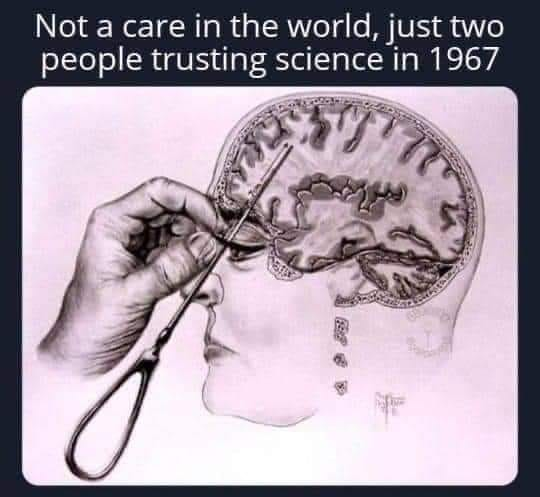
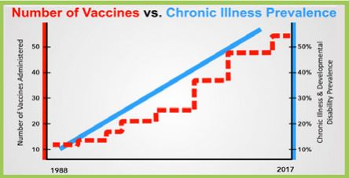
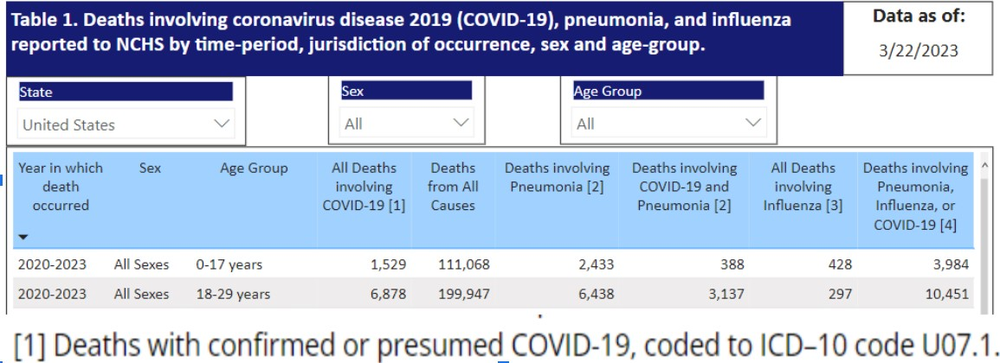
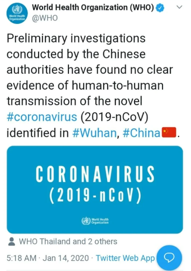

### Scientific Complexity Leads to 'The Priesthood of Scientism'

Wherever there is complexity, homo sapiens understandably fools himself with mythology and coercive-competition-less government structures leading to the retardation of superior 'competitive knowledge discovery', tyranny for those who don't want to go along or fund the government propagated myths, or also wars in the cases when via government coercion the slightly smarter apes attack each other. In the next major section we will discuss various myths that arise from the complexity of the biochemical order culminating in the spectacular CovidMania tyranny. 

#### Biochemical Complexity and Resulting Myths.

##### Introduction to Scientism.

The Soviet Union and Communism-Socialism in general could be seen as the perfect examples of "scientism". The slightly smarter apes realized they were following religious myths and via their "reason" replaced The Church-tradition and its priests with their costumes for "scientists"-reason and their white lab coats-costumes. Instead of scholars looking for meaning in religious scriptures, we now had economists-econometricians-scientists "using the latest techniques and econometric models" attempting to 'centrally plan-regulate-dictate' the social order with disastrous results. US president Biden vowed that "our administration will lead with science and scientists, with a CDC, an NIH, that will be free, totally free from political influence, a surgeon general who is independent, an FDA whose decisions are based on science and science alone." and his Chief of Staff added that "the president-elect will sign additional executive actions to address the climate crisis with the urgency the science demands and ensure that science guides the administration’s decision making." Thus a competition-immune Soviet Union-like pattern simply re-emerges to deal with complexity wherever we find it (medicine, economics, environment, history, etc.) 

##### Scientific mythology arising out of biochemical and socioeconomic complexity. How so many "experts" can be so wrong

In the following sections we hope to make it obvious to the reader that much of mainstream "science" is nearly as mythical, misguided, and intolerant as the famed Spanish Inquisitors were. It is understandable how this can seem somewhat shocking. Can so many well-intentioned and very smart people-scientists-"experts" be so blind to their errors and continue to act in a manner that is doing immense harm? Seems so improbable right? However, consider the following. Today organized religion like the Catholic Church employs thousands of priests-theologians who preach various ideas with various degrees of belief which are actually impossible to prove in a real tangible sense. We would assume that some priests really believe much of what the Church preaches, some might have some doubt to various degrees, and we can also expect some to be 100% charlatans who might be atheists and even pedophiles. Many of these people are very bright, highly educated, very well read in history and other subjects and speak many languages yet the incentive and ideological structure still persists and does both much good and bad. We also just discussed how out of the complexity of the socioeconomic order Socialist-Communist mythology arose leading to oppressive-competition-immune-'central planning' governments all over the world which were-are also populated by smart and caring people who believed the various economic fallacies to various degrees. Again, wherever there is complexity or doubt or lack of certainty (afterlife, complex social order, mind, biochemistry) there is bound to be mythology and resulting competitionless-monopoly-coercive-governments to coordinate the mythical ideas-plans-solutions making them much more difficult to change. Let us begin to prepare our minds for this rather difficult-to-swallow and dangerous idea by seeing just how utterly misguided "mainstream science" and the "experts" have been in the recent past.

In 1847 [Ignaz Semmelweis](https://en.wikipedia.org/wiki/Ignaz_Semmelweis) realized that by doctors just washing their hands, the mortality rate of mothers giving birth at the time could be reduced drastically (from about 16% to 1%). Regardless of his superb results, the medical establishment of the time, in other words, the "experts" and "great minds", fought and ridiculed his advise and he died a depressed man. [Alfred Wegener](https://en.wikipedia.org/wiki/Alfred_Wegener#Continental_drift_theory) was the originator of the theory of continental drift (later renamed-revised as 'plate tectonics') by hypothesizing in 1912 that the continents are slowly drifting around the Earth. His ideas were also rejected by the scientific establishment (the "experts") which even held a special symposium just to criticize them. In 1926 Johannes Fibiger was recognized by the "experts" of the day when he was given the Nobel Price in Medicine for the wonderful discovery that a particular worm was the cause of cancer. The "experts" and Johannes were embarrassingly wrong. In 1935 Portuguese neurologist Egas Moniz performed the first lobotomy (removing/slicing parts of brain) and would win the Nobel Prize in 1949. Paul A. Offit writes: 

>"The New York Times hailed Moniz as "a brave explorer of the human brain." Over the next three decades more than 40,000 lobotomies were performed across the globe, 20,000 in the United states alone. But lobotomies didn't cure anything. Rather they caused memory loss, seizures, and occasionally fatal uncontrollable bleeding. By the 1970s lobotomies were relegated to the dusty bin of discarded psychiatric therapies next to whips,chains [and snake pits."](https://www.amazon.com/Bad-Advice-Paul-A-Offit-MD-audiobook/dp/B07MXPDGYN/ref=sr_1_1?dchild=1&keywords=paul+offit+bad+advice&qid=1604277456&sr=8-1) (Offit, p. 4)

 

Then there are the countless Communist ideologues-"scientists"-"experts" and today's mainstream Keynesian economists which we will revisit further below.

Bottom line. As Henry H. Bauer writes:

>"If the overwhelming consensus were always right, then combustion would still be regarded as a release of phlogiston, the splitting of atoms would still be regarded as impossible, and so on. Progress means discarding theories formerly held and defended by an overwhelming consensus."

So how can so many "experts" be so wrong? Few things are as important as our health and our fears of death. When it comes to health and religion there is a sort of tremendous selective pressure that ensures that both doctors and theologians carry themselves with additional certainty. A change in ideas here means the existing religion-doctors were wrong in vitally important things so it makes sense that these two bureaucracies evolve certain incentives which fight change even more. The great economist and historian Thomas Sowell twitted April in 2020:

>"People will forgive you for being wrong, but they will never forgive you for being right—especially if events prove you right while proving them wrong."

And a related quote by famed physicist  Max Plank:

>“A new scientific truth does not triumph by convincing its opponents and making them see the light, but rather because its opponents eventually die, and a new generation grows up that is familiar with it.”

Bottom line, there is an understandable 'echo chamber' of NEGLIGENCE that causes new ideas to spread slowly as the always proudful apes have to admit to being wrong and also losing their paychecks.
   

Since religion has historically been the state-government which is not only immune from competition but can also sustain its views via force-threats-inquisitions it becomes even easier to see how such ideas-bureaucracies are more immune to change. Why should we think that today's "scientists" are somehow immune from similar attitudes of the past and also not currently making monumental errors? A tiny amount of reason and humility is all that is needed to realize that in all likelihood there are many ideas which currently dominate "scientific consensus" which are bound to be wrong, and by simply looking at today's dissenters we are looking at potential Galileos. 

 [Cell](https://twitter.com/Mahjabinno/status/1325224651476250624/photo/1)

The image above is the latest simulation (guess) that some NASA scientists have created of what a cell looks like. The tiniest dots you see are proteins which contain tens or hundreds of thousands of atoms each(protein TRP-cage has 127, Titin has 539,022) linked together in a very precise order leading to structures of very specific shapes which can go from useful to useless or dangerous if just one atom is off or if the resulting structure itself simply bends the wrong way because it collided with a 'free-radical' or a heavy-big mercury atom. Imagine a large auto-manufacturing plant that employs 2,000 men operating complex machinery and suddenly having a few laborers make a 45 degree turn or do the same with the complex robotics. You'd still have 2,000 men and robotics, but you'd have an unproductive chaos. Just doing this to one machine, or just one little part of one machine, will be enough to wreck the whole factory or assembly line for days-months-ever. Men-machines-things that are part of life don't just exist, they exist in a very specific or complex ORDER which is maintained by very precise INFORMATION and an existing and precise chain-reaction of events. Everything in the private sector is owned and thus controlled or coordinated by a mind that is interested in reordering it in the most useful-productive-profitable way possible. Something similar has evolved in the biochemical order. Also, imagine if to "study" the factory, first you had to immerse it in water thus killing all the workers and causing electrical malfunctions which stopped the plant leading to various chaotic scenarios. Whenever a "scientist" shows you some fancy "electron microscope" image of what the biochemical world supposedly looks like, you are seeing a dead cell that had to be interfered with or prepared in numerous ways making it nearly impossible for us to really predict how the living cell actually worked. Lester and Parker write:

>"The nature of these procedures is described by Dr Harold Hillman in his previously cited 2011 article entitled Cell Biology at the Beginning of the 21st Century is in Dire Straits, which bears repetition,
>>“When a tissue is prepared for histology, histochemistry, electron microscopy, or immunochemistry, an animal is killed; the tissue is excised; it is fixed or frozen; it is embedded; it is
sectioned; it is rehydrated; it is stained; it is mounted; it is radiated by light, or bombarded by
electron beams.”

>Although this refers to the study of animal tissue, the same, or very similar, procedures are employed
in the study of diseased tissue obtained from a human patient, but these procedures, as well as the
chemicals used as stains and fixatives, directly affect the tissue samples, which are clearly no longer
alive when observed. Furthermore, the laboratory apparatus and the laboratory itself are sterile
environments that bear no resemblance whatsoever to the natural environment of the tissue samples within
the human body, from which they have been removed. Unfortunately, as discussed in chapter three,
researchers are mostly oblivious of the extent to which their preparation procedures affect the samples
they study." (Lester, p. 670)

These are just some of the numerous complexities to keep in mind when trying to understand the mind-bogglingly complex biochemical order. There are many "carrier proteins" like the famous HDL and LDL whose job is to carefully-safely-orderly-purposely move stuff-cholesterol around. The proteins themselves are manufactured in large mega-molecules called ribosomes which read mRNA to determine the proper sequence of amino acids to stitch together to make the protein.

Consider the following example. In 2005, aided by a supercomputer that had 768 processors and ran on-task for 260 days, researchers came up with a computer simulation that guessed what a ribosome might look like and how it might work as it read some mRNA to create a protein.

>"The task wasn't simple. Researchers had to model the physical interactions of each of 2.64 million atoms--about 250,000 in the ribosome itself, but most involving water molecules inside and outside it. The simulation resulted in a movie that is 20 million frames long, he said....In reality, however, the ribosome behavior that they simulated takes only 2 nanoseconds, or 2 billionths of a second--too short to even be [labeled as "fleeting." "](https://www.cnet.com/news/lab-computer-simulates-ribosome-in-motion/#:~:text=The%20task%20wasn't%20simple,molecules%20inside%20and%20outside%20it.) (Shankland)

Let that sink in... With our fanciest computers, electron microscopes, and other impressive sounding technologies, as late as 2005 the best we could do is somewhat guess, for just 2 nanoseconds, what one ribosome might look like-function. It took another 4 years, till 2009, for the Nobel Prize in Chemistry to be given to Venkatraman Ramakrishnan, Thomas A. Steitz and Ada E. Yonath, "for studies of the structure and function of the ribosome". How did they achieve this? How did they gather the evidence for their amazing breakthroughs and future simulations? The Noble Prize website summarizes:

>"The story of the 2009 Nobel Prize in Chemistry begins in hot springs and in the Dead Sea. Ada Yonath used micro-organisms from these extreme environments to isolate robust ribosomes. Her goal was to make the ribosomes crystallize, like salt in a solution crystallizes when the water evaporates. After many years of trial and error, Ada Yonath managed to generate well organized crystals with millions of ribosomes assembled into regular patterns."

>Ada Yonath sent X-rays through ribosome crystals. When the rays hit the crystal’s atoms they are scattered, making millions of dots on a CCD detector. This method is called X-ray crystallography. By analysing the pattern of the dots, researchers can determine the positions of the hundreds of thousands of atoms in the ribosome. However, scientists also needed to know the “phase angle” for each and every dot. This mathematical information is related to the location of the atoms in the crystal. In 1998, Thomas Steitz managed to solve the phase problem and the first crystal structure of the ribosome’s large subunit was published." (Yonath)

So…Dead crystallized ribosomes, bombarded by X-rays, leaving a shadow, followed by numerous mathematical equations and other layers upon layers of assumptions-hypotheses (guesses), dealing with immense complexity, just to come up with a good enough guess to impress fellow apes of the scientific community and get the Prize. Our ability to biochemically identify one of these proteins-molecules-structures and alter it in a useful-predictable manner that also does not negatively affect other proteins-molecules-processes is currently INEXISTENT. The simple truth is that how the biochemical world functions is still far far far far far too complex for the slightly smarter apes to have the technology-means to interact with in ways that when one properly accounts for all the potential side-effects of our numerous drugs and vaccines clearly proves to be an improvement in the long run for many things we are currently doing. We see this all the time as old drugs-treatments, which were hyped as revolutionary at the time when the scientific community was focused on the drug's positive effects as they relate to the condition they want to improve, are found to do more harm than good once the complex side-effects are better understood and eventually traced to the drug-intervention. The seemingly positive effects are easy to see when that is what they are focused on and there is tremendous financial incentive for good news, the negative effects are much, much harder to see and there is no money to be made in doing so for the most part, especially if convoluted government regulations make companies immune from or more difficult to sue when things go wrong.

As our ability to understand biochemistry increased, we kept focusing on how particular compounds-medicines could affect the proximate symptoms of various diseases. Successes there and continued technological breakthroughs regarding our ability to understand such complex biochemistry just led to drugs-poisons which got a little better at treating the symptoms. I mentioned 'poisons' because that is exactly what drugs are, they are poisons which at certain doses superficially improve or block some symptoms we focus on, but given the mindbogglingly complex biochemistry of the human body, they inevitably cause imbalances-chaos in other areas which go largely unnoticed. Eat all the meat you want and your body will properly make the most of it because that is what our biochemistry has been ideally evolved to process, swallow the bottle of pills and the reality that they are poisons will quickly manifest itself. Consider the following, the US General Accounting Office published a study which found that "…of the 198 drugs approved by the FDA between 1976 and 1985… 102 (or 51.1%) had serious post-approval risks" (risks=heart-kidney-liver failure, birth defects-etc.) We have reached the point where the medical system itself via errors and side-effects of drugs and many other factors is estimated to be the 3rd leading [cause of death.](https://www.hopkinsmedicine.org/news/media/releases/study_suggests_medical_errors_now_third_leading_cause_of_death_in_the_us) This should not be seen as an attack on the pharmaceutical industry, we just want to appreciate the immense complexity and still relative backwardness of our ability to properly understand, and much less interfere with, the biochemical world. Remember, it wasn't until 2009 that we even got a good enough guess of what a ribosome may look like, so it should be unsurprising that the better we understand the biochemical world, the better we realize that we had been doing much harm. Of special importance and toxicity are chemotherapy drugs. The theory behind chemotherapy drugs is that they are immensely toxic but hopefully more so to the cancerous cells we want to kill, than to our non-cancerous cells which we can hopefully replenish. None of the drugs we use "cure" anything, they just alleviate or delay certain symptoms whose root causes are usually related to nutrition and-or environmental toxins, etc. 

If a cure-improvement-information involves not doing anything or there is less money to be made in it, less money exists to advertise it and spread such information. But if the remedy-information does involve big profits, then there is money-wealth to motivate the spread of this idea, so the "invasive" remedy-information is sort of "naturally selected". And, once gain, if the money-wealth comes from a competitionless-monopolistic government institution then the potential fallacies are even harder to change. So the 'incentive structure' that evolves is one that fools the slightly smarter apes into long-term and hard-to-notice and change disasters. The politicians and masses only see the alleged benefits of a government-coercive-competitionless intervention into the socioeconomic order-economy-'complex phenomena', while being unaware of the fact that usually the cost will be greater than the perceived benefit. Something similar happens here. This has little to do with some "conspiracy" by the doctors or pharmaceutical industry to keep people away from superior ideas(although this certainly happens and is also a factor to various degrees), this is just the way things have inadvertently evolved to various degrees and is also "indeed the result of human action, but not the execution of any human design". Again, we must always be focused on the root cause of our problems. It is the economic ignorance of the masses-experts which calls for the creation of the paralyzing-competitionless-inefficient bureaucracies which get more incompetent-malicious-neglective with time, which then leads to some truly corrupt-incompetent-negligent-clueless apes-Lysenkos-Faucis. This is a monumentally important fact!!!! Again!!! Just like in the Catholic Church one can find pedophile priests who don't believe in God or at least many of the 'myths' the Church preaches, especially today when we have so much science-genetics-etc. to at least cause doubt in some of the myths, it would be a monumental mistake to point to those examples and then label organized religion as some "conspiracy" of liars. If the incentive and ideological structure that maintains organized religion and its much-easier-to-criticize potential myths can still be so prevalent, we should expect the same pattern repeating itself in areas involving far more difficult to understand complexity (biochemical order-medicine, "theoretical" physics, the brain-psychiatry, 'climate change', history, economy, etc.) 

We should stress that in each of these complex fields like religion, nutrition, disease, economics, history, we get mythological structures which should NOT be confused with purposeful-coordinated "conspiracies". When one looks at the leading voices in the low-carb-keto(and more recently carnivore) community, essentially people who have major disagreements with mainstream science when it comes to nutrition and diseases in this example, people like 1) [Dr. Timothy Noakes, who had to defend his low-carb views against the existing medical bureaucracy in a manner akin to Galileo defending himself vs. the Church](https://www.youtube.com/watch?v=9OT_S6fDxR0&list=PLPda1Yn6bpO6DG_b5_wAVXf100niaaJDX), 2) Dr. Jason Fung whose books "The Obesity Code" and "The Diabetes Code" have dominated Amazon.com bestsellers lists for years and are helping thousands lose weight and easily reverse type 2 diabetes by simply fasting and thus cutting out sugar and carbohydrates and other potential troublemakers..... and many many other doctors, they once believed the "mythology" that diseases like diabetes, heart disease, cancer, obesity and many others were primarily due to genetics, eating too much, perhaps not enough exercise, etc. (other causes except for diet). They were not part of some "conspiracy" or maliciously-negligently avoiding superior information. They simply believed the current myths and were parts of the 'echo chamber' and 'incentive structure' that sustains them.  Dr. Noakes mentions how he was one of the respectable doctors who without much thought dismissed people like the famed low-carb proponent Dr. Atkins as some contrarian-scammer, yet when other doctors he greatly respected defended Dr. Atkins he finally decided to read Atkins' classic book "Dr. Atkin's New Diet Revolution". Dr. Noakes mentions:

>"You must understand for 33 years I've been saying that you must eat a high carbohydrate diet and Atkins was the devil, I mean literally, that's what we thought of him....I went down to the bookshop, bought the book, brought it back and two hours later I was stunned, and I realized that I'd been wrong and that I'd been wrong for 33 years...During this period I've gone through a lot of trauma...I "came out" and said I am now a low-carbs-no-grain person and immediately lost all my funding, my research funding. The medical research council took [their money away from me"](https://www.youtube.com/watch?v=8rtZJF-xfyo)

Like that rare priest who might suddenly understand evolution and genetics and perhaps admit to losing faith and feel as though he had been espousing erroneous views-advice Noakes made a similar change. It is important to note that Noakes was part of the existing 'echo chamber' that would vilify-dismiss Dr. Atkins, and that once he changed his views, he would also become an outcast to the existing bureaucracy-Church. When Dr. Noakes was ignoring-vilifying Atkins, was he a "bad guy" who was part of some "conspiracy"?, Of course not. There ARE charlatans and people who are willfully negligent to various degrees if it helps them make money, and this is obviously the case in every field, ESPECIALLY WITHIN THE PHARMACEUTICAL INDUSTRY and competitionless governments!. Nearly the entire field of Bariatric surgery where people's stomachs are surgically shrunk can be seen as mostly negligence by doctors-priests since most people can easily be trained-taught how to simply fast as Dr. Fung's books have done for many. Yet such relatively barbaric, dangerous, and expensive practice continues. I doubt the doctors who perform such surgeries are giving away copies of Fung's books. Back to Noakes. 

Noakes might have equated Atkins with one of those medical charlatans. The popular and somewhat nebulous term 'Cognitive Dissonance' is at play here and plays an important role in the creation of the 'echo chambers' that unites groups. People just have various understandable reasons which have little to do with pure malice or fraud for neglecting or holding contradictory ideas. Sometimes we neglect ideas because we already think we are doing things based on the best available information. Who has the time to properly consider every possible criticism? And then of course there is a bias that motivates us to overlook-ignore ideas that can greatly invalidate our views, sense of purpose, harm our finances, and when these factors are sort of layered on top of others the resulting ideological differences can lead to dangerous extremes-fallacies-excommunications-burnings. This might lead many mainstream scientists (like Noakes had done) to mistakenly attack or neglect revolutionary scientists (Atkins) on the one hand, and it could also lead to having people or revolutionary scientists label mainstream science as some "conspiracy" that purposely fights change, when that too would be a mischaracterization. And hopefully one gets the point.

Just like we can expect more "charlatans" or non-believing priests in organized religion as the reasons to doubt become more and more numerous or obvious, so can we expect more medical professionals or scientists who purposely look the other way when superior ideas which go against entrenched dogmas become more noticeable. Those who are more intellectually rigorous and thus more willing to think independently instead of just uncritically accepting emerging trends and also willing to change their minds will do so sooner, and the more fraudulent and-or dangerously negligent or just intellectually lazier will do so slower, and much more so when they work in competition-immune governments and their regulatory bureaucracies like the CDC, FDA, NIAID. Upton Sinclair mentions: “It is difficult to get a man to understand something, when his salary depends on his not understanding it.” 

The fact that simply aggressive fasting and eating a low-carbohydrate diet for just a few weeks can essentially reverse-control type-2 diabetes for many, yet the mainstream medical establishment remains somewhat oblivious to this fact, is just further evidence of how ideological and incentive structures, especially when they are entrenched-sustained via competition-immune government monopolies like the American Medical Association which essentially controls what is taught to doctors, are difficult and slow to change. Again, how many theologians are actively knocking on the doors of Biology departments? Why did it take 70+ years for Communism to be generally seen as a failure(and still exists in Cuba!)? Again, this should be obvious, the emergence of superior ideas means that all the "experts" of the past were wrong.

Once one understands how competition is what discovers superior information all one has to do is look where competition and its required freedom exists to see where the real 'state of the art' information resides. It is in Amazon.com, its bestsellers lists of competing books-ideas-'well-written reviews', and in youtube-internet where various scientists-intellectuals are debating and thus competing intellectually where one sees the emergence and spread of superior information. It is thus not surprising that the low-carb-keto-carnivore authors and personalities like Dr. Jason Fung dominate Amazon.com bestsellers lists, while mainstream "scientists"-theologians remain in their 'echo chambers' in the government-regulated bureaucracies-Church and related mythology of attempting to treat everything with a pill-vaccine-operation-intervention and increasingly 'technologically advanced treatments' which only addresses the eventual breakdowns in complex-biochemistry which are mostly the result of improper diets and environmental toxins. 

The story of Dr. Ancel Keys helps us further understand how out of the immense complexity of the biochemical order that creates the human body, coupled with human nature and perverse incentives, disastrous ideas can mislead the entire scientific community. In the 1950s Dr. Ancel Keys had a pet theory that saturated fats, which are the fat abundantly found in animals, were the major culprit in heart disease and that we would be better off eating the polyunsaturated fats of vegetable oils. A Canadian Broadcasting Corporation documentary summarizes:

>"But the theory needed proof. In one experiment Keys and colleagues studied thousands of patients at mental hospitals in Minnesota feeding one group a diet high in corn oil and another group got saturated fat. It was the largest clinical trial in history to test Ancel Keys' diet heart hypothesis but after years of research they didn't publish what they found....Why did they sit on the data? Because nothing happened. The results showed no health benefit from the high corn oil diet, it completely contradicted Ancel Keys' theory. Years passed, people kept on eating corn oil, but the whole story of the Minnesota coronary experiment has never been told until today now that a new team of scientists has recovered the data, re-evaluated it and discovered there was even evidence of harm from the [high corn oil diet."](https://www.youtube.com/watch?v=UO86iiTkPfo)

Best-selling author-physicist Gary Taubes had discussed why the results had been hidden-ignored with Keys' colleague Ivan Frantz and mentions:

>"He said that they were disappointed in the way the study had come out. And the implication was that... "they" was primarily Ancel Keys" 

"Scientists"-people (slightly smarter apes) looking for glory and overlooking information that contradicts their life's work or affects their finances is very much a part of human nature. Consider the following, [one study](https://www.ncbi.nlm.nih.gov/pmc/articles/PMC2685008/) of scientific misconduct estimates that about 2% (1.97%):

>"of scientists admitted to have fabricated, falsified or modified data or results at least once –a serious form of misconduct by any standard– and up to 33.7% admitted other questionable research practices. In surveys asking about the behaviour of colleagues, admission rates were 14.12% (N = 12, 95% CI: 9.91–19.72) for falsification, and up to 72% for other questionable research practices...Considering that these surveys ask sensitive questions and have other limitations, it appears likely that this is a conservative estimate of the true prevalence of scientific misconduct." (Fanelli) 

Stop and read that again! So about one out of fifty scientists will admit to fabrications and falsifications at least once, a somewhat courageous admission we can expect few to make. But the less courageous admission regarding colleagues which we can expect more to admit to, reveals that a whopping 14.12%, or one in seven scientists, has purposely fabricated or falsified information. There are about 1 million doctors in the USA and 7 million scientists and engineers for a total of 8 million. 14.12% is a whopping 1.13 million scientists-docs who are out there maliciously or extremely negligently looking to exaggerate, lie, etc. to get government grants-influence-fame-money and so on, and another 5.76 million (72% of 8 million) who are aware of other scientists doing 'questionable research practices'. So year after year 1.13 million potential charlatans and-or exaggerators (see wikipedia ["List of scientific misconduct incidents"](https://en.wikipedia.org/wiki/List_of_scientific_misconduct_incidents)) are out there recognizing and affiliating with other fraudsters to various degrees, statistically guaranteeing that eventually somebody is going to hit it big and potentially mislead a large portion of the scientific community as in all likelihood happened with Ancel Keys and countless others. Are these statistics just applicable to scientists? Of course not! We can and should expect the same level of fraud and negligence across all industries like in economics, history, foreign policy, etc. This helps us understand how 'echo chambers' of fraud, negligence, and ignorance form, persist, and are so slow to change. 

Just one example of someone who got caught is [Yoshitaka Fujii (Japan)](https://en.wikipedia.org/wiki/Yoshitaka_Fujii), an anesthesiologist, who "was found to have fabricated data in at least 183 scientific papers, setting what is believed to be a record for the number of papers by a single author requiring retractions. A committee reviewing 212 papers published by Fujii over a span of 20 years found that 126 were entirely fabricated, with no scientific work done. Only 3 were found to be valid. He was also found to have forged the signatures of scientists he listed as co-authors without their knowledge". Diederik Stapel, professor of Social Psychology at Tilburg University and the University of Groningen, after getting busted wrote about his numerous data forgeries:

>"In the privacy of my office or my study at home, I did some things that were terrible, maybe even disgusting. I faked research data and invented studies that had never happened. I worked alone, knowing exactly what I was doing, and my solitary drive to achieve led to my becoming ever more detached from myself and my emotions. I didn’t feel anything: no disgust, no shame, [no regrets."](https://scienceintegritydigest.com/2019/07/16/fabrication-the-diederik-stapel-case/) (Bik)

Consider the story of Frances Oldham Kelsey, she was an FDA reviewer who in 1960 refused to authorize thalidomide given what she considered was lack of evidence of safety. Her wikipedia summarizes:

>"Even though it had already been approved in Canada and more than 20 European and African countries,she withheld approval for the drug and requested further studies. Despite pressure from thalidomide's manufacturer, Kelsey persisted in requesting additional information to explain an English study that documented peripheral neuritis, a nervous system side effect. She also requested data showing the drug was not harmful to the fetus.

>Kelsey's insistence that the drug should be fully tested prior to approval was vindicated when the births of deformed infants in Europe were linked to thalidomide ingestion by their mothers during pregnancy. Researchers discovered that the thalidomide crossed the placental barrier and caused serious birth defects. She was hailed on the front page of The Washington Post as a heroine for averting a similar tragedy in the U.S."

What if instead of her, one of the fraudulent-negligent scientists had been in her position? What if in today's American CDC or FDA or National Institute of Allergy and Infectious Diseases or in the World Health Organization we have such potential bad-negligent apples-Lysenkos? 

It is now widely discussed how the scientific community has a “replication crisis” because around half of published research is so plagued with errors that only about half can be reproduced. Kelsey Piper summarizes:

">[One 2015 attempt](https://science.sciencemag.org/content/349/6251/aac4716) to reproduce 100 psychology studies was able to replicate only 39 of them. [A big international](https://osf.io/ux3eh/) effort in 2018 to reproduce prominent studies found that 14 of the 28 replicated, and an [attempt to replicate studies from top journals Nature and Science](https://www.nature.com/articles/s41562-018-0399-z.epdf?sharing_token=uY-7XXSwrYqjnTaF4k_LwdRgN0jAjWel9jnR3ZoTv0ODPoD_DniKOJV85YbvYREV4WYg3rUMkw4Dn3xQpiS36ewTQMztGsmzwDVhiD6qsOTincMm_6MNx3iVweaC-Br4IKcK_J1FMyo7gekrMG0IwJjMkUbPoOOsXV_plU0uyaUh7wihjHJ-UQu1bguEiZfqnqN7NTFPQt3C_0QoV-oKp432nRQ5ffc2UA5BY90g4iK0ZBBYY3dUcr_5QiA4dJ4hgldAHBXR-Z59rVmKtU6W1S9mmQWSK2UkVcSsp-mF6XUa0m236lCGYzIleP_2BSiM77pjx_WrxRWf5SrVCGJ5L535khtcNZ8XtAIl7bwr98I%3D&tracking_referrer=www.theatlantic.com) found that 13 of the 21 results looked at could be [reproduced."](https://www.vox.com/future-perfect/21504366/science-replication-crisis-peer-review-statistics)

It makes perfect sense that a field like psychology which has to deal with the complexity of the mind and human behaviour, is plagued by an even higher percentage of hypothetical bullshit.

We really want to understand how these patterns arise-repeat in *all complex fields*. In biochemistry, physics, economics, history, etc. We re-focus on economics.

The world of mainstream economics is similarly fooled by its misguided use of mathematical models. Math is good for physics-chemistry and relatively simple things. Per above, with enough computing power you can sorta guess how one ribosome might work for a few nanoseconds, but how 100 billion neurons in a human brain lead to actions based on prices and a global division of labor that has evolved over millennia and coordinates the actions of 8 billion people, is way too complex for math to be of significant value when it comes to analyzing the fundamentals. Since money, law, religions, governments, 'the market process' and resulting 'Social Organism' is the product of 'Natural Selection', they need to be studied more like biology than physics. As Menger explains:

>"Now if social phenomena and natural organisms exhibit analogies with respect to their nature, their origin, and their function, it is at once clear that this fact cannot remain without influence on the method of research in the field of the social sciences in general and economics in particular....Now if state, society, economy, etc., are conceived of as organisms, or as structures analogous to them, the notion of following directions of research in the realm of social phenomena similar to those followed in the realm of organic nature readily suggests itself." (Menger, 1996, p. 131)

But the slightly smarter apes just love their impressive looking useless mathematicobabble, and the sheer arrogance and sense of superiority that comes from being able to understand it helps evolve the 'Priesthood of Scientism'. Menger, peace be upon him, again:

>"I do not belong to the believers in the mathematical method as a way to deal with our science. I am of the opinion that mathematics is mainly a way to give an example or demonstration, but not to do the research itself...Mathematics is not a method for...economic research" [(Ebeling, 2012)](https://www.aier.org/article/carl-menger-and-the-sesquicentennial-founding-of-the-austrian-school/)

Mises sets those apes straight(re-quoted):

>"As a method of economic analysis econometrics is a childish play with figures that does not contribute anything to the elucidation of the problems of economic reality."

>"The Econometricians have not the slightest notion of the issues involved."

The distinction between micro and macro economics is another "delusion" or myth the apes have created because they don't understand how the economy or socioeconomic order, just like the biological one, must be understood as one intertwined, indivisible, and coevolved system. Hayek perfectly describes the evolving 'Priesthood of Scientism' and their math-based "magic" as he criticizes the:

>"...delusion that macro-economics is both viable and useful (a delusion encouraged by its extensive use of mathematics, which must always impress politicians lacking any mathematical education, and which is really the nearest thing to the practice of magic that occurs among professional economists)" (Hayek, 1989, p. 98)

And in a more general sense, the great scientist Nikola Tesla:

>"Today’s scientists have substituted mathematics for experiments, and they wander off through equation after equation, and eventually build a structure which has no relation to reality."

Understandably so, the world of economics too has its mixture of relatively clueless economists and also some charlatans so the same applies. Here too, the naive thinkers portray central banks and the economists-priests that mismanage our economies as a "conspiracy" by "elites" which is greatly mistaken. For example, former Federal Reserve economist Danielle DiMartino Booth describes in her book “Fed Up: An Insider’s Take on Why the Federal Reserve is Bad for America”, how utterly clueless, incompetent, politicized, and disastrous the Federal Reserve and our mainstream economics establishment are. The important point here is that Danielle was herself a product of our mainstream economics establishment. She studied in our "great universities" and one could say she grew up with "faith" in the mathematical models-courses-theories(mythologies) she studied in college, but eventually realized that much of what she had learned was wrong similarly to how perhaps some religious priest comes to abandon some previously held beliefs-myths. In the introduction she writes:

>“I witnessed the tunnel vision and arrogance of Fed academics who can’t understand that their theoretical models bear little resemblance to real life…Every American must understand this extraordinary powerful institution and how it affects his or [her everyday life”](https://www.amazon.com/Fed-Up-Insiders-Federal-Reserve/dp/0735211655) (Booth, 2017, p. 10)

Had Danielle been familiar with Mises, Hayek, Hazlitt, Rothbard and other members of the so-called ‘Austrian School’ of economics, she would've had a superior understanding of economics and the inevitable disaster that the Federal Reserve is, but then her life would have been different and she would not have reached such heights at the FED. That would have been akin to having an evolutionary biologist try to move up the ranks of the Catholic Church. Her great insider-tell-all book is not the first of its kind to expose the dangerous disaster that the Federal Reserve and our mainstream economics establishment is. For example, William E. Simon, former Secretary of the Treasury for presidents Richard Nixon and Gerald Ford, fills us in on the incompetence of the nation’s “most prominent economists” during the financial crisis of the 70s. His statements apply just as well to recent (and future) economic troubles and government “experts”:

>“The Wall Street Journal interviewed several dozen of the most prominent economists in the United States on the causes of the recession and on ways to prevent a recurrence. They disagreed about virtually everything save this: that there was much economists did not yet understand. The details of the economists’ ignorance are of interest, but I stress here the overriding conclusion to be drawn from their statements: The economists who had been advising our Presidents simply had not known what they were doing…Gerson Green, formerly of the Office of Economic Opportunity, summed up the attitude of many of his colleagues when he observed caustically, “The change I discern is that none of us knows what to do. In those days, we thought we did. The country has taught the social engineers a lesson.”… So who was running the store? The answer is: nobody. Not one human being in the whole vast realm of political control over the American economy has ever known what he was doing. Nobody could know. This is the precise phenomenon described by F.A. Hayek in his Noble lecture called “The Pretense of Knowledge.” For forty years the American ship of state has been lunging erratically toward economic disaster, with no awareness of its direction…” (Simon, 1978, p. 121–123)

A final and perhaps best example showing how our mainstream economics establishment-FED is essentially based on mythology and not on "conspiracy" is the fact that one of today's best 'Austrian Economists', Robert Wenzel, editor & publisher of [EconomicPolicyJournal.com](http://EconomicPolicyJournal.com) was invited to give a [talk at the New York FED](https://mises.org/library/new-york-fed-leave-building). If the FED had been run by some secret cabal, the last thing they would have done is invite Mr. Wenzel who told them early in his speech:

>"to do what I believe should be done, which is to close down the entire Federal Reserve System."

Reflecting on being invited to give the speech and his experience talking to FED officials Wenzel wrote:

>"Overall, I was simply amazed at the lack of knowledge of these economists about the Austrian School. It was very close to nonexistent....My experience at the Fed points out the importance of intellectual debate and study. Clearly, the economists whom I met at the Fed were brought up in an intellectual tunnel, where they had no exposure to Austrian economic theory. They read and study within a limited range of writers. But they were very curious about my view."

The so-called military-industrial-complex is the same way where you have plenty of "good vs. evil" thinkers who genuinely believe we need to protect ourselves against the evildoers and that the world has and will always be about who can display more power, there are also plenty of armaments industry CEOs-salesman just looking to purposely exaggerate or even create threats to make a buck.  

So to briefly summarize, wherever there is complexity-doubt (nutrition-medicine-afterlife-economy-environment-climate-history-mind( psychiatry's popular 'chemical imbalance' myth which of course needs to be treated by mythical poisons-drugs is also myth-bullshit)), there is *mythology*. The economically clueless masses and politicians always believe that a coercive-competitionless-monopoly of "experts" in the government should manage-oversee-regulate related research and action since they have no clue how freedom and competition are best suited for all knowledge. And of course we also have that petri-dish of deliberately fraudulent scientists-doctors-engineers-politicians, and how can one forget, the 'foreign policy experts' that are constantly reminding us of all the evildoers trying to kill us.....all inadvertently-negligently-maliciously creating hypothetically dangerous scenarios, which then create a sort of ideological chain-reaction where government wealth and coercion spreads certain ideas which become more difficult to correct. Natural selection created a sort of algorithm to discover information, create superior social order, and also very importantly! prevent the growth of falsehoods and incentive structures which lead to hard-to-change-paralyzing-dangerous-mythological-tyrannical orders-bureaucracies. Freedom of course, which is "the ultimate algorithm". We just need to understand it, that's all. The average citizen has no need to become an expert in nutrition, or economics, or history, or psychology, or whatever, what he needs to become an expert in, which fortunately is not hard at all, is ensuring that there is maximum freedom and thus 'competitive knowledge discovery' everywhere. It does not look like we will be able to change the fact that we are simply slightly smarter apes, which I think is kind of cool anyways, however, we can easily go from "wild" to "civilized" slightly smarter apes by understanding how private property and emerging freedom and 'competitive knowledge discovery' is what leads to civilization. By focusing on economic education we really strike at the root of the ignorance and errors from which all other problems arise. 

When people who criticize mainstream bureaucracies like the medical-religious-economic-etc. on potential differences of opinion regarding diet, vaccines, handling of Covid, religious interpretation, economic policy and numerous other potential areas, it is a gigantic error to label such bureaucracies and whatever errors they might propagate as some sinister conspiracy. Unfortunately this error happens all the time among naive thinkers who erroneously think everything is the result of some plotters-conspirators when they are the result of more complex evolutionary factors-incentives and are to a significant degree "the result of human action, but not the execution of any human design". These are the "conspiracy theorists" who then sort of mess it up for the rest of the critics of such bureaucracies. These "conspiracy theorists" sooner or later always end up in the same misguided conclusions, blaming "The Jews", the Rockefellers, "the Devil", the Illuminati, etc. which then makes it easy and understandable for the misguided-malicious-negligent bureaucrats-experts to dismiss all criticism. However, just like we don't want to make the errors that the "conspiracy theorists" fall for, we also don't want to be ignorant of how human nature coupled with complexity-mythology, competition-less government monopolies and financial incentives create an 'incentive structure' and sort of "echo chamber" which fights change, selects for ass-kissing, negligence, etc. thus virtually guaranteeing that often times as you get to the upper layers of bureaucracies you have some real charlatans, truly malicious characters, and the dangerously misinformed and negligent. When truly malicious people are identified in such bureaucracies, then the "conspiracy theorists" will use that as evidence of some "grand conspiracy" which never really existed which helps the pattern repeat... Anyway, you get the point... We just want a nuanced understanding of all factors. And most importantly, to understand how freedom and resulting competitive knowledge discovery, not "science" or whatever that means, is the key to both discovering superior information and preventing bad ideas from persisting thanks to massive government regulatory-monopoly-coercive bureaucracies.

##### Human Evolution and Nutrition.

A brief look at human evolution and nutrition is not only important for improving our health-fitness-happiness but also helps us solidify our complete evolutionary understanding of the world, and building on the above, we continue to see how the mainstream scientific community or Priesthood can be so wrong.

About 6.5 million years ago we shared a common ancestor with Chimpanzees and Bonobos and were herbivorous tree-dwellers where it was relatively safer, but eventually certain environmental pressures forced us to come down from the trees and become the ultimate carnivorous predators. Unlike herbivores which need more laborious-complex digestive systems to extract-create the necessary fats-proteins-calories from plants, carnivores move up in the food-chain by eating and easily absorbing such nutrients from the bodies of other animals that have already "done the work". What could possibly have the perfect combination of nutrients needed to build a human brain, kidney, liver, muscles, etc. than the brain, kidney, liver of a biologically similar mammal-animal(or human (cannibalism seems to have been popular in our past)). Our guts changed in important ways from those of our closely related primates. The small intestine which absorbs nutrients grew while the large intestines where bacteria helped break down, ferment, and extract-create nutrients from plants shrank. Bacteria that have evolved to feed or decompose plants are mal-adapted to doing the same on animals, this allows herbivores to have slightly acidic stomachs(pH around 4.0), but if you are a carnivore (pH 2-3) bacteria that have evolved the necessary biochemistry to decompose or feed on fellow animal cells can harm you thus the need for a more acidic (lower pH) stomach. Scavenging and eating rotting animals with large quantities of such bacteria requires even more acidic stomachs which is precisely what humans have (pH 1.1 - 1.5). Dr. Saladino writes:

>"2.5 million years ago, with the advent of stone tools and hunting, our ancestors' brains began to grow even more rapidly. In fact they doubled in size over the next 1 million years. Based on the fossil record, it appears we reached a maximum brain size of 1600cc about 40,000 years ago, and that our brains have shrunk slightly since...a significant change in the rate of growth of our ancestors' brains coincided with stone tools and hunting..." (Saladino, p. 5)

>"In order to determine the proportion of animal foods in the diets of our predecessors, we can examine the amount of δ15 nitrogen in their fossilized bones. By looking at levels of this isotope, researchers are able to infer where in the food chain animals reside by identifying their protein sources. Herbivores generally have δ15N levels of 3–7 percent, carnivores show levels of 6–12 percent, and omnivores display levels between these two. When samples from Neanderthal and early modern humans were analyzed, they demonstrated levels of 12 percent and 13.5 percent, respectively, even higher than that of other known carnivorous animals like hyena and wolves."(Saladino, p. 7)

The downward trend in brain size to about 1,400cc at present coincided with the extinction of megafauna and especially the rise of agriculture as previously discussed. Today we get about 70% of our calories from plants, we consume large quantities of highly refined carbohydrates like breads and pastas which cause unnatural and frequent spikes in blood-sugar-glucose and also lack the numerous vitamins and minerals in bioavailable forms that our bodies can actually use. The gasoline that powers our cars has carbon, so does broccoli, yet nobody pumps broccoli into their gas tank. Similarly, just because plants have various vitamins and minerals we need, it does not mean that our bodies will be able to properly absorb them. For example, the phytic acid in seeds "chelates[binds with] with minerals and metals, such as calcium, magnesium, zinc, and iron, forming insoluble salts that are not readily absorbed by animals or humans. In particular, it can severely impair availability of zinc and iron. Phytate can also complex with proteins and may thereby reduce digestibility or enzyme [activity."](https://www.sciencedirect.com/topics/neuroscience/phytic-acid). Not only do we lack the necessary digestive machinery to get the same nutrition from plants that we have evolved to easily get from animals, we also lack defenses against the numerous toxins plants have evolved to defend themselves against predators-herbivores-insects. Plants that did not evolve chemical defenses would have been naturally selected out of existence millions of years ago, thus all plants that exist today do so because they contain such defenses to various degrees. Lectins (damage the gut), glycoalkaloids (neurotoxins), oxalates (create crystals which damage host in numerous ways), phytic acid binds to nutrients and prevents their absorption and [there are many more.](https://www.youtube.com/watch?v=GgnnklDVhso) The image below summarizes various types of toxins.

The glycemic index is a measure of how quickly glucose levels in the blood rise after eating certain foods. Pre-agricultural man, with considerable risk, might find carbohydrate-rich honey from time to time which has an index score of 58, but he would never find, and much less eat several times per day throughout the year, something like a French baguette that has a score of 99, sugary drinks like Coke(63), Gatorade(78),spaghetti(58), white rice(89), Cornflakes(93), and the plethora of processed, grain-based foods that make up most of our calories today. The average American consumes over 150 pounds of sugar per year, high-fructose corn syrup, and many other things [like recently-invented-unnatural vegetable-seed oils](https://www.youtube.com/watch?v=k_XDMdltRlY) which contain [high amounts of polyunsaturated fats whose chemical structure](https://www.youtube.com/watch?v=rQmqVVmMB3k) our bodies(mitochondria) have simply not evolved to deal with in the abnormally high quantities being consumed, which when taken together creates a sort of biochemical chaos that eventually manifests itself in our various diseases and easily explains why humans have become the only obese and metabolically dysfunctional animal that is plagued by 'diseases of civilization' like diabetes, heart disease, cancer, dental caries, etc. Animals in the wild who eat their 'species appropriate' diet are rarely ever seen with these diseases and so were human beings prior to the emergence of our modern diets based on these man-made foods instead of the mostly animal-based diets that natural selection has crafted our biology to ideally use.

The bottom line is that like a car that runs with contaminated-improper gasoline and performs sub-optimally, or without coolant and the heat eventually causes some early breakdown somewhere, improper nutrition is likewise the main source of our diseases and relative obesity. The complex biochemical order that took natural selection billions of years to ideally craft, is breaking down prematurely in countless ways due to bad raw materials-diet and environmental toxins. 

Mankind is beginning to catch up to men like dentist Weston Price and anthropologist Vilhjalmur Stefansson who in the early 20th century wrote about how cultures that had not adopted the "civilized" Western world's agriculture-grain-based-sugary-seed-oils-processed diets were relatively healthier. To examine the result of highly complex systems like the economy, you do not have to get lost in little details and hypotheticals, just like the night-time pictures of North-South Korea and a few simple comparisons show which order is superior, the same applies to the biochemical order. In his seminal book ["Nutrition and Physical Degeneration"](http://gutenberg.net.au/ebooks02/0200251h.html) Weston Price easily notices how tribal societies that had not adopted the white man's diets with our sugars-seed-oils-etc. were relatively free-immune of cavities-"affections" and obesity-etc. He summarizes:

>"A critical examination of these groups revealed a high immunity to many of our serious affections so long as they were sufficiently isolated from our modern civilization and living in accordance with the nutritional programs which were directed by the accumulated wisdom of the group. In every instance where individuals of the same racial stocks who had lost this isolation and who had adopted the foods and food habits of our modern civilization were examined, there was an early loss of the high immunity characteristics of the isolated group. These studies have included a chemical analysis of foods of the isolated groups and also of the displacing foods of our modern civilization."

He noticed that not just tooth decay was a result of the white man's diet but also other ailments:

>"There have been many important unexpected developments in these investigations. While a primary quest was to find the cause of tooth decay which was established quite readily as being controlled directly by nutrition, it rapidly became apparent that a chain of disturbances developed in these various primitive racial stocks starting even in the first generation after the adoption of the modernized diet and rapidly increased in severity with expressions quite constantly like the characteristic degenerative processes of our modern civilization of America and Europe. While tooth decay has proved to be almost entirely a matter of the nutrition of the individual at the time and prior to the activity of that disease, a group of affections have expressed themselves in physical form."

It was easy to see over and over that soon after the wrong gasoline-food was given to people they soon began having cavities and other breakdowns-diseases. The arrogance of the civilized white man would ignore the dietary wisdom that such tribal societies contained. Wisdom that by now we can easily recognize was not the result of a superior understanding of biochemistry by tribal peoples, but arose via cultural-hayekian evolution. Price writes:

>"Much ancient wisdom, however, has been rejected because of prejudice against the wisdom of so-called savages. Some readers may experience this reaction to the primitive wisdom recorded in these chapters....since our orthodox theories have not saved us we may have to readjust them to bring them into harmony with Nature's laws. Nature must be obeyed, not orthodoxy. Apparently many primitive races have understood her language better than have our modernized groups. "

Stefansson spent years living with Eskimos who hardly ever ate any plants or carbohydrates or vegetable oils like our pre-agriculture ancestors and were in excellent health, free of cavities or various deficiencies we are supposed to be susceptible to by not eating plants. Stefansson succinctly describes human evolution and how the relatively sudden change to grain-based diets brought about by agriculture is a potential main source of our troubles. We also pay him homage by quoting him at length :

>"Practically the whole world is now agricultural in its diet... if the speculative study of our forebears is begun at the stage when they first deserve the name of anthropoid, or Ape-Human, their dietetic history will fall into three main stages— gathering, hunting, and farming. According to the geologists, the gathering stage, or apeman period, lasted several million years. During this time man ate roots and tubers, shoots and succulent leaves, fruits and yams and nuts, worms and snails and rodents, eggs and fledgling birds. This period was long enough for us to become well adapted to digesting and assimilating the diet, to be healthy on it... After the largely vegetarian gathering stage came the hunting stage, during which the ape turned definitely human. This will have lasted between one and three million years. The period was long enough to enable digestion and assimilation to adapt themselves to a largely carnivorous diet...The third or agricultural stage of diet marks a profound change from either of the two previous diets, those of the gathering ape and of the hunting or herding man. For hitherto, as exclusive gatherers in the anthropoid stage and as occasional gatherers in the hunting stage, men cannot have had any high percentage of cereal food. A little gathering of wild rice or wild wheat now and then, by small groups here and there, cannot have given the people of ten or twenty thousand years ago much evolutionary preparation for the drastic change that came in when our recent ancestors, in some such place as Egypt, India or China, discovered that they could support great numbers on small areas by planting crops— which, in practice, were chiefly cereals, at least over great stretches of several continents. Ten or even twenty thousand years is a short spell, in terms of biologic evolution. So the human mechanism for digesting and assimilating must still be much like what it was when agriculture thrust upon the human race a change in diet that was nearly as profound as the one which had been forced on the anthropoid long ago when he faced the choice of hunting or perishing... It is practically the anthropologists alone, the students of pre-history and of modern primitives, who seem aware that broad conditions of health, as influenced by food, were ever fundamentally different from what they now are. For most branches of the sciences which deal with health never have been jolted from a nearly unquestioning acceptance of the predominantly agricultural civilization into which we were born and in which we and our neighbors, and nearly all the people we ever heard of, have lived. On the agricultural diets now taken for granted this nation, like most or all other civilized nations, is having a deal of trouble with malnutrition... Such troubles have been with us since agriculture began." (Stefansson, p. 10-11)

He rightly ridicules-criticizes the dental establishment-experts of his day (1946) and even more so ours:

>"A clean tooth never decays. Brush your teeth after every meal, and visit your dentist twice a year. These slogans carry the faith of our people. It is said and believed that we have the best dentists in the world, that we have more tooth brushes, and use them more, than any other people. Many agencies, from kindergarten to university, from town council to and through the governments of city, state, and nation, strive for the spread of dental knowledge and the enforcement of its discipline... During the same time the ether was filled and the magazine pages were crowded with advertising which told that mouth chemistry is altered by a paste, a powder, or a gargle so as to prevent decay; that a special kind of toothbrush reaches all the crevices; that a particular brand of fruit, milk, or bread is rich in elements for tooth health. There were toothbrush drills in the schools. Mothers throughout the land were scolding, coaxing, and bribing to get children to use the preparations, eat the foods, and follow the rules that were said to guarantee perfect oral hygiene. There was endless repetition of the slogan: A clean tooth never decays. Meantime there appeared a statement from Dr. Adelbert Fernald, Curator of the Museum of the Dental School, Harvard University, that he had been collecting mouth casts of living North Americans of all racial derivations from blond to black, from the most northerly Eskimos through Canada and the States south to Yucatan. The best teeth and the healthiest mouths were found among people who never drank milk since they ceased to be suckling babes and who never in their lives tasted or tested any of the other things which we usually recommend for sound teeth. These people, Eskimos not as yet influenced by white men, never used tooth paste, tooth powder, toothbrushes, mouth wash, or gargle. They never took any pains to cleanse their teeth or mouths. They did not visit their dentists twice a year or even once in a lifetime. Their food was exclusively meat. Meat, be it noted, is not mentioned as good for the teeth in the advertisement sponsored by the Commissioner of Health of the City of New York. Teeth superior on the average to those of the presidents of our largest tooth paste companies are found in the world today, and have existed during past ages, among people who violate every precept of current dentifrice advertising." ([(Stefansson, p. 90-91))](https://www.amazon.com/Not-bread-alone-Eating-Healthy-ebook/dp/B01M7468KW/ref=sr_1_6?dchild=1&keywords=not+by+bread+alone&qid=1587179074&sr=8-6))

But there was just no-way that the arrogant "white man" slightly smarter apes could swallow the fact that these seemingly backward people, following inherited traditions that had been crafted by trial-error-evolution, could be wiser than their "science".  Again, just like organized religion is not necessarily motivated to constantly discuss its myths-ideas with Richard Dawkins, neither is the "scientific" medical community motivated to look at the aforementioned since most of its source of funding-prestige would disappear if most of our diseases could be prevented just eating better. Yet, again, this civilization-wide error is not a conspiracy-hoax it is "indeed the result of human action, but not the execution of any human design".

Just like we are hopefully realizing that the best we can do for our health is to ensure that the food we eat and surrounding environment is as biologically ideal to match our complex biochemistry we also want to understand how we are damaging the environment via our pesticides, large monocrops, etc. Before we started clearing land and filling it with pesticides to unnaturally grow a bunch of corn and other crops, the natural world was full of animals whose grazing, pooping, peeing, was an integral part of the ecosystem we are destroying. We should aim to restore this delicate balance which would be better for our health and that of the biosphere as well. [The book "Sacred Cow" does a great job showing this.](https://www.youtube.com/watch?v=J4gBgrzytUs)

It is unfortunate yet understandable to see how mankind, in other words, slightly smarter apes, are using their "reason" and "technology" to create fake meats-foods that will NOT come close to matching the immensely complex biochemistry needed to properly match what our biochemistry-enzymes have evolved to deal with over millions of years. The apes with electron microscopes are going wild destroying the social order via their monkey-central plans, and via disastrous interventions into the biochemical order and environment as well.

	
##### Vaccination mythology vs. reality and how the apes spread the myths with violence without a conspiracy.

The alleged benefits of vaccination is another myth. 

As the market process was quickly reordering mankind, incentivizing more and more people to move to cities, for a brief period people lived in horrible conditions. Human-animal feces and urine in the streets, no running water or sanitation, no refrigeration, the emergence of a scientific-chemical industry that filled cities with all kinds of substances we now know are very toxic like lead, arsenic, and many more. Malnutrition via caloric, vitamin and mineral deficiencies further contributed to numerous biochemical breakdowns which manifested themselves as various diseases like Scarlet Fever, Rheumatic Fever, Typhus, Cholera, Yellow Fever, Whooping Cough (Pertussis), Polio and many others. As to be expected and eventually happened, as the clever apes began to understand and appreciate the importance of sanitation (remember, the monopoly "experts" ridiculed Semmelweis), as their understanding of biochemistry increased and they began to understand how vitamin-mineral deficiencies could affect health and susceptibility to disease(lack of vitamin B1-beriberi, B12-anaemia,C-scurvy,D-rickets), as they restricted the use of dangerous chemicals, as it became cheaper and cheaper to live in a more nutritious and sanitary world, the diseases went away on their own. A society-wide breakdown in biochemistry led to the diseases-disorder, and as the proper biochemical order was restored thanks to better nutrition and reduction in environmental toxins, the imbalances-diseases began to go away. The diseases were going away thanks to 'the market process' you could say, but the apes gave credit to the vaccines-'virgin sacrifices' and their emerging great "scientists"-priests-planners. It was an understandable error-myth arising out of biochemical complexity. The graphs below show how diseases for which we vaccinate were going away on their own just like diseases like Scarlet Fever for which a vaccine was never widely used.

 [dissolvingillusions.com](http://www.dissolvingillusions.com/wp-content/uploads/2013/03/G11.2-UK-Deaths-1838-1978.png)

 [Vaccines: Are They Really Safe and Effective? ](https://www.amazon.com/Vaccines-They-Really-Safe-Effective/dp/1881217302/ref=sr_1_1?dchild=1&keywords=vaccines+are+the&qid=1621214870&sr=8-1)

Same with Covid vaccines, by the time they were introduced, cases had already been going down. 

 

Just like with Ancel Keys, and Karl Marx, Edward Jenner was another ignorant-negligent scientist who ignored much early criticism from other doctors regarding his hypothesis that inoculating people with a cow-pox concoction would then make them immune to smallpox. We quote the majestic book "Dissolving Illusions":

>"When Jenner published his paper in 1798 claiming lifelong immunity to smallpox and promoting his technique, many doctors who had seen smallpox follow cowpox challenged his doctrine at a meeting of the Medico-Convivial Society. 

>>"But he [Jenner] no sooner mentioned it than they laughed at it. The cow doctors could have told him of hundreds of cases where smallpox had followed cow-pox…"

>In 1799 Dr. Drake, a surgeon from Stroud, England, conducted an experiment to test Jenner’s new preventive using vaccine obtained directly from Edward Jenner. The children were then challenged with a smallpox inoculation to see if the cowpox procedure had been effective. 

>>"In three of them, a lad aged seventeen and two of the Colborne children (one four years, the other fifteen months), the cowpox vesicles came to early maturity and were scabbed under the usual time. The lad was inoculated with smallpox on the 20th December, being the eight day from his vaccination, and the two children on the 21st, being again the eight day. They all developed smallpox, both the local pustules and the general eruption with fever." 

>Dr. Hughes, another doctor from Stroud, reported that the children subsequently developed smallpox and suggested that the vaccination technique failed. Jenner received the report but decided to ignore the results." (Humphries)

The harm of vaccination, especially the US schedule, is in all likelihood one of the numerous areas where mainstream "experts" are essentially as wrong as they were when they vilified Semmelweis. And much of the increasingly important debates around the CovidVaccine and vaccination in general is simply a reflection of this fact. The apes are essentially going through the growing pains of overcoming a certain mythology. Let's look deeper. 

If it wasn’t until 2009 that the slightly smarter apes congratulated each other over what they think a ribosome looks like and how it functions, they have NO FUCKING CLUE what the near-term, much less long-term, and even less what the combined long-term effects, of routinely injecting children with numerous substances that make up vaccines like live viruses, foreign proteins, toxic chemical ‘adjuvants’, antibiotics, detergents, acid and alkaline buffers, a variety of animal cells, and foreign DNA and proteins and more. We quote 'Dissolving Illusions' again:

>"Instead of acknowledging the true cause for this extraordinary mortality decline before vaccination took hold, the medical profession embraced vaccination as a profitable and core medical tool. The problems with vaccines were consigned to oblivion or ensconced—and ultimately replaced with myth. Few ever bother to investigate or consider that anything else happened besides what they’ve been told. Vaccination is not a simple, straightforward cut-and-dry issue. It is complicated. The diseases are complicated and, moreover, the immune system is very superficially understood by even the most accomplished immunologists today.... “the immune system remains a black box, ” says Garry Fathman, MD, a professor of immunology and rheumatology and associate director of the Institute for Immunology, Transplantation and Infection... “Right now we’re still doing the same tests I did when I was a medical student in the late 1960s... ’’ It’s staggeringly complex, comprising at least 15 different interacting cell types that spew dozens of different molecules into the blood to  communicate with one another and to do battle. Within each of those cells sit tens of thousands of genes whose activity can be altered by age, exercise, infection, vaccination status, diet, stress, you name it.... That’s an awful lot of moving parts. And we don’t really know what the vast majority of them do, or should be doing."" (Humphries)

The “science” is definitely “settled” when it comes to the fact that as the number of vaccines given to kids has skyrocketed since the 1980s so have various illnesses and disabilities.

 [Children's Health Defense](https://childrenshealthdefense.org/wp-content/uploads/generation-sick-ebook.pdf)

 [nanoqed.org](https://www.nanoqed.org/2018.php)

The "American Academy of Pediatrics" website mentions:

>"In the first six months of life, the total amount of aluminum contained in all routinely recommended vaccines is about 4 milligrams (mg). This is about one-half the amount of aluminum received from breast milk and less than one-tenth the amount of aluminum received from regular infant formula during the first six months of life. In over 70 years of use, aluminum salts have proven to be safe and [effective."](https://www.aappublications.org/news/2017/09/26/IDSnapshot092617#:~:text=In%20the%20first%20six%20months,about%204%20milligrams%20(mg).)

This means that through various injections an infant has 89,280,948,851,000,741,289 atoms of aluminum (a known neurotoxin) injected directly into the bloodstream during the first 6 months of life. If he were to drink these 4 mg, a highly evolved digestive system would keep most of them out since there are currently no known needs for aluminum in the body, and should it need to enter the bloodstream it would do so in the manner 4 billion+ years of natural selection have crafted, perhaps bound to some carrier molecule or protein in a manner that keeps-sustains the delicate ORDER that life is all about. But this filtering-ordering process is bypassed leading to a molecular chaos-disorder-damage. It is absurd to compare the direct injection of trillions upon trillions of atoms to the careful filtering-ordering that digestion would provide. And 70 years ago, in 1951 we didn't even know what DNA looked like! Below is a sample of a few vaccines (trade name) and some of [their ingredients](https://www.cdc.gov/vaccines/pubs/pinkbook/downloads/appendices/b/excipient-table-2.pdf). Quadrillions upon quadrillions of foreign molecules injected into the mindbogglingly complex biochemical order of a child. An order which in its millions of years of evolution has not evolved to prevent these things from causing harm or safely remove them. 

1. Adenovirus vaccine: monosodium glutamate, sucrose, D-mannose, D-fructose, dextrose, human serum
albumin, potassium phosphate, plasdone C, anhydrous lactose, microcrystalline
cellulose, polacrilin potassium, magnesium stearate, cellulose acetate phthalate,
alcohol, acetone, castor oil, FD&C Yellow #6 aluminum lake dye.

2. Hep B (Heplisav-B): yeast protein, yeast DNA, deoxycholate, phosphorothioate linked
oligodeoxynucleotide, sodium phosphate, dibasic dodecahydrate, sodium
chloride, monobasic dehydrate, polysorbate 80 

3. Influenza (Afluria): sodium chloride, monobasic sodium phosphate, dibasic sodium phosphate,
monobasic potassium phosphate, potassium chloride, calcium chloride, sodium
taurodeoxycholate, ovalbumin, sucrose, neomycin sulfate, polymyxin B, betapropiolactone, hydrocortisone, thimerosal (multi-dose vials).

4. MMRV (ProQuad): MRC-5 cells including DNA and protein, sucrose, hydrolyzed gelatin, sodium
chloride, sorbitol, monosodium L-glutamate, sodium phosphate dibasic,
recombinant human albumin, sodium bicarbonate, potassium phosphate
monobasic, potassium chloride, potassium phosphate dibasic, neomycin, bovine
calf serum, other buffer and media ingredients 

But the 'Priesthood of Scientism' allegedly understands all the complexity so they are "Safe and Effective".

As everyone knows or intuitively senses and already mentioned, Amazon.com and its reviews and best-sellers lists have evolved to be superior sources of information given the real competition among authors-ideas compared to the competition-less monopoly AMA-CDC-etc. If you visit amazon.com and do a search for "vaccines" by far the best-selling and best reviewed books will be highly critical of vaccines to various degrees.  For example "The Vaccine-Friendly Plan" by Paul Thomas MD and Jennifer Margulis PhD suggest less vaccines and not giving out so many at once. This already implies that our priesthood-monopoly of "experts" may be giving wrong advise so this is sacrilege as it is. It has over 2000 nearly-all-5-star reviews. Paul also published research showing that from amongst the thousands of children his practice saw those who were unvaccinated were the healthiest. And soon after had his medical license suspended. [Journalist Jeremy Hammond has a superb article about Paul's ordeal and much that is related.](https://www.jeremyrhammond.com/2021/03/26/oregon-medical-board-suspends-dr-paul-thomas-for-practicing-informed-consent/) "Miller's Review of Critical Vaccine Studies: 400 Important Scientific Papers Summarized for Parents and Researchers" by Neil Z. Miller (over 1000 reviews, solid 5 star average), as the title implies, it succinctly summarizes 400 scientific papers documenting vaccine-related harms. It is also an eye-soar to the priesthood-establishement since it is often the #1 best-seller in "Health Policy" category. "Dissolving Illusions: Disease, Vaccines, and the Forgotten History" by Suzanne Humphries MD and Roman Bystrianyk provides a wonderful history of the vaccination mythology and its battles to coerce people(Roman created a superb 2 hour [video here](https://www.youtube.com/watch?v=-HTRhKynQg0)). Suzanne has many excellent presentations easily found online ([smallpox](https://www.youtube.com/watch?v=hBRwY-gFTio),[polio](https://www.youtube.com/watch?v=Rrb1XwI2_JA)). The image below shows the results as of 5/29/2021.

 

With the exception of the movie that got in there, except for one book, which appears to be an expensive textbook which happens to have a description that mentions "Described by Bill Gates as "an indispensable guide to the enhancement of the well-being of our world,""(only 34 reviews) .... All other books range from being highly critical of the current USA vaccination schedule, to being 100% against vaccines period. They have a whopping combined 11,038 mostly passionate and many-well-written 5 star reviews. Are these authors and the thousands upon thousands upon thousands of parents and curious educated people who actually bother to read technical books on amazon, and totally dominate in terms of sales and passionate and well-written reviews part of some conspiracy of charlatans? Or again, is this simply a sign that mankind is in the middle of overcoming a myth in this particular area arising out of biochemical complexity? Given the immense complexity are the vaccine-critics simply wrong-misguided instead of quacks? How do we "discover" this? Via freedom and its 'competitive knowledge discovery' of course.

Again, Upton Sinclair: “It is difficult to get a man to understand something, when his salary depends on his not understanding it.” 

The 'Priesthood of Scientism' and its 'Vaccination' talismans create an immense easy profit that, per quote above, understandably creates tremendous ignorance, negligence, and sadly for those who do know that vaccines do more harm than good, malice for financial gain. In an excellent article by Dr. Joseph Mercola discussing the financial incentives of vaccination for doctors he writes:

>"The math from there is pretty straight-forward (although keep in mind that we’re dealing with presumed averages and aged statistics here). Just multiply the number of patients under age 2 times $400. Using the average statistics from 1999, if a pediatrician has 1,000 patients, 264 can be expected to be 2 years old or younger. If all are fully vaccinated, the pediatrician would be eligible for a $105,600 year-end bonus.

>While $400 per fully vaccinated child might seem incentivizing enough, there’s an added pressure here, because Blue Cross Blue Shield also has (or at least had, in 2016) a “target” level of 63%.

>This means that if the pediatrician fails to vaccinate 63% of his eligible patients, he or she gets nothing. So, the pediatrician has a VERY high incentive to get as many toddlers fully vaccinated as possible, so as not to miss [that target."](https://www.lewrockwell.com/2023/05/joseph-mercola/is-this-why-pediatricians-push-vaccines/)

Again, financial incentives kept religious mythology going when it had coercive monopoly power, the same applies to the massive Socialist bureaucracies-priesthoods, and we clearly see the same incentive structure with vaccinations and much of what the 'Priesthood of Scientism' does. 

As with Noakes(nutrition) and Danielle(economics), Dr. Suzanne Humphries was once a believer in the mainstream views-myths that the current ways we use vaccines are “safe and effective”. She often recalls how she got interested in the subject after having patients whose severe kidney problems occurred after vaccination. She was rightly concerned when she learned that patients in the hospital she worked would get vaccinated with little regard for their medical condition, she mentions:

>“the policy was… to offer every patient that was conscious no matter what their disease these vaccines …I think that should stand out to everybody as problematic. Would you want to give a flu shot and a Pneumococcal vaccine to a man that has cancer and is on chemotherapy that moment?…I saw vaccines given to people who are having heart attacks while they were having the heart attacks, while they had active sepsis, while they had new onset kidney problems, and numerous other ailments that there was no scientific literature to support vaccinating. But the ethos was “vaccines are safe and effective and they need to be given”

Once again it is monumentally important that we see our problems as rooted in economic ignorance, human tribalism-nature, and resulting mythology, NOT ill intent or “conspiracy” even if it is easy to find malicious people in the evolving structures-myths. It is the economic ignorance-myths and resulting violence of the masses which will throw a man in prison for not paying taxes to sustain public education, or trade his labor for less than the minimum wage, etc. Little needs to be said about anti-Capitalist violence like Lenin's Bolshevik revolution. Atkins was vilified and one would assume had his life threatened many times, and it is even more dangerous for vaccination critics [like Suzanne](https://www.youtube.com/watch?v=bjb0_w_MYys). Let us re-quote Hayek, people “often see in it merely an arbitrary structure maintained by some sinister power.” Take the pharmaceutical industry and vaccination as an example. Many people who are critical of vaccination to various degrees, the much-vilified “anti-vaxxers”, will make the error of believing that ‘Big Pharma’ as they like to call it, is the result of some malicious-evil people wanting to get rich at the expense of others. Most doctors-experts blindly-religiously pushing vaccination as one of “the greatest medical achievements of modern civilization” will see the anti-vaxxers as wrong-malicious-nutty(the very religious ones) because they know deep down inside that they are pushing the vaccines out of what they considers to be good science and not some malicious profiteering at the expense of the health of others. If every time a doctor stumbles upon someone questioning the efficacy and safety of the USA vaccine schedule he sees some very religious person accusing him and the medical industry of malice, it is totally understandable how the vaccine-freedom and anti-vaxx movement is seen as dangerous-irresponsible naïve people. Consoder the following tirade against our disastrous medical establishment and resulting CovidMania by a well-known and courageous activist: 

>"this is evil. ...evil spelled backwards is live... if you want to live then you gotta get evil out of your life...Do you people know what evil looks like? Seriously, do you really know what evil looks like. Do you really get it that it's among us? When you see the chaos, when you see the dysfunction, evil's in the room. It's real easy. I've covered three wars and I've seen it in a war zone. Sometimes you don't see it when you're in civilization but it's there institutionally... Have respect for evil. Evil is mercurial, it pivots, it changes, it lies to you and it does it consciously without a conscience."

As great as the contributions in terms of exposing neglect and corruption in the medical industry by the above activist, one can see how the above quasi-religious language understandably causes the 'Priesthood of Scientism' to neglect criticism and create an even more adversarial relationship. As with the atheistic Communism, the same pattern repeats, mostly well-intentioned myth-following people in an 'echo chamber' and incentive structure that ultimately causes much harm, are misidentified as 'evil'. Again, this erroneous pattern repeats in other complex fields. In economics you have naïve thinkers believing the Federal Reserve and government is run by some secret cabal of “elites” (Jews, Rockefellers, etc.) when it is actually run by totally clueless apes regardless of the fact that one can identify truly corrupt people. 

Suzanne, like Noakes and Danielle, wisely realize that their misguided co-professionals in medicine, nutrition, and economics respectively are not part of some conspiracy of bad guys, but just caught in a complex web of fallacies-incentives-errors-myths-etc. given the understandable complexity of the subject matter. Vaccine critics like Suzanne would seem to be the ones in most danger but the following logic applies to all courageous independent thinkers and how myths are sustained via violence. 

Assume 1 million people learn about her views, perhaps 999,000 will immediately just dismiss her as some quack for understandable reasons, 1,000 may immediately think she has to be some malicious charlatan who is carelessly spreading ideas that can put millions of lives at risk, 100 of these may go as far as harassing  her online, and perhaps statistically 10 or so will be "heroic" enough to want to take concrete steps to harm her. A similar line of thought can apply to the existing companies, scientists, and bureaucrats that stand to lose financially if the vaccine-nutrition-economic critics are correct. Most will be normal civilized people and say "wow, we've been inadvertently doing considerable harm, time to do something else or differently", but statistically there will be a group that might want to physically harm the dissenters. During the class action lawsuit against Merck for its harmful drug Vioxx it was uncovered how Merck employees had a 'hit list' of drug critics to discredit. One email mentioned:

>"We may need to seek them out and destroy them where they [live..."](https://www.cbsnews.com/news/merck-created-hit-list-to-destroy-neutralize-or-discredit-dissenting-doctors/)

The same applies in other fields like religious mythology obviously, as in the killing of writers in the French satirical weekly newspaper Charlie Hebdo for having published material offensive to Muslims. Also take for example nationalism-militarism-tribalism. It is obvious that everyone who died in World War One died for absolutely nothing. And the same could be said about most military conflicts. But such an opinion will eventually upset-offend many "veterans"-heroes from which a group will resort to violence-intimidation and silence-kill the mythbusters-dissenters. Thus we can see how statistically when one considers the violence of the myth-believers against the doubters, as well as those who are financially dependent on the myths, violence or fraud towards the dissenters-galileos-truth-seekers is almost inevitable. This is how the myths-fallacies are spread by the slightly smarter dangerous apes in a manner that is NOT the result of grand conspiracies but is "indeed the result of human action, but not the execution of any human design".

##### The Coronavirus Ape Self-Mutilation and the similarity to HIV->AIDS->DEATH mythology

Much of what is related to the Coronavirus, from the "science" to the resulting lockdowns and socioeconomic chaos, is essentially mythology that arises due to the complexity of biochemistry and perverse incentives leading to central-planning-like Communism and should be analyzed similarly. Again, in just the last 300 years mankind has been mired in religious slaughters, two massive world wars, the rise of Communism, etc. that are ultimately rooted in myth, religious myths, economic myths, etc. All backed by the "experts" of their day. Myths that inadvertently motivate the slightly smarter apes into creating competitionless-coercive bureaucracies that paralyze-destroy the social order in various ways. None of the previous disasters would have occurred if people had not been coerced into the ideologies and government-central plans of the times. Once again, freedom shields people from doing something they don't want to do, AND!! also leads to 'competitive knowledge discovery' which is the ultimate way to discover the best information with which to create superior products, order mankind, and discover THE TRUTH!, which obviously includes "the science"!. And the more complex the subject matter is (like medicine), the more freedom and competition is needed. Regarding Covidmania we have the opposite of 'competitive knowledge discovery' in both the biochemical order as massive competition-immune coercive government regulatory bodies like the AMA, CDC and WHO dictate what is "the science", as well as disastrous interventions-destruction of the socioeconomic order via lockdowns, travel restrictions, coerced vaccinations, etc. leading to the nearly Bolshevik Revolution-like tyranny that gripped the world for 3 years.

Let us see how the slightly smarter apes with electron microscopes have let the complexity of the biological order further motivate them into the disastrous-coercive-'central planning' they always fall for.

Although plenty of people knew that the mortality due to Covid19 was going to be on par with that of a regular-strong flu from the minute the mania and lockdowns started just like plenty of people knew that Communism was bound to be an unworkable disaster, by mid 2020 enough data and related research had been done to make this obvious to anyone curious enough and able to trust his reason more than what clueless politicians and Anthony Fauci were saying. In March 2020, even Anthony Fauci had published a paper at the New England Journal of Medicine stating that "the overall clinical consequences of Covid-19 may ultimately be more akin to those of a severe seasonal influenza (which has a case fatality rate of [approximately 0.1%)."](https://www.nejm.org/doi/full/10.1056/nejme2002387) Great free-market think-tanks like the ["American Institute for Economic Research"](https://www.aier.org/) were able to coordinate intellectual opposition to the CovidMania lockdown-restrictions via their ["Great Barrington Declaration"](https://gbdeclaration.org/) where thousands of highly accredited and respected scientists from all over the world lent their names to such criticisms. A simple comparison between Sweden which did relatively little compared to the USA and other countries easily showed how masks and lockdowns were counter-productive or hardly any better at best. But just like with Communism and the night-time North-South Korea comparison, even though for decades one could easily see how the non-Communist countries were doing much better, once the ideological and incentive structure began to take shape, simple reason could do little to get in its way. For decades Communist ideologues-theologians and their evolved 'echo chambers' had their various explanations as to why they remained behind the freer-Capitalist countries, just like the pro-mask-lockdown-CovidVaccine ideologues justify their fallacies. We are also just dealing with largely uneducated masses who are understandingly scared, and many who also just refuse to admit they were wrong.

CovidMania was-is essentially what is being called a "Casedemic", botched science at numerous levels leading to false positive tests, fueling a hysteria, and very very very important, an incentive structure, that just like with Lenin's Bolshevik Communist revolution, motivates many people to grow-join central planning-regulating-paralyzing bureaucracies especially when government began to pay more money for [Covid19 treatments-tests-vaccines-drugs-etc.](https://www.usatoday.com/story/news/factcheck/2020/04/24/fact-check-medicare-hospitals-paid-more-covid-19-patients-coronavirus/3000638001/) and started sending people checks-money so they could take a vacation and continue to consume wealth without having to work-produce due to lockdowns. Remember that the medical sector has gone from about 4% of economy in 1960s to about 20% now, and it is incentivized to grow in revenue in order to heroically protect us from the killer pandemic. Public sector bureaucracies like public education and college professors ("experts") also don't have any 'skin in the game' and are not affected by lockdowns since they get their wealth from coercive taxation. So one has a massive amount of the population with a pro-lockdown incentive structure.

CovidMania could also be seen as a repeat of the 1976 'Swine Flu' scare, where, as wonderfully summarized by this 15 minute ['60 Minutes' TV segment](https://www.youtube.com/watch?v=4bOHYZhL0WQ), a similar combination of botched 'science', perverse financial incentives, and the ever-present competition-immune-government coercion which enables all the inferior decision-making led to a 'Swine Flu' scare where millions of Americans (25%) got what was eventually clearly understood as a poisonous vaccine. The vaccination program was stopped after just 25 deaths from Guillain-Barre syndrome were tied to the vaccine. In 1976 a far smaller percentage of the US population worked in the medical bureaucracy, Americans at the time were also far more religious and more likely to have a stronger outrage give fewer deaths, and also newspapers were more independent and really interested in exposing inappropriate behaviour, unlike today, where most are significantly dependent on pharmaceutical industry revenue.

US Centers for Disease Control (CDC) personnel knew early on that the Covid tests were faulty and would lead to many false positives [but they kept quiet.](https://www.npr.org/2020/11/06/929078678/cdc-report-officials-knew-coronavirus-test-was-flawed-but-released-it-anyway) Again, this does not have to be seen as some massive conspiracy, it could have been negligence by a few bad-apple-scientists who knew the coming panic would bring them additional funds-business, it could have also been what is referred to as a "Noble Lie", where people with good intentions commit a fraud or go along with a little white lie or exaggeration if they feel like it will help people in general (and also happens to improve your finance). Perhaps some felt like the eventual exaggeration of the danger would motivate people to be extra careful and help "save more lives". There is no need to even lie a bit, why not make it clear to the government and public that this "could potentially" be very bad and just out of caution we need more money for research. Just like the firefighter that daydreams of being a hero and valiantly running into danger to save people needs a fire, and a soldier who daydreams of courageously killing the enemy while saving his fellow countrymen needs a war, so do some "disease experts" and numerous economically ignorant ideologues look forward to some calamity so they can be heroes and also blame everything on the capitalism-freedom('selfishness') they don't understand and want an opportunity to socially engineer society "for the greater good". There is the petri dish of 'scientists' with various levels of honesty leading to honest errors, charlatans, and negligence, and eventually the statistical certainty that exaggerations will explode into a government-funded chain-reaction of mania and government growth. Again! It is vitally important that we see the formation of disastrous 'central planning structures' as complex ideological factors-incentives instead of a "conspiracy"-"hoax".

This and numerous other factors led people who obviously died of old age and other co-morbidities to be labeled as having died due to Covid helping fuel the mania. For example, in [Italy](https://www.epicentro.iss.it/coronavirus/bollettino/Report-COVID-2019_20_marzo_eng.pdf?fbclid=IwAR2xLHsmL_R3vKjoUOonuu5sUPZiB0VB2xH3k3vI7tq3o8cShnwTeWXNhYM), which was a hotbed of hysteria, the average age of people who died and had the virus was 78 years old, and on average people had almost 3 other diseases. It is also important to notice how many were taking all kinds of drugs whose side-effects are often-times what kills them, especially more dangerous anti-viral drugs etc. In [England figures have been similar](https://news.sky.com/video/covid-19-how-do-figures-of-virus-deaths-compare-to-a-normal-year-11964813?fbclid=IwAR2b7ifXRjnbt-eL8oBPLeUhgYj6kLHK5BKNG5xXwrMtq8VXcQ4SATJ1dBo), 98% were elderly with other medical conditions. Their "experts" and their mythical models quickly had to revise predictions from about 500,000 deaths to only 20,000 out of a total population of 56 million people, yet they also wisely estimated that 2/3 of those people would have died anyway from some other cause leading to an estimate of about 6-10K deaths due to virus for the year. Random testing for antibodies which show up after people have been infected with the potential pathogen have shown that the pathogen has already affected way more people than originally thought and that the rate of mortality is is closer to [0.12-0.2%](https://reason.com/2020/04/17/covid-19-lethality-not-much-different-than-flu-says-new-study/) which makes it similar to regular flu (0.1%). The PCR based test that is being used to identify cases comes back positive if it finds a piece of the virus that came from an antibody of someone who already dealt with the pathogen thus helping fuel the covidmania. Yet with all of this evidence, Fauci and his counterparts in much of the world continued to believe-preach that we must have lockdowns and eventual vaccines in order to be better off, in other words, they are pushing "a widely held but false belief or idea", a myth. A myth far more dangerous than praying to some likely inexistent deity. What we really want is for the immune system that natural selection has been perfecting for over a billion years and our "experts" still hardly really understand, to work optimally which it can only do in a body that is free from disease and has been fed the optimal diet-fuel which helps explain why truly healthy people, even among the relatively old, rarely succumb to the Coronavirus pathogen. 

According to *alleged* immunology 101 mythology, viruses infect us and attempt to use our own cells to make copies of themselves, eventually our defenses fight off the infection and remember the genetic sequence of the virus so they can no longer attack us in the future. A new "novel" virus initially has a large population to infect, but as an increasing amount of members have fought off the infection we develop "herd immunity" and the virus has less potential hosts to infect and use for replication so it tends to disappear. This is more or less the common understanding of what millions of years of natural selection has crafted in ways we are just beginning to understand(which given the complexity may be erroneous as we will soon discuss). The whole idea behind vaccines is that by injecting ourselves with a dead or somehow less potentially dangerous-virulent version of the pathogen we can sort of "trick" the body into creating the antibodies which will then properly prevent the live or more dangerous version of the pathogen, which as already discussed may actually do more harm than good and be unnecessary-detrimental. 

The aforementioned ["Great Barrington Declaration"](https://gbdeclaration.org/) which was signed by thousands of top scientists helps us maximize our highly evolved immune system while using scientific interventions when needed-useful. It is very short and most of its recommendations are:

>"Fortunately, our understanding of the virus is growing. We know that vulnerability to death from COVID-19 is more than a thousand-fold higher in the old and infirm than the young. Indeed, for children, COVID-19 is less dangerous than many other harms, including influenza. 

>As immunity builds in the population, the risk of infection to all – including the vulnerable – falls. We know that all populations will eventually reach herd immunity – i.e.  the point at which the rate of new infections is stable – and that this can be assisted by (but is not dependent upon) a vaccine. Our goal should therefore be to minimize mortality and social harm until we reach herd immunity. 

>The most compassionate approach that balances the risks and benefits of reaching herd immunity, is to allow those who are at minimal risk of death to live their lives normally to build up immunity to the virus through natural infection, while better protecting those who are at highest risk. We call this Focused Protection. 

>Those who are not vulnerable should immediately be allowed to resume life as normal. Simple hygiene measures, such as hand washing and staying home when sick should be practiced by everyone to reduce the herd immunity threshold. Schools and universities should be open for in-person teaching. Extracurricular activities, such as sports, should be resumed. Young low-risk adults should work normally, rather than from home. Restaurants and other businesses should open. Arts, music, sport and other cultural activities should resume. People who are more at risk may participate if they wish, while society as a whole enjoys the protection conferred upon the vulnerable by those who have built up herd immunity."

Again... Using our understanding of the "science" we want to let the herd immunity that has been crafted by natural selection for millions of years to do its thing. It is totally UNNATURAL and against the acquired wisdom and disease fighting ability of millions or years of natural selection to go AGAINST this by locking away all human beings, including the young who have virtually 0 chance of dying from covid, and making people depressed prisoners eating garbage food and ultimately getting sicker in countless ways and creating an economic damage none of the bureaucrats or even mainstream economists can understand since they are clueless money-creating Keynesians.

Just like in the Soviet Union people like Trofim Lysenko would rise to the top, we see the same thing in national monopolies like in the USA with Anthony Fauci(more about this soon) and in the World Health Organization via its top bureaucrat Tedros Ghebreyesus who said the following absurdity regarding herd immunity:

>"Herd immunity is a concept used for vaccination, in which a population can be protected from a certain virus if a threshold of vaccination is reached … Herd immunity is achieved by protecting people from a virus, not by exposing [them to it."](https://en.wikipedia.org/wiki/Great_Barrington_Declaration#Reception)

The above shows complete ignorance of herd immunity and basic immunology. It is by being exposed to a virus and building natural immunity to it via the creation of antibodies-etc., which is what vaccines attempt to replicate, that we supposedly attempt to create herd immunity. Tedros' new statement-definition of "the science" has now been adopted by the WHO, and replaces the older and more correct meaning which rightly incorporated natural infection as can be seen in image below:

Anthony Fauci did not recognize or try to engage the thousands of leading scientist who signed the [Great Barrington Declaration(GBD)](https://gbdeclaration.org/), in good tribal-political ape manner, just like Communist ideologues (as well as Church when it had all the power) tend to do, he simply called the declaration ["ridiculous", "total nonsense" and "very dangerous"](https://en.wikipedia.org/wiki/Great_Barrington_Declaration#Reception), saying that it would lead to a large number of avoidable deaths. Dismissing so many world-renowned scientists in such a manner without curious and welcoming dialog, is really all one needs to know in order to realize that Fauci has Lysenko-like 'cognitive dissonance'. Communists, in their self-reinforcing "echo chamber" would simply see free-marketeers as callous people who wanted to "exploit" the masses and so on, "unscientific religious people" who blindly followed supposedly absurd religious concepts, etc. and we similarly see mainstream press and "scientists" smear the GBD as some "right-wing" political creation. However, it is once again vitally important that we see these phenomena not as the result of 100% purposeful malice, but out of a certain cognitive dissonance-bias or understandable lack of care for different views or the true extent of harm caused by potentially looking the other way. For example Fauci and the "scientific experts" can always point to some very religious persons talking about wild conspiracies by the "devil" or some carefully orchestrated "hoax"-"conspiracy" trying to defend their freedom to not go along the plans of the "fauci-scientists-experts" as some nuts that need to be ignored or coerced for their own good or "the good of society". So we can easily see how the various 'echo chambers' can form-spread-intensify their polarization. Again, complex ideological factors and incentive structures can lead to concerted action which should not be confused with a "conspiracy" or "hoax". We want to focus on how the ideas, the 'echo chambers' and the 'incentive structures' arise-evolve, instead of on particular individuals. In such structures since there are so many people involved it would be easy to find people with all sorts of motives, from truly well-intentioned-concerned, to 100% malicious charlatans, and it would be a gigantic error to label all of CovidMania based on one-few individuals. Again, just like religious wars of the past, you had plenty of truly faithful and you had some focused on pure territorial gain-etc. and complex mixtures in-between.

As the medical monopoly Soviet Union-like 'echo chamber' and 'perverse incentive' structure materializes, there is a competitive-selective process that selects for the most negligent or ruthless apes who are more and more likely to dismiss dissent and push the government to suppress competing-critical opinions. A good and early example of this was the banning by Youtube of a [video that in just a few days had reached over 5 million views](https://www.bitchute.com/video/56R2zmYXSfIK/) by Doctors Dan Erickson and Artin Massihi of Bakersfield California where they explained the relative harmlessness of the CV compared to what Fauci-Tedros-CDC-WHO were preaching. In an interview about the matter, Youtube CEO Susan Wojciki, mentioned that they took the video down because "Anything that would go against World Health Organization recommendations would [be a violation of our policy".](https://youtu.be/sPrbGU0Wyh4?t=271). Again! economic ignorance, ignorance of how superior information can only be discovered by competition and thus freedom, always leads to a 'central plan' that eventually necessitates coercion and the suppression and eventual vilification of dissenting views(right-winger, 'science denier'). It is no longer freedom and competition what determines the truth-information, it is the monopoly-competition-immune ideologues at the World Health Organization and national competition-immune national bureaucracies. This is not the result of some malice by Susan, she is simply the particular slightly smarter ape that inevitably rises to her position just like Goebbels inevitably emerged to fill a similar role in Nazi Germany. What can mistakenly seem like a 'conspiracy' by Susan-Fauci-Gates-etc.  IS NOT!, it is "indeed the result of human action, but not the execution of any human design"... So you have polarizing 'echo chambers' and increasingly conflicting groups (a) The central planners who have to increasingly 'conspire' to continue their ideology-plans even if it was never 'conspired' from the beginning, and (b) doubters-critics, many of whom mistakenly label the 'central planners' in general as one massive cabal of "bad guys". The 'central planners' clearly find such insults misguided and nutty, so they easily use that to justify ignoring and persecuting dissenting views and so on intensifying the polarization-persecution-hatreds. 

During the early days of the Bolshevik revolution, many communists were fiercely for principled freedom of speech. Many had experienced severe censorship and jail time under the Tsar for expressing their views. But again, bad-complex ideas eventually show cracks and inevitable dissent and differing(competing) opinions, if they are to persist and require unity for their execution, they must be carried out by force and dissenting views increasingly suppressed. Hayek summarizes[our comments applied to Coromunism]:

>"The creation and enforcement of the common creed [lockdowns-masks-vaccine] and of the belief in the supreme wisdom of the ruler [Fauci-Tedros-Politicians] becomes an indispensable instrument for the success of the planned system. The ruthless use of all potential instruments of propaganda and the suppression of every expression of dissent is not an accidental accompaniment of a centrally directed system — it is an essential part of it.

>Nor can moral coercion be confined to the acceptance of the ethical code underlying the whole plan. It is in the nature of things that many parts of this code, many parts of the scale of values underlying the plan, can never be explicitly stated. They exist only implicitly in the plan. But this means that every part of the plan, in fact, every action of the government or its agencies, becomes sacrosanct and exempt from criticism. [If you don't 'social distance', wear masks, ignore the heroic self-sacrificing experts like Fauci you are an immoral selfish negligent killer]

>It is, however, only the expression of criticism that can be forcibly suppressed. But doubts that are never uttered and hesitation that is never voiced have equally insidious effects, even if they dwell only in the minds of the people. Everything which might induce discontent must therefore be kept from them. The basis for comparison with conditions elsewhere [no-lockdown Sweden, Florida, etc.], the knowledge of possible alternatives to the course taken, information which might suggest failure on the part of the government to live up to its promises or to take advantage of opportunities to improve the lot of the people — all these [must be suppressed."](https://mises.org/library/what-price-planned-economy) (Hayek, 1938)

The vaccines were an obvious calamity to anyone who was not part of, or under the sway of, the 'Priesthood of Scientism. Soon after the vaccines were rolled out, by as early as 12/20/2020 per image below, according to the CDC 1 out of 35 people taking the Covid vaccines were being incapacitated to the point where they were "unable to perform normal daily activities, unable to work, required care from doctor or health care professional". By 3/25/2022 almost 270 million Americans got at least one dose, that means that almost 8 million Americans were injured to the point where they were "unable to perform normal daily activities, unable to work, required care from doctor or health care professional". 

There is only one simple statistic needed to show how your average doctor is as willing to go along with harmful mythology as much as the priests during the Spanish Inquisition or the bureaucrats in Communist regimes. Per below, in over 3 years of CovidMania, in a population of over 73 million kids under 18 years old, 1,529 of them died having tested positive for covid. This does not even mean that it was the alleged covid that killed them by itself, they just tested positive and thus considered to be a factor in their deaths. That's 510 kids per year or about 7 kids per million. Over this statistically insignificant number which is still based on bullshit shitty PCR tests and other layers of pseudoscience, even assuming that testing and diagnosis was 100% correct, over this nonetheless insignificant number the 'Priesthood of Scientism' and its medical priests are attempting to coerce 69 million kids (73 minus 4 million kids under 6 months) to be injected with bullshit vaccines-talismans.

	

Regardless of what exactly the CV pathogen is and all the technical-scientific details about it, the initial scare and lockdowns were based on a quickly-revised and later totally discredited "epidemiological model" which grossly overestimated the lethality of the Coronavirus by British Professor Neil Ferguson who had made numerous totally bogus and exaggerated predictions before, like:

1. That up to 50,000 people would likely die from exposure to mad cow disease in beef in the UK, only 177 died.
2. That up to 150 million people could be killed from bird flu. Only 282 died worldwide between 2003 and 2009.
3. That swine flu could led to 65,000 deaths in the UK. Only 457 died.
4. That up to 150,000 people could die from a foot-and-mouth disease scare. There were fewer than 200 deaths.

All of these so-called "diseases" which led to such ultimately over-hyped and totally unnecessary fears and restrictions like "mad cow", "bird flu", "swine flu", "foot-and-mouth" and ultimately the Covid19 disease all seem to involve what we commonly refer to as viruses, which are so small, that once again even with our best electron microscopes, their alleged functioning and interactions with the complex immune system remain the subject of much research and competing opinions. Again, wherever there is complexity, there is bound to be uncertainty and eventual mythology, and if these mythologies are sustained by competitionless government coercion-regulation the intellectual errors-myths are harder to change. What if our low-level understanding of the biochemistry relating to viruses-vaccines and the immune system was nowhere near as precise as mainstream scientists believe? What if the entire scientific establishment is as misguided as it was just a few decades ago when it went along with lobotomies, worms as the cause of cancer, and ridiculed people like Ignaz Semmelweis and Alfred Wegener? This brings us to the HIV-causes-AIDS and eventual death hypothesis which could be one of these massive errors-myths of modern "science" and its surprising relevance-application to current CovidMania and Government (monopoly) science-Scientism in general. Even if it is NOT a mistake there is still a tremendous amount to be learned by examining this subject.

Before delving deeper into this controversial and dangerous subject we can divide its protagonists into two camps, the mainstream and government (monopoly-force-huge-money) backed thinkers who believe that the HIV virus eventually weakens people's immune systems and they die of some opportunistic disease, and those who disagree with this hypothesis to various degrees, or are highly skeptical at least. There is a pro-standard view that HIV->AIDS->death website https://www.aidstruth.org/ which defends the standard narrative and there are also sites like https://rethinkingaids.com/ which back the doubter's views. Given the immense complexity of the subject and human nature, there are tremendous extremes, from seemingly nutty religious people who will say the whole thing is a massive "conspiracy"-"hoax" inspired by devil-evil-doers, to "scientists" who at various points have peddled or exaggerated ridiculous scaremongering scenarios for financial gain, and honest researchers. And then there are also smaller disagreements even withing their respective camps...

Consider the story of molecular [biologist Dr. Peter Deusberg.](https://www.lewrockwell.com/2006/02/donald-w-miller-jr-md/the-copernicus-of-aids/) Peter was a brilliant researcher who was awarded tenure at UC Berkeley at just 36 years of age and was considered for a Nobel Prize. Some of his early awards are:

1969, Merck Award ("recognizes outstanding contributions to research in biochemistry and molecular biology").
1971, California Scientist of the Year Award.
1981, First Annual American Medical Center Oncology Award.
1986, Outstanding Investigator Award, National Institutes of Health.
1986, elected to National Academy of Sciences.

When AIDS became the pandemic that was supposed to wipe out millions in the 1980s Deusberg took an interest in the subject and concluded that the HIV virus was likely to be harmless and thus NOT what was eventually killing these people, and hypothesized that the weakened immune systems of people who would be diagnosed as having AIDS had more to do with damage due primarily to certain heavy drug use, particularly so-called "poppers"(nitrite inhalants) which were very popular among homosexuals, also other factors like intravenous drug use which is known to damage-stress the immune system as well as other potential factors-unknowns. His book ["Inventing the AIDS Virus" (4.7/5 stars with over 100 reviews on Amazon)](https://www.amazon.com/Inventing-the-AIDS-Virus/dp/B00DBAXVMU/ref=sr_1_1?dchild=1&keywords=peter+duesberg&qid=1607924317&sr=8-1) seemed like a masterpiece to me as further evidenced by the many glowing and well written reviews. Peter would be one of the first big-time scientist to question the evolving mainstream narrative that HIV was the virus that caused AIDS-like symptoms and eventually death. Just like with Covid and the Great Barrington Declaration, many other scientists would also lend their names to various letters-documents of dissent-doubt. For example Charles Thomas Ph.D. was a former Professor of Biochemistry at Harvard and John Hopkins Universities  who organized [*The Group for the Scientific Reappraisal of the HIV-AIDS Hypothesis*](https://www.virusmyth.com/aids/group.htm) Another brilliant scientist, Kary B. Mullis, the 1993 Nobel Prize winner in Chemistry and inventor of the polymerase chain reaction(PCR) was also highly critical of the HIV->AIDS->death hypothesis and a defender of Deusberg's criticisms.

Just like Fauci would dismiss the GBD signed by world-renowned infectious disease experts as "ridiculous", "total nonsense" and "very dangerous" without debating them, so would he avoid going to conferences if Deusberg was also to attend.

>"In the year since Mr. Duesberg first advanced his theories in a paper in Cancer Research, leading AIDS investigators have been unanimous in their refusal to rebut him, despite requests from universities and press forums like the “MacNeil/Lehrer NewsHour.” They have been willing, however, to justify their silence at length. Anthony Fauci, coordinator of AIDS research at the National Institutes of Health, recently explained on National Public Radio, “Critiquing a dubious theory would take time away from more [productive efforts.”"](https://www.functionalps.com/blog/2012/04/07/the-aids-debate-that-isnt/) (Leishman, 1988)

Fauci also mentioned:

>"...many people consider what is in the media to be true by definition. One striking example is Peter Duesberg’s theory that HIV is not the cause of AIDS. I laughed at that for a while, but it led to a lot of public concern that maybe HIV was a hoax. The theory has extraordinary credibility just on the [basis of news coverage."[(Baily, p. 162)](https://books.google.com/books?id=glCNJzN4ZXUC&pg=PA162&lpg=PA162&dq=%22One+striking+example+is+Peter+Duesberg+theory+that+HIV+is+not+the+cause+of+AIDS.+I+laughed%22&source=bl&ots=zOeRHP8ETt&sig=ACfU3U2kAkquB-4UDsBomu8vWlCeqwdpnQ&hl=en&sa=X&ved=2ahUKEwjQn7L154f5AhWkM1kFHZcXARcQ6AF6BAgDEAM#v=onepage&q=%22One%20striking%20example%20is%20Peter%20Duesberg%20theory%20that%20HIV%20is%20not%20the%20cause%20of%20AIDS.%20I%20laughed%22&f=false)

Perhaps this last statement helps us understand why Fauci would dismiss Deusberg without necessarily doing so purely out of malice or negligence. Perhaps the following is at play:  1) Deusberg voices his criticisms, 2) then naive thinkers or very religious-types go around saying the whole thing is a "conspiracy" or a "hoax", 3) Fauci learns that it is Deusberg's work which led to the labels of "hoax" and "conspiracy theories" which he clearly knows are not true, 4) so he dismisses Deusberg. Or maybe not, maybe he plays the role of a modern Pope who is not very motivated to discuss theology with Richard Dawkins. Or perhaps some complex combination of numerous other factors. Maybe he is right and Deusberg wrong. Again, a very complex subject which requires freedom and resulting 'competitive knowledge discovery' instead of coercive government monopoly.

Today there is little doubt that many of the people who were supposedly dying of AIDS in the late-early 1980-90s were dying due to the immense toxicity of the early drugs [like AZT](https://www.spin.com/featured/aids-and-the-azt-scandal-spin-1989-feature-sins-of-omission/#:~:text=The%20toxic%20effects%20of%20AZT,to%20be%20taken%20off%20it.). How can a compound discovered in 1964 when we knew way less about the immensely complex biochemical pathways that sustain our order, and was deemed too dangerous and ineffective then, suddenly be given to people now for years and not expect it to be doing immense harm? We quote Celia Farber's c;assic article on Spin Magazine ["AIDS and the AZT Scandal: SPIN’s 1989 Feature, ‘Sins of Omission’"](https://www.spin.com/featured/aids-and-the-azt-scandal-spin-1989-feature-sins-of-omission/) ([see a critique of her article by prominent HIV researchers here](https://www.aidstruth.org/documents/ErrorsInFarberArticle.pdf))

>"[AZT]....had actually been developed a quarter of a century earlier as a cancer chemotherapy, but was shelved and forgotten because it was so toxic, very expensive to produce, and totally ineffective against cancer. Powerful, but unspecific, the drug was not selective in its cell destruction...

>"Dr. Harvey Bialy, scientific editor of the journal Biotechnology, is stunned by the low quality of science surrounding AIDS research. When asked if he had seen any evidence of the claims made for AZT, that it “prolongs life” in AIDS patients, Bialy said, “No, I have not seen a published study that is rigorously done, analyzed, and objectively reported.”

>Bialy, who is also a molecular biologist, is horrified by the widespread use of AZT, not just because it is toxic, but because, he insists, the claims its widespread use are based upon are false. “I can’t see how this drug could be doing anything other than making people very sick,” he says....

>"Most ironically, the drug has been found to accelerate the very process it was said to prevent: the loss of T-4 cells.

>Undeniably, AZT kills T-4 cells [white blood cells vital to the immune system],” says Bialy. “No one can argue with that. AZT is a chain-terminating nucleotide, which means that it stops DNA replication. It seeks out any cell that is engaged in DNA replication and kills it. The place where most of this replication is taking place is in the bone marrow. That’s why the most common and severe side effect of the drug is bone marrow toxicity. That is why they [patients] need blood transfusions.”

>AZT has been aggressively and repeatedly marketed as a drug that prolongs survival in AIDS patients because it stops the HIV virus from replicating and spreading to healthy cells. But, says Bialy: “There is no good evidence that HIV actively replicates in a person with AIDS, and if there isn’t much HIV replication to stop, it’s mostly killing healthy cells.”....

>"As a chemotherapeutic drug, explained Duesberg, AZT “kills dividing blood cells and other cells,” and is thus “directly immunosuppressive.”

>“The cell is almost a million-fold bigger target than the virus, so the cell will be much, much more sensitive,” says Duesberg. “Only very few cells, about one in 10,000, are actively making the virus containing DNA, so you must kill incredibly large numbers of cells to inhibit the virus. This kind of treatment could only theoretically help if you have a massive infection, which is not the case with AIDS. Meanwhile, they’re giving this drug that ends up killing millions of lymphocytes [white blood cells]. It’s beyond me how that could possibly be beneficial.”"

Again! Again! The immense complexity of the biochemical order can eventually lead to differences in opinion and an environment where flat out lies, extreme negligence and honest intellectual error can easily arise from all sides. In the passage below we see how Dr. Sandra Lehrman, a scientist working for the AZT manufacturer 'Burroughs Wellcome' which was making a fortune($10,000 per year per patient in 1987 ($22,000 in today's dollars)) with AZT, saw things:

>"When specific questions about the alleged mechanisms of AZT are asked, the answers are long, contradictory, and riddled with unknowns. Every scientific point raised about the drug is eventually answered with the blanket response, “The drug is not perfect, but it’s all we have right now.” About the depletion of T-4 cells and other white cells, Lehrman says, “We don’t know why T-4 cells go up at first, and then go down. That is one of the drug mechanisms that we are trying to understand.”"

In his book ["Poison By Prescription: The AZT Story"](https://www.scribd.com/document/111057800/Poison-by-prescription-The-AZT-story#download) John Lauritsen, who obtained data about the trial which the FDA was forced to release via the Freedom of Information act, writes:

>"The FDA analyst who reviewed the pharmacology data, Harvey I. Chernov, recommended that AZT should not be approved. Chernov documented many serious side effects of AZT, and summarized its effect on the blood as follows: 

>>"Thus, although the dose varied, anemia was noted in all species (including man) in which the drug has been tested."

>"Chernov concluded his review of the pharmacology data by recommending that AZT should not be approved:

>>"In conclusion, the full preclinical toxicological profile if far from complete with 6-month data
available, but not yet submitted, one-year studies to begin shortly, etc. The available data are insufficient to support FDA approval" (Lauritsen)

As the immense toxicity became increasingly apparent, the FDA ("the science") cut the dose in half. Prior to this change, anyone saying that AZT at old dose was doing immense harm was of course what in today's climate would be called a "science denier", someone giving dangerous advice that could cost lives and should perhaps be jailed. Lauritsen again:

>"The Food and Drug Administration (FDA) announced on 17 january 1990 that the recommended dose of AZT, the only federally approved drug for AIDS, would be cut in half. The old dose was 1200 milligrams per day. The new dose will be only half that: 600 milligrams per day after one month at the old dose of 1200 milligrams. The FDA has ordered changes in the labels on AZT (also known as zidovudine or Retrovir) to represent the new recommendation. 

>For some time prior to the FDA's announcement, doctors who treat "AIDS" patients had been experimenting with lower doses, in an effort to avoid the side effects of the drug. At the old dose of 1200 milligrams, about half of all "AIDS" patients had been unable to tolerate AZT's extreme toxicity, which caused severe anemia, as well as muscular pain and atrophy (wasting away) and damage to the kidneys, liver, and nerves. 

>Health and Human Services Secretary Louis Sullivan said in a statement that the change "means that fewer patients may have to discontinue AZT therapy because of serious side effects."

>The new dose recommendation was based on government press releases from last summer, which allegedly showed that the lower dose was just as effective as the higher, while causing fewer serious side effects." 

Beloved stars like singer Freddie Mercury and tennis legend Arthur Ashe were AZT victims. Basketball star Magic Johnson seems to have saved himself by stopping AZT before it was too late. Engelbrecht-Claus-Bailey-Scoglio write in their SUPERB!!!! book ["Virus Mania"](https://www.amazon.com/Virus-Mania-COVID-19-Hepatitis-Billion-Dollar/dp/B094X3F7D9/ref=sr_1_1?dchild=1&keywords=virus+mania&qid=1622394214&sr=8-1):

>"Mercury was terrified and took his doctor's advice to begin taking AZT. Mercury belonged to
the first generation of patients, who received the full AZT load (1500 mg a day). At the end, he looked like a bone rack, and he died in London on 24 November 1991 at the age of 45."...

>"...Arthur Ashe met his maker at the age of 36, after he had been declared HIV positive in 1988 and his doctor prescribed for him an extremely high AZT dose.
>At some point, Ashe discussed AZT's toxicity. In October 1992, he wrote a column for the Washington Post. "The confusion for AIDS patients like me is that there is a growing school of thought that HIV may not be the sole cause of AIDS, and that standard treatments such as AZT actually make matters worse," Ashe acknowledged, adding, "there may very well be unknown co-factors, but that the medical establishment is too rigid to change the direction of basic research and/or clinical trials." Ashe wanted to stop taking AZT, but he didn't dare: "What will I tell my doctors?" he asked the New York Daily News."

...

>"What Ashe didn't have the heart to do-resist the pressure of prevailing AIDS medicine and decide against AZT intake-apparently saved the life of basketball megastar Earvin "Magic" Johnson.

>At the end of 1991, Magic shocked the world with the news he had tested HIV positive. "It can happen to anybody, even Magic Johnson," said Time magazine on 18 November 1991. A few days later, Time wrote that the basketball player had "put the risk of heterosexual transmission squarely in center court." But what was the basis of this assumption? Nothing at all, for the American magazine-just like the rest of the media world-simply referred to Johnson's mere conjecture that he had "picked up the AIDS virus heterosexually," that is to say through sex with a
woman. 
>Evidence to support this statement is not available. Magic Johnson had tested positive, but at the same time, he was the picture of health-until "AIDS ruier" Anthony Fauci and his personal doctor, the New York AIDS researcher David Ho, insistently advised him to take AZT. Johnson followed their advice. 
>But Magic's health rapidly deteriorated, so much, in fact, that he felt "like vomiting almost every day," according to a 1991 National Enquirer story "Magic Reeling as Worst Nightmare Comes True-He's Getting Sicker." But virus mania was by then so dominant that nobody thought that the extremely toxic medications could have caused Magic's serious health problems....years later, in 1995, he admitted in a personal conversation in Florida that he had only taken AZT for a very short time. The medications were connected with far too severe side effects. And so came the saying, "There is no magic in AZT, and no AZT in 'Magic. "" (Köhnlein)

Near the height of the HIVMania HIV-dissenter Michael Callen writes regarding the toxicity and survivability of AIDS patients:

>"I have been pretty prominent in my opposition to the use of AZT. And I didn't expect to find similar opposition among the long-term survivors, but I did. It was pleasantly surprising. Of the four dozen, only four had ever used it at all, and three are dead and one is dying of AZT-induced lymphoma. The overwhelming majority of long-term survivors had somehow managed to resist the enormous pressure to take AZT. This was very much a distinguishing characteristic of long-term survivors, by which I mean a scepticism about experimental medications. Long-term survivors, for what it's worth, take a very sceptical wait-and-see approach."

>"Nine out of 10 drugs that ever enter any phase of human testing fail, as either too toxic or non-effective. Well, that to me is quite startling if true: if the odds are stacked against you 9 to 1, then I do not understand the current drugs-into-body frenzy. My AIDS activist friends who are in the forefront of this drugs into-body frenzy, I feel are very misleading to people with AIDS who are frightened and desperate. They only seem to talk about two possible outcomes to taking experimental drugs: one is that it works and one that it doesn't. There is a third, apparently much more common possibility, which is that you will be worse off than if you did nothing at all. And nobody likes to talk about that because it's so unpleasant, but from my reading of the literature, sometimes doing nothing is much better than doing the wrong thing. And it would seem, on the record of government sponsored clinical trials, that most people are actually worse off taking these toxic drugs that if they hadn't started at all."(Lauritsen, p186)

Interestingly enough Anthony Fauci was also one of the early proponents of AZT and has been the main ideologue diverting the vast resources of the US government towards the HIV->AIDS hypothesis and away from its criticisms.

In the early 80s when scientists where trying to make sense out of why so many of these overwhelmingly drug-using-gay-men where having very weak immune systems and dying, based on early hypotheticals and a paper he appears to not have gotten the opportunity to read in its entirety, Fauci wrote things in a manner that led to hysteria when he wrote:

>“We are witnessing at the present time the evolution of a new disease process of unknown etiology with a mortality of at least 50 percent and possibly as high as 75 percent to 100 percent with a doubling of the number of patients afflicted every six months.”...

>"The finding of AIDS in infants and children who are household contacts of patients with AIDS or persons with risks for AIDS has enormous implications with regard to ultimate transmissibility of this syndrome,”.... “If routine close contact can spread the disease, AIDS takes on an entirely new dimension,” (Shilts, p. 299)

Suddenly a respected official government "expert"-"priest" was mentioning how we could have a highly infectious and deadly disease on our hands that could potentially quickly wipe out millions. The AIDS hysteria exploded. With the best of intentions many demanded the government immediately increase AIDS-related funding, not doing so and easily pointing to some religious leaders who were themselves spreading AIDS hysteria by saying that AIDS was God's punishment for homosexuality, would make the conservative Reagan administration look like that standard "evil selfish white man who uses Capitalism to exploit and doesn't care"... and the money for AIDS research exploded. A year later Fauci became Director of the National Institute of Allergy and Infectious Diseases. Shilts writes in his book "And the Band Played On: Politics, People, and the [AIDS Epidemic"](https://www.amazon.com/Band-Played-Politics-Epidemic-20th-Anniversary-ebook/dp/B000V761ZA/ref=sr_1_1?dchild=1&keywords=Shilts+hiv&qid=1609219010&sr=8-1):

>"Fauci quickly cast blame on a hysterical media for taking his comments “out of context.” After all, he had said only that the possibility of household transition might raise all these scientific implications. The lay public did not understand the language of science, he pleaded. Science always dealt with hypotheticals….the chief villain, he would accurately note, was the press office of the American Medical Association" (Shilts, p. 300-301)

Again, to the immense biochemical complexity we add various layers of human nature-ignorance-errors-incentives-etc. An ideological pattern or "algorithm" emerges, the more rightly "concerned" for gays and the suffering of potential AIDS victims people are, and the more "prudent", the more "could potentially"-type scenarios arise, the more incentive (both out of genuine concern and out of potential profit and scientific glory) arises and warps government spending in a way that accelerates both funding and more "hypothetically dangerous" scenarios. Again, this is not the result of some "well orchestrated plot" it is "indeed the result of human action, but not the execution of any human design". These are just the economically ignorant human dodos doing their thing. 

Robert Redfield, the current Director of the Centers for Disease Control and Prevention (CDC) who has been another main ideologue in CovidMania was a wild exaggerator of the potential transmissibility of HIV. For example, researcher Michael Fumento who has written extensively on HIV-AIDS and has challenged Peter Deusberg to willingly infect himself with HIV if he is so sure that it is as harmless as Deusberg says, writes in his book ["The Myth of Heterosexual AIDS: How a Tragedy Has Been Distorted by the Media and Partisan Politics"](https://www.amazon.com/Myth-Heterosexual-AIDS-Distorted-Partisan/dp/0895267292/ref=sr_1_1?dchild=1&keywords=the+myth+of+heterosexual+aids&qid=1609088156&sr=8-1)

>"Dr. Redfield, amazingly, has declared male-to-female vaginal HIV transmission to be 50 percent *per contact*, in an interview with Ann Guidici Fettnet. He referred to a letter published in *Lancet* in which it was reported that, of 8 Australian women inseminated artificially with sperm, 4 seroconverted. Redfield asserted: "The bottom line for women is that half of them get infected in spouse studies[and] very few viruses are effectively transmitted even 50 percent of the time. It's a very efficient virus" (Fumento)

Redfield willfully neglected to mention or properly take into account that this was due to specifics of artificial insemination which would NOT apply to regular intercourse. Redfield was way off, today's "consensus" is that HIV transmission is about 1 out of 1,000 sexual acts(0.1% not 50%) with an HIV-positive partner. Redfield has also admitted to [making data up used in graphs](https://en.wikipedia.org/wiki/Robert_R._Redfield#The_Fake_Graph)

But the ideological pattern-algorithm easily overcomes all prior wild "hypotheticals" no matter how off they were with the "at the time we didn't know", "we learned", "we are trying to understand"...Remember Gerson Green?, formerly of the Office of Economic Opportunity, discussing the economic crisis of the 1970s when he said: “The change I discern is that none of us knows what to do. In those days, we thought we did. The country has taught the social engineers a lesson.”??? Again, the immense complexity of the biological and socioeconomic orders, coupled with various incentives, etc. easily allows the "experts"-priests to spew any myth-error and the slightly smarter apes just go along with it because the faith in the omnipotence of government and its experts-planners is our sort of religion.

Just like Covid is being blamed as the cause of death for people who are very old and with multiple comorbidities and likely to soon die anyway, so was a positive HIV test used to heighten AIDS hysteria and possibly kill thousands via AZT poisoning. Nobel Laureate Mullis writes in his biography:

>"The CDC has defined AIDS as one of more than thirty diseases accompanied by a positive result on a test that detects antibodies to HIV. But those same diseases are not defined as AIDS cases when the antibodies are not detected. If an HIV-positive woman develops uterine cancer, for example, she is considered to have AIDS. If she is not HIV-positive, she simply has uterine cancer. An HIV-positive man with tuberculosis has AIDS; if he tests negative he simply has tuberculosis. If he lives in Kenya or Colombia, where the test for HIV antibodies is too expensive, he is simply presumed to have the antibodies and therefore AIDS, and therefore he can be treated in the World Health Organization’s clinic. It’s the only medical help available in some places. And it’s free, because the countries that support the WHO are worried about AIDS. From the point of view of spreading medical facilities into areas where poor people live, AIDS has been a boon. We don’t poison them with AZT like we do our own people because it’s too expensive. We supply dressings for the machete cut on their left knee and call it AIDS...

>In 1634 Galileo was sentenced to house arrest for the last eight years of his life for writing that the Earth is not the center of the universe but rather moves around the sun. Because he insisted that scientific statements should not be a matter of religious faith, he was accused of heresy. Years from now, people looking back at us will find our acceptance of the HIV theory of AIDS as silly as we find the leaders who excommunicated Galileo. Science as it is practiced today in the world is largely not science at all. What people call science is probably very similar to what was called science in 1634. Galileo was told to recant his beliefs or be excommunicated. People who refuse to accept the commandments of the AIDS establishment are basically told the same thing. “If you don’t accept what we say, you’re out.”

>It has been disappointing that so many scientists have absolutely refused to examine the available evidence in a neutral, dispassionate way. Several respected scientific journals have refused to print a statement issued by the Group for the Scientific Reappraisal of the HIV-AIDS Hypothesis simply requesting “a thorough reappraisal of the existing evidence for and against this hypothesis.”

>I spoke publicly about this issue for the first time at a meeting of the American Association for Clinical Chemists in San Diego. I knew I would be among friends there. It was a small part of a much longer speech—at most I spoke for fifteen minutes about AIDS. I told the audience how my inability to find a simple reference had sparked my curiosity.

>The more I learned, the more outspoken I became. As a responsible scientist convinced that people were being killed by useless drugs, I could not remain silent.

>The responses I received from my colleagues ranged from moderate acceptance to outright venom. When I was invited to speak about PCR at the European Federation of Clinical Investigation in Toledo, Spain, I told them that I would like to speak about HIV and AIDS instead. I don’t think they understood exactly what they were getting into when they agreed. Halfway through my speech, the president of the society cut me off. He suggested I answer some questions from the audience. I thought it was incredibly rude and totally out of line that he cut me off, but what the hell, I would answer questions. He opened the floor to questions and then decided that he would ask the first one. Did I understand that I was being irresponsible? That people who listened to me might stop using condoms? I replied that fairly reliable statistics from the CDC showed that in the United States, at least, the number of reported cases of every known venereal disease was increasing, meaning people were not using condoms, while using the initial definition of AIDS, the number of reported cases of AIDS was decreasing. So, no. I didn’t understand that I was being irresponsible. He decided that that was enough questions and ended [the meeting abruptly."](https://www.amazon.com/Dancing-Naked-Mind-Field-Mullis/dp/0679774009/ref=sr_1_1?dchild=1&keywords=kary+mullis&qid=1605906208&sr=8-1) (Mullis, p. 179-181)

Regarding Anthony Fauci, Mullis mentioned:

"...guys like Fauci get up there and start talking, you know he doesn't know anything about anything and I'd say that to his face. Nothing...He should not be in a position like he is in. Most of those guys up there on the top are just total administrative people who don't know anything about what is going on at the bottom....They make up their own rules as they go, they change them when they want to... You can't expect the sheep to really respect the best and the brightest. They don't know the difference really...The vast majority of them do not posses the ability to judge who is and who isn't a really good scientist... That's the main problem actually with science I'd say in this century because the science is being judged by people, funding is being done by people who don't understand it. Okay, who do we trust, Fauci? Fauci doesn't know enough to you know...If Fauci wants to get on television with somebody who knows a little bit about this stuff and debate them he could easily do it because he's been asked. I mean, I've had a lot of people, president of the university of South Carolina ask Fauci if he'd come there and debate me on the stage in front of the [student body...."](https://www.youtube.com/watch?v=AtgUGxxzB_c)

Once again Fauci's now double-refusal to meaningfully engage top scientists who disagree with his views should not be seen as some purely-malicious neglect, again, perhaps most of the times when Fauci hears about an HIV->AIDS doubter-critic, or someone who is highly critical of his Covid recommendations, he usually hears from some overtly-religious person who thinks Fauci is some agent of the Devil or part of some secret cabal who just wants to make money while he does not see himself that way. Or civilization might have another Lysenko-like individual. The Pope must be aware of many critics with various arguments, yet he has his reasons-ideology to continue-justify his views without, once again, be shown to be 100% malicious. Or perhaps Deusberg and Mullis and the mainstream-doubters were-are wrong, and those whose minds were swayed by their arguments have been misled or have fraudulent motives, perhaps in selling quack cures-etc. From the perspective of the HIV->AIDS->Death doubters it is the mainstream whose cognitive dissonance and financial incentives has evolved an 'echo chamber' and 'incentive structure' that has misled them, yet similarly, some Deusberg critics mention that he is a sort of contrarian with an immense ego who has simply doggedly refused to properly admit to error.

In 2019 the US gov. spent $34.8 billion dollars on HIV-related causes, that is more wealth than the entire countries of Iceland (GDP 24.5 billion) and Chad (9.87) produce in a year COMBINED. Since Deusberg and the doubters felt like HIV was not the cause of AIDS-death, it is not surprising to them that after nearly 40 years of HIV "research" no vaccine has or will ever be found. 

We are done bringing up this subject which just like the fields of nutrition and economics, focuses our attention on 'complex phenomena' where the mainstream is likely to be wrong, and as the slightly smarter apes always fall for, coercive-monopoly governments give rise to misguided-perverse and ultimately mythological structures which oppress potential heroic Galileos (Noakes, Deusberg, etc)-dissent and once again threaten civilization.

Hardly any of what has been mentioned above (from who is right or wrong, who has been malicious or negligent or well-intentioned) should matter much to a citizenry that has a basic understanding of economics. How do we "discover" the truth when the subject matter can be so complex and we are dealing with dangerous slightly smarter apes who have spent most of their evolution fervently believing numerous myths, lying, raping, easily segregating themselves into us vs. them and slaughtering each other? What is really needed is a basic understanding of how competition, unhampered by government(coercive-competitionless) influence, which requires freedom, is the key to discover information. Civilization does NOT need the right answers or "experts", we just need competitive knowledge discovery, we need freedom! The moment the government coerces someone, it is not only threatening to beat-imprison-kill people and preventing them from acting on other information they deem best, the government is attempting to implement monopoly-competitionless plans that are inferior, especially when it comes to medicine and things like *mandatory* anything-vaccinations. 

##### The Infectious Myth 

This section is dedicated to the memory of the great independent researchers [David Crowe](https://david-crowe-podcast.s3.amazonaws.com/index.htm) and John Lauritsen. 

The spectacular and obvious CovidMania nonsense and resulting tyranny is understandably causing many to doubt the current 'Priesthood of Scientism' and its numerous potential myths which goes hand-in-hand with potentially stumbling upon modern day Galileos who may ultimately be right when they question the entire paradigm of 'Infectious Diseases' and thus the very existence of pathogenic viruses. We have already discussed how diseases are due to biochemical breakdowns which can be caused by numerous things like improper nutrition and toxins, but what about harmful germs and viruses? The myth that there is some contagious agent is one that the slightly smarter apes understandably fall for over and over. For example, for many centuries 'Miasma Theory' was the leading medical myth. People believed that a sort of foul air spread disease. Since many diseases cause people to get sick at around the same time some infectious agent would make sense. They had no idea how shared lack of nutrients or filth and unsanitary conditions could also be a cause. Once the slightly smarter apes stumbled upon microscopes and discovered bacteria, especially when similar-looking bacteria appeared in diseased tissue, voilà! it is the bacteria! It is totally understandable how slightly smarter apes with a new scientific toy could make such errors. It would be foolish to say that firemen who usually appear when a home is on fire are the cause of the fire. Firemen are the result, not the cause, of the fire. Similarly, the overgrowth of certain bacteria is the result of the disease or biochemical breakdown but NOT the cause. For example, many people can be found with Streptococcus bacteria which is blamed for 'strep throat' yet they don't get the disease. 

Animals like human beings have co-evolved and are dependent on bacteria for their very existence. In experiments where mice are kept as sterile as possible they quickly die. We are just beginning to understand that vital role that the 'microbiome' plays. Bacteria are not "conscious", and much less choosing predation as a way to prosper. Natural Selection selects for order AND cooperation because that is what leads to the most order relative to less cooperation. Let's assume a purely pathogenic bacteria exits which prays on a healthy animal tissue, this would cause the animal to be outcompeted by other animals that didn't have such a dangerous bacteria causing the bacteria itself to be naturally selected against. Thus the bacteria that exist, exist because they are part of the complex environments that sustain the various organisms that ultimately provide the nutrients-wealth they need to sustain their order. It is true that sometimes an overgrowth of bacteria can lead to death and thus make antibiotics life-saving drugs, but this does not change the fundamental fact that the bacteria were NOT the root cause of the disease. Bacteria become overabundant in dead or diseased tissue not because they have "overcome our defenses" implying some constant battle, but because the diseased tissue essentially changes in a manner where it becomes natural or easy for the bacteria to now decompose it. Animals do not have "immune systems" that are fighting defensive battles, we have order-restoring systems which of course often-times have to deal with bacteria which inadvertently find-themselves munching on the wrong stuff. Natural selection selects for ORDER, for incorporating inanimate matter into life-order, and the best way to do this is through the selection of cooperation, not predation. Predation of course is also an evolved strategy which leads to order, but when cooperation and symbiosis is possible and can lead to more order, then that is what is naturally selected as we have seen in our planet. The very emergence of the 'market process' and 'Social Organism' is yet another example. Another and superior mechanism for creating order has arisen, and instead of predation-war we are being naturally selected when we have peace and cooperation. As crazy as this may sound, no one has been able to prove the transmissibility of disease via bacteria or viruses which we turn to next.

Let us bring attention to the famed "Rosenau Spanish Flu Experiments (1918)". We quote from "The State of Science, Microbiology, and Vaccines [Circa 1918" by John M. Eyler, PhD](https://www.ncbi.nlm.nih.gov/pmc/articles/PMC2862332/#!po=60.7527) which we found in Mike Stone's awesome website [viroliegy.com](viroliegy.com):

>"Perhaps the most interesting epidemiological studies conducted during the 1918–1919 pandemic were the human experiments conducted by the Public Health Service and the U.S. Navy under the supervision of Milton Rosenau on Gallops Island, the quarantine station in Boston Harbor, and on Angel Island, its counterpart in San Francisco. The experiment began with 100 volunteers from the Navy who had no history of influenza. Rosenau was the first to report on the experiments conducted at Gallops Island in November and December 1918. His first volunteers received first one strain and then several strains of Pfeiffer's bacillus by spray and swab into their noses and throats and then into their eyes. When that procedure failed to produce disease, others were inoculated with mixtures of other organisms isolated from the throats and noses of influenza patients. Next, some volunteers received injections of blood from influenza patients. Finally, 13 of the volunteers were taken into an influenza ward and exposed to 10 influenza patients each. Each volunteer was to shake hands with each patient, to talk with him at close range, and to permit him to cough directly into his face. None of the volunteers in these experiments developed influenza. Rosenau was clearly puzzled, and he cautioned against drawing conclusions from negative results. He ended his article in JAMA with a telling acknowledgement: “We entered the outbreak with a notion that we knew the cause of the disease, and were quite sure we knew how it was transmitted from person to person. Perhaps, if we have learned anything, it is that we are not quite sure what we know about the disease.”

>The research conducted at Angel Island and that continued in early 1919 in Boston broadened this research by inoculating with the Mathers streptococcus and by including a search for filter-passing agents, but it produced similar negative results. It seemed that what was acknowledged to be one of the most contagious of communicable diseases could not be transferred under experimental conditions."

What about transmission of regular flu in modern times?

>"Our review found no human experimental studies published in the English-language literature delineating person-to-person [transmission of influenza."](https://academic.oup.com/cid/article/37/8/1094/2013282?login=false)

Rhinovirus?

>“Extensive human rhinovirus transmission experiments have not led to a widely-accepted view on the [transmission route"](https://www.sciencedirect.com/science/article/pii/S1879625717301773#bib0880)

Coronavirus?

>"Unfortunately, there is very little data to corroborate on the HCoV-229E, HCoV-NL63 and HCoV-OC43 transmission [routes."](https://www.ncbi.nlm.nih.gov/pmc/articles/PMC7102683/)

    

MERS?

>"To date, there is little data on the human-to-human MERS-CoV [transmission route"](https://www.sciencedirect.com/science/article/pii/S1879625717301773#bib1120)

Over and over and over, when good science and reason is applied, no concrete evidence of transmission of alleged viral or bacterial diseases can be proven.

As the apes with microscopes and newly-discovered bacteria were inadvertently growing their "Priesthood of Scientism" and "Scientists" were becoming the new all-powerful Priests, they realized many people were sick but they could not find bacteria to associate with the sickness so they cleverly assumed something smaller than a bacteria must be the contagious agents. Those clever apes! Thus, before having the ability to filter and much less see them, the mythical pathogenic virus expanded in the minds of scientists. For a while they thought viruses were proteins, but then... drumroll please...the apes got a new toy, the electron microscope, which allowed them to notice smaller things, which of course, had to be the pathogenic critters. As Science in general was growing at the expense of Religion, the public understandably saw bright and accomplished scientists as the new wise leaders and it became increasingly desirable for the Public-Faithful and thus politicians to give more money to this growing "Priesthood of Scientism". Government "investing in science", in other words, coercively redistributing wealth from the free and competitive private sector to a competition-immune Priesthood of slightly smarter apes became an increasingly popular belief which still haunts us today. Once again the slightly smarter apes gave credit to some apes-'great scientists' or growing bureaucracy-Priesthood instead of freedom's emerging 'competitive knowledge discovery' or 'the market process' which is what was actually creating and spreading all the technology, information, and wealth necessary make rapid progress. As government investment grows the 'Priesthood of Scientism', young scientists are more motivated to inadvertently join it (which is of course always one breakthrough away from amazing cures) than they are in debunking bad science at their own expense. Who joins the Catholic Church to criticize its myths? Who wants to be the scientist-Priest that puts an end to the comfortable Scientist-Priest life by getting government to shut down the nearly $35 billion spent yearly in HIV research? This is a job for the Galileos and dissenters which brings us to the story of "The Perth Group" and people like Dr. Stefan Lanka.

###### The Virology Priesthood goes to Court and Loses, twice. The evolved wisdom of the legal system.

Let us look deeper at the evolution of the HIV->DEATH myth. As already discussed, lifestyle and environmental factors were causing massive biochemical breakdowns in gay men leading some to die. Factors leading to the evolution of the myth were:

1. Scientists looking for answers, cures, and big bucks and glory too. Remember that petri-dish of 2% who are 100% charlatans-liars-exaggerators-fearmongers and many others who show various degrees of negligence and how they can create these growing echo-chambers and social structures with various degrees of ignorance-negligence-malice, especially when looking the other way will bring a massive government contract? 

2. A gay community using their illness to criticize the Conservative-Religious-Raegan administration for not doing enough to help the culturally oppressed gay community find a cure.

3. Politicians and government bureaucrats like Fauci with an opportunity to be heroes and justify their bureaucracies.

4. Pharmaceutical companies looking for that massive government contract as they partner with the government.

As factors 1-4 are evolving in the early 1980s and spreading the ideas and incentive structure that would eventually coalesce in the HIV->DEATH myth, 'virologist' Dr. Robert Gallo, who would eventually be found guilty of research misconduct, claims that what he sees in some electron microscope images is the virus that is making people sick. Gallo had "claimed in 1975 to have discovered the first human retrovirus (HL23), but which turned out to be nothing more than pieces of DNA from three different sources of contamination." (Lanka) . This time Gallo's errors, negligence, or malice would provide the spark that ignited the myth. Before Gallo had even published his findings in peer-reviewed journals, on April 23rd, 1984 he and secretary of health and human services Margaret Heckler gave a press conference where Margaret mentions:

>"First, the probable cause of AIDS has been found: a variant of a known human cancer virus. Second, not only has the agent been identified, but a new process has been developed to mass produce this virus. Thirdly, with the discovery of both the virus and this new process, we now have a blood test for AIDS. With a blood test, we can identify AIDS victims with essentially 100% certainty."

As with Saddam Hussein's mythical Weapons of Mass Destruction and all the negligence, lies, and exaggerations that led to them, we have another example of mythical-hypothetical and ultimately fictitious bullshit leading to the expansion (at taxpayer expense obviously) of government-Priesthood and related myths.

We already touched upon one of those Galileos who stood up to the growing HIV-Priesthood in the form of Dr. Peter Duesberg, but there was another group of scientists who unlike Duesberg who believed HIV was a real virus but harmless, believed that there was no evidence of a pathogenic virus at all. Enter [The Perth Group](http://www.theperthgroup.com/), originally founded in 1981 in Perth, Western Australia. The three original members were the leader, biophysicist [Eleni Papadopulos-Eleopulos, physician Valendar F Turner and Professor of Pathology John Papadimitriou](https://www.youtube.com/watch?v=PQFxratWh7E). Later they were augmented with physicists Bruce Hedland-Thomas, David Causer and Barry Page and others. They really got to the root cause of the "complexity" from which the potential myth of Virology arose. They essentially showed how the countless interferences with cells and complexities relating to Electron Microscopy and the methods used in their experiments made it impossible for virologists to prove their claims and resulting hypothetical intellectual edifice known as 'Virology'. Stumbling upon the wisdom of 'The Perth Group' and thus the vaccination myth and the HIV->DEATH myth, and alarmed by a mandatory Measles vaccination program in Germany, Prof. Stefan Lanka, offered a 100,000 Euro reward to anyone who could prove the existence of the Measles virus.[(Lanka explains ordeal)](https://www.bitchute.com/video/MuBV8355mGe4/) German doctor David Bardens submitted 6 papers to the courts to force Lanka to pay, including John Enders' seminal paper upon which much of the Virology myth stands and eventually got him the Nobel Prize (1954). The lower German court accepted the submissions as sort of Gospel without the need to actually apply sound scientific principles in their examination and ruled in favor of Bardens. Lanka appealed the decision to a higher court where real examination of the papers would take place and the court rightly concluded that none of the papers, including Enders', could prove the existence of a virus. Bardens appealed, but the courts saw no need to re-examine. Notice how the entire "Priesthood of Scientism", especially in a country as technologically advanced as Germany, could have used all of its fancy technology to easily show that the virus exists, especially when you consider how much "science" and more is ultimately dependent on it. But the priesthood just remained silent, looking the other way, some Priests-Scientists spreading fear about the Faithful-unvaccinated dying due to heretical ideas. 

CovidMania made it obvious to many honest scientists how they were themselves part of a coercive priesthood following various myths. One of the biggest names to sort of wake up from such myths and thus become a heretic to the "Priesthood of Scientism" is Dr. Michael Yeadon, who was at one time the vice president and head of allergy and respiratory research in Pfizer. This one-time High-priest, when reached by no-pathogenic-virus proponents like Dr. Andrew Kaufman and Dr. Thomas Cowen, and further researching, came to the conclusion that there was in fact no great evidence of pathogenic respiratory viruses. In interview he mentions: 

>"I realized over time I could no longer maintain my understanding of respiratory viruses as I thought I knew them and then I learned a new bit of information recently and it was just, it collapsed the possibility that respiratory viruses exist at all. [They don’t."](https://genkimanquest.substack.com/p/dr-mike-yeadon-on-respiratory-viruses)

It is important to realize how the myths homo sapiens follow are very easy to debunk, they just need what should be obvious, freedom of speech, freedom from coercion, and the emerging 'competitive knowledge discovery'. Here we once again have to remind ourselves that things like a modern legal system and its rules of evidence, which provide a good framework or algorithm for discovering the truth, free of human-tribal influence and coercion, and incentives that prevent people from lying or committing fraud, is something that evolved independent and usually in spite of man's reason. Man's reason usually leads to a 'great leader' who must abolish legal constraints to accomplish the great monkey-plan, the great war against the evil-doers-others, central economic planning, etc. The courts thus provide a far better environment for discovering the truth in science than the regulatory Priesthoods like the AMA, FDA, and various government and thus competition-immune bureaucracies-Priesthoods. It is the lawsuits in sound legal environments, not the AMA, FDA and various government Priesthoods which really protect customers and help discover the truth. There would have been no witch burnings, slavery, world wars, or any of the countless myths the apes have fallen for which require coercing each other for some purpose, if such reasons-myths had to prove their efficacy or validity in a relatively modern court of law. The existing medical priesthood tried to silence Prof. Timothy Noakes, but fortunately South Africa's existing legal framework defended freedom from the existing Priesthood-myths, and we saw the same with Lanka and related myths. 

On May 2023, another courageous German, engineer Marvin Haberland also went to court by challenging CovidMania mask-mandates by not wearing a mask and getting fined. As with Lanka, he was actually hoping that the court case would once again allow 'the science' to be properly cross-examined, evaluated, etc. Once again, the entire 'Priesthood of Scientism' could have exposed a charlatan or naive person. But unlike with Lanka, this time the Priesthood didn't even try. All cases were dropped.

##### Covid19 and the inevitable economically ignorant push for disastrous Global Central Planning

Why did mankind fall for this CovidMania, the lockdowns and related disastrous economic policies we will continue to see? How did this totally unnecessary World War One-like Lenin-Like calamity fool so many experts, leaders, including some of our "brightest minds" into such needless socioeconomic chaos and misery? Is it the result of some "conspiracy" by people like Bill Gates and Fauci, etc.? *Mostly no.* Was religious oppression the result of some "conspiracy"? No. How about slavery? of course not as well. What about the spread of Socialism throughout much of the world? Was that too a "conspiracy" by Lenin, Mao, Hitler, Roosevelt, etc.? No, all of these disasters and the emergence of the very personalities which executed them are "indeed the result of human action, but not the execution of any human design". The spread of Socialism and Lenin's Bolshevik-'Central Planning' revolution and what for lack of a better word I'll refer to as "Coromunism" have important similarities. 

A brief 15 minute ['60 Minutes' TV segment](https://www.youtube.com/watch?v=4bOHYZhL0WQ) summarized, how similar to CovidMania, in 1976 a combination of botched 'science', perverse financial incentives, and the ever-present competition-immune-government coercion which enables all the inferior decision-making led to a 'Swine Flu' scare where millions of Americans (25%) got what was eventually clearly understood as a poisonous vaccine. The vaccination program was stopped after just 25 deaths from Guillain-Barre syndrome were tied to the vaccine. How come nothing was learned leading to a repeat via CovidMania? Why does homo sapiens always fall for coercive-monopolistic-governmental self-mutilation via wars? Again, remember the Dodo bird. Homo sapiens, utterly clueless of how freedom, not coercion-by-experts, is what creates and grows the social order, continuously falls for expert-and-great-leader-led government coercive slaughters. In a tribal world where we did the same things for millions of years, there was little need to learn from history. History was remembering where you found food, or who lied to you etc. But socioeconomic disasters involving governments, money, finance, etc., things that didn't exist for most of our evolution are just totally foreign to our instincts and much less learning from their history. As the great historian John Toland writes:

>“It is human nature that repeats itself, not history.”

Let's next discuss some of the factors that led to the emergence and current execution of Coromunism.

Since the world is becoming increasingly interconnected-complex, it is understandable how some hypothetical potential pathogen, which in a smaller tribal world might hypothetically have wiped out a tiny tribe, might now wipe out a huge chunk or perhaps even all of humanity. It is understandable how this mindset-ideology-hypothesis would almost inevitably lure an increasing number of concerned minds, like:

1. Bill Gates for example in 2015: "If anything kills over ten million people in the next few decades. It's most likely to be a highly infections virus", also "Whether it occurs by the quirk of nature or at the hand of a terrorist, epidemiologists show through their models that a respiratory-spread pathogen would kill more [than 30 million people"](https://youtu.be/o7A_cMpKm6w?t=392) 

2. Anthony Fauci in 2017:  "there will be a surprise outbreak … History, and the history of the past 32 years that I’ve been the director of NIAID, will tell the next administration that there’s no doubt in anyone’s mind that they will be faced with the challenges that their [predecessors were faced with."](https://www.wired.com/story/an-oral-history-of-the-pandemic-warnings-trump-ignored/). Fauci's 'historically inevitable' arguments also mirror those of the Marxist-Communists who were just as convinced that Communism-'Central Planning' was a historical inevitability. The 'historically inevitable' aspect further helps attract minds who both want to be on 'the right side of history' and to further accelerate the perceived improvements. There are many very bright and surely concerned and caring people like famous statistician Nassim Taleb who are in some ways glad that even if the reaction to CovidMania ended up being somewhat overblown, that it somehow helped prepare society for a future one, and might thus ultimately prove to be a good thing down the road. 

3. Michael Ryan, the Executive Director of the World Health Organization Health Emergencies Programme, on October 19, 2019, about 6 weeks before the Covid hysteria really began: "I fully expect that we will be confronted by a fast moving [highly lethal pandemic of a respiratory pathogen"](https://www.youtube.com/watch?v=PZu4K9js_Q0)

Given the global-borderless nature of this potential problem, as well as the potential-hypothetical-assumed need to require global compliance, it is understandable how anyone who attempts to tackle this hypothetical problem without the proper understanding of economics finds himself in the role of a central planner who pretty much has no choice but to persuade leaders into a potentially world-wide coercive solution which can obviously have you portrayed as some very bad guy, which is something Bill Gates is understandingly increasingly having to deal with. Given the nature of this hypothetical problem, the more this idea spreads through the minds of people, especially the medical monopolies-CDC-WHO who are inadvertently incentivized to see their budgets grow for their needed "heroic efforts", the more motivated and somewhat morally justified they are in exaggerating dangers and trying to implement what is essentially a competition-less central plan. Again, we must focus on how numerous ideas and incentives, and more importantly, economic fallacies leading to competitionless-central-planning, begin spreading and shaping the environment where eventually some spark leads them to coalesce behind a more coordinated plan which gives the impression that they were a "conspiracy" when in reality they weren't. 

In addition to all the standard economic fallacies which continue to grow and is evidenced by the growth in popularity of things like "democratic socialism", we have the growing complexity of the social order which the slightly smarter apes understandably feel needs some global central planner-regulator-experts to improve which brings us to the increasingly popular "The Great Reset"(TGR) initiative of the World Economic Forum. TGR should not be seen as some vast sinister conspiracy. Like Communism, it is just the inevitable result of slightly smarter apes dealing with a socioeconomic complexity they don't understand and the perverse incentives that grow such central planning bodies. 

The thinking of the economically ignorant "experts" goes as follows "the people and businessmen and 'capitalists' are too focused on their own narrow interests to worry about saving mankind from the coming pandemic-'climate change'-etc, there is seemingly no profit for them to make here" and so on. Again, what we want to understand is the emergence of the ideology and incentive structure that eventually materializes itself into what is now clearly before us, the rapid growth of a new economic-freedom stifling 'central planning' bureaucracy-Coromunism, just like the one Lenin created. Those of us who have had the fortune of stumbling upon Mises-Hayek can easily see how the economic fallacies and perverse incentives and 'echo chamber' of central planning ultimately financed by 'money creation'-inflation-central banking' is what spreads-materializes. If Bill Gates, Fauci, and the countless "experts" who are more and more convinced of the inevitable coming of such pandemic really understood how the world-economy works and how to make it better and are still worried about some superbug wiping out mankind, which I personally believe there is little chance of happening, instead of trying to pair up with the numerous top-down-competition-less-bureaucratic-paralyzing world-government health bodies and political leaders, these men should be helping spread an understanding of basic economics, privatization, economic competition, etc., so that rapid technological progress would allow us to both, better asses whether such a pandemic is even possible and the probability that it might happen, and have superior technological ability to deal with it or prevent-mitigate it should it arise with the proper cost-benefit analysis that only the free decisions of billions of people can create. In other words, they should be spreading an understanding of freedom and competitively funding related research and publishing findings-etc. Actually, they should also be encouraging more babies and a massive increase in world population so that 'the market process' has even more human brains with which to become even smarter. But obviously these men are economically clueless and are thus trying to coerce the entire planet to go along with their inferior information-mythology and oh so much more and as they do this they are destroying the world economy and thus civilization, just like Lenin and the similarly well-intentioned slightly smarter apes of his day. 

The economic ignorance leads to errors and even personalities which repeat themselves. Bill Gates is essentially a new Albert Einstein, a smart person who achieved a lot in a particular field, but whose economic ignorance is a recipe for the destruction of civilization. To my knowledge Bill Gates has NEVER mentioned Ludwig von Mises or F.A. Hayek so he simply does not have the slightest clue how the world really works and thus inevitably, with the best of intentions-negligence-arrogance or whatever the combination of factors might be, he becomes a coercive 'Central Planner'-Totalitarian-Socialist (in this regard). Mises easily predicted their personalities and inevitable totalitarian aims:

>"The outstanding fact about the contemporary ideological situation is that the most popular political doctrines aim at totalitarianism, the thorough abolition of the individual's freedom to choose and to act. No less remarkable is the fact that the most bigoted advocates of such a system of conformity call themselves scientists, logicians, and philosophers."

As Hayek mentions:

>"If socialists understood economics they wouldn't be socialists."

People like Fauci, Gates, World Economic Forum Chairman Klaus Schwab and that increasing number of like-minded 'single-minded idealists' who have invested so much of their lives and gain so much satisfaction from feeling like their central plans are so beneficial or vital for mankind, just like with Lenin and the Socialist-Communists, are often the most dangerous and detached from the immense suffering and tyranny they are causing. Hayek explains:

>“The movement for planning owes its present strength largely to the fact that, while planning is in the main still an ambition, it unites almost all the single-minded idealists, all the men and women who have devoted their lives to a single task.  The hopes they place in planning, however, are the result not of a comprehensive view of society but rather of a very limited view and often the result of a great exaggeration of the importance of the ends they place foremost.  This is not to underrate the great pragmatic value of this type of men in a free society like ours, which makes them the subject of just admiration.  But it would make the very men who are most anxious to plan society the most dangerous if they were allowed to do so—and the most intolerant of the planning of others. From the saintly and single-minded idealist to the fanatic is often [but a step.”](https://lpmaryland.org/liberty-quotation-day-planning-single-minded-idealist/)

Again, Bill Gates, whose 'single-minded' idealism and ambition did the world so much good via his management of Microsoft, is applying the same drive and 'single-minded' focus in an economically disastrous manner. He has been one of the biggest proponents of the disastrous lockdowns and looking the other way regarding the now-obvious relative harmlessness of the allleged Coronavirus pathogen. On April 30, 2020 long long long after it has been shown that the fatality of CV is hardly different than that of the regular flu he wrote an article titled ["What you need to know about the COVID-19 vaccine"](https://www.gatesnotes.com/Health/What-you-need-to-know-about-the-COVID-19-vaccine) with a subheading which reads "Humankind has never had a more urgent task than creating broad immunity for coronavirus". Somehow the 3 pounds of tissue that make up the brain in Gates' head is thoroughly convinced that the nearly 8 billion people in the planet must be coerced to go along with injecting themselves with a vaccine he expects will be ready in 18 months. But as the great promoter of TV products, Billy Mays would say, "But wait, there's more!" The same incredible 3 pounds of flesh in Gate's head can save us yet again! This time via his new book "How to Avoid a Climate Disaster: The Solutions We Have and the Breakthroughs We Need". 

In this section's opening paragraph we asked regarding CovidMania:  "Is it the result of some "conspiracy" by people like Bill Gates and Fauci, etc.?" And proceeded with *Mostly no.* Let us once again refer to the Bolshevik revolution. The deeper causes were mankind's ignorance of economics even though one could also say that it was an evolving conspiracy by Lenin and his like-minded communists. The economically ignorant central planning 'echo chamber' and 'incentive structure' that currently dominates the thinking of people like Gates and Klaus Schwab and numerous others could very well have reached a point where in order to get the world's governments-leaders to go along with their wonderful global governing bodies, that they have spread their ideology so much virtually guaranteeing that the CovidMania would arise with the next flu-like illness. Consider the "Event 201: A Global Pandemic Exercise" backed by John Hopkins University, The Bill and Melinda Gates Foundation and The World Economic Forum, which supposedly occurred on Friday Oct. 18th, 2019 in NYC coincidentally a few months before CovidMania exploded. This is NOT some hidden sinister conspiracy, this is for all the good citizens to learn about and participate and [available here](https://www.centerforhealthsecurity.org/event201/about). The first paragraph explains the purpose:

>"Event 201 was a 3.5-hour pandemic tabletop exercise that simulated a series of dramatic, scenario-based facilitated discussions, confronting difficult, true-to-life dilemmas associated with response to a hypothetical, but scientifically plausible, pandemic. 15 global business, government, and public health leaders were players in the simulation exercise that highlighted unresolved real-world policy and economic issues that could be solved with sufficient political will, financial investment, and attention now and in the future"

Further...

>"In recent years, the world has seen a growing number of epidemic events, amounting to approximately 200 events annually. These events are increasing, and they are disruptive to health, economies, and society. Managing these events already strains global capacity, even absent a pandemic threat. Experts agree that it is only a matter of time before one of these epidemics becomes global—a pandemic with potentially catastrophic consequences. A severe pandemic, which becomes “Event 201,” would require reliable cooperation among several industries, national governments, and key international institutions.

>Recent economic studies show that pandemics will be the cause of an average annual economic loss of 0.7% of global GDP—or $570 billion. The players’ responses to the scenario illuminated the need for cooperation among industry, national governments, key international institutions, and civil society, to avoid the catastrophic consequences that could arise from a large-scale pandemic.....

>"Recommendations
>The next severe pandemic will not only cause great illness and loss of life but could also trigger major cascading economic and societal consequences that could contribute greatly to global impact and suffering. The Event 201 pandemic exercise, conducted on October 18, 2019, vividly demonstrated a number of these important gaps in pandemic preparedness as well as some of the elements of the solutions between the public and private sectors that will be needed to fill them. The Johns Hopkins Center for Health Security, World Economic Forum, and Bill & Melinda Gates Foundation jointly propose these [recommendations](https://www.centerforhealthsecurity.org/event201/recommendations.html).

From the "recommendations" page we have:

>"A call to action

>The next severe pandemic will not only cause great illness and loss of life but could also trigger major cascading economic and societal consequences that could contribute greatly to global impact and suffering. Efforts to prevent such consequences or respond to them as they unfold will require unprecedented levels of collaboration between governments, international organizations, and the private sector."

So... How does one interpret all this? What a coincidence!? Could all this preparation simply have spread to so many minds that when the next flu-like illness arose all the "experts" simply went along with this plan because it had been fresh on their minds? Did some ideologues purposely exaggerate in the hopes of getting more attention and the necessary resources to further their wonderful Global Plans for mankind? Was this just a coincidence? Remember all those clueless scientists in the "The Conservation of Species" section who essentially want homo sapiens to perish? Why should we not expect their ignorance to continue to spread and eventually materialize in disastrous errors-policies? Even if this had been "plotted" to various degrees along the way as some feel, the deeper causes, are once again economic ignorance. Lenin did not destroy much of the 20th century because he was some sinister guy who just didn't want to get a real job. Who really wants to be remembered for having caused so much suffering? And the same likely applies to Bill and Melinda and Fauci and all of our Central Planners-Priests. These people are mostly totally clueless. They are the inevitable Priesthood that arises from the ignorance and tribalisms of the masses, especially when most of the economically ignorant ideologues and masses easily chase their tails believing that central banking and thus money-creation by some technocrats can achieve anything. 

