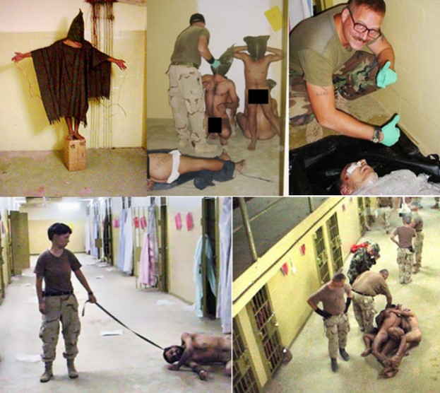

#### Treating The Israeli-Palestinian Conflict and Russia-Ukraine War As Opportunities For Economic Education And World Peace. 

Without the wisdom of 'The Austrians' summarized above, homo sapiens will eventually self-destroy. Our brief discussions on World War One and the US-Japanese involvement in World War Two briefly showed how dangerous and misguided homo sapiens can be and how he easily segregates for slaughter. Mankind is already fortunate to have made it this far without a nuclear war. For example, during the 1962 Cuban Missile Crisis, had it not been for Russian submarine commander Vasili Alexandrovich Arkhipov's sole dissenting vote in a decision to launch a nuclear strike against the USA, mankind might have already suffered a nuclear holocaust. The horrific mindset of top military and political leaders-apes is perfectly captured in Daniel Ellsberg's great book "The Doomsday Machine: Confessions of a Nuclear War Planner". In a discussion of Ellsberg's book, famed intellectual Noam Chomsky summarizes:

>"The things that I learned in the book were hair-raising. For example, I learned… that during the Eisenhower period and basically carried on, there was one war plan, and the war plan was that if there was a confrontation with the Russians in Berlin,whatever, maybe a small confrontation, then immediately we wipe out every city in China… There was no alternative plan, that was the plan… A war could be set off just by inadvertence. There is case after case…where we came extremely close to war just by inadvertence. Sometimes reckless actions on the part of leaders, but sometimes just accidents that happen…When the first early warning system was established to detect incoming missiles…It turns out this new sophisticated system…In the first day of operation it detected a Russian missile attack with 99.9% certainty…That kind of thing happens over and over and the war plans are setup so that if somebody acts on that 99% a billion people die…Page after page of the book contains graphic example of this kind of, you can only call it insanity" - [Chomsky](https://www.youtube.com/watch?v=foati7DWvzE)

Let that sink in. Over some tribalistic scuffle in Berlin, which ultimately came down to economic ideology-ignorance, the incineration of hundreds of millions of Chinese and a probable terrestrial life-ending environmental catastrophe would occur. The upper echelons of the US military-leadership is packed with slightly smarter apes who see the world similarly and one can be certain that so are the corresponding Chinese-Russian military apes. For example, during the Vietnam War, President Nixon mentioned to then Secretary of State Henry Kissinger that "I'd rather use the nuclear bomb" and "The only place where you and I disagree … is with regard to the bombing…You're so goddamned concerned about the civilians and I don't give a damn. I don't care." As technological progress continues to accelerate, it is just a matter of time before any disgruntled group can manufacture a device as damaging as a nuke, or cause enough havoc in a few major cities to cause devastating disruptions to global trade-production which can be just as damaging to the social order as if entire cities are wiped out. The world had plenty of so-called "experts" and scholars in 1914 and 1939 when the world wars got started. Nothing has changed! From my perspective, it is a statistical certainty that unless we have a popular movement where the 'immense majority' of people really understand freedom and the fallacies highlighted above homo sapiens will prove to be a dead end.

Let us now apply the wisdom of 'The Austrians' to making sense of the Israeli-Palestinian conflict and Russia-Ukraine war. The Russia-Ukraine war is actually an inadvertent outgrowth of the Israeli-Palestinian conflict which is itself an outgrowth of Jew-Gentile misunderstandings that must be traced to complex factors for which no one is to blame arising from the co-evolution of our Abrahamic religions (Judaism, Christianity and Islam) and 'the market process' or Capitalism. Let us very very briefly try to describe this evolutionary process and how it has affected history especially the last 150 years or so.

We have to cut a few corners and fast forward from about 100,000 years ago where there were thousands of little ethnocentric tribes to about 2,000 years ago when some of these pockets were being integrated-absorbed into growing empires. So we got Jews, one of these many ethnocentric groups-"identities", then a Jew by the name of Jesus says he is the son of God and a sort of cultural mutation of Judaism in the form of Christianity emerges. Christianity lost the ethnocentrism that Judaism contains (generally speaking your mother has to be Jewish) which encouraged members to proselytize and rapidly grow in numbers, spreading the great-viral-simple "Ten Commandments", winning converts who are not supposed to kill each other thus trade relatively peacefully, inadvertently helping spread the "market process" and division of labor-information. If we look at Christianity, some of its rules which differed from what was more mainstream at the time and inadvertently led to its growth were things like the prohibition of infanticide, condemnation of divorce, incest, marital infidelity and polygamy. In the Greco-Roman world where Christianity emerged, infanticide, especially of girls, was a common and accepted practice leading to populations of more males than females. For example, there were 131 males per 100 females in the city of Rome, and 140 males per 100 females in Italy, Asia Minor, and North Africa. (Stark, p. 97) The prohibition of infanticide would help Christian populations grow faster. These values-rules coupled with the relatively higher status afforded to women made this new religious movement much more appealing to women who would often times convert their husbands thus helping the religion and its values spread. Did early Christian theologians know that such values would play a significant role in the growth of Christianity and its success? Did they plan this? I doubt it. Again, these things "are indeed the result of human action, but not the execution of any human design". 

Remaining an inevitably smaller ethnocentric ideology led to the history of ill treatment-friction-expulsions Jews have experienced at the hands of the larger Christianity-Islam. Unfortunate, but what can we do, we are slightly smarter apes after all. The best we can hope for is to become "civilized" slightly smarter apes, which we do by understanding what leads to civilization, private property, intellectual freedom and the selection of superior information-TRUTH and order that emerges from it. 

At around 610 A.D., a great Arab merchant-businessman, Mohammed, whose wife Khadija was Mecca's most prominent venture capitalist who invested in large trade caravans, was visited by the angel Gabriel(the same Gabriel mentioned in the Old Testament’s Book of Daniel) and given the word of God which became Islam’s holy book, the Qur’an. The Qur’an treats Christianity’s main prophet, Jesus, as well as Judaism’s Moses as God’s earlier prophets, but with Mohammed being the last prophet and having compiled the Qur’an directly from divinity, this makes it, according to Muslims, the correct-superior interpretation of God’s word. Islam saw Christians and Jews as “People of the Book”(ahl al-kitāb), or people who had been guided by earlier true prophets and worshiped the one true God according to Islam. This gave Christians and Jews and later other non-believers special albeit inferior standing in the Islamic world, they became “dhimmis” or “protected peoples”. The economic policies of early Islam played an important role in its fast growth. According to tax historian Charles Adams, one of the reasons Islam spread so fast during its infancy was due to the relief of oppressive Roman taxation that converts would enjoy. Adam writes: 

>“In less than 120 years, with an offer of tax immunity, Islam spread very quickly, expanding into India in the East and coming to a halt at the Atlantic Ocean in the West. The main loser was Christianity, which was tied to the oppressive Roman tax system. No religion, before or since, has spread so far, so fast.” 

Unfortunately, yet understandably given the ideological state of mankind at the time, the Qur'an has verses which are highly critical of Jews (to put it kindly). For example:

>"Thou wilt surely find the most hostile of men to the believers are the Jews and the idolaters;"

So it is very easy for Jews to point to such passages to justify their nearly intuitive believe that Islam is antisemitic. However, there is truth to that statement as well. It is understandable how Jews who don't believe that Muhammed was some legitimate prophet might offend Muslims. Consider the following. On Oct 16th, 2010 Rabbi Ovadia Yosef, founder and spiritual leader of the largest religious political party in Israel(Shas) which won 11 of 120 Knesset seats in the 2009 elections, and is also a former Sephardi Chief Rabbi of Israel which can be seen as the sort of Pope of the Sephardic Jews, said in a sermon that:

>“Goyim[non-Jews] were born only to serve us. Without that, they have no place in the world – only to serve the People of Israel,"...“Why are gentiles needed? They will work, they will plow, they will reap. We will sit like an effendi and eat. That is why gentiles [were created,”](https://www.timesofisrael.com/5-of-ovadia-yosefs-most-controversial-quotations/)

His funeral was attended by over 800,000 adoring fellow slightly smarter apes who absorbed a "Jewish identity" in Jerusalem...If this slightly smarter ape can expose such views a decade into the 21st century just imagine what other Rabbis in the even more mystical past would say about non-Jews and the understandable bad blood between them and surrounding Muslims-Christians.

#### Inadvertent positive over-representation in Banking, Finance, Capitalism

The classic and perhaps most important example of the co-evolution of the 'market process' and culture can be seen with the emergence of modern banking-finance. For example, Islam has strong prohibitions against charging interest(usury) which have short-circuited or greatly hampered the market process’ evolution in the Islamic world. The following passages from the Qur’an are perhaps the most relevant:

>“That they took usury, though they were forbidden; and that they devoured men's substance wrongfully;- we have prepared for those among them who reject faith a grievous punishment.” 4:161

>“Those who devour usury will not stand except as stands one whom the Evil One by his touch has driven to madness. That is because they say: “Trade is like usury,” but Allah has permitted trade and forbidden usury...” 2:275

>“Allah will deprive usury of all blessing, but will give increase for deeds of charity: for He does not love ungrateful and wicked creatures.” 2:276

Christianity’s New Testament seems more usury-friendly via passages like, Luke 19:23  “Why, then, didst thou not put money in a bank, so that I on my return might have gotten it with interest?” , but Luke 6:35 “But love your enemies, do good to them, and lend to them without expecting to get anything back” could be used to support an anti-usury position which is what the Church enforced for over a thousand years before eventually abandoning the strong anti-usury stand.

When it comes to Judaism and the Old Testament, God’s message is one that shuns charging interest between Israelites-Jews but allows it to be charged to non-Israelites. The most influential verses are Deuteronomy 23:20 “You may charge a foreigner interest, but not a brother Israelite…” and Exodus 22:25 “If you lend money to one of my people among you who is needy, do not be like a moneylender; charge him no interest.” This is a good example of mankind’s tribal ethnocentrism shunning a practice which is believed to be bad within the group, but allowing its use with those outside the group. The fourteenth-century French Jew Levi ben Gershom felt it was good to burden the gentile with interest ‘because one should not benefit an idolator… and cause him as much damage as possible without deviating from righteousness.’ (Johnson, Paul. (1988). A History of the Jews. , p. 174)

The few religious scriptures we have just read have had profound ramifications. In a Christian world that would excommunicate usurers-moneylenders, Jews being immune to excommunication found an advantage as moneylenders, although an advantage that also came with risky court battles as Christian creditors would sometimes try to play the “charging interest is against God” card when it came to paying their debts. The prevalence of Jews as moneylenders even shows itself in the Magna Carta where there is a small section establishing some rules when dealing with [Jewish moneylenders.](https://www.bl.uk/magna-carta/articles/magna-carta-english-translation) Historian Paul Johnson writes:

>“The Jews reacted by engaging in the one business where Christian laws actually discriminated in their favour, and so became identified with the hated trade of moneylending. Rabbi Joseph Colon, who knew both France and Italy in the second half of the fifteenth century, wrote that the Jews of both countries hardly engaged in any other profession” (Johnson, Paul. (1988). A History of the Jews. , p. 174)

Johnson mentions other ways in which Jews helped push the world in a more capitalist direction. One was financial innovation via their influence in the development of stock markets. Another was their stress on the importance of advertising. Better advertising speeds up competition and its spread of superior ideas-products so it is a great boost to civilization-order. Johnson also mentions how “Jews were exceptionally adept at gathering and making use of commercial intelligence.” (Johnson, p. 286) For centuries Jews had evolved into a sort of extended family that covered much of the Western world, “they ran sensitive and speedy information systems which enabled them to respond rapidly to political and military events and to the changing demands of regional, national and world markets.” (Johnson, p. 286) The September 27th 1712 issue of England’s Spectator described the Jew’s influence as follows:

>"They are so disseminated through all the trading Parts of the World, that they are become the instruments by which the most distant Nations converse with one another and by which mankind are knit together in a general correspondence. They are like the pegs and nails in a great building, which though they are but little valued in themselves, are absolutely necessary to keep the whole frame together." (Sombart "The Jews and Modern Capitalism", p. 171)

It was bad enough that they rejected the divinity of Christianity and Islam and practiced usury; but Jews were also fierce competitors who would upset Christian businessmen by disrupting their anti-competitive customs, all for the great benefit of the consumer and European social order and culture of course. Historian-Economist Werner Sombart mentions how according to the values at the time “To take away your neighbour’s customers was contemptible, unchristian, and immoral” (Sombart, p. 129). For example, in 1745 Toulouse France, Christian traders complained that “everybody runs to the Jewish traders.” (Sombart, p. 126) In Poland, 1619, “difficulties and stumbling-blocks are put in the way of merchants and craftsmen by the competition of Jews” (Sombart, p. 126). In England, 17th century English merchant and one time governor of the East India Company Josiah Child mentioned, “The Jews are a subtil people… depriving the English merchant of that profit he would otherwise gain.”[108] In Prussia, 1750 “The merchants of our town…complain… that Jewish traders who sell the same goods do them a great harm, because they sell at a lower price.” (Sombart, p. 142) Mises writes:

>"The Nazis have an ally in every town or village where there is a man eager to get rid of a Jewish competitor. The secret weapon of Hitler is the anti-Jewish inclinations of many millions of shopkeepers and grocers, of doctors and lawyers, professors and writers." [(Mises, "Omnipotent Government")](https://oll.libertyfund.org/titles/mises-omnipotent-government-the-rise-of-the-total-state-and-total-war/simple)

Hitler, who like most popular leaders was simply the embodiment of the economic fallacies-myths-prejudices of the times, was of course a 'National Socialist', who had little understanding of the vital role that economic freedom plays in society and erroneously saw things like the emerging stock markets and finance industry, especially given the relative over-representation of Jews, as some gimmick-scam plotted by them to the detriment of non-Jews. His fallacies-ignorance can easily be seen in numerous excerpts like this one from a speech given in Munich on July 28th, 1922:

>"The vast process of the industrialization of the peoples meant the confluence of great masses of workmen in the towns...Parallel with this was a gradual 'moneyfication' of the whole of the nation's labor-strength. 'Share-capital' was in the ascendant, and thus bit by bit the Stock Exchange came to control the whole national economy. The directors of these institutions were, and are without exception, Jews. I say 'without exception,' for the few non-Jews who had a share in them are in the last resort nothing but screens, shop-window Christians, whom one needs in order, for the sake of the masses, to keep up the appearance that these institutions were after all founded as a natural outcome of the needs and the economic life of all peoples alike, and were not, as was the fact, institutions which correspond only with the essential characteristics of the Jewish people and are the outcome of those characteristics." [(Hitler)](http://comicism.tripod.com/220728.html)

We should quickly add that Churchill, being a slightly smarter ape like Hitler and absorbing similar popular ideas of the times was just as (if not more) racist than Hitler and for draconian forceful sterilizations:

>"I propose that 100,000 degenerate Britons should be forcibly sterilized and others put in labour camps to halt the decline of the British race."

>"I am strongly in favour of using poisoned gas against uncivilised tribes"

>"[Mahatma Gandhi] ought to be lain bound hand and foot at the gates of Delhi, and then trampled on by an enormous elephant with the new Viceroy seated on its back. Gandhi-ism and everything it stands for will have to be grappled with and crushed."

>"I hate Indians. They are beastly people with a beastly religion."

>"I do not admit… that a great wrong has been done to the Red Indians of America, or the black people of Australia… by the fact that a stronger race, a higher grade race… has come in and taken its place." 

#### Inadvertent negative over-representation in Socialism and Communism

Let us also briefly discuss some of the environmental-'evolutionary factors'-pressures which unfortunately attracted so many Jews to Socialism-Communism with disastrous repercussions. How prevalent were Jews in spreading-implementing Socialist-Communist ideology? First of all there was Karl Marx, Socialism-Communism's main intellectual who gave the movement enough of a naïve intellectual aura to mislead hundreds of future would-be dictators-intellectuals. Leon Trotsky(born Lev Davidovich Bronstein), founder of the Red Army, second only to Lenin and most likely to succeed him as leader of the Russian communists was also an ethnic Jew. Slezkine writes:

>"At the First All-Russian Congress of Soviets in June 1917, at least 31 percent of Bolshevik delegates(and 37 percent of Unified Social Democrats) were Jews. At the Bolshevik Central Committee meeting of October 23, 1917, which voted to launch an armed insurrection, 5 out of the 12 members present were Jews. Three out of seven Politbureau members charged with leading the October uprising were Jews(Trotsky, Zinoviev, and Grigory Sokolnikov)." (Slezkine,"The Jewish Century" p. 175)

According to Lenin, it was thanks to Jews that his Bolsheviks were able to "take over the state apparatus" in Russia. Lenin mentions:

>"The fact that there were many Jewish intelligentsia members in the Russian cities was of great importance to the revolution. They put an end to the general sabotage that we were confronted with after the October Revolution… The Jewish elements were mobilized… and thus saved the revolution at a difficult time. It was only thanks to this pool of a rational and literate labor force that we succeeded in taking over the state apparatus" (Slezkine, "The Jewish Century" p. 224)

Winston Churchill wisely recognized the tremendous role Jews have played in spreading civilization-enabling ideas, as in the foundation of Christian-Western morals(the simplicity-viralness-competitiveness of the Ten Commandments), as well as disastrous ones as in the case of their large involvement in Socialism-Communism. He writes:

>"Some people like Jews and some do not; but no thoughtful man can doubt the fact that they are beyond all question the most formidable and the most remarkable race which has ever appeared in the world….The conflict between good and evil which proceeds unceasingly in the breast of man nowhere reaches such an intensity as in the Jewish race. The dual nature of mankind is nowhere more strongly or more terribly exemplified. We owe to the Jews in the Christian revelation a system of ethics which, even if it were entirely separated from the supernatural, would be incomparably the most precious possession of mankind, worth in fact the fruits of all other wisdom and learning put together. On that system and by that faith there has been built out of the wreck of the Roman Empire the whole of our existing civilization. And it may well be that this same astounding race may at the present time be in the actual process of producing another system of morals and philosophy, as malevolent as Christianity was benevolent, which, if not arrested, would shatter irretrievably all that Christianity has rendered possible. It would almost seem as if the gospel of Christ and the gospel of Antichrist were destined to originate among the same people; and that this mystic and mysterious race had been chosen for the supreme manifestations, both of the divine and the diabolical….

>There is no need to exaggerate the part played in the creation of Bolshevism and in the actual bringing about of the Russian Revolution, by these international and for the most part atheistical Jews, it is certainly a very great one; it probably outweighs all others. With the notable exception of Lenin, the majority of the leading figures are Jews. Moreover, the principal inspiration and driving power comes from the Jewish leaders. Thus Tchitcherin, a pure Russian, is eclipsed by his nominal subordinate Litvinoff, and the influence of Russians like Bukharin or Lunacharski cannot be compared with the power of Trotsky, or of Zinovieff, the Dictator of the Red Citadel (Petrograd) or of Krassin or Radek –all Jews. In the Soviet institutions the predominance of Jews is even more astonishing. And the prominent, if not indeed the principal, part in the system of terrorism applied by the Extraordinary Commissions for Combating Counter-Revolution has been taken by Jews…" [(Churchill's essay "Zionism vs. Bolshevism (1920))](https://en.wikisource.org/wiki/Zionism_versus_Bolshevism )

Churchill's last sentence above refers to the most unfortunate over-representation of Jews within the Communist nightmare, their over-representation in the top echelons of the Soviet Union's famed-tyrannical secret police, the Cheka, later becoming the OGPU, then NKVD… Slezkine writes that:

>"In 1923, at the time of the creation of the OGPU(the Cheka's successor), Jews made up 15.5 percent of all "leading" officials and 50 percent of the top brass (4 out of 8 members of the Collegium's Secretariat). "Socially alien" Jews were well represented among Cheka-OGPU prisoners, too, but Leonard Schapiro is probably justified in generalizing (especially about the territory of the former Pale) that "anyone who had the misfortune to fall into the hands of the Cheka stood a very good chance of finding himself confronted with and possibly shot by a Jewish investigator." (Slezkine, Yuri. (2004). The Jewish Century., p. 177) … "Indeed, the Soviet secret police - the regime's sacred center, known after 1934 as the NKVD - was one of the most Jewish of all Soviet institutions. In January 1937, on the eve of the Great Terror, the 111 top NKVD officials included 42 Jews, 35 Russians, 8 Latvians, and 26 others. Out of twenty NKVD directorates, twelve(60 percent, including State Security, Police, Labor Camps, and Resettlement) were headed by officers who identified themselves as ethnic Jews. The most exclusive and sensitive of all NKVD agencies, the Main Directorate for State Security, consisted of ten departments: seven of them(…) were run by immigrants from the former Pale of Settlement. Foreign service was an almost exclusively Jewish specialty (as was spying for the Soviet Union in Western Europe and especially in the United States). The Gulag, or Main Labor Camp Administration, was headed by ethnic Jews from 1930, when it was formed, until late November 1938, when the Great Terror was almost over." (Ibid, pp. 254–5)

For a people who were sometimes seen as foreigners, Socialism's international brotherhood ("Workers of the world, unite!" was to be a popular rallying cry) would seem to have an additional appeal and be a perfect fit for a people who were already a sort of international family. Socialism's atheism would also do away with a major source of Jewish troubles now that everyone was supposed to be atheist-irreligious in the new scientific and rational Socialist world. The central and viral economic fallacy of Socialism, that having smart people-"experts" plan the social order would be better than letting selfish and greedy businessmen do so, needed the smarter and better educated to be the planners, and this is exactly what Jews were compared to the rest (at least in Russia), thus naturally rising to the top of the movement. Historian William Johnston writes that "Jews had enjoyed many centuries of literacy before the rest of Europe started to become literate in the eighteenth [century."](https://books.google.com/books?id=it9c6z4bw_8C&pg=PA38&lpg=PA38&dq=%22Jews+had+enjoyed+many+centuries+of+literacy+before+the+rest+of+Europe+started+to+become+literate+in+the+eighteenth+century%22&source=bl&ots=w6zPc5ISGe&sig=ACfU3U32b6Ni1Nyd9C-paQSGo84xFZeHpQ&hl=en&sa=X&ved=2ahUKEwiN77GIj__mAhU5HjQIHWZkDNIQ6AEwAHoECAYQAQ#v=onepage&q=%22Jews%20had%20enjoyed%20many%20centuries%20of%20literacy%20before%20the%20rest%20of%20Europe%20started%20to%20become%20literate%20in%20the%20eighteenth%20century%22&f=false) Slezkine gives more detail:

>"The Jews were, consistently and by a substantial margin, the most literate group in the Soviet Union(85 percent, as compared to 58 percent for Russians, in 1926; and 94.3 percent, as compared to 83.4 percent for Russians, in 1939)…By 1939, 26.5 percent of all Jews had had a high school education(as compared to 7.8 percent of the population for the Soviet Union as a whole and 8.1 percent of Russians in the Russian Federation). In Leningrad, the proportion of high school graduates among Jews was 40.2 percent(as compared to 28.6 percent for the city as a whole). The number of Jewish students in the two upper grades of Soviet high schools was more than 3.5 times their share in the general population." [(Slezkine, "The Jewish Century" p. 222)](https://books.google.com/books?id=qzN6DwAAQBAJ&pg=PA222&lpg=PA222&dq=%22The+Jews+were,+consistently+and+by+a+substantial+margin,+the+most+literate+group+in+the+Soviet+Union%22&source=bl&ots=AFyu8t5M2s&sig=ACfU3U3yeYE4FlVqlF_gUCu1zrGwGLDiow&hl=en&sa=X&ved=2ahUKEwjYu7Gyj__mAhVYHzQIHcDfD-kQ6AEwAHoECAEQAQ#v=onepage&q=%22The%20Jews%20were%2C%20consistently%20and%20by%20a%20substantial%20margin%2C%20the%20most%20literate%20group%20in%20the%20Soviet%20Union%22&f=false)

Chaim Weizmann recalls in his autobiography the simple fact that: "the non-Jewish population had not the same overwhelming thirst for knowledge as the Jews, who were always knocking at the doors of the [schools."](https://books.google.com/books?id=fl2mDwAAQBAJ&pg=PT37&lpg=PT37&dq=%22the+non-Jewish+population+had+not+the+same+overwhelming+thirst+for+knowledge+as+the+Jews,+who+were+always+knocking+at+the+doors+of+the+schools%22&source=bl&ots=a-o-w_-ls7&sig=ACfU3U1DZJvYeKpFP8ephZe8RFXCfH9uZA&hl=en&sa=X&ved=2ahUKEwi6v5LCj__mAhXzGDQIHeb_CHcQ6AEwAHoECAMQAQ#v=onepage&q=%22the%20non-Jewish%20population%20had%20not%20the%20same%20overwhelming%20thirst%20for%20knowledge%20as%20the%20Jews%2C%20who%20were%20always%20knocking%20at%20the%20doors%20of%20the%20schools%22&f=false)

This large participation-association of ethnic Jews with Socialism would have disastrous consequences for the majority of Jews who did not want to be a part of Socialism or much less abandon their faith and traditions. As Lenin and Trotsky were launching post-World War One Russia into a civil war(1918–22) between the Communist Red Army and the White Russian Army which supported the Russian Monarchy and old order-institutions, Jews would pay a heavy price. Johnson writes that:

>"The consequences for the Jews both immediate and long-term, both locally and world-wide, were appalling. The White Russian armies, seeking to destroy the Soviet regime, treated all Jews as enemies. In the Ukraine, the Civil War developed into the most extensive pogrom in Jewish history. There were more than 1,000 separate incidents involving the killing of Jews. Over 700 communities in the Ukraine were involved and several hundred more in Russia. Between 60,000 and 70,000 Jews were murdered. In other parts of eastern Europe, a similar identification of Jews with Bolshevism led directly to murderous attacks on harmless Jewish communities. They were particularly bloody in Poland after the failure of the Bolshevik invasion and in Hungary after the fall of the Bela Kun regime. They occurred intermittently in Rumania throughout the 1920s. In all three countries the local Communist Parties had been largely created and run by Non-Jewish Jews, and in each case it was the unpolitical, traditional, observant Jews of the ghettos and villages who paid the penalty." (Johnson, "A History of the Jews", p. 452)

Again, it needs to be stressed, as Johnson just mentioned: "In all three countries the local Communist Parties had been largely created and run by Non-Jewish Jews". Thus it is quite understandable how so many like Hitler, Churchill and many Europeans came to associate-equate Jews with it. 

We are now in a position to fully appreciate Herzl's wisdom when he summarizes: 

>"We are what the Ghetto made us. We have attained pre-eminence in finance, because mediaeval conditions drove us to it. The same process is now being repeated. We are again being forced into finance, now it is the stock exchange, by being kept out of other branches of economic activity. Being on the stock exchange, we are consequently exposed afresh to contempt. At the same time we continue to produce an abundance of mediocre intellects who find no outlet, and this endangers our social position as much as does our increasing wealth. Educated Jews without means are now rapidly becoming Socialists. Hence we are certain to suffer very severely in the struggle between classes, because we stand in the most exposed position in the camps of both Socialists and [capitalists."](https://www.jewishvirtuallibrary.org/quot-the-jewish-state-quot-theodor-herzl) 

We must emphasize that Socialist-Communist ideology, rooted on easy to absorb economic fallacies, was already occurring in the Western world and can be seen as an almost inevitable mistake as mankind tried to make sense of the workings of the social order-economy which was quickly growing in bewildering complexity. Jews were inadvertently in a position to be more attracted to Socialism and Capitalism and be leaders in both. They obviously did not "invent" or "plot" Socialism-Communism-Capitalism like Hitler and many others to this day claim. It could be said that they were 'naturally selected' to be Socialist-Capitalist-finance leaders, thus giving the impression that they were its "creators-plotters". Jewish involvement in such movements was "indeed the result of human action, but not the execution of any human design." If "the Jews" were smart enough to "plot" the numerous things the non-Jewish world accuses them of, they would have been smart enough to realize that Socialism-Communism was a disaster for Jew and non-Jew alike and have been telling everyone about fellow Jew Ludwig von Mises and have built him a 20+ feet solid gold statue and placed it in front of the Western Wall. The fact that they have yet to do this is further evidence that Jews in general are as lost in ignorance and mythology as the rest which makes perfect sense since we are all just fellow homo sapiens. 

#### Inadvertent evolution of the Zionist "Identity" 

Let us look at Zionism, the idea that the fellow homo sapiens who have absorbed a 'Jewish Identity', should live in their own country with laws, flag, anthem, etc. which discriminate against non-Jews, which eventually became today's Israel. Both antisemitism and Zionism are rooted in the same intellectual error, that the homo sapiens who “identify as Jews” are so different from the other homo sapiens that they must leave the real thousands of towns and Synagogues where for hundreds of years they were an integral part of Western Civilization to create a country (Israel) based on religious mythology in an area already populated by others who had a different “identity” (Muslims, Christians, and fellow anti-Zionist Jews) and for numerous understandable reasons were adamantly opposed to the creation of a “Jewish State” in their surroundings. 

By the late 1800s, as reason was replacing religious mysticism-squabbles, as the idea that all homo sapiens should have freedom and the same individual rights was spreading, things were quickly improving for all Europeans and especially Jews. As the Church and its monarchical rulers were being replaced by nationalist representative governments, the idea of Jewish Nationalism understandably emerged. Also as this increase in freedom *inadvertently* led to superior *'competitive knowledge discovery'* which led to Europeans increasing their dominance of the world, so did the potential influence of European Jews. Given their ill treatment in the form of legal restrictions as well as some religious zeal, eventually the idea of having their own country-state (an ideology which is known as Zionism) gained enough traction, a “traction” which understandably increased as Hitler rose to power. Theodore Herzl, the sort of father of political Zionism, envisioned this country in Palestine which contained many ancestral Jewish sites like Jerusalem. At first his pitch for Zionism was not very popular. The rabbinical establishment, reflecting the anti-Zionist views shared by most Jews in Munich, Germany, where Herzl wanted to hold the First Zionist Congress, strongly rejected the idea so the meeting was moved to Basle Switzerland(29-31st/8/1897). They told him :

>“…how can one speak with people who on the one hand are fanatics regarding Jewish nationhood and, on the other hand, complain that the Austrian government required a baptismal certificate from the candidate for the position of secretary of Bukowina. If the Austrian Jews support the efforts of the Zionists, then they should not complain that they are treated by the government like foreigners and are barred from public office. *We, however, can say to our fellow countrymen with complete conviction that we comprise a separate community solely with respect to religion. Regarding nationality, we feel totally at one with our fellow Germans and therefore strive towards the realization of the spiritual and moral goals of our dear fatherland with an enthusiasm equaling theirs…*.Eighteen hundred years ago, history made its decision regarding Jewish nationhood through the dissolution of the Jewish State and the destruction of the Temple”

This makes perfect sense. German, Polish, Russian, Spanish Jews spoke German, Polish, Russian, Spanish, and for centuries their identities had evolved in those locations where their Synagogues had been built and they made real tangible contributions to the evolution of Western Civilization. Until the last couple of centuries most people had never even seen a map and their "identities" were tied, not to a nation, but to a local town or village. The cultural concept of a 'Nation' as we currently treat it, did not generally arise until maps, better communication, faster transportation, etc. allowed our more local-tribal 'identities' to be expanded to now include much larger groups. This of course has led to bigger and bigger tribalistic National and then World Wars.

Since Jews tend to be an extended blood-related family that has been an oftentimes persecuted minority due to religious squabbles of antiquity-etc., the sense of "identity" and ethnocentrism is understandably stronger and has been an important albeit unfortunate factor in both antisemitism and Zionism. Theodore Herzl himself highlighted this ideological congruence of both Zionists and antisemites in his foundational book "The Jewish State"(1896) that:

>"The anti-semites will be our most steadfast friends." "The anti-Semitic countries will be our allies" "Great exertions will hardly be necessary to spur on the movement. Anti-Semites provide the requisite impetus. They need only do what they did before, and then they will create a desire to emigrate where it did not previously exist, and strengthen it where it [existed before."](https://www.jewishvirtuallibrary.org/quot-the-jewish-state-quot-theodor-herzl)

We already mentioned how freedom and the competition that grows from it was shaping the relatively "ethnocentric" identities of all peoples and turning us into worldly citizens. During the early days of Zionism, Jews were divided into the Zionists and anti-Zionists ("assimilationists"). Chaim Weizmann, the leading Zionist figure after Herzl’s death in 1904, lamented how "assimilated Jews" were "dead against Zionism" and identified Zionism as "a primitive tribalism":

>"For assimilated Jews...They looked upon it...as a primitive tribalism. They felt themselves...called upon to "rescue" Judaism from Zionism...these people are dead against Zionism...Zionism is not meant for those people who have cut themselves adrift [from Jewry..."](https://books.google.com/books?id=fl2mDwAAQBAJ&pg=PT195&lpg=PT195&dq=%22these+people+are+dead+against+Zionism%22&source=bl&ots=a-o-r-Wnsc&sig=ACfU3U0LI-8_Jfxm7zq0ugg-knd9AF_uBw&hl=en&sa=X&ved=2ahUKEwirlLKh3PDmAhXLl54KHeA0CtwQ6AEwAHoECAMQAQ#v=onepage&q=%22these%20people%20are%20dead%20against%20Zionism%22&f=false)

That rapidly increasing number of very well educated cosmopolitan "assimilated Jews" spread all over Europe-USA just wanted to be fellow human beings or equal world citizens free of ancient tribalisms-mysticisms-identities. Unfortunately, for very understandable reasons-factors for which nobody is to blame and are ultimately rooted in economic ignorance, like a rocket that is just about to reach orbit but runs out of fuel and comes crashing down to earth, Zionism would inadvertently pull 'Jewish Identity' and all of Western Civilization back to an increasingly ethnocentric identity-worldview with disastrous consequences. The Zionist Jews began to tie their “identity” to what may have been an error and eventually reach the stage where we are today, where saying that Zionism and the resulting Israeli state (as it currently functions) may have been a massive error. What most Jews in the late 1800s were saying, is seen by many Jews today as antisemitic. CEO of the Anti-Defamation League Jonathan Greenblatt has mentioned that "Anti-Zionism is antisemitism". Like a young ideologue who is persuaded by Marx’s "Communist Manifesto" and sees businessmen as sinister capitalists to be punished, as Israeli author of the excellent book 'The Invention of the Jewish People', Shlomo Sand, notices: "Zionism has become…. [a sort of Stalinism"](https://www.youtube.com/watch?v=kHCaykhbvvA) which seeks to make it a ‘hate crime’ to criticize or want to replace the current Israeli-Zionist state. Once again! Very importantly! This should NOT be seen as the “fault” of the fellow homo sapiens who have absorbed a 'Zionist identity'. The Bolshevik masses and their intellectuals and politicians which brought about so much tyranny, like the witch burners, were just executing the myths that filled their minds. Just like the obvious desire of some businessmen to pay employees less in order to make large profits is all Communists needed to see to justify their ideology and persecute the businessmen-capitalists, similarly, the Zionists can easily find “anti-Semites” and people who erroneously accuse Jews of ‘plotting’ capitalism or communism or killing Jesus and all that nonsense to justify their Zionism. Again, there is no one to blame here, we just have 'identities' evolving and reacting to each other in various ways. 

Given the above it is easy to understand how the Zionist mindset-identity-software would continue to spread. Had there been no antisemitism-Jew-Gentile conflicts in ‘Western Civilization’, Zionism and resulting ongoing disastrous ramifications simply would not have occurred. Many Christians with the best of intentions also played a significant role. It easily made sense for many Christians that Jews should live in their ancient lands, for example American president during World War One Woodrow Wilson too liked the idea: “To think, that I the son of a manse should be able to help restore the Holy Land to its people.” Wanting to win the support of Jews everywhere for their war against Germany, on November 2nd 1917, via the ‘Balfour Declaration’, the British government officially made it a policy to help create a “National Home” for Jews in Palestine. Former Prime Minister James Balfour mentioned in a cabinet meeting that:

>“The vast majority of Jews in Russia and America... now appear to be favorable to Zionism. If we could make a declaration favorable to such an ideal, we should be able to carry on extremely useful propaganda in both Russia and America.” (Judis, p. 59)

British Prime Minister Lloyd George added that:

>“the Zionist leaders gave us a definite promise that, if the Allies committed themselves to giving facilities for the establishment of a National Home for the Jews in Palestine, they would do their best to rally to the Allied cause.” (Judis, p. 59) 

What about the 700,000 or so Arabs who already inhabited Palestine?

When the First World War ended (1918) and the victors (British-French-US) were deciding what to do with the acquired lands (Palestine), in order to better understand the wishes of the local population regarding the possibility of creating a Jewish state in the land, the USA organized the King-Crane commission. Among their findings-recommendations were:

>“We recommend…serious modification of the extreme Zionist programme for Palestine of unlimited immigration of Jews, looking finally to making Palestine distinctly a Jewish State…The fact came out repeatedly in the Commission’s conference with Jewish representatives, that the Zionists looked forward to a practically complete dispossession of the present non-Jewish inhabitants of Palestine, by various forms of purchase.…it is to be remembered that the non-Jewish population of Palestine — nearly nine tenths of the whole — are emphatically against the entire Zionist program…there was no one thing upon which the population of Palestine were more agreed than upon this. To subject a people so minded to unlimited Jewish immigration, and to steady financial and social pressure to surrender the land, would be a gross violation of the principle just quoted, and of the people’s rights…It is to be noted also that the feeling against the Zionist program is not confined to Palestine, but shared very generally by the people throughout Syria as our conferences clearly showed. The Peace Conference should not shut its eyes to the fact that the anti-Zionist feeling in Palestine and Syria is intense and not lightly to be flouted. No British officer, consulted by the Commissioners, believed that the Zionist program could be carried out except by force of arms…That of itself is evidence of a strong sense of the injustice of the Zionist program, on the part of the non-Jewish populations of Palestine and Syria. Decisions, requiring armies to carry out, are sometimes necessary, but they are surely not gratuitously to be taken in the interests of a serious injustice. For the initial claim, often submitted by Zionist representatives, that they have a “right” to Palestine, based on an occupation of 2,000 years ago, can hardly be seriously considered.…The places which are most sacred to Christians-those having to do with Jesus-and which are also sacred to Moslems, are not only not sacred to Jews, but abhorrent to them. It is simply impossible, under those circumstances, for Moslems and Christians to feel satisfied to have these places in Jewish hands, or under the custody of Jews… In fact, from this point of view, the Moslems, just because the sacred places of all three religions are sacred to them have made very naturally much more satisfactory custodians of the holy places than the Jews could be…In view of all these considerations, and with a deep sense of sympathy for the Jewish cause, the Commissioners feel bound to recommend that only a greatly reduced Zionist program be attempted by the Peace Conference, and even that, only very gradually initiated. This would have to mean that Jewish immigration should be definitely limited, and that the project for making Palestine distinctly a Jewish commonwealth should be given up.”

A group of prominent Arab Muslims and Christians sent a letter to the Paris Peace Conference (1919) expressing their opposition to Zionism.

>“The principles of justice and equity cannot admit of the crushing of a nation by an influx of a greater number of another foreign nation that will assimilate her… The country is ours and has been so of old. We have lived in it longer than they did, and have worked in it more than they did. Our historical and religious relations with it, we Moslems and Christians, far exceed those of the Jews. Therefore, their claim to their ancient historical rights in the country do not give them the right of appropriating it, in as much as in our historical rights we Arabs cannot justify our claims in Spain, our old home, where our rule and glory flourished for eight centuries and this gave birth to the modern civilization of Europe… Does justice then allow of the violation of the rights of the majority?”

But the imperialist attitude of the British-Europeans is perfectly captured by former Prime Minister Lord Balfour who said at the time:

>“I am quite unable to see why Heaven or any other Power should object to our telling the Moslem what he ought to think”

And:

>“For in Palestine we do not propose to even go through the form of consulting the wishes of the present inhabitants of the country though the American [King-Crane] Commission is going through the form of asking what they are. The Four Great Powers [Britain, France, Italy and the United States] are committed to Zionism. And Zionism, be it right or wrong, good or bad, is rooted in age-long traditions, in present needs, and future hopes, of far profounder import than the desires and prejudices of the 700,000 Arabs who now inhabit that ancient land.”

If the Palestinians-natives had some form of truly representative government the potential Zionist error could have been prevented but to a significant degree this was not to be thanks to Zionism’s perhaps most influential ally, Winston Churchill. During the First World War, serving as First Lord of the Admiralty, Churchill faced a growing shortage of acetone, which was needed as part of the process used to make cordite, an essential naval explosive. Chaim Weizmann just happened to be a chemist and was able to solve this problem thus increasing his influence with leading British authorities. When Prime Minister David Lloyd George asked Weizmann what he wanted for payment, according to Lloyd George, Weizmann said “the rights to Palestine.” During the years 1920-1922 Churchill was the Colonial Secretary allowing him to call the shots in the British controlled Middle East. On May 12th, 1921 Palestinian representatives sent the Colonial Office resolutions asking for representative government, the annulling of the Balfour Declaration, and prohibition of Jewish immigration, but on May 31st Churchill told the British Cabinet that:

>“he had decided to suspend the development of representative institutions in Palestine ‘owing to the fact that any elected body would undoubtedly prohibit further immigration of Jews’ ” (Gilbert, 1991, p. 437)

Many of the Zionists were atheist Communists intent on creating a Socialist state whose views could not have been more abhorrent to the locals and surrounding population. David Ben Gurion, the leading Zionist figure and eventual first Prime Minister of Israel was one of these and he visited Moscow on Nov. 7th 1923 to celebrate the 6th anniversary of the 'October Revolution' as a representative of the 'General Organization of Hebrew Workers in Palestine' (the 'Histadrut'). 

Churchill, the quintessential British racist-colonialist, was enamored by the progress Zionists were making in cultivating land and was not impressed with the Arabs whom Churchill criticized:

>“Left to themselves, the Arabs of Palestine would not in a thousand years have taken effective steps towards the irrigation and electrification of Palestine. They would have been quite content to dwell –a handful of philosophic people—in the wasted sun-scorched plains, letting the waters of the Jordan continue to flow unbridled and unharnessed into the Dead Sea.” (Gilbert, 2007, p. 81)

In another comment Churchill mentioned that “The injustice is when those who lived in the country leave it to be desert for thousands of years” (Gilbert, 2007, p. 113)

With the rise of Hitler in Germany in 1933, the British, with Zionist encouragement, were turning Palestine into the preferred destination for some of the unwanted European Jews. And, unfortunately, unwanted they were. We have already touched upon some of the reasons why Jews were disliked to which one should add the fact that Hitler rose to power during a worldwide economic depression which made potential host countries to Jewish immigration even less receptive to it. While sympathizing and condemning the legal restrictions and mistreatment of Jews by the Third Reich, most countries felt like they had enough problems dealing with their own poor and unemployed to allow large numbers of displaced Jews to compete for a seemingly scarce number of jobs and that sort of thing. For example, while discussing Jewish immigration to Canada during Hitler’s regime Theodore S. Hamerow writes:

>“In Canada as in all democratic nations, economic need reinforced ethnic prejudice in generating opposition to the admission of refugees. In Canada, however, that opposition became stronger than in any country outside Eastern Europe. It gained force, moreover, just as the need for asylum was growing more urgent. In early years after the Great Depression, between 1931 and 1933, close to 15,000 Jews entered Canada. But after the establishment of the National Socialist regime in Germany, the doors began to close, and they remained closed or almost closed until the collapse of the Third Reich. Between 1933 and 1945, a mere 5,000 Jews found refuge in Canada…in none was the opposition to the admission of victims of Nazi bigotry as strong or effective as in Canada.” (Hamerow, p. 156)

With respect to Jewish immigration to the U.S., Johnson writes:

>“It was in the United States, however, that the Bolshevik takeover, and its association with radical Jews, had the most serious consequences. In France, Jews might be assailed from right and left, but the country continued to be generous in receiving Jewish refugees throughout the 1920s and even during the 1930s. In America, however, the Bolshevik scare effectively ended the policy of unrestricted immigration which had been the salvation of European Jewry…The 1924 Johnson-Reed Act…cut total immigration to 154,000 yearly, and reduce the Polish, Russian, and Rumanian quotas, almost entirely of Jews, to a total of 8,879. It was effectively the end of mass Jewish immigration to the US.” (Johnson, 1988, pp. 459-60)

In 1918, when Palestine became a British dominion there were about 60,000(8%) Jews and 700,000(92%) Arabs, by 1922 84,000(10%) Jews and 760,000(90%) Arabs, by 1931 Jews were about 17% of the population. Once Hitler rose to power the years 1933-36 brought record numbers of Jews to Palestine, 30,000, 42,000, 62,000, and 30,000 respectively, about 164,000 in total, which quickly led to Jews being almost 28% of the population by 1937. Zionist leader and future Israeli Prime Minister David Ben-Gurion had no problems understanding the Arab point of view:

>“There is a fundamental conflict. We and they want the same thing: We both want Palestine. And that is the fundamental conflict”… “Were I an Arab…I would rise up against immigration liable sometime in the future to hand the country and all of its Arab inhabitants over to Jewish rule. What Arab cannot do his math and understand that immigration at the rate of 60,000 a year means a Jewish state in all of Palestine?” (Teveth, pp. 166-8)

This large influx of Jewish immigrants and obvious acceleration-intensification of the Zionist program led to the 1936-39 Arab revolt, which consisted of various boycotts and strikes, armed resistance against the occupying British authorities, acts of sabotage like repeated bombings of oil pipelines, and sporadic attacks against Jewish settlements. The revolt was brutally suppressed by the British which often used collective punishment like reducing entire villages to rubble, holding thousands of people without trial in poorly sanitized and deplorable detention centers, and just generally applying the sort of harsh military justice that leads to frequent miscarriages of justice and only serves to both demoralize and aggravate an entire population based on the actions of a few. The revolt proved to be counterproductive for the Arabs who lost many more lives and much of their leadership and had little effect in curbing Jewish immigration which continued to increase. (Morris, 1999, pp. 159-60)

The revolt did cause the British to finally begin to restrict Jewish immigration and take Arab grievances more seriously leading to a reformulation of British policy in what came to be known as the 1939 ‘White Paper’ which took effect on May 19, 1939.   The British were no longer in favor of a Jewish State or distinctively Jewish national home as had been implied by the Balfour declaration, but were now in favor of a single Palestinian state where Jews and Arabs would get along as equals. Immigration would also be restricted during the next 5 years to a combined total of 75,000 and land sales to Jews would be restricted-regulated by British authorities.

On May 23rd, 1939 Churchill gave a speech in the House of Commons attacking this change in policy. He said:

>“To whom was the pledge of the Balfour Declaration made? It was not made to the Jews of Palestine, it was not made to those who were actually living in Palestine. It was made to world Jewry and in particular to the Zionist associations. It was in consequence of and on the basis of this pledge that we received important help in the war.”

It is important to note how Churchill is admitting that Zionist Jews helped them win World War One against Germany.

About a month earlier on April 1st, 1939 that crazy and irrational maniacal Hitler gave a speech where he mentioned “What right, for example, has England to shoot down Arabs in Palestine just because they defend their homeland; who gives them this right?” And in another speech a few weeks later on April 28th Hitler reminded the self-righteous Roosevelt of certain obvious facts:

>“Similarly the fact has obviously escaped Mr. Roosevelt's notice that Palestine is at present occupied not by German troops but by the English; and that the country is undergoing restriction of its liberty by the most brutal resort to force, is being robbed of its independence and is suffering the cruelest maltreatment for the benefit of Jewish interlopers. The Arabs living in that country would therefore certainly not have complained to Mr. Roosevelt of German aggression, but they are voicing a constant appeal to the world, deploring the barbarous methods with which England is attempting to suppress a people which loves its freedom and is merely defending it.”

England’s change of heart, regardless of Churchill’s efforts, was unwelcomed by the Zionists especially once World War Two broke out in September of that year. Zionist paramilitary groups like the Irgun and Stern Gang, which would usually fight Arabs, began to wage a bloody terrorist campaign against the British once the war ended. Perhaps the most famous of such terrorist acts against the British was the bombing of the King David Hotel by the Irgun (leb by future Israeli PM Menachem Begin) on July 22nd 1946 where 91 people were killed and another 41 injured. By 1947, after dealing with Zionist animosity as well as the expenses associated with supporting nearly 100,000 troops in Palestine, the British felt like they had had enough and decided to turn over the whole mess to the United Nations. 

The United Nations created the UNSCOP(UN Special Committee on Palestine) and came up with a *recommendation*, the “U.N. partition plan of 1947” (aka Resolution 181) which gave 55% of the land to 37% of the people(Jews) for a future Jewish state and 44% of the land for the majority and native Arab population for their future state, with the city of Jerusalem administered by the U.N. Going against the advice of the State Department and the Pentagon, US President Harry Truman was persuaded by the tremendous pro-Zionist environment and went along and endorsed the recommendation. Needless to say the Arabs felt like some white guys in Europe deciding how to restructure the area, especially in such a manner, was not acceptable. The Zionists were understandably fed-up with the usual antisemitism and sporadic clashes with local Arabs, and as the British withdrew their forces they went on the offensive encouraging the depopulation of Arab villages and towns. Brigades were instructed:

“In the conquest of villages in your area, you will determine –whether to cleanse or destroy them.” (Morris, 2004, p. 165)

The common strategy was to use mortars to rain in bombs from above which would cause panic and exodus and then move in to finish the job. For example, one particular offensive in the coastal city of Haifa is partly described by Morris as follows: 

>“In preparation for the assault, around midnight 21/22 April, the Hagana had let loose with a 15-minute, 50-round barrage of heavy mortars on the lower city, triggering ‘great panic…and the mass exodus began’. Further barrages were released periodically during the night and in the morning of 22 April. By early afternoon, the attacks had broken the back of Arab resistance. Hours earlier, at 09:00, 22 April, Hagana units had reached Hamra Square and found it deserted: ‘All was desolate, the shops closed, no traffic…only several sick old Arab men and women moved about, confused.’”  (Morris, 2004, p. 190)

Later in the day a British intelligence officer describes the scene at the Haifa harbor’s entrance:

>“During the morning [the Jews], were continually shooting down on all Arabs who moved both in Wadi Nisnas and the Old City. This included completely indiscriminate and revolting machine gun fire, mortar fire and sniping on women and children sheltering in churches and attempting to get out…there was considerable congestion outside the East Gate of hysterical and terrified Arab women and children and old people on whom the Jews opened up mercilessly with fire.”  (Morris, 2004, p. 191)

Perhaps the most famous attack was the so-called “Deir Yassin massacre” which took place on April 9, 1948. Albert Einstein, along with 27 prominent Jews in New York, published a letter in the Dec 4th 1948 issue of the New York Times condemning the attack and Menachem Begin’s group, the Irgun, who was behind it:

>“terrorist bands attacked this peaceful village, which was not a military objective in the fighting, killed most of its inhabitants - 240 men, women, and children - and kept a few of them alive to parade as captives through the streets of Jerusalem. Most of the Jewish community was horrified at the deed, and the Jewish Agency sent a telegram of apology to King Abdullah of Trans-Jordan. But the terrorists, far from being ashamed of their act, were proud of this massacre, publicized it widely, and invited all the foreign correspondents present in the country to view the heaped corpses and the general havoc at Deir Yassin.”

Now, I personally have little doubt that Menachem Begin would NEVER order or condone any massacre as implied above. Atrocity myths easily arise in complex and emotionally charged environments like wars. In fairness to Begin, here is his take on what happened:

>“To counteract the loss of Dir Yassin, a village of strategic importance, Arab headquarters at Ramallah broadcast a crude atrocity story, alleging a massacre by Irgun troops of women and children in the village. Certain Jewish officials, fearing the Irgun’s men as political rivals, seized upon this Arab gruel propaganda to smear the Irgun. An eminent Rabbi was induced to reprimand the Irgun before he had had time to sift the truth. Out of evil, however, good came. This Arab propaganda spread a legend of terror amongst Arabs and Arab troops, who were seized with panic at the mention of Irgun soldiers. The legend was worth half a dozen battalions to the forces of Israel. The “Dir Yassin Massacre” lie is still propagated by Jew-haters all over the world.” (Begin, pp. 226-7) 

How many of the deaths were due to indiscriminate killing might be lost in the past but news of the attack on Deir Yassin and alleged atrocities spread quickly helping spur panic and accelerating the mass exodus of Palestinians.

The thought of forcibly transferring Arabs to make way for a Jewish homeland had been in the mind of top Zionist leaders for a long time. For example, among many statements supporting transfer by leading Zionists, leading Zionist and eventual first Prime Minister of Israel David Ben Gurion mentioned in 1938:

>“With compulsory transfer we [would] have a vast area [for settlement]….I support compulsory transfer. I don’t see anything immoral in it.” (Morris, 1999, p. 144)

On the 6th of February 1948, during a Mapai Party Council, someone mentioned that “we have no land there” while referring to some lands west of Jerusalem, to which Ben Gurion replied:

>“The war will give us the land. The concepts of “ours” and “not ours” are only concepts for peacetime, and during war they lose their meaning” –Ben-Gurion’s War Diary, Vol. 1, entry dated 6 February 1948. p.211

Ben-Gurion also mentioned in his diary:

>“The compulsory transfer of the Arabs... could give us something which we never had...This is national consolidation in an independent homeland.” (Morris, 2004, p. 47) 

And also declared at a congressional meeting:

>“Transfer is what will make possible a comprehensive settlement program. Thankfully, the Arab people have vast empty areas. Jewish power, which grows steadily, will also increase our possibilities to carry out transfer on a large scale.” (Morris, 2004, p. 48)

Yosef Weitz who was the director of the Land and Afforestation Department of the Jewish National Fund and was an avid supporter of forced transfer:

>“Our army is steadily conquering Arab villages and their inhabitants are afraid and fleeing like mice. You have no idea what happened in the Arab villages. It is enough that during the night several shells whistle overhead and they flee for their lives. Villages are steadily emptying, and if we continue on this course–and we shall certainly do so as our strength increases–then tens of villages will empty their inhabitants. This time these self-confident ones, too, will feel what it is like to be refugees. Maybe they will understand us.” (Morris, 2004, p. 243)

By the time things settled in 1949, over 400 Palestinian villages and towns were destroyed or depopulated. About 700,000 Palestinians were displaced from their homes and NOT allowed to return once the fighting ended in an act of massive theft. At this point many can reason that this is all too bad for the Palestinians but the Jews had no choice but to take such measures. According to renown Israeli historian Benny Morris, the offensive which eventually was used to overrun and expel the Arabs was begun due to the fact that Arabs were cutting vital supply lines to Jerusalem and that if the Jews did not go into the offensive eventually they would not be able to hold out forever and perhaps be thrown into the sea. One could make this case. But even if this were true, that the Zionists went on the offensive and ended up depopulating a huge piece of land due to security reasons, Zionist leaders had been looking for the opportunity to transfer Arabs from lands they hoped to have for a future state for a long time and this war was obviously used to achieve this, and no attempts were made to allow people to return to their property. 
 
When David Ben Gurion declared victory and the establishment of Israel in 1949, then US president Harry S. Truman was advised by the State Department and others against recognizing it, but in his how words:

>“I’m sorry, gentlemen, but I have to answer to hundreds of thousands who are anxious for the success of Zionism; I do not have hundreds of thousands of Arabs among my constituents.”

Next let’s quote some leading Zionist keeping in mind that many educated Palestinians and Arab leaders are aware of such statements:

>"The Palestinians are like crocodiles, the more you give them meat, they want more" -- Ehud Barak, Prime Minister of Israel at the time - August 28, 2000. Reported in the Jerusalem Post August 30, 2000.

>"(The Palestinians are) beasts walking on two legs." Menachem Begin, speech to the Knesset, quoted in Amnon Kapeliouk, "Begin and the Beasts". New Statesman, 25 June 1982.

>“We must do everything to insure they never do return. The old will die and the young will forget.” David Ben-Gurion’s Diary, 18 July, 1948, Michael Bar Zohar, Ben-Gurion: The Armed Prophet, 1967).

#### Evolution of the intensification of Jew vs. Nazi Hatreds.

If the slightly smarter apes are once again going to segregate themselves for slaughter, we must look at the language and ideas that fuel the us vs. them hatefest that precedes the slaughters. Let's briefly look at the deteriorating relationship and polarizing vilification between Hitler's government and Jews, especially American Jews because they played a crucial role. Due to errors already discussed Hitler felt like Jews had a negative influence on Germany and because of this it is understandable that Jews would detest Hitler and be extra vigilant about any antisemitism in Germany and eventually do whatever was in their power to help defeat him. One should be reminded of the fact that much of Europe, especially with the virulent spread of the atheistic Communist ideology and its unfortunate yet very understandable association with Jews, would have its usual dose of discrimination against Jews, as well as sporadic outbursts of violence. And of course there was the older type of religious antisemitism like Jews having killed-rejected Jesus, Shakespearean 'pound of flesh' type of nonsense which hardly needs serious analysis and we can attribute mostly to religious squabbles of the past which were fortunately losing their importance but were still significant factors. Soon after Hitler was appointed Chancellor in January 30th, 1933, but before he had dictatorial powers or any laws discriminating against Jews were passed, on March 27th American Jews headed by Rabbi Stephen S. Wise and thousands of other Jewish leaders, held mass rallies across the U.S. in over 70 locations like Chicago, Boston, Philadelphia, Cleveland, Baltimore, with New York's Madison Square Garden overflowing with over 50,000 supporters and its rally being broadcast worldwide ultimately having a whopping one million participants. They promoted a boycott of German goods and would try to use their influence on world governments to help bring down Hitler's government. Cyrus Adler, president of the American Jewish Committee was one of the many voices against such a direct confrontation with the German government. His committee's Jewish contacts in Germany were strongly opposed to such rallies. (Breitman & Lichtman, 2013, p. 1001) New York Supreme Court Justice Joseph M. Proskauer wisely expressed his concerns against "causing more trouble for the Jews in Germany by unintelligent action". The British newspaper The Daily Express had a headline story about the event titled "Judea Declares War on Germany". It mentioned that:

>"The Israeli people around the world declare economic and financial war against Germany. Fourteen million Jews stand together as one man, to declare war against Germany. The Jewish wholesaler will forsake his firm, the banker his stock exchange, the merchant his commerce and the pauper his pitiful shed in order to join together in a holy war against Hitler's people."

In retaliation, 5 days after on April 1st, Germany's Minister of Propaganda Joseph Goebbels organized a one-day boycott of Jewish businesses which would be lifted if anti-Nazi protests were suspended which obviously did not happen. This would be the beginning of a political and propaganda war between organized Jewry (predominantly American Jews) and Hitler's government which would see German Jews lose more and more freedoms, and very important, would help Jews be increasingly seen as a dangerous 5th column to be interned during the war similar to how Japanese-Americans were as the US fought Japan. A few days later on April 7th Germany would pass the 'Law for the Restoration of the Professional Civil Service' which would prevent Jews, as well as political opponents, from having many types of government jobs.

Here are a few more statements from leading Jews at the time, long, long, long before the war broke out on Sept 1st, 1939 or Jews were sent to ghettos or concentration camps. In a radio broadcast which was also printed in the August 7th 1933 edition of the New York Times, prominent Jewish lawyer and civic leader Samuel Untermeyer mentioned the following:

>"Each of you, Jew and Gentile alike, who has not already enlisted in this sacred war should do so now and here. It is not sufficient that you should buy no goods made in Germany. You must refuse to deal with any merchant or shopkeeper who sells any German-made goods or who patronises German ships or shipping…. we will undermine the Hitler regime and bring the German people to their senses by destroying their export trade on which their very existence [depends."](http://www.anap88.com/sojustice.htm)

The same speech is full of fatalistic language, gross exaggerations, and maniacal good vs. evil characterizations of all Germans in general:

>"…the holy war in the cause of humanity in which we are embarked. Jews and non-Jews alike, for we are equally concerned that the work of centuries shall not be undone, and that civilization shall not be allowed to die. It is a war that must be waged unremittingly until the black clouds of bigotry, race hatred and fanaticism that have descended upon what was once Germany, but is now medieval Hitlerland, have been dispersed. If we will but enlist to a man and persist in our purpose, the bright sun of civilization will again shine upon Germany… …which has thereby been converted from a nation of culture into a veritable hell of cruel and savage beast… …We owe it not only to our persecuted brethren but to the entire world to now strike in self-defense a blow that will free humanity from a repetition of this incredible outrage. This time the Jews are the victims, next time it may be the Catholics or the Protestants… …Now or never must all the nations of the earth make common cause against the monstrous claim that the slaughter, starvation and annihilation, by a country that has reverted to barbarism, of its own innocent and defenseless citizens without rhyme, reason or excuse is an internal affair against which the rest of the world must stand idly by and not lift a hand in defense… …fiendish torture, cruelty and persecution that are being inflicted day by day upon these men, women and children, of the terrors of worse than death in which they are living…the world will confront a picture so fearful in its barbarous cruelty that the hell of war and the alleged Belgian atrocities will pale into insignificance as compared to this devilishly, deliberately, cold-bloodedly planned and already partially executed campaign for the extermination… …rescue these 600,000 human souls from the tortures of hell…this brutal, senseless, unprovoked assault upon [civilization."](http://www.anap88.com/sojustice.htm)

On January, 1934 (over 5 years before start of war) Vladimir Jabotinsky, one of the most important and influential Zionist ideologues:

>"For months now the struggle against Germany is waged by each Jewish community, at each conference, in all our syndicates, and by each Jew all over the world. There is reason to believe that our part in this struggle has general value. We will trigger a spiritual and material war of all the world against Germany's ambitions to become once again a great nation, to recover lost territories and colonies. But our Jewish interests demand the complete destruction of Germany. Collectively and individually, the German nation is a threat to us Jews." 

These sorts of statements frequently blasted on leading newspapers in the USA and England for about 6 years, and their influence on sympathetic politicians, especially the already fiercely anti-German Roosevelt administration (Roosevelt had been Assistant Secretary of the U.S. Navy during WWI) would have disastrous consequences. So one can see how the fatalistic language, and maniacal good vs. evil characterizations-ideology would spread throughout the Roosevelt-US and British administrations, which coupled with existing anti-German sentiment from a massive world war just 20 years earlier, would inadvertently polarize the Western world leading to the World War Two slaughter.

With the exception of Hitler's public harassment of Jews, which to some degree was a reaction to Jewry's sort of propaganda and economic war against his government, which of course was an understandable reaction to Hitler's crass antisemitism and millennia-long history of European antisemitism, Hitler's Germany was far, far, far from the silly images of goose-stepping soldiers and a population under some 'evil' spell. The Third Reich was overwhelmingly a Christian nation which promoted traditional conservative values of piety, the Church, and that inevitable watchful eye of an ever-present God that motivates people to do 'good' and respect the Ten Commandments, etc. According to historian Richard J. Evans by 1939, 95% of Germans still called themselves Protestant or Catholic, and so did the majority of the members of the National Socialist Party. Hitler mentioned in a speech on October 27th 1928 that "We tolerate no one in our ranks who attacks the ideas of Christianity…in fact our movement is Christian." Hitler and his fellow ideologues did try to influence and control the church to various degrees leading to considerable bad blood between the Nazi government and the various religious structures, but the bottom line is that the general character of average Germans was still heavily influenced by Christianity and the worldly civilized values Germans have always been relative leaders in. A perfect example of the power of the Church and the morals of the German public can be seen in the Church's opposition to Hitler's euthanasia program that killed the mentally retarded. As knowledge of this program became known the Church strongly opposed it and Hitler put an end to it due to such 'public' pressure. As Stalin's daughter, Svetlana Alliluyeva, who caused a worldwide sensation when she defected from the Soviet Union in March 1967 said "There was no 'public' in the U.S.S.R". The atheistic nature of the Soviet Union obviously played a role in making it so much easier to discard human life and thus be tremendously deadlier. By the time the war had broken out on September 1st, 1939, Hitler had been harassing Jews in Germany for about 6 years in order to get them to leave, but such harassment was incomparable to the death and terror Stalin had already caused in the Soviet Union. For example, due to the forced collectivization of farming and grain requisitions imposed on the western part of the Soviet Union, especially the Ukraine, about six million people starved to death in 1932–3 in a famine referred to as Holodomor which means 'killing by hunger' in Ukrainian. "…millions of people are starving in a country that could be a breadbasket for the world" said Hitler in a speech on March 2nd, 1933 (Snyder, 2010, p. 61). In his book "Bloodlands: Europe Between Hitler and Stalin" Timothy Snyder compares the lethality of both regimes prior to war in 1938:

>"Soviet terror, at this point, was not only on a far greater scale; it was incomparably more lethal. Nothing in Hitler's Germany remotely resembled the execution of nearly four hundred thousand people in eighteen months, as under Order 00447 in the Soviet Union. In the years 1937 and 1938, 267 people were sentenced to death in Nazi Germany, as compared to 378,326 death sentences within the kulak operation alone in the Soviet Union. Again, given the difference in population size, the chances that a Soviet citizen would be executed in the kulak action were about seven hundred times greater than the chances that a German citizen would be sentenced to death in Nazi Germany for any offense." [(Snyder, pp. 86–88)](https://books.google.com/books?id=maEfAQAAQBAJ&pg=PA86&lpg=PA86&dq=%22at+this+point,+was+not+only+on+a+far+greater+scale;+it+was+incomparably+more+lethal%22&source=bl&ots=liPlx5p_A7&sig=ACfU3U25bGpYgmk20P15uHsK320HsbgTLg&hl=en&sa=X&ved=2ahUKEwi4yrKAz_HsAhXxkOAKHSe7BhsQ6AEwAHoECAgQAg#v=onepage&q=%22at%20this%20point%2C%20was%20not%20only%20on%20a%20far%20greater%20scale%3B%20it%20was%20incomparably%20more%20lethal%22&f=false)

From June 30th to July 2nd 1932, Hitler carried out a political purge known as ‘The Night of the Long Knives’ which led to the deaths of at least 85 people within the upper ranks of the German government. Stalin’s version of a political purge, at least his biggest one, was “The Great Terror-Purge” which lasted from 1936-8 and led to the deaths of 700,000 to 1.2 million people. From the 5 remaining original Politburo members who took part in the 1917 October Revolution which brought Lenin and his Bolsheviks to power, all except Leon Trotsky were killed. Trotsky went into exile in Mexico but Stalin still managed to get him assassinated in 1940. The killing of top officials was done under the veil of ‘justice’ in what came to be known as Stalin’s “Moscow Show Trials” where state prosecutor Andrey Vyshinsky would give long-winded speeches full of made up accusations, and defendants, either tortured or threatened in various ways, gave their own little speeches confessing their guilt and what bad boys they had been. Here is a great example of Vyshinsky’s wonderful legalese:

>“Shoot these rabid dogs! Death to this gang who hide their ferocious teeth, their eagle claws, from the people! Down with that vulture Trotsky, from whose mouth a bloody venom drips, putrefying the great ideals of Marxism! Let’s put these liars out of harm’s way, these miserable pygmies who dance around rotting carcasses! Down with these abject animals! Let's put an end once and for all to these miserable hybrids of foxes and pigs, these stinking corpses! Let's exterminate the mad dogs of capitalism, who want to tear to pieces the flower of our new Soviet nation! Let's push the bestial hatred they bear our leaders back down their own throats!” (Panne, et al., p. 750)

The ‘Show Trials’ and purges were pure tyranny orchestrated by Stalin to ensure he remained in power but it helps to hear it from the Soviets themselves. In February 25th 1956 Stalin’s successor Nikita Khrushchev shook the world by admitting Stalin’s tyranny as the cause of the purge and related trials, he said in arguably one of the most historic speeches of the 20th century:

>“The commission has become acquainted with a large quantity of materials in the NKVD[Soviet secret police] archives and with other documents. It has established many facts pertaining to the fabrication of cases against communists, to false accusations, to glaring abuses of socialist legality, which resulted in the death of innocent people. It became apparent that many party, Soviet and economic activists who in 1937-1938 were branded "enemies" were actually never enemies, spies, wreckers, etc., but were always honest communists. They were merely stigmatised [as enemies]. Often, no longer able to bear barbaric tortures, they charged themselves (at the order of the investigative judges/falsifiers) with all kinds of grave and unlikely crimes… It was determined that of the 139 members and candidates of the central committee who were elected at the 17th congress, 98 persons, i.e., 70 per cent, were arrested and shot (mostly in 1937-1938)…The only reasons why 70 per cent of the central committee members and candidates elected at the 17th congress were branded as enemies of the party and of the people were because honest communists were slandered, accusations against them were fabricated, and revolutionary legality was gravely undermined…The same fate met not only central committee members but also the majority of the delegates to the 17th party congress. Of 1,966 delegates with either voting or advisory rights, 1,108 persons were arrested on charges of anti-revolutionary crimes, i.e., decidedly more than a majority. This very fact shows how absurd, wild and contrary to common sense were the charges of counterrevolutionary crimes made out, as we now see, against a majority of participants at the 17th party congress.”

Bottom line. You were far better off being a Jew in pre-war Hitler's Germany than an average citizen in the Soviet Union, or a black person in the USA. In Stalin's Soviet Union it was unheard of for a politically disliked group of people to simply be encouraged to leave. More likely they would have been immediately relocated by force with many shot and sent to concentration camps. Keep in mind that throughout all this time German citizens are well aware of the orchestrated vilification campaign by organized Jewry and Joseph Goebbles would constantly remind them. 

Again, as Jabotinsky said 5 years before the start of the war:

>"Jewish interests demand the complete destruction of Germany. Collectively and individually, the German nation is a threat to us Jews."

Hitler's success at overturning some of the obvious wrongs of the 'Treaty of Versailles', such as reuniting the Sudetenland Germans who overwhelmingly welcomed the move, was of course propagandized by many (especially Jews for understandable reasons) as the result of some militaristic 'evil madman' bent on world conquest similarly to how the Keiser had been wrongly-cartoonishly portrayed in World War One. The combination of bad blood remaining from World War One twenty years earlier, coupled with the understandably bad publicity Hitler's pseudo scientific antisemitic nonsense like the below…:

>"For us, it is a problem of whether our nation can ever recover its health, whether the Jewish spirit can ever really be eradicated. Don't be misled into thinking you can fight a disease without killing the carrier, without destroying the bacillus. Don't think you can fight racial tuberculosis without taking care to rid the nation of the carrier of that racial tuberculosis. This Jewish contamination will not subside, this poisoning of the nation will not end, until the carrier himself, the Jew, has been banished from our midst." (Hitler, 1920)

…. had the obvious effect of turning Jews and those who rightly sympathized with their suffering against him making it nearly impossible to undo the wrongs of 'The Treaty of Versailles' without sparks that would eventually led to war. Regarding US President Franklin Roosevelt, historian Arthur M. Schlesinger, Jr. (himself a Jew) noted that "No president had appointed so many Jews to public office. No president had surrounded himself with so many Jewish advisers". Roosevelt's numerous leading Jewish friendships like Rabbi Stephen S. Wise(president of both the American Jewish Congress and the World Jewish Congress at the time), Supreme Court justices Louis Brandeis and Felix Frankfurter, Secretary of the Treasury Henry Morgenthau, Jr., senior U.S. Treasury Department official and Soviet spy who was such a close friend of Roosevelt that he actually lived in the White House, Harry Dexter White, 'Brain Trust' members like banker James Warburg and lawyer Benjamin Cohen, and many more friendships, coupled with the understandable desire to be seen as a great leader of the free world against the "dictators" who were obviously mistreating a historically powerless minority, would fuel a certain naïve idealism leading him to encourage both the English and Poles not to give into Hitler's legitimate demands. British 'Secretary of Foreign Affairs' Lord Halifax, although initially sympathetic to Hitler's foreign policy, understandably became much more bellicose towards Hitler's demands after the antisemitic riots of Kristallnacht, and became one of the leading statesmen blocking a reasonable diplomatic resolution and leading to war.

After the war broke out, Chaim Weizmann mentioned the obvious: "this war is our war". In a speech on December 3, 1942, in New York:

>"We are not denying and are not afraid to confess that this war is our war and that it is waged for the liberation of Jewry… Stronger than all fronts together is our front, that of Jewry. We are not only giving this war our financial support on which the entire war production is based, we are not only providing our full propaganda power which is the moral energy that keeps this war going. The guarantee of victory is predominantly based on weakening the enemy forces, on destroying them in their own country, within the resistance. And we are the Trojan horses in the enemy's fortress. Thousands of Jews living in Europe constitute the principal factor in the destruction of our enemy. There, our front is a fact and the most valuable aid for victory."

We should also quote from a marvelous speech given by American hero at the time, the first man to fly across the Atlantic Ocean, Charles Lindbergh. On Sept. 11th, 1941, a year after the war had started but before the U.S. would join, he gave a speech where he mentioned the following (bold emphasis mine):

>"When this war started in Europe, it was clear that the American people were solidly opposed to entering it. Why shouldn't we be? We had the best defensive position in the world; we had a tradition of independence from Europe; and **the one time we did take part in a European war left European problems unsolved, and debts to America unpaid.National polls showed that when England and France declared war on Germany, in 1939, less than 10 percent of our population favored a similar course for America.** But there were various groups of people, here and abroad, whose interests and beliefs necessitated the involvement of the United States in the war. I shall point out some of these groups tonight, and outline their methods of procedure. In doing this, I must speak with the utmost frankness, for in order to counteract their efforts, we must know exactly who they are. The three most important groups who have been pressing this country toward war are the British, the Jewish and the Roosevelt administration…. As you all know, we were left with the debts of the last European war; and unless we are more cautious in the future than we have been in the past, we will be left with the debts of the present case. If it were not for her hope that she can make us responsible for the war financially, as well as militarily, **I believe England would have negotiated a peace in Europe many months ago, and be better off for doing so.** England has devoted, and will continue to devote every effort to get us into the war. We know that she spent huge sums of money in this country during the last war in order to involve us. Englishmen have written books about the cleverness of its use. We know that England is spending great sums of money for propaganda in America during the present war… The second major group I mentioned is the Jewish. It is not difficult to understand why Jewish people desire the overthrow of Nazi Germany. The persecution they suffered in Germany would be sufficient to make bitter enemies of any race. No person with a sense of the dignity of mankind can condone the persecution of the Jewish race in Germany. But no person of honesty and vision can look on their pro-war policy here today without seeing the dangers involved in such a policy both for us and for them. **Instead of agitating for war, the Jewish groups in this country should be opposing it in every possible way for they will be among the first to feel its consequences.** Tolerance is a virtue that depends upon peace and strength. History shows that it cannot survive war and devastations. A few far-sighted Jewish people realize this and stand opposed to intervention. But the majority still do not." 

Such reasonable and unfortunately prophetic statements led to accusations that Lindbergh was an anti-Semite even though, as his wife would tell a journalist in 1980, "in the 45 years I lived with him I never heard him make a remark against Jews, not a crack or a joke, neither did any of my children."

A catalyst to the above polarizations was the further growth of "Zionist Identity", especially in the United States which was the most powerful economy whose backing and support played a leading role in getting 'the civilized world' to ignore Hitler's legitimate concerns ultimately leading to World War Two.  

Keep in mind that the maniacal evil Hitler is not what created the justification for political Zionism. Zionism had already been growing in popularity before Hitler's rise. The already-discussed intellectual errors leading to antisemitism and Zionism were already expanding and spreading the polarization, and to various degrees this process, leading to the above language and mindset, helped create the "evil Hitler". Zionist ideology is about spreading the need for Jews to create their own state because there is evil out there that will slaughter them. Here we have Jabotinsky again spreading what is really the tribalistic and naive "good vs. evil" mindset which was spreading and attracting Jews to Zionism. In August 1938, over a year before World War Two began, he tells a Polish audience:

>"For three years I have been imploring you, Jews of Poland, the crown of world Jewry, appealing to you, warning you unceasingly that the catastrophe is nigh. My hair has turned white and I have grown old over these years, for my heart is bleeding that you, dear brothers and sisters, do not see the volcano which will soon begin to spew forth its fires of destruction. I see a horrible vision. Time is growing short for you to be spared. I know you cannot see it, for you are troubled and confused by everyday concerns…Listen to my words at this, the twelfth hour. For God’s sake: let everyone save himself, so long as there is time to do so, for time is running short."

Understandable, Jabotinsky had 0 clue how 'Jewish Identity' has co-evolved with other identities and the economy, thus he is left with naive "good vs. evil" analysis. Jabotinsky wisely felt like the support of the powerful governments he needed to bring about Zionism would give in if pressured by the public. In his autobiography, Israeli PM Benjamin Netanyahu explains Jabotinsky's strategy and how his own father, Benzion Netanyahu, persuaded Jabotinsky to focus his public pressure, not on England, but in the US. When Jabotinsky asked Benzion "Why?" he replied "Because you should be in America...The United States is a rising power in the world and its policy on Zionism will be critical. It has a large Jewish Community. Convince America and it will force Britain to change its policies." Bibi writes how his father:

>"...tried his hand with members of both parties... He wanted not only the politicians but also the professionals in the State Department, the Pentagon, and the White House to support a Jewish state....After World War II he felt it was necessary to directly influence the foreign policy bureucracy. The State Department was vehemently opposed to the establishment of a Jewish state and blocked access of Zionist delegations to many key decision makers. Capitalizing on the connections he had built, Father was taken up the ladded from one official to the next." 

Benzion would quickly reach US President Eisenhower. Bibi continues: 

>"My father succeeded because he understood how to generate political influence in America. He was the quintessential practitioner of Jabotinsky's formula: Influence governments through public opinion, influence public opinion by appealing to justice, influence leaders by appealing to interests."

Notice how as already mentioned twice, US State Department professionals were opposed to Zionism. But to the expanding 'Zionist Mindset', wise and impartial experts who oppose Zionism are ignorant of "the volcano which will soon begin to spew forth its fires of destruction," or worse, antisemites. 

#### The Zionification of American Christianity and Identity. Right-Wing and Left-Wing Zionism.

Just like 'Zionist Identity' was not popular with Jews at first yet the ideology-identity eventually came to represent many of them, the same was the case with Christianity in America. For many Christians events like the creation of modern Israel in 1948 and the increasing amount of trouble centered around Israel are further evidence that we are getting nearer to Armageddon, this great battle of good vs. evil which will bring about Christ’s second coming. Bible passages like Luke 21:20 “When you see Jerusalem being surrounded by armies, you will know that its desolation is near” are some of the many passages which can help support such “end times” ideologies. Many evangelical Christians who are looking forward to such Armageddon feel like in order to help bring it about and keep the world along such prophetic lines the United States and Christians must continue to support Israel. Whatever their justification for supporting Israel, these people can fall under the label of Christian Zionists which today overwhelmingly dominate American Christianity.

There are Senators like Jim Inhofe(Republican-Okla) who believe that American foreign policy in the Middle East should be based on the Bible. There are the mega-church pastors like John Hagee, the leader of “Christians United for Israel”, who are eagerly awaiting the second coming of Christ and believe that our support of Israel and our meddling in the Middle East must continue in order for this prophesy to come true in the near future. In an interview given by Max Blumenthal of Tom Delay(the former House Majority Leader and therefore top Republican in congress from 2003-2005)  at John Hagee’s “Christians United for Israel Tour” , when asked by Max “How much of an inspiration is the second coming in your support for Israel?” Tom said :

>“Obviously it is what I live for and I hope it comes tomorrow… And obviously we have to be connected to Israel in order to enjoy the second [coming of Christ”.](https://www.youtube.com/watch?v=mjMRgT5o-Ig)

More recently, on Sept 20th, 2011 as a Palestinian bid for statehood before the UN once again brought Israel to the forefront, Texas Gov. and one of the leading Republican presidential hopefuls of 2012 Rick Perry stated that:

>“As a Christian I have a clear directive to support Israel, from my perspective it’s pretty easy both as an American and a Christian. I am going to stand with Israel.”

Former 2012 presidential candidate Michele Bachmann mentioned that President Obama’s nuclear negotiations with Iran were accelerating and providing further evidence of Armageddon and the second coming of Christ. Obama later mocked her by saying “Michele Bachmann actually predicted I would bring about the biblical end of days…Now that’s a legacy — that’s big. I mean, Lincoln, Washington — they didn’t do that.”

Although these powerful religious leaders-politicians are often times ignored in the U.S. their anti-Islam and pro-Israel remarks are taken seriously by Islamic clerics and political leaders.

To the aforementioned pro-Israel links between Jews and Zionist Christians one needs to add the cooperation of leading Christian Zionists and Israeli politicians. Menachem Begin had befriended mega pastor Jerry Falwell. Craig Unger writes that “He and Begin got along famously. In 1980, Begin presented Falwell with the prestigious Jabotinsky Award, making him the first gentile to receive it. He gave Falwell’s ministry a private jet.” (Unger, p. 109) Unger again :

>“In 1982, Falwell brought more than three dozen evangelical leaders from the Moral Majority to Israel to foster ties between it and American evangelicals. He cultivated personal friendships and political alliances with Menachem Begin, Benjamin Netanyahu, and Ariel Sharon. Israel gave multimillion-dollar grants to Falwell’s Liberty University, enabling him to bring as many as three thousand students at a time from Liberty University to tour the Holy Land…New travel agencies sponsored Bible Prophecy Tours. Bible tourism soared. Troubled by the fact that many American Jews looked askance at evangelical Christians, in 1983, Rabbi Eckstein founded the Fellowship to bridge the gaps between the two groups and to support Israel…Soon Eckstein found support for the alliance in the Oval Office, where even President Ronald Reagan expressed Christian Zionist sentiments. “You know,” Reagan told Tom Dine, executive director of the powerful Israeli lobbying group, the American Israel Public Affairs Committee (AIPAC), “I turn back to your ancient prophets in the Old Testament and the signs foretelling Armageddon, and I find myself wondering if we’re the generation that’s going to see that come about.” (Unger, pp. 112-3)

In this match made in heaven between fundamentalist Christian evangelicals and Israeli leaders, who can be said to be making the best use of the other? On the one hand you have American religious leaders who have probably read little outside of the Bible, and on the other you have people like Menachem Begin, who was reading classical literature(in Latin) as a teenager, grew up to survive Soviet gulags, rose to the top of the Irgun and eventually a nation of very smart Jews; and people like Benjamin Netanyahu who has a degree in Architecture from MIT among other accolades. I know such generalization says little, but I believe the Israelis have the upper hand.

On one occasion, unaware of the fact that the camera was rolling, Netanyahu gave away how easy it was to manipulate the American public while talking to some Jewish settlers; part of his conversation went as follows:

Woman: “Aren’t you afraid of the world, Bibi?”
Netanyahu: “Especially today, with America. I know what America is. America is something that can easily be moved. Moved to the right direction.”

Later Netanyahu said:

>“80% of the Americans support us. It’s absurd. We have that kind of support…. Look. That administration [Clinton] was extremely pro-Palestinian. I wasn’t afraid to maneuver there. I was not afraid to clash with Clinton.”

Here Netanyahu is probably referring to negotiations held in early 1998 where he was under pressure from Clinton’s White House to resume peace talks. On the night of January 22nd, Falwell met with Netanyahu and promised him that he would mobilize 200,000 pastors to pressure Clinton and prevent him from pressuring Israel into returning any of the occupied West Bank territory.

On April 15th 2011, popular Fox News host Glenn Beck devoted the entire hour of his program to Israel where he rightly brought attention to the importance of this small region of the world. On this particular day one could see the ignorance and naïve good vs. evil thinking which plagues so much of the American public, especially so called “conservatives” who due to their more religious affiliation are more susceptible to "good vs. evil" mentality as already discussed. In his show he had mega pastor and preacher of Armageddon John Hagee and Rabbi Joseph Potasnik who is the executive vice president of the New York Board of Rabbis. Some of the dialog towards the end of program went as follows:

Rabbi Potasnik: "We teach our young people the difference between decency and indecency, evil and good. I simply say: look at what’s going on in the world. Look at Israel. Stand with the good, stand with the decent and let’s stand together."

What is Potasnik implying here? That Palestinians don’t teach their children the difference between decency and indecency? Again, it is that simple, right? Just see some Palestinian blow himself up or throw a rocket and it is obvious who the evil people are, right? I’m not in favor of throwing rockets into Israel like some Palestinians do, but obviously it is absurd to make the naïve good vs. evil distinction this dialog is about without understanding the history and circumstances that create that ‘sequence of thoughts’ which are intertwined with human nature to lead to such actions. But, yet again, as with socialist mythology, the simple and erroneous ideas move faster than the more correct and nuanced understanding. 'Jewish Identity' easily fools itselft and then sympathetic supporters. 

Glenn Beck: "It's amazing how clear it is.[Glenn looks at audience and asks them:] Is it clear to everybody, good and evil. And are you amazed? Do you stand next to people and say “what the heck is wrong with you?”

More of the same, this time by Glenn. Next we get a feel for just how powerful and influential this crusade of good vs. evil is:

John Hagee: “In February 2006 we organized Christians United for Israel which is a national Christian organization that now has over 600,000 leaders who once a year go to Washington DC to interact with with every senator and congressman on behalf of Israel.”

A few statements later Beck concludes with the following words:

>“There is a clear line between good and evil and it is becoming more clear each and every day. I urge you to do your own homework, find out where the good is and stand there.”

I agree with doing your own homework and standing for what you believe is right, but the problem with the previous dialogue is, again, the naïve good vs. evil mentality that ultimately becomes the lowest common denominator when it comes to segregating masses and getting them ready for mass slaughter. When things look as obvious as good vs. evil it just means that there is tremendous ignorance about the sequences of thoughts and incentives that leads human beings, which for all important purposes are equal, into hating each other and acting the way that they do.

Another great example of the tremendous influence that Zionist mythology has on US politics was on display in late May 2011, when President Obama gave a speech stating that the US supported a 2 state solution where Israel would withdraw to the 1967 border. Immediately Netanyahu and the forces of good(Republicans and their conservative-religious flock), decried Obama’s statements. Fox news showed video of an old Palestinian woman who said that God had brought the Jews to Israel so that they could all be slaughtered. A few days later Netanyahu gave a speech rebuking Obama’s statements which was interrupted by applause 56 times and had 26 standing ovations. Three-time member of the Israeli Knesset(Israel's congress) as well as former Irgun member who admits he used to be a terrorist, Uri Avnery, commented on the tremendous praise and standing ovations Netanyahu got while addressing congress:

>“What the American Senators and Congressmen feared was a fate worse than death. Anyone remaining seated or not applauding wildly enough could have been caught on camera – and that amounts to political suicide. It was enough for one single congressman to rise and applaud, and all the others had to follow suit. Who would dare not to?”

And yet another example is how in the summer of 2011, 81 congressmen will be visiting Israel on trips paid for by the American Israel Education Foundation. As Stephen  M. Walt writes “That’s right: during the August recess nearly a fifth of the U.S. Congress will visit a single country whose entire population is less than that of New York City”. 

Thus the way Zionist ideology has evolved every political ape in his quest to be a great leader for the forces of good vs. evil eventually makes a trip to Israel where the 'good vs. evil' ideology and fallacies understandably burn at their brightest and comes back inspired-transformed, ready to do his moral duty of voting Yes to every 'aid package' for Israel, or to attack any regime critical of it, or to pass more 'hate speech' laws as Florida Governor Ron DeSantis did on the usual ritualistic trip to Israel on late April 2023.

Why do they do this?  Is it because there is some massive conspiracy by Jews to run the world like it might seem to many, especially some Arabs? Of course not, these things "are indeed the result of human action, but not the execution of any human design".

Let’s fast-forward to the Trump Presidency. For example, Mike Pompeo, former head of the CIA and Secretary of State, is a very religious evangelical Christian who is a cookie-cutter example of the Christian ‘Neocon’ mindset, and Yossi Cohen, the head of Mossad, is a likewise religious Orthodox Jew. These men are like best friends in their battle of ‘good vs. evil’. Pompeo writes in his book, aptly titled ‘Never Give an Inch’:

>“Being men of deep faith also solidified our bonds. Yossi and his wife, Aya, are Orthodox Jews. As evangelical Christians, Susan and I understood that our tradition wasn’t just Christian—it was Judeo-Christian. Yossi and I each understood the importance of Israel within our respective faith traditions and why this remarkable land was worth fighting to preserve. Talking with Yossi helped me realize, contrary to the later baying of the media hounds, that being open about my faith life didn’t scuttle my efforts on behalf of America—it strengthened them. Our abiding respect for one another flowed directly from talking about our imperfect, lifelong journey to honor God.”

Pompeo, leading the charge of the forces of ‘good vs. evil’, sees the Iranian government as pure evil and anyone who sees things differently is engaging in ‘sheer madness’. He writes:

>“The Iranian regime is a de facto terrorist group....the Obama administration's overeducated liberals.... decided that they knew better and sought to cut a deal with Iran. They believed that they could transform due-hard Islamists into responsible partners in peace...It was sheer madness.”

Some of these ‘overeducated liberals’ are just non-religious non-naïve ‘good vs. evil’ thinkers who believe all homo sapiens can eventually overcome misunderstandings and have peace, but of course, this is ‘sheer madness’. Pompeo understandably radiates the ‘good vs. evil’, with-us or against-us tribalistic mentality in all directions with his hatred of famed journalists and whistleblowers Julian Assange and Edward Snowden whom he referred to as ‘simple hoodlums’ and writes:

>"villains such as Assange...Edward Snowden, Chelsea Manning...They certainly aren't journalists. If they are foreigners, they are enemies. If they are Americans, they are traitors.... These crooks claim to be honoring human rights and free expression. They are in fact serving the interests of the most evil and repressive regimes... These enemies and traitors must be punished... I pursued Assange's extradition hard as CIA director and secretary of state.... I lobbied the Ecuadorians to kick Assange out of his pathetic accommodations inside their embassy, and they finally capitulated...I will be delighted the day he is thrown into an American federal penitentiary. Just one less useful idiot free for Russia to exploit-and a warning to all such scoundrels in the future."

In the naïve battle of ‘good vs. evil’, your side of homo sapiens can never do any wrong. He writes:

>“I was right in that waterboarding worked. And the CIA men and women who were tasked with collecting intelligence....operate with the highest respect for the law.”

Below we see Iraqis mistreated at the Abu Ghraib prison by the forces of good. 

To a naïve ‘good vs. evil’ thinker like Pompeo the immense complexities and history of the Israeli-Palestinian conflict can be described as:

>“This land, as an evangelical Christian, I am convinced from my reading of the Bible that 3,000 years onto now, in spite of the denial of so many, is the rightful homeland of the Jewish people,”

And of course Pompeo sees Putin and the Russians, who treats the Syrians and Iranians as fellow homo sapiens instead of some ‘evildoers’, as “a very smart, bad guy....Putin and his ilk are constantly looking to weaken our defenses and split our alliances.” And so the battle of ‘good vs. evil’ continues.

Compare the above simple-minded 'good vs. evil', 'us vs. them' mindset of Pompeo, to the wise and profound Assange. When talking about naive tribalistic politicians like Hillary, Trump, Pompeo and the US administration who want to kill him, he mentions the following:

>"Yes, of course there’s groupism operating and probably opportunism as well. But, you know, I don’t think you can cast these people as devils at all. These are people with a range of noble and ignoble character traits. They’re human beings. And they have a worldview, and it really is a worldview. They exist within a particular information sphere, which I find fairly confining and self-referential, and believe some weird things. But I think that’s a product of the information that they receive, their upbringing, their — you know, the networks who are keeping them in a particular bubble. And I don’t think it’s because, with some exceptions, that they are intrinsically bad human beings.

Assange is of course very well aware of the monumental error-disaster that Zionism has been. He mentions way back in 2016, commenting on how the Zionist error leads to Russia being seen as some evil due to good relations with Syria thus predicting the current Russia-Ukraine war:

"Russian actions on its own doorstep in Eastern Europe do not in fact threaten the United States or any actual vital interest. Nor does Moscow threaten the U.S. through its intervention on behalf of the Syrian government in the Middle East. That Russia is described incessantly as a threat in those areas is largely a contrivance arranged by the media, the Democratic and Republican National Committees and by the White House...there is, however, another country that has interfered in U.S. elections, has endangered Americans living or working overseas and has corrupted America’s legislative and executive branches. It has exploited that corruption to initiate legislation favorable to itself, has promoted unnecessary and unwinnable wars and has stolen American technology and military secrets. Its ready access to the mainstream media to spread its own propaganda provides it with cover for its actions and it accomplishes all that and more through the agency of a powerful and well-funded domestic lobby that oddly is not subject to the accountability afforded by the Foreign Agents Registration Act (FARA) of 1938 even though it manifestly works on behalf of a foreign government. That country is, of course, Israel".

Thus, of course, Assange is an enemy and a traitor... 

In order for the Zionist mythology to continue, at least in its current form, it needs more negligence, ignorance, force, and ultimately influence in the USA and other countries that provide the massive military, financial, and intellectual aid that helped create and keeps the error going. Little by little, if there is freedom and emergent 'competitive knowledge discovery', the intellectual errors and myths of Zionism, as with Communism, are overcome. A recent Gallup study revealed that the average Democratic Party voter in the USA now has more sympathy for the Palestinian views (49%) than the [Zionist views (38%).](https://news.gallup.com/poll/472070/democrats-sympathies-middle-east-shift-palestinians.aspx). The study mentions that "Republicans’ views are unchanged, with nearly eight in 10 (78%) continuing to sympathize more with the Israelis while 11% side with the Palestinians." This makes perfect sense, per above, the more religious Republican Party masses are easily persuaded to side with the white, Ashkenazi Jews, but not so much the Democrats-Left. 

The above religious-based Zionism can be seen as 'Right-Wing' Zionism. The Zionism of the US Republican Party and the naive simple-minded flag-waving white American Christian masses who easily find unity with fellow white-European Ashkenazi Jews like Netanyahu. But we also have Left-Wing Zionism, the Zionism of the Left, of the secular intellectuals, the 'Priesthood of Scientism', and so on. These are the enlightened very successful secular Jews and their similarly-minded intellectuals who see the Muslim world as religious fanatics and fellow secular Jews-Israelis as the good and "civilized" people. 

Although one can understandably find cultural influences from the Greeks, Egyptians, and countless other cultures, to a significant degree our modern world is largely Jewish since 

 Through immensely complex historical factors whose